## **E-Government Survey 2024** 

Accelerating Digital Transformation for Sustainable Development With the addendum on Artificial Intelligence 

Department of Economic and Social Affairs 

## UNITED NATIONS E-GOVERNMENT SURVEY 2024 

**AccelerAting DigitAl trAnsformAtion for sustAinAble Development** 

With the addendum on Artificial Intelligence 

UNITED NATIONS New York, 2024 https://publicadministration.un.org/en/ publicadministration.un.org/egovkb/en-us/ 

2024 UN E-GovErNmENt SUrvEy ii 

DISclAIMERS 

## **United Nations Department of Economic and Social Affairs** 

The Department of Economic and Social Affairs of the United Nations Secretariat is a vital interface between global policies in the economic, social and environmental spheres and national action. The Department works in three main interlinked areas: (i) it compiles, generates and analyses a wide range of economic, social and environmental data and information on which States Members of the United Nations draw to review common problems and to take stock of policy options; (ii) it facilitates the negotiations of Member States in many intergovernmental bodies on joint course of action to address ongoing or emerging global challenges; and (iii) it advises interested Governments on the ways and means of translating policy frameworks developed in United Nations conferences and summits into programmes at the country level and, through technical assistance, helps build national capacities. 

## **Disclaimers** 

The terms ‘country’ and ‘economy’ as used in this Report refer, as appropriate, to territories or areas; the designations employed and the presentation of the material do not imply the expression of any opinion whatsoever on the part of the Secretariat of the United Nations concerning the legal status of any country, territory, city or area or of its authorities, or concerning the delimitation of its frontiers or boundaries. In addition, the designations of country groups are intended solely for statistical or analytical convenience and do not express a judgement about the stage of development reached by a particular country or area in the development process. Reference to companies and their activities should not be construed as an endorsement by the United Nations of those companies or their activities. 

Information on uniform resource locators and links to websites contained in the present publication are provided for the convenience of the reader and are correct as of the time of writing. The United Nations takes no responsibility for the continued accuracy of that information or for the content of any external website. 

The views expressed in this publication are those of the authors and do not necessarily reflect those of the United Nations or its senior management, or of the experts whose contributions are acknowledged 

copyright © United Nations, 2024 

All rights reserved. No part of this publication may be reproduced, stored in retrieval system or transmitted, in any form or by any means, electronic, mechanical, photocopying, recording or otherwise, without prior permission. 

ST/ESA/PAD/SER.E/218 Sales no: E.24.II.H.1 PRINT ISBN: 9789210032667 PDF ISBN: 9789211067286 EPUB ISBN: 9789211067293 Print ISSN: 2411-8257 Online ISSN (eISSN): 2411-829X 

## _**United Nations E-Government Surveys:**_ 

2024 Accelerating Digital Transformation for Sustainable Development 2022 The Future of Digital Government 2020 Digital Government in the Decade of Action for Sustainable Development 

2018 Gearing E-Government to support transformation towards sustainable and resilient societies 2016 E-Government for Sustainable Development 

2014 E-Government for the Future We Want 2012 E-Government for the People 2010 leveraging E-Government at a Time of Financial and Economic crisis 2008 From E-Government to connected Governance 

2005 From E-Government to E-Inclusion 2004 Towards Access for Opportunity 2003 World Public Sector Report: E-Government at the crossroads 2001 Benchmarking E-Government: A Global Perspective 

Website: publicadministration.un.org/egovkb/en-us/ layout: clung Wicha Press co., ltd., Thailand cover Design: Division for Public Institutions and Digital Government, UN DESA Photo credit: shutterstock.com 

Printed at the United Nations, New York 

iii 

2024 UN E-GovErNmENt SUrvEy iv 

PREFAcE 

## **Preface** 

As nations strive to meet the Sustainable Development Goals (SDGs), the role of digital government has become increasingly central to these efforts. E-government stands to benefit greatly from these advancements, including in AI, making public administration more effective and responsive. This survey provides critical insights into the global state of e-government, offering evidence of both progress and persistent challenges in the digital domain. 

This edition emphasizes the continuous global improvement in e-government, with many nations investing in digital infrastructure, improving public service delivery, and promoting inclusive, resilient societies. However, the survey underscores that the digital divide remains a significant challenge, particularly in developing regions like Africa and Oceania and for countries in special situations. Disparities in access and capacity continue to threaten progress toward the 2030 Agenda. 

An analysis based on the “E-government Development Index” (EGDI) confirms that even with the most optimistic projections, those groups of countries may not bridge the digital gap by 2030. This highlights the urgent need for accelerated efforts and innovative solutions to address these disparities. 

The survey also explores disparities between national and local digital services through the “local Online Service Index” (lOSI). Strengthening local e-government is crucial for comprehensive digital transformation, as local governments are often the first point of contact for people. Ensuring that all municipalities, regardless of size, can deliver effective digital services is essential for fostering sustainable and inclusive development. 

In addition, the survey delves into the emerging role of artificial intelligence (AI) in public administration. AI presents significant opportunities for enhancing government operations, it also poses risks that could widen the gap between countries in special situations and the rest of the world, underscoring the critical need for strategic investments and capacity-building initiatives to ensure equitable access and participation in the digital journey. 

While the United Nations plays a key role in this digital journey—raising awareness, assessing digital development, fostering collaboration, and facilitating capacity building—governments must continue to invest in digital transformation, enhance global cooperation, and develop the necessary skills to bridge the digital divide. 

By doing so, we can ensure that no one is left behind in the digital age, and that digital government becomes a powerful catalyst for a more equitable and prosperous world. 

lI Junhua Under-Secretary-General for Economic and Social Affairs United Nations 

v 

2024 UN E-GovErNmENt SUrvEy 

## **Acknowledgements** 

The 2024 United Nations E-Government Survey was prepared by the Department of Economic and Social Affairs of the United Nations (UN DESA), through its Division for Public Institutions and Digital Government (DPIDG). The report was prepared under the responsibility of Juwang Zhu (Director, DPIDG), by a team of United Nations staff led by Vincenzo Aquaro. The team members were Archie Kariuki, Arpine Korekyan, Wai Min Kwok, Saae Kwon, Junho lee, Madeleine losch, Deniz Susar, and Monina Tran. 

The lead authors for the chapters were: Wai Min Kwok (chapter 1); Arpine Korekyan (chapter 2); Vincenzo Aquaro (chapter 3); Deniz Susar (chapter 4); and Junho lee (Addendum on AI and Digital Government). The Data Management Team was overseen by Vincenzo Aquaro. 

close collaboration efforts with various United Nations agencies were established in the research and chapter 3 writing process. contributing organizations included: United Nations Economic commission for Africa (UN EcA), United Nations Economic commission for latin America and the caribbean (UN EclAc) United Nations Economic and Social commission for Asia and the Pacific (UN EScAP), United Nations Economic and Social commission for Western Asia (UN EScWA). 

This report was subject to external peer review to ensure quality and objectivity. External peer reviewers were: lei Zheng (chapter 1); Rony Medaglia (chapter 2); Julia Glidden and Mark Minevich (chapter 3); cristina Bueti and Dimitrios Sarantis (chapter 4). 

This report also benefited from insights shared by external experts at the Expert Group Meeting – “Alignment and commitment to the Sustainable Development Goals, held on 4 -7 October 2022 in Guimarães, Portugal during the IcEGOV 2022 and a second one on Preparation of United Nations E-Government Survey 2024, held on 27-28 February 2023 in New York.” The expert participants in both meetings included: Adelaida Baghdasaryan, loredana Bellantuono, Julia Glidden, Slava Jankin, Ashok Kumar, Nele leosk, Mark Minevich, Salieu Mansaray, Gianluca Misuraca, Fadi Salem, Siim Sikkut, Fikret Sivrikaya, Najat Zarrouk, Driss Kettani, Maria Alexandra Viegas, and lei Zheng. 

## **Contributions** 

chapter 3 benefited from the contribution of Tony Blair Institute for Global change (TBI), from the expertise shared by Gianluca Misuraca and from the inputs provided by Member States through the Member States Questionnaire (MSQ). The updated Telecommunication Infrastructure Index indicators benefited from the expertise of ITU staff, namely; Esperanza Magpantay, Daniel Vertesy, and Martin Schaaper. 

The local Online Service Methodology (lOSI) and chapter 4 benefited from the contributions of the United Nations University, Operating Unit on Policy-Driven Electronic Governance (UNU-EGOV), particularly from Delfina Soares, Head of UNU-EGOV, and Dimitrios Sarantis, Postdoctoral Fellow. Additional support was provided by Angelica Zundel, independent consultant on e-government, and the members of the United for Smart Sustainable cities (U4SSc) initiative. 

The Addendum on AI and Digital Government benefited from the expertise shared by laurence liew from AI Singapore and Steven Miller from Singapore Management University. 

vi 

AcKNOWlEDGEMENTS 

The complex Network Analysis for the UN DESA Pilot Study was provided by Roberto Bellotti with substantive contribution of Nicola Amoroso, loredana Bellantuono, Mario caruso, and Andrea lo Sasso, from the University of Bari, Italy. 

DPIDG interns provided general research support: Biru Anjanie, Yangxin Han, Mehriban Huseynova, Siya Huang, Jingyi Jiang, Hongyan lin, Zhenye Pan, Qianhui Ruan, Massimo Saponieri, Huizhi Tang, and Yunfei Zhou. 

Data management and statistics support was provided by Enkel Daljani, Archie Kariuki, and Samson Verebes. Angelica Zundel assisted with verifying and analyzing the data. 

Support in the production of the maps used in this report was provided by the United Nations Geospatial Information Section (New York). 

The chapters of the publication were edited by Terri lore. 

United Nations Volunteers provided research support for work related to the assessment of the Online Services Index and the local Online Services Index (a complete list of these contributors is available in the Technical Appendix of the Survey). 

## **Contributing Member States and organizations:** 

Special thanks is extended to the following partners, who will translate this report into languages other than English: the Ministry of Information and communications Technology, Qatar (Arabic and French), the china National Academy of Governance (chinese), the Ministry of Development of Information Technologies and communications of the Republic of Uzbekistan (Russian) and the Agency of Electronic Government and Society for the Information and Knowledge of Uruguay (Spanish) in collaboration with the Ministry of Information and communications Technology, Qatar (editing). 

vii 

2024 UN E-GovErNmENt SUrvEy 

## **Acronyms** 

|AfcFTA|African continental Free Trade Area|
|---|---|
|AGESIc|Agency for Electronic Government and the Information and Knowledge|
||Society|
|AI|Artifcial Intelligence|
|Al|Adult literacy rate|
|ASEAN|Association of Southeast Asian Nations|
|AU|African Union|
|cEPA|committee of Experts on Public Administration|
|cIO|chief Information Offcer|
|cMSMEs|cottage,micro-,small and medium-sized enterprises|
|cOVID-19|coronavirus Disease|
|cP|content Provision|
|DlS|Design language System|
|DPI|Digital Public Infrastructure|
|DPIDG|Department of Public Institutions and Digital Government|
|DSIT|Department for Science, Innovation, and Technology|
|DSM|Digital Single Market|
|DTA|Digital Transformation Agency|
|EGDI|E-Government Development Index|
|EGl|E-Government literacy|
|EPI|E-Participation Index|
|EScAP|Economic and Social commission for Asia and the Pacifc|
|EScWA|Economic and Social commission for Western Asia|
|EYS|Expected years of schooling|
|FcDO|Foreign, commonwealth and Development Offce|
|FDI|Foreign Direct Investment|
|FedNet|Federal Digital Network|
|ccorG2B|Government-to-business|
|G2c|Government-to-citizen or government-to-consumer|
|GAIA|Generative Artifcial Intelligence Accelerator|
|Gcc|Gulf cooperation council|
|GDP|Gross Domestic Product|
|GDPR|General Data Protection Regulation|
|GDS|Government Digital Service|

viii 

AcRONYMS 

|GER|Gross enrolment ratio|
|---|---|
|GII|Gender Inequality Index|
|GIS|Geographic Information Systems|
|GNI|Gross National Income|
|GovZTA|Government Zero Trust Architecture|
|HcI|Human capital Index|
|HTTPS|Hypertext Transfer Protocol Secure|
|IcT|Information and communications Technology|
|IDI|IcT Development Index|
|IF|Institutional Framework|
|IoT|Internet of Things|
|IT|Information Technology|
|ITU|International Telecommunication Union|
|KPI|Key Performance Indicator|
|lAc|latin America and the caribbean|
|lDcs|least Developed countries|
|lGQ|local Government Questionnaire|
|llDcs|landlocked Developing countries|
|llMs|large language Models|
|lOSI|local Online Services Index|
|MSQ|Member States Questionnaire|
|MVP|Minimal Viable Product|
|MYS|Mean years of schooling|
|OEcD|Organisation of Economic co-operation and Development|
|OGD|Open Government Data|
|OGDI|Open Government Data Index|
|OPDc|Offce of the Public Sector Development commission|
|OSI|Online Services Index|
|Pacifc-IXP|Pacifc internet exchange point|
|PRIDA|Policy and Regulation Initiative for Digital Africa|
|Red GEAlc|Inter-American Network on Digital Government Authorities|
|SBPP|Smart Business Profle Platform|
|SDG|Sustainable Development Goal|
|SEE lab|Space Economy Evolution laboratory|

ix 

2024 UN E-GovErNmENt SUrvEy 

|SIDS|Small Island Developing States|
|---|---|
|Singpass|Singapore Digital Access|
|SP|Services Provision|
|SSOT|Single source of truth|
|STEAM|Science, technology, engineering, arts and math|
|TBI|Tony Blair Institute for Global change|
|TEc|Technical characteristics|
|TII|Telecommunications Infrastructure Index|
|U4SSc|United for Smart Sustainable cities|
|UAE|United Arab Emirates|
|UN DESA|United Nations Department of Economic and Social Affairs|
|UN EcA|United Nations Economic commission for Africa|
|UN EclAc|United Nations Economic commission for latin America and the|
||caribbean|
|UN EcOSOc|United Nations Economic and Social council|
|UN OHRllS|United Nations Offce of the High Representative for the least Developed|
||countries, landlocked Developing countries and Small Island Developing|
||States|
|UNDP|United Nations Development Programme|
|UNEScO|United Nations Educational, Scientifc and cultural Organization|
|USAID|United States Agency for International Development|
|VAT|Value Added Tax|
|VH|Very High|
|W3c|World Wide Web consortium|
|WcAG|Web content Accessibility Guidelines|
|WIPO|World Intellectual Property Organization|
|WSIS|World Summit on the Information Society|
|XAI|Explainable Artifcial Intelligence|

x 

## **Contents** 

|Preface|Preface||v|
|---|---|---|---|
|Acknowledgements|||vi|
|Acronyms|||viii|
|About the||Survey|xix|
|Executive Summary|||xxi|
|||||
|**1.**|**A Digital Government Model Framework for Sustainable Development**||**1**|
||1.1|Introduction|1|
||1.2|Two decades of digital development through the lens of the United Nations E-Government Survey|2|
|||1.2.1 A brief history of the UN E-Government Survey|3|
|||1.2.2 E-Government Development Index: principles and components|4|
|||1.2.3 Evidence of the role of digital government in accelerating implementation of the 2030 Agenda|8|
||1.3|Towards a Digital Government Model Framework|11|
|||1.3.1 Principles for sustainable development and digital development|13|
|||1.3.2 Stakeholders|19|
|||1.3.3 Business drivers for digital government|22|
|||1.3.4 Digital policies, strategies and priorities|26|
|||1.3.5 Measuring and evaluating digital government|27|
||1.4.|The apex of the Digital Government Model Framework: achieving Sustainable Development||
|||Goals and national development objectives|29|
||1.5.|Key recommendations|30|
|||||
|**2.**|**Global Trends in E-Government**||**35**|
||2.1|Introduction|35|
|||2.1.1 EGDI methodology: continuous improvement|35|
||2.2|E-government rankings in 2024|36|
||2.3|E-government development at a glance|36|
|||2.3.1 Overall EGDI results|36|
|||2.3.2 country groupings by EGDI level and movement between the groups|39|
|||2.3.3 countries leading e-government development|41|
||2.4|National income and e-government development|42|
||2.5|Online Services Index|45|
|||2.5.1 country groupings by OSI and EGDI levels|45|
|||2.5.2 OSI subindices|52|
|||2.5.3 OSI institutional framework subindex|53|
|||2.5.4 OSI content provision subindex|54|
|||2.5.5 OSI e-participation subindex|55|
|||2.5.6 OSI services provision subindex: progress in online services delivery|61|
|||2.5.7 Targeted services for people in vulnerable situations|65|
|||2.5.8 Sector-specifc online information and services: sharing via mobile technologies|67|
|||2.5.9 Technology subindex|67|

xi 

2024 UN E-GovErNmENt SUrvEy 

## **Contents** _(continued)_ 

||2.6|countries in special situations (lDcs, llDcs and SIDS)|70|
|---|---|---|---|
|||2.6.1 E-government development in lDcs, llDcs and SIDS: trends and insights|71|
|||2.6.2 The OSI and its subindices: progress among the countries in special situations|75|
|||2.6.3 leaders in digitalization among the countries in special situations|81|
|||least developed countries|81|
|||landlocked developing countries|81|
|||Small island developing States|82|
||2.7|Summary of key fndings and policy recommendations|83|
|||||
|**3.**|**Regional E-Government Development and the Performance of Country Groupings**||**91**|
||3.1|Introduction|91|
||3.2|Megatrends at the regional level|91|
||3.3|crossing the digital divide: progress, challenges and disparities|93|
||3.4|Africa: country grouping analysis|96|
|||3.4.1 Regional development and cooperation|97|
|||3.4.2 Key recommendations for accelerating digital development in Africa|100|
||3.5 The Americas: country grouping analysis||103|
|||3.5.1 Regional development and cooperation|103|
|||3.5.2 Key recommendations for accelerating digital development in the Americas|109|
||3.6|Asia: country grouping analysis|110|
|||3.6.1 Digital development and cooperation|112|
|||3.6.2 Key recommendations for accelerating digital development in Asia|115|
||3.7|Europe: country grouping analysis|118|
|||3.7.1 Regional development and cooperation|120|
|||3.7.2 Key recommendations for accelerating digital development in Europe|126|
||3.8|Oceania: country grouping analysis|127|
|||3.8.1 Regional development and cooperation|128|
|||3.8.2 Key recommendations for accelerating digital development in Oceania|131|
|||||
|**4.**|**Local E-Government Development**||**135**|
||4.1|Introduction|135|
|||4.1.1 Sustainable cities|135|
|||4.1.2 city portal assessment|136|
||4.2|current status of local online services|137|
|||4.2.1 Methodology|137|
|||4.2.2 current status of local e-government|137|
||4.3|Smart cities for sustainable development|150|
||4.4|local Government Questionnaire|153|
||4.5|Application of lOSI methodology in countries|155|
||4.6|Key fndings and recommendations|156|

xii 

## **Contents** _(continued)_ 

|**Contents**_(continued)_|**Contents**_(continued)_||
|---|---|---|
|**Addendum on AI and Digital Government**||**159**|
|A.1|Introduction|159|
|A.2|AI in the public sector: opportunities and challenges|160|
||A.2.1 Opportunities|160|
||A.2.2 challenges|160|
|A.3|AI governance and regulatory frameworks|161|
||A.3.1 United Nations initiatives|162|
||A.3.2 National AI strategies|163|
||A.3.3 Human-centric approaches|164|
|A.4|AI literacy and capacity-building|164|
||A.4.1 Robust structure for data and digital governance|165|
||A.4.2 AI literacy|166|
||A.4.3 Regulatory sandboxes|167|
|A.5|Key Recommendations|168|
||A.5.1 Building upon existing efforts|168|
||A.5.2 laying the appropriate foundations for the advancement of AI technologies|169|
||A.5.3 Engaging in collective action|169|
||||
|**ANNEX**||**172**|
|E-Government Development Index  (EGDI) 2024 by countries||172|

xiii 

2024 UN E-GovErNmENt SUrvEy 

## **List of boxes** 

|Box|1.1|The FirstGov.gov portal in the United States: early evidence of effective digital government|3|
|---|---|---|---|
|Box|1.2|Follow-up and implementation of the action line c7 subsection on e-government in the||
|||Geneva Plan of Action of the World Summit on the Information Society and the use of EGDI||
|||indicators in Statistical commission discussions on e-government monitoring|10|
|Box|1.3|The potential and risks of digital development: key points from the 2023 World Public Sector||
|||Report|13|
|Box|1.4|The adoption of the FutureGov High Impact Initiative at the SDG Summit in 2023|21|
|Box|1.5|Aadhar in India – the largest biometric identifcation system in the world|23|
|Box|1.6|Introducing the concept of e-government literacy in the E-Government Survey|24|
|Box|1.7|The United Nations High Impact Initiative on Digital Public Infrastructure|26|
|Box|1.8|Use of key performance indicators in Thailand to monitor and evaluate digital government||
|||initiatives|28|
|Box|3.1|Information Society Division of the African Union commission|97|
|Box|3.2|Mauritius, Rwanda, Seychelles and South Africa|100|
|Box|3.3|African continental Free Trade Area|101|
|Box|3.4|Policy and Regulation Initiative for Digital Africa|102|
|Box|3.5|Building digital solidarity: the United States International cyberspace & Digital Policy Strategy|104|
|Box|3.6|cooperation between EclAc and the Ministry of Science, Innovation, Technology and||
|||Telecommunications in costa Rica|108|
|Box|3.7|A regional solution for cross-border signature validation|109|
|Box|3.8|Empowering small businesses in Bangladesh through policy experimentation and innovative||
|||sandboxing|117|
|Box|3.9|Space Economy Evolution laboratory at the SDA Bocconi School of Management|122|
|Box|3.10|The engagement of the United Kingdom in global leadership and collaboration in digital||
|||government transformation|124|
|Box|A.1|AI Singapore|166|
|Box|A.2|classifying AI technologies|168|

## **List of tables** 

|Table|1.1|EGDI and lOSI component indices and subindices|4|
|---|---|---|---|
|Table|1.2|Use of the EGDI in various global frameworks for assessing digital development|7|
|Table|1.3|Strong EGDI correlations with the SDG Index Score, Gender Inequality Index, corruption||
|||Perception Index, foreign direct investment, public sector expenditure, and gross national||
|||income per capita|9|
|Table|1.4|Digital government in relation to the 11 principles of effective governance for sustainable||
|||development|15|
|Table|2.1|Average global and regional values for the EGDI and its component indices, 2022 and 2024|38|
|Table|2.2|countries leading e-government development, 2024|41|
|Table|2.3|convergence and divergence of OSI levels relative to EGDI levels, 2024|47|
|Table|2.4|countries with very high OSI levels and divergent EDGI, TII or HcI levels, 2024|47|
|Table|2.5|countries with high OSI levels grouped by divergences with EDGI, TII or HcI levels, 2024|48|
|Table|2.6|countries with middle OSI levels grouped by divergences with EDGI, TII or HcI levels, 2024|50|
|Table|2.7|countries with low OSI levels grouped by divergences with EDGI, TII or HcI levels, 2024|51|

xiv 

## **List of tables** _(continued)_ 

|Table|2.8|Affordability of mobile data and voice services, mobile broadband and cellular subscriptions per||
|---|---|---|---|
|||100 inhabitants, and percentage of individuals using the Internet, by region, 2022 and 2024|69|
|Table|2.9|least developed countries with the highest EGDI values|81|
|Table|2.10|landlocked developing countries with the highest EGDI values|82|
|Table|2.11|Small island developing States with the highest EGDI values|83|
|Table|3.1|Proportion of the regional population living in countries with EGDI values below the global||
|||average, 2024|94|
|Table|3.2|countries leading e-government development in Africa, 2024|96|
|Table|3.3|countries leading e-government in the Americas|103|
|Table|3.4|countries leading e-government development in Asia, 2024|111|
|Table|3.5|leadership of working groups linked to the three pillars of the Action Plan for the||
|||Implementation of the Asia-Pacifc Information Superhighway (2022-2026)|116|
|Table|3.6|countries leading e-government development in Europe|119|
|Table|3.7|E-government development in Oceania, 2024|128|
|Table|4.1|cities in the very high lOSI category, 2024|138|
|Table|4.2|lOSI and OSI levels for 2024: convergence and divergence|140|

## **List of figures** 

|Figure|1.1|The evolution of the E-Government Development Index from 2003 to 2024|5|
|---|---|---|---|
|Figure|1.2|chart showing the exponential increase in academic articles that include specifc mention of||
|||indices introduced in United Nations E-Government Surveys since 2003 (matches based on||
|||exact word searches)|8|
|Figure|1.3|United Nations Digital Government Model Framework|12|
|Figure|1.4|Three domains and eleven principles of effective governance for sustainable development|14|
|Figure|1.5|Six business drivers of the United Nations Digital Government Model Framework|22|
|Figure|1.6|Increasing proportion of countries responding affrmatively to Member States Questionnaire||
|||queries relating to digital government strategies and policies, 2020 and 2024|27|
|Figure|2.1|Geographical distribution of the four EGDI groups, 2024|36|
|Figure|2.2|Number and percentage of countries in each EGDI group, 2014 to 2024|37|
|Figure|2.3|Global and regional EGDI averages, 2022 and 2024|38|
|Figure|2.4|The number of countries in each regional EGDI group and the movement of countries||
|||between EGDI groups, 2024|39|
|Figure|2.5|Movement of countries between EGDI groups during the period 2022-2024, by region|40|
|Figure|2.6|Percentage change in EGDI component values between 2022 and 2024, by country income||
|||group, 2024|43|
|Figure|2.7|Number of countries with EGDI values above and below the global average, by income||
|||group, 2024|44|
|Figure|2.8|Distribution of EGDI levels relative to OSI levels for United Nations Member States, 2024|46|
|Figure|2.9|Values for OSI subindices (IF, cP, SP, TEc and EPI) at the regional and global levels, 2024|52|
|Figure|2.10|Percentage of countries addressing various aspects of the institutional framework, 2024|53|
|Figure|2.11|Percentage of countries with legislative frameworks relevant to e-government development, 2024|54|
|Figure|2.12|content provision on national portals, 2024|54|
|Figure|2.13|Distribution of EGDI levels relative to EPI levels for United Nations Member States, 2024|56|

xv 

2024 UN E-GovErNmENt SUrvEy 

## **List of figures** _(continued)_ 

|Figure|2.14|Average EPI values by region and percentage change between 2022 and 2024|56|
|---|---|---|---|
|Figure|2.15|Global and regional distribution of countries by EPI level, 2024|57|
|Figure|2.16|Percentages of countries with OGD portals and various aspects of open data governance|58|
|Figure|2.17|Percentage of countries publishing national budgetary or expenditure information or sectoral||
|||data sets, 2024|59|
|Figure|2.18|Percentage of countries that provide information about upcoming consultations and||
|||evidence that people’s voices have been included in actual decision-making, by sector, 2024|59|
|Figure|2.19|Engaging the most vulnerable in society: percentage of countries announcing upcoming||
|||consultations and providing evidence of people’s voices included in actual decision-making,||
|||2024|60|
|Figure|2.20|Percentage of countries offering various e-participation mechanisms and tools, 2024|61|
|Figure|2.21|Trends in the provision of online transactional services, 2022-2024|62|
|Figure|2.22|The average number of online services provided globally and in each region in 2022 and 2024|63|
|Figure|2.23|Percentage of countries offering services that can be completed partially or fully online, by||
|||region, 2024|64|
|Figure|2.24|Number and percentage of countries with e-procurement platforms and digital invoicing||
|||capabilities, global and regional data, 2022 and 2024|65|
|Figure|2.25|Percentage of countries offering services for people in vulnerable situations that can be||
|||completed partially or fully online, 2022 and 2024|66|
|Figure|2.26|Percentage of countries providing sector-based information and services online and through||
|||mobile channels and SMS alerts, 2024|67|
|Figure|2.27|Number of Member States with portals incorporating the assessed technology features,||
|||2022 and 2024|68|
|Figure|2.28|Percentage change at the global and regional levels in Internet usage and in active mobile||
|||broadband and mobile cellular subscriptions per 100 inhabitants, 2022-2024|69|
|Figure|2.29|The cost of active mobile broadband subscriptions as a percentage of gross national income||
|||per capita, by region, 2024|70|
|Figure|2.30|The distribution of countries in special situations among the four EGDI levels, 2022 and 2024|72|
|Figure|2.31|The number and percentage of countries in special situations in each EGDI group, 2024|73|
|Figure|2.32|Average EGDI composite and component values for countries in special situations, 2022 and||
|||2024|74|
|Figure|2.33|Average OSI subindex values for groups of countries in special situations relative to global||
|||averages, 2024|76|
|Figure|2.34|Percentage of countries in special situations that have implemented organizational features||
|||of the OSI institutional framework subindex, 2024|77|
|Figure|2.35|Percentage of countries in special situations with legislative frameworks relevant to||
|||e-government development, 2024|77|
|Figure|2.36|Percentage of countries in special situations with OGD portals and various aspects of open||
|||data governance|78|
|Figure|2.37|Percentage of countries in special situations offering e-participation tools, 2024|79|
|Figure|2.38|Percentage of countries in special situations offering services that can be completed partially||
|||or fully online, by group, 2024|80|
|Figure|3.1|EGDI global and regional trends|92|
|Figure|3.2|Geographical distribution of countries with EGDI values below the global average, 2024|94|
|Figure|3.3|Regional snapshot of countries by EGDI level, 2024|95|
|Figure|3.4|Distribution of EGDI values relative to OSI, HcI and TII values for Africa, 2024|98|
|Figure|3.5|Distribution of EGDI values relative to TII, HcI and OSI values for the Americas, 2024|106|

xvi 

## **List of figures** _(continued)_ 

|Figure|3.6|Results of the EclAc survey on digital governance in latin America and the caribbean|107|
|---|---|---|---|
|Figure|3.7|Distribution of EGDI values relative to TII, HcI and OSI values for Asia, 2024|115|
|Figure|3.8|Distribution of EGDI values relative to TII, HcI and OSI values for Europe, 2024|120|
|Figure|3.9|Distribution of EGDI values relative to TII, HcI and OSI values for Oceania, 2024|128|
|Figure|4.1|comparison of lOSI levels for 2022 and 2024 (Number of cities per category)|139|
|Figure|4.2|lOSI and OSI levels for 2024: convergence and divergence|139|
|Figure|4.3|lOSI regional variations, 2024|140|
|Figure|4.4|Average lOSI 2024 values by population size|142|
|Figure|4.5|Implementation of lOSI indicators in city e-government portals|143|
|Figure|4.6|Implementation of institutional framework indicators in city portals|143|
|Figure|4.7|Implementation of content provision indicators in city portals: sectoral information|145|
|Figure|4.8|Implementation of content provision indicators in city portals: addressing everyday needs|145|
|Figure|4.9|Procurement information on city portals|146|
|Figure|4.10|Implementation of services provision indicators in city portals|147|
|Figure|4.11|Implementation of participation and engagement indicators in city portals|148|
|Figure|4.12|Implementation of e-government literacy indicators in city portals|149|
|Figure|4.13|Implementation of technology indicators in city portals|150|
|Figure|4.14|Integrating the principles of effective governance and SDG 11 targets in the development of||
|||smart and sustainable cities|151|
|Figure|4.15|lOSI indicators as a proxy for progress towards smart city development|152|
|Figure|4.16|local Government Questionnaire keyword summary|154|
|Figure|4.17|Application of lOSI methodology in countries|155|
|Figure|A.1|Numbers/Percentages of countries responding affrmatively to MSQ questions on AI||
|||regulation, 2022 and 2024 cumulative total|162|

xvii 

2024 UN E-GovErNmENt SUrvEy 

xviii 

ABOUT THE SURVEY 

## **About the Survey** 

The United Nations E-Government Survey is a biennial project and publication created by the United Nations Department of Economic and Social Affairs (UN DESA) starting in 2001. The Survey evaluates the e-government development status of all 193 United Nations Member States. Over more than two decades, it has accumulated a rich body of data sets, analysis, and insights regarding the e-government performance of governments all over the world. The Survey aims to facilitate the global achievement of the 2030 Agenda for Sustainable Development and the vision of leaving no one behind and offline in the digital age. 

E-government development is monitored by the United Nations E-government index (EGDI) which measures progress at the national level. The EGDI is a composite calculated from weighted average of three normalized indices. One-third is derived from the Telecommunications Infrastructure Index (TII) based on data provided by the International Telecommunications Union (ITU), one-third from the Human capital Index (HcI) based on data mainly provided by the United Nations Educational, Scientific and cultural Organization (UNEScO), and one-third from the Online Service Index (OSI) based on data collected from an independent online assessment, conducted by UN DESA, which assesses the national online presence of all 193 United Nations Member States, complemented by a Member State Questionnaire (MSQ). 

Since 2018, the Survey has also assessed selected city portals of UN Member States using a largely similar methodology, leading to the creation of the local Online Service Index (lOSI) to measure the advancement in e-government development with comparable features at the city level. 

The Survey measures the e-government performance of countries and cities in comparison to one another, as opposed to being an absolute assessment of a certain country and city. This method recognizes that each country and city should be able to decide upon the level and extent of its e-government initiatives to achieve national development priorities and the Sustainable Development Goals (SDGs). The Survey serves as a benchmarking and development tool for advancing digital transformation, allowing national and local governments to learn from each other, identify areas of strength and challenges in e- government, and shape their policies and strategies for future improvement. It is also aimed at facilitating and informing relevant discussions of intergovernmental bodies, including the United Nations General Assembly, the Economic and Social council, and the High-level Political Forum. 

The Survey is intended for multistakeholder communities, including policymakers, government officials, academia, civil society, the private sector, and other practitioners and experts in the areas of sustainable development, public administration, e-government, digital technologies, and Information and communications Technologies (IcT) for development. 

The E-government survey datasets for the 2024 edition are presented at the end of the publication, in the technical appendix and online. This includes data related to the EGDI by country (in alphabetical order), by region, and by countries in special situations such as small island developing States (SIDS), landlocked developing countries (llDcs), and least developed countries (lDcs) and lOSI dataset. 

## **What was changed in 2024 edition compared to 2022** 

The methodological framework has remained consistent across the Survey periods. However, for each edition of the Survey, the EGDI has undergone constructive methodological improvements to incorporate lessons learned from previous editions, feedback from Member States, recommendations from external evaluations, outcomes of expert group meetings, and advancements in the latest 

**The** _**Survey**_ xix 

2024 UN E-GovErNmENt SUrvEy 

technological and policy developments in digital government. The complete changes introduced for the 2024 Survey, summarized below, are elaborated in the technical appendix of this report. 

- The Online Service Index (OSI) in the E-government survey in 2024 continues to be assessed based on five criteria: institutional framework (IF), services provision (SP), content provision (cP), technology (TEc), and e-participation (EPI). With the consideration of new trends in technology and policy in e-government development, indicators being assessed in national portals were slightly modified with new features included and outdated features removed. The 2024 OSI has been calculated based on 183 questions (up from 148 in 2020), with OSI determined by the normalized values of each component. 

- The Human Capital Index (HCI) now includes a new sub-component, E-government Literacy, which was developed in-house using data from the analysis of member states national portals and is the fifth sub-component of the HcI. All five sub-components now carry equal weight. 

- The 2024 E-Government Survey has introduced a significant enhancement to the TII, replacing the fixed broadband subscriptions indicator with a new affordability indicator to complement the three existing subindices. 

- In the Local Online Service Index (LOSI), the number of indicators in the assessment has increased to 95 from the previous 86, and a new sub-component, E-Government literacy, has been included to measure digital inclusion. 

- The Member State Questionnaire (MSQ) focused on national e-government strategies, emphasizing alignment with national development goals and SDGs, and the incorporation of new and emerging technologies, including Artificial Intelligence (AI). It also covered e-participation and digital inclusion, focusing on policies and measures that ensure digital literacy and access for women and vulnerable groups, as well as the legal frameworks for data privacy, protection, and the ethical use of Artificial Intelligence. 

- The technical appendix has been introduced to include the methodology, the 2024 EGDI and lOSI datasets and information related to 2024 pilot study initiatives covered in the Survey, specifically the Open Government Data Index and the complex Network Analysis. 

xx 

EXEcUTIVE SUMMARY 

## **Executive Summary** 

The present report provides a comprehensive overview of e-government development from global, regional and national perspective. It analyses regional performance and identifies major trends using the United Nations E-Government Development Index (EGDI). 

The development of digital government has seen a significant upward trend worldwide, with all regions leveraging technology to enhance government services and improve people’s engagement. This shift has accelerated during the post-pandemic recovery period, with increased investment in resilient infrastructure and cutting-edge solutions such as cloud computing and broadband. 

The rapid digitalization of services, the shift towards remote work, the integration of artificial intelligence (AI), the emphasis on digital identity and data management, and the increased use of data and emerging technologies for policymaking are key global megatrends. 

These transformations have catalysed innovation in the private sector, particularly for micro-, small, and medium-sized enterprises, which are increasingly integrating digital technologies and standards that align with those applied in government platforms. Venture capital investment has significantly expanded, with increased funding directed towards AI startups. 

concurrently, public sector digitalization has driven crucial improvements in infrastructure, including the expansion of affordable broadband access and the enhancement of cybersecurity, contributing to the evolution of a thriving digital economy. 

## **A new Digital Government Model Framework** 

The Digital Government Model Framework has been introduced in this edition, providing countries with a comprehensive methodological road map for the effective planning, implementation and assessment of digital government initiatives. Embodying the ecosystem approach and focusing on principles of good governance, inclusivity, and security, the Framework emphasizes the importance of leveraging digital technologies to enhance public services delivery, promote inclusivity, and achieve the Sustainable Development Goals (SDGs). 

## **Digital government development at the global level** 

The global average value of EGDI, as a proxy for measuring the digital divide, reflects substantial improvement over the past two years, with the proportion of the world population lagging in digital government development decreasing from 45.0 per cent in 2022 to 22.4 per cent in 2024. This improved ratio primarily derives from the positive performance of Asia, in particular the positioning of India and Bangladesh above the global average EGDI value. The Americas have also shown steady improvement, with an increased proportion of countries in the very high EGDI group. Africa and Oceania have made some progress but remain below the global average. 

Despite the advances made, 1.9 billion people remain on the wrong side of the digital divide. The gaps in digital development are particularly wide in Africa and Oceania. 

Significant challenges remain in bridging the digital divide, securing adequate financing, bolstering cybersecurity, and aligning digital strategies with effective implementation. Uneven access to technology and information creates disparities among countries and communities in the same region, leading to migration and brain drain in digitally underserved areas. 

**Summary** xxi 

2024 UN E-GovErNmENt SUrvEy 

## **Digital government development at the regional level** 

Europe leads in e-government development, followed by Asia, the Americas, Oceania and Africa. While all regions have achieved progress in various areas, the pace of development has been uneven, and regional disparities in digital development persist. 

Europe continues to be the top performer in e-government, with most of the region’s countries falling into the very high EGDI group. 

Asia has made impressive strides since 2022, with Singapore, the Republic of Korea, Saudi Arabia, the United Arab Emirates, Japan and Bahrain leading in digital government development. Strong upward trends have also been driven by significant advancements in digital transformation in china and Western and central Asia, with strategic government initiatives focusing on the integration of cutting-edge technologies in public services. 

In the Americas, digital leaders such as the United States of America, Uruguay, chile, Argentina, canada, and Brazil drive progress, supported by regional collaboration and international partnerships. All of the caribbean small island developing States (SIDS) except cuba and Haiti have shown commendable progress in digital development and are in the high EGDI group. 

In Africa, Mauritius and South Africa have moved up to the very high EGDI group, marking the first time countries from this region have reached the highest level. However, most African countries have EGDI levels below the global average. Significant disparities in digital infrastructure, connectivity, digital skills, and e-government readiness persist within the region. An analysis of past and present EGDI indicators confirms that even with the most optimistic projections, Africa will not bridge the digital gap with other regions by 2030. This underscores the urgent need for accelerated efforts and innovative solutions to address the digital divide. 

Oceania is characterized by significant variability in digital development. Australia and New Zealand remain regional and global leaders, while SIDS face substantial challenges in digital advancement. 

The overall positive trends in digital government development highlight the potential for technology to drive sustainable and inclusive growth. Ongoing national and regional efforts, along with international support, are essential to address the challenges and achieve comprehensive digital transformation worldwide. 

## **Digital government development at the local level** 

At the local level, digital government can significantly impact people’s daily lives through the provision of accessible, efficient and transparent services. local government is often the first point of contact between citizens and public services. By leveraging digital tools, local authorities can improve services delivery, enhance citizen engagement, and promote inclusive development, directly contributing to the realization of the SDGs. 

The local Online Services Index (lOSI) was introduced by the United Nations Department of Economic and Social Affairs (UN DESA) in 2018 to assess the digital government capabilities of cities worldwide. For this edition, the most populous city in each of the 193 United Nations Member States has been assessed. 

A comparative analysis of EGDI and lOSI results indicates that national portals continue to outperform city portals. There are significant disparities between the two in terms of development and performance, indicating the need for focused efforts to improve local e-government and support digital transformation at the municipal level. 

xxii 

EXEcUTIVE SUMMARY 

The more populous cities tend to have relatively high lOSI values, as they are able to benefit from superior resources and a higher demand for online services. However, around 22 per cent of the cities assessed do not offer evidence of an operational official website. This finding suggests that there are a substantial number of cities lacking an online presence, which can hinder access to essential digital services. Barriers to creating and maintaining municipal websites include budget constraints, a lack of technical expertise, and infrastructure limitations. 

These findings underscore the importance of implementing targeted initiatives to bridge the gap between national and local e-government, enhance the digital presence of all cities, and ensure that smaller municipalities are not left behind in a world that is rapidly becoming digitalized. 

## **The role of AI in digital government development** 

The integration of AI in the public sector has garnered considerable global attention. As AI can be used to automate processes, enhance efficiency, and reduce redundancies, it has the potential to revolutionize public administration. However, the rapid advancement of AI technology, particularly the development of large language models (llMs), has outpaced the adoption of relevant regulatory frameworks, and there is an urgent need for effective governance to mitigate associated risks, such as data bias. The United Nations has emphasized that AI has the potential to support or hinder the achievement of the SDGs and that international cooperation and robust regulatory measures are needed to ensure that AI and other emerging technologies are utilized responsibly and productively. 

The addendum to the present Survey explores the opportunities and challenges associated with AI integration in the public sector, offering insights into current trends and the regulatory landscape. It emphasizes the need for a balanced approach that maximizes the benefits of AI while minimizing its risks. It also calls for integrated AI governance frameworks, substantial investment in AI capacitybuilding, and collective international action to ensure that AI technologies contribute positively to sustainable development 

xxiii 

**----- Start of picture text -----** 
2024 UN E-GovErNmENt SUrvEy xxiv **----- End of picture text -----** 

Chapter 1 • a Digital government moDel Framework For SuStainable Development 

## **1. A Digital Government Model Framework for Sustainable Development** 

## **1.1 Introduction** 

The earliest development of digital government can be traced back to the 1980s.[1] Over the past several decades, there have been significant changes in how digital government, or e-government,[2] has evolved in terms of conceptualization, implementation and evaluation. Advancing digital government in support of effective public services delivery is now a major policy imperative in countries around the world. 

The concept of digital government is no longer new. It is, however, becoming progressively more complex with the advent of emerging technologies such as artificial intelligence (AI) and as the boundaries between physical and digital government and across sectors and jurisdictions become increasingly blurred and interconnected. At the same time, the imperative to digitalize institutions and public services has never been more urgent. In order to both meet the rising expectations of an ever more digitally sophisticated global population and support sustainable development, Governments must leverage digital development to become more resilient and efficient. This is particularly critical given the complex nature of the shocks, crises and other challenges that continue to emerge at the national, regional and global levels, in particular the effects of intersecting and compounding crises such as those related to food, fuel, health and inflation[3] . 

The present chapter starts by reviewing the evolution of digital government over the past several decades, highlighting its profound implications for sustainable development. The remainder of the chapter introduces and explores a Digital Government Model Framework developed to support the building, strengthening and empowerment of effective, inclusive and accountable institutions, in line with the objectives articulated in SDG 16. 

Understanding the evolution of digital government is crucial for contextualizing the proposed Model Framework. Examining the development of digital government over time allows the identification of key trends, challenges, and success factors that have shaped past and current digital government strategies and practices. The historical perspectives, findings and analyses – as seen through the lens of the successive editions of the United Nations E-Government Survey – offer valuable insights for the design and conceptualization of a Digital Government Model Framework, ensuring that it addresses real-world needs, leverages lessons learned, and drives better outcomes in achieving the 2030 Agenda for Sustainable Development. 

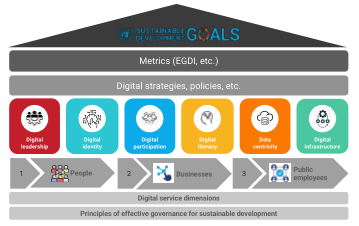

**----- Start of picture text -----** 
Metrics (EGDI, etc.) Digital strategies, policies, etc. leadershipDigital  identityDigital  participationDigital  literacyDigital  centricity Data  infrastructureDigital 1 People 2 Businesses 3 Public employees Digital service dimensions Principles of effective governance for sustainable development **----- End of picture text -----** 

||Photo credit: DPIDG, UN DESA|
|---|---|
||In this chapter:|
||1.1 Introduction 1 1.2 Two decades of digital development through the lens of the United Nations|
||E-Government Survey 2|
||1.2.1 A brief history of the|
||UN E-Government Survey 3|
||1.2.2 E-Government Development|
||Index: principles and components 4|
||1.2.3 Evidence of the role of|
||digital government in accelerating implementation of the 2030 Agenda 8 1.3 Towards a Digital Government Model Framework 11|
||1.3.1 Principles for sustainable development and digital development 13|
||1.3.2 Stakeholders 19|
||1.3.3 Business drivers for digital|
||government 22 1.3.4 Digital policies, strategies and priorities 26 1.3.5 Measuring and evaluating digital government 27|
||1.4 The apex of the Digital Government|
||Model Framework: achieving Sustainable Development Goals and national development objectives 29 1.5 Key recommendations 30|

1 

**Chapter 1** 

2024 UN E-GovErNmENt SUrvEy 

Drawing on the empirical observations of the United Nations E-Government Survey and its longitudinal findings over the past two decades, the proposed Digital Government Model Framework incorporates a principle-based approach to designing digital policies and strategies, as well as a set of key business drivers to guide its implementation so that the needs of stakeholders – including all individuals, businesses and public employees – are well served. With the elaboration of the Model Framework, the chapter aims to provide a robust foundation for countries to enhance and guide current and future digital government efforts in a manner that promotes sustainability and inclusivity and ultimately contributes to the accelerated implementation of the 2030 Agenda for Sustainable Development. 

## **1.2 Two decades of digital development through the lens of the United Nations E-Government Survey** 

In March 2001, the United Nations brought countries together around the emerging concept of digital government, also referred to as e-government. The Third Global Forum on Reinventing Government, devoted to the theme of fostering democracy and development through e-government, provided 122 countries with the opportunity to share practical experiences and innovative solutions in digital government.[4] The response, level of participation, and outcome far exceeded expectations – particularly given the early stage of digital government development and the limited understanding of its scope and potential at that time. 

This was followed in July 2001 by the initial effort of the United Nations Department of Economic and Social Affairs (UN DESA) – at that time the Division for Public Economics and Public Administration – to benchmark digital government development through the publication of a research report entitled _Benchmarking E-Government: A Global Perspective – Assessing the Progress of the UN Member States_ . This groundbreaking report introduced the E-Government Index (later renamed the E-Government Development Index, or EGDI) as a useful tool for policy planners to analyse the principles, approaches, progress, and commitment of countries in the realm of digital government.[5] 

The rationale for introducing a comparative index was supported by the keen interest among stakeholders even at the embryonic stage of digital government development. The index would offer countries an objective point of reference, with e-government progress measured through a series of indicators or targets marking a specific stage of development. countries would be able to assess their own progress over time and in relation to other countries inside or outside their respective regions, and the index components would indicate the nature, convergence and divergence of development challenges at a granular level. The regular monitoring of progress would allow the systematic tracking and evaluation of the efficacy of national digital initiatives. Finally, a comparative global index published by the United Nations would be seen as objectively neutral (not influenced by political bias or commercial interests). 

In 2003, the World Summit on the Information Society (WSIS) adopted the Geneva Plan of Action, which incorporated 11 action lines for sustainable development, introduced in support of broader WSIS initiatives aimed at promoting the use of information and communications Technology (IcT) to build an inclusive information society. listed under action line c7 (IcT applications) are e-government, e-business, e-learning, e-health, and other priority areas. Actions called for within the e-government subsection include enhancing the delivery of government services through the use of IcT, improving the efficiency and transparency of the public sector, and promoting people’s engagement and participation in public governance through digital means. (See box 1.2 in subsection 1.2.3 of the present chapter for information on the implementation and follow-up of action line c7.) 

The world leaders who adopted the 2030 Agenda for Sustainable Development in 2015 recognized that “the spread of information and communications technology and global interconnectedness has enormous potential to accelerate human progress, to bridge the digital divide and to develop 

2 

Chapter 1 • a Digital government moDel Framework For SuStainable Development 

knowledge societies”.[6] Numerous resolutions of the United Nations Economic and Social council and General Assembly have since identified e-government as an important enabler and development tool for achieving the Sustainable Development Goals (SDGs).[7] 

In the 2020 report of the United Nations Secretary-General’s High-level Panel on Digital cooperation, the E-Government Survey is highlighted as a key ranking, mapping and measuring tool supporting digital transformation worldwide.[8] Various reports of the Secretary-General – including _Our Common_ Agenda (2021)[9] and the “Road map for digital cooperation” (2020)[10] – call for the provision of public services that meet the evolving needs of the population in an increasingly digitalized society, and the Survey monitoring and assessment process can help countries identify and address those needs. 

Since its inception, the E-Government Survey has served as a knowledge and policy tool, helping Governments understand their relative and contextual strengths and challenges and providing policymakers with evidence-based information and policy options that can help them mobilize digital government for the implementation of the SDGs and national development strategies. Each edition of the Survey has generated increasing interest among the Member States and other stakeholders, serving as a resource not only for tracking national progress in digital government development but also for learning from global and regional experiences and gaining insights for policy formulation in priority areas. 

## **1.2.1 A brief history of the UN E-Government Survey** 

The first (2001) edition of the Survey, _Benchmarking E-Government: A Global Perspective – Assessing the Progress of the UN Member States_ , laid the basic foundations for tracking digital government development, introducing an objective monitoring and evaluation framework that would evolve over time. There were indications, even then, that the digitalization of government could be transformative. The first edition featured the FirstGov.gov portal of the United States of America in a section on best practices, highlighting the role of digital government in helping restore order and coordinate emergency assistance after the terrorist incident on 11 September 2001 (see box 1.1). 

Box 1.1 The FirstGov.gov portal in the United States: early evidence of effective digital government 

The United States was among the first countries to recognize the vital role digitalization would play in government.  The E-Government Act, adopted in 2001, established the Office of E-Government and the Office of the Federal chief Information Officer within the White House Office of Management and Budget. The Act also established the Federal cIO council, which included chief information officers from across the executive branch of government. A key milestone was the creation of the FirstGov.gov portal (later renamed USA.gov), which was featured in _Benchmarking E-Government: A Global Perspective – Assessing the Progress of the UN Member States_ (the first edition of the United Nations E-Government Survey in 2001) because of the central role it played in restoring order and coordinating emergency assistance in the aftermath of the terrorist incident in New York on 11 September 2001. 

_Sources_ : United Nations, Division for Public Economics and Public Administration, and American Society for Public Administration, _Benchmarking E-Government: A Global Perspective – Assessing the Progress of the UN Member States_ , (New York, 2002), available at https://desapublications.un.org/publications/benchmarking-e-government-global-perspective-2001; and United States, “Twenty years of making government more accessible through the E-Government Act”, GSA Blog Team, 29 December 2022, available at https://www.gsa.gov/blog/2022/12/29/twenty-years-of-making-government-more-accessible-through-the-egovernment-act. 

3 

2024 UN E-GovErNmENt SUrvEy 

The 2001 edition of the Survey predicted the dynamic evolution of digital government, offering an observation that still resonates today: “For a large majority of countries, national e-government program development is occurring in a swift and dynamic manner and for now change is the only constant”.[11] See table 13 in the technical appendix, on the trajectory of the past 12 editions of the Survey, highlighting trends in digital government development both generally and in relation to thematic focal points, and how the EGDI has evolved over a period of more than two decades as a tool for monitoring, analysing, and forecasting digital development in the public sector and identifying relevant trends. 

## **1.2.2 E-Government Development Index: principles and components** 

Because digital government encompasses important public activities that come under scrutiny, objectivity and accountability are extremely important in e-government planning, implementation and evaluation. Measuring and assessing progress in digital government requires robust metrics and key performance indicators (KPIs), along with the adaptive use of emerging technologies such as AI.[12] The EGDI has emerged as a quantitative composite metric and global performance indicator capable of producing levels and rankings of digital development across the 193 Member States and capturing relevant trends. 

Table 1.1 EGDI and LOSI component indices and subindices 

**----- Start of picture text -----** 
Index Components Subindices **----- End of picture text -----** 

|Index|Components|Subindices|
|---|---|---|
||||
|National level E-Government Development Index (EGDI)|Online Services Index (OSI)|Institutional framework (IF)|
|||Services provision (SP)|
|||content provision (cP)|
|||Technology (TEc)|
|||E-participation (EPI) (a) e-information (b) e-consultation (c) e-decision-making|
||Telecommunications Infrastructure Index (TII)|Internet users|
|||Mobile cellular subscribers|
|||Wireless broadband subscribers|
|||Broadband affordability*|
||Human capital Index (HcI)|Adult literacy rate (Al)|
|||Gross enrolment ratio (GER)|
|||Expected years of schooling (EYS)|
|||Mean years of schooling (MYS)|
|||E-government literacy (EGl)*|
|local level local Online Services Index (lOSI)||Institutional framework (IF)|
|||Services provision (SP)|
|||content provision (cP)|
|||Technology (TEc)|
|||Partcipation and Engagement (EPI)|
|||E-government literacy (EGl)*|

* Introduced in the 2024 E-Government Survey 

The E-Government Survey assesses national and subnational online services provision as well as relevant technology infrastructure and human capital indicators, assigning values to various features relating to digital government development. The composite and component indices and subindices reflect progress and gaps in e-government development, offering a rating system that allows comparison and relative rankings. The EGDI and the local Online Services Index (lOSI) are not designed to capture e-government development in an absolute sense, but rather to provide a snapshot of digital progress at a particular point in time. Table 1.1 shows the list of the EGDI and lOSI component indices and subindices. 

4 

Chapter 1 • a Digital government moDel Framework For SuStainable Development 

Figure 1.1 summarizes the evolution of EGDI (or its equivalent) from 2003 to 2024. The methodology section of the Survey (included in the technical appendix) provides additional information on enhancements to the Online Services Index (OSI), Telecommunications Infrastructure Index (TII), and Human capital Index (HcI), the introduction of the lOSI, and changes relating to EGDI and lOSI component indices and subindices over successive editions of the Survey. 

Figure 1.1 The evolution of the E-Government Development Index from 2003 to 2024 

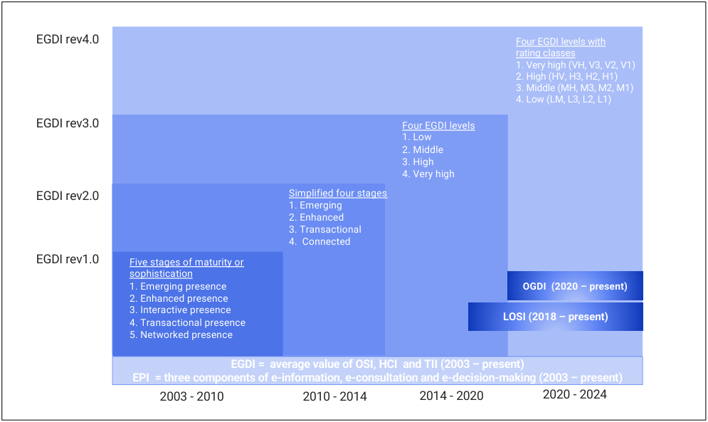

**----- Start of picture text -----** 
EGDI rev4.0 Four EGDI levels with rating classes 1. Very high (VH, V3, V2, V1) 2. High (HV, H3, H2, H1) 3. Middle (MH, M3, M2, M1) 4. Low (LM, L3, L2, L1) EGDI rev3.0 Four EGDI levels 1. Low 2. Middle 3. High 4. Very high EGDI rev2.0 Simplified four stages 1. Emerging 2. Enhanced 3. Transactional 4.  Connected EGDI rev1.0 Five stages of maturity or sophistication 1. Emerging presence OGDI  (2020 – present) 2. Enhanced presence 3. Interactive presence LOSI (2018 – present) 4. Transactional presence 5. Networked presence EGDI =  average value of OSI, HCI  and TII (2003 – present) EPI  = three components of e-information, e-consultation and e-decision-making (2003 – present) 2003 - 2010 2010 - 2014 2014 - 2020 2020 - 2024 **----- End of picture text -----** 

Key methodological principles that have shaped the EGDI and its component indices and subindices 

The concept of a global metric was introduced in the first edition of the E-Government Survey in 2001. The revised methodology adopted for the second edition in 2003 has been used for more than two decades, with minor incremental revisions in the successive editions of the Survey. The 2004 and 2005 editions measured the readiness of countries for e-government, but in 2008 it was determined that “readiness” did not adequately reflect the need for concrete action, so the focus of the Survey shifted to assessing actual e-government development, captured at that time by the term “e-government maturity”. In 2014, it was decided that the conceptual reference to e-government maturity was no longer useful, as digital government approaches were constantly evolving to meet the changing demands and expectations of the population (including specific segments and sectors of society) and to integrate emerging digital technologies. Maturity suggested an end point, while e-government development was and would always be characterized by continuous change. 

Over the period 2016-2024, the Survey methodology has continued to evolve in response to the changing contexts, applications, assessments, demands and trends associated with e-government and digital development. Although there have been improvements and refinements, the Survey methodology has remained anchored in a set of fundamental principles that have endured across the 13 editions (including this one). These principles are as follows: 

5 

2024 UN E-GovErNmENt SUrvEy 

- a) The process needs to be universally applicable to all Member States, with a focus on development goals rather than specific technologies. As emphasized in the 2004 edition, the Survey exists to “assess the progress of ‘access to IcT for all’” and is “considered to be a tool at the disposal of the Government, which, if applied effectively, can contribute substantially to promoting human development. It supports, but does not supplant, the development efforts of Member States.”[13] 

- (b) A binary numeral system (0 and 1) is used to assess features and services in government portals and for most other Survey questions, ensuring a high degree of objectivity. 

- (c) local languages, impartial phrasing, and questions geared towards the average citizen or government respondent are used in an effort to ensure neutral, unbiased assessment independent of any external influence. 

- (d) changes (based on scientific evidence and technological insights) should reflect development trends but not compromise comparability. As noted in the 2001 Survey, “change and improvement must be a permanent part of the process if a country is to achieve the stated goals within its strategic framework and to offer the most inclusive citizen-centric approach.”[14] 

The widespread acceptance of EGDI and the comparative advantage it enjoys as a tool for measuring e-government development derives from these key methodological principles. Essentially, refinements are possible, but alignment with the adopted methodology is vital for ensuring continuity, consistency and comparability for longitudinal analysis. Most of the changes introduced with regard to the metrics are linked to the evolution and increased sophistication and proliferation of digital technologies (including emerging technologies such as AI), the need to reassess development priorities with the adoption of the SDGs, and shifts in the conceptualization of digital government based on national, regional and global trends. 

## The role of the EGDI in both assessing and propelling digital development 

The United Nations E-Government Survey is one of the most frequently downloaded flagship publications of UN DESA, and the E-Government Knowledgebase is one of the most visited websites. The various editions of the Survey have been used extensively by digital ministries and agencies within the Member States for a variety of purposes, ranging from guiding digital policy development and national IcT investment in digital technologies to mustering political leverage to facilitate the implementation of national digital priorities. The impact the Survey has had on digital policymaking can be seen in official reports released by countries such as India[15] and Uruguay.[16] 

The EGDI is widely recognized as an authoritative and comprehensive global metric for assessing the digital development of countries around the world. Its longevity, comprehensive methodology, and global coverage contribute to its pre-eminent status in this domain. The EGDI interfaces with and complements various development indicators and frameworks as it promotes inclusive digital access and services provision, which are crucial for achieving SDG targets related to health, education, economic growth, and reduced inequalities. The EGDI also highlights the important role digital government plays in fostering innovation and competitiveness in the digital economy and digital society. 

The authoritative nature of the EGDI is also evident in how it is utilized by various United Nations agencies, international organizations, think tanks, researchers, and private entities as a credible benchmark for evaluating and comparing the digital government capabilities of countries worldwide. Table 1.2 shows a non-exhaustive list of global assessment frameworks utilizing the EGDI as an input or reference, underscoring how the EGDI provides a _lingua franca_ and common point of reference for analysing the advancement of digital development. 

6 

Chapter 1 • a Digital government moDel Framework For SuStainable Development 

Table 1.2 Use of the EGDI in various global frameworks for assessing digital development 

**----- Start of picture text -----** 
Institution Title of metric, initiative or report Description **----- End of picture text -----** 

|Institution|Title of metric, initiative or report|Description|
|---|---|---|
||||
|United Nations Development Programme|Digital Development compass|The Digital Development compass is a tool developed by UNDP to help countries track their progress in digital transformation. compass indicators are compiled into the Open Digital Development Data Exchange, which includes 189 publicly available data sets and can be accessed on GitHub. Under its Government component, reference is made to the EPI and OSI; under its People component, reference is made to the HcI; and under its connectivity component, reference is made to the TII.|
|International Telecommunication Union|IcT Development Index|The IcT Development Index (IDI) is a composite indicator published by the International Telecommunication Union (ITU) to measure the development of the information and communications technology sector. Reference has been made to the OSI component and EPI subindex of the EGDI.|
|World Bank|GovTech Maturity Index|The GovTech Maturity Index is a composite index that comprises four components with a total of 48 key indicators; 40 are updated or expanded GovTech indicators, and 8 are highly relevant external indicators from sources that include the EGDI, OSI, TII, HcI and EPI.|
|World Intellectual Property Organization|Global Innovation Index|The Global Innovation Index uses the EGDI to assess the innovation performance of economies based on information technology uptake and impact.|
|World Economic Forum|Global competitiveness Index|The 2020 Global competitiveness Report uses the E-Participation Index from the 2018 E-Government Survey for the” e-participation” indicator linked to the “broaden access to basic services” concept as part of the “upgrade infrastructure to accelerate the energy transition and broaden access to electricity and IcT” priority (table A1).|
|Global System for Mobile communications Association|Mobile connectivity Index|The Mobile connectivity Index Methodology 2020 report uses the OSI value from the 2018 E-Government Survey for the “e-government services” indicator within the “local relevance” dimension of the “content and services” enabler (table 1, page 9).|
|Waseda University: Institute of Digital Government|World Digital Government Ranking Survey|This annual survey assesses the digital government processes and achievements of 66 countries and economies. The survey report utilizes EGDI and EPI data; in the 2022 edition, reference is made to the EGDI in section 4.4 and to the E-Participation Index in section 4.7.|
|e-Governance Academy|National cyber Security Index|The National cyber Security Index is a global index that measures the preparedness of national Governments to prevent and manage cyberthreats and other digital security incidents. Reference is made to the EGDI in connection with the Digital Development level.|
|Oxford Insights|Government AI Readiness Index|The Government AI Readiness Index report produced by Oxford Insights assesses how prepared Governments are for the implementation of AI in public services. The 2023 edition, published in December of that year, uses EGDI and TII data.|

7 

2024 UN E-GovErNmENt SUrvEy 

The wide recognition and integration of Survey metrics in academic research is illustrated in figure 1.2, which charts the exponential increase academic articles that include specific mention of E-Government Survey indices, including the EGDI, OSI, EPI, lOSI and OGDI. 

Figure 1.2 Chart showing the exponential increase in academic articles that include specific mention of indices introduced in United Nations E-Government Surveys since 2003 (matches based on exact word searches) 

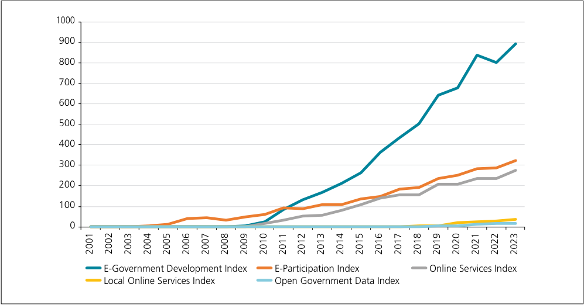

**----- Start of picture text -----** 
1000 900 800 700 600 500 400 300 200 100 0 E-Government Development Index E-Participation Index Online Services Index Local Online Services Index Open Government Data Index 2001 2002 2003 2004 2005 2006 2007 2008 2009 2010 2011 2012 2013 2014 2015 2016 2017 2018 2019 2020 2021 2022 2023 **----- End of picture text -----** 

* As shown in the figure key, these indices include the E-Government Development Index (EGDI) and E-Participation Index (EPI), as well as the local Online Services Index (lOSI) introduced in 2018 and the Open Government Data Index (OGDI) introduced in 2020. 

## **1.2.3 Evidence of the role of digital government in accelerating implementation of the 2030 Agenda** 

Digital government, if well implemented, has the potential to reduce administrative bureaucracy, enhance services delivery, and build public trust. The evidence of digital government having played a role in accelerating the implementation of the SDGs is extensive and diverse. One study concludes that the e-government development indicators used to assess online services, telecommunications infrastructure and human capital are positively and significantly related to the attainment of SDGs in Africa.[17] 

In past editions of the Survey, correlations between the EGDI and various global metrics have been presented as part of the analytical findings. Table 1.3 includes a list of such correlations; for the SDG Index Score, the Gender Inequality Index, the corruption Perception Index, and foreign direct investment, the EGDI serves as a proxy measure for metrics related to the assessment of SDG outcomes and impacts. 

8 

Chapter 1 • a Digital government moDel Framework For SuStainable Development 

Table 1.3 Strong EGDI correlations with the SDG Index Score, Gender Inequality Index, Corruption Perception Index, foreign direct investment, public sector expenditure, and gross national income per capita 

The EGDI as an enabler of all 17 Sustainable Development Goals There is a high correlation between the 2024 EGDI and the 2024 SDG Index score.[18] The Sustainable Development Solutions Network and Bertelsmann Stiftung launched the SDG Index and Dashboards (now the Sustainable Development Report) in 2016. _Beta value     0.9455 P- value       < 0.0001 R-squared       0.80_ **2024 SDG Index Score** The EGDI as a proxy measure for assessing gender equality (SDG 5) _Beta value   - 0.9344 P- value       < 0.0001 R-squared       0.77c_ Gender equality is one of the cornerstones of sustainable development, and public institutions have an important role to play in bridging the gender gap so that no one is left behind. There is a strong inverse relationship between the 2022 EGDI and the 2022 Gender Inequality Index (GII),[19] indicating that there is lower gender inequality (SDG 5) in countries with high EGDI values. The GII is a key initiative of UNDP and is linked to its Human Development Report. It is a composite metric of gender inequality incorporating three dimensions: reproductive health, **2022 Gender Inequality  Index (GII)** empowerment, and the labour market. The EGDI as a proxy measure for assessing foreign direct investment _Beta value     0.0538 P- value       < 0.0001 R-squared       0.39_ Foreign direct investment (FDI) is one of the main sources of finance for developing countries in their efforts to achieve the SDGs. There is a strong positive correlation between the EGDI and FDI. The link between digital government and FDI inflows was supported in a 2021 working paper by the International Monetary Fund.[20] The posited correlation between EGDI values and FDI was tested using EGDI data and World Bank World Development Indicators for 178 countries, and it **2022 foreign direct investment (FDI), USD log scale** was concluded that stronger e-government was associated with increased FDI inflows.[21] It was ascertained that efficient e-government would help lower the costs of doing business and increase potential returns on investment. The EGDI as a proxy measure for assessing levels of corruption in the public sector There is a strong positive correlation between the EGDI and the corruption Perceptions Index,[22] meaning that countries perceived to have high rates of corruption in the public sector will generally score poorly on their ability to deliver digital government services and on e-participation metrics. SDG target 16.5 calls _Beta value     0.6944_ for countries to substantially reduce corruption and bribery in all their forms. _P- value       < 0.0001 R-squared       0.57_ **2022 Corruption Perceptions Index (CPI, normalized)** 

9 

2024 UN E-GovErNmENt SUrvEy 

Table 1.3 _(continued)_ 

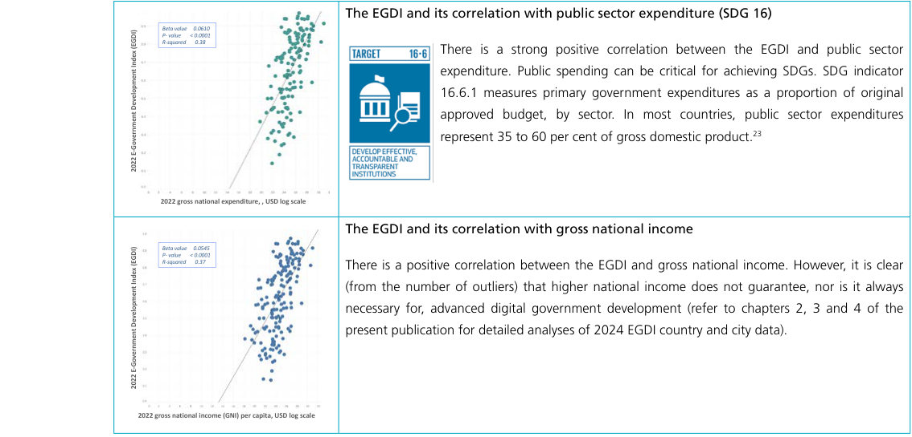

**----- Start of picture text -----** 
The EGDI and its correlation with public sector expenditure (SDG 16) Beta value     0.0610 P- value       < 0.0001 R-squared       0.38 There is a strong positive correlation between the EGDI and public sector expenditure. Public spending can be critical for achieving SDGs. SDG indicator 16.6.1 measures primary government expenditures as a proportion of original approved budget, by sector. In most countries, public sector expenditures represent 35 to 60 per cent of gross domestic product. [23] 2022 gross national expenditure, , USD log scale The EGDI and its correlation with gross national income Beta value     0.0545 P- value       < 0.0001 R-squared       0.37 There is a positive correlation between the EGDI and gross national income. However, it is clear (from the number of outliers) that higher national income does not guarantee, nor is it always necessary for, advanced digital government development (refer to chapters 2, 3 and 4 of the present publication for detailed analyses of 2024 EGDI country and city data). 2022 gross national income (GNI) per capita, USD log scale 2022 E-Government Development Index (EGDI) 2022 E-Government Development Index (EGDI) **----- End of picture text -----** 

In the annual reports of the Secretary-General on progress made in the implementation of and follow-up to the outcomes of the World Summit on the Information Society at the regional and international levels,[24] reference is always made to the EGDI in the action line c7 subsection on e-government (see box 1.2). 

Box 1.2 Follow-up and implementation of the action line C7 subsection on e-government in the Geneva Plan of Action of the World Summit on the Information Society and the use of EGDI indicators in Statistical Commission discussions on e-government monitoring 

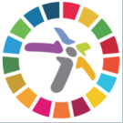

The World Summit on the Information Society was organized by the United Nations to strengthen the desire and commitment of Governments to build an inclusive, people-centric and development-oriented global information society. The Summit was held in two phases – the first in Geneva in 2003 and the second in Tunis in 2005. The meetings produced the Tunis Agenda for the Information Society, a Declaration of Principles, and a Plan of Action that incorporated 11 action lines for sustainable development, including the role of governments and all stakeholders in the promotion of IcTs for development (c1), information and communication infrastructure (c2), capacity-building (c4), and several others. Annual forums are held to facilitate the implementation of the action lines. UN DESA is the facilitator for the follow-up and implementation of the action line c7 subsection on e-government. In its reporting, UN DESA has highlighted the primary objective of e-government under action line c7, which is to leverage IcT to improve the efficiency, transparency and accessibility of government services, largely through the development and adoption of national digital government strategies that are aligned with the general and specific needs of people and businesses and that strengthen public engagement (e-participation). 

10 

Chapter 1 • a Digital government moDel Framework For SuStainable Development 

Box 1.2 _(continued)_ 

In the 2024 “Report of the Partnership on Measuring Information and communication Technology for Development” (E/cN.3/2024/29), it is noted that the UN DESA Division for Public Institutions and Digital Government proposed that the following indicators be added to the Partnership’s core list of IcT indicators in 2021: (a) presence of a national e-government strategy or equivalent; (b) presence of digital identity or similar authentication required to enable access to online services; and (c) presence of a public procurement portal. To better assess the role of IcT in achieving the SDGs, the Partnership has published a thematic list of IcT indicators for the SDGs (including the EGDI) that can be used to measure IcT availability and use in sectors relevant to the SDGs that are not covered in the global SDG indicator framework. 

_Sources_ : United Nations, “World Summit on the Information Society (WSIS): ‘WSIS action lines: supporting the implementation of the SDGs’”, Sustainable Development Goals Knowledge Platform, available at https://sustainabledevelopment.un.org/index. php?page=view&type=30022&nr=102&menu=3170; ITU, “Basic information: about WSIS”, available at https://www.itu.int/net/ wsis/basic/about.html; Partnership on Measuring IcT for Development, A thematic list of IcT indicators for the SDGs, available https://www.itu.int/en/ITU-D/Statistics/Documents/intlcoop/partnership/Thematic_IcT_indicators_for_the_SDGs.pdf; United Nations, General Assembly and Economic and Social council, “Progress made in the implementation of and follow-up to the outcomes of the World Summit on the Information Society at the regional and international levels” (multiple years). See also UN DESA, “Facilitation Meetings by UNDESA for the action lines c1, c11 and c7eGov”, available at https://publicadministration.desa.un.org/ intergovernmental-support/wsis/facilitation-meetings-undesa-action-lines-c1-c11-and-c7egov. 

## **1.3 Towards a Digital Government Model Framework** 

In the evolving hybrid digital landscape, digital services have become an imperative for Governments to effectively serve people, businesses and society as a whole, to address the diverse needs of communities, and to pursue optimal outcomes for sustainable development. 

Digital government systems and initiatives are now highly pervasive in countries around the world, accounting for a significant share of public sector investment and operations.[25] The rapid advancement and global diffusion of digital technology is impacting the public sector ecosystem, propelling digital transformation across sectors and at all levels. 

To create a seamless, inclusive experience for all segments of the population, sometimes with limited public resources, Governments must adopt a systemic, strategic, integrated, whole-ofgovernment approach to digital development that is characterized by policy coherence, supported and strengthened through effective partnerships, and guided by effective principles and business drivers. 

Delivering the desired outcomes and impacts of digital government for sustainable development can be challenging, particularly when risks and threats are not appropriately measured or evaluated. It is no coincidence that countries responding effectively to emergencies or crises such as the cOVID-19 pandemic are highly placed in the EGDI rankings.[26] These leading countries have invested in robust digital government platforms capable of managing risks and have demonstrated the potential to exhibit a high level of resilience in the face of future difficulties or obstacles. This highlights the importance of a solid digital infrastructure and governance framework in managing not only present but also future challenges. 

11 

2024 UN E-GovErNmENt SUrvEy 

A well-developed model framework can offer a systemic road map for implementing effective digital government initiatives – and in strengthening the sustainability of digital government can contribute to broader sustainable development. A number of factors have contributed to the development of the Digital Government Model Framework presented here. Evidence-based analysis has been conducted, lessons have been learned and leveraged, and insights have been gained based on 24 years of data collection and the findings shared in 13 editions of the United Nations E-Government Survey. This wealth of longitudinal knowledge on global digital government development and trends, combined with a comprehensive review of literature on relevant methodologies, resolutions, policies and road maps, has guided the development of the Model Framework, which is designed to provide a robust foundation for developing digital government in a way that reflects and promotes sustainability and inclusivity. This Model Framework is intended to help countries plan and implement successful and sustainable digital government initiatives and to ensure that they are equipped to deal effectively with both present and future challenges. 

The Digital Government Model Framework presented in this section is designed to help guide digital government development at multiple stages. As illustrated in figure 1.3, the integrated Model Framework[27] comprises the following layers: principles, stakeholders, drivers, strategies and priorities, metrics, and goals and outcomes. 

The Digital Government Model Framework provides Governments with a structured yet flexible approach to pursuing digital transformation in the public sector. A “shared platform” feature allows institutions across sectors and levels to collaborate, avoid or minimize duplication, apply consistent principles and standards, and reuse data and components in the realm of digital services across the 17 SDGs. The Model Framework is meant to be a tool policymakers and digital leaders can use to pursue a systemic (and systematic) approach to understanding, analysing and implementing digital initiatives, including those involving the use of AI and other emerging technologies. 

Figure 1.3 United Nations Digital Government Model Framework 

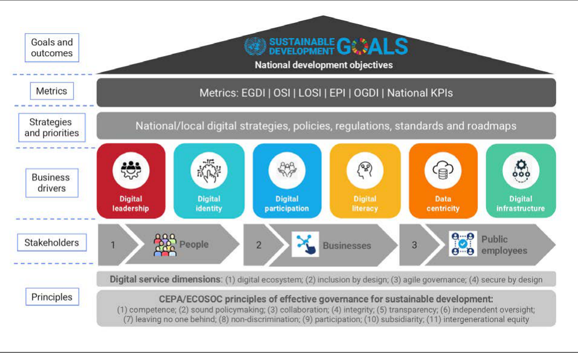

12 

Chapter 1 • a Digital government moDel Framework For SuStainable Development 

## **1.3.1 Principles for sustainable development and digital development** 

Governments have a responsibility to look after the interests of their constituents. Within the present context, this means ensuring that e-government serves all segments of the population and preserves human dignity while also prioritizing privacy and mitigating cybersecurity and other digital risks. Refer to Box 1.1 on the need for checks and balances to prevent the abuse, misuse or underuse of digital platforms and to guard against intentional or unintentional digital dangers (see box 1.3). 

## Box 1.3 The potential and risks of digital development: key points from the 2023 _**World Public Sector Report**_ 

The _World Public Sector Report 2023_ highlights the rapid move to digital government that is reshaping the relationships between people and the State, with both positive and negative impacts. Digital transformation played a vital role during the pandemic, enabling public sector agencies to continue operations and deliver services. Digital technologies enabled the transformation of core systems and functions and the development of more efficient processes, such as online interviewing for job recruitment. They also facilitated data analysis to inform decision-making and supported the disbursement of social protection benefits that were of critical importance during the health crisis. Digital technologies and mobile communications were widely used by Governments in their efforts to combat the crisis and deliver a wide range of public services.  Major challenges encountered in both developing and developed countries included digital exclusion, limitations on freedom of expression online, digital surveillance, and violations of privacy and data protections, highlighting the disconnection between the protection of human rights online and offline. legal frameworks and regulatory reforms have not kept pace with developments in digital technology. Efforts are needed at the national and international levels to harness their benefits while upholding human rights. caution must be exercised to ensure the ethical use of data and prevent discriminatory outcomes, and the need for contextual approaches must be acknowledged. 

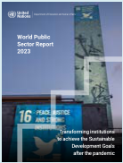

**----- Start of picture text -----** 
World Public Sector Report 2023 Transforming institutions to achieve the Sustainable Development Goals after the pandemic **----- End of picture text -----** 

_Source_ : largely excerpted from United Nations, _World Public Sector Report 2023: Transforming Institutions to Achieve the Sustainable Development Goals after the Pandemic_ (New York, 2023), pp. xv, xix and 4, available at https://desapublications.un.org/ publications/world-public-sector-report-2023. 

With the diversity of needs and circumstances among different countries, there is no one single formula for building a digital government platform. Governments have taken distinct approaches to developing and delivering digital public services, from engaging different types of stakeholders to managing degrees of digital accessibility. Regardless of which approaches are employed, the digital development process should be guided by a set of people-centric core values or principles. 

From the research findings of past editions of the E-Government Survey, a set of common principles has emerged that are instrumental in helping to ensure that digital government platforms achieve the desired sustainable outcomes and development impacts. Applying such principles not only guides implementation but can also identify governance challenges and opportunities emerging around digital transformation and the rapid evolution of a hybrid digital society. 

13 

2024 UN E-GovErNmENt SUrvEy 

## Principles of effective governance for sustainable development 

While digital development is a cross-cutting enabler across all 17 Goals of the 2030 Agenda, principles relating to Goal 16 are most relevant in terms of guiding digital transformation in the public sector. Goal 16 focuses on promoting just, peaceful and inclusive societies and building effective, inclusive and accountable institutions. The 11 principles of effective governance for sustainable development developed by the committee of Experts on Public Administration and endorsed by the United Nations Economic and Social council in 2018 can provide useful guidance in this regard, as they address a range of governance challenges associated with the implementation of the SDGs.[28] There are three domains encompassing a total of eleven principles, each of which can be linked to commonly used government strategies, and many of which relate directly or indirectly to digital government. Figure 1.4 offers a graphic depiction of the three domains and eleven principles, and table 1.4 describes both the general application of the principles and their relevance to digital development. 

Figure 1.4 Three domains and eleven principles of effective governance for sustainable development 

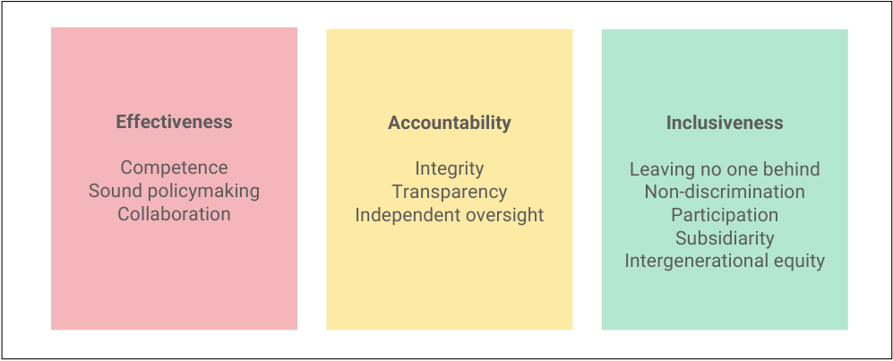

**----- Start of picture text -----** 
Effectiveness Accountability  Inclusiveness Competence Integrity  Leaving no one behind Sound policymaking  Transparency  Non-discrimination Collaboration Independent oversight Participation Subsidiarity Intergenerational equity **----- End of picture text -----** 

_Note_ : These 11 principles were developed by the committee of Experts on Public Administration and endorsed by the Economic and Social council in 2018. 

14 

Chapter 1 • a Digital government moDel Framework For SuStainable Development 

Table 1.4 Digital government in relation to the 11 principles of effective governance for sustainable development 

|Principles|Description|Commonly used strategies that are directly or indirectly related to digital government|
|---|---|---|
|Effectiveness|||
|1. competence|To perform their functions effectively, institutions are to have suffcient expertise, resources and tools to deal adequately with the mandates under their authority.|• Promotion of a professional and digitally competent public sector workforce • Training of civil servants to facilitate the acquisition of digital skill sets (see subsection 1.3.3) • Digital leadership development (see subsection 1.3.3 on digital leadership) • Investment in e-government|
|2. Sound policymaking|To achieve their intended results, public policies are to be coherent with one another and founded on true or well-established grounds, in full accordance with fact, reason and good sense.|• Strategic planning and foresight and promotion of coherent policymaking (see subsection on digital ecosystem) • Use of digital platforms in monitoring and evaluation systems • Data-sharing (see subsection 1.3.3 on data centricity)|
|3. collaboration|To address problems of common interest, institutions at all levels of government and in all sectors should work together and jointly with non-State actors towards the same end, purpose and effect.|• Centre of government coordination in digital development (see subsection 1.3.3 on digital leadership) • Collaboration, coordination, integration, and dialogue across levels of government and functional areas (see section on digital ecosystem) • Network-based governance and multi-stakeholder partnerships (see subsection 1.3.2 on stakeholders)|
|Accountability|||
|4. Integrity|To serve in the public interest, civil servants are to discharge their offcial duties honestly, fairly and in a manner consistent with soundness of moral principle.|• Anti-corruption practices (see table 1.4) • Competitive public procurement through e-procurement platforms (note that the OSI assesses the availability and extent of e-procurement platforms)|
|5. Transparency|To ensure accountability and enable public scrutiny, institutions are to be open and candid in the execution of their functions and promote access to information, subject only to the specifc and limited exceptions as are provided by law.|• Proactive disclosure of information through national portals • Budget transparency • Use of open government data (see subsection 1.3.3)|
|6. Independent oversight|To retain trust in government, oversight agencies are to act according to strictly professional considerations and apart from and unaffected by others.|• Promotion of the independence of regulatory agencies, including those involved in AI regulation or AI governance (see 2024 Survey addendum on AI in the public sector) • Arrangements for review of administrative decisions by courts or other bodies (including the availability of e-justice, assessed in the OSI) • Respect for legality (digital identity)|

15 

2024 UN E-GovErNmENt SUrvEy 

Table 1.4 _(continued)_ 

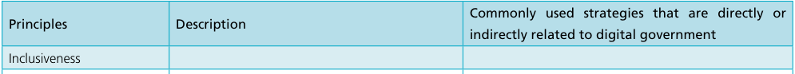

**----- Start of picture text -----** 
Commonly used strategies that are directly or Principles Description indirectly related to digital government Inclusiveness **----- End of picture text -----** 

|Principles|Description|Commonly used strategies that are directly or indirectly related to digital government|
|---|---|---|
|Inclusiveness|||
||||
|7. leaving no one behind|To ensure that all human beings can fulfl their potential in dignity and equality, public policies are to take into account the needs and aspirations of all segments of society, including the poorest and most vulnerable and those subject to discrimination.|• Promotion of social equity (see subsection on inclusion by design) • Data disaggregation (see section on data centricity)|
|8. Non-discrimination|To respect, protect and promote human rights and fundamental freedoms for all, access to public service is to be provided on general terms of equality, without distinction of any kind as to race, colour, sex, language, religion, political or other opinion, national or social origin, property, birth, disability or other status.|• Prohibition of discrimination in public services delivery through multilingual services delivery (see subsection on inclusion by design) • Accessibility standards (measure of W3C in OSI) • Universal birth registration (digital identity)|
|9. Participation|To have an effective State, all signifcant political groups should be actively involved in matters that directly affect them and have a chance to infuence policy.|• Multi-stakeholder forums • Participatory budgeting • Community-driven development (measure of e-participation) • Regulatory process of public consultation (measure in e-participation under the element of e-consultation)|
|10. Subsidiarity|To promote government that is responsive to the needs and aspirations of all people, central authorities should perform only those tasks which cannot be performed effectively at a more intermediate or local level.|• Fiscal federalism • Strengthening urban governance • Strengthening municipal fnance and local fnance systems through the measure of the local Online Services Index (lOSI) • Enhancement of local capacity for prevention, adaptation and mitigation of external shocks (multilevel governance, capacity-building of local authorities through lOSI fndings)|
|11. Intergenerational equity|To promote prosperity and quality of life for all, institutions should construct administrative acts that balance the short-term needs of today’s generation with the longer-term needs of future generations.|• Sustainable  development  impact  assessment (including e-waste management, support of EGDI in  sustainable  development;  see subsection 1.2.3 on evidence) • Promotion of long-term territorial planning and spatial development • Ecosystem management (see subsection on digital ecosystem)|

_Sources_ : The descriptions are excerpted from Geert Bouckaert and others, “Effective governance for sustainable development: 11 principles to put into practice”, International Institute for Sustainable Development, SDG Knowledge Hub, 7 August 2018, available at https://sdg.iisd.org/commentary/guest-articles/effective-governance-for-sustainable-development-11-principles-to-put-in-practice/. The commonly used strategies are adapted from annex II of United Nations, Economic and Social council, “Elaborating principles of effective governance for sustainable development”, note by the Secretariat, 14 February 2018 (E/c.16/2018/5), available at https://documents. un.org/doc/undoc/gen/n18/027/26/pdf/n1802726.pdf?token=KB2ZRUFMMjYgGF5bRJ&fe=true. _Note_ : Parenthetical references in the third column are to sections or subsections within the present chapter or other parts of the 2024 Survey. 

16 

Chapter 1 • a Digital government moDel Framework For SuStainable Development 

## Digital service dimensions: applying the principles of effective governance to digital transformation 

The ability of Governments to understand and manage the multidimensional dynamics of digital transformation is critical. The fast and at times disruptive pace of digital development poses various challenges to digital government. There is a need to consider how the comprehensive principles of effective governance could be used to guide digital development in the public sector – for example, by ensuring the responsible and ethical use of technologies such as AI (see the Survey addendum on AI in the public sector). 

The subsections below introduce a set of digital dimensions guided by the principles of effective governance. These principles are intended to offer a strong point of reference and a firm foundation for e-government development, helping to ensure that technologies are used adaptively, effectively and ethically to achieve positive outcomes and impacts and to minimize harm.[29] 

## _Digital dimension (1): Digital ecosystem_ 

As evidenced by recent trends, there has been a paradigm shift towards building a digital government ecosystem – a move away from the traditional siloed, top-down models to more networked, collaborative, agile and adaptive systems that can better address complex societal needs in the hybrid digital age. 

The building of a digital ecosystem should be guided by the principles on sound policymaking and collaboration espoused by the Economic and Social council and the committee of Experts on Public Administration. An ecosystem in digital government involves leveraging digital platforms to facilitate collaboration, coordination and value co-creation among various stakeholders, including government agencies, businesses and individuals.[30] This digital dimension recognizes that effective digital transformation requires not only technology but also new models of effective governance following the principles of effective governance highlighted above, with digital cooperation and collaboration across institutional, sectoral and judicial boundaries. It requires a holistic, collaborative model for delivering public services that leverages interconnected networks of stakeholders and technologies. 

As an integral part of the digital ecosystem, whole-of-government and whole-of-society strategies are essential for integrating services and data across ministries, agencies and jurisdictional levels (including regional and local authorities) through interoperability frameworks, enterprise architectures, and multi-stakeholder partnerships. The shift involves transitioning from a multichannel strategy to a “single front door” (omnichannel) strategy to accessing public services and interacting with government. The ecosystem also involves strengthening engagement between governmental and non-governmental actors in addressing complex challenges. creating networks of interconnected systems and communities rather than relying solely on hierarchical structures leads to more flexible and inclusive digital governance, as well as e-waste reduction and management. 

The Government Digital Service (GDS) in the United Kingdom has employed the strategic concept of “Government as a Platform” since 2015 to guide and accelerate its digital transformation, clearly articulating that this provides a route to improving the provision of public services; in a GDS blog, the former executive director of the Service asserts that this supports the delivery of “brilliant, usercentric government services” that explicitly target user needs.[31] Platform Government offers a new way of building digital public services using a collaborative development model that allows partners, providers and communities to share in the development and improvement of digital processes and capabilities for the benefit of society.[32] 

17 

2024 UN E-GovErNmENt SUrvEy 

## _Digital dimension (2): Inclusion by design_ 

With the rapid advancement of technologies and digital development, e-government is often not fully inclusive. Despite the significant progress achieved in recent decades, the importance of inclusivity has frequently been overlooked. As public services and societal frameworks increasingly pivot towards digital reliance, those deprived of digital access, digital tools or digital literacy face obstacles in navigating the promises and potential of the digital era. The easiest-to-reach groups (usually those with higher incomes and more privileged status) have generally benefited most from the significant advances in digital government, while many among the poorest and most vulnerable populations have been left behind. 

Inclusiveness is one of the three domains of EcOSOc/cEPA principles on effective governance, encompassing the four principles of (i) leaving no one behind; (ii) non-discrimination; (iii) participation; and (iv) subsidiarity. It has also been said that the new face of inequality is digital. Digital government can serve as an equalizer, but only if it is accessible to all members of society.[33] This was elaborated in the 2022 Survey, which recommended that “leaving no one behind” should become the guiding principle for digital development. Inclusion by design should be prioritized over digital-by-default strategies ensure that the needs of the most vulnerable are met. It is essential for policymakers to first recognize that those excluded from digital transformation are at increased risk of being left behind and to take proactive steps to ensure meaningful digital inclusion for all, and respecting one’s rights and privacy. An integrated framework focused on optimizing data, design and delivery was introduced in the 2022 Survey to shape inclusive digital development, ensuring that online services are accessible, affordable and user-friendly and benefit all segments of society. 

In France, the Digital Republic Act (loi pour une République numérique) requires that public sector websites be fully accessible by 2025.[34] The General Accessibility Framework for Administrators (Référentiel général d’amélioration de l’accessibilité), based on WcAG 2.0 and 2.1 AA standards, is being implemented to serve as the official guide for improving web accessibility. 

_Digital dimension (3): Agile governance_ 

The development of digital services has seen a significant shift from traditional waterfall methodologies to more dynamic or agile governance.[35] In the 1990s and 2000s, digital initiatives in the public sector were managed based on the waterfall model, and public institutions relying on linear and sequential development processes often struggled with changing requirements and slow decisionmaking. In the 2010s, many countries adopted more agile governance, which emphasize flexibility, iterative development, and continuous feedback. With agile governance, new requirements can be accommodated late in the development process, and parts of the system can be delivered early, accelerating digital transformation. As articulated in its 2022 Digital Ambition initiative, canada has adopted agile development to respond to changing business needs and to meet citizens’ evolving expectations in the digital age.[36] 

The digital dimension of agile governance tends to be less process oriented, incorporating innovation such as through digital sandboxing and minimal viable product (MVP) strategies. Sandboxing involves the testing of new technologies and regulatory approaches in a controlled environment, fostering innovation while managing risks. Sandboxing is becoming increasingly common and has been applied successfully in many different settings and contexts, as noted in a 2021 UN DESA policy brief.[37] Digital sandboxing is agile in the sense that it enables safe experimentation and iterative learning, which are crucial for developing robust e-government solutions, while MVP involves developing the simplest version of a product that can be released to users to gather feedback and make iterative improvements. 

18 

Chapter 1 • a Digital government moDel Framework For SuStainable Development 

Agile governance and the deployment of foresights will allow Governments to make rapid gains and generate momentum in digital innovation and adaptability, creating flexible governance structures for digital government that can adapt to changing needs and leverage new and emerging technologies, including AI. 

## _Digital dimension (4): Secure by design_ 

The increased pervasiveness of digital government has led to a worrisome increase in cyberfraud, cybercrime and cyberattacks in recent years. The digital dimension of “Secure by design” involve the integration of security measures into every phase of digital service and infrastructure development, ensuring that security is a core aspect rather than an afterthought. This dimension better protects digital resources, including assets, workflows, accounts, and other sensitive data, and strengthens public trust. 

In the national strategy for digital platform government in the Republic of Korea, the zero trust strategy is identified as crucial for establishing a secure digital foundation.[38] ,[39] In Singapore, the Government Zero Trust Architecture (GovZTA) is a framework for implementing a “never trust, always verify” approach to cybersecurity across government agencies.[40] Developed in response to rising cyberthreats amid accelerated digital transformation, GovZTA is governed by four key principles: applying least privilege and enforcing access control, limiting lateral movement, integrating security automation and orchestration, and enhancing detection and response. The implementation framework consists of five technical pillars (identity, devices, networks, applications and data) and two enablers (visibility and automation plus governance). At the core of the zero trust model is the “zero trust engine”, which comprises two key components – the policy decision point (authority source) and the policy enforcement point (gatekeeper) – that are used to verify and validate every connection or transaction request within the network before access is granted. 

## **1.3.2 Stakeholders** 

Broadly speaking, there are three stakeholder groups in digital government: people, businesses and public employees. Along with these three primary constituents (each with specific needs and objectives addressed through digital government platforms), there are stakeholders such as civil society institutions (including academia) and various international and regional organizations operating in the realm of digital government. 

As part of the Digital Government Model Framework, it is essential to identify and assess the specific needs and demands of these stakeholder groups. 

## Stakeholder: people 

The dynamic connection between the public sector and the first group of stakeholders is sometimes referred as a government-to-citizen or government-to-consumer (G2c) relationship. The 2030 Agenda principle of leaving no one behind recognizes the importance of addressing inequalities and bringing everyone on board to ensure sustainable development. In the sustainable development context of the E-Government Survey, “people” is used as a general term to refer to a group of individuals living in a particular country or region that should be provided basic services (including digital services) by the Government. The term is used to describe the population, regardless of their legal status or rights within a specific country, so residents, visitors, immigrants and refugees, as well as civil society in general, are included along with citizens. 

In their interactions with e-government platforms, people generally prefer to have easy access to digital information and services and to complete all transactions fully online through a single, integrated system of services delivery. For example, new parents would like to be able to secure a birth certificate, apply for child benefits, register for parental leave, and access other relevant services 

19 

2024 UN E-GovErNmENt SUrvEy 

online using one easy process rather than submitting multiple applications and interacting with multiple agencies. Governments can provide a seamless user experience by consolidating separate digital channels into an omnichannel for streamlined services provision, pursuing what is increasingly being referred to as a life-event approach. 

As key stakeholders, people play a crucial role in shaping digital development in a country. Their involvement and advocacy, especially through e-participation mechanisms (such as in e-information, e-consultation and e-decision-making), can significantly influence the success and effectiveness of digital initiatives. The validation and continued development of digital services are supported by the strong uptake and usage of online services and high levels of user satisfaction, leading to increased adoption, which in turn can lead to more efficient service delivery and cost savings and greater inclusiveness and accountability. 

## Stakeholder: businesses 

Digital services are increasingly needed to support businesses in the burgeoning digital economy; this is especially true for micro-, small and medium-sized enterprises. As part of integrated national digital strategies, online platforms are provided for online business registration, licensing, permits, tax filing, procurement processes, and other government-to-business (G2B) transactions. The goal is to simplify administrative procedures, reduce red tape, and improve the ease of doing business through digitalization. 

The global digital economy is growing rapidly and substantially, with projections suggesting it could account for 25 per cent of the world economy by 2025.[41] This growth is driven by the increasing integration of digital technologies across various sectors, including commerce, finance, and services. This has led to the demand for Governments to provide digital services and other forms of digitalized support for businesses, including data, a security infrastructure, and regulatory oversight. Digital government is having a growing impact on national economies as value pools shift within and across industries towards a digital economy. concerted efforts are needed to ensure that both startups and established companies can develop new business models and digitalize their existing operations with ease. 

In working with this stakeholder group, Government agencies are having to assume multiple roles – as platform and service providers, facilitators, and enforcers – to support businesses in the hybrid digital world. In the realm of e-government, businesses are engaged at many levels – participating in shaping the development of specific G2B services, collaborating and partnering with public institutions in driving innovation in the public sector through new technologies and practices, and engaging in advocacy and influencing policy for the development of national digital strategies.[42,43] 

In china, Beijing Service has been set up as a “digital and international service platform” that offers diverse content available in eight languages and provides streamlined, up-to-date, user-friendly digital services catering to the needs of companies as well as expatriates.[44] Oman has adopted a life-event approach to addressing the needs of businesses, supporting commercial enterprises throughout their life cycle – from incorporation and applying for permits and licences to company dissolution.[45] In Bangladesh, a UN DESA sandboxing project introduced the Smart Business Profile Platform (SBPP), “a revolutionary digital bridge” connecting cottage, micro-, small and medium-sized enterprises (cMSMEs) with financial institutions and other digital services.[46] By simplifying and streamlining the loan application and disbursement process, the SBPP hopes to address the $3.1 billion financing gap affecting cMSMEs in Bangladesh. 

## Stakeholder: public employees 

In e-government development, attention is now focused on ensuring that services provision is people-centred and inclusive, but there is another aspect of public administration that is too often neglected. There has not been enough research or emphasis on the need to strengthen the capacities 

20 

Chapter 1 • a Digital government moDel Framework For SuStainable Development 

and capabilities of the public sector workforce in setting up and maintaining digital government operations and engaging in continuous adaptation as new technologies and approaches emerge. 

E-government requires digital interactions among institutions and public employees, data-sharing among government agencies, and high levels of coordination, collaboration and efficiency in public governance. The comprehensive digital transformation of the public sector is a complex effort that will involve virtually all public employees at the national and subnational levels, so it is essential that the public sector workforce be provided with the skill sets, competencies and capabilities needed to move the process forward. 

The skills required for digitalization extend beyond technological competencies. It is, of course, necessary to support the acquisition of core digital capabilities in areas such as cloud computing, artificial intelligence, machine learning, data security and Web 3.0, but it is equally important to ensure that public employees are strong in terms of data literacy and digital literacy and are able to adopt digital mindsets and participate in a process of continuous evolution. At the higher levels of government, there needs to be an openness to innovation in policy development, regulatory approaches, and institutional restructuring. The FutureGov High Impact Initiative on Building Public Sector capabilities, supported by UN DESA and UNDP, calls for a sense of urgency and renewed purpose in strengthening and transforming public sectors to accelerate the achievement of sustainable development objectives (see box 1.4). 

Box 1.4 The adoption of the FutureGov High Impact Initiative at the SDG Summit in 2023 

FutureGov is one of twelve high-impact initiatives adopted at the SDG Summit in 2023. FutureGov is co-led by UN DESA and UNDP and is supported by a coalition of Member States as well as the World Bank and various public and private institutions. 

Held on 17 September 2023 as part of the SDG Action Weekend, the session on FutureGov brought a renewed sense of purpose and urgency to strengthen and transform public sectors to accelerate sustainable development. The public sector plays an essential role in supporting all institutions providing essential and critical services, including shelter, food, education, social protection, and health care, and in upholding fundamental rights, including gender equality and the right to a clean, healthy, and sustainable environment, with implications for all 17 SDGs and leaving no one behind. It is essential to develop critical public sector capabilities for the future to create and maintain the conditions necessary for countries to effectively navigate the transition to sustainable development. “The FutureGov initiative is designed to support Member States through their public sector ‘transformation journeys’ by building public sector skillsets for resilient institutions, shifting mindsets towards systems thinking and foresight, and facilitating social and policy innovation for results.” Acquiring and strengthening skill sets will allow adaptation and learning at the institutional level in the face of incomplete information and radical uncertainties, changing mindsets will promote higher-level predictive and analytical thinking to improve governance and optimize data and digital solutions, and supporting innovation will promote creative social and policy solutions beyond digitalization. 

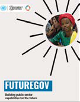

The Group of Friends of FutureGov, established to engage in advocacy and informal consultation, held its first meeting on 14 February 2024. The meeting was attended by 13 Member States as well as institutional partners such as the World Bank, European Union, and Organisation for Economic co-operation and Development. The Group of Friends called for immediate action to support Governments in their public sector transformation journeys and requested the FutureGov Facility to provide direct capacity-building support tailored to the needs of each country. 

_Source of quote_ : United Nations, “SDG Summit 2023, 18-19 September 2023, New York: FutureGov session details”, available at https://www.un.org/en/conferences/SDGSummit2023/SDG-Action-Weekend/futuregov. 

21 

2024 UN E-GovErNmENt SUrvEy 

## **1.3.3 Business drivers for digital government** 

There are many risks, threats and weaknesses that can undermine digital development in the public sector, including a lack of political leadership, data governance gaps in the areas of personal privacy and protection, and the failure of legal frameworks and regulatory reforms to keep pace with rapid developments in digital technology applications (including the use of AI) in the public sector. While the advantages of digitalization are unambiguous and manifold, so are the risks if not managed well. 

Six business drivers – digital leadership, data centricity, legal digital identity, effective e-participation, digital literacy, and a robust digital infrastructure – have been identified to ensure the effective deployment of the digital government model framework in creating a seamless, inclusive digital experience serving all segments of the population (see figure 1.5). 

Figure 1.5 Six business drivers of the United Nations Digital Government Model Framework 

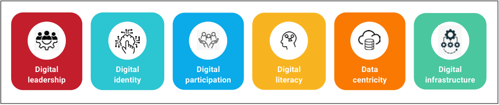

**----- Start of picture text -----** 
Digital  Digital  Digital  Digital  Data  Digital leadership identity participation literacy centricity  infrastructure **----- End of picture text -----** 

## Digital leadership 

As noted in the 2020 edition of the United Nations E-Government Survey, “a strong political will, strategic leadership, and the commitment to expanding the provision of digital services” can often improve a country’s comparative EGDI ranking.[47] Effective digital development calls for digital leadership that can articulate a common vision, adopt holistic strategies, implement robust digital platforms, and build a vibrant digital ecosystem. countries at the top of the EGDI rankings – such as Denmark, Estonia, Singapore, Iceland, the Republic of Korea and Saudi Arabia – demonstrate strong digital leadership. 

With technologies such as AI continuing to disrupt digital development and public sector operations, digital government leaders need to possess soft skills such as adaptability, problem-solving, critical thinking, and effective communication – and to oversee the development of those competencies within the public sector workforce. To secure internal and external support for digitalization for sustainable development, politicians and senior policymakers need to understand how digital government can address public sector deficiencies. A successful digital transition requires not only a digital mindset, but also the merging of digital and development policymaking at both the national and local levels. Key government positions in digital development vary from one country to another and are reflected in titles such as digital minister, chief information officer, chief digital officer, chief technology officer, chief information security officer, and chief digital information officer, among others. 

Responsibility for digitalization cannot be siloed within a single department or division. Instead, a country’s digital transition needs to sit at the heart of political decision-making and preferably be overseen by the office of the head of State or Government or by a minister fully focused on digitalization, given its cross-cutting nature. In New Zealand, responsibility for government 

22 

Chapter 1 • a Digital government moDel Framework For SuStainable Development 

digitalization lies with the Minister for Digitising Government, a portfolio created in 2023,[48] and the Minister is supported by a chief digital officer, a chief data steward and a chief information security officer. 

## Legal digital identity 

Digital identity is the gateway to digital services. Without a legal digital identity, people are invisible to government agencies and at risk of being excluded from accessing even the most basic services. comprehensive digital identity systems are also the gateway to digital trade and the development of the digital economy, which are high priorities for many countries in their bid to achieve growthdriven digital transformation. 

Recent progress in operationalizing digital identity has been impressive; however, millions of people worldwide still lack the means to establish a digital identity, particularly a legal one; individuals facing the greatest challenges in this regard include those living in least developed countries and conflict zones.[49] Everyone has the right to be recognized as a person before the law, as enshrined in article 6 of the Universal Declaration of Human Rights and article 16 of the International covenant on civil and Political Rights. SDG target 16.9 (providing legal identity for all, including birth registrations, by 2030) is key to advancing the 2030 Agenda commitment to leave no one behind. Digital identity plays a central role in digital government development and data applicability, as it provides the basis on which data can be safely and securely shared within and between agencies to improve public services and their delivery. Box 1.5 illustrates how an effective digital identity system in India has increased the efficiency and cost effectiveness of public services provision. 

Box 1.5 Aadhar in India – the largest biometric identification system in the world 

Aadhaar, the national biometric identification system in India, is the largest of its kind in the world and has been widely praised. The scheme is voluntary, but most Indians have signed up since it was launched over a decade ago. Each of the country’s 1.33 billion residents is eligible to receive a unique 12-digit digital identity number. With this number, people can access as many as 300 central government services and up to 400 State-run schemes. The use of this system also reduces public sector expenditure; so far, the Government has saved an estimated 100 billion Indian rupees ($1.27 billion) simply by paying State benefits directly to citizens, which has greatly reduced bureaucratic red tape and opportunities for corruption. The Aadhaar system has spawned multiple innovations, including the creation of a digital storage facility known as Digilocker. This app-based service enables citizens to upload key documents, which streamlines their interactions with government bodies and a number of other entities, including fintech services and insurers. Digilocker now has more than 100 million users and holds more than five billion documents. There are, nonetheless, various challenges in implementing the Aadhaar system, especially on the inherent risks of security and privacy to personal data, as well as concerns of the exclusion and denial of public services due to various forms of digital divides.[50] 

## Digital participation 

The 2030 Agenda for Sustainable Development emphasizes the importance of participatory processes. In the 2020 Survey, e-participation is highlighted as a key dimension of governance and one of the pillars of sustainable development.[51] Within the Survey framework, e-participation is assessed based on features relating to the online provision of public information, e-consultations, and e-decision-making, generally through e-government portals and other government websites. 

23 

2024 UN E-GovErNmENt SUrvEy 

Two decades of experience with e-participation have demonstrated the critical importance of linking digital participation, or e-participation, initiatives with formal institutional processes, as this allows both the Government and constituents to see that public participation can have an impact. Integrating e-participation activities in regular tasks and processes within public organizations, as opposed to siloing public engagement so that it is detached from the workings of government, is very important for changing the administrative culture and mindset around public engagement so that it becomes a core component of e-government and sustainable over time. One reason for the relatively slow growth of effective e-participation in e-government is that the process of institutionalizing e-participation remains poorly understood. There are challenges on the consumer end as well, as the willingness of people to engage in digital forms of participation in public affairs (particularly on a sustained basis) depends on their level of trust in government institutions and their trust of digitalization in general and of certain components of participation platforms such as social media. 

## Enhancing digital literacy 

low levels of digital literacy, particularly in vulnerable and marginalized communities, pose a challenge to the implementation of inclusive digital government. In today’s hybrid digital age, every individual needs some level of digital literacy – as reflected in SDG indicator 4.4.1, which measures how many youth and adults have the right information technology skills. 

Past editions of the E-Government Survey have addressed the importance of digital literacy. In the 2020 Survey, it is observed that “developing cybersecurity and broader digital literacy capacities should enable e-government users, including vulnerable groups and minorities, to become more secure online, to demand data security and safety protections, and to defend themselves against threats”.[52] The 2022 edition of the Survey asserts that “in formulating [digital] policies, it is particularly important to promote digital literacy and narrow the digital-skills gaps of older people through tailored peer-to-peer or intergenerational training programmes. In the fast-changing digital environment, developing, strengthening, and maintaining digital literacy requires a life-course approach.” It is also emphasized that “access and affordability are closely linked to digital literacy, as opportunities to improve digital competency mean little when individuals are digitally excluded or do not understand how they might benefit from digital connectivity”.[53] 

Very often, the first step in achieving digital literacy is building digital awareness. Some segments of the population may not even know that digital services are available or that there are avenues for acquiring or improving digital literacy skills, so campaigns that promote awareness can help drive digital inclusion efforts. capacity-building programmes are necessary to educate and empower people to effectively utilize digital services, ensuring that no one is left behind in a rapidly digitalizing world. Digital government solutions should be adapted to work in different contexts for people with varying levels of digital capacity. Digital transformation is not just about harnessing technology; it also requires having the requisite digital skills to adapt to new innovations. Box 1.6 provides a brief description of the e-government literacy subindex newly incorporated into the HcI and EGDI in 2024. 

Box 1.6 Introducing the concept of e-government literacy in the E-Government Survey 

In its 2024 edition, the United Nations E-Government Survey introduces e-government literacy (EGl) as new area of assessment. As a subindex of the HcI, the EGl measures the ability of all segments of the population, especially vulnerable groups, to take full advantage of available e-government services and e-participation opportunities. Although the new indicators are more focused on the supply side, it is important that e-government literacy be promoted on the demand side as well, and through both push and pull factors. 

24 

Chapter 1 • a Digital government moDel Framework For SuStainable Development 

## Data centricity 

Data centricity is the concept and practice of positioning data as a core strategic asset in all digital development, services and applications, regardless of the technologies used. Data-centric institutions see data as a central, independent asset.[49] The increased adoption of data-centric approaches is evident in the strengthening of data governance, the opening of government data, and the leveraging of big data and new technologies such as AI in many countries around the world. The 2020 edition of the Survey highlights the importance of data-centric e-government, noting that optimizing government data allows public institutions to become more productive, accountable and inclusive.[50] Data-centric government also builds public trust and strengthens the trustworthiness of public institutions. An integrated national data governance framework that addresses relevant policies, institutions, people and processes is needed to maximize the benefits of data sharing including through open government data, and to minimize the risks associated with data governance, in particular those related to data security and personal data privacy. 

One important concept in data centricity is the “single source of truth” (SSOT), which in the digital context refers to the aggregation of all government data into one central, digitally accessible location, enabling sharing across the public sector. In practical term, this relates to a single, unified, and authoritative source for each data point or piece of information within the Government’s systems and databases. Key aspects of SSOT in digital development include (a) providing centralized data management, (b) ensuring consistency so that all users and applications can access the same up-todate information, (c) reducing redundancy by eliminating duplicates or conflicting versions of data across different systems, (d) improving data quality by maintaining data accuracy and integrity, and (e) enhancing efficiency through streamlined data access and updates across government agencies. Several countries – including Egypt, Fiji, Poland, South Africa, Tonga, Singapore and Uzbekistan – indicated in the Member States Questionnaire responses submitted for the 2024 Survey that they have incorporated SSOT as part of their digital government strategy.[51] 

## Building and maintaining a robust digital Infrastructure 

Another key driver supporting the implementation of the digital government model framework is a robust digital infrastructure, which is developed not only through updating and modernization but also by integrating and streamlining digital services across the whole of government and the digital ecosystem. 

A shared digital infrastructure enhances efficiency by enabling faster service deployment and reducing costs through the centralization of resources. It also ensures robust digital security and compliance, promotes consistency and interoperability, and facilitates seamless data exchange and collaboration between institutions and agencies. With a fully integrated system, advanced technologies such as AI can be leveraged more effectively to improve digital services and business workflows. 

Very often, a shared digital infrastructure includes platforms and common “building blocks” or “stacks” that are established to enable different parts of government and external partners to work together more effectively and efficiently, including through sectoral networks and across levels of government. The foundational layers of most digital infrastructure platforms include digital identity and data management, as well as digital payment platforms. With modular, open-source digital public infrastructure, countries can adopt next-generation, interoperable systems – and those with antiquated legacy systems can catch up by leapfrogging though a generation of digital development. GovTech Singapore has introduced the Government on commercial cloud (Gcc) platform to facilitate and expedite the adoption of cloud as an unified platform, enhancing observability, auditability, and monitoring capabilities for institutions.[57] Notably, over 70 per cent of eligible government systems are already on the commercial cloud in Singapore. At the global level, the United Nations recently launched an initiative aimed at strengthening digital public infrastructure (see box 1.7). 

25 

2024 UN E-GovErNmENt SUrvEy 

Box 1.7 The United Nations High Impact Initiative on Digital Public Infrastructure 

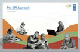

The United Nations High Impact Initiative on Digital Public Infrastructure was launched in 2023 with the aim of facilitating digital transformation globally and enhancing public services delivery. Digital public infrastructure (DPI) is still an evolving concept, but there is a growing consensus on it being a combination of (a) networked open technology standards built for the public interest, (b) enabling digital governance, and (c) a community of innovative and competitive market players working to drive innovation, especially across public programmes. Key components of DPI include digital identity, payment systems, and data exchange mechanisms. 

In 2023, UNDP and India’s G20 Presidency published a compendium and a playbook on DPI to help countries move forward in their digital transformation journeys. An interim report produced through a multi-stakeholder process outlined the first draft of the high-level principles of DPI safeguards, presenting an actionable framework to guide implementation but noting the urgent need for guardrails. 

_Sources_ : Some content is loosely excerpted from UNDP, “Digital public infrastructure”, available at https://www.undp.org/ digital/digital-public-infrastructure. Sources for information on the compendium, playbook and safeguards include UNDP and India’s G20 Presidency, _Accelerating the SDGs through Digital Public Infrastructure: A Compendium of the Potential of Digital Public Infrastructure_ (New York, 2023), available at https://www.undp.org/publications/accelerating-sdgs-through-digital-publicinfrastructure-compendium-potential-digital-public-infrastructure; and United Nations, Office of the Secretary-General’s Envoy on - Technology, Digital Public Infrastructure – Universal Safeguards, “Interim report launched”, available at https://www.dpi safeguards. org/. 

## **1.3.4 Digital policies, strategies and priorities** 

A robust and evidence-based approach to policymaking for digital government is essential to ensure its success in delivering desired outcomes. A number of factors shape the development of digital policies, including the alignment of digital strategies and policies with the SDGs and national development objectives, the evolution of digital technologies, digital capacities and capabilities, the availability of public resources, and the cultural diversity, geographical challenges, and development conditions prevailing in each country. More significantly, the political ethos, ideology and public governance systems of a country also influence the development and implementation of digital government initiatives. The public values and beliefs held by the Government and its stakeholders can shape the digital government landscape based on the levels and modalities of stakeholder engagement in digital services improvement, and the political ideology can determine the extent to which digital services are inclusive and address digital divides to ensure that no one is left behind. It is essential for Governments to assess where capacity-building might be needed to ensure that institutions are equipped to implement digital government systems in an effective, inclusive, and accountable manner. 

Figure 1.6 illustrates the changes that have occurred since 2020 in the proportions of affirmative responses to selected questions in the Member States Questionnaire that are related to digital government strategies and policies. The proportion of countries with a national e-government strategy has increased significantly, rising from 88.4 per cent in 2020 to 96.1 per cent in 2024. While there has been no significant change in the number of countries maintaining that their national e-government strategy is guided by or aligned with the national development strategy, the proportion of countries aligning their e-government strategy with the SDGs has increased from 79.5 to 90.2 per cent. This supports the earlier key message on how digital government has supported the accelerated implementation of the SDGs. The proportion of countries making specific reference in their national e-government strategy to their subnational (local) e-government development strategy has jumped from 65.4 to 80.2 per cent since 2020. 

26 

Chapter 1 • a Digital government moDel Framework For SuStainable Development 

Figure 1.6 Increasing proportion of countries responding affirmatively to Member States Questionnaire queries relating to digital government strategies and policies, 2020 and 2024 

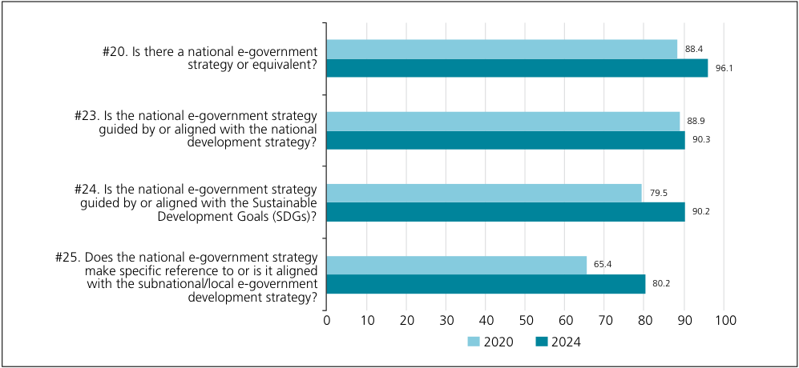

**----- Start of picture text -----** 
#20. Is there a national e-government 88.4 strategy or equivalent? 96.1 #23. Is the national e-government strategy 88.9 guided by or aligned with the national development strategy? 90.3 #24. Is the national e-government strategy 79.5 guided by or aligned with the SustainableDevelopment Goals (SDGs)? 90.2 #25. Does the national e-government strategymake specific reference to or is it aligned 65.4 with the subnational/local e-government 80.2 development strategy? 0 10 20 30 40 50 60 70 80 90 100 2020 2024 **----- End of picture text -----** 

chapter 3 explores regional trends in digital policy development, highlighting policy initiatives supported by various United Nations regional commissions and other international organizations. chapter 4 of the present Survey examines local e-government strategies and policies and provides some examples of their application. 

The United Nations E-Government Survey is a dynamic development tool established in support of the mandate of the UN DESA Division for Public Institutions and Digital Government (DPIDG), which includes research and advocacy in the realm of digital policy development. The primary data and findings gathered from the Member States and the Survey analyses and assessments have informed the contributions of UN DESA, DPIDG and other United Nations entities to strengthening digital development and cooperation, largely through the provision of advisory services and capacitybuilding initiatives. Examples of the support provided include the UN DESA Project on Frontier Technology Policy Experimentation and Regulatory Sandboxes in Asia and the Pacific (2020-2024)[58] and the United Nations Peace and Development Trust Fund project on developing institutional capacities for digital data management and cooperation to advance progress toward the Sustainable Development Goals.[59] 

## **1.3.5 Measuring and evaluating digital government** 

In building and strengthening digital government to achieve sustainable development, delivering the desired outcomes and impacts can be challenging and complex. It is necessary to address not only the lack of progress in e-government development itself, but also the failure of many developed and developing countries to appropriately measure and assess their digital development so that targeted remedial strategies can be adopted where needed. A 2021 study asserted that many digital government initiatives were considered complete or partial failures, but the failure factors and their root causes were not identified or well articulated.[60] 

Engaging in the regular measurement and evaluation of digital government initiatives is crucial to ensure public accountability and justify the investment of public resources, which in turn strengthen public trust in digital government. The right metrics and KPIs (quantifiable measures) will help 

27 

2024 UN E-GovErNmENt SUrvEy 

identify areas where digital initiatives are succeeding or falling short and can be leveraged to optimize resource allocation, bridge digital divides, inform continuous improvement in the quality and provision of services, and improve the user experience. 

This is the rationale behind the design of the EGDI as a global metric for digital development. The EGDI and its component indices allow countries to benchmark their progress against that of other countries or within the regional or global context, fostering healthy competition and knowledgesharing. Data and analytical findings from the present and past editions of the E-Government Survey can help inform policy decisions and shape future digital transformation strategies. More information is available on the metrics used in the Survey; table 1.1 in the present chapter lists the EGDI components and their subindices, chapter 2 offers a global analysis of EGDI composite and component values, rankings and other findings, chapter 3 evaluates the same indices and outcomes from a regional perspective, and chapter 4 assesses e-government development at the local level using the lOSI, with emphasis given to providing essential services and promoting social inclusion. 

It is important to emphasize that while the EGDI and its components offer a detailed global snapshot of digital development and the Survey provides a comparative analysis encompassing all Member States, there are aspects of e-government development that are not captured within this framework, such as the uptake of specific e-services (usage), indicators relating to usability and usefulness, and various contextual factors at the national and subnational levels in each country.[61] It is recommended that Governments clearly define their national KPIs and introduce regular internal and external auditing, monitoring, and evaluation processes, as well as other observational and assessment tools such as user surveys, mystery shoppers and sentiment analysis using social media and big data. This process involves systematically collecting and analysing data to assess how well digital government initiatives are meeting their objectives and serving constituents. Box 1.8 offers a brief glimpse of how Thailand is using national KPIs to monitor and evaluate e-government development in the country. 

Box 1.8 Use of key performance indicators in Thailand to monitor and evaluate digital government initiatives 

In Thailand, the Office of the Public Sector Development commission (OPDc) has adopted a set of national key performance indicators (KPIs) to encourage all government agencies meet high standards in the implementation of government initiatives. Digital government transformation is one of the key processes selected for monitoring and evaluation within this framework. Government agencies have been urged to advance digital government under a scheme referred to as “Government 4.0”. The OPDc came up with an incentive – the Public Sector Management Quality Award 4.0 – to encourage all government agencies to contribute effectively to efforts to transform the country’s public services in accordance with the guidelines governing Government 4.0. 

_Sources_ : From information provided by Thailand in response to the Member States Questionnaire for the _United Nations E-Government Survey 2024_ ; Thailand, Office of the Public Sector Development commission, “Strategic Plan of the Public Sector Development B.E. 2564-2565 (2021-2022)” (https://www.opdc.go.th/?lang=en) and “Public sector excellence awards” (https:// www.opdc.go.th/content/Mjc4MQ/?lang=en); and Thailand, National Statistical Office, “Bureaucratic development”, including information on the award, available at https://www.nso.go.th/nsoweb/category/7A?set_lang=en. 

28 

Chapter 1 • a Digital government moDel Framework For SuStainable Development 

## **1.4 The apex of the Digital Government Model Framework: achieving Sustainable Development Goals and national development objectives** 

The apex of the Digital Government Model Framework, shown in figure 1.5, is of paramount importance, as it focuses on two essential goals: achieving the SDGs, guided by the 2030 Agenda targets and indicators, and meeting national development objectives. 

Digital government initiatives are proving to be powerful tools in accelerating the implementation of the SDGs. By leveraging technology, Governments can become more effective, inclusive and accountable, strengthening services provision and accessibility across sectors and contributing directly to the achievement of all 17 SDGs. There are numerous examples illustrating how digitalization in general, and digital government in particular, can accelerate progress towards sustainable development. For SDG 1 (no poverty), digital platforms can help alleviate economic and other hardships associated with poverty by providing access to financial services and social benefits and enabling targeted social protection. SDG 2 (zero hunger) benefits from digital agriculture initiatives that enhance food security, such as the Digital Green project in Ethiopia,[62] which provides farmers with vital information on how to increase crop yields. SDG 8 (decent work and economic growth) is supported by digital government initiatives that promote economic development by streamlining and facilitating business processes (including company registration and tax compliance) and access to financial services, as exemplified by the e-Business Register platform in Estonia. SDG 10 (reduced inequalities) is addressed through digital inclusion programmes designed to improve access to public services, such as the Be connected initiative for older residents in Australia.[63] The list extends to other Goals, providing broad and widely diverse evidence of the strong catalytic role digital government plays in accelerating the implementation of the SDGs. 

The proposed Digital Government Model Framework represents an opportunity for both developed and developing countries to accelerate digital transformation and the realization of national development goals. The Framework recognizes that each country needs to decide on the level, extent and nature of digital government development in line with its national development priorities and strategies for achieving the SDGs. In some cases, countries can leverage existing or emerging technologies (such as AI) and other digital resources to address commonplace challenges and even “wicked problems” in the public sector, but Governments must be ready to continue to evolve and adapt to shifting contextual factors, including global trends and developments in data, digital governance, and global digital cooperation. In implementing the Model Framework, countries can be guided by norm-setting bodies such as the United Nations committee of Experts on Public Administration, which can provide Member States with policy guidance and support. This organization prioritizes digital policy issues – reflected in the deliberations at its twenty-third session on the role of Governments in ensuring the transparency and accountability of AI systems in public administration and in the discourse at its twenty-second session on stimulating public sector innovation through digital technology and measuring the impact of digital government. 

The 2024 E-Government Survey, exemplifying the flexibility necessary to address the dynamic shifts surrounding the evolution of technology and e-government, includes an annex on the application of complex network analysis in expanding the list of factors affecting digital development. 

29 

2024 UN E-GovErNmENt SUrvEy 

## **1.5 Key recommendations** 

- _Digitalizing public institutions and services has never been more urgent._ 

The empirical findings and anecdotal evidence from successive United Nations E-Government Surveys suggest that digitalizing public institutions and services has never been more urgent. Governments must make every effort to meet people’s rising expectations in a rapidly digitalizing world, accelerate progress towards achieving the SDGs, and become more resilient and efficient in the face of intersecting and compounding crises such as those related to food, fuel, health and inflation. 

- _Each country has its own resource constraints, legal and regulatory frameworks, and cultural, political and social norms that can have a significant impact on how digital government is adopted and implemented to align with national development priorities and strategies for achieving the SDGs._ 

The concept of digital government is no longer new, but it has grown progressively more complex as the boundaries between physical and digital government and across sectors and jurisdictions have become increasingly blurred and interconnected. Moreover, digital government as a construct can mean different things to different administrations and in different contexts. consequently, the conceptualization and implementation of digital government strategies and initiatives may be very diverse and are therefore challenging to assess and evaluate for effectiveness, inclusiveness and accountability. For Governments, researchers, analysts, and others exploring or assessing e-government, it is important not only to keep up with global trends and developments, but also to understand that each country has its own resource constraints, legal and regulatory frameworks, and cultural, political and social norms that can have a significant impact on how digital government is adopted and implemented to align with national development priorities and strategies for achieving the SDGs. 

- _The United Nations Digital Government Model Framework can offer countries the opportunity to accelerate digital transformation for sustainable development, guided by the principles of effective governance for sustainable development and a set of digital dimensions and key business drivers in advancing digital government._ 

The United Nations Digital Government Model Framework can offer both developed and developing countries the opportunity to accelerate digital transformation for sustainable development. The application of the Framework, guided by the principles of effective governance for sustainable development, can promote and facilitate the sharing of limited public resources, best practices, experiences, methods, and standards and can also reduce turnaround times and costs for digital government initiatives. A set of key business drivers – digital leadership, data centricity, digital identity, effective e-participation, enhanced digital literacy, and building and maintaining a robust digital infrastructure – have been established to guide the implementation of the Model Framework so that the needs of all stakeholders are best served. 

30 

Chapter 1 • a Digital government moDel Framework For SuStainable Development 

## Endnotes 

- 1 United Nations, Division for Public Economics and Public Administration, and American Society for Public Administration, Benchmarking _E-Government: A Global Perspective – Assessing the Progress of the UN Member States_ , (New York, 2002), p. 4, available at https://desapublications.un.org/publications/benchmarking-e-government-globalperspective-2001. 

- 2 In line with past editions of the United Nations E-Government Survey, “e-government” and “digital government” are used Interchangeably throughout the present edition. There is no formal distinction made between the terms among academics, policymakers and practitioners. 

- 3 United Nations, World Sector Report 2023: Transforming Institutions to Achieve the Sustainable Development Goals after the Pandemic (New York, 2023) 

- 4 The United Nations Department of Economic and Social Affairs (UN DESA) convened the Third Global Forum on Reinventing E-Government in collaboration with the Government of Italy; the meeting was held in Naples in March 2001 (see https://publicadministration.desa.un.org/capacity-development/global-forum/3rd-global-forum). 

- 5 United Nations, Division for Public Economics and Public Administration, and American Society for Public Administration, _Benchmarking E-Government: A Global Perspective_ . 

- 6 UN DESA, “Opening remarks: Fourth World Internet Conference (Wuzhen Summit)”, 3 December 2017, available at https://www.un.org/en/desa/opening-remarks-fourth-world-internet-conference-wuzhen-summit. 

- 7 UN DESA, “UN General Assembly resolutions on WSIS and its follow-up”, available at https://publicadministration. desa.un.org/intergovernmental-support/wsis/un-general-assembly-resolutions-wsis-and-its-follow. 

- 8 United Nations, “The age of digital dependence: report of the UN Secretary-General’s High-level Panel on Digital Cooperation”, available at https://www.un.org/en/pdfs/DigitalCooperation-report-for%20web.pdf. See also United Nations, “Secretary-General’s High-level Panel on Digital Cooperation: the UN Secretary-General’s roadmap on digital cooperation”, available at https://www.un.org/en/sg-digital-cooperation-panel. 

- 9 - United Nations, “Our Common Agenda”, background information, available at https://www.un.org/en/common agenda; see also United Nations, _Our Common Agenda: Report of the Secretary-General_ (New York, 2021), available at https://www.un.org/en/content/common-agenda-report/assets/pdf/Common_Agenda_Report_English.pdf. 

- 10 United Nations, “Secretary-General’s roadmap for digital cooperation: introduction”, available at https://www. - - 

- un.org/en/content/digital cooperation roadmap/. See also United Nations, General Assembly, “Road map for digital cooperation: implementation of the recommendations of the High-level Panel on Digital Cooperation”, 29 May 2020 (A/74/821), available at https://documents.un.org/doc/undoc/gen/n20/102/51/pdf/n2010251. pdf?token=OYNd8MEgYAP0Gi3f3k&fe=true. 

- 11 United Nations, Division for Public Economics and Public Administration, and American Society for Public Administration, _Benchmarking E-Government: A Global Perspective_ . 

- 12 Rodrigo Sandoval-Almazan and others, _Building Digital Government Strategies: Principles and Practices_ , Public Administration and Information Technology series, vol. 16, Christopher G. Reddick, ed. (Cham, Switzerland, Springer International Publishing, 2017). 

- 13 UN DESA, _UN Global E-Government Readiness Report 2004_ , p. 14. 14 United Nations, Division for Public Economics and Public Administration, and American Society for Public Administration, _Benchmarking E-Government: A Global Perspective_ , p. v. 

- 15 India, Ministry of Electronics and Information Technology, “E-Government Development Index (EGDI) under global indices”, available at https://www.meity.gov.in/e-government-development-index-egdi-under-global-indices. 

- 16 - Uruguay Digital, “UN E-Government Survey 2022”, 10 March 2022, available at https://www.gub.uy/uruguay digital/en/politicas-y-gestion/government-survey-2022. 

- 17 Samuel Olorunfemi Adams and Chima Paul, “E-government development indices and the attainment of United Nations sustainable development goals in Africa: a cross-sectional data analysis”, _European Journal of Sustainable Development Research_ , vol. 7, No. 4 (2023), em0234, available at https://doi.org/10.29333/ejosdr/13576. 

- 18 Jeffrey D. Sachs, Guillaume Lafortune and Grayson Fuller, _Sustainable Development Report 2024: The SDGs and the UN Summit of the Future_ (Paris, Sustainable Development Solutions Network, and Dublin, Dublin University Press, 2023), DOI:10.25546/108572, available at https://s3.amazonaws.com/sustainabledevelopment.report/2024/ sustainable-development-report-2024.pdf. 

- 19 United Nations Development Programme, “Gender Inequality Index (GII)”, Human Development Reports page (2022), available at https://hdr.undp.org/en/content/gender-inequality-index-gii. 

- 20 Ali J. Al-Sadiq, “The role of e-government in promoting foreign direct investment inflows”, IMF Working Papers, No. 16 (Washington, D.C., International Monetary Fund, January 2021). 

- 21 Ibid., p. 8. 

31 

2024 UN E-GovErNmENt SUrvEy 

- 22 Transparency International, Corruption Perceptions Index 2022, available at https://www.transparency.org/en/cpi/2022. 

- 23 TheGlobalEconomy.com,  “Government spending, percent of GDP – country rankings”, available at https://www. theglobaleconomy.com/rankings/government_size; IMF, “Government expenditure, percent of GDP”, available at https://www.imf.org/external/datamapper/exp@FPP/SGP?zoom=SGP&highlight=SGP; World Bank, “General government final consumption expenditure (current US$)”, available at https://data.worldbank.org/indicator/NE.CON. GOVT.CD; World Bank, “Expense (% of GDP)”, available at https://data.worldbank.org/indicator/GC.XPN. TOTL.GD.ZS. 

- 24 United Nations, General Assembly and Economic and Social Council, “Progress made in the implementation of and follow-up to the outcomes of the World Summit on the Information Society at the regional and international levels” (multiple years). See also UN DESA, “Facilitation Meetings by UNDESA for the action - 

- lines C1, C11 and C7eGov”, available at https://publicadministration.desa.un.org/intergovernmental support/wsis/ facilitation-meetings-undesa-action-lines-c1-c11-and-c7egov. 

- 25 David Amaglobeli, Ruud de Mooij and Mariano Moszoro, “Harnessing GovTech to tax smarter and spend smarter”, IMF Blog post on macro-fiscal policy, 7 September 2023, available at Articles/2023/09/07/harnessing-govtech-to-tax-smarter-and-spend-smarter. https://www.imf.org/en/Blogs/ 

- 26 UN DESA, _United Nations E-Government Survey 2020_ , see addendum on COVID-19 response, pp. 215-229. 

- 27 The proposed model framework is a conceptual structure that combines both a model and a framework to provide a comprehensive approach to understanding, analysing and implementing digital government. 

- 28 United Nations, Economic and Social Council, “Elaborating principles of effective governance for sustainable development”, note by the Secretariat, 14 February 2018 (E/C.16/2018/5), available at https://documents.un.org/ doc/undoc/gen/n18/027/26/pdf/n1802726.pdf?token=KB2ZRUFMMjYgGF5bRJ&fe=true. 

- 29 Note: The OECD Digital Government Policy Framework was introduced in 2020 to helps governments transition to digital maturity across six dimensions: digital by design, data-driven public sector, government as a platform, open by default, user-driven, and proactiveness. It is built on the 2014 OECD Recommendation on Digital - 

- Government Strategies. Source: https://www.oecd.org/en/topics/digital government.html 

- 30 Vladislav Boutenko, Julia Jacobson and Martin Reeves, “An ecosystem approach for city governance”, Boston - 

- Consulting Group (BCG) article, 31 May 2022, available at https://www.bcg.com/publications/2022/modernizing city-governance-ecosystem-approach. 

- 31 Mike Bracken, “Government as a Platform: the next phase of digital transformation”, United Kingdom Government Digital Service blog post, 29 March 2015, available at https://gds.blog.gov.uk/2015/03/29/government-as-a-platformthe-next-phase-of-digital-transformation/. 

- 32 Government as a Platform (GaaP) was first introduced by Tim O’Reilly in 2010. GaaP is described by Mike Bracken (ibid.) as a “new vision for digital government: a common core infrastructure of shared digital systems, technology and processes”. This approach incorporates or supports a route to better public services, the breaking down of organizational silos, a toolkit for civil servants, an open platform to build upon, a new public infrastructure, a shorthand for the co-production of policy, and mechanism designed to help pave the way for the creation of new institutions that are fit for the digital age. 

- 33 UN DESA, _United Nations E-Government Survey 2022_ . 

- 34 From information provided by France in response to the Member States Questionnaire for the _United Nations E-Government Survey 2024_ . 

- 35 Shravan Pargaonkar, “A comprehensive research analysis of software development life cycle (SDLC) agile & waterfall model advantages, disadvantages, and application suitability in software quality engineering”, _International Journal of Scientific and Research Publications_ research-paper-0823.php?rp=P14012999. , vol. 3, No. 8 (August 2023), available at https://www.ijsrp.org/ 

- 36 From information provided by Canada in response to the Member States Questionnaire for the _United Nations E-Government Survey 2024_ ; Canada, “Canada’s Digital Ambition 2022”, available at https://www.canada.ca/en/ government/system/digital-government/government-canada-digital-operations-strategic-plans/canada-digital-ambition. html. 

- 37 Wai Min Kwok and others, “Sandboxing and experimenting digital technologies for sustainable development”, UN DESA Policy Brief, No. 123 (December 2021), pp. 2-3 (referencing the United Nations Development Account Project on policy experimentation and regulatory sandboxes, jointly implemented by UN DESA and the United Nations Economic Commission for Asia and the Pacific), available at desa/dpad/publication/un-desa-policy-brief-123-sandboxing-and-experimenting-digitalhttps://www.un.org/development/-technologies-for-sustainabledevelopment/. 

- 38 The zero trust security model is a cybersecurity framework based on the principle “never trust, always verify”. It assumes that threats can come from both inside and outside the network, so by default, no user or device should be trusted. Instead, every access request must be authenticated, authorized and continuously validated. 

32 

Chapter 1 • a Digital government moDel Framework For SuStainable Development 

39 From information provided by the Republic of Korea in response to the Member States Questionnaire for the _United Nations E-Government Survey 2024_ . 40 Singapore Government Development Portal, “Government Zero Trust Architecture (GovZTA)”, available at https:// www.developer.tech.gov.sg/guidelines/standards-and-best-practices/government-zero-trust-architecture. 41 Rumana Bukht and Richard Heeks, “Defining, conceptualising and measuring the digital economy”, _International Organisations Research Journal_ , vol. 13, No. 2 (2017), pp. 143-172. 42 Ebenezer Agbozo. 2019. The Private Sector as an E-Government Enabler. In Proceedings of the 12th International Conference on Theory and Practice of Electronic Governance (ICEGOV ‘19). Association for Computing Machinery, New York, NY, USA, 508–509. https://doi.org/10.1145/3326365.3326443 

- 43 Mensah IK, Zeng G, Mwakapesa DS. Understanding the drivers of the public value of e-government: Validation of a public value e-government adoption model. Front Psychol. 2022 Sep 13;13:962615. doi: 10.3389/fpsyg.2022.962615. PMID: 36176811; PMCID: PMC9513459. 

- 44 The People’s Government of Beijing Municipality, “‘BeijingService’: WeChat account of official web portal for People’s Government of Beijing Municipality officially unveiled”, news, 2 September 2023, available at https:// english.beijing.gov.cn/latest/news/202309/t20230902_3243833.html. 

- 45 From information provided by Oman in response to the Member States Questionnaire for the _United Nations E-Government Survey 2024_ . 

- 46 UN DESA, “Empowering small businesses in Bangladesh through digital innovative solutions”, article, 29 February 2024, available at https://capacity.desa.un.org/article/empowering-small-businesses-bangladesh-throughdigital-innovative-solutions. 

> 47 UN DESA, _United Nations E-Government Survey 2020_ , chap. 6. 

- 48 From information provided by New Zealand in response to the Member States Questionnaire for the _United Nations E-Government Survey 2024_ ; New Zealand, “Minister for Digitising Government”, available at https://www. digital.govt.nz/digital-government/leadership/minister-for-government-digital-services/. 

- 49 Risa Arai, Piyush Verma and Rajesh Sharma, “Why legal identity is crucial to tackling the climate crisis”, blog post, 15 May 2024, available at https://www.undp.org/blog/why-legal-identity-crucial-tackling-climate-crisis. 

- 50 K. Sudhir and Shyam Sunder. “What Happens When a Billion Identities Are Digitized?”, Yale Insights, available: https://insights.som.yale.edu/insights/what-happens-when-billion-identities-are-digitized. 

- 51 UN DESA, _United Nations E-Government Survey 2020_ , chap. 5. 

- 52 Ibid., p. 161. 

- 53 UN DESA, _United Nations E-Government Survey 2022_ , pp. 121 and 133. 

- 54 Adams and Paul, “E-government development indices and the attainment of United Nations sustainable development goals in Africa: a cross-sectional data analysis”. 

- 55 UN DESA, _United Nations E-Government Survey 2020_ , chap. 6. 

- 56 From information provided by the countries listed in response to the Member States Questionnaire for the _United Nations E-Government Survey 2024_ . 

- 57 Singapore Government Developer Portal, Government on Commercial Cloud (GCC) - A “Wrapper” Platform for Onboarding of Government Services into the Cloud, available at https://www.developer.tech.gov.sg/products/ categories/infrastructure-and-hosting/government-on-commercial-cloud/overview.html. 

- 58 UN DESA, “UN DESA Project on Frontier Technology Policy Experimentation and Regulatory Sandboxes in Asia and the Pacific (2020-2024)”, Public Institutions/Projects page, 1 September 2022, available at publicadministration.desa.un.org/projects/un-desa-project-frontier-technology-policy-experimentation-and-regulatoryhttps://sandboxes-asia. 

- 59 UN DESA, “Developing institutional capacities for digital data management and cooperation to advance progress toward the Sustainable Development Goals” (project funded by the Peace and Development Trust Fund), Public - 

- Institutions/Project page, 22 March 2024, available at https://publicadministration.desa.un.org/projects/developing institutional-capacities-digital-data-management-and-cooperation-advance-0. 

- 60 Joseph Nyansiro, Joel S. Mtebe and Mussa M. Kissaka, “E-government information systems (IS) project failure in developing countries: lessons from the literature”, _The African Journal of Information and Communication_ , vol. 28, No. 28, pp. 1-29, available at https://doi:10.23962/10539/32210. 

- 61 Aaron Maniam, “What digital success looks like: measuring & evaluating government digitalisation”, E _THOS_ Issue 21 (July 2019), Singapore Civil Service College, available at https://knowledge.csc.gov.sg/ethos-issue-21/ what-digital-success-looks-like-measuring-evaluating-government-digitalisation/. 

> 62 Ethiopia, “Digital Green”, available at https://digitalgreen.org/ourwork/ethiopia/. 

63 Australia, Department of Social Services, “Be Connected – improving digital literacy for older Australians”, available at https://www.dss.gov.au/seniors/be-connected-improving-digital-literacy-for-older-australians. 

33 

**----- Start of picture text -----** 
2024 UN E-GovErNmENt SUrvEy 34 Chapter 1 **----- End of picture text -----** 

Chapter 2 • Global trends in e-Government 

## **2. Global Trends in E-Government** 

## **2.1 Introduction** 

E-government has become the cornerstone for building effective, accountable, resilient, and inclusive institutions at all levels, as called for in Sustainable Development Goal (SDG) 16, and for strengthening the implementation of Goal 17. This chapter presents a data-driven analysis of key trends in e-government development in 2024 based on the assessment of the E-Government Development Index (EGDI). It also describes and analyses global trends in electronic and mobile services delivery and sheds light on the distribution of online services based on country income levels and on the provision of services in specific sectors that are particularly important for sustainable development. The analysis is further supplemented by the key findings of the Member States Questionnaire (MSQ) and from case studies and best practices provided by States Members of the United Nations. 

## **2.1.1 EGDI methodology: continuous improvement** 

The EGDI is a composite index of digital government development, calculated as the average of three independent component indices: the Online Services Index (OSI), the Telecommunications Infrastructure Index (TII), and the Human capital Index (HcI). Each successive edition of the Survey reflects constructive improvements in the EGDI methodology deriving from the lessons learned from previous editions, the input and feedback received from Member States, the recommendations of external evaluations, the outcomes of expert group meetings, and the advancement of the latest technological and policy developments in digital government. 

For the 2024 edition of the Survey, the OSI continues to assess government portals based on five subindices: institutional framework, services provision, content provision, technology, and e-participation. The overall OSI value is calculated using the normalized values of these subindices. The TII has been updated by removing the fixed broadband subscriptions subindex and adding “affordability” as a new subindex, complementing the three existing subindices from the previous two Surveys. The HcI has been refined by adding a fifth subindex to include aspects of e-government literacy. This new subindex, developed inhouse, benchmarks the ability of all segments of the population, especially vulnerable groups, to fully utilize available e-government services and take advantage of e-participation opportunities. Specifically, the e-government literacy subindex provides insights into government efforts to enhance digital literacy and engagement with online services across diverse domains, measuring the level of e-government literacy within a country by assessing key features on government portals. The updated methodology supports a more nuanced and granular analysis of advancements in e-government development and is further detailed in annex. 

Photo credit: shutterstock.com 

||In this chapter:||
|---|---|---|
||2.1 Introduction|35|
||2.1.1 EGDI methodology: continuous improvement 2.2 E-government rankings in 2024 2.3 E-government development at aglance 2.3.1 Overall EGDI results| 35 36 36 36|
||2.3.2 country groupings by EGDI level and movement between thegroups| 39|
||2.3.3 countries leading e-government||
||development|41|
||2.4 National income and e-government development|42|
||2.5 Online Services Index 2.5.1 country groupings by OSI and EGDI levels|45 45|
||2.5.2 OSI subindices|52|
||2.5.3 OSI institutional framework||
||subindex|53|
||2.5.4 OSI contentprovision subindex|54|
||2.5.5 OSI e-participation subindex|55|
||2.5.6 OSI services provision subindex: progress in online services delivery  2.5.7 Targeted services for people in vulnerable situations| 61   65|
||2.5.8 Sector-specifc online information and services: sharing via mobile||
||technologies|67|
||2.5.9 Technologysubindex|67|
||2.6 countries in special situations (lDcs,llDcs and SIDS) 2.6.1 E-government development in lDcs, llDcs and SIDS: trends|70   |
||and insights|71|
||2.6.2 The OSI and its subindices: progress among the countries in special situations 75||
||2.6.3 leaders in digitalization among the||
||countries in special situations|81|
||least developed countries|81|
||landlocked developingcountries|81|
||Small island developingStates|82|
||2.7 Summary of key fndings and policy recommendations|83|

35 

**Chapter 2** 

2024 UN E-GovErNmENt SUrvEy 

## **2.2 E-government rankings in 2024** 

The Survey presents national, regional and global trends in e-government development based on the assessment of the EGDI and its OSI, TII and HcI component indices. Each of these three component indices is a composite measure that can be extracted and analysed independently. 

The analysis focuses on correlations between EGDI composite/component values and country income groups, comparisons of advancements in e-services provision, and major trends in electronic and mobile services delivery across various development sectors, including education, employment, environment, health, justice, and social protection. Additionally, it examines the differences among countries in e-government advancement for vulnerable groups, including older people, women, youth, persons with disabilities, and migrants. Where relevant, the Survey highlights similarities and differences between EGDI groups, between the OSI, TII and HcI component groups, and between the EGDI rating classes (quartile subgroups). Additional insights are provided based on comparisons with data from previous editions. 

The sections below present the key findings of the 2024 Survey and recent progress made by Member States in e-government development, measured through EGDI values, rankings, and rating classes. 

## **2.3 E-government development at a glance** 

## **2.3.1 Overall EGDI results** 

E-government development has improved at the global level, with the average EGDI value reaching 0.6382 on a scale of 0 to 1, up from 0.6102 in 2022. Figure 2.1 shows the geographical distribution of the four EGDI groups in 2024. 

Figure 2.1 Geographical distribution of the four EGDI groups, 2024 

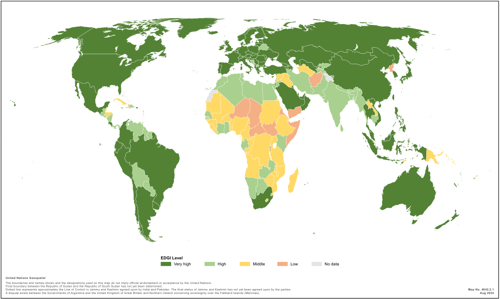

**----- Start of picture text -----** 
EDGI Level Very high  High  Middle Low  No data United Nations Geospatial The boundaries and names shown and the designations used on this map do not imply official endorsement or acceptance by the United Nations. Final boundary between the Republic of Sudan and the Republic of South Sudan has not yet been determined. Dotted line represents approximately the Line of Control in Jammu and Kashmir agreed upon by India and Pakistan. The final status of Jammu and Kashmir has not yet been agreed upon by the parties. Map No. 4642.2.1 A dispute exists between the Governments of Argentina and the United Kingdom of Great Britain and Northern Ireland concerning sovereignty over the Falkland Islands (Malvinas). Aug 2024 **----- End of picture text -----** 

_Source_ : 2024 United Nations E-Government Survey. 

36 

Chapter 2 • Global trends in e-Government 

For the first time, Member States with very high EGDI values (above 0.75) comprise the largest share, accounting for 39 per cent of the total (76 of the 193 countries assessed). This group is followed by countries with high EGDI values (ranging from 0.50 to 0.75), which make up 32 per cent (62 countries). The number of countries with middle EGDI values (ranging from 0.25 to 0.50) has declined from 53 in 2022 to 44 (23 per cent) in 2024. However, the number of countries with low EGDI values has increased from 7 to 11 (6 per cent) since 2022, primarily due to geopolitical conflicts and post-conflict situations that have hindered their digital development. The overall progress achieved is consistent with the positive e-government development trend observed over the past decade, as illustrated in figure 2.2. 

Figure 2.2 Number and percentage of countries in each EGDI group, 2014 to 2024 

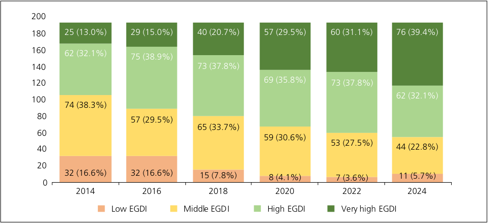

**----- Start of picture text -----** 
200 180 25 (13.0%) 29 (15.0%) 40 (20.7%) 57 (29.5%) 60 (31.1%) 76 (39.4%) 160 62 (32.1%) 75 (38.9%) 140 73 (37.8%) 120 69 (35.8%) 73 (37.8%) 100 62 (32.1%) 74 (38.3%) 80 57 (29.5%) 65 (33.7%) 60 59 (30.6%) 53 (27.5%) 40 44 (22.8%) 20 32 (16.6%) 32 (16.6%) 15 (7.8%) 8 (4.1%) 7 (3.6%) 11 (5.7%) 0 2014 2016 2018 2020 2022 2024 Low EGDI Middle EGDI High EGDI Very high EGDI **----- End of picture text -----** 

_Sources_ : 2014-2024 United Nations E-Government Surveys. 

The number of countries with very high EGDI values has more than tripled over the past ten years, rising from 25 in 2014 to 76 in 2024. The combined number of countries with very high and high EGDI values has increased from 87 in 2014 to 138 in 2024. This underscores the growing importance and priority Governments have placed on digital transformation over the past decade. It highlights the significant strides made in enhancing e-government services and infrastructure, reflecting a global commitment to leveraging technology for improved governance and public services delivery. As a result of these gains, the number of countries with middle and low EGDI values has decreased significantly, falling from 106 in 2014 to 55 in 2024. This shift is broadening the base of nations that are strengthening their digital capabilities, ensuring that more citizens can benefit from the efficiencies and conveniences of digital government services. 

Figure 2.3 presents the 2024 global and regional average EGDI values and the percentage increases in these averages since 2022. Europe has the highest average EGDI value (0.8493), followed by Asia (0.6990), the Americas (0.6701), Oceania (0.5289), and Africa (0.4247). Asia has seen the sharpest increase in its average EGDI value (7.7 per cent), followed by Africa, (4.8 per cent), the Americas and Oceania (4.1 per cent), and Europe (2.3 per cent). 

37 

2024 UN E-GovErNmENt SUrvEy 

Figure 2.3 Global and regional EGDI averages, 2022 and 2024 

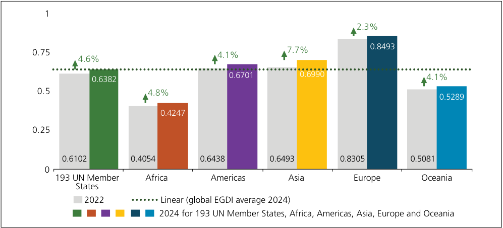

**----- Start of picture text -----** 
1 2.3% 0.75 4.1% 7.7% 0.8493 4.6% 0.6382 0.6701 0.6990 4.1% 0.5 4.8% 0.5289 0.4247 0.25 0.6102 0.4054 0.6438 0.6493 0.8305 0.5081 0 193 UN Member Africa Americas Asia Europe Oceania States 2022 Linear (global EGDI average 2024) 2024 for 193 UN Member States, Africa, Americas, Asia, Europe and Oceania **----- End of picture text -----** 

_Sources_ : 2022 and 2024 United Nations E-Government Surveys. 

It is noteworthy that the TII is the highest component index contributing to average EGDI values globally and regionally. This reflects the increased investment in digital infrastructure during the postcOVID-19 pandemic recovery process. Over the past two years, the average TII value has increased by 19.9 per cent globally (see table 2.1). The most significant regional increase is observed in Oceania (29.4 per cent), followed by Africa (27.8 per cent), Asia (25.5 per cent), the Americas (19.6 per cent), and Europe (9.9 per cent). These increases highlight the global emphasis on establishing a strong telecommunications infrastructure as a foundation for digital growth. 

Table 2.1 Average global and regional values for the EGDI and its component indices, 2022 and 2024 

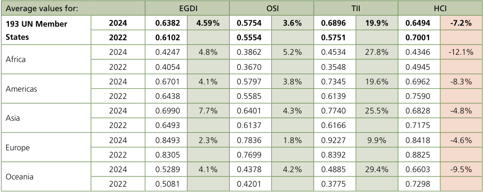

**----- Start of picture text -----** 
Average values for:  EGDI  OSI TII HCI 193 UN Member  2024 0.6382 4.59% 0.5754 3.6% 0.6896 19.9% 0.6494 -7.2% States  2022 0.6102 0.5554 0.5751 0.7001 2024 0.4247 4.8% 0.3862 5.2% 0.4534 27.8% 0.4346 -12.1% Africa 2022 0.4054 0.3670 0.3548 0.4945 2024 0.6701 4.1% 0.5797 3.8% 0.7345 19.6% 0.6962 -8.3% Americas 2022 0.6438 0.5585 0.6139 0.7590 2024 0.6990 7.7% 0.6401 4.3% 0.7740 25.5% 0.6828 -4.8% Asia 2022 0.6493 0.6137 0.6166 0.7175 2024 0.8493 2.3% 0.7836 1.8% 0.9227 9.9% 0.8418 -4.6% Europe 2022 0.8305 0.7699 0.8392 0.8825 2024 0.5289 4.1% 0.4378 4.2% 0.4885 29.4% 0.6603 -9.5% Oceania 2022 0.5081 0.4201 0.3775 0.7298 **----- End of picture text -----** 

_Sources_ : 2022 and 2024 United Nations E-Government Surveys. 

38 

Chapter 2 • Global trends in e-Government 

Global and regional OSI averages have also increased slightly since 2022. The steepest increase has been in Africa (5.2 per cent), followed by Asia (4.3 per cent), Oceania (4.2 per cent), the Americas (3.8 per cent), and Europe (1.8 per cent). This suggests that countries are making steady progress in enhancing their online service offerings, albeit at a different pace. The decrease in HcI values can be attributed to the introduction of the new e-government literacy subindex within the HcI component. The addition has made the HcI data sets from previous years not directly comparable; the lower index values for this component do not indicate a disinvestment in human capital. 

These trends indicate that the surge in digitalization following the cOVID-19 pandemic is now reflected in improved e-government development globally and in every region, including Africa and Oceania. Despite ongoing development challenges at the regional level and persistent digital divides within and between these regions, significant progress has been made. The unique dynamic prevailing in each region – including factors that promote or hinder digital development – is analysed in some depth in chapter 3 of the present Survey. 

## **2.3.2 Country groupings by EGDI level and movement between the groups** 

Among the 76 countries in the very high EGDI group, 36 are in Europe, 25 are in Asia, 11 are in the Americas, 2 are in Africa, and 2 are in Oceania (see figure 2.4). 

South Africa and Mauritius, with respective EGDI values of 0.8616 and 0.7506, are the first African countries to join the very high EGDI group. Europe continues to lead e-government development, with all countries in the region having very high (84 per cent) or high (16 per cent) EGDI values. While the proportion of countries with high and very high EGDI values in the Americas (88 per cent) remains higher than in Asia (83 per cent), the share of countries with very high EGDI values has been growing faster in Asia (by 21 per cent, compared with an 8 per cent increase in the Americas). Asian countries in the very high EGDI group now account for 53 per cent of the regional total – a proportion exceeded only by Europe. 

Figure 2.4 The number of countries in each regional EGDI group and the movement of countries between EGDI groups, 2024 

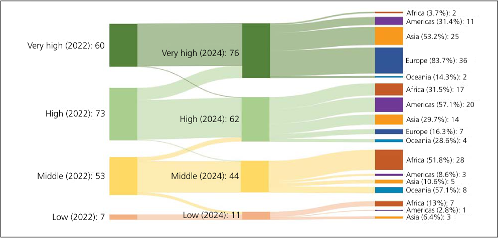

**----- Start of picture text -----** 
Africa (3.7%): 2 Americas (31.4%): 11 Asia (53.2%): 25 Very high (2022): 60 Very high (2024): 76 Europe (83.7%): 36 Oceania (14.3%): 2 Africa (31.5%): 17 Americas (57.1%): 20 High (2022): 73 High (2024): 62  Asia (29.7%): 14 Europe (16.3%): 7 Oceania (28.6%): 4 Africa (51.8%): 28 Middle (2022): 53  Middle (2024): 44  Americas (8.6%): 3 Asia (10.6%): 5 Oceania (57.1%): 8 Africa (13%): 7 Americas (2.8%): 1 Low (2022): 7  Low (2024): 11  Asia (6.4%): 3 **----- End of picture text -----** 

_Source_ : 2024 United Nations E-Government Survey. 

39 

2024 UN E-GovErNmENt SUrvEy 

Among the countries with high EGDI values, 20 are in the Americas, 17 are in Africa, 14 are in Asia, 7 are in Europe, and 4 are in Oceania. The majority of countries with middle EGDI values are in Africa (28), followed by Oceania (8), Asia (5), and the Americas (3). Among the 11 countries with low EGDI values, 7 are in Africa, 3 are in Asia, and 1 is in the Americas. 

All of the countries with low EGDI values in 2022 are still in the same group in 2024, and four other countries have moved from the middle to the low EGDI group. 

A more detailed analysis of e-government development at the regional level is provided in chapter 3. Section 2.6 of this chapter includes an analysis of countries in special situations. 

## Movement between EGDI groups and rating classes 

Twenty-three countries have moved to a higher EGDI group. Ten countries in Asia (Armenia, Azerbaijan, Brunei Darussalam, Indonesia, Kuwait, Mongolia, Philippines, Qatar, Uzbekistan, and Viet Nam), three countries in the Americas (colombia, Ecuador, and Mexico), two countries in Africa (Mauritius and South Africa), and two countries in Europe (Albania and the Republic of Moldova) have moved from the high to the very high EGDI group (see figure 2.5). Three countries in Africa (Eswatini, libya, and Senegal), two in Asia (Myanmar and Pakistan), and one in Oceania (Vanuatu) have moved from the middle to the high EGDI group. 

Figure 2.5 Movement of countries between EGDI groups during the period 2022-2024, by region _(Number of countries)_ 

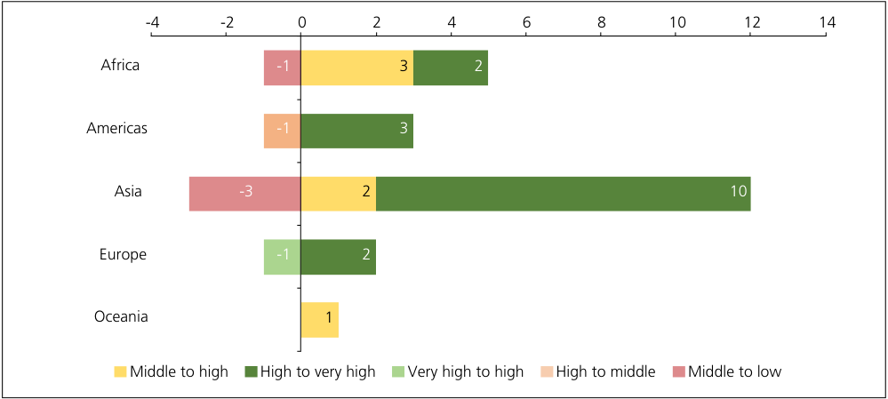

**----- Start of picture text -----** 
-4 -2 0 2 4 6 8 10 12 14 Africa -1 3 2 Americas -1 3 Asia -3 2 10 Europe -1 2 Oceania 1 Middle to high High to very high Very high to high High to middle Middle to low **----- End of picture text -----** 

_Source_ : 2024 United Nations E-Government Survey. 

These countries have made significant progress in their digital transformation journeys, focusing on enhancing their telecommunications infrastructure, improving online services, and investing in human capital development. They have implemented various strategies and initiatives to boost their digital capabilities, such as expanding broadband access, developing e-government platforms, and promoting digital literacy among their populations. These efforts have been instrumental in their advancement and upward movement in the EGDI rankings. 

40 

Chapter 2 • Global trends in e-Government 

Downward movement between EGDI groups is observed for six countries, including Belarus in Europe (from very high to high), Belize in the Americas (from high to middle), Burundi in Africa (from middle to low), and Afghanistan, Democratic People’s Republic of Korea, and Yemen in Asia (also from middle to low). These countries have been dealing with significant geopolitical and postconflict challenges that have hindered their digital development. The inability to fully assess these countries due to data and portal restrictions has further contributed to their downward shifts in EGDI levels and rankings. These factors highlight the complex and multifaceted nature of e-government development, where political stability and access to reliable data and open digital platforms play crucial roles. 

More detailed information on these developments and the specific efforts undertaken by countries is available in chapter 3. 

## **2.3.3 Countries leading e-government development** 

Table 2.2 shows the EGDI composite and component values for the 18 countries leading e-government development globally. All these countries are in the very high (VH) rating class within the very high EGDI group. 

Table 2.2 Countries leading e-government development, 2024 _(Index values)_ 

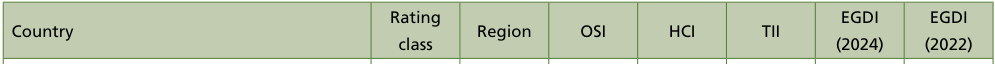

**----- Start of picture text -----** 
Rating  EGDI  EGDI Country Region OSI HCI TII class (2024) (2022) **----- End of picture text -----** 

|Country|Rating class|Region|OSI|HCI|TII|EGDI (2024)|EGDI (2022)|
|---|---|---|---|---|---|---|---|
|||||||||
|Denmark|VH|Europe|0.9992|0.9584|0.9966|0.9847|0.9717|
|Estonia|VH|Europe|0.9954|0.9497|0.9731|0.9727|0.9393|
|Singapore|VH|Asia|0.9831|0.9362|0.9881|0.9691|0.9133|
|Republic of Korea|VH|Asia|1.0000|0.9120|0.9917|0.9679|0.9529|
|Iceland|VH|Europe|0.9076|0.9953|0.9983|0.9671|0.9410|
|Saudi Arabia|VH|Asia|0.9899|0.9067|0.9841|0.9602|0.8539|
|United Kingdom of Great Britain and Northern Ireland|VH|Europe|0.9535|0.9450|0.9747|0.9577|0.9138|
|Australia|VH|Oceania|0.9222|1.0000|0.9509|0.9577|0.9405|
|Finland|VH|Europe|0.9097|0.9836|0.9791|0.9575|0.9533|
|Netherlands (Kingdom of the)|VH|Europe|0.9212|0.9688|0.9715|0.9538|0.9384|
|United Arab Emirates|VH|Asia|0.9163|0.9436|1.0000|0.9533|0.9010|
|Germany|VH|Europe|0.9238|0.9672|0.9236|0.9382|0.8770|
|Japan|VH|Asia|0.9427|0.9117|0.9509|0.9351|0.9002|
|Sweden|VH|Europe|0.8836|0.9275|0.9868|0.9326|0.9410|
|Norway|VH|Europe|0.9117|0.9175|0.9654|0.9315|0.8879|
|New Zealand|VH|Oceania|0.9453|0.9615|0.8728|0.9265|0.9432|
|Spain|VH|Europe|0.9054|0.8961|0.9603|0.9206|0.8842|
|Bahrain|VH|Asia|0.9030|0.8680|0.9877|0.9196|0.7707|

_Sources_ : 2022 and 2024 United Nations E-Government Surveys. 

41 

2024 UN E-GovErNmENt SUrvEy 

The group of countries in the highest (VH) rating class is almost identical to the corresponding group in the previous edition of the Survey, though there has been a net increase of three countries. Included in the VH rating class are 10 countries in Europe, 6 in Asia, and 2 in Oceania. In Europe, three countries (Germany, Norway and Spain) have joined this group, while Malta has moved down to the V3 rating class. In Asia, Bahrain and Saudi Arabia respectively moved from the V1 and V2 rating classes in 2022 to the VH rating class in 2024. In the Americas, the United States of America has moved from the VH to the V3 rating class. 

The 18 countries leading digital development are exclusively high-income countries. Denmark has the highest EGDI value globally for the fourth consecutive Survey and is one of ten countries in Europe and one of seven countries in the European Union that are part of the highest (VH) rating class. Spain is the only member of the VH rating class in Southern Europe; Germany and the Kingdom of the Netherlands are in Western Europe, and the other seven countries are in Northern Europe. Europe accounts for 56 per cent of the countries in the VH rating class (Denmark, Estonia, Finland, Germany, Iceland, Kingdom of the Netherlands, Norway, Spain, Sweden, and United Kingdom), and Asia accounts for 33 per cent (Bahrain, Japan, Republic of Korea, Singapore, United Arab Emirates, and Saudi Arabia). For the first time, Singapore is the top EGDI performer in Asia, followed by the Republic of Korea and Saudi Arabia. In Oceania, Australia and New Zealand lead e-government development, consistent with the past four editions of the Survey, and account for 11 per cent of the countries in the VH rating class. 

More detailed information on these developments and the specific efforts undertaken by the leading countries is available in chapter 3. 

## **2.4 National income and e-government development** 

There has always been a positive correlation between EGDI values and country income as measured by per capita gross domestic product (GDP). Higher-income countries tend to have higher EGDI values than do lower-income countries. This suggests that wealthier nations typically have more resources to invest in the necessary infrastructure, technology, and human capital required for advanced e-government services. Having a higher income allows these countries to develop robust telecommunications networks, comprehensive online services, and extensive educational programmes to boost digital literacy – all of which contribute to higher EGDI values. 

A detailed analysis of the EGDI and its component indices can be strategic for ascertaining nuanced policy implications. Examining these components individually can allow policymakers to identify specific areas of strength and weakness within their e-government framework. Understanding the interplay between these indices and broader socioeconomic factors enables countries to formulate more effective e-government strategies tailored to their specific needs. It highlights the importance of financial investment but also the need for comprehensive policies that support digital transformation, with clear provisions for inclusive education, innovative governance, and robust infrastructure development. 

Figure 2.6 shows the percentage change in EGDI component values between 2022 and 2024 for different national income groups. 

42 

Chapter 2 • Global trends in e-Government 

Figure 2.6 Percentage change in EGDI component values between 2022 and 2024, by country income group, 2024 

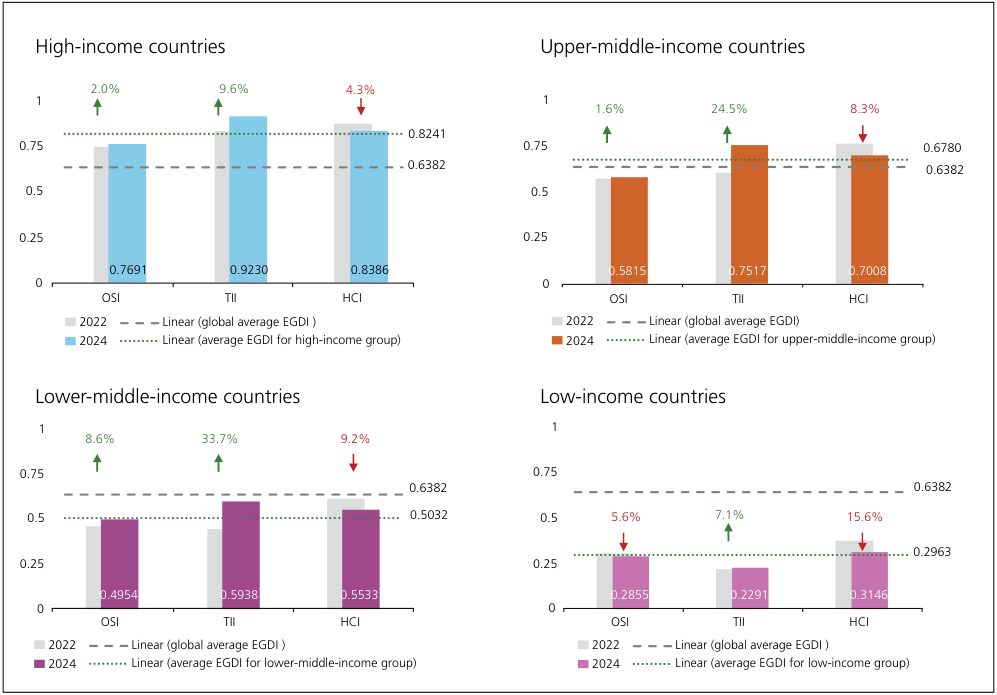

**----- Start of picture text -----** 
High-income countries Upper-middle-income countries 2.0% 9.6% 4.3% 1 1 1.6% 24.5% 8.3% 0.8241 0.75 0.75 0.6780 0.6382 0.6382 0.5 0.5 0.25 0.25 0.7691 0.9230 0.8386 0.5815 0.7517 0.7008 0 0 OSI TII HCI OSI TII HCI 2022 Linear (global average EGDI ) 2022 Linear (global average EGDI) 2024 Linear (average EGDI for high-income group) 2024 Linear (average EGDI for upper-middle-income group) lower-middle-income countries low-income countries 1 1 8.6% 33.7% 9.2% 0.75 0.75 0.6382 0.6382 0.5 0.5032 0.5 5.6% 7.1% 15.6% 0.2963 0.25 0.25 0.4954 0.5938 0.5533 0.2855 0.2291 0.3146 0 0 OSI TII HCI OSI TII HCI 2022 Linear (global average EGDI ) 2022 Linear (global average EGDI ) 2024 Linear (average EGDI for lower-middle-income group) 2024 Linear (average EGDI for low-income group) **----- End of picture text -----** 

_Sources_ : 2022 and 2024 United Nations E-Government Surveys. 

TII values have risen for all income groups in 2024, with the greatest increase observed for the lower-middle-income group (33.7 per cent), followed by the upper-middle-income group (24.5 per cent), the high-income group (9.6 per cent), and the low-income group (7.1 per cent). These gains demonstrate a concerted push towards improving the foundational aspects of digital connectivity. The corresponding increases in OSI values are less pronounced, indicating that infrastructure improvements are not yet translating into substantial enhancements in online services provision for many nations. 

countries in the upper-middle-income group have focused on enhancing telecommunications infrastructure, which has positively affected their overall EGDI values; improvements in online services have been more modest, averaging 1.6 per cent for this group. 

For the lower-middle-income group, the 8.6 per cent increase in the average OSI value suggests that these countries are prioritizing the allocation of resources towards improving online services provision. Among lower-middle-income countries, eight have very high OSI values: India (0.8184), Jordan (0.7591), Kenya (0.7770), Mongolia (0.8222), Philippines (0.8054), Thailand (0.7611), Ukraine (0.9854), and Uzbekistan (0.7648). Fifteen others (Bangladesh, Benin, Bhutan, Plurinational State of Bolivia, cabo Verde, côte d’Ivoire, Egypt, Ghana, Kyrgyzstan, Morocco, Nigeria, Pakistan, Sri lanka, Tunisia, and Viet Nam) have high OSI values. 

43 

2024 UN E-GovErNmENt SUrvEy 

High-income countries have already achieved a relatively high level of services provision, so the increases in their average OSI value (2.0 per cent) and average EGDI value (2.4 per cent) are more modest. While high-income countries continue to invest in and improve their digital services, incremental gains tend to be smaller, as these countries have already reached an advanced stage of development. The 9.6 per cent increase in the average TII value is impressive, however. 

A concerning trend is observed in low-income countries, where the average OSI value has declined by 5.6 per cent, and the average EGDI value has declined by 6.7 per cent despite the 7.1 per cent increase in the average TII value. This indicates that while many low-income countries are strengthening their telecommunications infrastructure, a substantial number face significant challenges in developing their e-government services and online presence, which are critical for enhancing public services delivery and citizen engagement; Rwanda, with a very high OSI value of 0.8207, and Uganda, with a high OSI value of 0.6069, are notable exceptions. The downward shift for the group as a whole signifies a deepening digital divide as low-income countries struggle to keep pace with other country income groups in digital development. 

For all country income groups, average HcI values have declined. This drop is primarily due to changes in the way the HcI is measured and does not necessarily imply disinvestment in human capital by the Member States. The HcI modifications include the addition of the new subindex to assess e-government literacy and refinements in the weights assigned to the other indicators. The updated HcI reflects a more comprehensive assessment of human capital development. 

The digital divide, as measured by the range in EGDI values, remains a critical issue in assessing global e-government development. Using the EGDI world average of 0.6382 as a proxy threshold, significant disparities are evident between countries of different income levels. Digital divides are vividly illustrated in figure 2.7, where countries in each income category are grouped by their EGDI values relative to the global average. 

Figure 2.7 Number of countries with EGDI values above and below the global average, by income group, 2024 

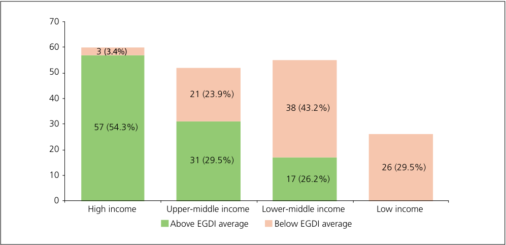

**----- Start of picture text -----** 
70 60 3 (3.4%) 50 40 21 (23.9%) 38 (43.2%) 30 57 (54.3%) 20 31 (29.5%) 26 (29.5%) 10 17 (26.2%) 0 High income Upper-middle income Lower-middle income Low income Above EGDI average Below EGDI average **----- End of picture text -----** 

_Source_ : 2024 United Nations E-Government Survey. 

44 

Chapter 2 • Global trends in e-Government 

Eighty-four per cent of the 105 Member States that have EGDI values above the global average are countries with a high income (54 per cent) or upper-middle income (30 per cent). This distribution underscores the strong correlation between national income level and the capacity to develop advanced e-government services. 

In stark contrast, only 16 per cent of the countries with EGDI values above the world average are in the lower-middle-income group, and none of the low-income countries have reached or exceeded the global average EGDI value. The lower-middle-income countries have seen improvement in their average OSI value but still make up a relatively small share of the countries with EGDI values above the global average. This indicates that while progress has been made in certain areas of digital government, countries on the lower end of the income spectrum continue to struggle with comprehensive e-government development. The improvements in OSI values suggest that there have been targeted efforts to enhance online services; however, these efforts alone are insufficient to overcome the broader infrastructural and human capital deficits that hinder overall e-government progress. 

These trends highlight the substantial challenges faced by lower-income countries in bridging the digital divide. A more detailed analysis of the digital divide and its implications for global and regional e-government development is provided in chapter 3. This analysis delves deeper into the specific challenges faced by the countries in different income groups and offers insights into effective strategies for narrowing the digital divide and achieving greater equity and inclusiveness in the provision of digital government services worldwide. 

## **2.5 Online Services Index** 

OSI values are based on the results of a comprehensive survey covering multiple aspects of the online presence of all 193 Member States. The five OSI subindices include services provision, the institutional framework supporting e-government development, content provision, technological aspects of the portals, and e-participation. The composite OSI value is calculated based on the normalized values for each of these subindices (see the technical appendix for details on the methodology used). The results are tabulated and presented as a set of standardized index values on a scale of 0 to 1, with 1 corresponding to the highest-rated online services provision and 0 to the lowest. 

OSI values, like EGDI values, are not intended as absolute measurements; rather, they capture the online performance of countries relative to each other at a particular point in time. Because the OSI is a composite tool, a high value is an indication of current best practices rather than perfection. Similarly, a lower value, or a value that has not changed since the last edition of the Survey, does not mean there has been no progress in e-government development. Survey results relating to the OSI and its five subindices are presented below. 

## **2.5.1 Country groupings by OSI and EGDI levels** 

Figure 2.8 highlights the positive correlation between progress in online services provision and overall improvement in e-government development (as reflected in OSI and EGDI values). 

While a country’s online services development is often a solid predictor of overall e-government development, the two are not always aligned, as the TII and HcI components are also factored into the EGDI value. It is important to identify cases in which the OSI level is higher or lower than the overall EGDI level so that targeted policies can be adopted and sufficient resources allocated for the improvement of online services provision. 

45 

2024 UN E-GovErNmENt SUrvEy 

Figure 2.8 Distribution of EGDI levels relative to OSI levels for United Nations Member States, 2024 

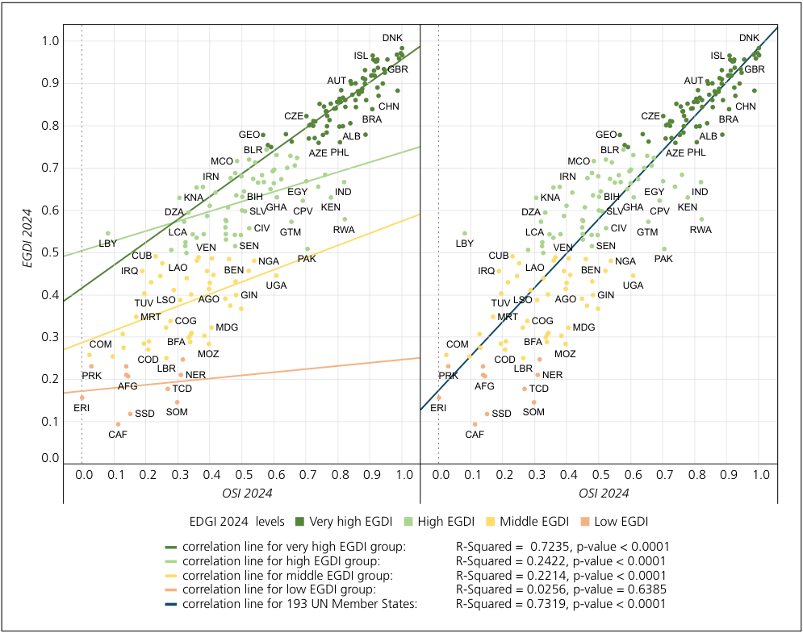

**----- Start of picture text -----** 
1.0 DNK DNK ISL ISL GBR GBR 0.9 AUT AUT CHN CHN 0.8 CZE BRA CZE BRA GEO ALB GEO ALB BLR AZE PHL BLR AZE PHL MCO MCO 0.7 IRN IRN KNA BIH EGY IND KNA BIH EGY IND 0.6 DZA SLV GHA CPV KEN DZA SLV GHA CPV KEN LCA CIV GTM RWA LCA CIV GTM RWA 0.5 LBY CUB VEN SENNGA PAK LBY CUB VEN SENNGA PAK IRQ LAO BEN IRQ LAO BEN UGA UGA 0.4 TUV LSO AGO GIN TUV LSO AGO GIN MRT COG MRT COG MDG MDG 0.3 COM BFA COM BFA MOZ MOZ COD COD LBR LBR 0.2 PRK NER PRK NER AFG TCD AFG TCD ERI SSD SOM ERI SSD SOM 0.1 CAF CAF 0.0 0.0 0.1 0.2 0.3 0.4 0.5 0.6 0.7 0.8 0.9 1.0 0.0 0.1 0.2 0.3 0.4 0.5 0.6 0.7 0.8 0.9 1.0 OSI 2024 OSI 2024 EDGI 2024  levels     Very high EGDI       High EGDI       Middle EGDI       Low EGDI correlation line for very high EGDI group:              R-Squared =  0.7235, p-value < 0.0001 correlation line for high EGDI group:                     R-Squared = 0.2422, p-value < 0.0001 correlation line for middle EGDI group:                 R-Squared = 0.2214, p-value < 0.0001 correlation line for low EGDI group:                      R-Squared = 0.0256, p-value = 0.6385 correlation line for 193 UN Member States:          R-Squared = 0.7319, p-value < 0.0001 EGDI 2024 **----- End of picture text -----** 

_Source_ : 2024 United Nations E-Government Survey 

As indicated in table 2.3, OSI and EGDI levels are positively correlated for 123 of the 193 Member States (64 per cent). However, 11 countries have OSI levels that are higher than their EGDI levels, and 59 countries have OSI levels lower than their respective EGDI levels; in the first group, the level of online services provision has already surpassed the level of telecommunications infrastructure and/ or human capital development, while in the second group, the higher levels of infrastructure and/ or human capital development provide a foundation for accelerating the development of online services provision. 

From a policymaking perspective, the implications for improving overall e-government development (expressed as an EGDI value) may differ for countries with divergences in OSI, TII or HcI levels, which are highlighted below. 

## Very high OSI group 

Ninety-four per cent of the 65 countries with very high OSI values (ranging from 0.75 to 1.00) also have very high EGDI values. Table 2.4 lists countries with very high OSI levels that have divergent EGDI, TII or HcI values. This snapshot suggests that Ecuador would benefit from further investment in telecommunications infrastructure, whereas India, Jordan, Kenya and Rwanda need to focus on the development of both digital infrastructure and human capital.  Peru, the Philippines and Qatar already have very high TII values but would benefit from additional investment in human capital development. 

46 

Chapter 2 • Global trends in e-Government 

Table 2.3 Convergence and divergence of OSI levels relative to EGDI levels, 2024 

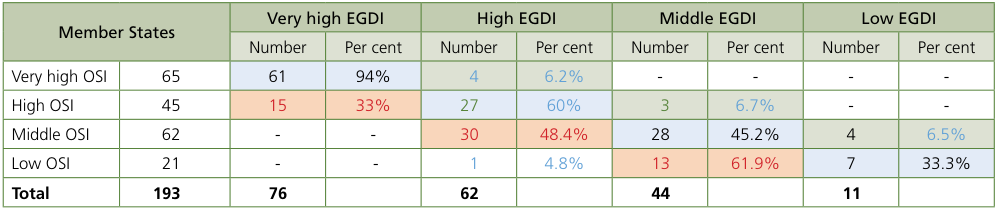

**----- Start of picture text -----** 
Very high EGDI  High EGDI Middle EGDI Low EGDI Member States Number Per cent Number Per cent Number  Per cent Number  Per cent Very high OSI  65 61 94% 4 6.2% - - - - High OSI  45 15 33% 27 60% 3 6.7% - - Middle OSI  62 - - 30 48.4% 28 45.2% 4 6.5% low OSI  21 -  - 1 4.8% 13 61.9% 7 33.3% Total  193 76 62 44 11 **----- End of picture text -----** 

_Source_ : 2024 United Nations E-Government Survey. _Notes_ : The cells shaded in blue indicate convergence between OSI and EGDI levels. The cells shaded in green and red represent divergence (green = OSI level > EGDI level; red = OSI level < EGDI level). 

Table 2.4 Countries with very high OSI levels and divergent EDGI, TII or HCI levels, 2024 

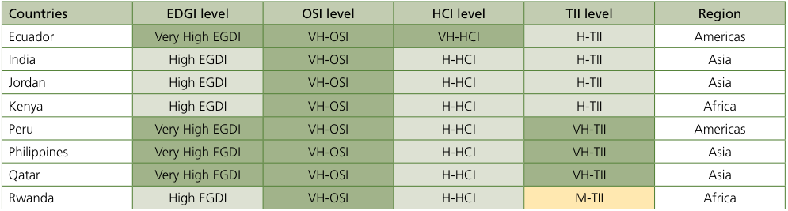

**----- Start of picture text -----** 
Countries EDGI level  OSI level HCI level TII level  Region Ecuador Very High EGDI VH-OSI VH-HcI  H-TII Americas India High EGDI VH-OSI H-HcI H-TII Asia Jordan High EGDI VH-OSI H-HcI H-TII Asia Kenya High EGDI VH-OSI H-HcI H-TII Africa Peru Very High EGDI VH-OSI H-HcI VH-TII Americas Philippines Very High EGDI VH-OSI H-HcI VH-TII Asia Qatar Very High EGDI VH-OSI H-HcI VH-TII Asia Rwanda High EGDI VH-OSI H-HcI M-TII Africa **----- End of picture text -----** 

_Source_ : 2024 United Nations E-Government Survey. 

## High OSI group 

The high OSI group is relatively diverse in terms of HcI, TII, and overall EGDI values (see table 2.5). National e-government development policies can be tailored to specific needs within this context. 

Among the 45 countries with high OSI values (0.50 to 0.75), 27 have high EGDI values as well. However, only seven countries (Bangladesh, the Plurinational State of Bolivia, cabo Verde, Dominican Republic, Egypt, Ghana, and Jamaica) are also in the high TII and HcI groups. 

Belgium, costa Rica, czechia, Georgia, Hungary, liechtenstein, Republic of Moldova, and Slovakia have very high TII and HcI values and are all part of the very high EGDI group. With such a solid foundation in place, these countries can focus on further developing their online services. 

Azerbaijan, Brunei Darussalam, Kuwait, Malaysia, Mauritius, Romania, and Viet Nam have very high TII and EGDI values but can accelerate digital development by improving online services delivery and human capital development. 

countries whose strongest component is telecommunications infrastructure (as reflected in their very high TII values) include Bahamas, Belarus, Bhutan, Bosnia and Herzegovina, El Salvador, Fiji, Kyrgyzstan, Maldives, Montenegro, Morocco, North Macedonia, Panama, Paraguay, Sri lanka, Trinidad and Tobago, and Tunisia. With high values for the other two components and the composite Index, these countries are making solid progress but can improve their overall e-government development (EGDI values) by investing more in strengthening human capital and online services provision. 

47 

2024 UN E-GovErNmENt SUrvEy 

Table 2.5 Countries with high OSI levels grouped by divergences with EDGI, TII or HCI levels, 2024 

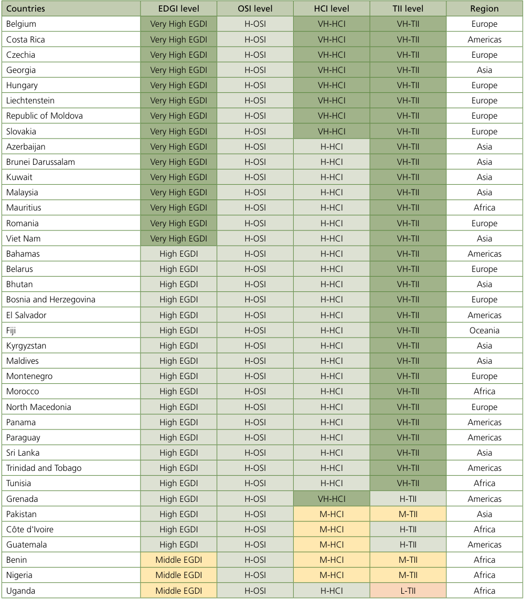

**----- Start of picture text -----** 
Countries EDGI level  OSI level HCI level TII level  Region Belgium Very High EGDI H-OSI VH-HcI  VH-TII Europe costa Rica Very High EGDI H-OSI VH-HcI  VH-TII Americas czechia Very High EGDI H-OSI VH-HcI  VH-TII Europe Georgia Very High EGDI H-OSI VH-HcI  VH-TII Asia Hungary Very High EGDI H-OSI VH-HcI  VH-TII Europe liechtenstein Very High EGDI H-OSI VH-HcI  VH-TII Europe Republic of Moldova Very High EGDI H-OSI VH-HcI  VH-TII Europe Slovakia Very High EGDI H-OSI VH-HcI  VH-TII Europe Azerbaijan Very High EGDI H-OSI H-HcI VH-TII Asia Brunei Darussalam Very High EGDI H-OSI H-HcI VH-TII Asia Kuwait Very High EGDI H-OSI H-HcI VH-TII Asia Malaysia Very High EGDI H-OSI H-HcI VH-TII Asia Mauritius Very High EGDI H-OSI H-HcI VH-TII Africa Romania Very High EGDI H-OSI H-HcI VH-TII Europe Viet Nam Very High EGDI H-OSI H-HcI VH-TII Asia Bahamas High EGDI H-OSI H-HcI VH-TII Americas Belarus High EGDI H-OSI H-HcI VH-TII Europe Bhutan High EGDI H-OSI H-HcI VH-TII Asia Bosnia and Herzegovina High EGDI H-OSI H-HcI VH-TII Europe El Salvador High EGDI H-OSI H-HcI VH-TII Americas Fiji High EGDI H-OSI H-HcI VH-TII Oceania Kyrgyzstan High EGDI H-OSI H-HcI VH-TII Asia Maldives High EGDI H-OSI H-HcI VH-TII Asia Montenegro High EGDI H-OSI H-HcI VH-TII Europe Morocco High EGDI H-OSI H-HcI VH-TII Africa North Macedonia High EGDI H-OSI H-HcI VH-TII Europe Panama High EGDI H-OSI H-HcI VH-TII Americas Paraguay High EGDI H-OSI H-HcI VH-TII Americas Sri lanka High EGDI H-OSI H-HcI VH-TII Asia Trinidad and Tobago High EGDI H-OSI H-HcI VH-TII Americas Tunisia High EGDI H-OSI H-HcI VH-TII Africa Grenada High EGDI H-OSI VH-HcI  H-TII Americas Pakistan High EGDI H-OSI M-HcI M-TII Asia côte d'Ivoire High EGDI H-OSI M-HcI H-TII Africa Guatemala High EGDI H-OSI M-HcI H-TII Americas Benin Middle EGDI H-OSI M-HcI M-TII Africa Nigeria Middle EGDI H-OSI M-HcI M-TII Africa Uganda Middle EGDI H-OSI H-HcI l-TII Africa **----- End of picture text -----** 

_Source_ : 2024 United Nations E-Government Survey. 

48 

Chapter 2 • Global trends in e-Government 

Granada has a very high HcI level and can capitalize on this by investing in infrastructure development and online services provision. 

Benin, Nigeria and Pakistan are in the middle TII and HcI groups. Through its significant investment in online services provision, Pakistan has achieved a higher level of overall e-government development than the other two countries. Benin and Nigeria have higher HcI and TII values than does Pakistan and would benefit from increased investment in online services provision. 

Guatemala and côte d’Ivoire have high EGDI values of 0.6583 and 0.5219, respectively, but the TII value is higher in côte d’Ivoire (0.6693) than in Guatemala (0.5596). While both countries need to invest in strengthening e-government, particularly through human capital development, the stronger telecommunications infrastructure in côte d’Ivoire will allow more rapid advancement in online services provision. 

With an HcI value of 0.5023, an OSI value of 0.6069, and a TII value of 0.2299, Uganda has leveraged its human capital to achieve notable progress in online services delivery despite having an underdeveloped telecommunications infrastructure. Significant investment in building this infrastructure will allow the country to reach a higher level of e-government development. 

## Middle OSI group 

Divergences between OSI and EGDI levels are most pronounced for the group of 62 countries with middle OSI values (0.25 to 0.50). About half of these countries have high EDGI levels, and four have low EGDI levels. 

For nine countries in the middle OSI group (Angola, congo, Ethiopia, Guinea, lesotho, Sierra leone, Syrian Arab Republic, Togo, and United Republic of Tanzania), the EGDI, OSI, HcI and TII levels coincide. The variations in TII and HcI levels for the other countries in the group are provided in table 2.6. 

Twenty-five countries in the middle OSI group – Algeria, Antigua and Barbuda, Botswana, cambodia, Eswatini, Gabon, Islamic Republic of Iran, Nepal, Saint Kitts and Nevis, San Marino, Seychelles, Suriname, Dominica, Guyana, lebanon, Myanmar, Namibia, Nicaragua, Saint lucia, Saint Vincent and the Grenadines, Tajikistan, Vanuatu, Bolivarian Republic of Venezuela, and Zambia – have high EGDI values, and their telecommunications infrastructure and human capital are sufficiently well developed to support accelerated advancement in e-government if investments are targeted towards improving services delivery. 

Barbados and Monaco have very high HcI and TII values but are in the high EGDI group because their online services provision requires further development. Togo and Palau have highly developed human capital but need to improve their telecommunications infrastructure and online services provision. 

For 19 other countries (Belize, Turkmenistan, lao People’s Democratic Republic, Marshall Islands, cameroon, Honduras, Kiribati, Samoa, Timor-leste, Zimbabwe, Burkina Faso, Mali, liberia, Madagascar, Malawi, Federated States of Micronesia, Mozambique, Papua New Guinea, and Solomon Islands), EGDI and OSI levels coincide, but OSI, TII and HcI values diverge, indicating that targeted efforts may be needed in one or more of these areas to achieve balanced and comprehensive e-government development. 

49 

2024 UN E-GovErNmENt SUrvEy 

Table 2.6 Countries with middle OSI levels grouped by divergences with EDGI, TII or HCI levels, 2024 

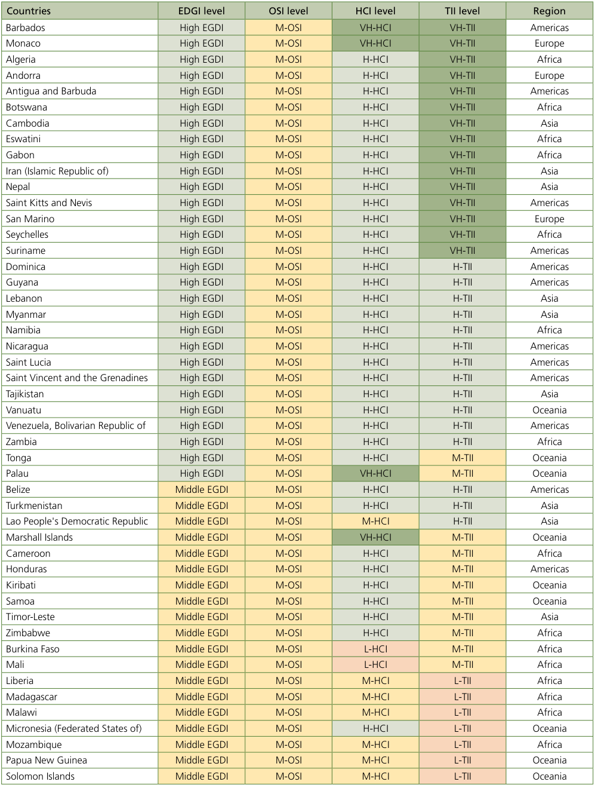

**----- Start of picture text -----** 
Countries EDGI level  OSI level HCI level TII level  Region Barbados High EGDI M-OSI  VH-HcI  VH-TII Americas Monaco High EGDI M-OSI  VH-HcI  VH-TII Europe Algeria High EGDI M-OSI  H-HcI VH-TII Africa Andorra High EGDI M-OSI  H-HcI VH-TII Europe Antigua and Barbuda High EGDI M-OSI  H-HcI VH-TII Americas Botswana High EGDI M-OSI  H-HcI VH-TII Africa cambodia High EGDI M-OSI  H-HcI VH-TII Asia Eswatini High EGDI M-OSI  H-HcI VH-TII Africa Gabon High EGDI M-OSI  H-HcI VH-TII Africa Iran (Islamic Republic of) High EGDI M-OSI  H-HcI VH-TII Asia Nepal High EGDI M-OSI  H-HcI VH-TII Asia Saint Kitts and Nevis High EGDI M-OSI  H-HcI VH-TII Americas San Marino High EGDI M-OSI  H-HcI VH-TII Europe Seychelles High EGDI M-OSI  H-HcI VH-TII Africa Suriname High EGDI M-OSI  H-HcI VH-TII Americas Dominica High EGDI M-OSI  H-HcI H-TII Americas Guyana High EGDI M-OSI  H-HcI H-TII Americas lebanon High EGDI M-OSI  H-HcI H-TII Asia Myanmar High EGDI M-OSI  H-HcI H-TII Asia Namibia High EGDI M-OSI  H-HcI H-TII Africa Nicaragua High EGDI M-OSI  H-HcI H-TII Americas Saint lucia High EGDI M-OSI  H-HcI H-TII Americas Saint Vincent and the Grenadines High EGDI M-OSI  H-HcI H-TII Americas Tajikistan High EGDI M-OSI  H-HcI H-TII Asia Vanuatu High EGDI M-OSI  H-HcI H-TII Oceania Venezuela, Bolivarian Republic of High EGDI M-OSI  H-HcI H-TII Americas Zambia High EGDI M-OSI  H-HcI H-TII Africa Tonga High EGDI M-OSI  H-HcI M-TII Oceania Palau High EGDI M-OSI  VH-HcI  M-TII Oceania Belize Middle EGDI M-OSI  H-HcI H-TII Americas Turkmenistan Middle EGDI M-OSI  H-HcI H-TII Asia lao People's Democratic Republic Middle EGDI M-OSI  M-HcI H-TII Asia Marshall Islands Middle EGDI M-OSI  VH-HcI  M-TII Oceania cameroon Middle EGDI M-OSI  H-HcI M-TII Africa Honduras Middle EGDI M-OSI  H-HcI M-TII Americas Kiribati Middle EGDI M-OSI  H-HcI M-TII Oceania Samoa Middle EGDI M-OSI  H-HcI M-TII Oceania Timor-leste Middle EGDI M-OSI  H-HcI M-TII Asia Zimbabwe Middle EGDI M-OSI  H-HcI M-TII Africa Burkina Faso Middle EGDI M-OSI  l-HcI M-TII Africa Mali Middle EGDI M-OSI  l-HcI M-TII Africa liberia Middle EGDI M-OSI  M-HcI l-TII Africa Madagascar Middle EGDI M-OSI  M-HcI l-TII Africa Malawi Middle EGDI M-OSI  M-HcI l-TII Africa Micronesia (Federated States of) Middle EGDI M-OSI  H-HcI l-TII Oceania Mozambique Middle EGDI M-OSI  M-HcI l-TII Africa Papua New Guinea Middle EGDI M-OSI  M-HcI l-TII Oceania Solomon Islands Middle EGDI M-OSI  M-HcI l-TII Oceania **----- End of picture text -----** 

_Source_ : 2024 United Nations E-Government Survey. 

50 

Chapter 2 • Global trends in e-Government 

## Low OSI group 

Of the 21 countries with low OSI values (0.00 to 0.25), 1 has a high EGDI value and 13 are in the middle EDGI group. These countries (libya, cuba, Nauru, Sao Tome and Principe, Tuvalu, Iraq, Mauritania, comoros, Djibouti, Equatorial Guinea, Gambia, Guinea-Bissau, Sudan, and Democratic Republic of the congo), along with Yemen, have a moderately developed infrastructure and human capital base that, while limited, can support the expansion of online services delivery and contribute to overall e-government development. For Afghanistan, Democratic People’s Republic of Korea, Eritrea, Haiti, central African Republic, and South Sudan, significant investment is needed in all areas; failing to move forward with e-government and broader digital development will only widen the digital divide as some countries are left behind in a world that is becoming highly digitalized. 

Table 2.7 Countries with low OSI levels grouped by divergences with EDGI, TII or HCI levels, 2024 

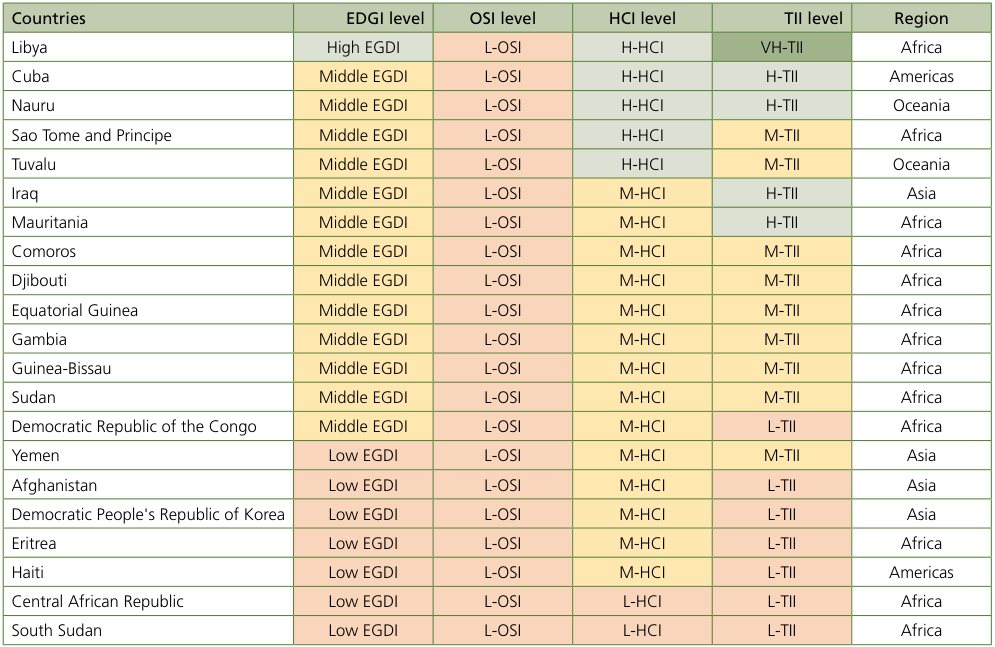

**----- Start of picture text -----** 
Countries EDGI level  OSI level HCI level TII level  Region libya High EGDI l-OSI H-HcI VH-TII Africa cuba Middle EGDI l-OSI H-HcI H-TII Americas Nauru Middle EGDI l-OSI H-HcI H-TII Oceania Sao Tome and Principe Middle EGDI l-OSI H-HcI M-TII Africa Tuvalu Middle EGDI l-OSI H-HcI M-TII Oceania Iraq Middle EGDI l-OSI M-HcI H-TII Asia Mauritania Middle EGDI l-OSI M-HcI H-TII Africa comoros Middle EGDI l-OSI M-HcI M-TII Africa Djibouti Middle EGDI l-OSI M-HcI M-TII Africa Equatorial Guinea Middle EGDI l-OSI M-HcI M-TII Africa Gambia Middle EGDI l-OSI M-HcI M-TII Africa Guinea-Bissau Middle EGDI l-OSI M-HcI M-TII Africa Sudan Middle EGDI l-OSI M-HcI M-TII Africa Democratic Republic of the congo Middle EGDI l-OSI M-HcI l-TII Africa Yemen low EGDI l-OSI M-HcI M-TII Asia Afghanistan low EGDI l-OSI M-HcI l-TII Asia Democratic People's Republic of Korea low EGDI l-OSI M-HcI l-TII Asia Eritrea low EGDI l-OSI M-HcI l-TII Africa Haiti low EGDI l-OSI M-HcI l-TII Americas central African Republic low EGDI l-OSI l-HcI l-TII Africa South Sudan low EGDI l-OSI l-HcI l-TII Africa **----- End of picture text -----** 

_Source_ : 2024 United Nations E-Government Survey. 

51 

2024 UN E-GovErNmENt SUrvEy 

## **2.5.2 OSI subindices** 

The subsections above have highlighted areas that require further attention if countries wish to strengthen overall e-government development (as reflected in their respective EGDI levels). In cases where improvements in online services provision (OSI values) are necessary, it is important to understand which specific aspects of this component require attention. The main Survey findings for each of the five OSI subindices are presented below. 

As shown in figure 2.9, the institutional framework (IF) is better developed than other aspects of online services provision in all regions. content provision (cP) has the next highest subindex value, followed by services provision (SP), technical characteristics (TEc) and e-participation (EPI). At the regional level, Europe is leading in terms of average OSI and subindex values, followed by Asia, the Americas, Oceania, and Africa – the one exception being that the technical aspects of the OSI are slightly better developed in Africa than in Oceania. 

Figure 2.9 Values for OSI subindices (IF, CP, SP, TEC and EPI) at the regional and global levels, 2024 

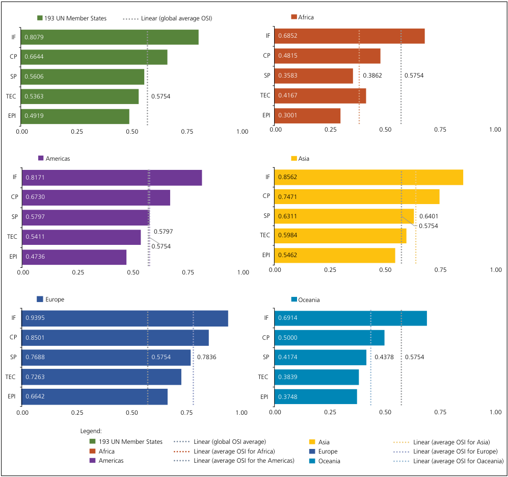

**----- Start of picture text -----** 
193 UN Member States Linear (global average OSI) Africa IF 0.8079 IF 0.6852 CP 0.6644 CP 0.4815 SP 0.5606 SP 0.3583 0.3862 0.5754 TEC 0.5363 0.5754 TEC 0.4167 EPI 0.4919 EPI 0.3001 0.00 0.25 0.50 0.75 1.00 0.00 0.25 0.50 0.75 1.00 Americas Asia IF 0.8171 IF 0.8562 CP 0.6730 CP 0.7471 SP 0.5797 SP 0.6311 0.6401 0.5754 0.5797 TEC 0.5411 TEC 0.5984 0.5754 EPI 0.4736 EPI 0.5462 0.00 0.25 0.50 0.75 1.00 0.00 0.25 0.50 0.75 1.00 Europe Oceania IF 0.9395 IF 0.6914 CP 0.8501 CP 0.5000 SP 0.7688 0.5754 0.7836 SP 0.4174 0.4378 0.5754 TEC 0.7263 TEC 0.3839 EPI 0.6642 EPI 0.3748 0.00 0.25 0.50 0.75 1.00 0.00 0.25 0.50 0.75 1.00 Legend: 193 UN Member States Linear (global OSI average) Asia Linear (average OSI for Asia) Africa Linear (average OSI for Africa) Europe Linear (average OSI for Europe) Americas Linear (average OSI for the Americas) Oceania Linear (average OSI for Oaceania) **----- End of picture text -----** 

_Source_ : 2024 United Nations E-Government Survey. 

52 

Chapter 2 • Global trends in e-Government 

## **2.5.3 OSI institutional framework subindex** 

The organizational aspects of the institutional framework, which orient users on engaging government agencies through the online platforms, are well developed across the board (see figure 2.10). All Member States except Belize* have fully operational national portals. The vast majority of countries (95 per cent) make the government organizational chart and information on the government structure available on these portals, 91 per cent provide the names and titles of the heads of government agencies, departments and ministries, 81 per cent furnish information on the national chief information officer (cIO) or the equivalent, and 75 per cent share links to subnational or local government agencies. More than 90 per cent of the countries have national portals that provide links to ministerial websites and offer sources of information on sector-specific policies. 

Figure 2.10 Percentage of countries addressing various aspects of the institutional framework, 2024 

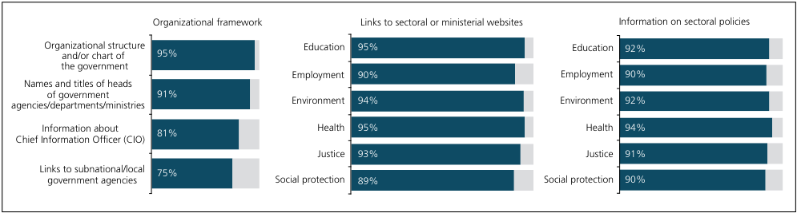

**----- Start of picture text -----** 
Organizational framework  Links to sectoral or ministerial websites  Information on sectoral policies Organizational structureand/or chart of  95% Education 95% Education 92% the government Employment 90% Employment 90% Names and titles of heads agencies/departments/ministriesof government 91% Environment 94% Environment 92% Chief Information Officer (CIO)Information about 81% Health 95% Health 94% Justice 93% Justice 91% Links to subnational/local 75% government agencies Social protection 89% Social protection 90% **----- End of picture text -----** 

_Sources_ : 2024 United Nations E-Government Survey. 

The legislative, policy and strategy aspects of the institutional framework are less consistently developed (see figure 2.11). Between 81 and 83 per cent of countries have national e-government strategies, policies or legislation on cybersecurity, data privacy, and data protection, 78 per cent require citizens to use a digital ID when accessing public services, and 76 per cent offer public access to legislation on the right of citizens to access government information. The shares are lower for legislation or policies on open government data (63 per cent), e-participation (51 per cent), protecting the public against misinformation, disinformation, and/or fake news (47 per cent), and frontier technologies such as cloud computing (44 per cent) and artificial intelligence (42 per cent). Regional disparities are more pronounced for these last five indicators; more than half of the countries in Asia and Europe have already adopted relevant legislation, policies or strategies, the average for the Americas is slightly above 30 per cent and that for Africa slightly below 30 per cent, and in Oceania the compliance rates range from 4 to 11 per cent. 

> *  At the time of the assessment for the Survey, the national portal of Belize was under review and inaccessible. To the extent possible, the assessment was conducted through various ministerial website 

53 

2024 UN E-GovErNmENt SUrvEy 

Figure 2.11 Percentage of countries with legislative frameworks relevant to e-government development, 2024 

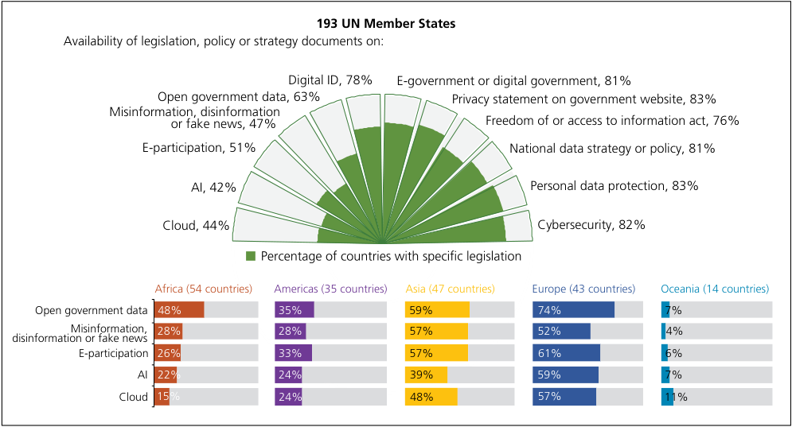

**----- Start of picture text -----** 
193 UN Member States Availability of legislation, policy or strategy documents on: Digital ID, 78% E-government or digital government, 81% Open government data, 63% Privacy statement on government website, 83% Misinformation, disinformation or fake news, 47%  Freedom of or access to information act, 76% E-participation, 51% National data strategy or policy, 81% AI, 42% Personal data protection, 83% Cloud, 44% Cybersecurity, 82% Africa (54 countries) Americas (35 countries)  Asia (47 countries)  Europe (43 countries)  Oceania (14 countries) Open government data 48% 52% 35% 65% 59% 41% 74% 26% 7% 93% Misinformation, 28% 72% 28% 72% 57% 43% 52% 48% 4% 96% disinformation or fake news E-participation 26% 74% 33% 67% 57% 43% 61% 39% 6% 94% AI 22% 78% 24% 76% 39% 61% 59% 41% 7% 93% Cloud 15% 85% 24% 76% 48% 52% 57% 43% 11% 89% **----- End of picture text -----** 

Source: 2024 United Nations E-Government Survey. 

## **2.5.4 OSI content provision subindex** 

In most countries (86 per cent), the Government provides information and services in multiple languages, which strengthens inclusiveness and facilitates access to information and online services in multilingual societies (see figure 2.12). However, fewer than half (47 per cent) proactively share web statistics on usage such as the number of new visits, total page views, or average time spent on site on their national portals. 

Figure 2.12 Content provision on national portals, 2024 _(Percentage of countries, by region)_ 

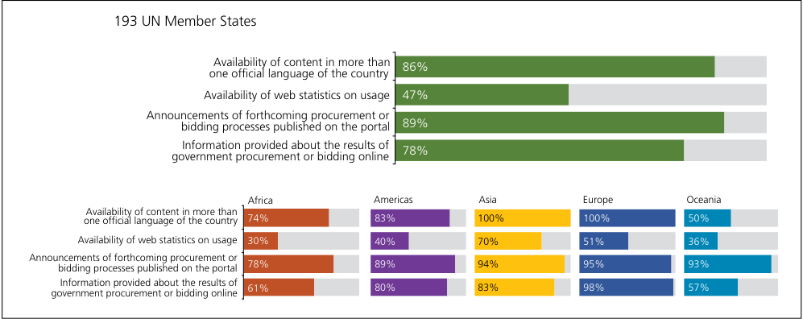

**----- Start of picture text -----** 
193 UN Member States one official language of the countryAvailability of content in more than 86% Availability of web statistics on usage 47% Announcements of forthcoming procurement or bidding processes published on the portal 89% Information provided about the results of 78% government procurement or bidding online Africa Americas Asia Europe Oceania one official language of the countryAvailability of content in more than 74% 83% 100% 100% 50% Availability of web statistics on usage 30% 40% 70% 51% 36% Announcements of forthcoming procurement orbidding processes published on the portal 78% 89% 94% 95% 93% government procurement or bidding onlineInformation provided about the results of 61% 80% 83% 98% 57% **----- End of picture text -----** 

_Source_ : 2024 United Nations E-Government Survey. 

54 

Chapter 2 • Global trends in e-Government 

Publishing announcements of forthcoming procurement or bidding processes on national portals is now routine in 89 per cent of the countries surveyed, but fewer countries (78 per cent) share information about the bidding or procurement results online. In Europe, these practices are more consistent and nearly universal, with 95 per cent of the region’s countries posting announcements and 98 per cent sharing results; the gap between the two indicators is only 3 per cent in Europe but is about 10 per cent in Asia and the Americas, 17 per cent in Africa, and 36 per cent in Oceania. 

## **2.5.5 OSI e-participation subindex** 

As an essential part of e-government development, the Survey has regularly assessed the readiness of Governments to “ensure responsive, inclusive, participatory and representative decision-making at all levels”, as called for in SDG target 16.7. The e-participation subindex uses a three-point scale that identifies progressive levels of engagement based on government policies, provisions and practices surrounding public participation in governance. The first level is providing information to the population on important aspects of public life, the second is engaging the public in consultations on policy development and/or services delivery at different stages of the process, and the third level is reflecting public input and involving people in decision-making.[1] Government portals and websites are assessed for features such as the integration of participatory budgeting or similar mechanisms; the availability of open government data (OGD) in general and in six key sectors linked closely to SDG implementation (education employment, environment, health, justice, and social protection); evidence that people’s voices are heard in discussions and decision-making processes linked to the formulation and adoption of policies on issues relating to vulnerable populations; and evidence of online consultations (via e-forums, e-polls, e-questionnaires, or other e-participation tools) that are designed to facilitate the engagement of people in vulnerable situations. 

countries with higher EGDI values normally have higher EPI values (see figure 2.13). Of the 76 countries with very high EGDI values in 2024, 93 per cent have EPI values that are very high (44 countries) or high (27 countries); only a handful of countries with very high EGDI values – Azerbaijan, Brunei Darussalam, Kuwait, Mauritius and Qatar – have comparatively low EPI values (averaging 0.4302). There are 33 countries with high EGDI values (Antigua and Barbuda, Bahamas, Barbados, Belarus, Bhutan, Plurinational State of Bolivia, Botswana, cambodia, côte d’Ivoire, Dominica, El Salvador, Eswatini, Fiji, Guatemala, Jamaica, Kyrgyzstan, lebanon, Maldives, Morocco, Namibia, Pakistan, Palau, Saint Vincent and the Grenadines, Senegal, Seychelles, Sri lanka, Suriname, Tajikistan, Tonga, Trinidad and Tobago, Tunisia, Vanuatu, and Zambia) that have an average EPI value of only 0.3852. 

55 

2024 UN E-GovErNmENt SUrvEy 

Figure 2.13 Distribution of EGDI levels relative to EPI levels for United Nations Member States, 2024 

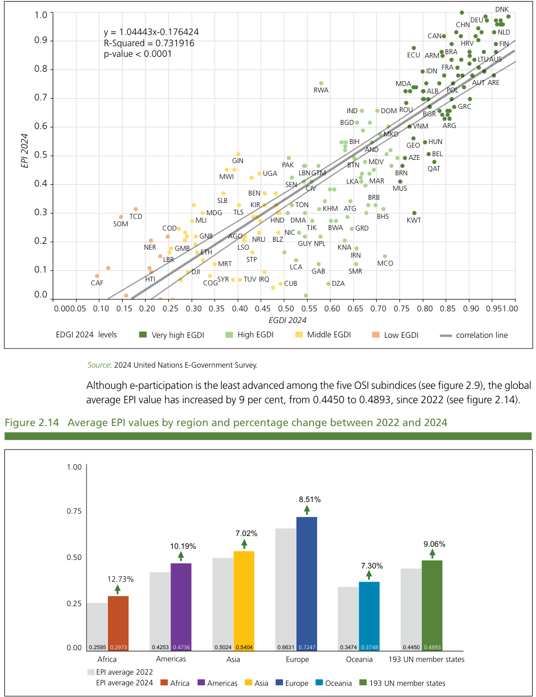

**----- Start of picture text -----** 
DNK 1.0 CHN [DEU] y = 1.04443x-0.176424 CAN NLD 0.9 R-Squared = 0.731916 HRV FIN p-value < 0.0001 ECU ARM BRA LTUAUS 0.8 IDN FRA MDA AUT ARE RWA ALB POL 0.7 GRC IND DOM ROU BGR BGD 0.6 VNM ARG MKD BIH GEO HUN AND 0.5 GIN MDV AZE BEL PAK BTN MWI UGA LBN GTM BRN QAT 0.4 SEN LKA MAR CIV MUS BEN SLB BRB KIR TON 0.3 MDG TLS KHM ATG TCD BHS SOM MLI HND DMA KWT COD TJK BWA GRD NIC 0.2 GNB AGO NRU BLZ GUY NPL NER GMB LSO KNA ETH IRN LBR STP 0.1 DJI MRT LCA GAB SMR MCO CAF HTI COGSYR TUV IRQ CUB DZA 0.0 0.000.05 0.10 0.15 0.20 0.25 0.30 0.35 0.40 0.45 0.50 0.55 0.60 0.65 0.70 0.75 0.80 0.85 0.90 0.951.00 EGDI 2024 EDGI 2024  levels Very high EGDI     High EGDI Middle EGDI Low EGDI correlation line Source : 2024 United Nations E-Government Survey. Although e-participation is the least advanced among the five OSI subindices (see figure 2.9), the global average EPI value has increased by 9 per cent, from 0.4450 to 0.4893, since 2022 (see figure 2.14). Figure 2.14 Average EPI values by region and percentage change between 2022 and 2024 1.00 8.51% 0.75 7.02% 10.19% 9.06% 0.50 7.30% 12.73% 0.25 0.00 0.2595 0.2973 0.4253 0.4736 0.5024 0.5404 0.6631 0.7247 0.3474 0.3748 0.4450 0.4893 Africa Americas Asia Europe Oceania 193 UN member states EPI average 2022 EPI average 2024  Africa Americas  Asia  Europe  Oceania  193 UN member states EPI 2024 **----- End of picture text -----** 

_Sources_ : 2022 and 2024 United Nations E-Government Surveys. 

56 

Chapter 2 • Global trends in e-Government 

All regions have improved in terms of proactive engagement with the public through e-participation processes. However, regional disparities remain significant; 93 per cent of countries in Europe have high or very high EPI values (ranging from 0.5 to 1), compared with 49 per cent in Asia, 40 per cent in the Americas, 14 per cent in Oceania, and 13 per cent in Africa (see figure 2.15).[2] Regional variations in the extent to which they address specific aspects of e-participation are reviewed below. 

Figure 2.15 Global and regional distribution of countries by EPI level, 2024 

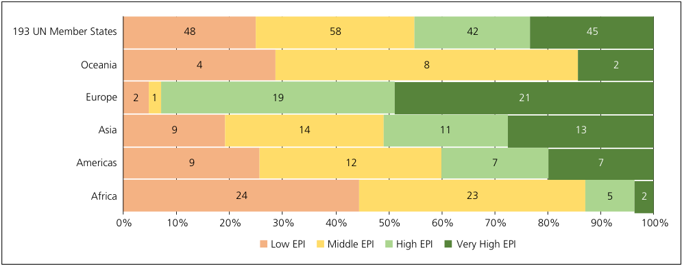

**----- Start of picture text -----** 
193 UN Member States 48 58 42 45 Oceania 4 8 2 Europe 2 1 19 21 Asia 9 14 11 13 Americas 9 12 7 7 Africa 24 23 5 2 0% 10% 20% 30% 40% 50% 60% 70% 80% 90% 100% Low EPI Middle EPI High EPI Very High EPI **----- End of picture text -----** 

_Source_ : 2024 United Nations E-Government Survey. 

## E-information 

Global trends in sharing government information with the public are improving. As shown in figure 2.16, 81 per cent of countries publish information on dedicated OGD portals, and 75 per cent provide geographic information system (GIS) or other geospatial data on their national portals. These two aspects of data governance are advancing in all regions rather consistently, though at a variable pace; in Europe, for instance, nearly all countries have OGD portals and publish GIS data, whereas in Africa the respective shares are 76 and 54 per cent. In only 51 per cent of countries can people request or propose new open government data sets or freely reuse data owing to the adoption of open data licensing by the Government. Even fewer countries actively promote the use of open data through hackathons and competitions (45 per cent) or make OGD available in real time (43 per cent). Europe is leading in all aspects of open data governance, followed by Asia and the Americas. In Africa and Oceania, the situation varies depending on the aspect of open data governance; for instance, the public can request or propose new data sets in 43 per cent of the countries in Oceania as opposed to 30 per cent of the countries in Africa, whereas more countries have adopted open data licensing in Africa (30 per cent) than in Oceania (14 per cent). 

57 

2024 UN E-GovErNmENt SUrvEy 

Figure 2.16 Percentages of countries with OGD portals and various aspects of open data governance 

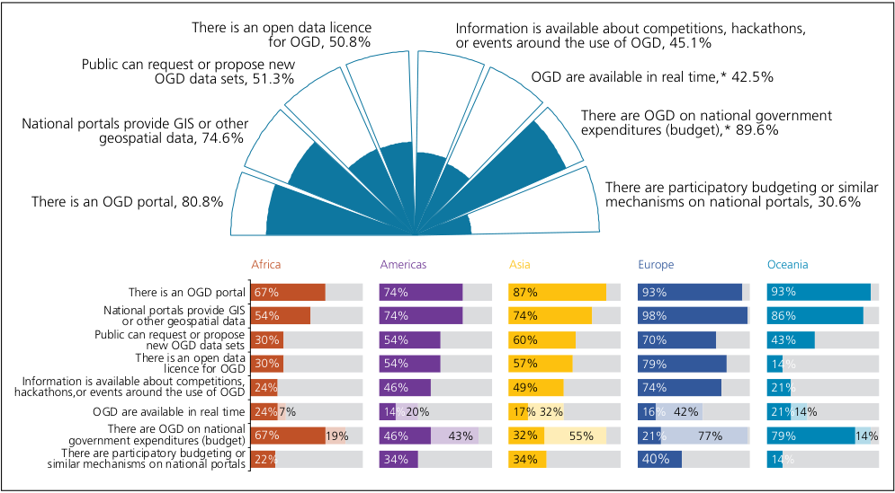

**----- Start of picture text -----** 
There is an open data licence Information is available about competitions, hackathons, for OGD, 50.8% or events around the use of OGD, 45.1% Public can request or propose new OGD data sets, 51.3% OGD are available in real time,* 42.5% There are OGD on national government National portals provide GIS or other expenditures (budget),* 89.6% geospatial data, 74.6% There are participatory budgeting or similar There is an OGD portal, 80.8% mechanisms on national portals, 30.6% Africa Americas Asia Europe Oceania There is an OGD portal 67% 74% 87% 93% 93% National portals provide GISor other geospatial data 54% 74% 74% 98% 86% Public can request or proposenew OGD data sets 30% 54% 60% 70% 43% There is an open datalicence for OGD 30% 54% 57% 79% 14% hackathons,or events around the use of OGDInformation is available about competitions, 24% 46% 49% 74% 21% OGD are available in real time 24%7% 14%20% 17% 32% 16% 42% 21%14% There are OGD on national government expenditures (budget) 67% 19% 46% 43% 32% 55% 21% 77% 79% 14% There are participatory budgeting or 22% 34% 34% 40% 14% similar mechanisms on national portals **----- End of picture text -----** 

_Source_ : 2024 United Nations E-Government Survey. 

_Note_ : The availability of OGD in machine-readable formats is indicated in a lighter shade of colour on the regional performance graphs. * The availability of OGD in real time for both machine-readable and non-machine-readable data sets. 

The availability of useful information on key aspects of public administration, especially in open data formats, allows people to engage in more informed public discourse on policy matters. As a proxy for gauging the accessibility of such information, the Survey has been tracking government practices in sharing information relating to national budgets and expenditures and to six sectors strongly linked to SDG implementation. As shown in figure 2.16, almost 90 per cent of countries publish open data sets on the national budget and government expenditures (45 per cent in machine-readable formats); however, only 31 per cent of countries have a participatory budgeting mechanism in place. 

Information on sector-specific government expenditures in mixed formats is available in 9 out of 10 countries (see figure 2.17); however, only about a third of the countries surveyed publish their expenditure-related data sets in machine-readable open formats. 

Data sets are available on matters relating to education (82 per cent), health (79 per cent), environment and employment (74 per cent each), justice (68 per cent), and social protection (65 per cent). When such information is available, it is often in machine-readable formats (45-58 per cent of the time). 

58 

Chapter 2 • Global trends in e-Government 

Figure 2.17 Percentage of countries publishing national budgetary or expenditure information or sectoral data sets, 2024 

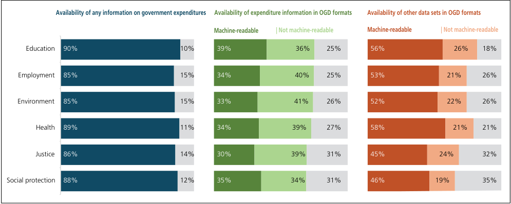

**----- Start of picture text -----** 
Availability of any information on government expenditures Availability of expenditure information in OGD formats  Availability of other data sets in OGD formats Machine-readable | Not machine-readable Machine-readable  | Not machine-readable Education 90% 10% 39% 36% 25% 56% 26% 18% Employment 85% 15% 34% 40% 25% 53% 21% 26% Environment 85% 15% 33% 41% 26% 52% 22% 26% Health 89% 11% 34% 39% 27% 58% 21% 21% Justice 86% 14% 30% 39% 31% 45% 24% 32% Social protection 88% 12% 35% 34% 31% 46% 19% 35% **----- End of picture text -----** 

_Source_ : 2024 United Nations E-Government Survey. 

## E-consultation and e-decision-making 

The Survey carefully assesses how proactive Governments are in integrating public input – especially from those living in vulnerable situations – into policymaking in the six sectors most strongly linked to SDG implementation. Figure 2.18 shows that information about upcoming consultations on matters relating to the environment and health sectors can be found on government portals in nearly half of the Member States. Between 37 and 43 per cent of countries inform the public about upcoming consultations on education, employment, social protection, or justice-related issues. Evidence that people’s voices have been heard and their feedback incorporated in actual decision-making in these sectors is found in far fewer countries (an average of 17 per cent). 

Figure 2.18 Percentage of countries that provide information about upcoming consultations and evidence that people’s voices have been included in actual decision-making, by sector, 2024 

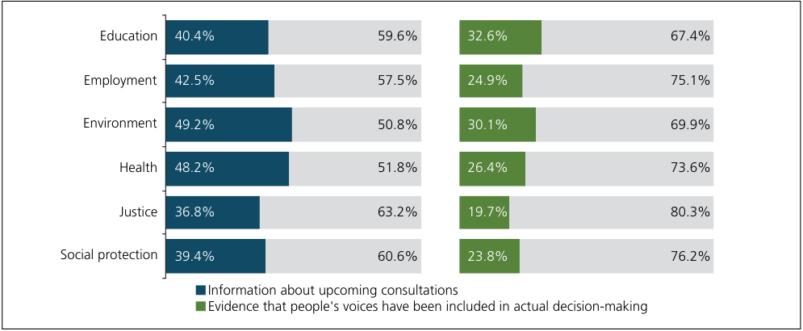

**----- Start of picture text -----** 
Education 40.4% 59.6% 32.6% 67.4% Employment 42.5% 57.5% 24.9% 75.1% Environment 49.2% 50.8% 30.1% 69.9% Health 48.2% 51.8% 26.4% 73.6% Justice 36.8% 63.2% 19.7% 80.3% Social protection 39.4% 60.6% 23.8% 76.2% Information about upcoming consultations Evidence that people's voices have been included in actual decision-making **----- End of picture text -----** 

_Source_ : 2024 United Nations E-Government Survey. 

59 

2024 UN E-GovErNmENt SUrvEy 

As shown in figure 2.19, between 18 and 28 per cent of countries published information about e-consultations having been held with people in vulnerable situations in the 12 months preceding the administration of the Survey, with the group engaged by the highest number of countries being youth (28 per cent), followed by persons with disabilities and women (24 per cent each), older people (21 per cent), individuals living below the poverty line (20 per cent) and immigrants (18 per cent). Evidence that input from vulnerable groups is included in actual decision-making is available for fewer countries (between 14 and 26 per cent, depending on the group). 

Figure 2.19 Engaging the most vulnerable in society: percentage of countries announcing upcoming consultations and providing evidence of people’s voices included in actual decision-making, 2024 

||||||||||
|---|---|---|---|---|---|---|---|---|
|Youth|28.0%|72.0%||25.9%||||74.1%|
|Women|24.4%|75.6%||19.2%||||80.8%|
|Persons with disabilities|24.4%|75.6%||23.8%||||76.2%|
|Persons living below poverty line|20.2%|79.8%||16.6%||||83.4%|
|Older people|21.2%|78.8%||18.1%||||81.9%|
|Immigrants|17.6%|82.4%||13.5%||||86.5%|
||Information about having held online consultations via forums, polls, or questionnaires Evidence that people's voices have been included in actual decision-making||||||||

_Source_ : 2024 United Nations E-Government Survey. 

## Other tools supporting e-participation and government accountability 

Making it possible for people to report corruption among public servants or institutions and proactively engaging people in e-participation processes are two ways to improve government accountability and increase public participation. 

The 2024 Survey results indicate that the portals of more than two thirds of the Member States provide channels for reporting corruption (see figure 2.20); the highest level of compliance is in Europe (88 per cent), followed by Asia (81 per cent), the Americas and Oceania (57 per cent each), and Africa (48 per cent). More than half of the countries (53 per cent) have also created mechanisms for reporting labour law violations. 

60 

Chapter 2 • Global trends in e-Government 

Figure 2.20 Percentage of countries offering various e-participation mechanisms and tools, 2024 

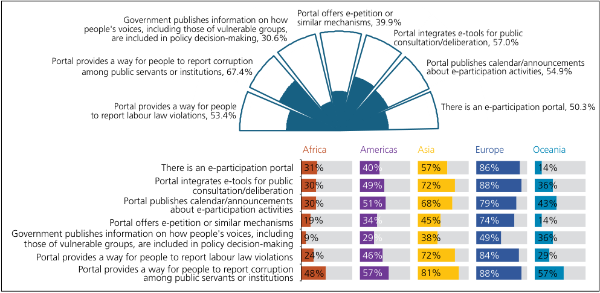

**----- Start of picture text -----** 
Portal offers e-petition or Government publishes information on how similar mechanisms, 39.9% people's voices, including those of vulnerable groups, Portal integrates e-tools for public are included in policy decision-making, 30.6% consultation/deliberation, 57.0% Portal provides a way for people to report corruption Portal publishes calendar/announcements among public servants or institutions, 67.4% about e-participation activities, 54.9% Portal provides a way for people There is an e-participation portal, 50.3% to report labour law violations, 53.4% Africa Americas Asia Europe Oceania There is an e-participation portal 31% 40% 57% 86% 14% Portal integrates e-tools for public 30% 49% 72% 88% 36% consultation/deliberation Portal publishes calendar/announcements 30% 51% 68% 79% 43% about e-participation activities Portal offers e-petition or similar mechanisms 19% 34% 45% 74% 14% Government publishes information on how people's voices, including 9% 29% 38% 49% 36% those of vulnerable groups, are included in policy decision-making Portal provides a way for people to report labour law violations 24% 46% 72% 84% 29% Portal provides a way for people to report corruption 48% 57% 81% 88% 57% among public servants or institutions **----- End of picture text -----** 

_Source_ : 2024 United Nations E-Government Survey. 

Around 50 per cent of the Member States have a dedicated e-participation portal, 55 per cent publish calendar announcements about upcoming consultations and other participatory activities, and about 40 per cent of use e-petitions or similar mechanisms to engage the population in policy deliberations. The region with the highest proportion of countries providing evidence of having conducted at least one e-consultation in the 12 months preceding the administration of the Survey is Europe (91 per cent), followed by Asia (70 per cent), the Americas (60 per cent), Africa (24 per cent) and Oceania (14 per cent). 

Information on the results of such deliberations or on how people’s voices are included in policyrelated decision-making is published by an average of only 31 per cent of the countries surveyed, though regional disparities are quite pronounced; nearly half of the European countries, slightly over one third of countries in Asia and Oceania, just under a third of countries in the Americas, and only a tenth of the countries in Africa publish the results of public deliberations on their portals. 

In terms of the proportion of countries in each region proactively offering e-participation channels, tools or mechanisms, Europe is the leader (78 per cent), followed by Asia (62 per cent), the Americas (44 per cent), Oceania (33 per cent), and Africa (27 per cent). 

## **2.5.6 OSI services provision subindex: progress in online services delivery** 

The services provision subindex of the OSI assesses the availability of various online transactional services, how government services are accessed (through one main portal or multiple channels), the existence and functionality of e-procurement platforms and digital invoicing, the integration of GIS or geospatial data and technologies in online services provision, and the availability of sectorspecific services and services for people in vulnerable situations. The data analysis and key findings are presented below. 

For the 2024 Survey, 25 online services have been assessed, up from 22 for the last Survey cycle. The number of countries offering at least one of these online services has not changed, remaining at 189 (98 per cent) of the 193 Member States. Figure 2.21 illustrates the overall expansion in the range of services provided, which is reflected in the increased number of countries providing each type of service. 

61 

2024 UN E-GovErNmENt SUrvEy 

Figure 2.21 Trends in the provision of online transactional services, 2022-2024 (Number of countries and percentage change) 

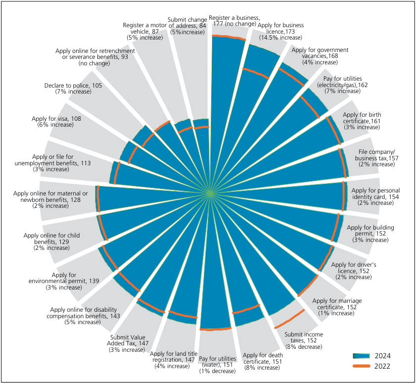

**----- Start of picture text -----** 
Submit change Register a business, Register a motor of address, 84 177 (no change) Apply for business vehicle, 87 (5%increase) licence,173 (5% increase) (14.5% increase) Apply online for retrenchment Apply for government or severance benefits, 93 vacancies,168 (no change)  (4% increase) Pay for utilities Declare to police, 105 (electricity/gas),162 (7% increase) (7% increase) Apply for birth Apply for visa, 108(6% increase)  certificate,161(3% increase) File company/ Apply or file for business tax,157 unemployment benefits, 113 (2% increase) (3% increase) Apply online for maternal or Apply for personal newborn benefits, 128(2% increase) identity card, 154(2% increase) Apply for building Apply online for child permit, 152 benefits, 129 (3% increase) (2% increase) Apply for driver’s licence, 152 Apply for (2% increase) environmental permit, 139 (3% increase) Apply for marriage compensation benefits, 143Apply online for disability certificate, 152(1% increase) (5% increase) Submit Value Submit income Added Tax, 147 taxes, 152 (3% increase)  (8% decrease) Apply for land title Apply for death 2024 registration, 147(4% increase)   Pay for utilities(water), 151 certificate, 151(8% increase)  2022 (1% decrease) **----- End of picture text -----** 

_Sources_ : 2022 and 2024 United Nations E-Government Surveys. 

The online provision of all but four types of services has increased by between 1 and 14.5 per cent, translating into an increase of 3 per cent globally. The number of countries that allow companies to register a business (177) and apply for retrenchment or severance benefits online (93) has not changed since 2022. The online services now offered by fewer countries include submitting income taxes and paying water bills (reflected in declines of 8 and 1 per cent, respectively). The decrease is likey due to services  being moved to the private sector payment platforms (e.g. for utility payments) or temporary unavailability of government platforms at the time of assessment. 

The most prevalent online transactional services remain the registration of a new business (177 countries) and applying for a business licence (173 countries). The next most frequently offered online services include applying for government vacancies, paying utility bills (electricity and gas), applying for a birth certificate, and filing company taxes. The electronic submission of business taxes is offered by more countries than the online submission of income taxes, which is a departure from 2022. Tax-filing services are offered more frequently to businesses (157 countries) than to individuals (152 countries for inco ~~me tax and 147 countr~~ ies ~~for Va~~ lue ~~Added~~ Tax, or VAT). Among the least ~~offered onl~~ i ~~ne services~~ a ~~re changing an address (84 countri~~ e ~~s) and regis~~ tering a motor vehicle (87 countries), though both services are offered by 5 per cent more countries in 2024 than in 2022. 

62 

Chapter 2 • Global trends in e-Government 

Globally, the average number of online services provided increased from 16 in 2022 to 18 in 2024 (see figure 2.22). It should be noted that while there has been an increase in numerical terms, the online services offered as a percentage of those assessed has remained roughly the same (averaging 72-73 per cent). European countries offer the highest average number of services (23), followed by the Americas and Asia (19 each), Oceania (15), and Africa (13). 

Figure 2.22 The average number of online services provided globally and in each region in 2022 and 2024 

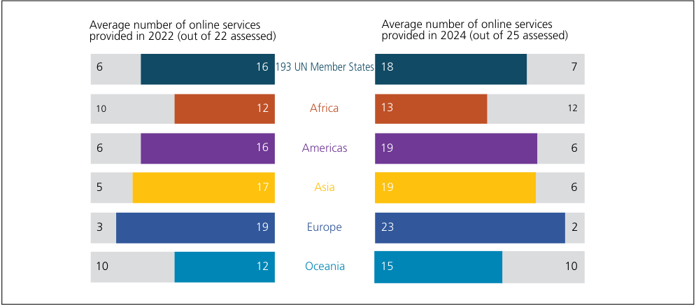

**----- Start of picture text -----** 
Average number of online services Average number of online services provided in 2022 (out of 22 assessed) provided in 2024 (out of 25 assessed) 6 16 193 UN Member States 18 7 10 12 Africa 13 12 6 16 Americas 19 6 5 17 Asia 19 6 3 19 Europe 23 2 10 12 Oceania 15 10 **----- End of picture text -----** 

_Sources_ : 2022 and 2024 United Nations E-Government Surveys. 

## Extent of digitalization of online services 

In addition to ascertaining the availability of 25 online services among the Member States, the Survey has assessed the level of digitalization of 19 of these services to determine whether users can conduct transactions fully online. 

At the regional level, Europe has the highest degree of full digitalization among the services assessed, followed by Asia, the Americas, Oceania, and Africa. At both the regional and global levels, rates of full digitalization are highest for the types of online services that support business registration, licensing, and paying taxes (around 50 per cent globally) and applying for government vacancies (48 per cent). 

In 2022 the Survey began assessing various services related to social protection, including those that allow people to apply online for child benefits, maternal or newborn benefits, unemployment benefits, and retrenchment or severance benefits when losing a job. The number of countries offering these services has increased by an average of 2 per cent in 2024, though regional disparities persist. Rates of full digitalization for these services average around 25 per cent globally. 

These findings indicate that the majority of countries use their portals to provide information and forms, but in most cases one still needs to appear in person to complete public service transactions (see figure 2.23). 

63 

2024 UN E-GovErNmENt SUrvEy 

|Fully digitalized Yes No Fully digitalized Yes No Fully digitalized Yes No Fully digitalized Yes No Fully digitalized Yes No Fully digitalized Yes No **Africa** **Americas** **Asia** **Europe** **Oceania** **193 UN Member States**|6% 2% 4% 4% 2% 7% 7% 11% 7% 15% 4% 9% 7% 26% 26% 26% 28% 13% 30% 24% 67% 69% 44% 19% 17% 35% 33% 50% 50% 56% 59% 39% 50% 54% 50% 56% 46% 65% 70% 41% 57% 56% 20% 11% 20% 23% 26% 34% 31% 43% 20% 14% 14% 6% 9% 40% 57% 43% 49% 54% 66% 37% 89% 97% 63% 46% 46% 46% 51% 54% 60% 43% 37% 60% 63% 71% 80% 80% 46% 80% 83% 31% 49% 46% 2% 30% 21% 36% 32% 34% 28% 30% 38% 30% 38% 36% 19% 23% 62% 55% 57% 55% 49% 60% 64% 89% 91% 47% 36% 32% 43% 38% 47% 45% 47% 77% 40% 49% 36% 62% 57% 28% 74% 79% 28% 32% 36% 2% 2% 53% 16% 63% 60% 72% 65% 56% 67% 58% 56% 33% 40% 26% 67% 81% 51% 70% 77% 81% 65% 84% 91% 44% 51% 33% 35% 26% 30% 37% 28% 53% 40% 40% 63% 58% 70% 33% 100% 98% 19% 42% 28% 21% 7% 21% 14% 14% 14% 14% 21% 14% 14% 7% 14% 14% 43% 29% 36% 57% 14% 21% 14% 36% 57% 43% 36% 21% 43% 29% 86% 79% 79% 29% 64% 43% 71% 57% 57% 57% 43% 43% 29% 64% 43% 1% 1% 1% 26% 12% 29% 27% 31% 31% 28% 37% 27% 30% 20% 18% 16% 48% 51% 43% 50% 44% 54% 45% 78% 83% 48% 36% 30% 39% 36% 48% 50% 47% 56% 45% 49% 56% 61% 64% 39% 76% 79% 30% 47% 42% Submit change of address Declare to police Register a motor vehicle Pay for utilities (water) Pay for utilities (electricity/gas) Apply for disability compensation benefts Apply for retrenchment or severance benefts Apply or fle for unemployment benefts Apply for child benefts Apply for maternal or newborn benefts Apply for marriage certifcate Apply for death certifcate Apply for birth certifcate Apply for visa Apply for environmental permit Apply for building permit Apply for land title registration Apply for driver’s license Apply for personal identity card Apply for government vacancies Submit Value Added Tax Submit income taxes File company/business tax Apply for business licence Register a business|_Source_: 2024 United Nations E-Government Survey. _Note_: The darker shades of colour highlight the proportion of fully digitalized services in each region, and the lighter shades indicate the availability of information, online forms or instructions about the services provided by the Governments.|
|---|---|---|

64 

Chapter 2 • Global trends in e-Government 

## Public procurement services 

A total of 135 countries (70 per cent) have dedicated e-procurement portals, an increase of 4 per cent since 2022. The number of countries that issue digital invoices through their e-procurement portals has increased by almost 7 per cent and now stands at 101 (52 per cent). Nearly all countries in Europe (93 per cent) have e-procurement portals, and most (86 per cent) offer digital invoicing. In Asia and the Americas, about 80 per cent of countries have portals, but fewer (60 and 54 per cent, respectively) issue digital invoices. The gap is wider in Oceania and Africa, where the corresponding proportions are 57 versus 21 per cent and 39 versus 26 per cent, respectively. It is worth mentioning that once e-procurement portals are set up, it may take some time for countries to integrate digital invoicing. In the Americas, for instance, the number of countries with e-procurement portals has risen by 5.7 per cent since 2022, whereas the number of countries offering digital invoicing has increased by 14.3 per cent (see figure 2.24). 

Figure 2.24 Number and percentage of countries with e-procurement platforms and digital invoicing capabilities, global and regional data, 2022 and 2024 

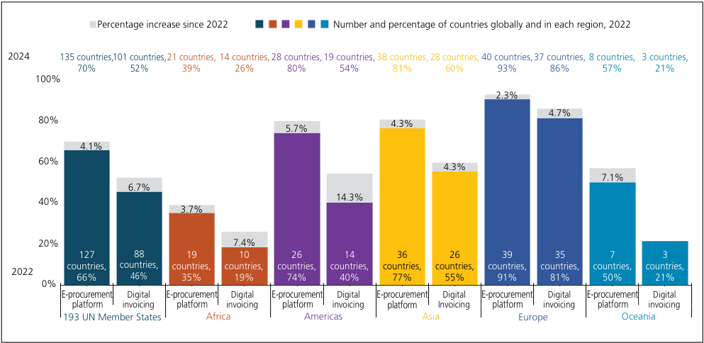

**----- Start of picture text -----** 
Percentage increase since 2022 Number and percentage of countries globally and in each region, 2022 2024 135 countries,101 countries,21 countries, 14 countries, 28 countries, 19 countries, 38 countries, 28 countries, 40 countries, 37 countries, 8 countries, 3 countries, 70% 52% 39% 26% 80% 54% 81% 60% 93% 86% 57% 21% 100% 2.3% 4.7% 80% 5.7% 4.3% 4.1% 60% 4.3% 7.1% 6.7% 14.3% 40% 3.7% 20% 7.4% 127 88 19 10 26 14 36 26 39 35 7 3 2022 countries,66% countries,46% countries,35% countries,19% countries,74% countries,40% countries,77% countries,55% countries,91% countries,81% countries,50% countries,21% 0% E-procurement Digital E-procurement Digital E-procurement Digital E-procurement Digital E-procurement Digital E-procurement Digital platform invoicing platform invoicing platform invoicing platform Invoicing platform invoicing platform invoicing 193 UN Member States Africa Americas Asia Europe Oceania **----- End of picture text -----** 

_Sources_ : 2022 and 2024 United Nations E-Government Surveys. 

## **2.5.7 Targeted services for people in vulnerable situations** 

The number of countries providing information and services that target specific vulnerable populations decreased by an average of 5 per cent between 2022 and 2024. As shown in figure 2.25, the sharpest decline (13.5 per cent) is recorded for immigrants; this is an alarming shift given that in 2022 the services aimed at supporting immigrants were provided by the highest number of countries (163, compared with 141 countries in 2024). The provision of services for women (148 countries) and people living below poverty line (132 countries) has also declined (by 8.6 and 8.3 per cent, respectively). The same is true for youth services (a drop from 155 to 152 countries, representing a 1.9 per cent decline), and for services supporting persons with disabilities (a drop from 157 to 155 

65 

2024 UN E-GovErNmENt SUrvEy 

countries, representing a 1.3 per cent decline). The only upturn has been a 2.7 per cent increase in the number of countries providing services for older people (148 countries in 2024 versus 144 in 2022). Further studies are required to examine the possible reasons for such deline. On a positive note, the provision of services that can be transacted fully online has increased by an average of 1 to 7 per cent for all groups except immigrants. countries are moving steadily towards improving the convenience and efficiency of services for users. 

Europe remains the most homogeneous region in terms of the provision of online services for people in vulnerable situations (94 per cent of countries), and for 45 per cent of those services (the highest proportion among the regions), transactions can be completed online. While there has been a downturn in the provision of online services to vulnerable populations, the majority of the UN Member States (more than 80 per cent) still offer such services; in regional terms, Europe accounts for the highest proportion, followed the Americas (80 per cent), Asia (79 per cent), Oceania (70 per cent), and Africa (56 per cent). The Americas and Asia have comparable shares of countries offering services to people in vulnerable situations; however, fully digitalized services are offered by more countries in Asia (30 per cent) than in the Americas (23 per cent). 

Figure 2.25 Percentage of countries offering services for people in vulnerable situations that can be completed partially or fully online, 2022 and 2024 

|193 UN Member States||||||||
|---|---|---|---|---|---|---|---|
|Available Fully digitalized **2024**||||Available Fully digitalized **2022** Percentage change since 2022||||
|21% Immigrants||52%||-13.5%|22%||63%|
|26% Older people|||50%|2.7%|19%||55%|
|23% Persons living below poverty line||46%||-8.3%|20%||55%|
|26% Persons with disabilities|||54%|-1.3%|22%||60%|
|23% Women|||54%|-8.6%|19%||65%|
|26% Youth|||53%|-1.9%|25%||55%|
|**Africa**||**Americas**||**Asia**|**Europe**||**Oceania**|
|Fully|Fully|||Fully|Fully||Fully|
|Available digitalized|digitalized||Available |Available digitalized digitalized||Available Available digitalized||
|6% 41% Immigrants||23%|51%|26% 57% 37%||60%|14% 50%|
|6% 48% Older people||26%|60%|36% 43% 44%||51%|21% 57%|
|4% 39% Persons living below poverty line||20%|51%|28% 49%|44%|51%|21% 29%|
|6% 54% Persons with disabilities||23%|69%|30% 49% 53%||47% 21% 57%||
|4% 59% Women||26%|54%|32% 51% 42% 44%|||71%|
|6% 67% Youth||23%|57%|30% 45%|51%|40%|21% 57%|
|||||||||

_Sources_ : 2022 and 2024 United Nations E-Government Surveys. 

66 

Chapter 2 • Global trends in e-Government 

The proportion of countries providing services for people in vulnerable situations has risen from 45 to 70 per cent in Oceania and from 44 to 56 per cent in Africa. However, the share of countries that offer fully digitalized services is only 21 per cent in Oceania and 5 per cent in Africa. 

## **2.5.8 Sector-specific online information and services: sharing via mobile technologies** 

Online services specifically relating to health, education, employment, environment, justice, and social protection can be found on the portals of 58 to 74 per cent of the countries surveyed (see figure 2.26), and most of these services are easily accessible through mobile technologies and applications (apps). Services relating to education, health, and employment are the most prevalent and are available in almost three quarters of the countries surveyed. Services relating to justice (63 per cent), social protection (63 per cent), and environment (58 per cent) are found on the portals of fewer countries. Although Governments still use SMS alerts to inform people about sector-specific services or important issues, this practice is not very common; 44 per cent of countries still utilize SMS for health sector alerts, but for the other five sectors the corresponding proportions range from 19 to 28 per cent. 

Figure 2.26 Percentage of countries providing sector-based information and services online and through mobile channels and SMS alerts, 2024 

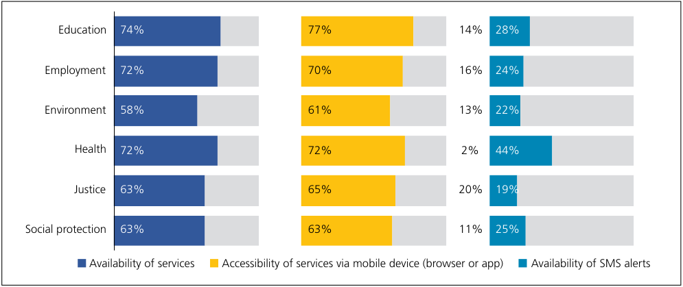

**----- Start of picture text -----** 
Education 74% 77% 14% 28% Employment 72% 70% 16% 24% Environment 58% 61% 13% 22% Health 72% 72% 2% 44% Justice 63% 65% 20% 19% Social protection 63% 63% 11% 25% Availability of services Accessibility of services via mobile device (browser or app) Availability of SMS alerts **----- End of picture text -----** 

_Source_ : 2024 United Nations E-Government Survey. 

## **2.5.9 Technology subindex** 

At the time the 2024 Survey assessments were carried out, all countries except Belize had accessible national portals, and 98 per cent of those portals could be found by search engines. Most government portals (97 per cent) have a “contact us” page and utilize Hypertext Transfer Protocol Secure (HTTPS) to provide a safe experience for users (see figure 2.27). In 91 per cent of the countries assessed, the portals have been developed using responsive web design (a 3 per cent increase since 2022), and in 89 per cent the portals are updated at least once a month (a 6 per cent increase). Most portals have a sitemap (74 per cent) and offer “advanced search” options (56 per cent); it should be noted that the proportion of countries offering the latter has declined (from 58 per cent) since 2022. 

67 

2024 UN E-GovErNmENt SUrvEy 

Figure 2.27 Number of Member States with portals incorporating the assessed technology features, 2022 and 2024 

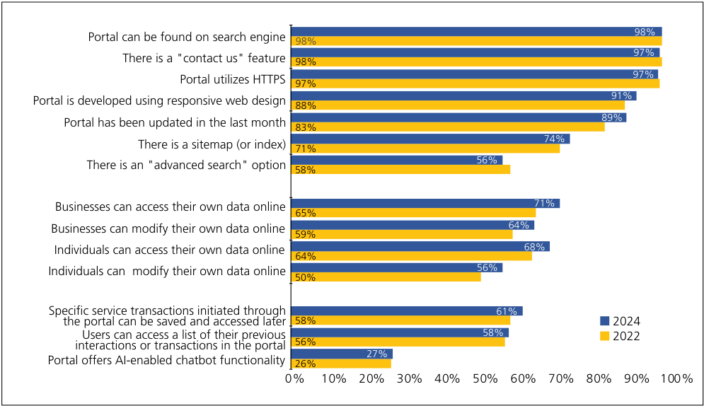

**----- Start of picture text -----** 
Portal can be found on search engine 98% 98% There is a "contact us" feature 98% 97% Portal utilizes HTTPS 97% 97% Portal is developed using responsive web design 88% 91% Portal has been updated in the last month 83% 89% There is a sitemap (or index) 71% 74% There is an "advanced search" option 58% 56% Businesses can access their own data online 71% 65% Businesses can modify their own data online 59% 64% Individuals can access their own data online 68% 64% Individuals can  modify their own data online 50% 56% Specific service transactions initiated through 61% the portal can be saved and accessed later 58% 2024 Users can access a list of their previous 58% 2022 interactions or transactions in the portal 56% 27% Portal offers AI-enabled chatbot functionality 26% 0% 10% 20% 30% 40% 50% 60% 70% 80% 90% 100% **----- End of picture text -----** 

_Sources_ : 2022 and 2024 United Nations E-Government Surveys. 

The number of countries that allow individuals and businesses to access or modify their data on government portals has increased by an average of 6 per cent since 2022. Globally, more countries allow users to access their data (71 per cent for businesses and 68 per cent for individuals) than to modify their data (64 per cent for businesses and 56 per cent for individuals). 

In 118 countries (a 3 per cent increase from 2022), it is possible for users to save specific service transactions initiated on the portal and access them later. The proportion of countries that allow users to access a list of their previous transactions or rely on AI-enabled chatbot functionality is nearly the same in 2024 as in 2022. 

For the 2024 Survey, a new “affordability” indicator was added to the TII and the use of “the fixed (wired) broadband subscriptions” indicator was discontinued (see the technical appendix for details on the methodology used). While the technology subindex of the OSI does not include TII component data, it is important to highlight the changes in TII indicators as part of the evolving landscape of technological advancement. Table 2.8 summarizes the global and regional findings for indicators relating to mobile service pricing, broadband and cellular subscriptions, and Internet use for 2022 and 2024. Figure 2.28 highlights the changes in the latter three indicators between 2022 and 2024. 

Internet use and subscriptions for mobile broadband and cellular services are on the rise. The sharpest increases in Internet use have been in Oceania (49 per cent) and Africa (31 per cent). The active mobile broadband subscription rate has increased by 27 per cent in Africa, 10 per cent in Asia and the Americas, and 8 per cent in Europe, but has declined by almost 2 per cent in Oceania (see figure 2.28). Europe remains the leader in active mobile broadband use, with 105 subscriptions per 100 inhabitants, followed by Asia (89) and the Americas (73). 

68 

Chapter 2 • Global trends in e-Government 

Table 2.8 Affordability of mobile data and voice services, mobile broadband and cellular subscriptions per 100 inhabitants, and percentage of individuals using the Internet, by region, 2022 and 2024 

||Affordability|Affordability|Active mobile broadband subscriptions per 100 inhabitants|Active mobile broadband subscriptions per 100 inhabitants|Mobile cellular telephone subscriptions per 100 inhabitants|Mobile cellular telephone subscriptions per 100 inhabitants|Percentage of individuals using the Internet|Percentage of individuals using the Internet|
|---|---|---|---|---|---|---|---|---|
||Mobile data and voice high consumption basket price (as a percentage of GNI per capita)||||||||
||2024|2022|2024|2022|2024|2022|2024|2022|
|Africa|10.4|-|54.4|42.77|88.95|83.68|43.4|33.01|
|Americas|3.8|-|72.8|65.96|102.83|101.92|77.1|67.81|
|Asia|2.8|-|88.5|80.5|106.05|105.93|71.9|63.21|
|Europe|1.1|-|105.2|97.9|116.75|113.86|89.5|85.52|
|Oceania|7.6|-|42.4|43.15|73.76|72.53|65.0|43.59|
|193 UN Member States|5.2|-|76.5|68.47|100.73|98.32|68.3|59.14|

_Sources_ : ITU, Statistics for individuals using the Internet (2022 and 2024), available at https://www.itu.int/en/ITU-D/Statistics/Pages/ stat/default.aspx; ITU, “Mobile data and voice high-consumption basket”, DataHub, available at https://datahub.itu.int/data/?i=34619. 

Affordability plays a key role in digital access and engagement. The cost of Internet and active mobile broadband subscriptions as a percentage of gross national income (GNI) per capita remains significantly higher in Africa (10.4 per cent) and Oceania (7.6 per cent) than in other parts of the world, contributing to the digital divide (see figure 2.29). 

Figure 2.28 Percentage change at the global and regional levels in Internet usage and in active mobile broadband and mobile cellular subscriptions per 100 inhabitants, 2022-2024 

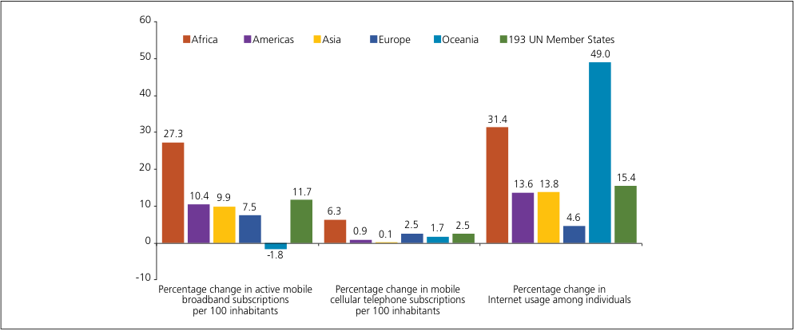

**----- Start of picture text -----** 
60 Africa Americas Asia Europe Oceania 193 UN Member States 50 49.0 40 31.4 30 27.3 20 15.4 13.6 13.8 10.4 9.9 11.7 10 7.5 6.3 4.6 0.9 0.1 2.5 1.7 2.5 0 -1.8 -10 Percentage change in active mobile Percentage change in mobile Percentage change in broadband subscriptions cellular telephone subscriptions Internet usage among individuals per 100 inhabitants per 100 inhabitants **----- End of picture text -----** 

_Sources_ : 2022 and 2024 United Nations E-Government Surveys. 

69 

2024 UN E-GovErNmENt SUrvEy 

Figure 2.29 The cost of active mobile broadband subscriptions as a percentage of gross national income per capita, by region, 2024 

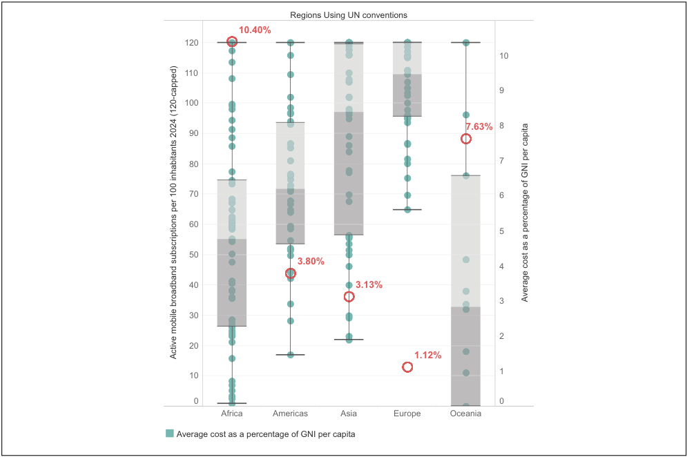

**----- Start of picture text -----** 
Regions Using UN conventions 10.40% 120 10 110 9 100 7.63% 8 90 80 7 70 6 60 5 50 3.80% 4 40 3.13% 3 30 2 20 1.12% 1 10 0 0 Africa Americas Asia Europe Oceania Average cost as a percentage of GNI per capita Average cost as a percentage of GNI per capita Active mobile broadband subscriptions per 100 inhabitants 2024 (120-capped) **----- End of picture text -----** 

_Source_ : ITU, Statistics on individuals using the Internet (2024), available at https://www.itu.int/en/ITU-D/Statistics/Pages/stat/default.aspx. 

## **2.6 Countries in special situations (LDCs, LLDCs and SIDS)** 

The United Nations has identified three groups of countries in special situations that face specific challenges in their pursuit of sustainable development: least developed countries (lDcs), landlocked developing countries (llDcs), and small island developing States (SIDS).[3] Presently, there are 45 lDcs, 32 llDcs, and 37 SIDS in the five world regions assessed in the Survey.[4] These group totals may be misleading, as there are actually 90 countries in special situations reviewed for the Survey. However, there are some cases where these designations overlap; 16 countries are lDcs that are also landlocked (lDc/llDcs), and 8 lDcs are also small island developing States (lDc/SIDS) – and these countries are included in each group, so they are essentially counted twice in the three group totals above. 

The lDcs are some of the poorest and most vulnerable countries in the world, comprising around 14 per cent of the global population but accounting for only 1.3 per cent of global gross domestic product (GDP), 1.4 per cent of global foreign direct investment (FDI), and just under 1 per cent of global merchandising exports.[5] Many lDcs face multiple structural challenges and constraints, including narrow production and export bases, stagnant trade and investment flows, diminishing productivity growth, small size, isolation and remoteness from major markets, widespread poverty, hunger and malnutrition, a lack of access to quality and inclusive education and lifelong learning opportunities, and underdeveloped human capital. Almost half of the lDcs are landlocked or small island countries with a weak land and natural resource base. 

70 

Chapter 2 • Global trends in e-Government 

According to studies released by the United Nations Office of the High Representative for the least Developed countries, landlocked Developing countries and Small Island Developing States (UNOHRllS), llDcs face significant trade and transport challenges due to their geographical location. These countries must rely on transit through other nations, many of them developing countries themselves, and often have to contend with complex border-crossing procedures and inadequate infrastructure. As a result, llDcs are subject to substantially higher costs for trade and transport. On average, llDcs incur more than double the transport costs of transit countries and must also factor in longer transit times, leading to the erosion of any competitive edge they may have. This situation discourages investment, hinders economic growth, and limits sustainable development. llDc economies are typically dependent on a few commodities and have large informal sectors, high unemployment, low productivity, and relatively weak social capacities, resulting in overall levels of development that are about 20 per cent lower than if they were not landlocked. Their high trade concentration and significantly higher expenditures on transport, insurance and other trade-related expenditures place llDcs at a distinct economic disadvantage.[6] Among the 32 llDcs, 16 are also classified as lDcs; this latter group faces more obstacles and may have less success than other llDcs in mitigating the challenges and consequences deriving from their geographical handicap. 

Because SIDS tend to have a narrow resource base and high costs for energy, infrastructure, transportation, communications, and services, they face substantial structural challenges in building the necessary ecosystem, institutions and capacity for promoting and utilizing science, technology, innovation and digitalization to drive economic growth and sustainable development.[7] The fourth International conference on Small Island Developing States, held in May 2024, adopted the Antigua and Barbuda Agenda for Small Island Developing States: A Renewed Declaration for Resilient Prosperity. This programme of action outlines a set of development priorities and emphasizes the need to address the unique challenges faced by these countries, including climate change, poverty, and digital transformation. The Declaration highlights the need to incorporate and strengthen e-government and digital solutions as a means of addressing issues relating to the vulnerability of SIDS to natural disasters, geographical remoteness and accessibility, high population dispersion, and economic limitations. It calls for efforts to strengthen the capacity of local and national government institutions and the adoption of strategies aimed at bridging the digital divide.[8] Mention is also made of the need to strengthen data collection and analysis capabilities in SIDS to facilitate evidence-based policymaking. Building institutional capacities through technical assistance and training programmes will help SIDS build the strong foundations they need to effectively navigate their unique development challenges. 

The subsections below review the unique challenges faced by lDcs, llDcs and SIDS in digital development and the strategic responses necessary to address those challenges. 

## **2.6.1 E-government development in LDCs, LLDCs and SIDS: trends and insights** 

E-government development, as measured by the EGDI, varies significantly across lDcs, llDcs and SIDS, reflecting a complex landscape of progress and setbacks. While some countries are making considerable headway, others are dealing with ongoing challenges that hinder their digital transformation. Addressing these disparities requires a nuanced understanding of the unique situations prevailing in each group, as well as customized strategies that promote inclusive and sustainable digital development. 

71 

2024 UN E-GovErNmENt SUrvEy 

Figure 2.30 The distribution of countries in special situations among the four EGDI levels, 2022 and 2024 

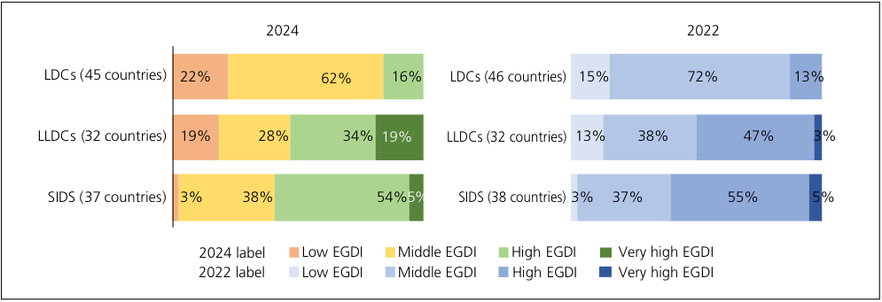

**----- Start of picture text -----** 
2024 2022 LDCs (45 countries) 22% 62% 16% LDCs (46 countries) 15% 72% 13% LLDCs (32 countries) 19% 28% 34% 19% LLDCs (32 countries) 13% 38% 47% 3% SIDS (37 countries) 3% 38% 54%5% SIDS (38 countries) 3% 37% 55% 5% 2024 label Low EGDI Middle EGDI High EGDI Very high EGDI 2022 label Low EGDI Middle EGDI High EGDI Very high EGDI **----- End of picture text -----** 

_Sources_ : 2022 and 2024 United Nations E-Government Surveys. 

_Notes_ : countries in special situations include least developed countries (lDcs), landlocked developing countries (llDcs), and small island developing States (SIDS). The list of lDcs and SIDS have changed from 2022 due to Bhutan graduating from the lDc category and Bahrain graduating from the SIDS category. Percentages may not add to 100 due to rounding. 

The overall distribution of SIDS across the different EGDI levels has remained relatively stable (see figure 2.30). The majority of SIDS (54 per cent) are in the high EGDI group, followed by 38 per cent in the middle group, 5 per cent in the very high group, and 3 per cent in the low group. Notable changes include Mauritius moving from the high to the very high EGDI group, Vanuatu advancing from the middle to the high EGDI group, and Belize dropping from the high to the middle EGDI level. These shifts illustrate both progress and setbacks, highlighting the diverse digital development trajectories within SIDS. While disparities remain, the general stability in the EGDI distribution suggests a consistent focus on enhancing digital services and public engagement. 

The llDcs have experienced more dynamic changes in e-government development since 2022. Armenia, Azerbaijan, Mongolia, the Republic of Moldova, and Uzbekistan have all moved from the high to the very high EGDI group, increasing the proportion of llDcs in the latter group from 3 to 19 per cent. Eswatini has also achieved notable progress and has moved from the middle to the high EGDI group. conversely, Afghanistan and Burundi have moved from the middle to the low EGDI group, raising the proportion of llDcs in the low EGDI group from 13 to 19 per cent. These shifts indicate both significant progress and ongoing challenges within the llDcs. 

The majority of lDcs (62 per cent) remain in the middle EGDI group. However, there have been notable shifts, with two countries moving up to the high EGDI level and three countries dropping to the low EGDI level; this has increased the proportions of countries in the high and low EGDI groups by 3 and 7 per cent, respectively. These trends highlight widening digital divides within the lDcs, underscoring the need for targeted interventions to support countries lagging in digital development. 

72 

Chapter 2 • Global trends in e-Government 

Figure 2.31 The number and percentage of countries in special situations in each EGDI group, 2024 

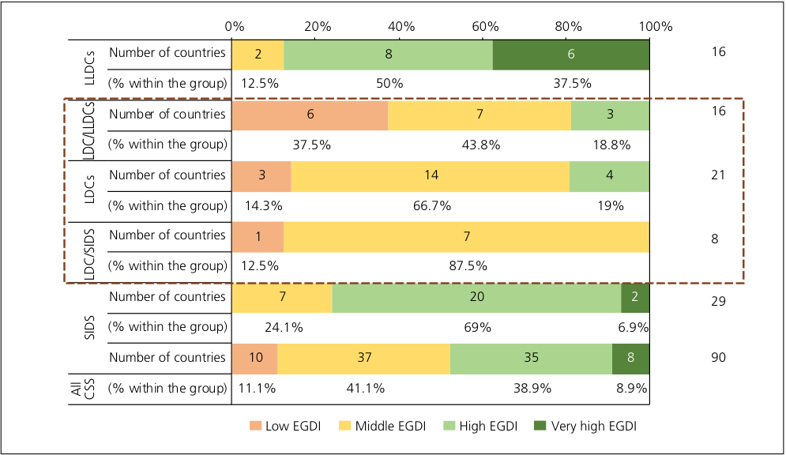

**----- Start of picture text -----** 
0% 20% 40% 60% 80% 100% Number of countries 2 8 6 16 (% within the group) 12.5% 50% 37.5% Number of countries 6 7 3 16 (% within the group) 37.5% 43.8% 18.8% Number of countries 3 14 4 21 (% within the group) 14.3% 66.7% 19% Number of countries 1 7 8 (% within the group) 12.5% 87.5% Number of countries 7 20 2 29 (% within the group) 24.1% 69% 6.9% Number of countries 10 37 35 8 90 (% within the group) 11.1% 41.1% 38.9% 8.9% Low EGDI Middle EGDI High EGDI Very high EGDI LLDCs LDC/LLDCs LDCs LDC/SIDS SIDS All CSS **----- End of picture text -----** 

_Sources_ : 2022 and 2024 United Nations E-Government Surveys. 

_Notes_ : countries in special situations (cSS) include least developed countries (lDcs), landlocked developing countries (llDcs), and small island developing States (SIDS). The list of lDcs and SIDSs have changed since 2022 with the graduation of Bhutan from the lDc category and Bahrain from the SIDS category. 

An important observation is that landlocked lDcs generally fare better in e-government development than do lDcs that are SIDS (see figure 2.31). When least developed llDcs are excluded from the overall group of llDcs, the remaining landlocked countries make up the highest proportion of countries with high and very high EGDI values (87.5 per cent) among the countries in special situations. This indicates that geographical constraints, while disruptive to development, can be mitigated through effective digital strategies. 

## EGDI and subindex values among countries in special situations 

The combined average EGDI value for lDcs, llDcs and SIDS rose by 4 per cent between 2022 and 2024, increasing from 0.4703 to 0.4884. While moving steadily in the right direction, the average EGDI value for these groups is still far below the world average of 0.6382 (see figure 2.32). Efforts towards digital transformation are clearly under way in countries in special situations, though significant disparities remain. 

The average EGDI value for lDcs has risen slightly (by 1 per cent). lDc/SIDS have seen a 2 per cent increase in their average EGDI value, reflecting better integration of digital services and online platforms. The average EGDI value for lDc/llDcs (already the lowest among the countries in special situations) fell by 1 per cent, declining from 0.3368 in 2022 to 0.3335 in 2024. This underscores the persistent challenges faced by landlocked lDcs in e-government development. 

73 

2024 UN E-GovErNmENt SUrvEy 

Figure 2.32 Average EGDI composite and component values for countries in special situations, 2022 and 2024 

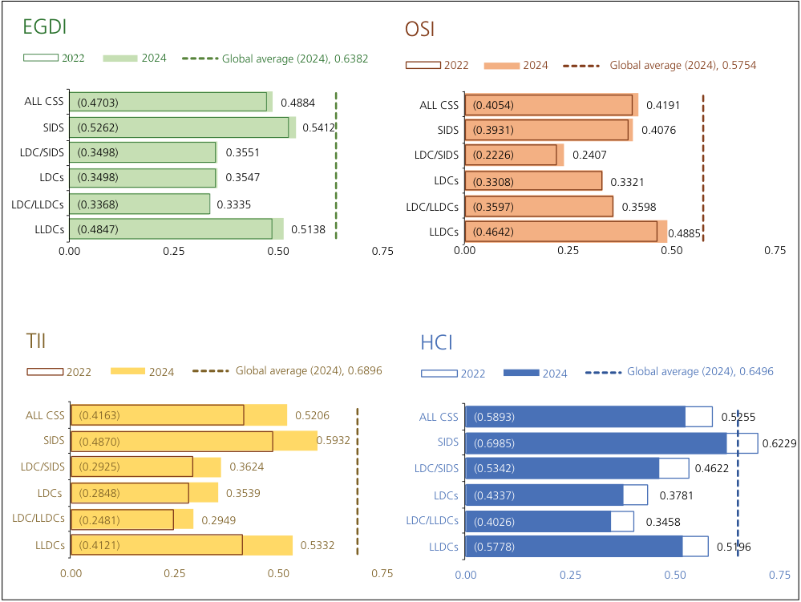

**----- Start of picture text -----** 
EGDI OSI 2022 2024 Global average (2024), 0.6382 2022 2024 Global average (2024), 0.5754 ALL CSS (0.4703) 0.4884 ALL CSS (0.4054) 0.4191 SIDS (0.5262) 0.5412 SIDS (0.3931) 0.4076 LDC/SIDS (0.3498) 0.3551 LDC/SIDS (0.2226) 0.2407 LDCs (0.3498) 0.3547 LDCs (0.3308) 0.3321 LDC/LLDCs (0.3368) 0.3335 LDC/LLDCs (0.3597) 0.3598 LLDCs (0.4847) 0.5138 LLDCs (0.4642) 0.4885 0.00 0.25 0.50 0.75 0.00 0.25 0.50 0.75 TII HCI 2022 2024 Global average (2024), 0.6896 2022 2024 Global average (2024), 0.6496 ALL CSS (0.4163) 0.5206 ALL CSS (0.5893) 0.5255 SIDS (0.4870) 0.5932 SIDS (0.6985) 0.6229 LDC/SIDS (0.2925) 0.3624 LDC/SIDS (0.5342) 0.4622 LDCs (0.2848) 0.3539 LDCs (0.4337) 0.3781 LDC/LLDCs (0.2481) 0.2949 LDC/LLDCs (0.4026) 0.3458 LLDCs (0.4121) 0.5332 LLDCs (0.5778) 0.5196 0.00 0.25 0.50 0.75 0.00 0.25 0.50 0.75 **----- End of picture text -----** 

_Sources_ : 2022 and 2024 United Nations E-Government Surveys. 

_Notes_ : countries in special situations include least developed countries (lDcs), landlocked developing countries (llDcs), and small island developing States (SIDS). The list of lDcs and SIDSs have changed since 2022 with the graduation of Bhutan from the lDc category and the graduation of Bahrain from the SIDS category; the slight changes in the number of countries assessed and the necessary recalculations have resulted in small variations between the numbers reported here and those reported in the previous Survey. 

With a 6 per cent increase in their average EGDI value, the llDcs have achieved the most significant gains among three groups. This notable improvement reflects the success of these countries in overcoming geographical barriers to strengthen e-government. Such progress contrasts with the stagnant or declining trends obser ~~ved for lDc/llDcs, highlig~~ ht ~~ing intr~~ a ~~group~~ disparities and the need for target ~~ed interventions.~~ 

The average E ~~GDI value for SIDS has increased by 3 per cent, refecting steady pro~~ gress in digital government development. The lDc/SIDS have shown signifcant improvement, particularly in online services provision; their average OSI value rose by 8 per cent – the highest increase for this component among the countries in special situations. The progress made by this group suggests that access to marine transportation routes and other infrastructure-related advantages play a critical role in advancing the development and provision of digital services. 

74 

Chapter 2 • Global trends in e-Government 

In line with global trends, the average TII values for all groups have increased by between 19 and 29 per cent, though they are still below the global average TII value of 0.6896. These significant increases reflect enhanced investment in telecommunications infrastructure, which is essential for supporting e-government and broader digital development. 

Similarly, the average OSI values for the respective groups have improved – albeit at a slower pace than TII values – but still fall significantly short of the global average. The llDcs and SIDS have seen respective increases of 5 and 4 per cent in their average OSI values. Although the progress made by lDcs in online services provision has been negligible, the lDc/SIDS have increased their average OSI value by 8 per cent. Online services provision for lDc/llDcs has stalled, indicating the need for focused efforts to accelerate development in this area. 

The varying trends in e-government development among lDcs, llDcs and SIDS reflect both encouraging progress and persistent challenges. While EGDI, TII and OSI values have risen for the groups of countries in special situations, in many cases reflecting substantial improvements, these values remain well below the global averages. Targeted strategies that address the unique needs of each group are essential to bridge the digital divide and promote inclusive digital transformation. The disparities within and between these groups highlight the need for tailored interventions that leverage each group’s strengths and address their specific challenges. 

## **2.6.2 The OSI and its subindices: progress among the countries in special situations** 

lDcs, llDcs and SIDS have made progress in online services provision, but there are still significant gaps between their average OSI values and the corresponding global average (see figure 2.33). The smallest gap between the global average OSI value and the average OSI values for specific groups (15 per cent) is observed for llDcs; the gap widens to 37 per cent for SIDS and 43 per cent for lDcs. Within the lDc group, landlocked lDcs have a sizeable gap of 37 per cent, but lDcs that are also SIDS have the largest gap (58 per cent) relative to the global OSI average. 

For all groups, institutional framework and content provision have the highest average values among the five OSI subindices assessed (see figure 2.33). This trend aligns with the global patterns, indicating that these areas are foundational to e-government development and are prioritized even in countries facing significant challenges. Despite this, all OSI subindex values for countries in special situations remain lower than the corresponding global averages, underscoring the need for a sustained focus on these critical areas to bridge the digital divide. 

Subindex values for services provision and the technical aspects of national portals vary among the groups. llDcs and SIDS have comparatively better average values for services provision, while lDcs (especially lDc/SIDS) have a lower average value for online services provision despite being better prepared from a technology standpoint. This discrepancy suggests that even a solid technical infrastructure must be leveraged properly to ensure effective services provision, and that targeted efforts may be needed to strengthen capacities in developing and delivering public services. 

consistent with global trends, nearly all countries in special situations have fully operational national portals, and they provide a government organizational chart and information on the government structure, as well as links to subnational or local government agencies (see figure 2.34). Information about the national cIO or equivalent is available on the national portals of 75 per cent of llDcs, 68 per cent of SIDS, and 67 per cent of lDcs; only half of the lDc/SIDS provide such information. 

75 

2024 UN E-GovErNmENt SUrvEy 

Figure 2.33 Average OSI subindex values for groups of countries in special situations relative to global averages, 2024 

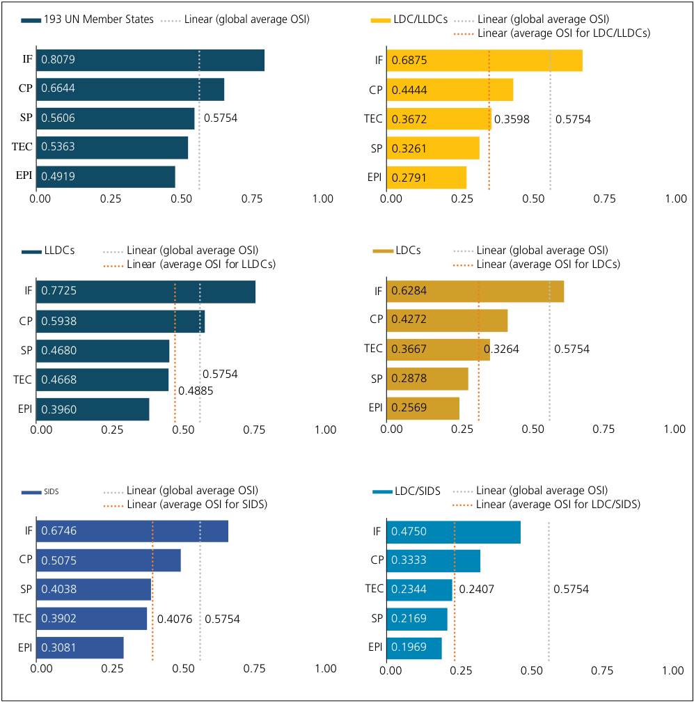

**----- Start of picture text -----** 
193 UN Member States Linear (global average OSI) LDC/LLDCs Linear (global average OSI) Linear (average OSI for LDC/LLDCs) IF 0.8079 IF 0.6875 CP 0.6644 CP 0.4444 SP 0.5606 0.5754 TEC 0.3672 0.3598 0.5754 TEC 0.5363 SP 0.3261 EPI 0.4919 EPI 0.2791 0.00 0.25 0.50 0.75 1.00 0.00 0.25 0.50 0.75 1.00 LLDCs Linear (global average OSI) LDCs Linear (global average OSI) Linear (average OSI for LLDCs) Linear (average OSI for LDCs) IF 0.7725 IF 0.6284 CP 0.5938 CP 0.4272 SP 0.4680 TEC 0.3667 0.3264 0.5754 TEC 0.4668 0.5754 SP 0.2878 0.4885 EPI 0.3960 EPI 0.2569 0.00 0.25 0.50 0.75 1.00 0.00 0.25 0.50 0.75 1.00 SIDS Linear (global average OSI) LDC/SIDS Linear (global average OSI) Linear (average OSI for SIDS) Linear (average OSI for LDC/SIDS) IF 0.6746 IF 0.4750 CP 0.5075 CP 0.3333 SP 0.4038 TEC 0.2344 0.2407 0.5754 TEC 0.3902 0.4076 0.5754 SP 0.2169 EPI 0.3081 EPI 0.1969 0.00 0.25 0.50 0.75 1.00 0.00 0.25 0.50 0.75 1.00 **----- End of picture text -----** 

_Source_ : 2024 United Nations E-Government Surveys. 

Overall, the legislative framework for advancing e-government is better developed in llDcs, including those that are least developed, than in SIDS or lDcs (see figure 2.35). Most llDcs have an e-government or digital government strategy (78 per cent), legislation or policy documents on cybersecurity (91 per cent), legal provisions for data protection (88 per cent), legislation governing freedom of information (78 per cent), and digital ID regulations (72 per cent). Fewer SIDS and lDcs (51 to 65 per cent) have these types of legislation in place, and the proportions are even lower for lDc/SIDS (between 13 and 65 per cent, depending on the type of legislation). 

76 

Chapter 2 • Global trends in e-Government 

Figure 2.34 Percentage of countries in special situations that have implemented organizational features of the OSI institutional framework subindex, 2024 

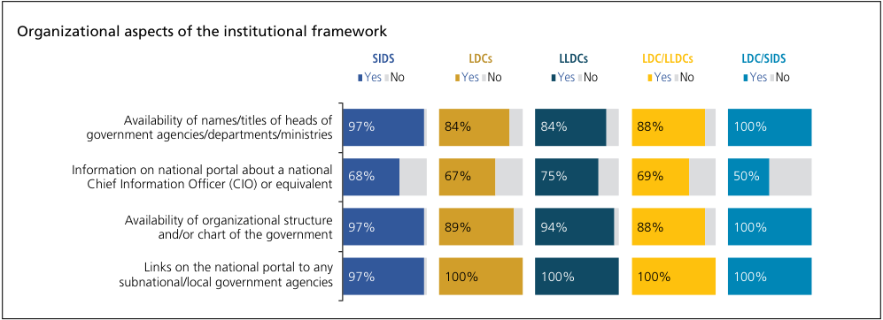

**----- Start of picture text -----** 
Organizational aspects of the institutional framework SIDS LDCs LLDCs LDC/LLDCs LDC/SIDS Yes No Yes No Yes No Yes No Yes No Availability of names/titles of heads of 97% 84% 84% 88% 100% government agencies/departments/ministries Information on national portal about a national 68% 67% 75% 69% 50% Chief Information Officer (CIO) or equivalent Availability of organizational structure 97% 89% 94% 88% 100% and/or chart of the government Links on the national portal to any subnational/local government agencies 97% 100% 100% 100% 100% **----- End of picture text -----** 

_Source_ : 2024 United Nations E-Government Surveys. 

Policies on open government data, e-participation, artificial intelligence, cloud computing, and protecting the public against misinformation, disinformation and/or fake news are found in about 3 out of 10 llDcs, 2 out of 10 SIDS, and 1 out 10 lDcs. 

Figure 2.35 Percentage of countries in special situations with legislative frameworks relevant to e-government development, 2024 

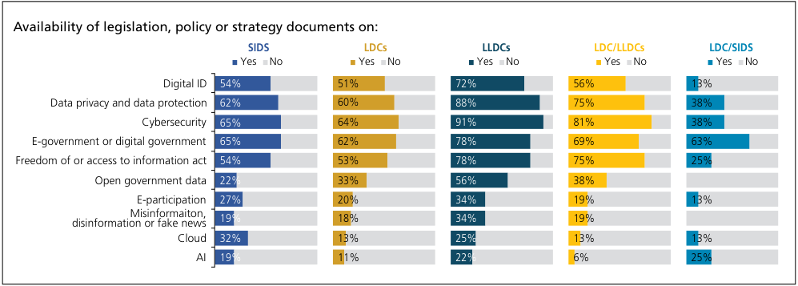

**----- Start of picture text -----** 
Availability of legislation, policy or strategy documents on: SIDS LDCs LLDCs LDC/LLDCs LDC/SIDS Yes No Yes No Yes No Yes No Yes No Digital ID 54% 51% 72% 56% 13% Data privacy and data protection 62% 60% 88% 75% 38% Cybersecurity 65% 64% 91% 81% 38% E-government or digital government 65% 62% 78% 69% 63% Freedom of or access to information act 54% 53% 78% 75% 25% Open government data 22% 33% 56% 38% E-participation 27% 20% 34% 19% 13% disinformation or fake newsMisinformaiton, 19% 18% 34% 19% Cloud 32% 13% 25% 13% 13% AI 19% 11% 22% 6% 25% **----- End of picture text -----** 

_Source_ : 2024 United Nations E-Government Surveys. 

77 

2024 UN E-GovErNmENt SUrvEy 

## E-participation in countries in special situations 

consistent with global trends, e-participation values remain the lowest among the five OSI subindices for countries in special situations. This is a clear indication that these countries are facing broad challenges in engaging citizens through digital platforms, which is crucial for inclusive and participatory governance. Enhancing e-participation in these regions will require not only investments in technology but also significant cultural and policy shifts to encourage and facilitate citizen engagement. Over the years UN DESA implemented and continues to support countries with various capacity building initiatives in the areas of digital government, participation and accountability, innovation and delivery of public services that contribute to the achievement of sustainable development goal 16[9] . 

## _Open government data (OGD)_ 

Group averages indicating the proportion of countries in special situations that share information through dedicated OGD portals are comparable to the corresponding global average; between 63 and 81 per cent of the countries in the respective groups maintain OGD portals, and 50 to 68 per cent provide geospatial data. Most countries in these groups also share information about government expenditures, often in open formats. However, only 3 out of 10 countries in special situations allow members of the public to request or propose new open data sets, compared to about 5 in 10 countries at the global level. More than 70 per cent of lDcs, llDcs and SIDS have not yet adopted open data licensing, and events such as hackathons around open data use are rare. Most OGD are not available in real time, and fewer than 2 in 10 countries have participatory budgeting mechanisms (see figure 2.36). 

Figure 2.36 Percentage of countries in special situations with OGD portals and various aspects of open data governance 

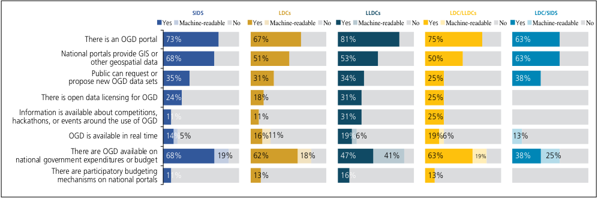

**----- Start of picture text -----** 
SIDS LDCs LLDCs LDC/LLDCs LDC/SIDS Yes Machine-readable No Yes Machine-readable No Yes Machine-readable No Yes Machine-readable No Yes Machine-readable No There is an OGD portal 73% 67% 81% 75% 63% National portals provide GIS orother geospatial data 68% 51% 53% 50% 63% propose new OGD data setsPublic can request or 35% 31% 34% 25% 38% There is open data licensing for OGD 24% 18% 31% 25% hackathons, or events around the use of OGDInformation is available about competitions, 11% 11% 31% 25% OGD is available in real time 14%5% 16%11% 19%6% 19%6% 13% There are OGD available on national government expenditures or budget 68% 19% 62% 18% 47% 41% 63% 19% 38% 25% There are participatory budgeting 11% 13% 16% 13% mechanisms on national portals **----- End of picture text -----** 

_Source_ : 2024 United Nations E-Government Survey. 

_Note_ : The availability of OGD in machine-readable formats is indicated by the lighter shades of the same colours in the regional performance graphs. 

- The availability of OGD in real time for both machine-readable and non-machine-readable data sets. 

78 

Chapter 2 • Global trends in e-Government 

## _Public consultation and reporting corruption_ 

Within the lDc, llDc and SIDS groups and related subgroups, between 40 and 56 per cent of countries offer online channels for reporting corruption, and 24 to 59 per cent integrate e-tools for public consultation or deliberation (see figure 2.37). However, dedicated e-participation portals, published calendar announcements about upcoming consultations, and information about the results of such deliberations are less common in these countries than in other Member States. Among the three main groups, llDcs provide a comparatively better environment for e-participation than do SIDS and lDcs. 

## Degree of digitalization of online services among countries in special situations 

The proportion of countries with fully digitalized online services is larger for the llDc group than for the other groups of countries in special situations, though the averages for each of the services assessed for all these groups are much lower than the comparable global averages. For instance, registering a business online is fully digitalized in half of the Member States, 41 per cent of llDcs, 38 per cent of SIDS, and 20 per cent of lDcs (see figure 2.38). In the small island and landlocked lDcs, the proportions are even lower (25 and 19 per cent, respectively). 

consistent with global trends, the Governments of countries in special situations prioritize the full digitalization of services that support businesses (registration, licensing, and paying taxes), as well as those that allow people to apply online for government vacancies. For many other types of services, government portals provide information and may even supply forms to fill out, but one still needs to appear in person to complete transactions. More llDcs and SIDS (including those that are also least developed) provide information about online services than do lDcs. 

Figure 2.37 Percentage of countries in special situations offering e-participation tools, 2024 

|||**SIDS**||||**LDCs**||**LLDCs**|**LLDCs**||**LDC/LLDCs**|**LDC/LLDCs**|**LDC/SIDS**|**LDC/SIDS**|
|---|---|---|---|---|---|---|---|---|---|---|---|---|---|---|
||Yes|No|Metrix||Yes|No|Metrix|Yes No|Metrix||Yes|No Metrix|Yes|No Metrix|
|Portal provides a way for people to report corruption among public servants or institutions Portal provides a way for people to report a violation of labor laws Government publishes information on how people's voices (including the voices of vulnerable groups) are included in policy decision-making Portal offers e-petition or similar mechnisms Portal publishes calendar/announcements about e-participation activities Portal integrates e-tools for public consultation/deliberation There is an e-participation portal|41% 19% 22% 11% 22% 24% 11%||59% 81% 78% 89% 78% 76% 89%||40% 13% 11% 4% 24% 31% 18%||60% 87% 89% 96% 76% 69% 82%|56% 34% 22% 25% 47% 59% 34%|44% 66% 78% 75% 53% 41% 66%|38% 6% 19% 13% 25% 56% 13%||63% 94% 81% 88% 75% 44% 88%|38% 25% 13%|63% 75% 88% 100% 100% 100% 100%|

_Source_ : 2024 United Nations E-Government Survey. 

79 

2024 UN E-GovErNmENt SUrvEy 

|Fully digitized Yes No Metrix Fully digitized Yes No Metrix Fully digitized Yes No Metrix Fully digitized Yes No Metrix Fully digitized Yes No Metrix **SIDS** **LDCs** **LLDCs** **LDC/LLDCs** **LDC/SIDS**|38% 22% 11% 14% 11% 8% 8% 14% 16% 32% 35% 32% 5% 5% 3% 8% 51% 51% 35% 19% 35% 22% 49% 62% 73% 73% 62% 57% 65% 57% 46% 57% 51% 57% 70% 35% 43% 62% 43% 38% 32% 2% 20% 7% 4% 4% 2% 2% 7% 13% 22% 20% 22% 4% 2% 2% 58% 49% 62% 20% 24% 7% 56% 53% 38% 42% 51% 47% 49% 31% 42% 40% 60% 56% 62% 38% 24% 31% 27% 20% 13% 41% 28% 16% 13% 9% 6% 13% 13% 25% 44% 41% 44% 9% 13% 22% 6% 13% 88% 84% 69% 41% 41% 19% 56% 50% 47% 50% 59% 56% 53% 47% 44% 34% 53% 88% 88% 41% 41% 50% 25% 28% 44% 19% 13% 13% 6% 6% 6% 13% 13% 31% 31% 25% 81% 75% 69% 31% 38% 13% 75% 50% 31% 44% 50% 38% 50% 25% 31% 25% 63% 75% 81% 56% 13% 31% 19% 6% 13% 25% 25% 13% 13% 13% 13% 13% 25% 25% 25% 63% 50% 63% 63% 38% 50% 50% 50% 50% 63% 13% 25% 13% 13% 25% 13% Submit income taxes Submit Value Added Tax Apply for visa Register a motor vehicle Declare to police Apply for driver’s license Apply for personal identity card Apply for marriage certifcate Apply for death certifcate Apply for birth certifcate Register a business Submit change of addrress Apply for land title registration Apply for environmental permit Apply for building permit Apply for government vacancies Apply or fle for unemployment benefts Apply for maternal or newborn benefts Apply for disability compensation benefts Apply for child benefts File company/business tax Pay for utilities (electricity/gas) Pay for utilities (water) Apply for business licence Apply for retrenchment or severance benefts|_Source_: 2024 United Nations E-Government Survey. _Note_: The darker shades of the respective colours highlight the proportion of fully digitalized services in each group, and the lighter shades indicate the availability of information, instructions, or online forms linked to the ervices provided by Governments.|
|---|---|---|

80 

Chapter 2 • Global trends in e-Government 

## **2.6.3 Leaders in digitalization among the countries in special situations** 

chapter 3 of the Survey reviews the major trends in regional e-government development, with the assessment of countries in special situations integrated into the broader regional analyses. The subsections below focus specifically on lDcs, llDcs and SIDS, highlighting the leaders in digital development among these groups. 

## Least developed countries 

Among the lDcs, Bangladesh, Bhutan, Rwanda, Nepal, cambodia, and Zambia have been leading digital development since 2022, and Senegal and Myanmar have joined these high performers in 2024. Their EGDI values place all eight countries in the H1, H2 or H3 rating class of the high EGDI group. All except Rwanda are lower-middle-income countries. Rwanda, the only low-income country in this group, raised its OSI value from 0.7935 in 2022 to 0.8207 in 2024, surpassing Bangladesh (0.7374) to take the lead in online services provision among the lDcs. All of the lDcs in the high EGDI group, with the exception of Rwanda, Bhutan and Bangladesh, have OSI values in the middle range (0.3259 to 0.4958); however, their TII values have risen significantly, unlocking the potential for more rapid advancement in digitalization (and higher EGDI values) in the future. Nepal, Rwanda, and Zambia are also landlocked and therefore face additional challenges. Table 2.9 summarizes the performance of the highest-ranked lDcs. 

Table 2.9 Least developed countries with the highest EGDI values 

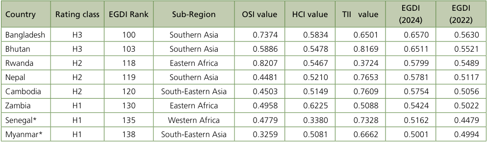

**----- Start of picture text -----** 
EGDI  EGDI Country Rating class EGDI Rank Sub-Region OSI value HCI value TII   value (2024) (2022) Bangladesh H3 100 Southern Asia 0.7374  0.5834 0.6501 0.6570  0.5630 Bhutan H3 103 Southern Asia 0.5886  0.5478 0.8169 0.6511  0.5521 Rwanda H2 118 Eastern Africa 0.8207  0.5467 0.3724 0.5799  0.5489 Nepal H2 119 Southern Asia 0.4481  0.5210 0.7653 0.5781  0.5117 cambodia H2 120 South-Eastern Asia 0.4503  0.5149 0.7609 0.5754  0.5056 Zambia H1 130 Eastern Africa 0.4958  0.6225 0.5088 0.5424  0.5022 Senegal* H1 135 Western Africa 0.4779  0.3380 0.7328 0.5162  0.4479 Myanmar* H1 138 South-Eastern Asia 0.3259  0.5081 0.6662 0.5001  0.4994 **----- End of picture text -----** 

_Sources_ : 2022 and 2024 United Nations E-Government Surveys. _Note_ : Italicized countries are llDcs in addition to being lDcs. * countries that have moved from the middle to the high EGDI group. 

## Landlocked developing countries 

Among the llDcs, Kazakhstan has the highest EGDI value (0.9009) and is in the V3 rating class of the very high EGDI group. Mongolia, Armenia, Uzbekistan, the Republic of Moldova and Azerbaijan have joined the very high EGDI group for the first time in 2024 and are part of the V2 or V1 rating class. Among landlocked countries with very high EGDI values, Mongolia has experienced the most significant improvement in EGDI ranking, moving up 28 positions, followed by Armenia, with a 16-position upward shift. Eleven other countries listed in table 2.10 (Kyrgyzstan, Paraguay, North Macedonia, Plurinational State of Bolivia, Bhutan, Botswana, Eswatini, Rwanda, Nepal, Tajikistan, and Zambia) have high EGDI values ranging from 0.5424 to 0.7316. Among these 11 countries, Eswatini moved up 29 positions in the rankings and transitioned from the middle to the high EGDI group, and Paraguay and Bhutan improved their rankings by 14 and 12 positions, respectively. The five leading landlocked countries with very high OSI values include Kazakhstan, Mongolia, Rwanda, Armenia and Uzbekistan. 

81 

2024 UN E-GovErNmENt SUrvEy 

Table 2.10 Landlocked developing countries with the highest EGDI values 

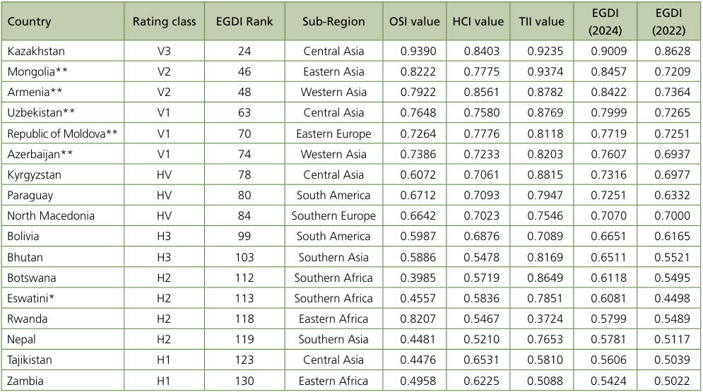

**----- Start of picture text -----** 
EGDI  EGDI Country Rating class EGDI Rank Sub-Region OSI value HCI value TII value (2024) (2022) Kazakhstan V3 24 central Asia 0.9390  0.8403 0.9235 0.9009 0.8628 Mongolia** V2 46 Eastern Asia 0.8222  0.7775 0.9374 0.8457 0.7209 Armenia** V2 48 Western Asia 0.7922  0.8561 0.8782 0.8422 0.7364 Uzbekistan** V1 63 central Asia 0.7648  0.7580 0.8769 0.7999 0.7265 Republic of Moldova** V1 70 Eastern Europe 0.7264  0.7776 0.8118 0.7719 0.7251 Azerbaijan** V1 74 Western Asia 0.7386  0.7233 0.8203 0.7607 0.6937 Kyrgyzstan HV 78 central Asia 0.6072  0.7061 0.8815 0.7316 0.6977 Paraguay HV 80 South America 0.6712  0.7093 0.7947 0.7251 0.6332 North Macedonia HV 84 Southern Europe 0.6642  0.7023 0.7546 0.7070 0.7000 Bolivia H3 99 South America 0.5987  0.6876 0.7089 0.6651 0.6165 Bhutan H3 103 Southern Asia 0.5886  0.5478 0.8169 0.6511 0.5521 Botswana H2 112 Southern Africa 0.3985  0.5719 0.8649 0.6118 0.5495 Eswatini* H2 113 Southern Africa 0.4557  0.5836 0.7851 0.6081 0.4498 Rwanda H2 118 Eastern Africa 0.8207  0.5467 0.3724 0.5799 0.5489 Nepal H2 119 Southern Asia 0.4481  0.5210 0.7653 0.5781 0.5117 Tajikistan H1 123 central Asia 0.4476  0.6531 0.5810 0.5606 0.5039 Zambia H1 130 Eastern Africa 0.4958  0.6225 0.5088 0.5424 0.5022 **----- End of picture text -----** 

_Sources_ : 2022 and 2024 United Nations E-Government Surveys. _Note_ : Italicized countries are lDcs in addition to being llDcs. 

- countries that have moved from the middle to the high EGDI group. 

- ** countries that have moved from high to the very high EGDI group. 

## Small island developing States 

Table 2.11 lists all SIDS with high and very high EGDI values for 2024. Singapore and Mauritius are the only SIDS with very high EGDI values (0.9691 and 0.7588, respectively) and are the leaders in digital development within this group. The other 20 countries featured in the table are in the high EGDI group and have an average EGDI value of 0.6219 – an improvement over the corresponding figure for 2022 (0.6115). While these countries have EGDI values ranging from 0.50 to 0.75, all 20 have relatively low OSI values (averaging 0.4690). 

Among the countries in special situations, the SIDS group has the highest variance in EGDI values, ranging from 0.2116 for Haiti to 0.9133 for Singapore. Only 12 of the 37 SIDS (Antigua and Barbuda, Bahamas, Barbados, Dominican Republic, Fiji, Grenada, Jamaica, Maldives, Mauritius, Seychelles, Singapore, and Trinidad and Tobago) have EGDI values above the global average of 0.6382. 

82 

Chapter 2 • Global trends in e-Government 

Table 2.11 Small island developing States with the highest EGDI values 

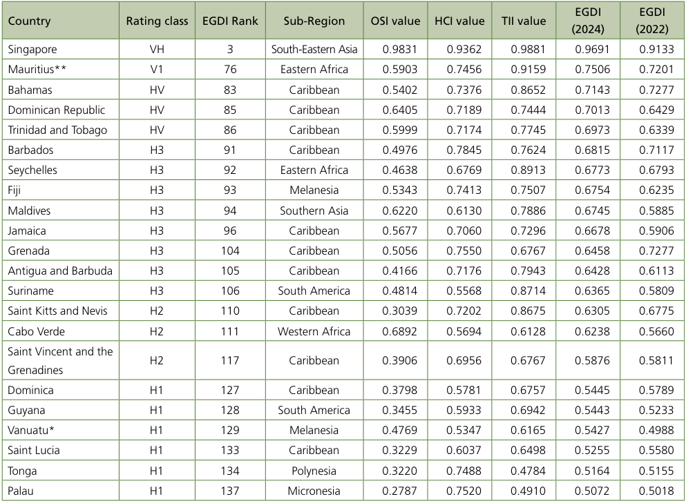

**----- Start of picture text -----** 
EGDI  EGDI Country Rating class EGDI Rank Sub-Region OSI value HCI value TII value (2024) (2022) Singapore VH 3 South-Eastern Asia 0.9831  0.9362 0.9881 0.9691  0.9133 Mauritius** V1 76 Eastern Africa 0.5903  0.7456 0.9159 0.7506  0.7201 Bahamas HV 83 caribbean 0.5402  0.7376 0.8652 0.7143  0.7277 Dominican Republic HV 85 caribbean 0.6405  0.7189 0.7444 0.7013  0.6429 Trinidad and Tobago HV 86 caribbean 0.5999  0.7174 0.7745 0.6973  0.6339 Barbados H3 91 caribbean 0.4976  0.7845 0.7624 0.6815  0.7117 Seychelles H3 92 Eastern Africa 0.4638  0.6769 0.8913 0.6773  0.6793 Fiji H3 93 Melanesia 0.5343  0.7413 0.7507 0.6754  0.6235 Maldives H3 94 Southern Asia 0.6220  0.6130 0.7886 0.6745  0.5885 Jamaica H3 96 caribbean 0.5677  0.7060 0.7296 0.6678  0.5906 Grenada H3 104 caribbean 0.5056  0.7550 0.6767 0.6458  0.7277 Antigua and Barbuda H3 105 caribbean 0.4166  0.7176 0.7943 0.6428  0.6113 Suriname H3 106 South America 0.4814  0.5568 0.8714 0.6365  0.5809 Saint Kitts and Nevis H2 110 caribbean 0.3039  0.7202 0.8675 0.6305  0.6775 cabo Verde H2 111 Western Africa 0.6892  0.5694 0.6128 0.6238  0.5660 Saint Vincent and the H2 117 caribbean 0.3906  0.6956 0.6767 0.5876  0.5811 Grenadines Dominica H1 127 caribbean 0.3798  0.5781 0.6757 0.5445  0.5789 Guyana H1 128 South America 0.3455  0.5933 0.6942 0.5443  0.5233 Vanuatu* H1 129 Melanesia 0.4769  0.5347 0.6165 0.5427  0.4988 Saint lucia H1 133 caribbean 0.3229  0.6037 0.6498 0.5255  0.5580 Tonga H1 134  Polynesia 0.3220  0.7488  0.4784  0.5164  0.5155 Palau H1 137  Micronesia 0.2787  0.7520  0.4910  0.5072  0.5018 **----- End of picture text -----** 

_Sources_ : 2022 and 2024 United Nations E-Government Surveys. * countries that have moved from the middle to the high EGDI group. 

** countries that have moved from high to the very high EGDI group. 

## **2.7 Summary of key findings and policy recommendations The number of countries with advanced digital capabilities is growing.** 

Significant progress has been made in e-government development, reflected in the increase from 0.6102 to 0.6382 in the global average EGDI value between 2022 and 2024. 

Over the past two years, 23 countries have moved to a higher EGDI level. For the first time, Member States with very high EGDI values (above 0.75) comprise the largest share, accounting for 39 per cent of the total number of countries assessed. The countries with high EGDI values (0.50 to 0.75) make up 32 per cent of the total. The proportion of countries with middle EGDI values (0.25 to 0.50) is now 23 per cent, reflecting a decline from 2022, but the share of countries with low EGDI values has increased to 6 per cent, largely owing to geopolitical conflicts and post-conflict situations that have hindered digital development. 

The general upward trend demonstrates the growing importance and priority Governments have given to digital transformation over the past decade, especially after the cOVID-19 pandemic, resulting in more people benefiting from the efficiencies and conveniences of digital government services. 

83 

2024 UN E-GovErNmENt SUrvEy 

**In e-government development, Europe is leading, but Asia is advancing more rapidly than other regions.** 

At the regional level, Europe continues to lead e-government development, once again achieving the highest average EGDI value (0.8493), followed by Asia (0.6990), the Americas (0.6701), Oceania (0.5289), and Africa (0.4247). Asia has seen the steepest increase in its average EGDI value (7.7 per cent). 

All European countries have very high (84 per cent) or high (16 per cent) EGDI values. The proportion of countries with high and very high EGDI values remains higher in the Americas (88 per cent) than in Asia (83 per cent); however, the share of countries with very high EGDI values has grown faster in Asia (by 21 per cent, compared with 8 per cent in the Americas). Asian countries in the very high EGDI group now account for 53 per cent of the regional total – a proportion exceeded only by Europe. 

South Africa and Mauritius, with respective EGDI values of 0.8616 and 0.7506, are the first countries in Africa to join the very high EGDI group, and Australia and New Zealand remain leaders in e-government development both in Oceania and globally. At the regional level, however, both Africa and Oceania continue to face serious development challenges, and digital divides persist. Africa and Oceania are the only two regions with average EGDI values below the global average of 0.6382. 

Global and regional OSI averages have risen slightly in 2024. The highest increase has occurred in Africa (5.2 per cent), followed by Asia (4.3 per cent), Oceania (4.2 per cent), the Americas (3.8 per cent), and Europe (1.8 per cent). 

**Improved telecommunications infrastructure is accelerating overall e-government development.** 

In 2024, the TII became the EGDI component contributing most to the increases in average EGDI values at the regional and global levels. This reflects an overall trend towards increased investment in infrastructure as a foundation for digital growth. Strengthening digital capacity has been prioritized as part of the cOVID-19 pandemic recovery process. 

The global average TII value has increased by 19.9 per cent since 2022. At the regional level, Oceania has seen the most significant increase (29.4 per cent), followed by Africa (27.8 per cent), Asia (25.5 per cent), the Americas (19.6 per cent), and Europe (9.9 per cent). 

**Governments are providing better access to public information and refining content to promote inclusiveness.** 

Most countries are steadily improving their online platforms. The organizational aspects of the institutional framework, which orient users on engaging government agencies online, are well developed across the board. In 9 out of 10 countries, the national portals provide users with access to a government organizational chart and information on the government structure, the names and titles of the heads of government departments and agencies, information on the cIO, and links to ministerial websites and sources of information on sector-specific policies. In 3 out of 4 countries, the national portals incorporate links to subnational or local government agencies. 

In the vast majority of countries (86 per cent), the Government provides information and services in multiple languages, which promotes inclusiveness and facilitates access to information and online services in multilingual societies. 

84 

Chapter 2 • Global trends in e-Government 

## **Legislative frameworks supporting e-government are not equally developed.** 

The legislative framework supporting e-government is not consistently developed and varies significantly across regions. Between 76 and 83 per cent of countries have national e-government strategies, policies or legislation relating to cybersecurity, data privacy, data protection, digital identity, and the right of citizens to access government information. 

Fewer countries have legislation or policies on open government data (63 per cent), e-participation (51 per cent), protecting the public against misinformation, disinformation and/or fake news (47 per cent), and frontier technologies such as cloud computing (44 per cent) and artificial intelligence (42 per cent). Interregional disparities are pronounced in these areas; more than half of the countries in Asia and Europe already have relevant legislation, policies or strategies, the average for the Americas is slightly above 30 per cent and that for Africa slightly below 30 per cent, and in Oceania the compliance rates range from 4 to 11 per cent. 

## **The digitalization of public procurement has improved, though somewhat unevenly.** 

countries are steadily moving towards digitalizing public procurement; however, there are significant disparities in the scope and comprehensiveness of e-procurement processes among regions. 

Publishing announcements of forthcoming procurement or bidding processes on national portals has become routine in 89 per cent of the countries surveyed. However, fewer countries (78 per cent) share information about the bidding or procurement results online. 

A total of 135 countries (70 per cent) have dedicated e-procurement portals, an increase of 4 per cent since 2022. The number of countries issuing digital invoices through these portals has increased by around 7 per cent and now stands at 101 (52 per cent). 

Nearly all countries in Europe (93 per cent) have e-procurement portals, and most (86 per cent) offer digital invoicing. In Asia and the Americas, about 80 per cent of countries have portals, but fewer (60 and 54 per cent, respectively) issue digital invoices. The gap is wider in Oceania and Africa, where the comparable proportions are 57 versus 21 per cent and 39 versus 26 per cent, respectively. 

## **E-participation has improved, but regional disparities are significant.** 

The global average E-Participation Index value has increased by 9 per cent (from 0.4450 to 0.4893) since 2022. All regions have improved in terms of proactive engagement with the public through e-participation processes. However, there are still broad regional disparities in specific aspects of e-participation, including providing information to the public, engaging in e-consultations, and including people’s voices in decision-making. 

More countries are providing information to the public, often in open, machinereadable formats. 

There has been an increase in the availability of useful information on key aspects of public administration, especially in open data formats. Roughly nine out of ten countries publish open data sets for national and sector-specific budgets and expenditures. More countries use open, machinereadable formats for expenditure-related data sets for national budgets (45 per cent) than for sectorspecific budgets (about 30 per cent). Only 31 per cent of the countries surveyed have participatory budgeting mechanisms in place. 

Along with budgetary information, most countries provide data sets on education (82 per cent), health (79 per cent), environment and employment (74 per cent each), justice (68 per cent), and social protection (65 per cent). When such information is available, it is often in machine-readable formats (45-58 per cent of the time). 

85 

2024 UN E-GovErNmENt SUrvEy 

Eighty-one per cent of the countries surveyed publish information on dedicated OGD portals, and 75 per cent provide GIS or other geospatial data on their national portals. However, in only 51 per cent of countries can people request or propose new open government data sets or freely reuse data owing to the adoption of open data licensing by the Government. Even fewer countries actively promote the use of open data through hackathons and competitions (45 per cent) or make OGD available in real time (43 per cent). 

The use of tools, mechanisms and dedicated portals for e-participation is expanding, though electronic evidence of people’s voices being included in decision-making varies widely among regions. 

In terms of the proportion of countries in each region proactively offering e-participation tools, channels or mechanisms, Europe is the regional leader (78 per cent), followed by Asia (62 per cent), the Americas (44 per cent), Oceania (33 per cent), and Africa (27 per cent). 

Around 50 per cent of the countries assessed for the Survey have a dedicated e-participation portal, 55 per cent publish calendar announcements about upcoming consultations on various sectorspecific issues, and 40 per cent use e-petitions or similar mechanisms to engage the public in policy deliberations. 

Europe has the highest proportion of countries providing evidence of having conducted at least one e-consultation in the 12 months preceding the administration of the Survey (91 per cent), followed by Asia (70 per cent), the Americas (60 per cent), Africa (24 per cent), and Oceania (14 per cent). Evidence that people’s voices have been included in actual decision-making is found in just under 31 per cent of countries, with regional averages ranging from 9 to 49 per cent. 

consultations with people in vulnerable situations are relatively uncommon. Between 18 and 28 per cent of countries published information about e-consultations having been held with people in vulnerable situations in the 12 months preceding the administration of the Survey, with the group engaged by the highest number of countries being youth (28 per cent), followed by persons with disabilities and women (24 per cent each), older people (21 per cent), individuals living below the poverty line (20 per cent), and immigrants (18 per cent). Evidence that input from vulnerable groups is included in actual decision-making is available for fewer countries (between 14 and 26 per cent, depending on the group). 

The online reporting of corruption is prioritized as a mechanism for engaging with the wider population. 

More than two thirds of the Member States provide channels for reporting corruption online. Europe has the highest proportion of countries incorporating this feature on their portals (88 per cent), followed by Asia (81 per cent), the Americas and Oceania (57 per cent each), and Africa (48 per cent). More than half of the countries (53 per cent) have also created mechanisms for reporting violations of labour law. 

## **Countries are expanding the range of services they provide online.** 

The number of Member States offering at least one of the online services assessed for the 2024 Survey remains at 189 (98 per cent). The global average number of online services offered relative to the number of services assessed has risen from 16 out of 22 in 2022 to 18 out of 25 in 2024. The online provision of all but four types of services has increased by between 1 and 14.5 per cent, translating to an overall increase of 3 per cent globally. 

The most prevalent online transactional services remain the registration of a new business (177 countries) and applying for a business licence (173 countries). The next most frequently offered 

86 

Chapter 2 • Global trends in e-Government 

online services include applying for government vacancies, paying utility bills (electricity and gas), applying for a birth certificate, and filing business taxes. The electronic submission of company taxes is offered by more countries than the online submission of income taxes, which is a departure from 2022. Tax-filing services are offered more frequently to businesses (157 countries) than to individuals (152 countries for income taxes and 147 countries for VAT). 

For the 2024 Survey, countries were asked about the level of digitalization of 19 of the 25 online services assessed. At the regional level, Europe has the highest degree of full digitalization among these services, followed by Asia, the Americas, Oceania, and Africa. At both the regional and global levels, rates of full digitalization are highest for the types of online services that support business registration, licensing, and paying taxes (around 50 per cent globally) and applying for government vacancies (48 per cent). Services related to social protection – those that allow people to apply online for child benefits, maternal or newborn benefits, unemployment benefits, and retrenchment or severance benefits when losing a job – can be completed fully online in about 25 per cent of the Member States (a 2 per cent increase from 2022). Essentially, most countries use their portals to provide information and forms, but in most cases one still needs to appear in person to complete public service transactions. 

## **The provision of online services to the most vulnerable populations is on the decline.** 

The number of countries providing information and services that target specific vulnerable populations has decreased by an average of 5 per cent since 2022. The sharpest decline (13.5 per cent) is recorded for immigrants, which is concerning given that in 2022 the services aimed at supporting immigrants were provided by the highest number of countries (163, compared to 141 countries in 2024). The provision of services for women (148 countries) and people living below the poverty line (132 countries) has also declined (by 9 and 8.3 per cent, respectively). 

Europe remains the most homogeneous region in terms of the provision of online services for people in vulnerable situations (94 per cent of countries), and 45 per cent of those services (the highest proportion among the regions) can be completed online. 

Over the past two years, the proportion of countries providing services for people in vulnerable situations has risen from 45 to 70 per cent in Oceania and from 44 to 56 per cent in Africa. However, the share of countries that offer fully digitalized services is only 21 per cent in Oceania and 5 per cent in Africa. 

## **Countries in special situations are making some progress but require ongoing support.** 

EGDI values are improving for countries in special situations but remain lower than the global average, and there are significant disparities within and between the groups assessed. 

The combined average EGDI value for lDcs, llDcs and SIDS rose by 4 per cent between 2022 and 2024, increasing from 0.4703 to 0.4884 – an indication of progress but still well below the global average EGDI value of 0.6382. 

In line with global trends, the average TII values for all groups of countries in special situations have increased by an average of 19 to 29 per cent, though they remain below the global average TII value of 0.6896. These increases reflect enhanced investment in telecommunications infrastructure, which is essential for supporting e-government and broader digital development. Similarly, the average OSI values for the respective groups have improved (at a slower pace than TII values), but still fall significantly short of the global average. 

The overall distribution of SIDS across the different EGDI levels has remained relatively stable. The majority of SIDS (54 per cent) are in the high EGDI group, 38 per cent are in the middle group, 5 per 

87 

2024 UN E-GovErNmENt SUrvEy 

cent are in the very high group, and 3 per cent are in the low group. The average EGDI value for SIDS has increased by 3 per cent, reflecting steady progress in digital government development. The lDc/ SIDS have shown significant improvement, particularly in online services provision; their average OSI value rose by 8 per cent – the highest increase for this component among the countries in special situations. The progress made by this group suggests that access to marine transportation routes and other infrastructure-related advantages play a critical role in advancing the development and provision of digital services. 

The llDcs have experienced more dynamic changes in e-government development since 2022. They have achieved the most significant gains among three groups, as reflected in the 6 per cent increase in their average EGDI value. With the movement of five countries from the high to the very high EGDI group, the proportion of llDcs in the latter group has surged from 3 to 19 per cent. When lDcs and SIDs are excluded from the overall group of llDcs, the remaining landlocked countries make up the highest proportion of countries with high and very high EGDI values (87.5 per cent) among the countries in special situations. The advances made by the countries in this group indicate that geographical constraints, while disruptive to development, can be mitigated through effective digital strategies. 

The majority of lDcs (62 per cent) remain at the middle EGDI level. However, the digital divide has widened within this group, with two countries moving up to the high EGDI level and three countries dropping to the low EGDI; this has increased the proportions of countries in the high and low EGDI groups by 3 and 7 per cent, respectively. These trends underscore the need for targeted interventions to support countries lagging in digital development. 

The average EGDI value for lDcs has risen slightly (by 1 per cent). The overall gains for the group as a whole are negligible; however, lDc/SIDS have increased their average OSI value by 8 per cent and their average EGDI value by 2 per cent since 2022. Online services provision for lDc/llDcs has stalled, indicating the need for focused efforts to accelerate digital development and strengthen the delivery of public services in least developed landlocked countries. 

Average OSI values vary widely for groups of countries in special situations – and all are well below the global average OSI value. 

lDcs, llDcs and SIDS have made progress in online services provision, but there are still significant gaps between their average OSI values and the corresponding global average. The smallest gap between the global average OSI value and the average OSI values for specific groups (15 per cent) is observed for llDcs; the gap widens to 37 per cent for SIDS and 43 per cent for lDcs. Within the lDc group, landlocked lDcs have a sizeable gap of 37 per cent, but lDcs that are also small island States have the largest gap (58 per cent) relative to the global OSI average. 

Overall, the legislative framework for advancing e-government is better developed in llDcs, including those that are least developed, than in SIDS or lDcs. Most llDcs have an e-government or digital government strategy (78 per cent), legislation or policy documents on cybersecurity (91 per cent), legal provisions for data protection (88 per cent), legislation governing freedom of information (78 per cent), and digital ID regulations (72 per cent). Fewer SIDS and lDcs (51 to 65 per cent) have these types of legislation in place, and the proportions are even lower for lDc/SIDS (between 13 and 65 per cent, depending on the type of legislation). 

Policies on open government data, e-participation, artificial intelligence, cloud computing, and protecting the public against misinformation, disinformation and/or fake news are found in about 3 out of 10 llDcs, 2 out of 10 SIDS, and 1 out 10 lDcs. 

88 

Chapter 2 • Global trends in e-Government 

E-participation opportunities tend to be limited in countries in special situations. 

Within the lDc, llDc and SIDS groups and related subgroups, between 40 and 56 per cent of countries offer online channels for reporting corruption, and 24 to 59 per cent integrate e-tools for public consultation or deliberation. However, dedicated e-participation portals, published calendar announcements about upcoming consultations, and information about the results of such deliberations are less common in these countries than in other Member States. Among the three main groups, llDcs provide a comparatively better environment for e-participation than do SIDS and lDcs. 

There is more online information about services than actual, fully digitalized services in countries in special situations. 

consistent with global trends, the Governments of countries in special situations prioritize the full digitalization of services that support businesses (registration, licensing, and paying taxes), as well as those that allow people to apply online for government vacancies. For many other types of services, government portals provide information and often even supply forms to fill out, but one still needs to appear in person to complete transactions. More llDcs and SIDS (including those that are also least developed) provide information about online services than do lDcs. 

The proportion of countries with fully digitalized online services is larger for the llDc group than for the other groups of countries in special situations, though the averages for each of the services assessed for all these groups are much lower than the comparable global average. For instance, registering a business online is fully digitalized in half of the Member States, 41 per cent of llDcs, 38 per cent of SIDS, and 20 per cent of lDcs. In the small island and landlocked lDcs, the proportions are even lower (25 and 19 per cent, respectively). 

The wide disparities in EGDI composite and component values among the countries in special situations reveal a complex landscape of progress and setbacks. The EGDI, TII and OSI values for the three groups and associated subgroups have improved in many cases but are still well below the corresponding global averages. Addressing these disparities requires a nuanced understanding of the unique situations prevailing in each group, as well as customized strategies that promote inclusive and sustainable digital development. 

## **Policy recommendations** 

- Fully digitalize online services and improve telecommunications infrastructure 

As more countries progress to higher levels of e-government development, it is important to continue to strengthen telecommunications infrastructure and online services provision. Priority should be given to fully digitalizing (rather than merely providing information on) public services, as this will streamline administrative procedures for all users but will be particularly beneficial for the most vulnerable population groups. 

- Improve legislative environment for digital development, especially on frontier technologies 

Adopting strong, forward-looking policies, strategies and legislative frameworks – especially for frontier technologies such as AI, cloud, open data licensing, and digital identity – will allow countries to create an enabling environment for digital development and ultimately improve the provision of online services. countries in Africa and Oceania will particularly benefit from establishing firm foundations through such action, as this will contribute to narrowing digital divides. 

89 

2024 UN E-GovErNmENt SUrvEy 

- Promote and facilitate public participation in policy and decision making 

Improving e-participation policies and practices is essential for advancing e-government development globally. A growing number of countries are sharing information and data with the public, but more needs to be done to proactively engage citizens in public consultations and integrate their input in decision-making. Promoting and facilitating increased public engagement support the principles of good governance, transparency and accountability and will lead to improvements in overall e-government development (as reflected in the EGDI). 

## Endnotes 

- 1 The three-point scale distinguishing different levels of public participation was first used in 2020 (see United Nations, _E-Government Survey 2020: Digital Government in the Decade of Action for Sustainable Development_ , pp. 117-118). 

- 2 A list of all Member States and their respective EPI values is provided in annex, table 2. 

- 3 See United Nations Office of the High Representative for the Least Developed Countries, Landlocked Developing Countries and Small Island Developing States (UN-OHRLLS), “What we do”, available at https://www.un.org/ ohrlls/content/what-we-do. 

- 4 There are officially 39 small island developing States, but two have not been assessed for the Survey. The Cook Islands and Niue are SIDS that participate in activities supported by United Nations specialized agencies; however, they are not States Members of the United Nations, nor do they have non-Member State observer status with the United Nations General Assembly. 

- 5 See UN-OHRLLS, Doha Programme of Action for the Least Developed Countries 2022-2031, adopted on 17 March 2022 at the Fifth United Nations Conference on the Least Developed Countries and adopted by the United Nations General Assembly on 1 April 2022, available at https://www.un.org/ldc5/sites/www.un.org.ldc5/ fles/doha_booklet-web.pdf. 

- 6 - See UN-OHRLLS, “About landlocked developing countries”, available at https://www.un.org/ohrlls/content/about landlocked-developing-countries. 

- 7 See United Nations, General Assembly, “Draft outcome document of the fourth International Conference on Small Island Developing States”, 12 April 2024 (A/CONF.223/2024/4), available at https://sdgs.un.org/sites/default/ fles/2024-05/n2409990.pdf. 

- 8 Ibid., para 25, point (vii). 

- 9 For resources on capacity building work on digital government, public participation and more, please refer to UN DESA/ DPIDG website at: https://publicadministration.desa.un.org/capacity-development/about. 

90 

Chapter 3 • regional e-government Development anD the performanCe of Country groupings 

**3. Regional E-Government Development and the Performance of Country Groupings** 

Photo credit: shutterstock.com 

## **3.1 Introduction** 

The present chapter provides a comprehensive overview of global e-government development from a regional perspective. It analyses regional performance and identifies major trends using the E-Government Development Index (EGDI). The successive sections detail key findings from responses to the Member States Questionnaire (MSQ), examining digital progress across different countries and highlighting specific trends among country groupings. The chapter incorporates contributions from various United Nations regional commissions and other international organizations, as well as insights from two expert group meetings on the preparatory process for the United Nations E-Government Survey, conducted by the United Nations Department of Economic and Social Affairs (UN DESA) in Guimarães, Portugal,[1] and in New York.[2] 

## **3.2 Megatrends at the regional level** 

Overall, e-government development has gained significant momentum over the past two years. The global average EGDI value has risen by 4.59 per cent since 2022 (from 0.6102 to 0.6382), compared with an increase of 1.90 per cent during the preceding assessment period (see Figure 3.1). 

The development of digital government has seen a worldwide upward trend, with regions leveraging technology to enhance government services and improve citizen engagement. The shift towards digital technologies accelerated during the post-pandemic recovery period, fueled by increased investment in resilient infrastructures and advanced solutions such as cloud computing and broadband. This shift is also driven by increased computing power, decreased costs, and the explosion of data due to mobile device proliferation. 

Global megatrends include the rapid digitalization of services, the integration of generative and predictive AI, a growing focus on digital identity and data management, the shift towards remote work, and the increasing reliance on data and emerging technologies for policymaking. A key trend is the emphasis on viewing digital development through an equity lens, prioritizing inclusiveness, safety, accessibility, transparency, accountability, and openness. This approach ensures that all voices are heard, and the impact of digital advancements on all groups is thoroughly considered, monitored, and evaluated. This transformation has catalyzed innovation in the private sector, particularly for micro-, small-, and medium-sized enterprises, aligning with government platforms and standards. Venture capital investment in AI has surged, with $22.3 billion 

||In this chapter:||
|---|---|---|
||3.1 Introduction 3.2 Megatrends at the regional level|91 91|
||3.3 crossing the digital divide: progress, challenges and disparities 93||
||3.4 Africa: country grouping analysis|96|
||3.4.1 Regional development and||
||cooperation|97|
||3.4.2 Key recommendations for||
||accelerating digital||
||development in Africa|100|
||3.5 The Americas: country grouping analysis|103|
||3.5.1 Regional development and||
||cooperation|103|
||3.5.2 Key recommendations for||
||accelerating digital development||
||in the Americas 3.6 Asia: country grouping analysis 3.6.1 Digital development and cooperation|109 110 112|
||3.6.2 Key recommendations for accelerating digital development in Asia 3.7 Europe: country grouping analysis|115 118|
||3.7.1 Regional development and||
||cooperation 3.7.2 Key recommendations for accelerating digital|120|
||development in Europe|126|
||3.8 Oceania: country grouping analysis 3.8.1 Regional development and cooperation 3.8.2 Key recommendations for accelerating digital development in Oceania|127 128 131|

91 

**Chapter 3** 

2024 UN E-GovErNmENt SUrvEy 

Figure 3.1 EGDI global and regional trends 

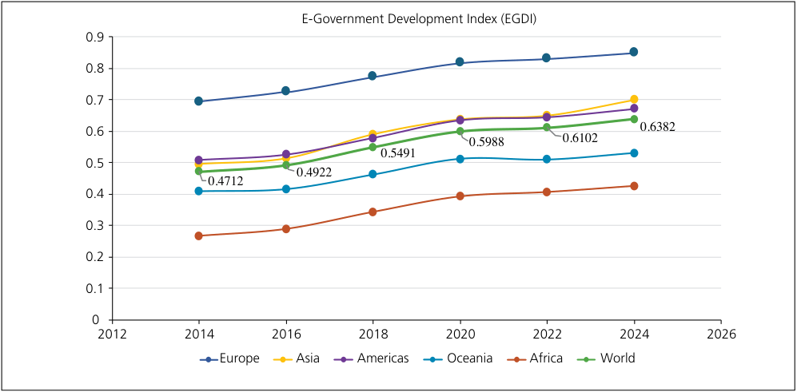

**----- Start of picture text -----** 
E-Government Development Index (EGDI) 0.9 0.8 0.7 0.6 0.6382 0.5988 0.6102 0.5491 0.5 0.4922 0.4712 0.4 0.3 0.2 0.1 0 2012 2014 2016 2018 2020 2022 2024 2026 Europe Asia Americas Oceania Africa World **----- End of picture text -----** 

invested in the fourth quarter of 2023 and $90.9 billion for the year, compared to ~$700 million a decade earlier.[3] Public sector digitalization has also driven improvements in infrastructure, broadband access, and cybersecurity measures. 

This digital transformation extends into sectors like education, employment, social protection, healthcare, justice, and the environment, prioritizing digital skills and contributing to a workforce equipped for a digital-first economy. The public sector’s example has stimulated demand for new digital services, promoting digital entrepreneurship and creating technology-driven job opportunities. These transformations have collectively contributed to more robust, sustainable, and resilient economies better prepared for current challenges and future uncertainties. 

Average EGDI values have improved in all regions since 2022. Europe remains the leader in e-government development, with an average EGDI value of 0.8493, followed by Asia (0.6990), the Americas (0.6701), Oceania (0.5289) and Africa (0.4247). Asia has made the most notable progress, with a 7.65 per cent increase in its average EGDI value, followed by Africa (4.76 per cent), Oceania and the Americas (4.09 per cent) and Europe (2.26 per cent). Despite the significant progress achieved in Oceania and Africa, the EGDI average for these two regions remains below the global average of 0.6382. 

In the Americas, the proportion of countries in the very high EGDI group increased from 23 per cent in 2022 to 31 per cent in 2024, while the proportion in the high EGDI group fell from 69 per cent to 57 per cent, signifying steady improvement in e-government development. This positive trend has been driven by countries in latin America and the caribbean, which have shown a growing commitment to enhancing online services delivery, improving digital infrastructure, and expanding Internet access. Initiatives to improve e-participation and digital inclusion have also played a pivotal role in fostering greater civic engagement and narrowing the digital divide. Regional collaborations and international partnerships have further accelerated digital advancement. 

In Asia, the very high EGDI group accounts for the largest proportion of countries (43 per cent). Strong upward trends have largely been driven by significant advancements in digital transformation and digital government in countries that are part of the cooperation council for the Arab States of the 

92 

Chapter 3 • regional e-government Development anD the performanCe of Country groupings 

Gulf (Gcc), china, and countries in Western and central Asia These countries have invested heavily in innovative digital solutions and infrastructure, leading to enhanced efficiency and transparency. As a result of these dynamics, the proportions of Asian countries in the high and middle EGDI groups declined sharply between 2022 and 2024, with their respective shares in these groups dropping from 47 to 30 per cent and from 21 to 11 per cent. 

In Oceania, the digital landscape is characterized by much greater variation; 57 per cent of the 14 countries surveyed fall into the middle EGDI group and 28 per cent into the high EGDI group, while Australia and New Zealand, comprising 14 per cent, stand out in the very high EGDI group. Australia and New Zealand are regional and global leaders due to their robust performance in digital transformation and government services. In contrast, the small island developing States (SIDS) in Oceania face substantial challenges, including inadequate technological infrastructure, susceptibility to cyber threats, and the effects of geographic isolation. 

In Africa, digital trends reflect a wide spectrum of development. Most of the region’s countries (52 per cent) are in the middle EGDI group, 31 per cent are part of the high EGDI group, and 13 per cent belong to the low EGDI group. South Africa and Mauritius, accounting for 4 per cent of the regional total, have moved up to the very high EGDI group and are the first African countries to have reached the highest EGDI tier, having effectively harnessed digital innovations to enhance public services and stimulate economic growth. However, many countries in Middle, Eastern, and Western Africa face challenges such as inadequate digital infrastructure, limited access to technology and a dearth of digital leadership and skilled information technology (IT) professionals, hindering their capacity to implement effective digital government and exacerbating the digital divide. 

## **3.3 Crossing the digital divide: progress, challenges and disparities** 

Although digital government trends are broadly positive, levels of development and specific trends vary considerably across the five regions assessed. Both within and between regions, significant challenges persist, including securing adequate financing for digital development, bridging the digital divide, bolstering cybersecurity and privacy protections, and aligning digital strategies with effective implementation. These ongoing challenges continue to undermine the development efforts of countries in special situations, in particular least developed countries (lDcs), landlocked developing countries (llDcs), and SIDS. 

The global average EGDI value as a proxy for measuring the digital divide points to substantial improvement over the past two years. Among the 193 Member States, the proportion of the population lagging behind fell from 45.0 per cent in 2022 to 23.7 per cent in 2024. This improved ratio primarily derives from the positive performance of Asia, in particular the positioning of India and Bangladesh above the global EGDI average. Although progress has been impressive, it is important to note that there are still 1.9 billion people on the wrong side of the digital divide. 

Figure 3.2 illustrates which areas of the world are most vulnerable to the digital divide. 

Progress in bridging the digital divide through e-government development varies from one region to another. In Africa, 84.4 per cent of the population lag behind, down from 94.6 per cent in 2022, as 6 of the region’s 54 countries (South Africa, Mauritius, Tunisia, Morocco, Seychelles and Egypt) now have EGDI values above the world average, up from 4 countries in 2022. This small improvement is due primarily to the gains achieved in Morocco and Egypt, both of which have EGDI values above the global average in 2024. No significant improvement has been observed in Oceania, where the same 11 out of 12 SIDS still have EGDI values below the global average. Excluding Australia and New Zealand, this leaves 92 per cent of the region’s population at a disadvantage in terms of the digital divide. 

93 

2024 UN E-GovErNmENt SUrvEy 

In the Americas, e-government development is progressing. The number of countries with EGDI values below the global average dropped from 14 (out of 35) in 2022 to 13 in 2024, and the proportion of the regional population lagging behind decreased from 10.7 per cent to just under 9.2 per cent (though the latter share is calculated at 14.5 per cent when canada and the United States of America are excluded). This slight improvement is due primarily to the strong performance of Jamaica, which has moved up one rating class (from H2 to H3) in 2024 with an EGDI value higher than the world average.* 

Figure 3.2 Geographical distribution of countries with EGDI values below the global average, 2024 

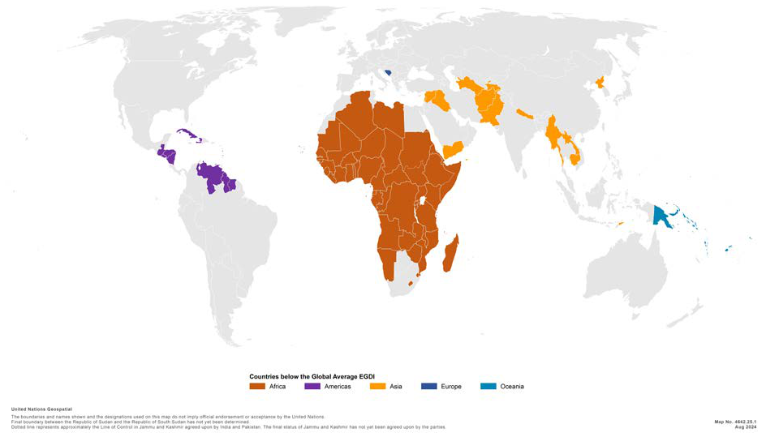

In Europe, only Bosnia and Herzegovina has dropped below the world average, moving down one rating class within the high EGDI group (from H3 to H2) in 2024. 

Table 3.1 shows the population of countries with EGDI values below the world average as a share of the total population of each region for 2024. 

Table 3.1 Proportion of the regional population living in countries with EGDI values below the global average, 2024 

**----- Start of picture text -----** 
Population  Population of countries with EGDI Geographical distribution of the population Percentage (in thousands) values below the world average **----- End of picture text -----** 

|Geographical distribution of the population|Population (in thousands)|Population of countries with EGDI values below the world average|Percentage|
|---|---|---|---|
|||||
|All 193 Member States|8,009,865|1,897,077|23.7%|
|Africa|1,461,864|1,234,487|84.4%|
|Asia|4,726,615|552,626|11.7%|
|Americas|1,033,176|94,723|9.2%|
|Americas (excluding canada and the United States)|651,641|94,723|14.5%|
|Europe|743,769|155,223|20.8%|
|Oceania|44,441|12,047|27.1%|
|Oceania (excluding Australia and New Zealand)|12,969|12,047|92.9%|

*  Additional information on the rating-class-based division of data is provided in the Appendix of the present publication. 

94 

Chapter 3 • regional e-government Development anD the performanCe of Country groupings 

Uneven access to technology and information creates disparities among countries and communities in the same region. Because socioeconomic development and business opportunities may be limited in digitally underserved areas, youth and others of working age sometimes migrate to more advanced and affluent neighbouring countries with better prospects and economic stability. This outflow of the workforce can harm local economies, hinder growth and development, and lead to brain drain and the loss of talent and expertise. 

country-level EGDI values are used to measure the digital divide within each region. A narrow range of EGDI values points to similar levels of digital development, while a wide range of values indicates that there is significant variation in levels of digital development among countries (see figure 3.3). 

Europe has the lowest dispersion and diversity of country EGDI values. All but one of the countries assessed are above the world average, which suggests that this region is moving more rapidly than other regions towards convergence in the level of e-government development. 

Asia and the Americas are roughly comparable in their levels of e-government development, with most of their countries above the world average and a growing number of countries trending upward. At the same time, both regions are characterized by the extensive dispersion and diversity of country EGDI values, highlighting gaps in e-government development and suggesting the persistence of internal digital divides within these two regions. 

Figure 3.3 Regional snapshot of countries by EGDI level, 2024 

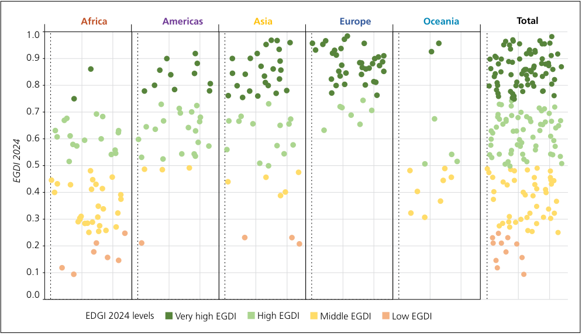

**----- Start of picture text -----** 
Africa Americas Asia Europe Oceania Total 1.0 0.9 0.8 0.7 0.6 0.5 0.4 0.3 0.2 0.1 0.0 EDGI 2024 levels Very high EGDI High EGDI Middle EGDI Low EGDI EGDI 2024 **----- End of picture text -----** 

A similar high dispersion and diversity situation prevails in Africa, though in this region the majority of countries are plotted below the EGDI global average and most of the values are significantly lower, highlighting substantive gaps in e-government development and an alarming digital divide. 

In Oceania, EGDI values are largely below the world average but vary from 0.3076 to 0.9577, suggesting highly uneven e-government development. The high diversity in Oceania is explained by the fact that while Australia and New Zealand are top performers, most of the remaining countries 

95 

2024 UN E-GovErNmENt SUrvEy 

(11 out of 14) have EGDI values below the global average. SIDS are in a particularly critical situation with regard to the digital divide, given their limited Internet infrastructure and human resource capabilities and the dearth of online services. 

The megatrends in digital government development are promising across the regions assessed; however, addressing the remaining challenges is crucial for realizing the full potential of technology in transforming government operations and enhancing public services. 

## **3.4 Africa: country grouping analysis** 

South Africa and Mauritius are the leaders in e-government development in Africa. For the first time, these countries are part of the very high EGDI group – a reflection of the advancements achieved in digital government skills, services and infrastructure. They are followed closely by 17 countries in the high EGDI group that have made significant progress in enhancing their digital government capabilities. Table 3.2 presents the key Survey results for these top performers in 2024. 

Table 3.2 Countries leading e-government development in Africa, 2024 

**----- Start of picture text -----** 
Country Rating class EGDI rank Subregion OSI HCI TII EGDI (2024) EGDI  (2022) **----- End of picture text -----** 

|Country|Rating class|EGDI rank|Subregion|OSI|HCI|TII|EGDI (2024)|EGDI  (2022)|
|---|---|---|---|---|---|---|---|---|
||||||||||
|South Africa*|V2|40|Southern Africa|0.8872|0.8026|0.8951|0.8616|0.7357|
|Mauritius*|V1|76|Eastern Africa|0.5903|0.7456|0.9159|0.7506|0.7201|
|Tunisia|HV|87|Northern Africa|0.5951|0.6497|0.8357|0.6935|0.6530|
|Morocco|HV|90|Northern Africa|0.5618|0.6078|0.8827|0.6841|0.5915|
|Seychelles|H3|92|Eastern Africa|0.4638|0.6769|0.8913|0.6773|0.6793|
|Egypt|H3|95|Northern Africa|0.7002|0.6150|0.6946|0.6699|0.5895|
|Ghana|H2|108|Western Africa|0.6084|0.5586|0.7281|0.6317|0.5824|
|Kenya|H2|109|Eastern Africa|0.7770|0.5271|0.5901|0.6314|0.5589|
|cabo Verde|H2|111|Western Africa|0.6892|0.5694|0.6128|0.6238|0.5660|
|Botswana|H2|112|Southern Africa|0.3985|0.5719|0.8649|0.6118|0.5495|
|Eswatini|H2|113|Southern Africa|0.4557|0.5836|0.7851|0.6081|0.4498|
|Namibia|H2|114|Southern Africa|0.4996|0.5738|0.7288|0.6007|0.5322|
|Algeria|H2|116|Northern Africa|0.3320|0.6418|0.8129|0.5956|0.5611|
|Rwanda|H2|118|Eastern Africa|0.8207|0.5467|0.3724|0.5799|0.5489|
|Gabon|H2|121|Middle Africa|0.3187|0.5772|0.8263|0.5741|0.5521|
|côte d’Ivoire|H1|124|Western Africa|0.5219|0.4848|0.6693|0.5587|0.5467|
|libya|H1|125|Northern Africa|0.0808|0.5951|0.9639|0.5466|0.3375|
|Zambia|H1|130|Eastern Africa|0.4958|0.6225|0.5088|0.5424|0.5022|
|Senegal|H1|135|Western Africa|0.4779|0.3380|0.7328|0.5162|0.4479|

_Notes_ : Italicized countries are least developed countries, landlocked developing countries or small island developing States. An asterisk denotes countries that have moved up from the high to the very high EGDI group in 2024. 

The countries in the table are organized into six descending rating classes (V2, V1, HV, H3, H2 and H1) within the very high and high EGDI groups. This list of relatively high performers underscores the region’s growing commitment to implementing digital government initiatives aimed at enhancing services delivery, increasing transparency, encouraging e-participation, and strengthening both digital infrastructure and human capital. Six countries – South Africa, Mauritius, Morocco, Seychelles, Tunisia and Egypt – are among the top 100 performers worldwide, with EGDI values higher than the global average. Among those six, South Africa and Mauritius are leading the regional charge in e-government development, having advanced to the very high EGDI group with respective ratings of 

96 

Chapter 3 • regional e-government Development anD the performanCe of Country groupings 

V2 and V1. Morocco and Egypt have also made significant strides, joining the top 100 countries for the first time. Morocco has joined Tunisia in the HV rating class, while Egypt now has an H3 rating, the same as Seychelles. These 19 countries are well-positioned to further enhance their e-government development if they continue to invest and engage in digital transformation. 

There are 28 African countries in the middle EGDI group, indicating steady growth in digital integration despite various challenges. Seven countries (Burundi, Niger, chad, Eritrea, Somalia, South Sudan and the central African Republic) are still part of the low EGDI group, reflecting substantial gaps in digital infrastructure, online services and human capital development that require urgent attention. The lack of digital progress in the countries with low EGDI values can primarily be attributed to the effects of ongoing conflict and post-conflict situations. 

Survey results for all of the African countries assessed are available in section 12 of the Technical Appendix. 

## **3.4.1 Regional development and cooperation** 

While e-government development in Africa is generally trending upward, it has yet to gain significant momentum. It is widely recognized within the region that digitalization is critical for sustainable development, and the Digital Transformation Strategy for Africa (2020-2030) has been formulated by the African Union to unleash the transformative power of digital technologies. The Strategy, aimed at accelerating economic growth, fostering social inclusion, and achieving sustainable development throughout the region, envisions “an integrated and inclusive digital society and economy in Africa” and is aligned with Agenda 2063: The Africa We Want and the Sustainable Development Goals (SDGs).[4] 

The Digital Transformation Strategy is based on four pillars: enabling environment, policy and regulation; digital infrastructure; digital skills and human capacity; and digital innovation and entrepreneurship. The Information Society Division of the African Union commission is coordinating the implementation of the Strategy in cooperation with international and regional stakeholders, overseeing progress using a regional monitoring, evaluation and learning framework. 

Box 3.1 Information Society Division of the African Union Commission 

The Information Society Division of the African Union commission is dedicated to driving digital transformation across Africa, enhancing digital integration through the harmonization of policies and regulations and creating an enabling environment for digital transformation to promote sustainable and inclusive socioeconomic development in alignment with Agenda 2063 goals and aspirations and the Sustainable Development Goals. To achieve these objectives, the Division has undertaken several initiatives in recent years, including the implementation of the Digital Transformation Strategy for Africa (2020-2030), the promotion of digital ID interoperability in line with the relevant African Union policy framework, the fostering of data-driven economies, the development of strategies for a digital single market, and the formulation and adoption of effective regulations governing cybersecurity and artificial intelligence. In addition to these efforts, the Division continues to promote the region’s digital agenda globally, contributing to policy development in broader United Nations forums and processes, including the Global Digital compact proposed by the Secretary-General, the Open-ended Working Group on security of and in the use of information and communications technologies, and the Group of Governmental Experts on advancing responsible State behaviour in cyberspace in the context of international security. 

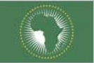

_Source_ : African Union, “About the African Union”, available at https://au.int/en/overview#:~:text=The%20African%20Union%20 (AU)%20is,OAU%2c%201963-1999). 

97 

2024 UN E-GovErNmENt SUrvEy 

The United Nations Economic commission for Africa (EcA) supports member states in developing national digital transformation strategies aligned with the broader Digital Transformation Strategy. countries receiving support include Benin, Gambia, Botswana, Ghana, Zambia, Namibia, and côte d’Ivoire. However, many countries, particularly lDcs, lack capacity and resources. Significant barriers to widespread digital transformation and e-government development include challenges with Internet connectivity and affordability, digital inclusion and services provision, digital literacy, and cybersecurity. 

Significant disparities persist across the continent, particularly in terms of digital infrastructure, meaningful, universal, and affordable connectivity, digital skills, the gender digital divide, and e-government readiness and implementation. Many African nations do not have dedicated strategic frameworks for the advancement of e-government, though they do maintain sectoral strategies for digital transformation. As illustrated in figure 3.4, the EGDI composite and component values for African countries are broadly dispersed, reflecting widely varying levels of online services, human capital, and telecommunications infrastructure development across the region. 

These disparities underscore the urgent need to enhance digital transformation and digital governance efforts across the continent. An early priority in this regard is the adoption of digital identity systems that enable businesses and government entities to provide better services. Digital identification enhances the efficiency, security and accessibility of government services while also protecting the privacy of individuals and promoting trust. Digital identity is not just about convenience; it also plays a crucial role in maintaining accurate records and reducing errors in government databases. More importantly, it is a powerful tool in the fight against identity theft and fraudulent activities. Digital identity systems help ensure the authenticity, validity and legality of online transactions, including submitting forms, signing contracts and participating in e-government processes. 

EcA, through its Digital center of Excellence on Digital Identity, Trade and Economy, is involved in several national projects aimed at enhancing digital identification and e-government development. In Nigeria, collaboration with Kaduna State has resulted in the development of a digital identification system for the pension bureau, which has streamlined services and reduced fraud.[5] In Gambia, the national digital identity system has facilitated access to various services while cutting transaction costs.[6] In Ethiopia, EcA has partnered with the Government to launch the National Identity Program 

Figure 3.4 Distribution of EGDI values relative to OSI, HCI and TII values for Africa, 2024 

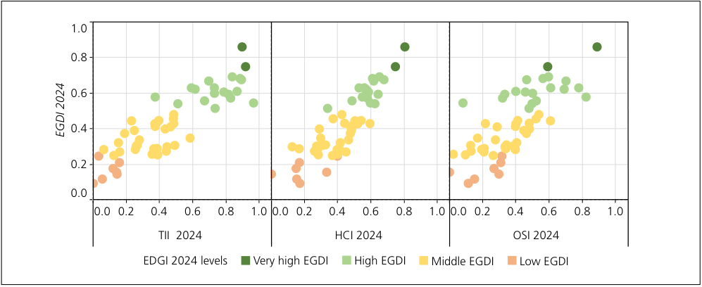

**----- Start of picture text -----** 
1.0 0.8 0.6 0.4 0.2 0.0 0.0 0.2 0.4 0.6 0.8 1.0 0.0 0.2 0.4 0.6 0.8 1.0 0.0 0.2 0.4 0.6 0.8 1.0 TII  2024 HCI 2024 OSI 2024 EDGI 2024 levels Very high EGDI High EGDI Middle EGDI Low EGDI EGDI 2024 **----- End of picture text -----** 

98 

Chapter 3 • regional e-government Development anD the performanCe of Country groupings 

(Fayda), designed to improve access to services and administrative efficiency. The Inclusive Identity Project in Ethiopia, developed in partnership with the Office of the United Nations High commissioner for Refugees and Mastercard, uses inclusive digital technology to verify the identity of refugees and ensure access to entitlements.[7] 

To address the gender digital divide, EcA leads the connected African Girls programme, providing science, technology, engineering, arts and math (STEAM) training to more than 40,000 girls aged 12-25 across Africa. In collaboration with Rwanda and congo, EcA has established the African STEAM centre of Excellence and the African Research centre for Artificial Intelligence to advance education and research in STEAM and AI. Initiatives such as the Digital Green platform and regional workshops further reflect the EcA commitment to supporting the use of digital technologies for inclusive economic development and regional integration. 

Headquartered in Beirut, the Economic and Social commission for Western Asia (EScWA) is one of five United Nations regional commissions. It plays a vital role in advancing regional integration, developing norms and standards, and fostering intergovernmental cooperation among its 21 member States, which include Egypt, libya, Mauritania, Morocco, Somalia, Sudan, Tunisia, and (as of 2023) Djibouti in Africa. EScWA leverages its convening power to promote dialogue and knowledge-sharing at various levels and foster intraregional and interregional cooperation and vibrant South-South partnerships. As the voice of the region, EScWA brings people together for deliberation and advocacy. As the think tank of the region, it supports quality data collection and analysis for forward-looking, evidence-based policymaking. EScWA also provides capacity-building and technical advisory services. As the primary source of regional support for the 2030 Agenda, it guides member States in their efforts to implement the SDGs. 

EScWA provides ongoing technical support to member States in the development, application and revision of national plans for digital transformation. The commission has worked with relevant ministries and public agencies in libya and Somalia to develop national digital transformation strategies and has helped draft e-participation policies in the Syrian Arab Republic and Mauritania. It has also suggested a quality framework for digital services in libya and the Syrian Arab Republic. EScWA conducted several national capacity-building activities during the period 2022-2024 to raise awareness in member States about the importance of digital transformation and digital government. These workshops concentrated on digital transformation strategies (libya and Somalia), digital technologies (Sudan and Somalia), open data (Morocco), and information and communications technology (IcT) indicators (Mauritania). 

International organizations such as the Tony Blair Institute for Global change (TBI) have also been actively involved in supporting digital transformation across Africa, facilitating technological advancements and collaborating with government leaders and policymakers on the development of policy frameworks and the implementation of effective digital strategies to foster sustainable development. TBI efforts are aimed at creating a robust digital ecosystem to drive economic growth, improve public services, and strengthen inclusion – and more broadly at helping African nations position themselves as leaders in global digital innovation. Key initiatives include advising on digital infrastructure deployment, enhancing government services delivery through digitalization, and developing digital skills within the workforce. In Ghana, Malawi and Senegal,[8] the TBI Digital Academy is strengthening the digital technology skills of government staff and helping shape future leaders in public sector digital transformation. TBI is collaborating with Ethiopia, Ghana, Rwanda, Senegal and Zambia on the #TomorrowPartnership initiative, which focuses on closing digital skills gaps, expanding digital access, investing in infrastructure, and leveraging technology and data to improve policymaking. 

99 

2024 UN E-GovErNmENt SUrvEy 

Box 3.2 Mauritius, Rwanda, Seychelles and South Africa 

The Tony Blair Institute for Global change (TBI) works with senior political leaders, helping them leverage opportunities within the government machinery to drive positive change. Executive political authority is needed to operationalize a whole-of-government approach to digital transformation and to support scaling and the ongoing adoption and integration of new innovations. TBI currently works with almost 40 countries worldwide and is engaged in joint activities with international, intergovernmental and institutional partners. For example, the Institute is working with the UN DESA Division for Public Institutions and Digital Government to ensure that EGDI findings lead to concrete strategy, policy, delivery, technology, and digital partnership decisions by Governments as they strive to improve access to basic public services. The Institute helps political leaders establish the digital foundations needed to transform the way government innovates, operates and delivers, with support provided in the areas of strategy, policy and delivery. The figure offers a snapshot of the progress achieved in recent years. _Source_ : Tony Blair Institute for Global change, available at https://www.institute.global/. 

## **3.4.2 Key recommendations for accelerating digital development in Africa** 

Africa is at a pivotal juncture in its digital transformation journey. With a rapidly expanding youth population and the increasing penetration of mobile technology, the continent is uniquely positioned to leapfrog traditional developmental pathways and embrace a digital future. However, the path to digital inclusion and sustainable development in Africa remains fraught with obstacles and uncertainties. An analysis of past and present EGDI indicators for the region confirms that even with the most optimistic projections on future development trends, Africa will not be able to bridge the gap with other regions over the next six years to achieve the SDGs. This reality highlights the urgent need for accelerated efforts and innovative solutions to address digital disparities. 

Advancements in AI are expected to further widen the gap between Africa and the rest of the world, underscoring the critical need for strategic investments and capacity-building initiatives to ensure the meaningful participation of Africa in an AI-driven global economy. Bridging this gap by 2030 will require significant investment in infrastructure development, affordability initiatives, and digital literacy programmes to ensure equitable access and participation in the digital economy. Funding and education disparities and regulatory obstacles may hinder efforts to narrow the divide within this time frame. 

## The urgent need for collective action and innovative solutions 

Swift action is needed to accelerate digital transformation in Africa and foster a more inclusive ecosystem. collective action and innovative solutions are needed to harness technology for sustainable development and equitable growth. A multifaceted approach, including comprehensive development strategies and strengthened North-South, South-South, and triangular cooperation, is essential. Initiatives like the African continental Free Trade Area (AfcFTA) are exploring e-commerce technologies such as blockchain to enhance cross-border trade transparency and efficiency. (see box 3.3). 

100 

Chapter 3 • regional e-government Development anD the performanCe of Country groupings 

Box 3.3 African Continental Free Trade Area 

The African continental Free Trade Area (AfcFTA) is one of the flagship initiatives of Agenda 2063: The Africa We Want. It constitutes the region’s largest free trade area in terms of the number of participating member States. This ambitious, comprehensive trade initiative addresses critical economic priorities in Africa, including digital trade and investment protection. By eliminating regional barriers to trade, AfcFTA aims to significantly boost intraregional trade across all sectors of the economy, in particular trade in value-added production. Signed by 54 African Union member States (all except Eritrea), the Agreement Establishing the African continental Free Trade Area aims to create a single market for goods and services and to facilitate the free movement of people and investment across the African continent. Key AfcFTA goals include the following: 

- _Eliminating tariffs and trade barriers_ . AfcFTA members are committed to eliminating tariffs on most goods and services over a period of 5, 10 or 13 years, depending on each country’s level of development and the nature of the trade products. The intention is to boost intraAfrican trade by reducing barriers and facilitating the free flow of goods, services, capital and people across the continent. 

- _Establishing a single market_ . The overall aim of the AfcFTA is to create a single, liberalized market for goods and services in Africa. Priorities include developing regional infrastructure and establishing a continental customs union to further integrate African economies. 

- _Boosting economic development_ . The AfcFTA is expected to lift 30 million Africans out of extreme poverty and boost income for nearly 68 million others. It is projected to raise income in Africa by $450 billion by 2035 – a 7 per cent gain. 

- _Ensuring effective governance and implementation_ . AfcFTA negotiations and implementation are overseen by a permanent secretariat based in Accra. 

- Trading under the AfcFTA began in January 2021, with an initial pilot programme involving eight countries implemented in 2022. 

_Source_ : African continental Free Trade Area, available at https://au-afcfta.org/; see also the Agreement Establishing the African continental Free Trade Area, available at https://au.int/sites/default/fles/treaties/36437-treaty-consolidated_text_on_cfta_-_en.pdf. 

International and regional collaboration – which offers network effects and opportunities to generate economies of scale – is essential for digital firms in Africa to compete globally. Eliminating barriers such as broadband coverage gaps, digital illiteracy, and red tape at borders can help people and businesses across Africa access larger markets and lead to job creation. However, significant gaps in digital infrastructure and regulatory barriers still stand in the way of seamless intra-African trade. Expanding broadband access, especially in rural and underserved areas, is crucial for making digital services available to all and for accelerating Africa’s digital development. 

## Strengthening digital public infrastructure and connectivity 

Strengthening telecommunications networks and data centers will improve connectivity and ensure digital systems’ resilience. Establishing regional digital hubs can spur research, development, innovation, and create clusters of technological advancement. The United Nations Development Programme (UNDP) and International Telecommunication Union (ITU) are leading an initiative to support and strengthen digital public infrastructure (DPI)[9] in 100 countries by 2030. This initiative focuses on developing people-centered, interoperable digital systems to promote inclusive digital transformation and accelerate progress towards the SDGs. 

A critical component of the DPI initiative is creating a universal safeguard framework that recognizes human rights and ensures safe, inclusive, and sustainable DPI adoption globally. UNDP provides tailored support to national governments, assisting with digital transformation stages, from readiness assessments to strategy design and implementation. The initiative supports developing inclusive digital identity systems to help Africans without basic identity credentials access digital services. 

101 

2024 UN E-GovErNmENt SUrvEy 

The DPI initiative also focuses on mobilizing financing, leveraging the Joint SDG Fund Window on Digital Transformation to address funding gaps for robust digital infrastructures in Africa. It aims to use partnerships with the private sector and community-based organizations to strengthen last-mile connectivity and inclusion, ensuring digital public infrastructure benefits reach everyone, including those in remote regions. Overall, the UNDP/ITU initiative represents a significant effort to support African countries in building inclusive, rights-based, and sustainable digital public infrastructures, driving substantial progress towards achieving the SDGs. 

Creating a Single Digital Market and Harmonizing Regulations 

Establishing a single digital market across Africa will lower trade and communication barriers and make the Internet faster and more accessible. Harmonizing data protection and privacy regulations at the regional level, as per the AU Data Policy Framework, is crucial for enabling free data flow while safeguarding rights. Promoting open data and creating digital commons will make digital technologies more accessible and affordable. 

Developing digital literacy and skills and supporting startup ecosystems and innovation 

Africa’s young demographic presents a unique opportunity for rapid digital transformation. Investing in digital skills development and STEM education for the youth can accelerate technological and economic progress, leveraging the continent’s demographic dividend. Integrating digital skills training into education at all levels and establishing vocational training centres are essential steps. This will build a workforce for a digital society, laying the foundation for an innovative and globally competitive digital economy. Governments must support youth as they transition from consumers to creators and innovators, bolstering the startup ecosystem and nurturing technological entrepreneurship and economic growth. 

Establishing a favourable policy and regulatory environment is essential for achieving these goals. The Policy and Regulation Initiative for Digital Africa, a collaborative effort between the African Union, the European Union and ITU, exemplifies this aim, addressing critical policy, regulatory and capacity-building needs and paving the way for a digitally inclusive future across Africa (see box 3.4). 

## Box 3.4 Policy and Regulation Initiative for Digital Africa 

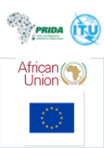

The Policy and Regulation Initiative for Digital Africa (PRIDA) is a joint undertaking of the African Union, European Union and International Telecommunication Union (ITU). Supported by the Pan-African Programme funded by the European Union, the Initiative is designed to enable the African continent to reap the benefits of digitalization by addressing various dimensions of broadband supply and demand and building the capacities of African Union member States in the Internet governance space. PRIDA has three tracks: ITU is responsible for ensuring efficient and harmonized spectrum utilization across the continent (track 1), and the African Union commission is responsible for harmonizing IcT/telecommunications policy, legal and regulatory frameworks (track 2) and for promoting the active participation of African stakeholders in the global Internet governance debate (track 3). More than 1,500 young Africans have received training through courses designed by PRIDA, and about 150 African trainers have been equipped to train young Africans on topics relating to digital policy. Among other things, the PRIDA courses, available in both online and offline formats, are designed to help strengthen the African voice in the global Internet/digital governance arena. To sustain capacity development beyond PRIDA, the Pan African Virtual and E-University has started offering the Internet governance course as an elective master’s degree course. 

_Source_ : largely excerpted from Policy and Regulation Initiative for Digital Africa, “About us”, available at https://prida.africa/aboutus/#:~:text=The%20%22Policy%20and%20Regulation%20Initiative,various%20dimensions%20of%20broadband%20demand. 

102 

Chapter 3 • regional e-government Development anD the performanCe of Country groupings 

## **3.5 The Americas: country grouping analysis** 

Significant progress has been made in digital government across the Americas, encompassing Northern America, latin America, and the caribbean. Key initiatives have enhanced service delivery, strengthened infrastructure, improved digital skills, increased transparency, and fostered greater citizen engagement through technology. 

The United States and canada in Northern America, and Uruguay, chile, Argentina, and Brazil in latin America and the caribbean, lead digital government development. The top countries in the Americas by EGDI values are listed in Table 3.3. The 11 countries in the very high EGDI group include the United States, Uruguay, and chile in the V3 rating class, followed by Argentina, canada, and Brazil in the V2 class, and Peru, costa Rica, Mexico, Ecuador, and colombia in the V1 class. Notably, Ecuador, Mexico, and colombia moved from the high to the very high EGDI group for the first time in 2024. 

Most countries in the region (20 in total) fall into the middle EGDI category, indicating steady growth in digital integration despite challenges. Belize, cuba, and Honduras, at a relatively low level within the middle EGDI group, still face substantial gaps in digital infrastructure, online services, and human capital requiring urgent attention. As in 2022, Haiti remains at the lowest EGDI level in the region, with ongoing political crises and conflicts severely undermining efforts to create a stable and effective digital infrastructure. 

Table 3.3 Countries leading e-government in the Americas 

**----- Start of picture text -----** 
Country Rating class EGDI rank Subregion OSI HCI TII EGDI  2024) EGDI  (2022) **----- End of picture text -----** 

|Country|Rating class|EGDI rank|Subregion|OSI|HCI|TII|EGDI  2024)|EGDI  (2022)|
|---|---|---|---|---|---|---|---|---|
||||||||||
|United States of America|V3|19|Northern America|0.9136|0.8842|0.9605|0.9194|0.9151|
|Uruguay|V3|25|South America|0.8832|0.8749|0.9437|0.9006|0.8388|
|chile|V3|31|South America|0.8612|0.8413|0.9455|0.8827|0.8377|
|Argentina|V2|42|South America|0.7965|0.9330|0.8425|0.8573|0.8198|
|canada|V2|47|Northern America|0.8552|0.8725|0.8078|0.8452|0.8511|
|Brazil|V2|50|South America|0.9063|0.8077|0.8068|0.8403|0.7910|
|Peru|V1|58|South America|0.8377|0.7469|0.8364|0.8070|0.7524|
|costa Rica|V1|61|central America|0.7217|0.7877|0.8933|0.8009|0.7659|
|Mexico*|V1|65|central America|0.7637|0.7603|0.8310|0.7850|0.7473|
|Ecuador*|V1|67|South America|0.8851|0.7715|0.6833|0.7800|0.6889|
|colombia*|V1|68|South America|0.7521|0.7793|0.8065|0.7793|0.7261|

_Note_ : An asterisk denotes countries that have moved from the high to the very high EGDI group in 2024. 

A complete list of assessed countries in the Americas is available in section 12 of the Technical Appendix. 

## **3.5.1 Regional development and cooperation** 

## Northern America 

The United States and canada, both federal democracies, are actively pursuing digital transformation at national, state/provincial, and local levels. Federal governments establish overarching policies, while state and provincial governments implement localized strategies and initiatives like digital identity programs. Dedicated agencies, policies, and initiatives in both countries aim to drive digital transformation, enhance citizen experiences, and build a digitally skilled public workforce. However, the federal structure leads to variations in digital service quality and quantity across different regions. 

103 

2024 UN E-GovErNmENt SUrvEy 

The cOVID-19 pandemic highlighted the critical role of digital government, prompting rapid deployment of digital solutions in both countries to meet urgent public needs. This period saw investments in resilient and advanced technologies, emphasizing the importance of digital infrastructure. Post-pandemic, digital transformation remains a key component of recovery strategies, focusing on digital inclusion, public health system upgrades, and economic recovery through digital platforms. Efforts include expanding broadband access to underserved communities, launching digital identity solutions, and enhancing online educational resources. 

In the United States, several innovative initiatives have been implemented post-pandemic, including Executive Order 14058 on Transforming Federal customer Experience and Service Delivery to Rebuild Trust in Government[10] and the updated United States International cyberspace & Digital Policy Strategy. 

Box 3.5 Building digital solidarity: the United States International Cyberspace & Digital Policy Strategy 

The updated United States International cyberspace & Digital Policy Strategy, released in May 2024, outlines a new approach to international cooperation and engagement on digital and cyber issues. The key focus is on building digital solidarity through collaboration with partners and allies. The Strategy has three guiding principles: 

- The pursuit of an affirmative vision for a secure and inclusive cyberspace grounded in international law and human rights; 

- The integration of cybersecurity, sustainable development and technological innovation; 

- The implementation of a comprehensive policy approach utilizing the tools of diplomacy across the digital ecosystem. 

_The Strategy identifies four main action areas:_ 

- Promote, build and maintain an open, inclusive, secure and resilient digital ecosystem. 

- Align rights-respecting approaches to digital and data governance with international partners. 

- Advance responsible State behaviour in cyberspace and counter threats to cyberspace and critical infrastructure by building coalitions and engaging partners. 

- Strengthen and build international partner digital policy and cyber capacity. 

Key aspects of the Strategy include pursuing collaboration and capacity-building with partners rather than embracing digital sovereignty; promoting a multi-stakeholder approach that involves the private sector in digital governance; securing critical infrastructure and supporting the development of resilient technology ecosystems; balancing innovation rather than protecting certain sensitive technologies (the small yard, high fence approach); and integrating human rights, development goals and technological progress. 

This “affirmative and proactive” Strategy aims to mobilize United States resources to connect people through digital solidarity and thereby contribute to an inclusive, secure and equitable digital future. This marks a shift towards greater international cooperation, capacity-building and rights-based digital governance as core tenets of United States cyber and digital policy on the global stage. 

_Source_ : United States, Department of State, United States International cyberspace & Digital Policy Strategy: Towards an Innovative, Secure, and Rights-Respecting Digital Future, available at https://www.state.gov/wp-content/uploads/2024/06/United-StatesInternational-cyberspace-and-Digital-Strategy.pdf. The four main action areas are excerpted from the source. 

104 

Chapter 3 • regional e-government Development anD the performanCe of Country groupings 

Executive Order 14058 mandates a comprehensive, government-wide approach to enhancing customer experience, with agencies committing to service improvements linked to important life events. Significant progress has been made in aligning government services with digital expectations, ensuring interactions are simple, seamless, and secure. 

The 2024 United States International cyberspace & Digital Policy Strategy introduces the concept of digital solidarity (see box 3.5), emphasizing collaboration to achieve shared goals, build capacities, and provide mutual support. This strategy aims to promote an open, secure, and resilient digital ecosystem, align digital governance with international human rights standards, advance responsible behavior in cyberspace, and strengthen international partners’ ability to counter cyberthreats and cybercrime. This multifaceted approach seeks to forge a robust digital future, highlighting the United States’ aspirations to lead in cyberdiplomacy and digital technology governance.[11] 

Canada has its own digital government strategies and initiatives, including the canadian Digital Operations Strategic Plan: 2021-2024,[12] Digital Ambition, and Beyond2020. These initiatives aim to modernize government operations, enhance digital services, and build a capable digital workforce. 

The canadian Digital Operations Strategic Plan: 2021-2024 directs the integrated management of services, information, data, IT, and cybersecurity across the federal government. Its objectives include modernizing legacy IT systems, improving digital services for citizens and businesses, and implementing comprehensive data management and cybersecurity approaches. A key initiative within the plan is developing a trusted digital identity framework using open standards for secure online service access. The plan supports the broader Digital Government Strategy and the Policy on Service and Digital[13] and prioritizes adopting modern technologies such as cloud computing, consolidating networks, phasing out obsolete systems, and focusing on user-centric service design. It aims to strengthen digital skills within the public sector, enable data-driven decision-making, and improve cybersecurity and operational efficiency. Regular progress reviews ensure the plan adapts to new priorities, providing a roadmap for digital transformation in the public sector. 

Digital Ambition[14] and Beyond2020[15] focus on transforming government operations and public services for the digital age. Digital Ambition aims to build a digital workforce and modernize online services for canadians, setting priorities for federal departments to transition to a digital-first approach. Objectives include enhancing digital skills within the public sector, adopting advanced technologies like cloud computing, and redesigning services to be user-centric and accessible online. It aligns with the broader Digital Operations Strategic Plan by prioritizing data use, cybersecurity management, and comprehensive IT solutions to increase efficiency. 

Beyond2020 complements these efforts by fostering an inclusive, digital-ready public service sector. It prepares public servants for future challenges by equipping them with necessary skills and mindsets and supporting modern, adaptive work environments. It promotes continuous learning, modernizing workplaces, adopting new working methods, and creating an innovative, inclusive workforce. Activities include reskilling and upskilling staff, updating human resource policies, integrating digital collaboration tools, and driving cultural change to attract diverse talent and adapt to new technologies. 

Together, Digital Ambition and Beyond2020 provide a comprehensive approach to transforming the canadian public sector into a modern digital entity with a capable workforce ready to meet present and future demands. 

## Latin America and the Caribbean 

Since the start of the 21st century, latin America and the caribbean have embarked on ambitious digital transformation processes. The most recent Digital Agenda for latin America and the caribbean (elAc2024), adopted at the Eighth Ministerial conference on the Information Society in Montevideo 

105 

2024 UN E-GovErNmENt SUrvEy 

in November 2022, establishes a regional policy framework for digital transformation for 2023 and 2024. Approved by delegates from 14 countries, elAc2024 focuses on enhancing infrastructure and connectivity, promoting sustainable digital practices in business, improving well-being through digital transformation, and fostering new digital partnerships for prosperity. It integrates a gender perspective and covers a wide range of areas, including the digital economy, government, inclusion, skills, emerging technologies, cybersecurity, and regional market integration. Prepared by the United Nations Economic commission for latin America and the caribbean (EclAc) and the Government of Uruguay, elAc2024 represents a concerted effort to drive inclusive and sustainable digital advancement. Progress and challenges will be reviewed at the Ninth Ministerial conference on the Information Society in November 2024, under the Government of chile. 

Significant progress in digital government and development has been made across the region. countries such as Uruguay, chile, Argentina, Brazil, Peru, costa Rica, Mexico, Ecuador, and colombia are now in the very high EGDI group in 2024, reflecting their efforts in integrating digital technologies to enhance public services and government efficiency. 

Uruguay a regional leader in digital government development, exemplifies this with initiatives led by the Agency for Electronic Government and the Information and Knowledge Society (AGESIc). The Agenda Uruguay Digital 2025, supported by the AGESIc Honorary Board of Directors and Honorary Advisory council for the Information Society.[16] and aligned with the SDGs, focuses on the digital transformation of public services, aiming to deliver efficient and personalized services by enhancing citizen-government interaction and implementing a standardized, multichannel services model. 

Mexico, Ecuador, and Colombia have moved to the very high EGDI group for the first time, marking significant progress in e-government development. Their achievements showcase the considerable efforts made in overhauling digital infrastructures, implementing comprehensive national digital strategies, and improving citizen engagement through digital platforms. 

In the caribbean, 13 Small Island Developing States (except cuba and Haiti) have shown commendable progress, placing them in the high EGDI group. The Dominican Republic and Trinidad and Tobago have demonstrated exceptional growth, investing heavily in telecommunications infrastructure and expanding digital services, which have streamlined government processes and increased digital accessibility. These efforts position them close to the Bahamas as leaders in digital advancement in the caribbean, reflecting their commitment to leveraging digital technologies for sustainable development and improved public services delivery. 

Figure 3.5 Distribution of EGDI values relative to TII, HCI and OSI values for the Americas, 2024 

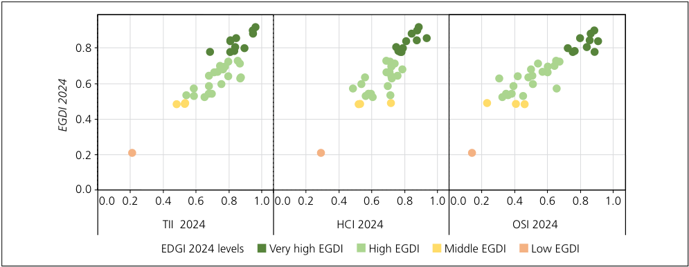

**----- Start of picture text -----** 
0.8 0.6 0.4 0.2 0.0 0.0 0.2 0.4 0.6 0.8 1.0 0.0 0.2 0.4 0.6 0.8 1.0 0.0 0.2 0.4 0.6 0.8 1.0 TII  2024 HCI 2024 OSI 2024 EDGI 2024 levels Very high EGDI High EGDI Middle EGDI Low EGDI EGDI 2024 **----- End of picture text -----** 

106 

Chapter 3 • regional e-government Development anD the performanCe of Country groupings 

The achievements described above highlight the growing importance of leveraging digital transformation in the region to foster government transparency, increase public sector efficiency, and enhance services delivery and digital infrastructure. The clustering shown in figure 3.5 indicates that countries in the Americas generally exhibit consistent levels of development across the three key EGDI subcomponents – the Online Services Index (OSI), the Human capital Index (HcI) and the Telecommunications Infrastructure Index (TII). Haiti is the only outlier, an indication of the significant challenges it still faces in digital development. 

In 2021, the latin American and caribbean Institute for Economic and Social Planning (within EclAc) surveyed digital government policymakers to assess progress in digital governance. The survey evaluated four areas: strategies (national development snapshots and promotion of digital transformation), governance (institutional setups for achieving objectives), policies (normative frameworks guiding development), and projects (digital governance initiatives). Results showed countries were more likely to have strategies and governance structures in place than supporting policies and projects (see figure 3.6).[17] 

capacity-building and digital cooperation between international organizations and latin American and caribbean countries have been crucial in advancing digital development. This collaboration allows for the sharing of resources and expertise and facilitates technology transfer, accelerating the region’s digital transformation and ensuring effective implementation of the latest digital solutions. 

Figure 3.6 Results of the ECLAC survey on digital governance in Latin America and the Caribbean 

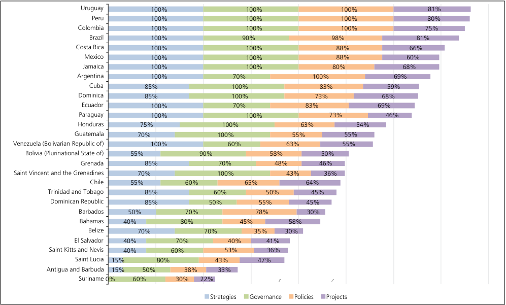

**----- Start of picture text -----** 
Uruguay 100% 100% 100% 81% Peru 100% 100% 100% 80% Colombia 100% 100% 100% 75% Brazil 100% 90% 98% 81% Costa Rica 100% 100% 88% 66% Mexico 100% 100% 88% 60% Jamaica 100% 100% 80% 68% Argentina 100% 70% 100% 69% Cuba 85% 100% 83% 59% Dominica 85% 100% 73% 68% Ecuador 100% 70% 83% 69% Paraguay 100% 100% 73% 46% Honduras 75% 100% 63% 54% Guatemala 70% 100% 55% 55% Venezuela (Bolivarian Republic of) 100% 60% 63% 55% Bolivia (Plurinational State of) 55% 90% 58% 50% Grenada 85% 70% 48% 46% Saint Vincent and the Grenadines 70% 100% 43% 36% Chile 55% 60% 65% 64% Trinidad and Tobago 85% 60% 50% 45% Dominican Republic 85% 50% 55% 45% Barbados 50% 70% 78% 30% Bahamas 40% 80% 45% 58% Belize 70% 70% 35% 30% El Salvador 40% 70% 40% 41% Saint Kitts and Nevis 40% 60% 53% 36% Saint Lucia 15% 80% 43% 47% Antigua and Barbuda 15% 50% 38% 33% Suriname 0% 60% 30% 22% Strategies Governance Policies Projects **----- End of picture text -----** 

_Source_ : EclAc, based on the results of a survey conducted by the latin American and caribbean Institute for Economic and Social Planning. 

EclAc has been instrumental in institutional capacity-building and training for civil servants in latin America and the caribbean, preparing governments for digital government strategies. In 2023, 55 participants attended an international course organized by the latin American and caribbean Institute for Economic and Social Planning titled “From Digital Government to Smart Government”[18] . 

107 

2024 UN E-GovErNmENt SUrvEy 

Box 3.6 Cooperation between ECLAC and the Ministry of Science, Innovation, Technology and Telecommunications in Costa Rica 

Between 2019 and 2023, EclAc provided technical support to the Ministry of Science, Innovation, Technology and Telecommunications in costa Rica with the aim of strengthening interoperability, digital governance and data governance. Technical assistance and training were provided to personnel from 12 State institutions – a group collectively referred to as the digital identity and implementation of national interoperability team. In-depth feedback from participants informed the preparation of a road map to guide interoperability development and integration at the country level and to help define and support the development of an effective interoperability model, with an assessment of needs at the organizational, legal/regulatory, semantic and technological levels. EclAc contributed to efforts resulting in the adoption of a decree relating to the promotion of digital services and the development of digital identity and national interoperability in costa Rica. It also provided technical assistance to support the creation of a national agency that would act as the governing body for digital government. All of these actions support a governance model that allows broad inter-institutional coordination, political articulation, and technical standardization for the integration of services within a harmonized system encompassing all sectors and institutions. The overarching aim is to improve the integration and utilization of digital technologies to address the needs of citizens, companies and public administration. The outcome of the first phase of this technical assistance is reviewed in a publication on digital governance and government interoperability. This implementation guide provides information on diagnostic tools, the value proposition, interoperability services, and the digital governance model for national interoperability. Its recommendations are useful for any country requiring support in these areas. 

_Source_ : EclAc, “Gobernanza digital e interoperabilidad gubernamental: una gu ί a para su implementación”, July 2021, available at Gobernanza digital e interoperabilidad gubernamental: una guía para su implementación | cEPAl; see also costa Rica, Ministry of Science, Innovation, Technology and Telecommunications. 

Additionally, a panel discussion on governance for digital transformation was held during the nineteenth meeting of the Regional council for Planning in Santo Domingo in November 2023. Representatives from the Bahamas, chile, costa Rica, the Dominican Republic, and Ecuador discussed evolving digital government into smart government through inclusive, accountable institutions and data-driven public policy. 

In the caribbean, capacity-building has focused on creating and measuring indicators reflecting the unique situation in SIDS. In March 2023, EclAc and the caribbean Telecommunications Union hosted the Workshop on Measuring the Digital Society for Digital Inclusion, proposing a draft set of caribbean IcT indicators to assess digital development based on on the nuanced realities prevailing in these island States.[19] 

EclAc’s research agenda for the caribbean emphasizes digital inclusion. A 2023 study of 11 caribbean countries and territories found varying stages of digital transformation, with most national frameworks lacking specific provisions for digital inclusion. A January 2023 policy brief examined how improving broadband quality and affordability could advance digital inclusion in the caribbean.[20] 

In October 2023, during the twenty-first meeting of the Monitoring committee of the caribbean Development and cooperation committee, EclAc convened a two-day seminar titled “Positioning the caribbean in the Knowledge Economy: The Role of Data”.[21] Panel discussion topics included “artificial intelligence and the caribbean data revolution” and “advancing digital inclusion through data and measurement”. The panels assessed the readiness of the subregion to embark on a caribbean data revolution that promotes sustainable development and facilitates digital inclusion across the caribbean. 

EclAc has also collaborated with costa Rica’s government, supporting digital governance, data governance, and interoperability. This partnership aims to enhance the effectiveness and efficiency of digital services, ensuring well-integrated digital systems and high standards of data security and transparency (see box 3.6). 

108 

Chapter 3 • regional e-government Development anD the performanCe of Country groupings 

## **3.5.2 Key recommendations for accelerating digital development in the Americas** 

## Importance of regional collaboration and integration 

Regional collaboration and integration are essential for effective digital transformation in latin America and the caribbean. A unified digital market requires the standardization of digital regulations, in particular the harmonization of laws on digital commerce, data protection and crossborder data flows. Information on the importance of signature validation in cross-border transactions is provided in box 3.7. 

Box 3.7 A regional solution for cross-border signature validation 

Uruguay has set up firma.gub.uy to promote and facilitate the use of advanced electronic signature options offered by a range of providers registered with the Electronic certification Unit. This web interface was designed so that individuals and firms could easily use or validate electronic signatures. This is the first regional solution that guarantees the safe, reliable, transparent and efficient cross-border exchange and validation of cross-border signatures. The system is currently being utilized in Uruguay, Argentina, Brazil and Paraguay, where its legal validity is recognized. The availability of reliable cross-border digital signature options enables people and organizations in different countries to conduct transactions completely online, which can save users time and money, cut down on administrative procedures, reduce transaction-related barriers, and increase business productivity and competitiveness. 

_Source_ : Uruguay, Agency for Electronic Government and the Information and Knowledge Society, “firma.gub.uy”, available at https://frma.gub.uy/es/pp/inicio. 

The Inter-American Network on Digital Government Authorities (Red GEAlc) is pivotal in latin America and the caribbean’s digital transformation, promoting cooperation and best practices. Red GEAlc advances digital tools in public administration, enhances transparency and efficiency, and implements cybersecurity measures. It also promotes regional integration of digital standards and policies, essential for the digital economy’s growth. Red GEAlc’s priorities align with elAc2024, adopted in 2022, which outlines regional digital transformation objectives through 2024. Red GEAlc organizes ministerial meetings and high-level discussions on citizen-centric digital services, data governance, and emerging technologies like AI, facilitating policy dialogue and regional cooperation strategies. 

countries must continue promoting regional collaboration, strengthening networks like Red GEAlc, and enhancing North-South, South-South, and triangular cooperation, supported by capacity-building initiatives from EclAc and other UN entities. These efforts ensure sustained digital transformation progress across the region. 

## Investment in broadband infrastructure, digital literacy and digital skills 

A comprehensive digital transformation approach is essential for inclusion, requiring significant broadband infrastructure investment, especially in SIDS, rural, and underserved areas. This should include traditional connectivity solutions and innovative technologies like satellite and 5G networks. Promoting digital literacy and skills development is critical, empowering individuals in rural and marginalized communities and preparing the workforce for the digital economy. 

Strong cybersecurity is crucial for protecting infrastructure and personal data, maintaining the integrity and trustworthiness of digital transactions. Public-private partnerships are also essential, leveraging strengths from both sectors and reducing the financial burden on public resources. These collaborations facilitate large-scale digital infrastructure projects and service delivery innovations. 

109 

2024 UN E-GovErNmENt SUrvEy 

Inclusive digital policies are vital. Policymakers must consider the needs of all society segments, including women, indigenous peoples, and marginalized groups. An inclusive policy framework aims to narrow the digital divide and promote equitable access to technology, ensuring digital benefits are shared across all socioeconomic groups. 

## Ensuring funding and resources for digital transformation 

To advance e-government and broader sustainable development objectives, latin American and caribbean countries must invest heavily in digital transformation. Supporting innovation and startups through incentives like tax breaks, seed funding, and technology parks is vital for economic growth and technological advancement. Allocating funds and resources from national budgets and securing international financing are critical. The United Nations, development banks, and other international institutions offer funding support to bolster digital development. By leveraging these resources, the region can accelerate digital transformation efforts, bridge the digital divide, and meet evolving challenges, ultimately improving economic and social outcomes. 

## **3.6 Asia: country grouping analysis** 

Asian countries have demonstrated remarkable performance in e-government development, as reflected in the 2024 EGDI results. Among the five global regions assessed, Asia has achieved the most rapid advancement in digital development, driven by both established and emerging digital leaders. 

Singapore, the Republic of Korea and Japan have long been recognized as frontrunners in digital governance, consistently earning the highest EGDI rankings due to their advanced digital infrastructures, widespread adoption of cutting-edge technologies, innovative public services solutions, and strong regulatory frameworks and digital development strategies. These nations have set high standards in digital government, offering seamless, secure and efficient services that enhance citizen engagement and promote inclusion. 

The Gcc countries, along with Kazakhstan, Türkiye and china, have also made impressive strides in their digital transformation journeys. These nations have invested heavily in digital infrastructure, embracing new technologies such as AI, blockchain and the Internet of Things (IoT) to revolutionize public administration and services delivery. Their commitment to digitalization has been further accelerated by national strategies that prioritize IcT development and digital literacy. 

The rapid progress in these countries has had a cascade effect on their neighbours, driving regional growth in digital transformation. Governments across Asia are recognizing the importance of digital governance as a cornerstone of economic and social development. Following the lead of the frontrunners, they are implementing their own digital initiatives, which are increasingly tailored to the unique needs of their populations and local contexts. 

This collective push for enhanced digital capabilities is not only improving government services but also fostering a positive competitive environment that encourages continuous improvement and innovation. The success of digital transformation in Asia has served as a compelling blueprint for other regions aiming to leverage technology to enhance governance and drive development. 

The countries with the highest EGDI values in Asia are listed in table 3.4. 

Twenty-five countries in the region (the majority of those assessed) are in the very high EGDI group. At the forefront of this group, Singapore, the Republic of Korea, Saudi Arabia, the United Arab Emirates, Japan and Bahrain are in the highest (VH) rating class, identifying them as global leaders in e-government development and services provision. They are followed closely by Israel, Kazakhstan, Türkiye and china in the V3 rating class. 

110 

Chapter 3 • regional e-government Development anD the performanCe of Country groupings 

Twenty-five countries in the region are in the very high EGDI group, with Singapore, the Republic of Korea, Saudi Arabia, the UAE, Japan, and Bahrain at the forefront in the highest (VH) rating class. They are followed by Israel, Kazakhstan, Türkiye, and china in the V3 rating class. 

Notably, six Asian countries, including Mongolia, Armenia, and Qatar, have moved up to the V2 rating class, joining the very high EGDI group for the first time in 2024, showcasing substantial improvements in digital government capabilities. The V1 rating class within the very high EGDI category includes nine countries, with seven (Uzbekistan, Indonesia, Kuwait, Viet Nam, the Philippines, Azerbaijan, and Brunei Darussalam) advancing from high to very high EGDI groups. This movement highlights the region’s leading position in positive transitions and underscores the trend toward digital evolution and enhancement across Asia. 

Fifteen countries in Asia are in the high EGDI group, reflecting consistent progress in digital integration despite challenges. Pakistan and Myanmar have moved up from the middle to the high EGDI group for the first time, indicating significant advancements in their digital government capabilities. 

Table 3.4 Countries leading e-government development in Asia, 2024 

**----- Start of picture text -----** 
Country Rating class EGDI rank Subregion OSI HCI TII EGDI (2024) EGDI  (2022) **----- End of picture text -----** 

|Country|Rating class|EGDI rank|Subregion|OSI|HCI|TII|EGDI (2024)|EGDI  (2022)|
|---|---|---|---|---|---|---|---|---|
||||||||||
|Singapore|VH|3|South-eastern Asia|0.9831|0.9362|0.9881|0.9691|0.9133|
|Republic of Korea|VH|4|Eastern Asia|1.0000|0.9120|0.9917|0.9679|0.9529|
|Saudi Arabia|VH|6|Western Asia|0.9899|0.9067|0.9841|0.9602|0.8539|
|United Arab Emirates|VH|11|Western Asia|0.9163|0.9436|1.0000|0.9533|0.9010|
|Japan|VH|13|Eastern Asia|0.9427|0.9117|0.9509|0.9351|0.9002|
|Bahrain|VH|18|Western Asia|0.9030|0.8680|0.9877|0.9196|0.7707|
|Israel|V3|23|Western Asia|0.8541|0.8739|0.9763|0.9014|0.8885|
|Kazakhstan|V3|24|central Asia|0.9390|0.8403|0.9235|0.9009|0.8628|
|Türkiye|V3|27|Western Asia|0.9225|0.9192|0.8322|0.8913|0.7983|
|china|V3|35|Eastern Asia|0.9258|0.7902|0.8995|0.8718|0.8119|
|cyprus|V2|38|Western Asia|0.8217|0.8698|0.8941|0.8619|0.8660|
|Oman|V2|41|Western Asia|0.8077|0.7977|0.9674|0.8576|0.7834|
|Mongolia*|V2|46|Eastern Asia|0.8222|0.7775|0.9374|0.8457|0.7209|
|Armenia*|V2|48|Western Asia|0.7922|0.8561|0.8782|0.8422|0.7364|
|Thailand|V2|52|South-eastern Asia|0.7611|0.8032|0.9410|0.8351|0.7660|
|Qatar*|V2|53|Western Asia|0.7655|0.7114|0.9963|0.8244|0.7149|
|Malaysia|V1|57|South-eastern Asia|0.7280|0.7192|0.9862|0.8111|0.7740|
|Uzbekistan*|V1|63|central Asia|0.7648|0.7580|0.8769|0.7999|0.7265|
|Indonesia*|V1|64|South-eastern Asia|0.8035|0.7293|0.8645|0.7991|0.7160|
|Kuwait*|V1|66|Western Asia|0.6365|0.7083|0.9988|0.7812|0.7484|
|Georgia|V1|69|Western Asia|0.5652|0.8654|0.9071|0.7792|0.7501|
|Viet Nam*|V1|71|South-eastern Asia|0.7081|0.7267|0.8780|0.7709|0.6787|
|Philippines*|V1|73|South-eastern Asia|0.8054|0.7256|0.7554|0.7621|0.6523|
|Azerbaijan*|V1|74|Western Asia|0.7386|0.7233|0.8203|0.7607|0.6937|
|Brunei Darussalam*|V1|75|South-eastern Asia|0.5802|0.6991|0.9868|0.7554|0.7270|

_Notes_ : Italicized countries are least developed countries, landlocked developing countries or small island developing States. An asterisk denotes countries that have moved up from the high to the very high EGDI group in 2024. 

111 

2024 UN E-GovErNmENt SUrvEy 

Five countries—Turkmenistan, Iraq, lao People’s Democratic Republic, Timor-leste, and the Syrian Arab Republic—are in the middle EGDI group, requiring focused efforts to enhance digital development. The Democratic People’s Republic of Korea, Yemen, and Afghanistan have the lowest EGDI levels in Asia, attributed to lack of national data access and serious technological challenges due to ongoing political crises and conflicts. countries in enduring crises struggle to develop digital technologies, highlighting the need for targeted international support and strategic interventions. For a complete list of Asian countries assessed, see section 12 of the Technical Appendix. 

## **3.6.1 Digital development and cooperation** 

The impressive EGDI results in Asia highlight the region’s leadership in digital development. The advancements made by the two frontrunners and by those countries making the most rapid progress underscore the critical importance of a strategic commitment to digital transformation. The success stories shared below offer valuable insights and inspiration for other countries striving to enhance their digital governance and harness the benefits of digital technology for sustainable development. 

Singapore’s significant increase in EGDI value highlights its success in digital transformation. The Smart Nation initiative, launched in 2014, prioritizes public services innovation and economic competitiveness. The Digital Government Blueprint and key performance indicators have propelled Singapore to the top tier of the Smart city Index since 2019. The 2021 national AI strategy has enhanced AI application in public services, including the AI Accelerated Masters Programme to develop local AI talent. Projects like smart analytics systems for healthcare and transportation have improved service efficiency. With 99% of government services fully digital, Singapore Digital Access (Singpass) provides access to over 2,700 services from 800+ agencies and businesses. The Research, Innovation, and Enterprise Plan for 2025 focuses on fostering technology leadership, enhancing digital infrastructure, and maintaining cybersecurity and data protection standards. 

The Republic of Korea, a global leader in digital government, has maintained a high EGDI ranking through its long-term commitment to integrating advanced technologies in public administration, formally articulated in the Electronic Government law of 2001. Key to its strategy is a national policy framework that emphasizes technological innovation, seamless services delivery, and extensive digital literacy programming. The Government’s adoption of AI, blockchain, and cloud computing has streamlined operations and enhanced citizen engagement, achieving a 98.1% public satisfaction rating and a digital services utilization rate of 88.9 per cent.[22] In September 2022, Government promotes collaboration between the public sector, citizens, and businesses on a digital platform where all data are connected. The strategy focuses on providing all government services digitally, making them available before users seek them, using AI and big data to guide policymaking and services provision, and opening them up to the private sector.[23] 

Japan’s digital transformation accelerated during the cOVID-19 pandemic, leading to decisive government action. The Digital Agency, operational since September 2021, aims to dismantle bureaucratic inefficiencies, standardize processes, and improve governance. The Digital Garden city Nation Initiative[24] , launched with a $42 billion budget, addresses local social challenges through digital technology, doubling digital investment in local areas. It focuses on expanding 5G networks, developing regional data centers, and enhancing services such as digital healthcare and smart agriculture, with the “super city” concept initiative aiming for fully interconnected city services and systems by 2030. 

Kazakhstan’s e-Gov platform provides thousands of online services, increasing government transparency through online access to public budgets and digital initiatives like E-license and Smart Data Ukimet. The 2023-2029 digital transformation concept focuses on improving public services, accelerating public administration transformation, and developing the economic sector. The goal is to create a digitally advanced and inclusive society by leveraging technology and focusing on citizencentered services. 

112 

Chapter 3 • regional e-government Development anD the performanCe of Country groupings 

Armenia aims to build an efficient, transparent, and accessible e-government ecosystem through innovative digital strategies. The Government Programme for 2017-2022 prioritized digital transformation, and the Digitalization Strategy 2021-2025 established a national data governance framework. The Government Programme for 2021-2026 emphasizes digital authentication infrastructure to ensure transaction security. Key projects include a unified e-government services platform, a cybersecurity excellence center, an electronic tax filing system, and an e-health portal. 

Uzbekistan is committed to enhancing government services efficiency and transparency through digital transformation. The Digital Uzbekistan 2030 Strategy, launched in 2019, prioritizes digitizing regional industries, implementing national information systems, and promoting digital technology use. Recent initiatives include the merger of online payment platforms Uzum and click and the introduction of a unified digital community platform. The International Digital Technology center aims to boost IT services exports, and revised laws promote e-government and the digital economy. 

China’s notable increase in EGDI value is attributed to strategic policies, substantial investments in digital infrastructure, and innovative initiatives. Policies like Internet Plus[25] integrate Internet technologies in traditional industries, enhancing services delivery and public administration. Investments in high-speed broadband, 5G networks, and cloud computing ensure seamless connectivity. The Action Plan for the Integration and Development of Virtual Reality and Industry Applications (2022-2026) and the Guiding Opinions on Promoting the High-Quality Development of cross-Border E-commerce (2023) demonstrate china’s commitment to digital advancement. The cybersecurity Review Measures and the white paper “Jointly Build a community with a Shared Future in cyberspace” emphasize cybersecurity and international cooperation in cyberspace. 

china focuses on the digital transformation of its manufacturing sector to foster new productive forces and strengthen economic momentum. The rapid adoption of AI, big data, and blockchain has improved efficiency, transparency, and responsiveness in government services. Public-private partnerships with major tech companies like Alibaba, Tencent, and Huawei have been crucial in developing and implementing digital solutions in public administration. Inclusive policies aim to bridge the digital divide and provide access to underserved and rural populations. Supportive regulatory frameworks foster innovation while ensuring data security and privacy, building public trust in digital services. These approaches have collectively contributed to china’s remarkable progress in digital transformation. 

## Progress made by GCC countries in digital government development 

The Gcc countries have achieved remarkable progress in digital government transformation. These nations have embraced the digital revolution as part of their broader economic diversification strategies, with significant investments in digital infrastructure, e-services and smart technologies. A key element of their success has been the strategic importance assigned to digital cooperation among Gcc countries, as this approach has facilitated the sharing of advancements and regional integration in digital governance. collectively, the Gcc countries have set benchmarks for digital governance, leveraging technology to enhance public sector performance and citizen engagement. Their success stories, presented below, provide valuable insights into the effective implementation of digital strategies, highlighting the importance of visionary leadership, strategic planning, and the integration of new technologies in public administration. Through their forward-looking policies and initiatives, the Gulf countries have collectively evolved into a hub of digital innovation in the region. 

Saudi Arabia’s digital transformation has been guided by the Saudi Vision 2030 initiative, launched in 2016. The country has made significant strides in e-government, integrating advanced technologies such as AI and blockchain into public services. With a 99% Internet penetration rate and 98% of government services available online, Saudi Arabia continuously improves its digital infrastructure. Initiatives like the carbon-free 5G network using 3D-printed towers powered by solar 

113 

2024 UN E-GovErNmENt SUrvEy 

panels and the “doctor for every family” program showcase its innovative approach. The Sehhaty platform offers online medical services to over 30 million users, while the National Platform for Health and Insurance Exchange Services connects more than 24 million beneficiaries. Investments from companies like Microsoft, Oracle, and Huawei, alongside the $160 million Generative Artificial Intelligence Accelerator (GAIA) project, have further propelled Saudi Arabia’s digital advancement 

The United Arab Emirates (UAE) is a leader in digital transformation, focusing on revolutionizing governance and public services. The U-Ask initiative uses generative AI to provide seamless access to government services. The Federal Digital Network (FedNet) enhances efficiency through AI solutions and pre-trained machine learning models.[26] The UAE’s leadership in global standards, such as PAS2009:2024,[27] and the national Design language System (DlS),[28] ensure consistency and accessibility across federal government websites. UAE PASS, the national identity platform, promotes unified access to all government services. The UAE continues to set new standards for digital government worldwide. 

Bahrain has established itself as a digital development leader through inclusive and multifaceted approaches. The country has implemented agile processes and advanced technologies, enhancing its digital infrastructure and fostering a vibrant digital ecosystem. Initiatives like hackathons, fintech hubs, and the Regulatory Sandbox demonstrate Bahrain’s commitment to accountable governance and sustainable development. The adoption of a cloud-first approach has reduced infrastructure costs and improved public services efficiency. Platforms like Sijilat streamline business registration, promoting entrepreneurship and economic growth. 

Qatar’s digital transformation accelerated with the 2022 FIFA World cup, leading to extensive infrastructure upgrades, including 5G network expansions. Smart stadiums introduced for the World cup used IoT solutions for crowd management, security, and energy efficiency. The rapid digitalization of government platforms improved efficiency in handling visitors and streamlined visa processing. These advancements support the broader Digital Agenda 2030, aiming to repurpose digital infrastructure for broader economic activities and sustainable growth. Qatar’s commitment to building a robust digital economy is evident in its ongoing initiatives. 

Oman Vision 2040 emphasizes sustainable digital development through comprehensive programs addressing digital transformation, AI, cybersecurity, and more. The National Program for Digital Economy aims to build a sustainable digital society and enhance public sector efficiency. With robust IcT infrastructure and widespread Internet access, Oman ranks among the top 50 countries in the Government AI Readiness Index. The digitization of the 2020 census improved data accuracy, and the fully digitized electoral process in recent consultative Assembly elections showcased Oman’s progress. 

Kuwait’s digital development is part of its broader vision to diversify the economy and enhance public services. Heavy investments in IcT infrastructure have improved Internet connectivity, moving Kuwait into the very high EGDI group. The Kuwait National Development Plan (New Kuwait 2035) emphasizes digital transformation for economic growth and sustainability. The Kuwait Government Online portal provides residents and businesses access to a wide array of e-government services. By adopting advanced technologies like cloud computing, AI, and blockchain, Kuwait aims to streamline administrative processes and improve citizen engagement. 

## Progress made by ASEAN members in digital government development 

The member countries of the Association of Southeast Asian Nations (ASEAN) have made significant strides in digital development, showcasing a collective commitment to leveraging technology for economic growth, social inclusion, and improved governance. ASEAN nations are focused on streamlining government services, fostering innovation, and boosting overall socioeconomic 

114 

Chapter 3 • regional e-government Development anD the performanCe of Country groupings 

development through digital technologies. In 2024, Indonesia, Viet Nam, the Philippines, and Brunei Darussalam moved from the high to the very high EGDI group, reflecting successes in strengthening digital infrastructure, expanding Internet connectivity, and implementing robust digital government frameworks. Indonesia has improved its IcT infrastructure and expanded digital literacy programs to increase access to e-government services. Viet Nam’s significant investments in digital public services are reflected in its improved EGDI position. The Philippines has prioritized digital transformation in health, education, and finance, enhancing service delivery and citizen engagement. Brunei Darussalam has leveraged advanced IcT infrastructure to improve government efficiency and public service quality. 

Cambodia, still in the high EGDI group, continues to strengthen its digital capabilities and infrastructure. Myanmar’s move from the middle to the high EGDI group reflects progress in digital connectivity and government development. The Lao People’s Democratic Republic remains in the middle EGDI group. 

## **3.6.2 Key recommendations for accelerating digital development in Asia** 

Asia is a region of vast diversity in terms of digital development; some countries have very high EGDI values and are leaders in digital transformation, others have component values that vary widely, and still others lag behind in digital development or in specific areas such as AI integration or inclusion. Figure 3.7 illustrates the regional distribution of countries based on EGDI and associated OSI, HcI and TII values, providing valuable insight into the varying levels of digital development across the region. 

Figure 3.7 Distribution of EGDI values relative to TII, HCI and OSI values for Asia, 2024 

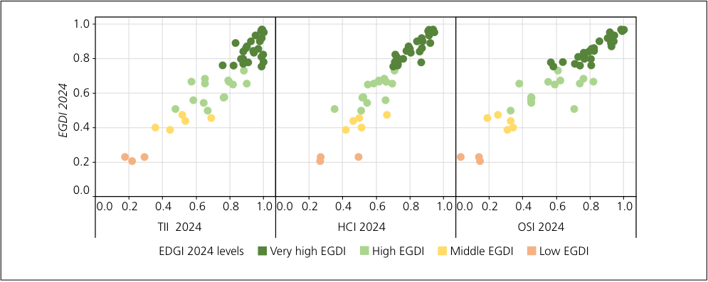

**----- Start of picture text -----** 
1.0 0.8 0.6 0.4 0.2 0.0 0.0 0.2 0.4 0.6 0.8 1.0 0.0 0.2 0.4 0.6 0.8 1.0 0.0 0.2 0.4 0.6 0.8 1.0 TII  2024 HCI 2024 OSI 2024 EDGI 2024 levels Very high EGDI High EGDI Middle EGDI Low EGDI EGDI 2024 **----- End of picture text -----** 

## Digital divide between high-income and low-income countries 

While high-income countries such as the Republic of Korea, Singapore and Saudi Arabia have made great strides in digital development, many low-income countries continue to face challenges in bridging the digital divide and ensuring equal access to digital technologies for all segments of society. Those in the latter group require ongoing regional and international support. 

115 

2024 UN E-GovErNmENt SUrvEy 

The Advancing Digital cooperation and Development – Arab States Action Programme, launched by EScWA in partnership with ITU and the league of Arab States, led to the creation of the Arab Digital Agenda 2023-2033. Adopted in 2022, the Agenda features 35 strategic goals across five key priorities: infrastructure, governance, economy, society, and culture, aiming to accelerate progress towards the SDGs through digital development. 

EScWA organizes annual meetings of Arab e-government programme directors to foster dialogue and share best practices. The eleventh meeting, held in Dubai in February 2024, focused on managing digital government programmes and addressing national challenges. Additionally, EScWA spearheads the Arab Digital Inclusion Platform, enhancing digital accessibility for individuals with disabilities and the elderly. 

From 2022 to 2024, EScWA supported member states in developing digital transformation strategies, engagement policies, and quality frameworks, including efforts in the Syrian Arab Republic and the State of Palestine. capacity-building activities focused on digital technologies, accessibility, open data, and IcT indicators. The ENAcT project, launched in 2023, aims to accelerate digital innovation and enhance public sector operations in the Arab world, aligning with SDG 16 to strengthen public institutions. 

Going forward, EScWA plans to support the digitalization of a wider range of government services, particularly in Arab countries with early-stage digital maturity, by sharing best practices and implementing a twinning approach for efficient fund deployment. 

EScAP is actively involved in supporting digital development in Asia. During its seventy-ninth session, in May 2023, EScAP endorsed the Action Plan for the Implementation of the Asia-Pacific Information Superhighway (2022-2026) to bridge the digital divide and accelerate digital transformation. This initiative aims to enhance digital connectivity, technologies and data across the region through coordinated action. The Action Plan is built around three pillars: connectivity for all, digital technologies and applications, and digital data. It includes 25 interrelated actions linked to the SDGs and the outcomes of the World Summit on the Information Society. To implement the Plan, the AsiaPacific Information Superhighway Steering committee set up three working groups, each headed by one chair or two co-chairs and up to three vice-chairs from various countries (see table 3.5). During the same session, EScAP adopted resolution 79/10, which promotes digital cooperation and inclusion through the Action Plan. As called for in the resolution, a ministerial conference on digital inclusion and transformation has been organized and will be held in Astana in early September 2024 to promote the accelerated implementation of the SDGs and regional technology initiatives in the region. During the seventh session of the Asia-Pacific Information Superhighway Steering committee, held in Armenia in November 2023, priorities for regional cooperation on digital inclusion and transformation were further discussed. 

Table 3.5 Leadership of working groups linked to the three pillars of the Action Plan for the Implementation of the Asia-Pacific Information Superhighway (2022-2026) 

|Action Plan for the Implementation of the Asia-Pacifc Information Superhighway (2022-2026)|Working group for pillar 1: connectivity for all|Working group for pillar 2: digital technologies and applications|Working group for pillar 3: digital data|
|---|---|---|---|
|chairs|• Armenia • United States of America|• Azerbaijan • India|• Kazakhstan • Republic of Korea|
|Vice-chairs|• Kazakhstan • Sri Lanka • Uzbekistan|• Armenia • China • Russian Federation|• Armenia • Philippines • Sri Lanka|

116 

Chapter 3 • regional e-government Development anD the performanCe of Country groupings 

The Action Plan aims to bridge the digital divide and accelerate digital transformation in the Asia-Pacific region through regional cooperation, improved digital infrastructure, and inclusive development. Investments in international digital connectivity, such as undersea fiber-optic cables and cross-border links, foster economic collaboration and information flow. Enhancing digital skills and awareness through educational programs strengthens digital literacy and removes access barriers. These actions catalyze economic growth, digitalize industries, foster innovation, increase productivity, and create opportunities for businesses, especially micro-, small, and medium-sized enterprises, driving sustainable and equitable growth across the region (see Box 3.8). 

Box 3.8 Empowering small businesses in Bangladesh through policy experimentation and innovative sandboxing 

In Bangladesh, where cottage, micro-, small, and medium-sized enterprises (cMSMEs) form a significant part of the economy, accessing finance and digital services remains a serious challenge.  As part of the UN DESA initiative Frontier Technology Policy Experimentation and Digital Sandboxes for Sustainable Development, the Smart Business Profile Platform has been introduced as a data aggregation platform for cMSMEs that links all their business documents through a unique identifier, simplifies loan application and disbursement processes, and facilitates access to other digital services. This innovative digital solution promotes financial inclusion and economic growth. It supports the Sustainable Development Goals relating to decent work and economic growth (SDG 8), industry innovation and resilient infrastructure (SDG 9), and the empowerment of effective, inclusive and accountable institutions (SDG 16). By empowering cMSMEs through improved access to finance and collaborative partnerships (SDG 17), the project aligns with the country’s sustainable development objectives and paves the way for a more inclusive and prosperous future. 

_Source_ : EScAP, Frontier Technology Policy Experimentation and Digital Sandboxes for Sustainable Development, 19 February 2024, available at https://www.unescap.org/sites/default/d8fles/event-documents/BANGlADESH%20FINAl%20--%20Frontier%20 Technology%20Policy%20Experimentation%20and%20Digital%20Sandboxes%20for%20Sustainable%20Development.pdf. 

## Addressing digital disparities within countries 

A significant challenge in Asia is the digital divide within large countries, where urban centres enjoy advanced digital infrastructure and services, while rural and remote areas lack access to reliable Internet, digital skills training, and affordable devices. This disparity hinders economic growth, social development, and exacerbates inequalities. To address this digital divide, targeted policy interventions are needed to expand digital infrastructure in underserved areas, promote digital literacy and skills training for marginalized populations, and foster public-private partnerships for inclusive digital development. By overcoming these challenges, countries in Asia can fully leverage digital technologies to drive sustainable and equitable growth. 

India exemplifies these challenges but has proactively sought to address them. The Digital India programme aims to transform the country into a digitally empowered society and knowledge economy by enhancing digital infrastructure, literacy, and government services via digital platforms. However, digital transformation in India faces obstacles due to varying development levels across its States. cities such as Bengaluru, Mumbai, and Hyderabad lead in digital innovation, benefiting from substantial IcT infrastructure investments, high digital literacy, and robust digital governance frameworks. These regions have implemented advanced e-government services and smart city initiatives, supported by a thriving technology ecosystem. In contrast, many rural areas lag in digital development due to limited IcT infrastructure investment, lower digital literacy, and limited 

117 

2024 UN E-GovErNmENt SUrvEy 

awareness of digital transformation. The Government of India is working to bridge these gaps through initiatives such as BharatNet, which aims to provide high-speed Internet to rural areas, and programmes focusing on digital skill development and the promotion of digital services nationwide. 

Strengthening digital inclusion across Asia: building an equitable digital landscape 

large countries in Asia making significant progress in digital government must address the differing levels of development across their States, provinces, and territories. Targeted efforts include allocating additional budgets for digital development, providing targeted technological, organizational, and human resources support, and initiating cross-border initiatives. International cooperation is crucial for supporting underdeveloped areas. These efforts will help strengthen digital inclusion and ensure that all regions benefit from digital transformation. 

Focusing on building digital literacy and capacity in rural and less developed areas, adopting best practices from more digitally advanced areas, and encouraging public-private partnerships to enhance digital infrastructure are essential steps. By doing so, countries can create a more equitable digital landscape, enabling all citizens to access high-quality e-government services and participate fully in the digital economy. 

## **3.7 Europe: country grouping analysis** 

Europe has established itself as a global leader in digital government transformation, with the majority of the region’s countries falling into the very high EGDI group (see table 3.6). This achievement highlights Europe’s role in setting global benchmarks for e-government, consistently boasting the highest average EGDI, HcI, and TII values. Since the inception of the E-Government Survey, Europe has topped global charts, showcasing the most advanced and homogeneous e-government development. 

Among the 36 European countries in the very high EGDI group, 26 European Union members, (as cyprus, is in this survey part of the Asian region), are represented. Notably, Denmark, Estonia, Iceland, the United Kingdom, Finland, the Netherlands, Germany, Sweden, Norway, and Spain are in the highest (VH) rating class, with Germany, Norway, and Spain achieving this for the first time. Twelve countries are in the V3 rating class, nine in the V2 class, and five in the V1 class, reflecting varying levels of advancement. 

Albania and the Republic of Moldova have moved from the high to the very high EGDI group, marking significant progress in digital development. Despite this, Europe’s digital landscape is not entirely uniform. Seven countries—Belarus, Montenegro, Monaco, North Macedonia, Andorra, San Marino, and Bosnia and Herzegovina—are in the high EGDI group, indicating areas needing improvement in services provision and human capital development. 

The consistently strong performance of Europe in digital government transformation is a testament to its commitment to leveraging technology for enhanced governance and public services delivery. The region serves as a model for other parts of the world, demonstrating the impact of strategic investments in IcT infrastructure, digital literacy, and innovative public services. 

The full list of European countries and their respective EGDI classifications can be found in section 12 of the Technical Appendix. 

118 

Chapter 3 • regional e-government Development anD the performanCe of Country groupings 

Table 3.6 Countries leading e-government development in Europe 

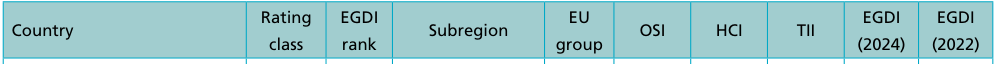

**----- Start of picture text -----** 
Rating  EGDI  EU  EGDI  EGDI Country Subregion OSI HCI TII class rank group (2024) (2022) **----- End of picture text -----** 

|Country|Rating class|EGDI rank|Subregion|EU group|OSI|HCI|TII|EGDI (2024)|EGDI (2022)|
|---|---|---|---|---|---|---|---|---|---|
|||||||||||
|Denmark|VH|1|Northern Europe|Yes|0.9992|0.9584|0.9966|0.9847|0.9717|
|Estonia|VH|2|Northern Europe|Yes|0.9954|0.9497|0.9731|0.9727|0.9393|
|Iceland|VH|5|Northern Europe|No|0.9076|0.9953|0.9983|0.9671|0.9410|
|United Kingdom of Great Britain and Northern Ireland|VH|7|Northern Europe|No|0.9535|0.9450|0.9747|0.9577|0.9138|
|Finland|VH|9|Northern Europe|Yes|0.9097|0.9836|0.9791|0.9575|0.9533|
|Netherlands (Kingdom of the)|VH|10|Western Europe|Yes|0.9212|0.9688|0.9715|0.9538|0.9384|
|Germany|VH|12|Western Europe|Yes|0.9238|0.9672|0.9236|0.9382|0.8770|
|Sweden|VH|14|Northern Europe|Yes|0.8836|0.9275|0.9868|0.9326|0.9410|
|Norway|VH|15|Northern Europe|No|0.9117|0.9175|0.9654|0.9315|0.8879|
|Spain|VH|17|Southern Europe|Yes|0.9054|0.8961|0.9603|0.9206|0.8842|
|Ireland|V3|20|Northern Europe|Yes|0.8768|0.9046|0.9599|0.9138|0.8567|
|lithuania|V3|21|Northern Europe|Yes|0.8839|0.8861|0.9631|0.9110|0.8745|
|Austria|V3|22|Western Europe|Yes|0.8383|0.9003|0.9810|0.9065|0.8801|
|Switzerland|V3|26|Western Europe|No|0.8408|0.9026|0.9576|0.9003|0.8752|
|Malta|V3|28|Southern Europe|Yes|0.8749|0.8162|0.9747|0.8886|0.8943|
|latvia|V3|29|Northern Europe|Yes|0.8092|0.8805|0.9660|0.8852|0.8599|
|Ukraine|V3|30|Eastern Europe|No|0.9854|0.8240|0.8428|0.8841|0.8029|
|croatia|V3|32|Southern Europe|Yes|0.8735|0.8538|0.9180|0.8818|0.8106|
|Slovenia|V3|33|Southern Europe|Yes|0.8640|0.8530|0.9107|0.8759|0.8781|
|France|V3|34|Western Europe|Yes|0.8440|0.8565|0.9228|0.8744|0.8832|
|Greece|V3|36|Southern Europe|Yes|0.8145|0.9219|0.8657|0.8674|0.8455|
|Poland|V3|37|Eastern Europe|Yes|0.8037|0.8304|0.9603|0.8648|0.8437|
|Serbia|V2|39|Southern Europe|No|0.8540|0.8094|0.9221|0.8618|0.8237|
|Russian Federation|V2|43|Eastern Europe|No|0.7766|0.8319|0.9512|0.8532|0.8162|
|liechtenstein|V2|44|Western Europe|No|0.7416|0.8263|0.9906|0.8528|0.8685|
|luxembourg|V2|45|Western Europe|Yes|0.7555|0.7955|0.9888|0.8466|0.8675|
|Portugal|V2|49|Southern Europe|Yes|0.7878|0.8389|0.8979|0.8415|0.8273|
|Italy|V2|51|Southern Europe|Yes|0.7624|0.8426|0.9017|0.8356|0.8375|
|czechia|V2|54|Eastern Europe|Yes|0.7006|0.8508|0.9204|0.8239|0.8088|
|Bulgaria|V2|55|Eastern Europe|Yes|0.7727|0.7538|0.9171|0.8145|0.7766|
|Belgium|V2|56|Western Europe|Yes|0.7224|0.8442|0.8698|0.8121|0.8269|
|Hungary|V1|59|Eastern Europe|Yes|0.7144|0.8703|0.8282|0.8043|0.7827|
|Slovakia|V1|60|Eastern Europe|Yes|0.7097|0.7982|0.8985|0.8021|0.8008|
|Albania*|V1|62|Southern Europe|No|0.8144|0.8106|0.7750|0.8000|0.7413|
|Republic of Moldova*|V1|70|Eastern Europe|No|0.7264|0.7776|0.8118|0.7719|0.7251|
|Romania|V1|72|Eastern Europe|Yes|0.6548|0.7439|0.8922|0.7636|0.7619|

_Note_ : An asterisk denotes countries that have moved up from the high to the very high EGDI group in 2024. 

119 

2024 UN E-GovErNmENt SUrvEy 

## **3.7.1 Regional development and cooperation** 

Europe has maintained its position as a global leader in technological advancement and digital governance, as reflected in the homogeneous level of digital development across the region (see figure 3.8). 

To understand the success of the European region, one cannot overlook the pivotal role played by the European Union and its executive arm, the European commission. Their comprehensive strategies, substantial investments, and collaborative initiatives have not only advanced digital transformation among European Union members but have also acted as catalysts for digital progress in non-member European countries. Their efforts have contributed significantly to positioning Europe as a global leader in digital innovation, ensuring that all of its citizens can benefit from the opportunities created by digital transformation. 

Figure 3.8 Distribution of EGDI values relative to TII, HCI and OSI values for Europe, 2024 

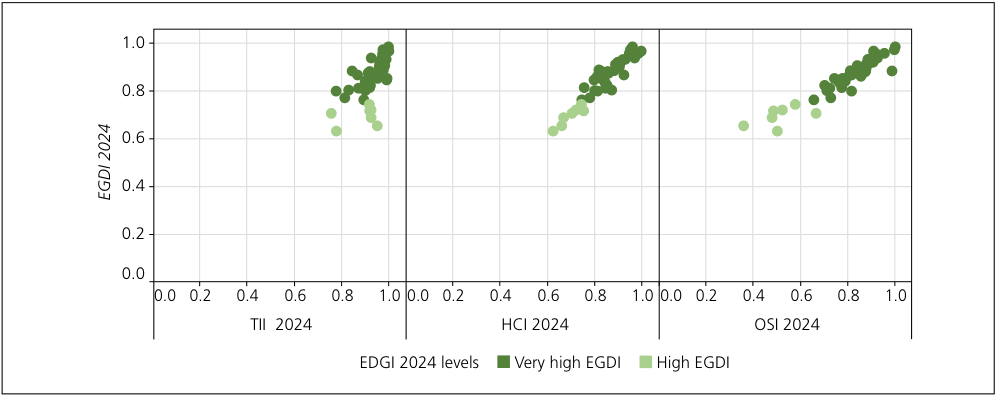

**----- Start of picture text -----** 
1.0 0.8 0.6 0.4 0.2 0.0 0.0 0.2 0.4 0.6 0.8 1.0 0.0 0.2 0.4 0.6 0.8 1.0 0.0 0.2 0.4 0.6 0.8 1.0 TII  2024 HCI 2024 OSI 2024 EDGI 2024 levels Very high EGDI High EGDI EGDI 2024 **----- End of picture text -----** 

The European Union and European Commission have not only set ambitious goals for digital transformation within the individual member countries but have also contributed to the creation of a comprehensive digital ecosystem that benefits the region as a whole. Top performers such as Denmark, Estonia, Finland, the Kingdom of the Netherlands, Germany, Sweden and Spain have been particularly committed to the adoption and implementation of the European commission digital strategy and have made effective use of the European budget for national and cross-border digital initiatives. Their efforts showcase the importance of strategic national alignment and investment in driving successful digital transformation. Through their actions, these countries have exemplified how robust digital policies and investments can significantly enhance e-government services and infrastructure while simultaneously setting a benchmark for other nations to follow. 

The digital strategy of the European commission is anchored in several key initiatives aimed at creating a cohesive digital single market, fostering innovation, and ensuring digital inclusion. The Digital Single Market (DSM) strategy, launched in 2015, is a cornerstone of the digital agenda for the European Union.[29] It aims to remove digital barriers and create a unified market for digital goods and services across member countries. The strategy encompasses a broad array of policies linked to priorities such as digital infrastructure, e-commerce, data protection and cybersecurity. One of the most notable achievements under the DSM strategy is the General Data Protection Regulation,[30] which has set a global standard for data privacy and protection. By ensuring stringent data protection standards, the Regulation has not only safeguarded the privacy of European 

120 

Chapter 3 • regional e-government Development anD the performanCe of Country groupings 

residents but also boosted trust in digital services by fostering a more secure digital environment. The European Union has also made substantial investments in digital infrastructure through initiatives such as the connecting Europe Facility.[31] The Facility has funded projects to enhance high-speed broadband connectivity, cross-border digital services, and digital public services. By improving digital infrastructure, the European Union has provided increased access to digital services and supported the growth of the digital economy. 

The European commission has been instrumental in promoting research and innovation through programmes such as Horizon 2020 and its successor, Horizon Europe.[32] These programmes have provided substantial funding for digital research and development, supporting projects in areas such as AI, blockchain and cybersecurity. They have not only driven technological advancements within the European Union but have also positioned Europe as a leader in digital innovation on the global stage. 

The year 2020 marked the emergence of cOVID-19 and its rapid escalation into a pandemic that had a profound impact on digital development worldwide. Governments had to quickly reorient resources towards the full digitalization of administrative work and public services delivery. This sudden shift revealed limitations in data protection and existing organizational structures, even in the European Union. 

The Berlin Declaration on Digital Society and Value-Based Digital Government was adopted on 8 December 2020.[33] This European Union ministerial declaration advances the technical principles outlined in the 2017 Tallinn Declaration on eGovernment. It emphasizes respect for fundamental rights, democratic values, social participation, and digital inclusion as the cornerstones of a resilient and sustainable European digital society. The Berlin Declaration establishes principles for citizen empowerment and digital literacy, placing trust, security, digital sovereignty, interoperability and human-centred development at the core of digital government transformation. The Declaration builds on previous work carried out by the Joint Research centre of the European commission highlighting the importance of data ownership, digital sovereignty, and the need to reframe public sector innovation. 

In 2021, the European Union digital strategy was enriched by the 2030 Digital compass: the European Way for the Digital Decade, which articulated goals for the European Union over a 10-year period. The Digital compass emphasized the need to build cyber resilience in response to the effects of the cOVID-19 pandemic and to accelerate the adoption of emerging technologies while also protecting citizens from negative risks and consequences. 

legislation linked to the implementation of the European strategy for data presented in February 2020 includes the Data Governance Act and the Data Act, which respectively entered into force in June 2022 and January 2024, as well as the Digital Services Act and Digital Markets Act, both of which came into force in November 2022. The latter two have been complemented by the European Union Artificial Intelligence Act, adopted by the European Parliament in March 2024. The Artificial Intelligence Act proposes a risk-based approach to AI use (aligned with the “AI package” presented by the European commission in 2021) that has sparked an international debate on the need for a global digital governance framework which positions the norms, institutions and standards that shape the development and use of digital technologies as opportunities for achieving the SDGs. 

To further accelerate the deployment and use of digital technologies across the economy and society, the European Union launched the Digital Europe Programme.[34] This dedicated Programme aims to bridge the gap between digital technology research and market deployment and bring “digital technology to businesses, citizens and public administrations”.[35] The Digital Europe Programme further supports the twin European Union objectives of promoting green transition and digital transformation while simultaneously strengthening resilience and digital sovereignty. 

121 

2024 UN E-GovErNmENt SUrvEy 

Among the key actions promoted by the Digital Europe Programme is the creation of a trusted digital government ecosystem across the European Union. This initiative involves adopting and utilizing key digital technologies, deploying a network of European digital innovation hubs, and reinforcing European blockchain capacities. The Interoperable Europe Act, adopted by the council of the European Union in March 2024, aims to enhance cooperation between public administrations in the European Union, improve the take-up of interoperable digital government solutions, and foster a government technology (govtech) market and ecosystem. 

A broad initiative known as common European Data Spaces is currently being rolled out to unleash the potential of data-driven innovation. The establishment of common data spaces in multiple fields and sectors is expected to enhance the development of new data-driven products and services that constitute the core of an interconnected and competitive European data economy. The aforementioned European strategy for data outlines the creation of these data spaces in strategic fields such as health, agriculture, manufacturing, energy, and public administration. 

At the same time, Europe is increasingly investing in the space economy, recognizing the key contributions of space technologies and geospatial data to digital transformation and the role they play in driving innovation, enhancing connectivity, and supporting the development of advanced digital services (see box 3.9). 

Box 3.9 Space Economy Evolution Laboratory at the SDA Bocconi School of Management 

The Space Economy Evolution laboratory (SEE lab) at the SDA Bocconi School of Management is a premier research centre that recognizes the strategic significance of the space economy and is committed to leveraging its potential. Focusing on both academic and applied research, the SEE lab offers cross-cutting insights that benefit members, partners and public institutions. The SEE lab advocates for government investment in space activities and the development of integrated strategies involving the industrial sector. Governments play a pivotal role not only as financiers but also as enablers and facilitators of sectoral development. Under favourable conditions, they can act as technology developers, anchor customers, and catalysts for public-private partnerships. Space-based technologies are vital, impacting over 50 per cent of the Sustainable Development Goals and driving global socioeconomic progress and geopolitical stability. 

A cornerstone asset of the SEE lab is the innovative SEEData data set, which addresses the need for precise and standardized information in the space economy. SEEData includes comprehensive economic and financial metrics, investment data, and macroeconomic indicators for nations engaged in the space industry. These exclusive data enable the SEE lab to perform thorough analyses and deliver strategic insights. Through its pioneering research and commitment to excellence in space economy education, the SEE lab plays a crucial role in shaping future innovations and maintaining a secure and sustainable digital environment in outer space. The laboratory’s work contributes significantly to national and international space economy strategies, fostering cooperation and development. 

_Source_ : SDA Bocconi School of Management, “SEE lab”, available at https://www.sdabocconi.it/en/faculty-research/research/ technology-innovation-and-transition-knowledge-platform/see-lab. 

Strengthening governance mechanisms is an essential part of a coordinated digital government strategy. The Interoperable Europe Act[36] is a key component of the political commitment made by European Union countries to strengthen cross-border interoperability and cooperation in the public sector across the EU. This law enables public administrations across Europe to cooperate more easily and productively, saving residents and businesses time and money, promoting innovation, and facilitating the exchange of skills and knowledge. The European Union has implemented various projects and strategies to improve digital skills and thereby strengthen the digital economy. As outlined in the Digital Decade policy programme advanced by the European commission, these efforts address the impact of digital transformation on the labour market and aim to have 20 million IcT professionals in place by 2030. 

122 

Chapter 3 • regional e-government Development anD the performanCe of Country groupings 

Top-performing countries in the European Union, such as Denmark, Estonia, Finland, the Netherlands, Germany, Sweden, and Spain, have embedded the principles promoted by European commission into their national development strategies. By effectively utilizing both national and European funding for digital initiatives, they have demonstrated the critical role that strategic alignment and targeted investment play in achieving digital excellence. 

Denmark for example, has been proactive in advancing its digital government strategy, focusing on creating comprehensive digital portals for citizens, businesses, and health services through platforms like borger.dk, virk.dk, and sundhed.dk, while fostering citizen engagement via initiatives like borgerforslag.dk. Its National Digital Strategy (2022-2025) emphasizes cross-sector collaboration, integrating public, private, and civil society efforts. Denmark’s National cyber and Information Security Strategy (2022-2024) focuses on strengthening cybersecurity resilience. The country also incorporates sustainability into public procurement and explores AI, robotics, and 5G infrastructure to enhance public services and promote green transitions. These efforts underscore Denmark’s commitment to a secure, inclusive, and sustainable digital future. 

Estonia continues to solidify its global leadership in digital government through a robust infrastructure and forward-thinking initiatives. The country emphasizes the importance of proactive services, ensuring digital accessibility and inclusion across all demographic groups by 2030. Estonia has developed a comprehensive digital identity system, enabling seamless online access to public services. With a focus on data-driven governance, the country is also a pioneer in integrating AI, cybersecurity, and next-generation technologies such as 5G. Estonia’s national strategy aligns closely with the SDGs and European Union digital strategies, fostering international cooperation and innovation in public service delivery. 

Digital development leaders that are not members of the European Union include the United 

Kingdom, Iceland and Norway. 

Prior to its departure from the European Union (Brexit) in 2020, the United Kingdom played a key role in digital development in Europe, benefiting from collaborative efforts within the European Union and contributing significantly to the region’s technological advancements. Post-Brexit, the UK continues its digital transformation independently, driven by key government bodies like the Government Digital Service (GDS) and the Department for Science, Innovation, and Technology (DSIT). These institutions (recently GDS merged into DSIT) enhance public services’ efficiency, accessibility, and innovation. 

The UK has established a robust legal framework supporting digital government, including the Data Protection Act 2018 (aligning with GDPR), the Digital Economy Act 2017, the National Data Strategy, and the Data Sharing Governance Framework. These laws promote data privacy, open data, and interoperability across government agencies, fostering a resilient and inclusive digital government. 

GOV.UK serves as a single portal for government information and services, simplifying and streamlining public service provision, ensuring ease of use and consistency across departments. The Petitions website allows public participation in government consultations, promoting transparency and citizen involvement. Adhering to the International Open Data charter principles, the UK promotes open data by default, focusing on quality, usability, and innovation. 

The UK is developing a secure digital identity framework, including the Digital Identity and Attributes Trust Framework. cybersecurity is supported by laws like the computer Misuse Act 1990, the Security of Network & Information Systems Regulations 2018, and the Data Protection Act 2018, ensuring data protection and secure online transactions. 

Public contracts Regulations 2015 ensure transparency and fair competition in procurement processes. The UK’s digital strategies also support emergency response, demonstrated by the agile digital response during the cOVID-19 pandemic. 

123 

2024 UN E-GovErNmENt SUrvEy 

Departments like Education, Health and Social care, and Work and Pensions implement digital strategies tailored to their specific domains, supported by overarching frameworks to ensure alignment and effective digital transformation. 

The UK’s National AI Strategy promotes AI development and regulation, integrating technologies like 5G, IoT, and blockchain into public services and the wider economy, maintaining the UK’s technological leadership. Established in 2021, the central Digital and Data Office oversees digital transformation across the government, sets cross-government digital strategies, manages performance, and ensures the delivery of digital initiatives, maintaining a user-centric approach to digital government. 

The GDS International Team, established in 2016, collaborates with overseas governments and multilateral organizations to support digital transformation and public administration reforms, contributing to shaping international norms and standards in digital government. 

The United Kingdom actively participates in shaping international norms and standards relating to digital government, contributing to best practice repositories and defining good practices through collaborations with multilateral organizations (see box 3.10). To facilitate these efforts, the United Kingdom established the GDS International Team in 2016. The Team proactively collaborates with overseas Governments and multilateral organizations to support digital transformation and public administration reforms. 

Box 3.10 The engagement of the United Kingdom in global leadership and collaboration in digital government transformation 

Through the Government Digital Service and the central Digital and Data Office, the United Kingdom actively participates in 20 multilateral and minilateral groups and forums focused on digital data and technology development in government. These groups include Digital Nations (of which the United Kingdom is a founding member), the Digital Government Exchange (hosted by GovTech Singapore), and OEcD E-leaders (officially referred to as the Organisation of Economic co-operation and Development Working Party for Senior Government Officials). The United Kingdom also engages in OEcD thematic groups on open government data and digital democracy and has participated in the World Bank cloud computing Working Group and Interoperability Working Group, ultimately earning recognition from the World Bank as a partner in the GovTech Global Partnership. 

The reputation of the United Kingdom as a leader in digital government attracts numerous inquiries and delegations interested in its digital transformation journey. The GDS International Team manages the country’s responses to global digital government surveys, ensuring accurate representation in United Nations and OEcD rankings. The Team coordinates the International Design in Government community, established in 2017, and facilitates collaboration among thousands of international colleagues. 

The United Kingdom is a founding member of Agile Nations, which promotes regulatory cooperation to facilitate innovation while also protecting citizens and the environment. The Foreign, commonwealth and Development Office (FcDO) leads on international development policy and official development assistance to support digital transformation in partner countries through initiatives such as the World Bank Identification for Development programme and the Digital Impact Alliance. The Digital Access Programme, funded by FcDO and the Department for Digital, culture, Media and Sport, partners with the International Telecommunication Union to enhance digital inclusion and capacity in partner countries. FcDO is also in charge of preparing the country’s digital development inputs into submissions for the United Nations Global Digital compact, emphasizing inclusive and sustainable digital transformation for global development. 

_Source_ : United Kingdom, Government Digital Service, available at https://www.gov.uk/government/organisations/governmentdigital-service. 

124 

Chapter 3 • regional e-government Development anD the performanCe of Country groupings 

Thanks to its robust digital infrastructure, comprehensive e-government strategies, and commitment to digital inclusion, Iceland has become a leader in digital innovation and public service delivery. The centralized portal Ísland.is provides secure access to personal information and a variety of self-service tools and applications. Digital Iceland, operated by the Ministry of Finance and Economic Affairs, drives digital transformation and oversees e-government services.[37] 

Digital Iceland’s key initiatives include the Digital Mailbox, My Pages, Straumurinn (X-Road), and the Ísland.is mobile app. My Pages is a user-friendly platform offering secure access to various public services, authentication, digital power of attorney, and a digital inbox, all integrated with Electronic ID and organized around key life events. Straumurinn, developed with Estonia and Finland, is a secure data transfer layer that ensures data security, integrity, and interoperability between government agencies. The Ísland.is mobile app provides direct access to government services, featuring a digital mailbox, digital identification, notifications, application status monitoring, and secure digital identity login.[38] These services aim to make digital interaction the primary means through which government agencies and citizens communicate and engage in public sector transactions. 

Iceland has proactively developed technological expertise by adopting best practices from other nations and building its own cloud-based, open-source technology framework.[39] The Government supports digital innovation in education and other sectors through competitive grants and subsidies. This strategic approach has made Iceland a model for other nations seeking to enhance their e-government frameworks. 

Norway’s impressive digital government development is driven by its comprehensive digital strategy, robust infrastructure, effective governance, and commitment to innovation and inclusion. The “One Digital Public Sector: Digital Strategy for the Public Sector 2019-2025” outlines the national IcT policy, focusing on enhancing productivity and efficiency through digitalization. Key priorities include leveraging IcT for innovation, strengthening digital competence and inclusion, ensuring robust data protection, and promoting effective public sector digitalization. 

Norway has high rates of Internet access and daily utilization, with notable progress in digitalizing public services. Digital platforms like the eID Gateway and Altinn are widely used. The Norwegian Digitalization Agency supports digital projects through co-financing schemes, focusing on expanding the digital economy, developing the digital regulatory framework, facilitating data-driven innovation, and building digital competencies. 

To meet future data processing requirements, Norway is investing in research, innovation, and digital competencies, particularly in AI and emerging technologies. In 2024, Norway allocated around €90 million to accelerate digital and AI transformation, with 12% dedicated to researching emerging technologies and their societal impacts. Key research areas include optimizing digitalization in business and the public sector, utilizing AI across industries, and assessing AI’s long-term implications on trust, democracy, ethics, privacy, education, arts, culture, economy, and law. 

Despite the ongoing conflict with the Russian Federation, Ukraine has made impressive progress in digital development. The Government moved all public data assets and services to public cloud platforms abroad, ensuring the safety and accessibility of critical information and digital resilience. Satellite connections have maintained uninterrupted Internet connectivity. 

Public-private partnerships have been crucial in the country’s digital transformation. collaborations with major digital providers such as Microsoft, Amazon Web Services, SpaceX and Palantir Technologies have enabled Ukraine to leverage cutting-edge technology and infrastructure. These partnerships also support reconstruction efforts, such as developing AI solutions for landmine clearance and prosecuting war crimes.[40] Ukraine’s strategic approach safeguards digital assets and supports economic activities and public services amidst the conflict, positioning the country as a resilient and forward-thinking digital leader. 

125 

2024 UN E-GovErNmENt SUrvEy 

## **3.7.2 Key recommendations for accelerating digital development in Europe** 

Importance of international cooperation and cross-border collaboration, especially outside the European Union 

A strategic approach emphasizing international cooperation, cross-border collaboration, and digital inclusion is essential for accelerating digital development across Europe, especially in countries outside the European Union. 

International cooperation and engagement in cross-border digital initiatives can enhance connectivity and interoperability between neighboring countries. Establishing robust frameworks for international collaboration can facilitate knowledge-sharing and participation in joint digital development projects. Forming partnerships with European Union countries can enable non-members to leverage their experience and expertise in digital transformation. coordinated cross-border initiatives can streamline regulations, reduce barriers, and ensure seamless digital services across borders. 

## Strengthening digital public infrastructure 

Strengthening digital public infrastructure is another key area of focus. Priority should be given to expanding high-speed broadband infrastructure, particularly in rural and underserved areas. Investing in reliable and affordable Internet access is crucial to ensure that all citizens can participate in the digital economy. The accelerated deployment of 5G networks will support rapid advancements in digital services and innovations in various sectors, including health care, education, and industry. 

Promoting sustainable digital development involves integrating environmental sustainability into the digital transformation process. Ensuring that the expansion of digital infrastructure does not adversely impact the environment is crucial for long-term sustainability. 

Governments need to prioritize investments in digital infrastructure in rural districts, areas not considered profitable by the private sector. Engaging local communities in planning and implementing digital initiatives will ensure that these areas’ specific needs are met. Public-private partnerships can be leveraged to mobilize resources and expertise for rural digitalization projects. 

## Enhancing cybersecurity and data protection 

Strengthening cybersecurity and data protection at the regional level is essential. Implementing robust cybersecurity frameworks and data protection regulations will safeguard individuals’ and businesses’ data and build trust in digital services. Aligning national cybersecurity measures with international standards will help establish a cohesive and secure digital ecosystem. 

## Targeted assistance for specific countries 

For countries such as Belarus, Montenegro, North Macedonia, and Bosnia and Herzegovina, targeted assistance is crucial. Aligning their policies with EU digital standards will facilitate smoother digital integration and cooperation. Investing in capacity-building programs can enhance the skills of public officials and private sector stakeholders, ensuring effective implementation and management of digital projects. 

## Addressing digital inequality within and among European countries 

As highlighted in Our common Agenda, a visionary report of the Secretary-General of the United Nations,[41] digital inequality is emerging as a significant global challenge that requires urgent attention. While Europe is relatively advanced in technology development, it is not immune to the digital divide. As emphasized in the Road map for digital cooperation, another report of the Secretary-General, “digital divides reflect and amplify existing social, cultural, and economic inequalities”.[42] Our common Agenda cites the gender gap in Internet use and mentions other groups affected by digital 

126 

Chapter 3 • regional e-government Development anD the performanCe of Country groupings 

divides, including migrants, refugees, older persons, young people, persons with disabilities, rural populations, and Indigenous Peoples. Addressing these divides is essential to prevent the emergence of a “digital Berlin Wall” that separates the world into digital haves and have-nots. 

Targeted programs must be developed to improve digital connectivity in underserved areas and address urban-rural disparities in digital access and opportunities. Inclusive policies must be formulated to facilitate digital inclusion for all populations, ensuring marginalized and vulnerable groups are not left behind in the digital transformation process. 

Global efforts to create digital public goods, such as open-source software and open data, are crucial for achieving the SDGs. Universal connectivity by 2030 is a necessity, as is implementing robust digital literacy programs to empower users to understand digital platforms, manage their data, and combat misinformation. comprehensive digital literacy programs must target all segments of the population, with a special focus on vulnerable groups such as the elderly, low-income families, and people with disabilities. Providing subsidies or incentives for acquiring digital devices and tools will ensure all residents can engage in digital activities. Establishing innovation hubs and technology incubators will help foster local talent development and support the growth of startups and small businesses in the digital sector. Monitoring and evaluating digital inclusion initiatives are essential to ensure continuous improvement and adaptation to changing needs. 

## Digital inclusion by design: ensuring comprehensive digital inclusion 

The E-Government Survey 2022 introduced the concept of digital inclusion by design[43] highlighting its importance as a key principle and policy goal for ensuring no one is left behind in a hybrid digital society where electronic technologies and human interactions coexist and should be complementary. Governments must ensure that technological and e-government advancements serve sustainable human development and inclusion. Digital services should complement rather than replace human interaction, and policy decisions should remain human-driven to ensure accountability in e-government. 

Activating digital-inclusion-by-design and leaving-no-one-behind strategies requires that inclusive policy choices be made before digitalization to ensure these approaches are successful and do not “remain in the realm of rhetoric.” Digital inclusion by design should be the foundation and starting point for all digital transformation efforts and technology-related planning and decision-making. 

By focusing on these strategic recommendations, European countries both within and outside the European Union can accelerate digital development and build inclusive, resilient and sustainable digital societies. 

## **3.8 Oceania: country grouping analysis** 

Australia and New Zealand are the leaders in digital development in Oceania; positioned in the very high EGDI group and VH rating class, they rank among the top countries in the world. This achievement is attributed to their advanced digital government services, robust infrastructure, and advanced digital skills. In the high EGDI group are Fiji, Vanuatu, Tonga, and Palau, which have demonstrated significant progress in strengthening their digital government capabilities. The strides made by Vanuatu have been particularly impressive; this island nation graduated from lDc status in 2020 and has moved from the middle to the high EGDI group in 2024. Eight of the region’s fourteen countries fall into the middle EGDI category, reflecting steady growth in digital integration despite various challenges. 

Excluding Australia and New Zealand, the region’s countries have an average EGDI value of 0.4600 – less than half the EGDI values of the regional frontrunners and substantially lower than the global average of 0.6344. These 12 countries are all SIDS, and three of them (Kiribati, Solomon Islands, and Tuvalu) are also lDcs. 

127 

2024 UN E-GovErNmENt SUrvEy 

Table 3.7 presents the key 2024 Survey results for all countries in Oceania. 

Table 3.7 

E-government development in Oceania, 2024 

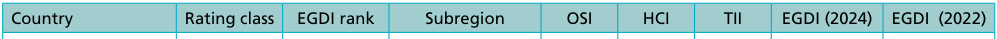

**----- Start of picture text -----** 
Country Rating class EGDI rank Subregion OSI HCI TII EGDI (2024) EGDI  (2022) **----- End of picture text -----** 

|Country|Rating class|EGDI rank|Subregion|OSI|HCI|TII|EGDI (2024)|EGDI  (2022)|
|---|---|---|---|---|---|---|---|---|
||||||||||
|Australia|VH|8|Australia and New Zealand|0.9222|1.0000|0.9509|0.9577|0.9405|
|New Zealand|VH|16|Australia and New Zealand|0.9453|0.9615|0.8728|0.9265|0.9432|
|Fiji|H3|93|Melanesia|0.5343|0.7413|0.7507|0.6754|0.6235|
|Vanuatu*|H1|129|Melanesia|0.4769|0.5347|0.6165|0.5427|0.4988|
|Tonga|H1|134|Polynesia|0.3220|0.7488|0.4784|0.5164|0.5155|
|Palau|H1|137|Micronesia|0.2787|0.7520|0.4910|0.5072|0.5018|
|Samoa|MH|140|Polynesia|0.3638|0.6453|0.4606|0.4899|0.4207|
|Marshall Islands|MH|143|Micronesia|0.3586|0.7836|0.3047|0.4823|0.3714|
|Kiribati|MH|147|Micronesia|0.3904|0.6269|0.3544|0.4572|0.4334|
|Nauru|M3|151|Micronesia|0.2439|0.5061|0.5863|0.4454|0.4548|
|Tuvalu|M3|158|Polynesia|0.1944|0.5463|0.4720|0.4042|0.3788|
|Solomon Islands|M2|164|Melanesia|0.4970|0.4262|0.1811|0.3681|0.3530|
|Micronesia (Federated States of)|M2|167|Micronesia|0.2621|0.5735|0.1350|0.3235|0.3550|
|Papua New Guinea|M1|171|Melanesia|0.3392|0.3984|0.1851|0.3076|0.3230|

_Note_ : Italicized countries are the digital leaders in Oceania. An asterisk denotes countries that have moved up from the middle to the high EGDI group in 2024. 

## **3.8.1 Regional development and cooperation** 

The Oceania region showcases vast diversity in terms of digital development. At one end, Australia and New Zealand stand out as top leaders in digital transformation, boasting very high EGDI values. In contrast, the other countries in the region, nearly all of which are Small Island Developing States (SIDS), continue to lag behind in digital development and their relative subcomponents. This disparity showed in figure 3.9 highlights the challenges and opportunities within Oceania’s digital landscape. 

## Figure 3.9 Distribution of EGDI values relative to TII, HCI and OSI values for Oceania, 2024 

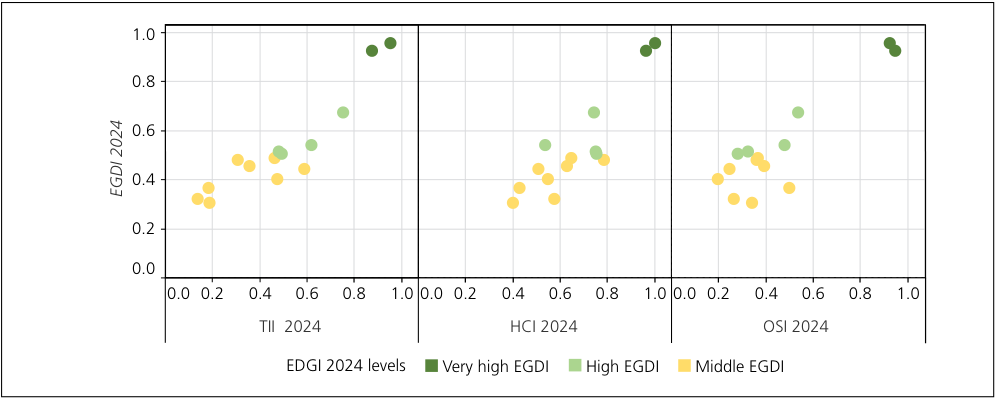

**----- Start of picture text -----** 
1.0 0.8 0.6 0.4 0.2 0.0 0.0 0.2 0.4 0.6 0.8 1.0 0.0 0.2 0.4 0.6 0.8 1.0 0.0 0.2 0.4 0.6 0.8 1.0 TII  2024 HCI 2024 OSI 2024 EDGI 2024 levels Very high EGDI High EGDI Middle EGDI EGDI 2024 **----- End of picture text -----** 

128 

Chapter 3 • regional e-government Development anD the performanCe of Country groupings 

In Australia, a strategic approach, robust infrastructure, and a strong commitment to inclusion and accessibility have driven impressive digital development. Effective coordination between government agencies, substantial investments, and comprehensive strategies and legal frameworks have positioned Australia as a leader in digital government and innovation. 

The Digital Transformation Agency (DTA) leads these efforts, providing forward-looking policy leadership on government technology investments and digital service delivery. The DTA is responsible for establishing and monitoring government strategies, policies, and standards for digital and IcT development, ensuring a strategic, coordinated approach to digital transformation across federal, state, and territory levels. Key initiatives include the Data and Digital Government Strategy and the updated Digital Service Standard, which aim to improve the efficiency and user-friendliness of digital services. The myGov platform allows Australian residents to access a wide range of digital government services through a single, secure portal. In 2023, myGov supported more than 25 million accounts, demonstrating its critical role in the national digital landscape. The platform has facilitated the provision of essential services during natural disasters and public health emergencies, including the cOVID-19 pandemic, showcasing the government’s ability to adapt to emerging realities and activate a digitally driven crisis response. 

Australia’s digital government capabilities have been recognized internationally, with the country ranking fifth out of 38 in the 2023 OEcD Digital Government Index. This high ranking reflects Australia’s strengths in digital project evaluation, collaborative strategy development, service design, cybersecurity, and digital workforce development. 

The government prioritizes digital inclusion and accessibility, ensuring all citizens, including those in rural and remote areas, benefit from digital services. The Digital Inclusion Blueprint for Western Australia and various accessibility standards form part of this commitment. 

Digitalization efforts in Australia are supported by substantial government funding. The Federal Budget 2024-25 allocates $1.7 billion over ten years for investments in innovation, scientific research and development, and strengthening digital capabilities. Additional funding is earmarked for the expansion of the Digital ID system, responsible AI development, and regulatory updates to combat online fraud and enhance consumer protections. 

Australia’s comprehensive legal and regulatory framework supports digital transformation, including laws on data privacy, cybersecurity, digital identity, and electronic transactions. The Data Availability and Transparency Act 2022 addresses open government data and interoperability across agencies. 

New Zealand, ranked among the top 20 countries globally in the very high EGDI group, stands as a world leader in digital development alongside Australia. The country has streamlined digital service delivery through integrated platforms like RealMe, which simplifies administrative processes with a single login. The Government’s comprehensive digital strategy focuses on building trust, improving digital literacy, and fostering innovation. Initiatives such as the Digital Inclusion Blueprint ensure all residents can participate in and benefit from the digital economy. 

The Digital Public Service branch of the Department of Internal Affairs (Te Tari Taiwhenua) supports digital transformation, enhancing efficiency and service provision. Integrated services like SmartStart provide a single gateway to information for parents and caregivers, while Te Hokinga ā Wairua (End of life Service) and Whetūrangatia offer support for families experiencing the death of a baby or child. 

Aligned with the Digital Strategy for Aotearoa, New Zealand aims to create an inclusive and accessible digital society, strengthening digital skills, improving connectivity, and facilitating inclusion for all residents, especially underrepresented groups. The Data and Statistics Act 2022 supports a wellfunctioning data system while ensuring privacy and security. These initiatives underscore New Zealand’s commitment to digital excellence and its proactive approach to leveraging technology for societal benefit. 

129 

2024 UN E-GovErNmENt SUrvEy 

Several SIDS in Oceania, despite facing unique challenges, have made notable progress in digital development. Fiji, Vanuatu, Tonga, and Palau have moved into the high EGDI group, reflecting significant advancements in e-government. limited resources, geographic isolation, and vulnerability to natural disasters present ongoing challenges, but these nations are steadily improving their digital government services, particularly in terms of accessibility and efficiency. Strengthening digital infrastructure and enhancing digital literacy remain essential for sustained growth. 

International cooperation and support, including financial resources, technical assistance, and capacity-building programs, have been crucial for these nations. collaborations with organizations like the Pacific Islands Forum and partnerships with developed nations have helped address digital gaps. EScAP has played a significant role, collaborating with subregional partners to assist Fiji and Samoa, with support from New Zealand, in fortifying Internet traffic management through the adoption of a Pacific Internet exchange point (Pacific-IXP). IXPs have proven effective in reducing operational costs, promoting local traffic use, diminishing latency, enhancing efficiency, and improving the stability and resilience of local networks. These efforts highlight the importance of regional cooperation in building robust and efficient digital infrastructures. 

Many SIDS in the region remain in the middle EGDI group, indicating a need for ongoing development support. The Pacific Islands Digital Ecosystem country Assessment, released by USAID in April 2024,[44] examines the digital ecosystems of 12 Pacific Island countries, including the Federated States of Micronesia, Fiji, Kiribati, Nauru, Palau, Papua New Guinea, the Marshall Islands, Samoa, the Solomon Islands, Tonga, Tuvalu and Vanuatu. This Assessment is part of the USAID Digital Strategy 2020-2024, which “seeks to achieve and sustain open, secure and inclusive digital ecosystems that contribute to broad-based, measurable development and humanitarian assistance outcomes”.[45] The Assessment highlights significant advancements and challenges in the digital landscapes of these countries and is informed by the USAID 2022-2027 Strategic Framework for the Pacific Islands, which focuses on community resilience, resilient economic growth, and strengthened democratic governance. While highlighting progress in the development of connectivity infrastructure, the report also notes that advancements in first- and middle-mile connectivity across the Pacific Islands, last-mile connectivity, and resilience remain significant challenges, and that emerging technologies present opportunities to address existing gaps. 

The Assessment notes that while e-commerce and digital platforms offer new opportunities for businesses and consumers, the potential benefits of digital trade are not being fully realized owing to infrastructure constraints. Digital financial services are seen as transformative for inclusion and economic growth, but there is presently a supply-and-demand imbalance in the digital talent pool due to outmigration. With the limited success of imported incubator and accelerator models, the technology startup ecosystem has exhibited restrained growth. 

The Assessment emphasizes affordability, digital literacy, and locally relevant content as critical to bridging the mobile usage gap and mitigating digital divides, especially for marginalized and vulnerable communities. It also highlights the constraints in digital media development, the need for comprehensive legal frameworks to protect human rights online, and the importance of regulations governing data privacy and freedom of information. Despite these challenges, civil society efforts to combat corruption and fragmented initiatives to advance Internet governance are emerging. Digital government systems and cybersecurity policies are in early stages of development. 

International cooperation and cross-border initiatives are vital for securing technological, financial, and infrastructural support. Strengthening digital inclusion ensures that all segments of the population, including the most vulnerable, have access to digital services. Embedding inclusiveness in all digital initiatives from the outset, as highlighted in the digital-inclusion-by-design approach, is imperative. 

130 

Chapter 3 • regional e-government Development anD the performanCe of Country groupings 

SIDS should focus on building robust digital infrastructures, investing in digital literacy programs, and fostering public-private partnerships. Establishing secure and resilient digital environments will help mitigate the impact of cyberattacks and natural disasters. Efforts to narrow digital divides and promote inclusive digital transformation will be pivotal in advancing the countries of Oceania towards achieving the SDGs. 

## **3.8.2 Key recommendations for accelerating digital development in Oceania** 

## Strengthening regional cooperation and international partnerships 

Accelerating digital development in Oceania requires a comprehensive approach focused on strengthening regional cooperation, infrastructure investment, digital inclusion, cybersecurity, and innovation. Targeted support for SIDS is essential. 

Bolstering regional cooperation and international partnerships is crucial. countries in Oceania should utilize platforms such as the Pacific Islands Forum to pool resources, exchange best practices, and collaborate on achieving shared digital goals. Enhanced cooperation with international bodies such as the United Nations, the World Bank, and ITU will increase access to technical assistance, financial support, and capacity-building programs. This collaboration is particularly important for SIDS, which face unique challenges due to their size and geographic isolation. By leveraging international support and adopting innovative solutions, SIDS can tackle their unique challenges and achieve sustainable digital growth. 

Investing in digital infrastructure is essential for robust digital development. Expanding high-speed broadband connectivity to rural, remote, and underserved areas is a priority. Governments should focus on building resilient infrastructure capable of withstanding natural disasters. Public-private partnerships can play a pivotal role in these efforts by facilitating access to cutting-edge technologies and expertise from leading global digital providers. Investments should lay the foundation for developing a comprehensive digital ecosystem, fostering economic growth, and improving public services delivery. 

## Improving E-government services 

Improving e-government services is a critical component of digital development. Governments in Oceania should work towards providing seamless, user-friendly digital services that enhance citizen engagement and streamline administrative processes. Developing integrated service delivery platforms, ensuring the interoperability of government systems, and adopting a citizen-centric approach to service design are essential steps. Simplifying regulatory procedures and reducing bureaucratic barriers are also needed to make it easier for citizens and businesses to interact with the Government. 

Addressing challenges in rural and remote areas is vital for balanced digital growth. Governments should implement targeted initiatives to ensure that these areas and their residents are not left behind. Providing subsidies for Internet access, deploying satellite technology for connectivity, and supporting community-based digital literacy programs represent effective strategies. These efforts should be adapted to meet the unique needs of rural and remote populations, including those in SIDS. 

## Ensuring digital Inclusion and equity 

Ensuring digital inclusion and equity makes it possible for all members of society, including the most vulnerable, to benefit from digital advancements. Policies and programs should aim to close the digital divide by addressing the needs of marginalized groups such as women, youth, the elderly, persons with disabilities, and Indigenous communities. Initiatives should focus on providing 

131 

2024 UN E-GovErNmENt SUrvEy 

affordable access to digital devices and Internet services, strengthening digital literacy, and creating inclusive digital platforms that cater to diverse needs. Digital inclusion by design should be a guiding principle in these efforts. 

## Strengthening cybersecurity and data protection 

Strengthening cybersecurity and data protection is becoming increasingly critical as digital services expand. countries in Oceania must develop robust legal and regulatory frameworks to safeguard digital assets and personal information. Measures should include implementing national cybersecurity strategies, establishing data protection laws, and promoting best practices for secure digital transactions. collaboration with international cybersecurity organizations can help build local capacities and enhance resilience against cyber threats. 

## Fostering innovation and digital skills 

Innovation and digital skills development are key drivers of digital transformation. countries in Oceania should foster an environment that encourages technological innovation and entrepreneurship by providing targeted funding for research and development, offering tax incentives for technology startups, and establishing innovation hubs. Educational programs should be set up to equip the workforce with the digital skills needed to enable both current and future generations to thrive in a digital economy. 

Accelerating digital development in Oceania requires a coordinated and inclusive approach that addresses the diverse needs of the region. By implementing these recommendations, Oceania can harness the full potential of digital technologies to drive economic growth and improve the quality of life for all. 

## Endnotes 

- 1 UNDESA-DPIDG Expert Group Meeting on the United Nations E-Government Survey 2022 and the SecretaryGeneral’s Our Common Agenda, held in Guimarães, Portugal, from 4 to 7 October 2022 during the ICEGOV conference (see https://unu.edu/egov/event/icegov-2022-15th-international-conference-theory-and-practice-electronicgovernance for Conference details). 

- 2 Expert Group Meeting on preparation of the United Nations E-Government Survey 2024 (alignment and commitment to the Sustainable Development Goals), held at United Nations Headquarters in New York on 27 and 28 February 2023 (see calendar of events at Expert Group Meeting on Preparation of the United Nations E-Government Survey 2024 > Calendar). 

- 3 Bill Clark, “The AI investment boom: impact on venture capital”, MicroVentures Blog post, 24 May 2024, available at https://microventures.com/the-ai-investment-boom-impact-on-venture-capital#_ftnref3. 4 African Union, The Digital Transformation Strategy for Africa (2020-2023) (Addis Ababa, 2020), available at https://au.int/sites/default/fles/documents/38507-doc-DTS_for_Africa_2020-2030_English.pdf. 5 United Nations, Economic Commission for Africa (ECA), “Enhancing functionality of digital ID systems: use case implementation for Kaduna States Pension Bureau”, Stories section, 21 November 2023, available at https:// www.uneca.org/stories/enhancing-functionality-of-digital-id-systems-use-case-implementation-for-kaduna-state. 

- 6 ECA, “Validation of The Gambia’s National Digital ID and Digital Transformation Strategy”, Stories section, 17 May 2024, available at https://www.uneca.org/stories/validation-of-the-gambia%E2%80%99s-national-digital-idand-digital-transformation-strategy. 

- 7 ECA, “Digital ID & interoperability“, Technical Support section, available at https://www.uneca.org/dite-for-africa/ digitial-id-%26-interoperability. 

- 8 Tony Blair Institute for Global Change, “Bridging the skills gap: strengthening digital transformation in Africa”, commentary, 5 September 2023, available at https://www.institute.global/insights/tech-and-digitalisation/bridgingthe-skills-gap-strengthening-digital-transformation-in-africa. 

- 9 International Telecommunication Union, Webinar – Connected Communities: Harnessing the Power of Digital Infrastructure, 21 May 2024, ITU Webinars / Digital Transformation Dialogues series, available at https://www.itu. int/cities/digitaltransformationdialogues/digital-public-infrastructure/#:~:text=Digital%20Public%20Infrastructure%20 (DPI)%20is,transformation%20journey%20of%20a%20country. 

132 

Chapter 3 • regional e-government Development anD the performanCe of Country groupings 

10 United States, “Transforming Federal Customer Experience and Service Delivery to Rebuild Trust in Government: progress on Agency commitments in EO 14058”, available at https://www.performance.gov/cx/executive-order/. 11 United States, Department of State, “United States International Cyberspace & Digital Policy Strategy: towards an innovative, secure, and rights-respecting digital future”, available at https://www.state.gov/united-states-internationalcyberspace-and-digital-policy-strategy/. 12 Canada, Digital Operations Strategic Plan: 2021-2024, available at https://www.canada.ca/en/government/system/ digital-government/government-canada-digital-operations-strategic-plans/digital-operations-strategic-plan-2021-2024. html. 13 Canada, Canada’s Digital Government Strategy, available at https://publications.gc.ca/collections/collection_2022/ sct-tbs/BT22-269-2021-eng.pdf. 14 - - Canada, Digital Ambition, available at https://www.canada.ca/en/government/system/digital government/government canada-digital-operations-strategic-plans.html. 15 Canada, Privy Council Office, “Beyond2020 and public service renewal”, available at privy-council/topics/blueprint-2020-public-service-renewal.html. https://www.canada.ca/en/ 16 Uruguay, Portal de Transparencia Presupuestaria, Oficina de Planeamiento y Presupuesto, available at transparenciapresupuestaria.opp.gub.uy/inicio/presupuesto-nacional. https:// 17 United Nations, Economic Commission for Latin America and the Caribbean (ECLAC), “A digital path for sustainable development in Latin America and the Caribbean”, working document (LC/CMSI.8/3) (Santiago, November 2022), pp. 64-68, available at https://conferenciaelac.cepal.org/8/en/documents/digital-path-sustainabledevelopment-latin-america-and-caribbean. 18 ECLAC, “Desde el gobierno digital hacia un gobierno inteligente” [From Digital Government to Smart Government], course held from 2 August to 13 September 2023, available at https://www.cepal.org/es/cursos/ gobierno-digital-un-gobierno-inteligente. 19 ECLAC, “Report of the workshop on measuring the digital society for digital inclusion” (LC/CAR/2023/11), available at https://repositorio.cepal.org/server/api/core/bitstreams/ae72fe9e-d210-48f4-ae70-2da5e73814ab/content. 20 ECLAC, “Improving broadband quality and affordability in the Caribbean” (LC/CAR/2023/2), available at repositorio.cepal.org/items/228b6fc6-7c22-4024-ac12-87e7f1486449. https:// 21 ECLAC, “Report of the Seminar on Positioning the Caribbean in the Knowledge Economy: the Role of Data” (LC/CAR/2023/18), available at https://repositorio.cepal.org/items/2e54344a-ec31-42b0-9bbe-778015388834. 22 Republic of Korea, Ministry of Interior and Safety, “Digital government”, available at https://dgovkorea.go.kr/. 23 Republic of Korean, Ministry of Interior and Safety, Digital Government Vision and Strategy (in Korean), available at https://www.mois.go.kr/frt/sub/a06/b04/egovVision/screen.do. 24 Japan, Cabinet Secretariat, “Dejitaru denen-toshi kokka koso kihon hoshin” [Basic Policy on the Digital Garden City Nation Initiative], 7 June 2022, available at https://www.cas.go.jp/jp/seisaku/digital_denen/pdf/20220607_honbun. pdf. 25 Xin Cong and others, “Study on the development trend of culture industry in the era of ‘Internet plus’”, _Journal of Service Science and Management_ , vol. 12 (2019), pp. 909-915, available at doi:10.4236/jssm.2019.127062. 26 United Arab Emirates, Telecommunications and Digital Government Regulatory Authority, “Federal Digital Network”, DGov page, available at https://dgov.tdra.gov.ae/en/services/federal-network. 27 - United Arab Emirates, “Guidelines to measure and increase govt digital maturity”, available at https://u.ae/en/about the-uae/uae-competitiveness/steps-to-enhance-government-performance/uae-digital-government-maturity-model. 28 United Arab Emiratse, “Full-featured design system for the country”, UAE Design System 2.0, available at https:// designsystem.gov.ae/. 29 European Commission, Directorate General for Communication, Digital Single Market publications page, 22 March 2019, available at https://commission.europa.eu/publications/digital-single-market_en. 30 European Union, Regulation (EU) 2016/679 of the European Parliament and of the Council of 27 April 2016 on the protection of natural persons with regard to the processing of personal data and on the free movement of such data, and repealing Directive 95/46/EC (General Data Protection Regulation), available at https://eur-lex. europa.eu/legal-content/EN/TXT/?uri=CELEX%3A32016R0679. 31 European Commission, Connecting Europe Facility, EU funding programmes page, available at https://commission. europa.eu/funding-tenders/fnd-funding/eu-funding-programmes/connecting-europe-facility_en. 32 European Commission, Horizon Europe, EU funding programmes page, available at https://commission.europa. eu/funding-tenders/fnd-funding/eu-funding-programmes/horizon-europe_en. 

133 

2024 UN E-GovErNmENt SUrvEy 

- 33 European Commission, “Berlin Declaration on Digital Society and Value-based Digital Government”, news article, 8 December 2020, available at https://digital-strategy.ec.europa.eu/en/news/berlin-declaration-digital-society-and-valuebased-digital-government. 

- 34 European Commission, Digital Europe Programme (DIGITAL): General Model Grant Agreement (DEP MGA – Multi & Mono), Version 1.0, 1 November 2023, available at https://ec.europa.eu/info/funding-tenders/ opportunities/docs/2021-2027/digital/agr-contr/mga_dep_en.pdf. 

- 35 European Commission, “The Digital Europe Programme”, Activities page, available at ec.europa.eu/en/activities/digital-programme. https://digital-strategy. 

- 36 European Commission, “Interoperable Europe Act Proposal” available at Interoperable Europe Act Proposal - European Commission (europa.eu) 

- 37 Iceland, “Services”, Digital Iceland ( ί sland.is app), available at https://island.is/en/o/digital-iceland/island-services. 38 Iceland, Ministry of Finance and Economic Affairs, “IT governance”, available at information-technology/it-governance/. https://www.government.is/topics/ 

- 39 Open Access Government, “How Iceland’s Government is placing people at the heart of digital public services”, digital transformation news, 14 September 2023, available at https://www.openaccessgovernment.org/how-icelandsgovernment-is-placing-people-at-the-heart-of-digital-public-services/166387/. 

- 40 Vera Bergengruen, “How tech giants turned Ukraine into an AI war lab”, _TIME_ magazine, 8 February 2024 (Kyiv), available at https://time.com/6691662/ai-ukraine-war-palantir/. 

- 41 United Nations, General Assembly, “Road map for digital cooperation: implementation of the recommendations of the High-level Panel on Digital Cooperation“, 29 May 2020 (A/74/821), available at https://documents.un.org/ doc/undoc/gen/n20/102/51/pdf/n2010251.pdf?token=aYbqFkQGBqsOVAKJnI&fe=true. 

- 42 Ibid., para. 26. 

- 43 _United Nations Charter_ , chapter IV: the General Assembly, available at https://www.un.org/en/about-us/un-charter/ chapter-4. 

- 44 United States Agency for International Development, “Pacific Islands Digital Ecosystem Country Assessment”, information article, 24 April 2024, available at https://www.usaid.gov/digital-development/pacifc-islands-deca. 

- 45 United States Agency for International Development, Digital Strategy 2020-2024, available at https://www.usaid. gov/digital-development/digital-strategy. 

134 

Chapter 4 • LoCaL e-Government DeveLopment 

## **4. Local E-Government Development** 

## **4.1 Introduction** 

## **4.1.1 Sustainable cities** 

When world leaders adopted the 2030 Agenda for Sustainable Development, they committed to “transforming our world” for people, planet and prosperity. However, despite impressive engagement around the Sustainable Development Goals (SDGs), the world is not making adequate progress towards achieving them. Much more is required in terms of effort, investment and systemic change. Digital transformation has emerged as a powerful tool in the pursuit and realization of the SDGs, as highlighted in the _Global Sustainable Development Report 2023_ .[1] 

local e-government, utilizing information and communications technology (IcT) to deliver and manage public services at the municipal level, is emerging as a powerful tool in advancing the 2030 Agenda. As local governments are the governing bodies closest to communities and are responsible for providing a wide range of essential services in areas such as housing, transportation, utilities, and public safety, their influence in driving progress for the SDGs is strong and far-reaching. Harnessing technology and digitalization, including artificial intelligence (AI), is a critical enabler of SDG localization, particularly to facilitate access to data, information, and government services using the Internet. Digitalization is also key to improving the effectiveness and accessibility of basic services for smart cities, health, and education and can play a vital role in fostering democracy and local participation.[2] With 65 per cent of SDG targets falling under local jurisdictions, localizing the Goals becomes imperative for effective implementation as highlighted in the “Inter-agency policy briefs on accelerating progress on the 2030 Agenda from local to global levels: The critical importance of SDG localization”.[3] 

Photo credit: shutterstock.com 

||In this chapter:||
|---|---|---|
||4.1 Introduction 4.1.1 Sustainable cities|135 135|
||4.1.2 city portal assessment|136|
||4.2 current status of local||
||online services|137|
||4.2.1 Methodology|137|
||4.2.2 current status of local e-government|137|
||4.3 Smart cities for sustainable||
||development|150|
||4.4 local Government Questionnaire|153|
||4.5 Application of lOSI methodology||
||in countries 4.6 Key fndings and recommendations|155 156|

Building on the foundation laid by successive assessments of city portals in United Nations E-Government Surveys since 2018, this chapter delves deeper into the transformative potential of local e-government for achieving the SDGs, with a specific focus on SDG 11 – making cities and human settlements inclusive, safe, resilient and sustainable. The chapter examines the evolution of city portals for the most populous cities in the respective 193 United Nations Member States over the past two years, utilizing data from the most recent local Online Services Index (lOSI). The Secretary-General of the United Nations states that regions and cities are needed to build resilient infrastructure, create green jobs, promote diversity, and build strong social bonds within communities as the world looks to rescue the Sustainable Development Goals.[4] This imperative underscores the critical role of local e-government initiatives in fostering effective, accountable and inclusive urban development strategies that align with the principles of the SDGs. 

135 

**Chapter 4** 

2024 UN E-GovErNmENt SUrvEy 

The future of cities will be knowledge-based, driven largely by innovation, the widespread use of new technologies, and the digitization of virtually all facets of urban life.[5] Technology holds great promise for improving urban livelihoods, but there are also risks. The digital divide remains a persistent challenge; while encouraging progress has been made, disparities in digital access are still apparent. Worldwide, 81 per cent of urban dwellers used the Internet in 2023, compared with only 50 per cent of the population in rural areas. Data from the International Telecommunication Union (ITU) indicates a narrowing gap in Internet access between urban and rural areas, particularly in developing regions. However, disparities within cities persist, necessitating targeted strategies to address them. Bridging this gap is crucial for ensuring equitable access to vital public services and fostering inclusive participation in urban governance. International standards play a vital role in bridging the digital divide by promoting interoperability, ensuring equitable access to technology, and facilitating global cooperation. 

There are several challenges beyond the digital divide that can undermine local e-government development. One of these is coordination between national and city governments on e-government initiatives. Often, there is a lack of alignment and collaboration between these levels of governance, leading to fragmented approaches and inefficiencies in the implementation of online strategies. Another critical concern is the capacity of public officials at the local level to effectively manage and oversee smart technology projects. local governments frequently face a shortage of skilled personnel capable of making informed decisions about the adoption and management of relevant technologies. This gap often leads to outsourcing to private sector entities that may not fully understand the city’s needs or priorities, potentially compromising the success and sustainability of projects. 

As cities embrace AI and smart city technologies, there is a pressing need to safeguard people’s rights, particularly with regard to privacy and security. The deployment of AI-driven systems and extensive data collection initiatives raises significant privacy concerns, necessitating robust regulations and safeguards to protect individuals. Steps should also be taken to mitigate other risks associated with technology adoption; developing and implementing legal, ethical, and operational frameworks to advance human rights in digital environments is essential. Adhering to international standards can play a crucial role in helping cities more effectively embrace AI and smart city technologies. These standards can help safeguard privacy and rights and enhance the deployment and interoperability of local e-government projects. 

Funding remains a perennial challenge for local e-government projects. Financial resource limitations often hinder the implementation of comprehensive digital strategies, leaving many cities struggling to invest adequately in the infrastructure, human capital, and innovation necessary to realize their digital ambitions. Addressing these risks requires concerted efforts from policymakers, stakeholders, and communities to ensure that technology-driven urban development is both inclusive and sustainable. 

## **4.1.2 City portal assessment** 

The ongoing evaluation of local government portals is crucial for improving e-government at the municipal level. As urbanization accelerates and more residents access the Internet, these portals need to adapt to accommodate a growing number of users. Overburdened systems causing wait times during periods of high demand can lead to frustration among residents. A well-functioning portal can enhance the liveability, workability and sustainability of a city by offering convenient access to services and strengthening the responsiveness of local government, ultimately leading to increased resident satisfaction. 

city portals serve as indispensable tools in modern urban governance, providing centralized platforms for residents to access a plethora of essential services and information. These digital gateways streamline interactions between people and local authorities, enhancing efficiency, accountability 

136 

Chapter 4 • LoCaL e-Government DeveLopment 

and inclusiveness. From 24-hour hotlines and emergency services such as vehicle towing to vital resources such as housing assistance, job listings, and access to health-care facilities, city portals cater to diverse needs within the community. They offer residents the opportunity to seamlessly navigate various aspects of city life, including practical matters such as street parking, waste disposal, permit applications, and recreational activities. By consolidating services and information into one accessible platform, city portals enhance civic engagement, streamline administrative processes, and foster a sense of community well-being. 

In addition to offering essential services and information, city portals can play a crucial role in promoting social inclusion and supporting vulnerable populations. In a number of cities, these platforms provide resources for refugee settlement and integration, offering information on settlement processes and opportunities for community engagement. Moreover, city portals serve as an avenue for residents to contribute to inclusion initiatives and support efforts to foster belonging and equality within the city. By harnessing the power of technology and information, city portals empower residents to actively participate in urban life, contribute to community well-being, and shape the future of their cities. 

The United Nations Department of Economic and Social Affairs (UN DESA) first integrated local e-government assessment in the E-Government Survey in 2018; the pilot study was limited to 40 cities evaluated on the basis of 60 indicators. In the 2020 edition, coverage expanded to 100 cities and 80 indicators. The 2022 edition featured 86 indicators and assessed the most populous city in each of the 193 United Nations Member States to ensure the most extensive population coverage possible. The present edition, featuring 95 indicators, revisits the cities assessed in 2022 after a twoyear interval. The 2024 edition thus represents the first Survey capable of providing insight into the progress of all 193 cities over time. The sections below provide a more detailed explanation of the methodology and present findings of the 2024 assessment by highlighting some city initiatives. 

## **4.2 Current status of local online services** 

## **4.2.1 Methodology** 

The 2024 edition of the local Online Services Index represents a notable advancement from its 2022 predecessor, featuring 95 indicators distributed across six distinct criteria: institutional framework (5), content provision (30), services provision (30), participation and engagement (10), e-government literacy (10), and technology (10). This expansion from the five criteria and 86 indicators of the 2022 edition reflects a deepened assessment framework; the introduction of the e-government literacy criterion emphasizes the critical role of digital literacy in engaging people with online government services. The Index now evaluates key features on government portals, mirroring global trends towards inclusive practices while still affirming the importance of technical standards and accessibility. 

While the institutional framework dimension remains consistent with its 2022 counterpart, refinements in the content provision and services provision criteria ensure a more thorough evaluation of online information and services provided by government agencies. Despite a slight reduction in the number of indicators within the technology dimension, now totaling 10, the lOSI continues to prioritize essential technical aspects such as accessibility, functionality, and alignment with standards. Overall, the 2024 lOSI represents a nuanced evolution, aligning with global trends towards greater engagement and digital inclusion, building upon the foundations laid in the 2022 edition. Indicator results for 2024 and comparisons with 2022 results have been calculated considering all the examined cities (193) and not only those that had operational websites (151). 

## **4.2.2 Current status of local e-government** 

The 2024 edition of the lOSI study is the second one to incorporate an assessment of e-government in the most populous city in each of the 193 Member States. Table 4.1 lists the cities in the very high lOSI category based on an analysis of 95 indicators (see Section 12. EGDI 2024 Datasets Table 13 

137 

2024 UN E-GovErNmENt SUrvEy 

in the Technical Appendix). Madrid and Tallinn are ranked first, providing nearly 93 per cent of the features assessed, followed by Riyadh, copenhagen, Dubai, New York city, Istanbul, Berlin, Seoul and Singapore in the top ten. It should be noted that even the cities ranked eleventh to twentieth have more than 83 per cent of the features assessed. The rankings are provided as a proxy for measuring and tracking local e-government development and show that many cities are very close to each other in terms of providing online services. 

Among the 42 cities in the very high lOSI group, 22 are in Europe, 11 are in Asia, 7 are in the Americas, and 2 are in Oceania. Notably, none of the most populated cities in African countries have attained a very high lOSI classification, consistent with findings from the 2022 edition. This pattern underscores a persistent disparity in online service maturity between regions, with European cities leading in the adoption of advanced online services infrastructure. While cities in Asia and the Americas also demonstrate strong performance in the lOSI rankings, the absence of African cities in the very high category highlights the need for targeted efforts to enhance digital government capabilities in that region. 

Table 4.1 Cities in the very high LOSI category, 2024 

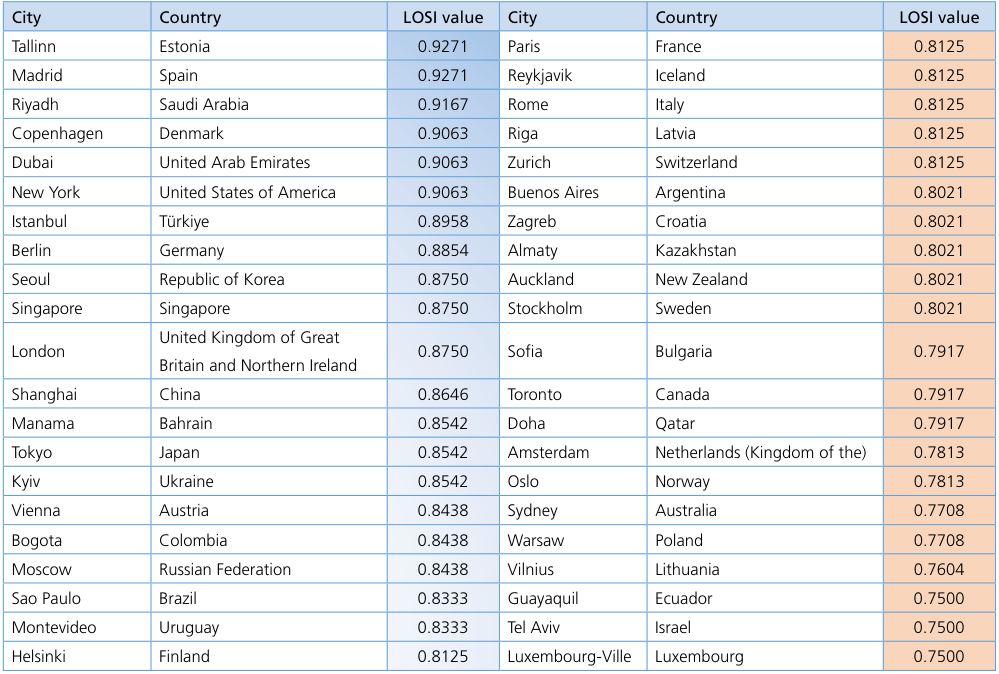

**----- Start of picture text -----** 
City Country LOSI value City Country LOSI value Tallinn Estonia 0.9271 Paris France 0.8125 Madrid Spain 0.9271 Reykjavik Iceland 0.8125 Riyadh Saudi Arabia 0.9167 Rome Italy 0.8125 copenhagen Denmark 0.9063 Riga latvia 0.8125 Dubai United Arab Emirates 0.9063 Zurich Switzerland 0.8125 New York United States of America 0.9063 Buenos Aires Argentina 0.8021 Istanbul Türkiye 0.8958 Zagreb croatia 0.8021 Berlin Germany 0.8854 Almaty Kazakhstan 0.8021 Seoul Republic of Korea 0.8750 Auckland New Zealand 0.8021 Singapore Singapore 0.8750 Stockholm Sweden 0.8021 United Kingdom of Great london 0.8750 Sofia Bulgaria 0.7917 Britain and Northern Ireland Shanghai china 0.8646 Toronto canada 0.7917 Manama Bahrain 0.8542 Doha Qatar 0.7917 Tokyo Japan 0.8542 Amsterdam Netherlands (Kingdom of the) 0.7813 Kyiv Ukraine 0.8542 Oslo Norway 0.7813 Vienna Austria 0.8438 Sydney Australia 0.7708 Bogota colombia 0.8438 Warsaw Poland 0.7708 Moscow Russian Federation 0.8438 Vilnius lithuania 0.7604 Sao Paulo Brazil 0.8333 Guayaquil Ecuador 0.7500 Montevideo Uruguay 0.8333 Tel Aviv Israel 0.7500 Helsinki Finland 0.8125 luxembourg-Ville luxembourg 0.7500 **----- End of picture text -----** 

Among the 193 cities surveyed, 151 now have an online presence, signifying a moderate uptick from the 146 city portals assessed in 2022. The 2024 assessment reveals that 42 cities lack evaluated portals, down from 47 in the previous evaluation cycle. Figure 4.1 illustrates the progress achieved in local e-government development, with the number of cities in the very high and high categories having increased from 75 in 2022 to 81 in 2024. This rise indicates higher rates of implementation of lOSI features over the past two years and improvements in government services provision. The number of cities in the middle category decreased from 45 to 40, while those in the low category increased from 26 to 30; the uptick in the latter is largely attributable to the introduction of five new city portals since the 2022 assessment. 

138 

Chapter 4 • LoCaL e-Government DeveLopment 

Figure 4.1 Comparison of LOSI levels for 2022 and 2024 _(Number of cities per category)_ 

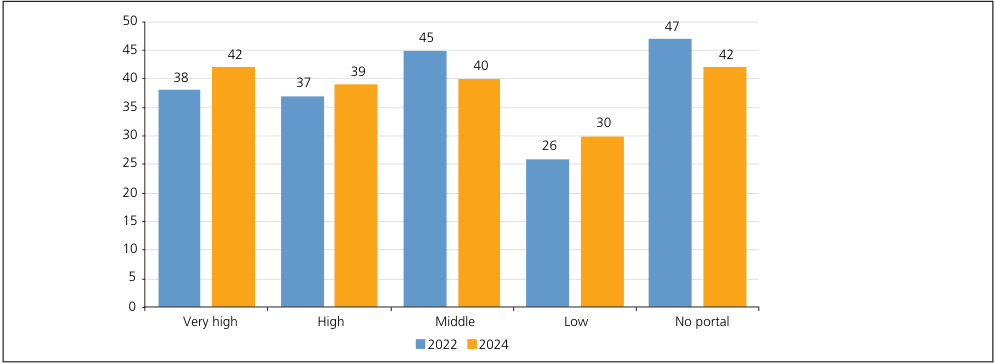

**----- Start of picture text -----** 
50 47 45 45 42 42 40 40 38 37 39 35 30 30 26 25 20 15 10 5 0 Very high High Middle Low No portal 2022 2024 **----- End of picture text -----** 

Figure 4.2 LOSI and OSI levels for 2024: convergence and divergence 

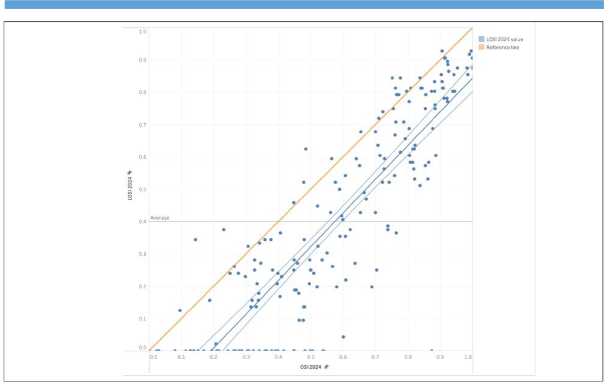

_Note_ : The line in orange is the line crossing the middle. The line in blue is the trend line (or also known as regression line) I shows how much a point change in the X axis accounts for the change in y axis. The light blue lines above and below the thick line is the confidence interval (meaning the margin of error of the prediction of the regression line). 

Figure 4.2 shows that there is a strong relationship between the lOSI and the Online Services Index (OSI) of the E-Government Development Index (EGDI). The adjusted R-squared value of 0.75 indicates that OSI values can explain about 75 per cent of the differences in lOSI values. This means that the OSI is a strong predictor of the lOSI. Most of the blue dots, representing lOSI-OSI data points, are on the right side of the yellow reference line, which indicates that national portals are performing better than city portals in terms of online services provision. 

139 

2024 UN E-GovErNmENt SUrvEy 

Table 4.2 illustrates the relationship between lOSI levels for the 151 city portals assessed and OSI levels for the respective national portals evaluated in 2024; 77 of the cities are ranked at lOSI levels that correspond to their respective national levels (green-shaded cells), while 70 cities are ranked at lOSI levels lower than their respective countries’ OSI levels (red-shaded cells). It is noteworthy that four city portals are ranked at levels higher than their countries’ OSI levels (blue-shaded cells); la Vella and Monaco city are at the high lOSI level, while their respective national portals are at the middle OSI level, and Havana and Kabul are at the middle lOSI level, while their respective country portals are at the low OSI level. All cities categorized as having a very high lOSI level also have national portals at a very high level. The findings for 2024 are consistent with those from previous Surveys, indicating that most national portals continue to perform better than city portals. 

Table 4.2 LOSI and OSI levels for 2024: convergence and divergence _(Number of cities)_ 

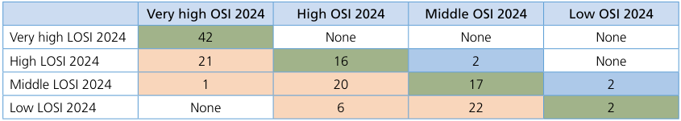

**----- Start of picture text -----** 
Very high OSI 2024 High OSI 2024 Middle OSI 2024 Low OSI 2024 Very high lOSI 2024 42 None None None High lOSI 2024 21 16 2 None Middle lOSI 2024 1 20 17 2 low lOSI 2024 None 6 22 2 **----- End of picture text -----** 

In regional terms, Europe leads with an average lOSI value of 0.803, reflecting relative uniformity in digital services delivery across its cities (see figure 4.3). Malta and San Marino lack city portal assessments; it is not uncommon for the residents of smaller countries to rely more heavily, or even exclusively, on national portals. Asia has an average lOSI value of 0.688, with significant variance indicating disparities in digital infrastructure and technological advancement. Within this region, Beirut, Pyongyang, Dili and Sana’a lack evaluated city portals. Africa and the Americas also have numerous cities without portals. In Oceania, it is no surprise that Auckland and Sydney are standout performers; however, many small island developing States (SIDS) rely on national portals, which explains the absence of assessed city portals in certain parts of the region. 

Figure 4.3 LOSI regional variations, 2024 

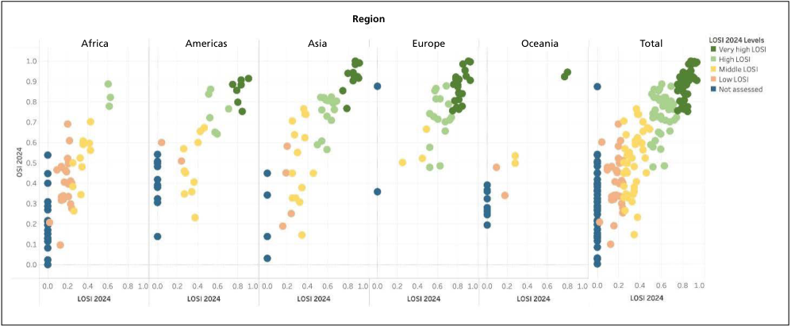

**----- Start of picture text -----** 
Region Africa Americas Asia Europe Oceania Total **----- End of picture text -----** 

140 

Chapter 4 • LoCaL e-Government DeveLopment 

## Small island developing States and other countries small in size and population 

The 37 SIDS spread across the globe face special challenges, including geographical isolation, limited resources, and heightened vulnerability to environmental and economic fluctuations. Only 15 of these countries have dedicated city portals, with the remaining 22 relying on national portals. In the lOSI 2024 rankings, Singapore excels with a value of 0.8750, and Santo Domingo and Havana are making significant progress with respective values of 0.5938 and 0.3750. Despite geographical constraints, the city of Malé in Maldives also has a lOSI value 0.3750, demonstrating resilience in terms of digital advancement. 

In SIDS and other small countries, it often makes sense for the entire population to utilize a central portal. Some of these States, including Qatar and Singapore, approached UN DESA with the preparatory survey – the local Government Questionnaire (lGQ) – and requested that the national portal be assessed in lieu of the city portal. In some cases, a city in these countries is assessed, such as la Vella in Andorra and Monaco city in Monaco. The lGQ can provide some understanding of how e-government coordination between the national and local levels works in a country, aiding in the decision of which portal to assess. By participating in the lGQ, SIDS and other relatively small countries can gain insights into their e-government practices at the local level. This participation can lead to improved e-government strategies, enhanced services delivery, and better alignment between national and local digital initiatives. UN DESA has already extended invitations through appropriate channels and is currently working with SIDS and other countries small in size and population to participate in the lGQ process to enhance the understanding and effectiveness of e-government practices at the local level. 

## The impact of population size 

For both the 2022 and 2024 Surveys, lOSI results for cities were analysed in relation to their population size. In 2024, 13 of the cities assessed were megacities with populations of 10 million or more, 19 were large cities with populations of 5 million to 10 million, 66 were medium-sized cities with populations of 1 million to 5 million, 33 had populations between 500,000 and 1 million, and 62 were urban settlements with populations of less than 500,000. The current findings are consistent with previous findings showing that cities with larger populations tend to have higher average lOSI values. A graphical representation of these trends is provided in figure 4.4, illustrating average lOSI values for various population-size categories. 

The success of large cities in achieving higher lOSI values underscores their enhanced potential for economic prosperity and employment opportunities, benefiting residents and local governments alike. Strong lOSI performance can be attributed to several factors, including the relative abundance of resources and talent in larger cities, as well as the heightened demand for online services in densely populated areas. Budgetary support is key to local e-government development; with increasing population comes greater tax revenue, facilitating investment in improved public services and infrastructure. The larger population base also provides fertile ground for the implementation of smart city initiatives, with abundant resources and diverse talent pools being leveraged to drive innovation and sustainable urban development. Harnessing the potential of population growth in urban areas can serve as a catalyst for advancing digital transformation and fostering inclusive, resilient, and sustainable cities for all residents. Addressing the digital divide between cities of different population sizes will require strategic resource allocation and ongoing digital innovation to enhance public services delivery in all types of urban environments. 

141 

2024 UN E-GovErNmENt SUrvEy 

Figure 4.4 Average LOSI 2024 values by population size 

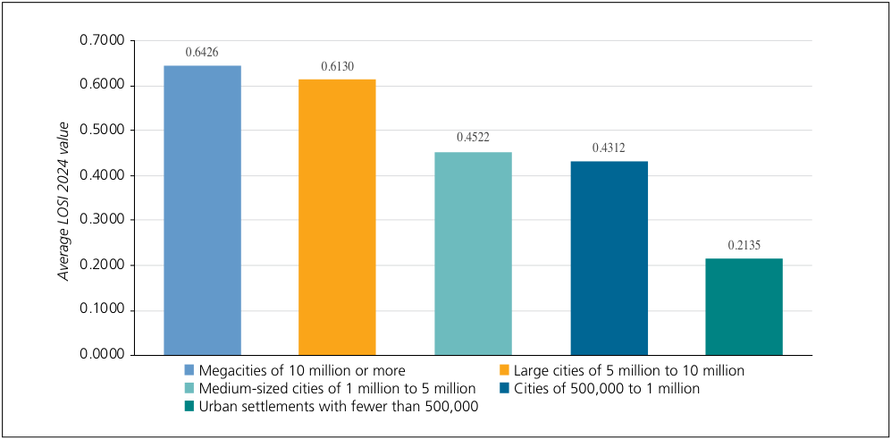

**----- Start of picture text -----** 
0.7000 0.6426 0.6130 0.6000 0.5000 0.4522 0.4312 0.4000 0.3000 0.2135 0.2000 0.1000 0.0000 Megacities of 10 million or more Large cities of 5 million to 10 million Medium-sized cities of 1 million to 5 million Cities of 500,000 to 1 million Urban settlements with fewer than 500,000 Average LOSI 2024 value **----- End of picture text -----** 

## Implementation of LOSI indicators in city portals 

The 2024 lOSI includes six distinct criteria – institutional framework, content provision, services provision, participation and engagement, e-government literacy, and technology – with a total of 95 indicators. This expanded framework embodies a comprehensive approach to assessing local online services, encompassing traditional aspects such as content and technology as well as new dimensions such as e-government literacy; the added criterion underscores the growing recognition of digital skills as essential for citizen engagement with online government services. Some new lOSI indicators have been added and others have been reorganized to achieve better alignment with OSI indicators for the 2024 Survey. 

Similar to the 2022 findings, the highest level of compliance is observed for the institutional framework criterion, with the majority of cities meeting indicators such as providing contact information and offering a clear representation of the organizational structure (see figure 4.5). The second-highest compliance rates are for the newly introduced e-government literacy criterion, which features indicators such as the availability of search features, free Internet access provisions, and the presence of privacy policies on municipal government portals. compliance with content provision indicators is also relatively high owing to the efforts made by municipalities to provide wide-ranging content centred around  local priorities such as health, environment and education; relevant indicators address the provision of information and resources related to these target areas. As in 2022, the lowest level of compliance is observed for the technology criterion due to factors relating to alignment with display, markup validation, and accessibility standards and to the lack of advanced search options in city portals. 

While many cities meet all indicators for the institutional framework criterion, Madrid, london, New York and Tokyo stand out as the only cities meeting all indicators relating to content provision. Excellent compliance rates have also been achieved by Riyadh for services provision, by Seoul for participation and engagement, and by Dubai for technology. These achievements underscore the varying degrees of success cities have in meeting the diverse requirements of local e-government. 

142 

Chapter 4 • LoCaL e-Government DeveLopment 

Figure 4.5 Implementation of LOSI indicators in city e-government portals _(Number of cities)_ 

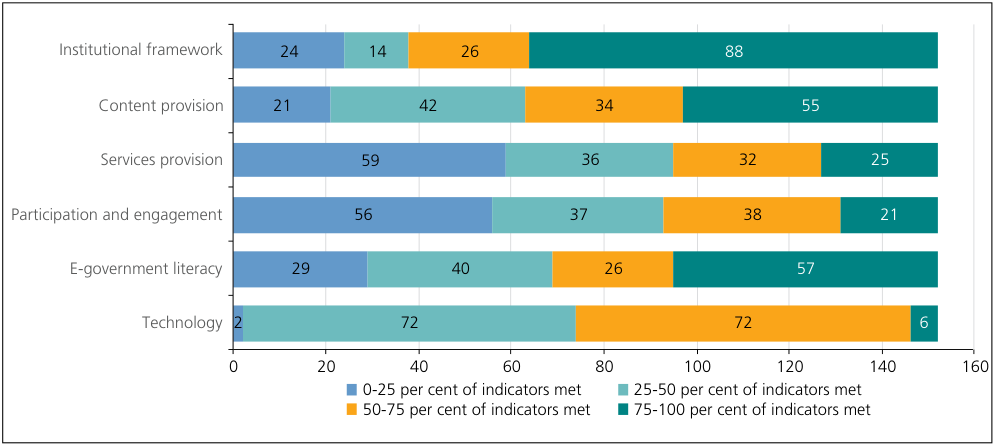

**----- Start of picture text -----** 
Institutional framework 24 14 26 88 Content provision 21 42 34 55 Services provision 59 36 32 25 Participation and engagement 56 37 38 21 E-government literacy 29 40 26 57 Technology 2 72 72 6 0 20 40 60 80 100 120 140 160 0-25 per cent of indicators met 25-50 per cent of indicators met 50-75 per cent of indicators met 75-100 per cent of indicators met **----- End of picture text -----** 

## Institutional framework 

Echoing trends observed in 2022, the institutional framework indicators most commonly met are typically those that are straightforward and easily implemented (see figure 4.6). These include providing clear information on the organizational structure of the municipality (68 per cent), offering name and contact details for department heads (62 per cent), and providing links to other government agencies (63 per cent). The 2024 lOSI also reflects marginal increases in the number of city portals that provide information on people’s right to access information and details about open data policies. Organizational structures clarify roles and responsibilities within local governments, promoting transparency and accountability. listing the names and titles of department heads makes it easier for residents to communicate directly with public officials about their concerns. links to government agencies, as seen on the Singapore Government Directory page, help residents find services quickly. Overall, these indicators are essential for effective, accountable and inclusive local governance. 

Figure 4.6 Implementation of institutional framework indicators in city portals 

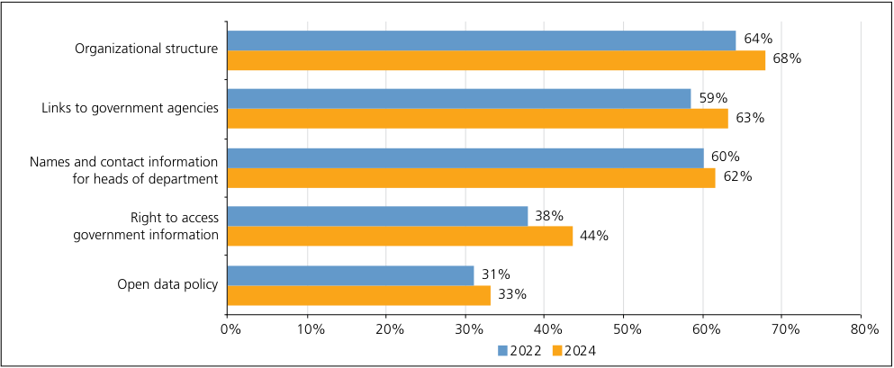

**----- Start of picture text -----** 
64% Organizational structure 68% 59% Links to government agencies 63% Names and contact information 60% for heads of department 62% Right to access 38% government information 44% 31% Open data policy 33% 0% 10% 20% 30% 40% 50% 60% 70% 80% 2022 2024 **----- End of picture text -----** 

143 

2024 UN E-GovErNmENt SUrvEy 

There is significant variability among cities in the availability of information regarding people’s right to access government information. Some cities provide comprehensive information, while others have little to no information available. Many cities reference specific laws or regulations that govern access to government information, such as acts that address freedom of information or access to information. For example, Berlin,[6] Toronto[7] and New York city[8] have legislation in place to ensure transparency and access to government information, and the relevant legal provisions can be found on the respective city portals. Providing government information directly on the website and listing outside sources from which additional information may be obtained can reduce user requests for information and are considered good practice. New York city, for instance, provides access to government reports and data through various platforms; these include the NYc Government Publications Portal for reports and publications issued by city agencies (accessible through the official nyc.gov website), the NYc Open Data portal for open data sets, and NYc311 for neighbourhood information and request-status checks. Several cities, including Guayaquil,[9] lima[10] and Panama city,[11] have dedicated transparency portals or sections on their websites where people can access government information. The Organic law on Transparency and Access to Public Information in Guayaquil obliges all public sector institutions to disseminate minimum updated information of a mandatory nature through the institutional website. In some cases, cities do not provide information on the right to access government information directly on their websites but provide links to national sources or legislation. While some cities, such as Toronto, charge a minimal fee for processing government information requests, most cities offer this service at no cost to consumers. 

## _Content provision_ 

Figure 4.7 shows rates of compliance with content provision indicators for specific sectors in 2022 and 2024. The lOSI 2024 content criterion results reveal a clear trend: a growing number of city portals are prioritizing information that addresses residents’ most pressing needs. Health-related information remains prominent, likely due to ongoing public health concerns. The increase from 55 to 61 per cent in the availability of environment-related content is indicative of a growing emphasis on sustainability and the role of cities in achieving the SDGs. The provision of social welfare and education information has changed little from 2022. However, the availability of employment information has increased from 39 to 46 per cent and justice-related information from 38 to 46 per cent. These trends reaffirm the commitment of city portals to cater to the diverse needs of residents, aligning with municipal strategies aimed at enhancing engagement and empowerment. Significant progress has been made in content provision, but there is still room for growth; not even two thirds of the city portals assessed provide health or environmental information, just over half offer social welfare and education information, and even fewer give users access to information relating to the employment and justice sectors. 

The 30 content provision indicators assessed cover a wide spectrum. They range from addressing everyday needs, such as providing information on services offered and contact details, to ensuring accessibility and assistance provision through features such as help desk support and information relevant to vulnerable groups. Some content indicators focus on advancing sustainability efforts through the provision of data on environmental matters, air pollution policies, road safety information, and emergency preparedness initiatives. The lOSI also evaluates the integration of the latest technologies into governance practices, including the provision of open data, indications of smart city initiatives, and the use of emergent technologies. The transparency and accountability of government procurement processes are examined as well. 

Figure 4.8 highlights essential indicators within the “addressing everyday needs” category. The 2024 lOSI findings are similar to those for 2022, showing that most assessed portals provide crucial features such as municipality contact details, general municipality information, and details about available online services. However, information tailored to vulnerable groups is available in only half 

144 

Chapter 4 • LoCaL e-Government DeveLopment 

Figure 4.7 Implementation of content provision indicators in city portals: sectoral information 

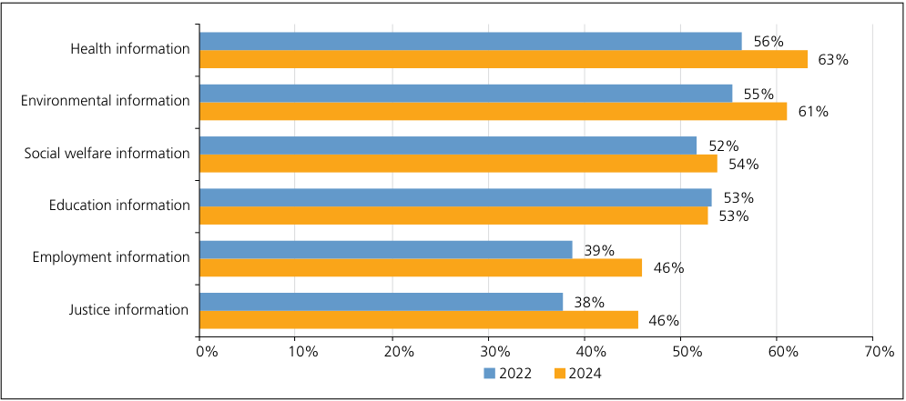

**----- Start of picture text -----** 
56% Health information 63% 55% Environmental information 61% 52% Social welfare information 54% 53% Education information 53% 39% Employment information 46% 38% Justice information 46% 0% 10% 20% 30% 40% 50% 60% 70% 2022 2024 **----- End of picture text -----** 

of the assessed portals, signaling an area in need of improvement. The availability of municipality budget information has improved but remains suboptimal at just under 58 per cent. More than two thirds of the city portals assessed now provide access to sports and cultural information and resources. The Government of Singapore[12] offers a range of online services to support immigrants, fostering community integration and cultural acclimatization. The portal includes resources such as Your _Neighbourly Welcome Guide_ , which offers new residents insights into local culture and encourages community bonding by sharing stories from established residents. The suite of available programmes includes home visits, community learning activities, and the Singapore citizenship Journey, culminating in a formal citizenship ceremony. Additionally, the portal features forums for residents to share opinions and facilitates annual meetings, allowing new immigrants to actively contribute to and benefit from community activities. 

Figure 4.8 Implementation of content provision indicators in city portals: addressing everyday needs 

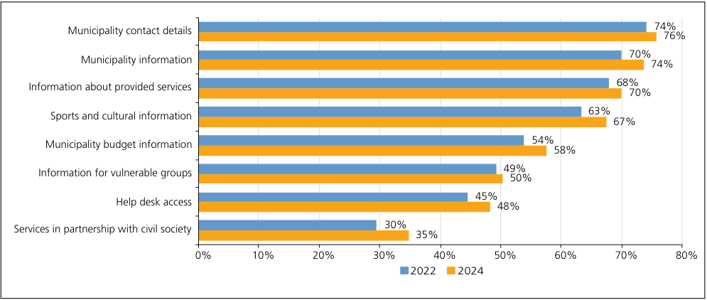

**----- Start of picture text -----** 
Municipality contact details 74%76% 70% Municipality information 74% Information about provided services 68%70% Sports and cultural information 63% 67% Municipality budget information 54%58% Information for vulnerable groups 49%50% 45% Help desk access 48% Services in partnership with civil society 30% 35% 0% 10% 20% 30% 40% 50% 60% 70% 80% 2022 2024 **----- End of picture text -----** 

145 

2024 UN E-GovErNmENt SUrvEy 

The 2024 analysis related to public procurement reveals that 59 per cent of the city portals assessed share procurement announcements – a notable increase from 53 per cent in 2022. There has been a more modest rise, from 40 to 42 per cent, in the publication of procurement results. The adoption of e-procurement platforms has seen significant growth, rising from 36 per cent in 2022 to 42 per cent in 2024. Those cities that utilize national portals are awarded a point here as long as they link to a procurement portal with clear guidelines. For example, the Dublin city portal, in its Doing Business with the council section,[13] clearly explains public procurement guidelines and provides a link to the national portal (etenders.gov.ie). conversely, the Tokyo e-procurement portal[14] serves as a centralized platform for managing procurement processes electronically, facilitating transparent and efficient procurement activities for the city’s government agencies and vendors. 

Figure 4.9 Procurement information on city portals 

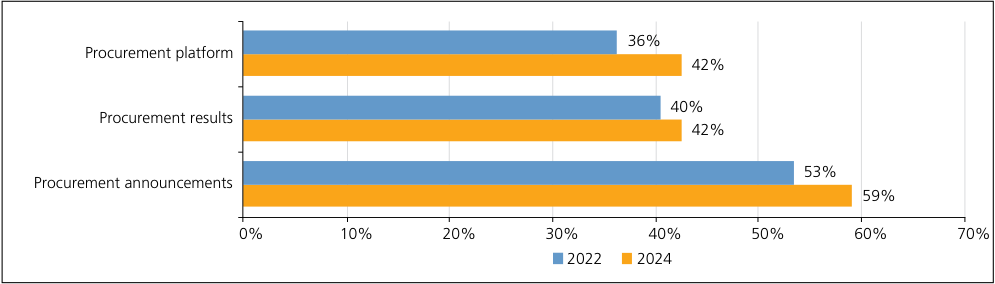

**----- Start of picture text -----** 
36% Procurement platform 42% 40% Procurement results 42% 53% Procurement announcements 59% 0% 10% 20% 30% 40% 50% 60% 70% 2022 2024 **----- End of picture text -----** 

## _Services provision_ 

Although services provision continues to have the lowest level of compliance among the six criteria assessed (see figure 4.5), the data reveal a notable increase in the availability of online services since 2022, with several indicators showing improvement (see figure 4.10). Among the most frequently met indicators are those relating to waste and recycling information and public transportation services, followed by online payment options for fines, utility bills and services. 

It is encouraging to see the increased presence of waste and recycling information on city portals, as this signals a growing commitment to environmental sustainability and the involvement of residents in waste management efforts. cities recognize the importance of offering people access to resources on waste reduction, recycling and reuse to encourage environmentally friendly behaviours and promote widespread engagement in tackling environmental challenges. These trends are promising and have the potential to contribute meaningfully to environmental sustainability. The Berlin city portal[15] offers comprehensive guidance on waste management and disposal in the city, providing information on bulky waste disposal, clothing donations, e-waste recycling, and household waste segregation. Through its portal, the city government emphasizes the importance of environmental responsibility, offering information on recycling centres, donation organizations, and pollutant collection points to facilitate proper disposal practices and promote sustainability within the community. 

146 

Chapter 4 • LoCaL e-Government DeveLopment 

The availability of public transportation information and services on city portals reflects a commitment to enhancing urban mobility and reducing traffic congestion. cities recognize the importance of providing residents with convenient access to public transportation timetables, route maps, fare information, and payment options. By offering these services online, cities aim to improve the overall efficiency and accessibility of public transportation systems, encourage the use of sustainable transportation modes, and reduce reliance on private vehicles. 

Figure 4.10 Implementation of services provision indicators in city portals 

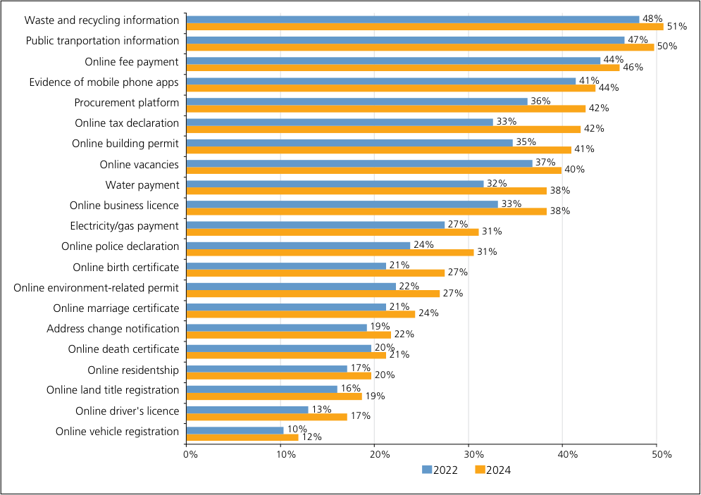

**----- Start of picture text -----** 
Waste and recycling information 48% 51% Public tranportation information 47% 50% Online fee payment 44%46% Evidence of mobile phone apps 41%44% Procurement platform 36% 42% Online tax declaration 33% 42% Online building permit 35% 41% Online vacancies 37% 40% Water payment 32% 38% Online business licence 33% 38% Electricity/gas payment 27% 31% Online police declaration 24% 31% Online birth certificate 21% 27% Online environment-related permit 22% 27% Online marriage certificate 21% 24% Address change notification 19% 22% Online death certificate 20%21% Online residentship 17% 20% Online land title registration 16% 19% Online driver's licence 13% 17% Online vehicle registration 10%12% 0% 10% 20% 30% 40% 50% 2022 2024 **----- End of picture text -----** 

## _Participation and engagement_ 

As illustrated in figure 4.11, compliance rates for most of the lOSI participation and engagement indicators increased between 2022 and 2024. There has been notable progress made in feedback/ complaint submission, information on the public meetings of the municipal council, and participatory budgeting. Other indicators, such as e-voting, reporting incidents in public spaces, participatory land use planning, online deliberation processes, feedback on consultation processes, and announcing upcoming e-participation activities, have seen slight to moderate increases or have remained stable over the two-year period. 

147 

2024 UN E-GovErNmENt SUrvEy 

Figure 4.11 Implementation of participation and engagement indicators in city portals 

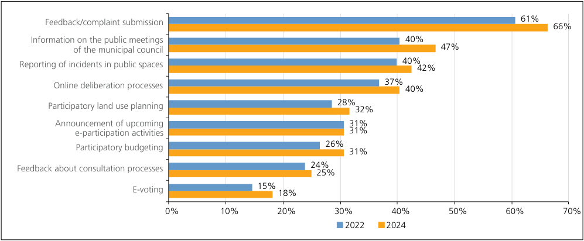

**----- Start of picture text -----** 
Feedback/complaint submission 61% 66% Information on the public meetings 40% of the municipal council 47% Reporting of incidents in public spaces 40%42% Online deliberation processes 37% 40% Participatory land use planning 28%32% Announcement of upcoming 31% e-participation activities 31% Participatory budgeting 26% 31% Feedback about consultation processes 24%25% E-voting 15% 18% 0% 10% 20% 30% 40% 50% 60% 70% 2022 2024 **----- End of picture text -----** 

Most city portals incorporate feedback mechanisms to promote and facilitate resident engagement. Malé,[16] the capital of the Maldives and its most populous city, pledges to process all duly completed feedback submissions within five business days. Rome allows residents to submit suggestions, comments, complaints, and even reports relating to local government activities or offices and is committed to responding within thirty days, identifying the relevant office and personnel overseeing the investigation and providing information on actions taken. The city of Dublin informs its residents of the avenues available to report various issues to designated service areas without requiring adherence to formal complaint procedures. Formal complaints directed towards the Dublin city council[17] can be lodged via post, email or online through the citizen Hub, with assurances of a formal acknowledgment within three working days and an expected response from the relevant department within twentyone days. Dissatisfied individuals can escalate their complaint to the executive manager within fifteen working days and further to the Office of the Ombudsman if the problem persists. 

E-voting is not strictly limited to electoral processes, often extending to decision-making on various initiatives, projects or ideas within city portals. The availability and utility of this option varies. Some platforms showcase e-voting functionality for specific projects or competitions, with evidence of past engagement but limited current activity. Others require registration to access e-voting results or offer opportunities for online voting on specific topics. In some instances, e-voting is integrated into participatory budgeting schemes. While these examples are encouraging, widespread implementation remains uncommon, with sporadic instances of e-voting observed across different municipalities. Although some platforms provide clear avenues for citizens to participate in e-voting opportunities, the policy impact of these contributions remains unclear in certain cases. Overall, while e-voting services are present in various forms, they often represent a minority among the participation mechanisms available within city portals. 

## _E-government literacy_ 

In the 2024 edition of the E-Government Survey, UN DESA introduces the concept of e-government literacy to measure the ability of residents – especially vulnerable groups – to utilize e-government services and take advantage of e-participation opportunities. In the present analysis, e-government literacy is based on the assessment of key features within government portals, including support services, privacy protection, digital identity authentication, and access to online resources, as these indicators are aligned with enhancing digital literacy and engagement across diverse domains. Although e-government literacy was not a specific category in 2022, many of its indicators were 

148 

Chapter 4 • LoCaL e-Government DeveLopment 

included in the lOSI assessment, allowing for feasible comparisons between 2022 and 2024 data. As seen in figure 4.12, progress has been made in several areas, with rates of compliance increasing for indicators such as real-time communication functionality, the availability of information on online services use, privacy policies, online user support features, portal authentication, internal search mechanisms, and the integration of social networking features in government portals. These advances reflect a commitment to enhancing accessibility and engagement for the users of online services. 

Many members of society remain digitally disconnected and are in danger of being left behind in a world that is rapidly moving online. Providing free Internet access at the local level is crucial for ensuring inclusion. The availability of physical spaces for accessing online services varies across cities. Some municipalities offer service centres or “digital islands” within government offices, facilitating access to online services and often providing personal assistance. Vienna is one city that offers digital islands and provides support for users of online services. Belmopan, in Belize, boasts numerous free mobile Wi-Fi hotspots. Public libraries often serve as hubs for accessing online services, with free Wi-Fi widely available in many cities. While some cities have dedicated spaces for digital access, such as community centres or libraries, others lack clear evidence of facilities for public Internet access. Notably, some cities provide free Wi-Fi in public spaces such as parks, squares and metro stations, further enhancing connectivity. These varied efforts to ensure public Internet access underscore the importance assigned to digital inclusion in modern governance. 

Figure 4.12 Implementation of e-government literacy indicators in city portals 

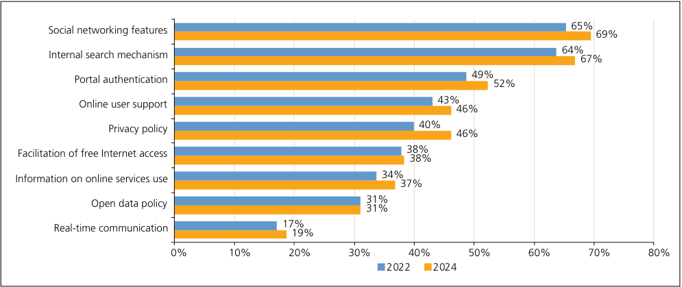

**----- Start of picture text -----** 
Social networking features 65% 69% 64% Internal search mechanism 67% 49% Portal authentication 52% Online user support 43%46% Privacy policy 40% 46% Facilitation of free Internet access 38% 38% Information on online services use 34% 37% Open data policy 31%31% Real-time communication 17% 19% 0% 10% 20% 30% 40% 50% 60% 70% 80% 2022 2024 **----- End of picture text -----** 

_Technology_ 

As illustrated in figure 4.13, there have been improvements in most of the lOSI technology indicators since 2022. Notably, compliance rates have increased for mobile device accessibility (from 70 to 76 per cent), the ease with which portals can be found (from 73 to 77 per cent), and browser compatibility (from 75 to 78 per cent). Indicators such as the availability of internal advanced search mechanisms, foreign language support, and navigability have also registered improvement. However, compliance rates have dropped slightly for alignment with display standards, markup validation standards, and accessibility standards. As an example of the technological advancements being made, the Beijing Municipal Government Service centre website has introduced easy-access and senior-friendly features such as text-to-speech functionality, large fonts, and customizable colours, along with a one-stop service zone to simplify access to various services for individuals with disabilities and the elderly. These enhancements are intended to make government services more accessible and user-friendly for special groups, ensuring a more satisfying online experience for a wider range of consumers. 

149 

2024 UN E-GovErNmENt SUrvEy 

Figure 4.13 Implementation of technology indicators in city portals 

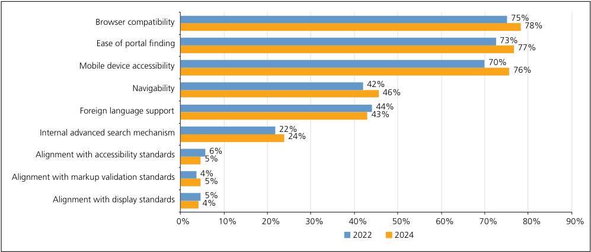

**----- Start of picture text -----** 
Browser compatibility 75%78% Ease of portal finding 73%77% Mobile device accessibility 70% 76% Navigability 42%46% Foreign language support 43%44% Internal advanced search mechanism 22% 24% Alignment with accessibility standards 5%6% Alignment with markup validation standards 4%5% Alignment with display standards 4%5% 0% 10% 20% 30% 40% 50% 60% 70% 80% 90% 2022 2024 **----- End of picture text -----** 

The importance of search engines cannot be overstated. Growing numbers of people needing services or information are turning to search engines and generative AI tools such as chatGPT and copilot for assistance. In the present context, the ability to find city portals easily on the first result page produced by a search engine is crucial. This ensures that residents and visitors can swiftly access important information and services provided by municipal governments. It is worth noting that, across a wide range of countries, city portal links consistently appear among the top results from popular search engines such as Google, Bing and Yahoo. Search engine visibility is key to ensuring seamless access to municipal services and information. 

## **4.3 Smart cities for sustainable development** 

A smart city for sustainable development embodies a vision of urban progress aligned with the principles of inclusivity, safety, resilience, and sustainability articulated in SDG 11. cities that offer numerous opportunities and promote prosperity can also face challenges such as poor health conditions and environmental degradation. The integration of digital technologies in urban infrastructure and services is essential for addressing these and other challenges. By leveraging digital innovations, cities can better meet the needs of residents, enhancing overall liveability, workability and sustainability. The lOSI underscores the importance of digital technologies in empowering local officials to improve urban conditions and meet the evolving needs of communities. This emphasis on digital empowerment aligns with the broader goal of creating cities that are not only technologically advanced but also inclusive, resilient and environmentally sustainable. Towards that end, the lOSI can serve as a tool for measuring e-government progress within cities. 

A number of smart city initiatives have been undertaken worldwide. It is important to note that there is no universally agreed-upon definition of a smart city. The digital transformation of urban spaces is a dynamic process or journey rather than a static destination; with the rapid advances in technology, cities can continuously evolve and improve their smart capabilities. UN DESA, through its lOSI assessments since 2018, has been instrumental in highlighting various smart city initiatives but has not provided definitive guidelines on what constitutes a smart city. ITU offers the following definition: “A smart sustainable city is an innovative city that uses information and communication technologies (IcTs) and other means to improve quality of life, efficiency of urban operation and services, and 

150 

Chapter 4 • LoCaL e-Government DeveLopment 

competitiveness, while ensuring that it meets the needs of present and future generations with respect to economic, social, environmental as well as cultural aspects”.[18] This definition, based on Recommendation ITU-T Y.4900 and approved by the 193 ITU member States, has become an international standard that is also used for United for Smart Sustainable cities (U4SSc) deliverables. Although the ITU definition is widely recognized, the smart city concept continues to be interpreted and implemented in various ways across the globe. 

Fundamentally, a smart city is a city that responds to the needs of its residents by leveraging digital technologies. city government officials play a crucial role in identifying local priorities and challenges and employing the most appropriate digital tools to effectively address those needs. 

Moving forward, it is essential that smart city initiatives be aligned with SDG 11 targets and with the principles of effective governance endorsed by the committee of Experts on Public Administration (see figure 4.14).[19] The eleven principles of effective governance for sustainable development are grouped under three subheadings: effectiveness, accountability and inclusiveness. Effectiveness is based on ensuring that city institutions have the expertise and resources necessary to address urban challenges appropriately and efficiently. Accountability emphasizes the importance of transparency, integrity and independent oversight in strengthening and preserving public trust in government. Inclusiveness promotes the involvement of all segments of society in decision-making processes, ensuring that no one is left behind. When these principles are linked to the goals of liveability, workability and sustainability, residents of smart cities can expect urban environments that are not only technologically advanced but also conducive to a high quality of life, economic success, and environmental preservation. cities that intentionally integrate principles of effective governance in their smart city initiatives will be better positioned to meet these expectations and support inclusive, resilient and sustainable urban development. 

Figure 4.14 Integrating the principles of effective governance and SDG 11 targets in the development of smart and sustainable cities 

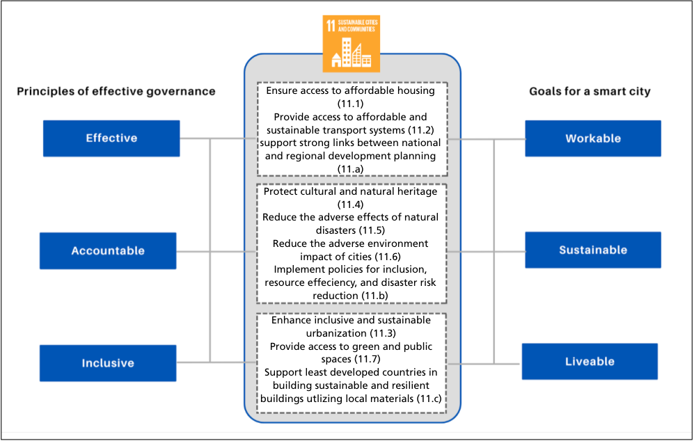

**----- Start of picture text -----** 
Ensure access to affordable housing (11.1) Provide access to affordable and sustainable transport systems (11.2) support strong links between national and regional development planning (11.a) Protect cultural and natural heritage (11.4) Reduce the adverse effects of natural disasters (11.5) Reduce the adverse environment impact of cities (11.6) Implement policies for inclusion, resource effeciency, and disaster risk reduction (11.b) Enhance inclusive and sustainable urbanization (11.3) Provide access to green and public spaces (11.7) Support least developed countries in building sustainable and resilient buildings utlizing local materials (11.c) **----- End of picture text -----** 

151 

2024 UN E-GovErNmENt SUrvEy 

Figure 4.15 presents proxy indicators from the lOSI assessment that may offer some insight into the extent of digital readiness for smart city development. These indicators serve as a valuable tool for gauging the level of digitalization and innovation within urban environments and underscore the importance of data in driving smart city initiatives forward. Data not only inform decision-making processes but also serve as the foundation for AI applications and other smart city endeavours. In the lOSI assessments, indicators such as the existence of smart city initiatives, open government data sharing, the presence of online policies for data accessibility, and indications of emergent technology utilization provide valuable insight into the progress cities are making towards becoming smarter and more responsive to the needs of residents. 

An analysis of smart city initiatives around the world reveals varying levels and stages of engagement, implementation and visibility. Many cities, including Dubai, Amsterdam, Riyadh, Seoul, Singapore, and New York city, are actively engaged in smart city development. cities such as Berlin,[20] copenhagen and Istanbul have dedicated departments, units or projects focused solely on smart city development – an indication of their strong commitment to digital urban development. Smart city Berlin is a collaborative effort involving various stakeholders, including government agencies, private companies, academic institutions, and the residents themselves, all working together to create a more liveable, resilient and prosperous urban environment. The copenhagen Solutions lab[21] is a development unit under the Technical and Environmental Administration for the Municipality of copenhagen. The lab acts as an incubator for smart city development and leverages the opportunities provided by urban laboratories, which are real-world testing grounds within the city itself. These laboratories provide the ideal scale for systematic and targeted experiments and the exploration of new solutions.  By developing, testing, and operationalizing innovative solutions in urban laboratories, copenhagen Solutions lab gains valuable insight into which ones can be effectively scaled to encompass larger areas of the city, ultimately benefiting all of copenhagen. This approach also provides a critical foundation for informed decisions regarding investments in new technologies for the Municipality’s smart city initiatives. 

Figure 4.15 LOSI indicators as a proxy for progress towards smart city development 

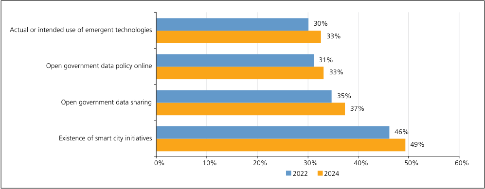

**----- Start of picture text -----** 
30% Actual or intended use of emergent technologies 33% 31% Open government data policy online 33% 35% Open government data sharing 37% 46% Existence of smart city initiatives 49% 0% 10% 20% 30% 40% 50% 60% 2022 2024 **----- End of picture text -----** 

152 

Chapter 4 • LoCaL e-Government DeveLopment 

The Smart Municipalities and Artificial Intelligence Programme in Saudi Arabia focuses on transforming urban landscapes through digitalization and AI integration across key verticals. By leveraging advanced technologies such as AI-enabled ccTV and drones, the programme aims to optimize inspection activities and improve safety. Through initiatives such as smart waste management platforms and connected bins, it seeks to enhance cleanliness and environmental preservation. By employing digital tools such as social media sentiment analysis and digital applications for proposals, the programme aims to increase accessibility to administrative services and better engage people in community activities and decision-making processes. Mexico city has set up an innovative AI-driven platform to address gender disparities in urban policymaking. Overseen by the Women’s Secretariat, this platform integrates diverse AI-processed data sources to provide detailed insights into critical priorities at the granular level, down to individual city blocks. It supports gender-responsive initiatives focused on improving transport connectivity and local childcare services, ultimately fostering women’s economic empowerment and promoting inclusive urban governance. Featuring a user-friendly interface, the platform empowers policymakers to take informed action based on the insights provided. By enhancing survey data with advanced natural language understanding models, Mexico city ensures that women’s voices are heard and that their perspectives are integrated into policy formulation. These efforts collectively contribute to creating a digital city ecosystem that improves city services and benefits for residents while also ensuring efficient operations through advanced analytical approaches and the maintenance of digital capabilities.[22] 

The U4SSc initiative,[23] coordinated by ITU, the United Nations Economic commission for Europe and UN-Habitat and supported by 16 United Nations entities, is playing a pivotal role in advancing efforts to create smart sustainable cities and achieve the SDGs – in particular Goal 11, which aims to make cities inclusive, safe, resilient and sustainable. The U4SSc initiative provides a global platform for knowledge exchange and collaboration, fostering the development of policies and strategies that promote smart urban solutions. It has developed a set of key performance indicators (KPIs) for smart sustainable cities, including metrics on IcT infrastructure, environmental sustainability, quality of life, and urban governance. These KPIs help cities measure their progress, identify areas for improvement, and implement data-driven policies that contribute to sustainable urban development. Through these efforts, U4SSc supports cities in becoming more efficient, liveable and resilient, aligning urban growth with the broader SDG agenda. The lOSI complements these efforts by evaluating the availability and quality of online services at the local level, emphasizing the importance of synergies among United Nations entities in fostering integrated and data-driven approaches to sustainable urban governance and development. 

## **4.4 Local Government Questionnaire** 

The lGQ is a preparatory survey administered to support the lOSI process. The lGQ survey template may be found in the Section 9 of the Technical Appendix. While the lGQ does not directly affect Index values or rankings, it serves an important purpose in helping assessors check the correct web features and refer to the most recent policy documents. The lGQ has a total of 46 questions, not all of which are answered by all respondents. The questions cover eight clusters of information: institutional framework, legal framework, strategy and implementation, usage of online services, user satisfaction, social media, addressing crisis/emergency situations, and smart city and new technologies. A total of 51 local government representatives participated in the 2024 survey (10 from Africa, 7 from the Americas, 23 from Asia, 10 from Europe, and 1 from Oceania), representing a response rate of 26 per cent. While still relatively low, this represents an improvement over the 2022 lGQ response rate of 22 per cent (with 42 countries participating). UN DESA expects that more cities will participate in the lGQ over time, providing enriched input for future editions of the E-Government Survey. 

153 

2024 UN E-GovErNmENt SUrvEy 

The lGQ was made available online in early 2023 and was also sent to municipalities. Figure 4.16 highlights the keywords used most frequently in city responses. Along with “citizens” and “government”, “digital” and “services” are identified as top priorities, indicating a concerted effort by municipal authorities to prioritize the digitalization of public services and a commitment to improving accessibility and efficiency for local residents. The prominence of “information” underscores the importance of providing comprehensive content on city portals and ensuring that people have access to relevant, up-to-date information. Although the word “smart” features prominently, the relatively lower occurrence of “AI” and “sustainable” suggests that while smart city initiatives are gaining traction, artificial intelligence and sustainability measures may not yet be fully integrated into mainstream e-government strategies. The moderately high occurrence of “budget” may underscore how crucial financial considerations are for local e-government initiatives, while the attention given to “housing” and “transport” may signify sectoral priorities in government efforts to address urban challenges and enhance essential services through digital innovation. 

The 2024 lGQ results show that the responding cities stably provide services through the web and are increasingly introducing content through mobile channels. One notable observation is that some cities – at least 16 per cent of the sample – use more than one website for specific areas of e-government (including e-services, e-participation, open government data and public procurement). Most city organizational charts include a chief information officer to oversee the implementation of municipal e-government objectives. Most of the municipalities are aligned and collaborate with central e-government agencies, contributing to broader national e-government goals and exploiting national resources. Most of the cities allocate a portion of their budget to e-government projects and link those initiatives with specific sustainability goals based on residents’ needs. Networking with other cities and organizations nationally or internationally is a growing phenomenon, allowing local government authorities to exchange information, access expertise, share best practices and digital platforms, and improve capacity-building. A gap is identified in open data provision, signaled by the slight decrease in usage statistics and in the publication of user satisfaction data. Municipalities are increasingly leveraging social media, using a variety of tools to engage with residents and thereby enhancing the inclusivity and accessibility of e-government activities. 

Figure 4.16 Local Government Questionnaire keyword summary 

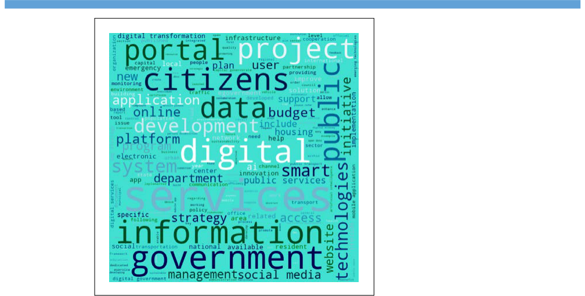

154 

Chapter 4 • LoCaL e-Government DeveLopment 

Finally, even though emerging technologies are a stable feature of local e-government among the lGQ respondents, there remains a significant gap in the application of AI technologies in local government decision-making. An analysis of lGQ responses shows that AI is being leveraged to enhance various aspects of governance, public services delivery, and urban management. Azerbaijan is working on a national strategy for AI, aiming to develop smart cities and advanced technological infrastructure. Bahrain integrates AI in its Mycapital app to improve service efficiency and conducts workshops to educate officials on the impact of AI and other new technologies on public services. Monaco uses AI for public event security and natural disaster prediction, the latter exemplified by its AI-powered hazard detection system. The Singapore National AI Strategy seeks to position the country as a leader in scalable AI solutions by 2030 through the integration of AI in manufacturing, urban solutions and other strategic sectors. The United Arab Emirates fosters AI innovation through initiatives such as the AI lab and the Dubai Blockchain Strategy, promoting the use of AI to improve public services delivery and position Dubai as a leader in AI adoption. Across the globe, AI is becoming instrumental in strengthening service efficiency, security, and overall urban management. 

Additional information from the lGQ review is available in “Assessing digital government at the local level: an analysis of worldwide municipalities”, a paper prepared for the upcoming International conference on Theory and Practice of Electronic Governance, to be held in Pretoria from 1 to 4 October 2024.[24] 

## **4.5 Application of LOSI methodology in countries LOSI network** 

Owing to resource limitations, UN DESA was able to invite only the most populous cities in the 193 Member States to participate in the 2022 and 2024 lOSI surveys. These cities were selected to cover as many residents as possible. However, there has been strong interest in applying the lOSI methodology to assess e-government in more cities in individual countries, and over the past couple of years UN DESA has been able to sign memorandums of understanding and partner with various institutions to run lOSI pilots, in collaboration with the United Nations University Operating Unit on Policy-Driven Electronic Governance (UNU-EGOV), in multiple cities within selected countries. In 2022, the lOSI methodology was applied in the State of Palestine, Jordan and Brazil. In 2023, the methodology was applied in India, Uzbekistan and Greece. As of this writing, assessments are being conducted in Brazil (second application), the Republic of Korea, Tanzania and Tunisia. To review the completed projects and read the outcome documents prepared by partnering entities, visit the links provided in the figure below. 

Figure 4.17 Application of LOSI methodology in countries 

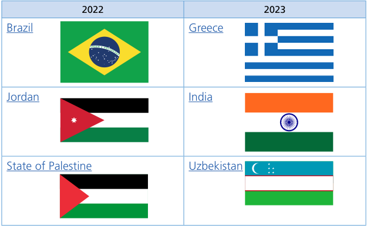

**----- Start of picture text -----** 
2022 2023 Brazil Greece Jordan India State of Palestine Uzbekistan **----- End of picture text -----** 

155 

2024 UN E-GovErNmENt SUrvEy 

It is expected that a growing number of partners will utilize the lOSI methodology, become part of the lOSI network, support national and local governments, and help other cities that may be experiencing similar challenges in e-government development. UN DESA and UNU-EGOV welcome opportunities for collaboration in applying the lOSI methodology in different countries; interested parties are encouraged to contact the Division for Public Institutions and Digital Government at dpidg@un.org. 

## **4.6 Key findings and recommendations** 

- The LOSI 2024 findings indicate that while there is a strong correlation between national and city portal development, national portals generally outperform city portals. continued monitoring and assessment of local and national e-government development is essential to close the gaps and support digital transformation at all levels. 

- The average LOSI value remained stable at around 0.51 between 2022 and 2024. While the halfway point has been surpassed by the surveyed group as a whole in terms of meeting development indicators, there is still significant room for growth. Almost all indicators show an increase of 1 to 8 per cent in overall compliance, pointing to the usefulness of the lOSI as a guidance tool for city portal development. 

- Europe leads in LOSI values, with an average of 0.803, reflecting a high degree of uniformity in digital services delivery across its cities. However, there are still many cities in Africa and the Americas that lack an online presence. 

- In 2024, as in 2022, the analysis indicates that more populous cities tend to have higher LOSI values, as they are able to benefit from abundant resources and higher demand for online services. These cities are likely to continue to lead in digital services provision, largely because of their higher capacity to invest in and innovate their e-governance systems. 

- Among the six criteria assessed for the 2024 LOSI, the highest average compliance rate is observed for the institutional framework criterion, with most cities meeting 75 to 100 per cent of the indicators. The newly introduced e-government literacy criterion has the second highest overall compliance rate. 

## Endnotes 

- 1 Independent Group of Scientists appointed by the Secretary-General of the United Nations, _Global Sustainable Development Report 2023 – Times of Crisis, Times of Change: Science for Accelerating Transformations to Sustainable Development_ (United Nations publication, 2023), available at https://sdgs.un.org/sites/default/fles/2023-06/Advance%20 unedited%20GSDR%2014June2023.pdf. 

- 2 United Nations, Department of Economic and Social Affairs, and others, “Inter-agency policy brief: accelerating SDG localization to deliver on the promise of the 2030 Agenda for Sustainable Development”, 29 May 2024, available at https://sdgs.un.org/sites/default/fles/2024-06/Policy%20Brief%20FINAL%20May%2029%205%2024.pdf. 

- 3 United Nations, General Assembly and Economic and Social Council, “Progress towards the Sustainable Development Goals: towards a rescue plan for people and planet”, report of the Secretary-General, 27 April 2023 (A/78.80-E/2023/64), available at https://unstats.un.org/sdgs/fles/report/2023/secretary-general-sdg-report-2023--EN. pdf. 

- 4 Secretary-General of the United Nations, “Secretary-General’s video message for the 10th European Summit of Regions and Cities”, 18 March 2024, available at https://www.un.org/sg/en/content/sg/statement/2024-03-18/ secretary-generals-video-message-for-the-10th-european-summit-of-regions-and-cities. 

- 5 United Nations Settlements Programme (UN-Habitat), _World Cities Report 2020: The Value of Sustainable Urbanization_ (Nairobi, 2020), p. 3, available at https://unhabitat.org/sites/default/fles/2020/10/wcr_2020_report.pdf. 

- 6 Berliner Vorschriften und Rechtsprechungsdatenbank, “Gesetz zur Förderung der Informationsfreiheit im Land Berlin (Berliner Informationsfreiheitsgesetz – IFG), vom 15 Oktober 1999”, available at https://gesetze.berlin.de/ bsbe/document/jlr-InfFrGBEpP3. 

156 

Chapter 4 • LoCaL e-Government DeveLopment 

> 7 - - City of Toronto, “Freedom of information”, available at https://www.toronto.ca/city government/accountability operations-customer-service/access-city-information-or-records/freedom-of-information/. 

> 8 City of New York, “Welcome to NYC government’s home for filing Freedom of Information Law (FOIL) requests”, OpenRecords, available at https://a860-openrecords.nyc.gov/. 

> 9 Alcald ί a de Guayaquil, “Transparencia 2023”, available at https://www.rpguayaquil.gob.ec/?page_id=22#:~:text=La%20 Ley%20Org%C3%A1nica%20de%20Transparencia,m%C3%ADnima%20actualizada%20de%20naturaleza%20 obligatoria. 

> 10 Municipality of Lima, available at www.munlima.gob.pe or https://www.gob.pe/munilima. 11 Alcald ί a de Panama, “Art ί culos”, available at https://transparencia.mupa.gob.pa/. 

> 12 - - People’s Association, “Community integration”, available at https://www.pa.gov.sg/our programmes/community integration/. 

> 13 - Dublin City Council, “Procurement stores & management”, available at https://www.dublincity.ie/business/doing business-council/public-procurement#:~:text=Procurement%20in%20Dublin%20City%20Council%20is%20largely%20 a%20devolved%20function,legislative%2C%20regulatory%20and%20policy%20requirements. 

> 14 - Tokyo Metropolitan Government, “E-procurement system”, available at https://www.e procurement.metro.tokyo. lg.jp/sp/index.html. 

> 15 State of Berlin (das offizielle Hauptstadtportal), “Müll: Wohin mit den alten Sachen?” [Garbage: Where to put the old things?], available at https://www.berlin.de/special/neu-in-berlin/745723-744080-muell-wohin-mit-denalten-sachen.html#:~:text=Gr%C3%B6%C3%9Ferer%20M%C3%BCll%2C%20wie%20z.B.%20alte,bestimmten%20 Menge%20keine%20Geb%C3%BChren%20an. 

> 16 Maldives, “Submission of complaints”, available at https://one.gov.mv/services/64817572-0469-2165-91554307b425ee88. 

> 17 - Dublin City Council, “How to make a complaint”, available at https://www.dublincity.ie/council/council explained/ complaints. 

> 18 International Telecommunication Union, “About” page, available at https://www.itu.int/cities/about/. 

> 19 UN DESA, “11 principles of effective governance”, available at https://publicadministration.un.org/portals/1/images/ cepa/principles_of_efective_governance_english.pdf. 

> 20 State of Berlin, “Smart City Berlin”, available at https://smart-city-berlin.de/en/. 

> 21 Copenhagen Solutions Lab, “Contact”, available at https://cphsolutionslab.dk/en/contact. 

> 22 Mexico City, Women’s Secretariat, available at https://www.semujeres.cdmx.gob.mx/secretaria/acerca-de. 

> 23 ITU, United for Smart Sustainable Cities, available at https://u4ssc.itu.int/. 24 Vincenzo Aquaro, Demetrios Sarantis, Delfina Soares, Deniz Susar , Angelica Marie Zundel, “Assessing digital government at the local level: an analysis of worldwide municipalities”, a paper prepared for the International Conference on Theory and Practice of Electronic Governance, to be held in Pretoria from 1 to 4 October 2024 (in publication). 

157 

2024 UN E-GovErNmENt SUrvEy 

158 

Addendum 

## **Addendum on AI and Digital Government** 

## **A.1 Introduction** 

The integration of artificial intelligence (AI) in public administration has attracted global attention in recent years. It is widely accepted that AI technologies can improve public sector operations by replacing administrative tasks with automated processes, improving efficiency, and eliminating backlogs and redundancies. This shift is not without risks, however; the lack of careful scrutiny of AI advances during the past decade and the limited understanding of the nature and extent of their consequences have raised red flags in many countries, leading to what is sometimes referred to as the “AI regulation race”. Because the development of powerful AI technologies such as large language models (llMs) outpaces the development of national policies and regulatory frameworks, AI has become a focal point in discussions on digital transformation in the public sector. 

In March 2024, the United Nations adopted resolution A/RES/78/265,[1] underscoring the potential of AI to support or hinder the achievement of the 17 Sustainable Development Goals (SDGs). Followed by the resolution A/RES/78/311, which explores ways to enhance international cooperation on capacity-building for using and managing artificial intelligence. Furthermore, AI has been a key issue of discussion in multiple UN committees and working groups, including the global digital compact by the General Assembly as part of the Pact for the Future. At the national level, many leading countries, including canada, china, the members of the European Union, the Republic of Korea, Singapore, and the United States of America, are actively pioneering the regulation and use of AI. 

This addendum to the _2024 E-Government Survey_ focuses on the integration of AI in the public domain and digital government. While this is a specific and narrower aspect compared to the broader discussions on AI regulation and governance in general, it remains a crucial venue for review. Furthermore, this addendum aims to explore the integration of AI in the public domain, which is impacted by the much broader discussion on the regulatory frameworks aimed at benefiting society. The addendum provides a short summary of the perceived opportunities and challenges associated with AI technology, specifically in the public sector, followed by an overview of national, regional, and global efforts to regulate AI. It highlights the benefits of using regulatory sandboxes (a framework that allows being exempted from specific regulations to test a new product/process) in the development of regulatory frameworks, showcasing a number of successful initiatives in this area. 

||Photo credit: shutterstock.com.|Photo credit: shutterstock.com.|
|---|---|---|
||||
|A.1|Introduction|159|
|A.2|AI in the public sector: opportunities||
||and challenges|160|
||A.2.1 Opportunities|160|
||A.2.2 challenges|160|
|A.3|AI governance and regulatory||
||frameworks|161|
||A.3.1 United Nations initiatives|162|
||A.3.2 National AI strategies|163|
||A.3.3 Human-centric approaches|164|
|A.4|AI literacy and capacity-building|164|
||A.4.1 Robust structure for data||
||and digital governance|165|
||A.4.2 AI literacy|166|
||A.4.3 Regulatory sandboxes|167|
|A.5|Key Recommendations|168|
||A.5.1 Building upon existing||
||efforts|168|
||A.5.2 laying the appropriate||
||foundations for the||
||advancement of AI||
||technologies|169|
||A.5.3 Engaging in collective action|169|

159 

**Addendum** 

2024 UN E-GovErNmENt SUrvEy 

The addendum offers examples of existing global and national regulatory frameworks and agendas, providing recommendations on how to maximize the benefits while minimizing the negative effects of AI implementation in the public sector. A section highlighting methodologies and successful cases of AI capacity-building, including expanding AI literacy, is included to promote the inclusive development of AI technologies. 

## **A.2 AI in the public sector: opportunities and challenges** 

## **A.2.1 Opportunities** 

AI is recognized as an effective tool for enhancing work efficiency and productivity. It can be used for a multitude of purposes, including detecting defects, classifying data, and making recommendations.[2,3,4] There are numerous examples of AI use for products and services in both the public sector and the private sector, though the latter has been particularly active and innovative in AI integration. 

The advantages and opportunities associated with AI extend beyond the private sector; AI integration in the public sector can also deliver enormous benefits. AI has proven instrumental in effective public service delivery during crises such as the cOVID-19 pandemic. In Togo, for example, the social protection programme Novissi utilized satellite imagery and household consumption data to identify the poorest villages.[5] These villages were then prioritized using machine learning algorithms and mobile phone data to effectively distribute $22 million through three monthly mobile phone payments to 600,000 citizens in urban areas.[6] Other examples include the “virtual doctor” selfassessment tool powered by AI in croatia and the use of sensors and AI algorithms in london to control traffic. These are excellent examples of how AI can contribute to addressing society’s problems.[7] 

AI technologies can also support the achievement of the SDGs. The global community has been reminded time and again that the world is not on track to meet the Goals articulated in the 2030 Agenda for Sustainable Development. A comprehensive midpoint assessment of the 135 trackable SDG targets was conducted for The Sustainable Development Goals Report 2024, and the findings revealed only moderate or marginal progress for almost half the targets and either no progress or regression for 35 per cent of the targets since 2015. 

The urgent call to action to accelerate progress towards the SDGs comes at a particularly challenging time, as the global economy is still reeling from the effects of the pandemic, with only a few countries having experienced substantial recovery. For most countries, there is a pressing need for enhanced efficiency with constrained budgets – a challenge ideally suited for AI algorithms. There are numerous instances where Governments have leveraged AI to enhance efficiency across various sectors. The Singapore government, for example, implemented AI in its service moments of life (now called life SG) to streamline government services, including birth registration and elder care. The Indian government has implemented AI technologies into the agriculture sector, improving the value chain for more than seven thousand chili producers. Specifically, the ‘Saagu Baagu’ pilot project developed in cooperation between the World Economic Forum and the Telangana state government has benefitted participating farmers with a 21 per cent increase in chili yields per acre, a 9 per cent reduction in pesticide use, a 5 per cent decrease in fertilizer usage, and an 8 per cent improvement in unit prices due to quality enhancements.[8] 

## **A.2.2 Challenges** 

While the potential benefits of AI technologies are substantial, so are the potential risks. The ethical, security and social implications of AI must be carefully addressed. One ethical concern is data bias. AI algorithms are intrinsically data-based, meaning they rely heavily on accumulated data to produce results. consequently, any bias in these data can lead to the misrepresentation or underrepresentation 

160 

Addendum 

of certain groups. This bias is especially problematic when Governments employ AI in the development of public policies intended to serve the entire population, including marginalized groups. The persistent digital divide highlighted in previous United Nations E-Government Surveys[9,10] and digital governance studies poses a substantial challenge to implementing AI technologies in the public sector, especially in middle-income, low-income and least developed countries. 

chapter 4 of the _2022 E-Government Survey and chapter 3 of the 2024 E-Government Survey_ provide extensive insight into digital disparities within and between countries. According to both Surveys, significant progress has been achieved in bridging the digital divide. As noted in chapter 3 of the present Survey, the proportion of the population without digital access has declined from 45 per cent (3.5 billion) to just over 22 per cent (1.73 billion) in recent years. However, these gains derive primarily from developments in Asia; Africa, Oceania and the Americas have seen little to no narrowing of the digital divide. Data disparities are particularly problematic when AI technologies are applied in critical areas such as health care. In the 2021 publication _Ethics and Governance of Artificial Intelligence for Health: WHO Guidance_ , inclusiveness and equity are identified as key ethical principles for AI use in health care. The publication further emphasizes the need for careful monitoring and evaluation of AI technologies to avoid disproportionate impacts on specific groups.[11] 

Moreover, the growing influence of AI technologies in the labor market signals a profound transformation and the potential risk of job displacement across various sectors. This necessitates the implementation of strong universal social protection systems to support those adversely affected by these rapid changes and facilitate smoother transitions to alternative forms of employment. Such measures should include unemployment benefits coupled with active labor market policies aimed at retraining displaced workers. 

## **A.3 AI governance and regulatory frameworks** 

With the advent of llMs and other powerful AI systems, the AI discourse has shifted from empowerment to regulation. The rapid evolution of AI technologies has outpaced the regulatory capacities of Governments; however, national and international authorities are aware of this dynamic and are taking steps to address the gap. Many United Nations member States have established different types of institutions to oversee the development and regulation of AI technologies and safeguard citizens against potential risks and threats. 

The past several Surveys have endeavored to capture this transition and explore the evolving landscape of AI utilization and regulation by eliciting feedback on specific questions. Responses to the Member States Questionnaire (MSQ) disseminated by UN DESA indicate that 63 per cent (90 out of 142) of the countries surveyed for the 2022 to 2024 editions report having legislation or regulations on the use of new/emerging technologies such as AI, robotics, blockchain, 5G, and the Internet of Things. Almost half (44 out of 93) of the countries responding have already adopted legislation or regulations on the ethical/responsible use of AI in public administration. While these figures are notable, given that the discourse on the regulation of AI is relatively new, they remain well below the 88 per cent of countries (121 of 137) that have established e-government strategies or the equivalent. This disparity underscores the need for accelerated efforts to establish AI regulatory frameworks at the national level. 

In response to the question “Does the national e-government strategy make specific reference to the use of artificial intelligence (AI)?”, a total of 94 countries from among the 2022 and 2024 respondents indicate that their national e-government strategies include explicit reference to AI, an increase from 65 countries in 2020. While this represents solid progress, it also points to the absence of AI provisions in many national e-government strategies. countries that have not yet integrated AI into their digital agendas should carefully consider doing so to assess the potential benefits and challenges the technology may bring, as AI can greatly enhance governance and service delivery. 

161 

2024 UN E-GovErNmENt SUrvEy 

MSQ responses on the regulation of AI technologies reveal a regional imbalance. Asia is the leading region, ranking first in all questions relating to AI governance, closely followed by Europe. However, the Americas, Africa and Oceania lag far behind in the adoption of AI regulations and policies, with compliance rates averaging less than half of those achieved in Asia and Europe. Oceania, in particular, requires substantial support if it is to catch up with the other regions assessed, as only two to three of its countries have adopted AI-related regulations or policies. 

Figure A.1 Numbers/Percentages of countries responding affirmatively to MSQ questions on AI regulation, 2022 and 2024 cumulative total 

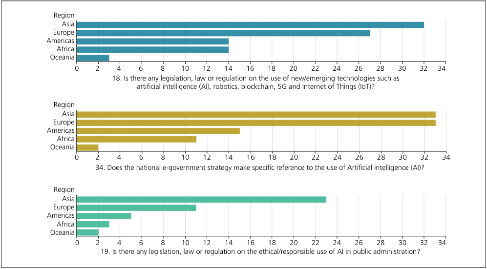

**----- Start of picture text -----** 
Region Asia Europe Americas Africa Oceania 0 2 4 6 8 10 12 14 16 18 20 22 24 26 28 30 32 34 18. Is there any legislation, law or regulation on the use of new/emerging technologies such as artificial intelligence (AI), robotics, blockchain, 5G and Internet of Things (IoT)? Region Asia Europe Americas Africa Oceania 0 2 4 6 8 10 12 14 16 18 20 22 24 26 28 30 32 34 34. Does the national e-government strategy make specific reference to the use of Artificial intelligence (AI)? Region Asia Europe Americas Africa Oceania 0 2 4 6 8 10 12 14 16 18 20 22 24 26 28 30 32 34 19. Is there any legislation, law or regulation on the ethical/responsible use of AI in public administration? **----- End of picture text -----** 

## **A.3.1 United Nations initiatives** 

The United Nations has been actively involved in discussions and activities surrounding AI technologies. The AI for Good Global Summit, first held in Geneva in June 2017, is an annual event organized by the International Telecommunication Union (ITU) and various partners within and outside the United Nations system. The Summit serves as a prominent platform for advocating the use of artificial intelligence in advancing the SDGs.[12] Other efforts undertaken by the United Nations and its agencies to enhance understanding and implement AI, are well documented in the ITU publication _United Nations Activities on Artificial Intelligence (AI) 2022_ (Please also refer to the Annex A.18 for a detailed list of UN initiatives on AI). The United Nations addresses AI topics and issues internally and through its specialized agencies, and discussions on AI are incorporated into the work of existing committees and bodies, including the commission on Science and Technology for Development and the committee of Experts on Public Administration. 

One milestone in the regulation of AI technologies by the United Nations and its agencies is the publication of the UNEScO Recommendation on the Ethics of Artificial Intelligence in 2021. This first-ever global standard on AI ethics, adopted by all 193 Member States in 2023, is intended to serve as a universally accepted normative instrument on AI technologies. It incorporates four critical values and ten principles that can be promoted through amendments to existing legislation and the elaboration of new legislation.[13] 

162 

Addendum 

The High-level Advisory Body on Artificial Intelligence was established by the Secretary-General of the United Nations in October 2023 announcing the interim report on governing AI for humanity in December of 2023 in which they call for strengthened international governance of AI carrying out seven critical functions. likewise, the first resolution on artificial intelligence (A/RES/78/265) was adopted by the United Nations General Assembly in March 2024 seeking methods to implement a safe, secure, and trustworthy artificial intelligence systems, followed by the resolution that calls for enhanced international cooperation (A/RES/78/311), marking another set of milestones in the international governance of AI technologies. The resolutions recognize that AI technology, when used responsibly, can contribute significantly to the achievement of all 17 SDGs by fostering economic, social and environmental progress to improve the global welfare and advance sustainable development. Although the resolutions do not impose any immediate binding obligations, it identifies the need for cooperation with and support for developing countries in narrowing the digital divide and improving digital literacy to ensure more inclusive access to AI technologies. 

Through these resolutions, the United Nations affirms that the ultimate objective of AI is to enhance human welfare and achieve sustainable development, consistent with the provisions of the charter of the United Nations, the Universal Declaration of Human Rights, and the 2030 Agenda for Sustainable Development. Towards this end, the United Nations is committed to establishing a global consensus on the development and implementation of AI systems that are safe, secure and trustworthy. 

## **A.3.2 National AI strategies** 

Many countries have established or are moving towards the establishment of AI regulations and policies. china, a leader in this area, announced its New Generation Artificial Intelligence Development Plan in 2017; this has since been supplemented by various regulations, including the 2023 Measures for the Management of Generative Artificial Intelligence Services, which address the meteoric rise of llMs such as chatGPT. Under these Measures, companies providing services to chinese users are required to comply with chinese regulations on personal information, take steps to protect the physical and psychological well-being of individuals, and uphold core values.[14] 

The United States and the United Kingdom of Great Britain and Northern Ireland are not far behind in the regulatory race. In November 2023, the two countries released the joint Guidelines for Secure AI System Development, with contributions from various global ministries and agencies.[15] These Guidelines are important for two main reasons. First, they emphasize the importance of maintaining security not only during the initial development phase but also throughout the entire AI system development life cycle, adhering to secure-by-design principles. Second, they collectively represent one of the first internationally agreed-upon guidelines on AI development, setting a precedent for global cooperation in this field. Additionally, the United Kingdom of Great Britain and Northern Ireland hosted the “AI Safety Summit” in November 2023, marking the first global summit focused on AI safety. During this event, 28 countries adopted “The Bletchley Declaration on AI Safety.” This was followed by the second summit, the “AI Seoul Summit,” held in Seoul in 2024. 

The European commission has released its first-ever legal framework on AI, known as the AI Act, focusing on the risks associated with AI and positioning Europe to play a leading role globally. Announced in April 2021 and adopted in March 2024, this regulation addresses the risks of specific uses and applications of AI, including generative AI, by classifying them into four different levels: unacceptable risk, high risk, limited risk, and minimal risk. The primary objectives are to guarantee the safety and fundamental rights of people and businesses while also strengthening AI uptake, investment and innovation across the European Union. Under this Act, high-risk AI systems – those used for critical infrastructure, education, product safety, employment, essential services, law enforcement, migration, and the administration of justice – will be subject to strict obligations in the areas of risk assessment, the quality of data sets, traceability, documentation, user information, human oversight, and robustness. 

163 

2024 UN E-GovErNmENt SUrvEy 

The Brazilian Artificial Intelligence Strategy guides the actions of Brazil in research, innovation and the ethical use of AI. The Strategy is based on five principles developed by the Organisation for Economic co-operation and Development for the responsible management of AI systems: inclusive growth, human-centred values, transparency, robustness, and accountability. The Strategy aims to develop ethical principles, promote AI research and development, remove barriers to innovation, educate professionals, and foster international cooperation.[16] 

## **A.3.3 Human-centric approaches** 

The public sector plays a vital role in the smooth functioning of society and can have a significant impact on people’s lives. To best serve the public interest, governance should be based on core values that include integrity, equity, sustainability and accountability.[17] AI tools used within the public sector must reflect and reinforce these core values, but this may be problematic, as AI algorithms are set up to return the most likely result for a given task with no regard for ethics, social norms or societal standards. A human-centric approach to the adaptation and application of AI technologies is needed to ensure that AI-driven e-government is secure, effective and aligned with social values. 

One potential strategy is to establish certification standards akin to those the United States Federal communications commission or the European Union has for electronic products but specifically tailored to AI. The widespread adoption of such standards would make it possible to detect and prohibit the use of AI systems that may pose hazards to humans. 

Another potential human-centric approach involves incorporating a human element in the automation process. Although AI tools are powerful, they are not accountable for the results they provide, so human supervision is needed to close gaps in the chain of responsibility for AI processes and outcomes. countries should implement a humans-in-the-loop or humans-on-the-loop approach to oversee the use and application of AI and ensure accountability. Where possible, countries should explore ways to integrate explainable AI (XAI) in digital administration and oversight to enhance transparency and allow for a thorough review of AI algorithms by human coordinators. 

A great example of the human-centric approach is the aforementioned AI Act adopted in Europe, which seeks to regulate AI technologies using a four-tiered risk-based framework. This framework prohibits AI applications that present unacceptable risks to humans. Under this legislation, all suppliers introducing AI products or deploying AI systems in the European Union market must assess the risk level of their product or system and comply with the corresponding regulations. 

## **A.4 AI literacy and capacity-building** 

The technology landscape is rapidly evolving as new digital models replace older ones to achieve superior performance; as part of this evolutionary dynamic, AI advancement is inevitable. The fear of negative outcomes from a premature implementation of AI technology should not hold countries back from exploring its potential. Regulations must be accompanied by capacity-building measures to advance AI technologies and optimize the benefits the technology brings. countries worldwide are channeling substantial financial resources into improving and expanding AI technologies. The coordinated Plan on Artificial Intelligence, a joint commitment between the European commission, European Union member States, Norway, and Switzerland, was published in 2018 to ensure a future-proof, human-centric, value-based digital transformation. The Plan provides for accelerated investment in AI, the implementation of comprehensive strategies and programmes, and the alignment of AI policies to prevent fragmentation within Europe. 

AI development, adoption, and regulation are affected by the digital divide. Developing countries frequently encounter significant challenges in establishing robust data infrastructures. The inability to keep up with developed countries in digital development can pose a substantial threat to global stability, as the combined impact of AI and robotics is expected to transform market structures dramatically – 

164 

Addendum 

similar to the transitions observed during the early stages of the Industrial Revolution but at a markedly accelerated pace. As the transformation progresses, traditional job markets are expected to experience major restructuring, with many traditional jobs being replaced by AI and automated systems[18,19,20,21] . According to the International labour Organization (IlO), high-income countries have the potential to automate 5.1 per cent of jobs and 13.4 per cent of augmentation potential. In contrast, low-income countries have significantly lower automation and augmentation potential, with only 1.3 per cent and 10.4 per cent of jobs, respectively. This translates to high-income countries experiencing more disruptive effects in technological transition as enjoying higher net gains from the process. Thus, the failure to address key disparities risks exacerbating global wealth polarization. 

However, the lack of infrastructure in developing countries will make this transition challenging. A large segment of the population may find themselves in a position similar to that of typists or telegraph operators in the past, losing their jobs without viable opportunities for transition, further polarizing the global economy. 

This underscores the urgent need to enhance the AI-related capacity of developing countries. Highlighting key elements essential for strengthening AI capabilities in these nations is crucial for bridging the gap between developed and developing countries. Building AI capacity will enable developing countries to harness the benefits of AI technology, promote innovation, and ensure they are not left behind in the digital transformation. 

## **A.4.1 Robust structure for data and digital governance** 

A pivotal starting point in promoting AI capacity-building in developing countries is the establishment of robust data governance and digital governance structures. AI technologies fundamentally rely on data for their implementation, irrespective of the specific methodology employed (whether it be supervised, unsupervised, or reinforcement learning). AI is a product of machine learning algorithms that use historical data divided into three sets: training, validation and testing. 

Developing AI technologies without a robust data foundation is impractical and could result in investments becoming non-performing assets, risking the sustainability of AI technologies. Even the latest generative models (including transformer-based models) require the input of accurate data to return accurate results. In other words, if the accumulated data are inconsistent or have wrong instances, they will lead to the creation of underperforming algorithms or algorithms that provide wrong results. The importance of a solid data infrastructure cannot be overstated. 

AI technologies are intrinsically digital. Developing an AI framework or governance system disconnected from well-studied data or digital governance frameworks is not only inefficient but also risks overlapping with or contradicting existing efforts to govern the digital environment. While technological development does not follow a strict technological sequence or linear model, countries should be open to leapfrogging into an AI-savvy state. However, the belief that AI development can occur without substantial investment in the fundamental infrastructure (including data infrastructure) required for the development of AI is a misconception. Integrating AI governance within the broader context of digital governance is crucial. This integration ensures coherence and effectiveness by building upon existing efforts in data and digital governance and prevents countries from wasting the opportunity to benefit from prior advancements in the digital environment while preserving the potential for further AI development. It is recommended that new AI development initiatives be linked to and aligned with existing efforts to support the development of a connected digital infrastructure, including the digital public infrastructure and global digital cooperation initiatives (addressed in greater detail in chapter 3 of the present Survey). 

This approach is consistent with a competency framework developed by UNEScO to support national digital capacity-building efforts. The three competency domains – digital planning and design, data use and governance, and digital management and execution – are essential for digital transformation and AI adoption. The approach also aligns with the conclusions of one of the first comprehensive 

165 

2024 UN E-GovErNmENt SUrvEy 

overviews of AI use and impact in public services, which asserts that Governments should view AI governance as an extension of existing regulatory tools.[22] 

## **A.4.2 AI literacy** 

Well-established data and digital governance structures must be complemented by strong human input for AI integration to be effective. Extensive research has shown that while knowledge in general and the understanding of technology more specifically are inherently non-rivalrous, they are not universally inclusive. Exclusion arises not only from protective measures such as patents and intellectual property rights but also from the substantial investment required to acquire the necessary background knowledge, particularly for complex concepts such as AI algorithms. Without that foundational understanding, technology-related knowledge and ultimately technology itself are largely inaccessible to the general public. The ability to understand and take advantage of widely distributed knowledge and technology is known as social or absorptive capacity.[23,24] 

Digital capacity-building should target both producers (AI developers) and consumers (the end users or beneficiaries) of AI technologies in order to realize optimal economic and social benefits. Governments must strengthen citizens’ basic awareness and understanding of AI concepts and applications by increasing their exposure to relevant concepts and providing AI education to build AI literacy. Bootcamps are an effective way to increase AI literacy within the general population. Singapore offers an integrated bootcamp programme aligned with their AI capability programme (AI singapore) designed to identify and train AI professionals (see Box 1). 

## Box A.1 AI Singapore 

AI Singapore was launched in 2017 to deepen AI capabilities in the country. This is an excellent example of an initiative that evolved as it was implemented, with programmes and subprogrammes added to support the development of a successful AI empowerement scheme. At present, the initiative incorporates six pillars: AI research, AI governance, AI technology, AI innovation, AI products, learn AI. 

The initiative started with a flagship programme called 100 Experiments. The two main objectives were to build real-world, deployable AI products and solutions for industries and to transfer knowledge and well-trained talent into the industrial sector. On the ground, the cycle was as follows: proposals were received from industries, engineering teams were formed, team members collaborated on creating AI solutions, and the solutions were transferred to the industries to enhance productivity and efficiency. 

AI Singapore differs from other bootcamp programmes in that it focuses not only on creating AI solutions but also on identifying and training promising candidates to participate in the development of those solutions. In ideal circumstances, these apprentices are positioned as project coordinators for the same solutions when they complete the AI Apprenticeship programme. 

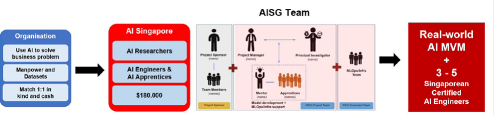

_100 Experiments programme structure Source_ : AI Singapore, “100 Experiments programme structure”, available at https://aisingapore.org/innovation/100e/. 

166 

Addendum 

The strengthening of AI capabilities in developing countries has also been undertaken through partnerships with world-renowned universities. carnegie Mellon University Africa, for example, offers master’s of science degrees in information technology, electrical and computer engineering, and engineering artificial intelligence. These programmes are designed to train innovative and technically proficient engineers within an African context. leveraging the strong reputation of carnegie Mellon, the University extends its influence beyond Rwanda, attracting students from across the African continent. currently, the university has more than 300 students and more than 550 alumni representing 19 nationalities. 

Improving AI capacity is an urgent priority for developing countries but is actually recommended for developed countries as well since AI literacy is required at all levels. To address this need, the AI4GOV programme – developed by Italy and Spain[25] and co-financed by the connecting Europe Facility of the European Union – is administering a master’s programme in artificial intelligence for public services. This ten-month graduate programme is designed to prepare future leaders in digital transformation, equipping them with the knowledge and skills they need to manage the development of AI and its adoption in the public sector. 

## **A.4.3 Regulatory sandboxes** 

As noted previously, AI development is occurring at a much faster pace than the implementation of AI regulations and policies. The increasing complexity of AI systems makes regulation particularly challenging. Discussions are starting to shift from narrow AI to general AI as development moves into uncharted territory, where outcomes are unknown but potentially transformative (see Box 2). Governments often lack the capabilities and expertise to fully understand the implications and anticipate the repercussions of emerging technologies. This can result in the overregulation or underregulation of AI technologies, depending on the strategy each country adopts. Overregulation can undermine the development of the AI industry but can be necessary in critical sectors such as health and education. likewise, underregulation can create risks for end-users, lead to policy failures, and exacerbate digital exclusion. In this context, regulations must be carefully designed and accompanied by policies that can complement existing regulations and do not limit creativity or the potential to develop emerging technologies such as AI. 

Regulatory sandboxes are innovation-friendly regulatory testing grounds that can help prevent overregulation and underregulation scenarios and give pioneering companies a temporary break from regulations while customized regulatory solutions are being developed. Sandboxes allow the testing of new products, services or processes in a controlled environment with a limited number of users, providing a safe testbed. The UN DESA policy brief on sandboxing highlights numerous successful cases of sandbox processes and frameworks, including those used for the adoption of digital currency in the Maldives and the promotion of cost-effective energy sources in Kazakhstan.[26] The practicality of this approach has been widely recognized, with a total of 218 regulatory sandboxes created by 2020.[27] 

The success of regulatory sandboxes in sectors such as fintech and blockchain has paved the way for similar initiatives in artificial intelligence. In 2022, Spain started developing its first AI sandbox, anticipating the gradual enforcement of the European Union AI Act. This sandbox is designed to provide a secure environment for experimentation while ensuring compliance with the Act. With the enactment of Royal Decree 817/2023 in November 2023, the sandbox will be implemented in the coming years to test the application of AI Act regulations on high-risk AI systems, general-purpose AI systems, and foundational AI models. In 2024, the Government of Singapore set up the country’s first sandbox on generative AI to allow small and medium-sized enterprises to gain experience in developing and applying relevant AI solutions. UN DESA is promoting regulatory sandboxes for AI, recognizing the increasingly important role AI will play in digital transformation in the public sector to support the effective delivery of public services and the achievement of the SDGs. During the 

167 

2024 UN E-GovErNmENt SUrvEy 

Box A.2 Classifying AI technologies 

There are multiple ways to classify AI technologies, with capability-based classification being the most widely used.[28] 

_Narrow AI_ is also known as weak AI. It can be trained to accomplish a specific task but cannot operate beyond that defined task. This is the only type of AI existing today. 

_General AI_ , also known as strong AI, remains a theoretical concept at this point. This type of AI can use previous learning and skills to accomplish new tasks without the need for humans to train the underlying model. 

_Super AI_ , or artificial superintelligence, is also strictly theoretical. It refers to those types of AI that surpass humans in cognitive abilities such as thinking, reasoning, learning, and making judgements. At present, these types of AI are projected to experience emotions, have needs, and possess their own beliefs and desires. 

_Source_ : IBM, “Understanding the different types of artificial intelligence”, article,12 October 2023, available at https://www.ibm. com/think/topics/artifcial-intelligence-types. 

United Nations Public Service Forum and Awards ceremony held in Incheon in June 2024, UN DESA held a workshop on fostering innovation through digital sandboxes and AI sandboxes. 

The key recommendations presented below are aligned with the aims of these initiatives, highlighting the importance of fostering innovation while ensuring the establishment of robust regulatory frameworks. 

## **A.5 Key Recommendations** 

There are three key recommendations that highlight essential steps for creating and sustaining a cohesive, innovative, and inclusive AI landscape in the public sector. 

## **A.5.1 Building upon existing efforts** 

Key recommendation: Integrating AI governance within existing digital frameworks is crucial for creating a cohesive regulatory environment that reduces redundancy, supports innovation, enhances efficiency and security, and promotes public trust in digital technologies. 

The significance and potential of emerging AI technologies compel countries to develop new frameworks that both regulate and empower this assortment of advanced digital tools. However, AI technologies are ultimately part of a broader array of digital technologies created by scientists and engineers that are interdependent and collectively drive digital transformation. Governing these technologies separately can lead to duplicated efforts, conflicting regulations, and fragmented systems that waste resources and create operational inefficiencies. For example, data privacy and security regulations applied to AI should be consistent with those governing other digital technologies to avoid confusion and legal discrepancies. 

The integration of AI governance within existing digital frameworks is essential for streamlining regulatory processes, maximizing efficiency, reducing redundancy, and ensuring cohesive regulatory practices. This approach not only supports the development and deployment of AI technologies but also strengthens overall digital governance, promoting innovation and protecting public interests. Implementing independent AI management technologies can conflict with established digital governance policies, leading to disruptions in AI advancements, increased operational costs, and potential legal disputes. 

168 

Addendum 

Ensuring data privacy and security becomes more challenging when AI governance is not aligned with broader digital strategies. An integrated framework helps avoid these conflicts, facilitating a smoother implementation of AI technologies. The digital and informational nature of AI, along with its heavy reliance on historical data, necessitates that AI regulation and governance be closely integrated with digital and data governance efforts. This integration ensures that AI technologies benefit from existing data management practices, enhancing their effectiveness and security. By building upon established digital governance structures, countries can better manage the complexities of AI, ensuring that these technologies are both well regulated and empowered to contribute to societal advancement. 

## **A.5.2 Laying the appropriate foundations for the advancement of AI technologies** 

Key recommendation: The advancement of AI requires a balanced approach that includes regulation, investment in strengthening AI capacity and literacy, and the creation of supportive infrastructures. This holistic strategy will enable countries to harness the full potential of AI technologies, ensuring that they contribute positively to sustainable growth and development and societal advancement. 

The advancement of AI technologies is inevitable, given the wide range of efficiencies and other benefits they offer, raising the prospect of a fourth industrial revolution and significant disruptions to the job market. However, these advancements may also lead to considerable social unrest, such as unemployment resulting from rapid changes in the job market. Unlike in previous eras, the world has raised global awareness, underscoring the necessity of investing in universal solid social protection systems to support marginalized groups and creating appropriate institutions and mechanisms to enable a smoother transition. 

Thus, under this new condition, countries should not limit themselves to regulating AI technologies but should also invest in strengthening AI capacity and AI literacy. For the most developed countries, setting up various types of regulatory sandboxes can be an effective strategy. These sandboxes allow for rapid development within a controlled environment, preventing risks from causing unforeseen threats to humanity. This approach enables innovation while maintaining safety and ethical standards. For countries lacking the appropriate infrastructure, establishing robust data frameworks and enhancing national AI literacy are crucial steps. However, these efforts must be integrated and coordinated in a holistic way rather than pursued independently by each institution. By creating a cohesive strategy, developing countries can generate both supply and demand for AI technology, fostering sustainable growth and development in this sector. 

## **A.5.3 Engaging in collective action** 

Key recommendation: The advancement and regulation of AI technologies require collective global action to ensure inclusive, safe and effective development. By working together, countries can establish a comprehensive and inclusive framework to ensure that AI technologies are used safely and effectively, benefiting all of humanity. 

A few countries with the potential to pioneer development on this new frontier are spearheading the advancement and regulation of AI technologies. However, AI technologies are among those transformative phenomena that cannot be defined or regulated by a small group of nations since AI has the potential to alter daily human life fundamentally. Given this transformative potential, international rule making bodies such as the United Nations must adopt a proactive stance. The United Nations should promote the harmonization of national perspectives on AI and work towards establishing a general normative framework that all nations can agree upon and adhere to. This supports the rationalization behind the adoption of resolution A/RES/78/265, which focuses on achieving safe, effective AI regulation while allowing the technology to develop to its full potential. 

169 

2024 UN E-GovErNmENt SUrvEy 

International organizations should recognize that AI exclusion can occur at the local, national, regional and international levels, so it is crucial that an inclusive approach be pursued to prevent specific groups from being marginalized by AI technologies. As part of this effort, it is essential to ensure that all stakeholders, including those from less developed regions, have a voice in the global dialogue on AI. In a broad sense, international institutions must be persistent in their efforts to help lay the necessary foundations for a highly digitalized, rapidly changing world. This will involve supporting the development of different strategies tailored to the needs of each country based on their level of development and AI readiness. By addressing the challenges and opportunities unique to each country, international institutions can help create and sustain a balanced and equitable global AI landscape. 

## Endnotes 

- 1 United Nations, General Assembly, “Seizing the opportunities of safe, secure and trustworthy artificial intelligence systems for sustainable development”, 1 April 2024 (A/RES/78/265), available at https://documents.un.org/doc/ undoc/gen/n24/087/83/pdf/n2408783.pdf?token=2pQCjT5fXQxtqlXeHP&fe=true. 

- 2 Yang Zhao and others, “Artificial intelligence-based fault detection and diagnosis methods for building energy systems: advantages, challenges and the future”, _Renewable and Sustainable Energy Reviews_ , vol. 109(C) (July 2019), pp. 85-101, available at DOI:10.1016/j.rser.2019.04.021. 

- 3 Henry Y.T. Ngan, Grantham Kwok Hung Pang and Nelson Hon Ching Yung, “Automated fabric defect detection – a review”, Image and Vision Computing, vol. 29, No. 7 (June 2011), pp. 442-458, available at DOI:10.1016/j. imavis.2011.02.002. 

- 4 Stoyan Mitov, “Three custom AI solutions to implement to Increase efficiency In 2024”, Forbes, 1 March 2024, available at https://www.forbes.com/sites/forbestechcouncil/2024/03/01/three-custom-ai-solutions-to-implement-toincrease-efciency-in-2024/. 

- 5 United Nations, Department of Economic and Social Affairs, _Government_ , chap. 4 (New York, 2022), available at https://publicadministration.un.org/egovkb/en _E-Government Survey 2022: The Future of Digital_ -us/Reports/UNE-Government-Survey-2022. 

- 6 Malaka Gharib, “The pandemic pushed this farmer into deep poverty. Then something amazing happened”, NPR, - - 15  February 2021, available at https://www.npr.org/sections/goatsandsoda/2021/02/15/966848542/the pandemic pushed-this-farmer-into-deep-poverty-then-something-amazing-happene. 

- 7 UN DESA, _E-Government Survey 2020: Digital Government in the Decade of Action for Sustainable Development_ - 

- (New York, 2020), available at https://publicadministration.un.org/egovkb/Portals/egovkb/Documents/un/2020 Survey/2020%20UN%20E-Government%20Survey%20(Full%20Report).pdf. 

- 8 World Economic Focum, AI for agriculture: How Indian farmers are harvesting innovation, 11 January 2024, available at https://www.weforum.org/impact/ai-for-agriculture-in-india/. 

- 9 UN DESA, _E-Government Survey 2018: Gearing E-Government to Support Transformation Towards Sustainable and Resilient Societies_ , chap. 2 (New York, 2018), available at https://publicadministration.un.org/egovkb/Portals/egovkb/ Documents/un/2018-Survey/E-Government%20Survey%202018_FINAL%20for%20web.pdf. 

- 10 UN DESA, _E-Government Survey 2020: Digital Government in the Decade of Action for Sustainable Development_ - 

- (New York, 2020), available at https://publicadministration.un.org/egovkb/Portals/egovkb/Documents/un/2020 Survey/2020%20UN%20E-Government%20Survey%20(Full%20Report).pdf. 

- 11 World Health Organization, _Ethics and Governance of Artificial Intelligence for Heath: WHO Guidance_ (Geneva, 2021), available at https://www.who.int/publications/i/item/9789240029200. 

- 12 International Telecommunication Union, AI for Good Global Summit 2018, available at https://www.itu.int/en/ ITU-T/AI/2018/Pages/default.aspx. 

- 13 United Nations Educational, Scientific and Cultural Organization, _Recommendation on the Ethics of Artificial Intelligence, Adopted on 23 November 2021_ (Paris, 2022), available at https://unesdoc.unesco.org/ark:/48223/pf0000381137. 

- 14 China, Cyberspace Administration of China, Office of the Central Cyberspace Affairs Commission, Notice of the Cyberspace Administration of China on Soliciting Public Opinions on the Draft Measures for the Administration of Generative Artificial Intelligence Services (in Chinese), Current Affairs News, 11 April 2023 (source: China Internet Information Office), available at https://www.cac.gov.cn/2023-04/11/c_1682854275475410.htm. 

- 15 United Kingdom, National Cyber Security Centre and others, “Guidelines for secure AI system development” (2023), available at https://www.ncsc.gov.uk/fles/Guidelines-for-secure-AI-system-development.pdf. 

170 

Addendum 

- 16 OECD.AI Policy Observatory, Brazilian AI Strategy (Brazil, Ministry of Science, Technology and Innovation, 2021), available at https://oecd.ai/en/dashboards/policy-initiatives/http:%2F%2Faipo.oecd.org%2F2021-datapolicyInitiatives-27104. 

- 17 Janet V. Denhardt and Robert B. Denhardt, The New Public Service: Serving, Not Steering, 4th ed. (New York and London, Routledge, 2015). 

- 18 Economist, “New research shows the robots are coming for jobs – but stealthily”, Finance and Economics page, 16 January 2021, available at https://www.economist.com/fnance-and-economics/2021/01/16/new-research-showsthe-robots-are-coming-for-jobs-but-stealthily. 

- 19 Serenity Gibbons, “How AI might impact the job market in 2024”, article, 7 December 2023, available at https:// www.forbes.com/sites/serenitygibbons/2023/12/07/how-ai-might-impact-the-job-market-in-2024/. 

- 20 Kristalina Georgieva, “AI will transform the global economy. Let’s make sure it benefits humanity”, IMF Blog post, 14 January 2024, available at https://www.imf.org/en/Blogs/Articles/2024/01/14/ai-will-transform-the-globaleconomy-lets-make-sure-it-benefts-humanity. 

- 21 Andrew Green, “Artificial intelligence and the changing demand for skills in the labour market”, OECD Artificial Intelligence Papers, No. 14 (Paris, OECD Publishing, 10 April 2024), available at https://doi.org/10.1787/88684e36-en. 22 European Commission, Joint Research Centre, “AI watch – artificial Intelligence in public services”, report, 1 July 2020, available at https://ai-watch.ec.europa.eu/publications/ai-watch-artifcial-intelligence-public-services_en. 23 Moses Abramovitz, “Catching up, forging ahead, and falling behind”, _The Journal of Economic History_ , vol. 46, No. 2 (June 1986), pp. 385-406. 

- 24 Wesley M. Cohen and David A. Levinthal, “Absorptive capacity: a new perspective on learning and innovation”, Administrative Science Quarterly, vol. 35, No. 1, Special Issue: Technology, Organizations and Innovation (March 1990), pp. 128-152. 

- 25 AI4 Gov, Master - Artificial Intelligence for Public Services (ai4gov-hub.eu), available at https://www.ai4gov-hub. eu/master/. 

- 26 Wai Min Kwok and others, “Sandboxing and experimenting digital technologies for sustainable development”, Future World Policy Brief, No. 123 (New York, UN DESA, December 2021), available at https://www.un.org/ development/desa/dpad/wp-content/uploads/sites/45/publication/PB_123.pdf. 

- 27 World Bank, “Key data from regulatory sandboxes across the globe”, Brief, 1 November 2020, available at https:// www.worldbank.org/en/topic/fntech/brief/key-data-from-regulatory-sandboxes-across-the-globe. 

- 28 IBM, “Understanding the different types of artificial intelligence”, article, 12 October 2023, available at www.ibm.com/think/topics/artifcial-intelligence-types. https:// 

171 

2024 UN E-GovErNmENt SUrvEy 

|"Level of Income"|lIc|UMc|lMc|HIc|lMc|HIc|UMc|UMc|HIc|HIc|UMc|HIc|HIc|lMc|HIc|UMc|HIc|UMc|lMc|lMc|lMc|UMc|UMc|UMc|HIc|UMc|
|---|---|---|---|---|---|---|---|---|---|---|---|---|---|---|---|---|---|---|---|---|---|---|---|---|---|---|
|EPI|0.1096|0.7260|0.0548|0.5479|0.2192|0.3425|0.6301|0.8493|0.8630|0.7808|0.4932|0.3151|0.9041|0.6164|0.3288|0.4932|0.5068|0.2329|0.3699|0.4932|0.4247|0.5479|0.2740|0.8630|0.4658|0.6712|
|HCI|0.2643|0.8106|0.6418|0.6668|0.4760|0.7176|0.9330|0.8561|1.0000|0.9003|0.7233|0.7376|0.8680|0.5834|0.7845|0.7419|0.8442|0.5270|0.3715|0.5478|0.6876|0.6222|0.5719|0.8077|0.6991|0.7538|
|TII|0.2167|0.7750|0.8129|0.9231|0.3724|0.7943|0.8425|0.8782|0.9509|0.9810|0.8203|0.8652|0.9877|0.6501|0.7624|0.9156|0.8698|0.5292|0.4817|0.8169|0.7089|0.7763|0.8649|0.8068|0.9868|0.9171|
|LOSI|0.3438|0.6250|0.1354|0.5208|0.2083|0.0000|0.8021|0.6563|0.7708|0.8438|0.3750|0.0000|0.8542|0.3854|0.0000|0.5208|0.7396|0.3646|0.1979|0.5000|0.4063|0.2500|0.0000|0.8333|0.1979|0.7917|
|OSI|0.1438|0.8144|0.3320|0.4780|0.3962|0.4166|0.7965|0.7922|0.9222|0.8383|0.7386|0.5402|0.9030|0.7374|0.4976|0.5760|0.7224|0.4054|0.5202|0.5886|0.5987|0.5003|0.3985|0.9063|0.5802|0.7727|
|EGDI 2024|0.2083|0.8000|0.5956|0.6893|0.4149|0.6428|0.8573|0.8422|0.9577|0.9065|0.7607|0.7143|0.9196|0.6570|0.6815|0.7445|0.8121|0.4872|0.4578|0.6511|0.6651|0.6329|0.6118|0.8403|0.7554|0.8145|
|LOSI Rank|99|55|144|76|129|152|27|52|37|16|92|152|13|91|152|76|43|95|133|81|90|116|152|19|133|32|
|EGDI Rank|188|62|116|88|156|105|42|48|8|22|74|83|18|100|91|77|56|141|146|103|99|107|112|50|75|55|
|Rating Class|l2|V1|H2|HV|M3|H3|V2|V2|VH|V3|V1|HV|VH|H3|H3|HV|V2|MH|MH|H3|H3|H2|H2|V2|V1|V2|
|EDGI Group|low EGDI|Very High EGDI|High EGDI|High EGDI|Middle EGDI|High EGDI|Very High EGDI|Very High EGDI|Very High EGDI|Very High EGDI|Very High EGDI|High EGDI|Very High EGDI|High EGDI|High EGDI|High EGDI|Very High EGDI|Middle EGDI|Middle EGDI|High EGDI|High EGDI|High EGDI|High EGDI|Very High EGDI|Very High EGDI|Very High EGDI|
|City|Kabul|Tirana|Algiers|Andorra la Vella|luanda|St. John|Buenos Aires|Yerevan|Sydney|Wien|Baku|Nassau|Manama|Dhaka|Bridgetown|Minsk|Brussels|Belize city|cotonou|Thimphu Thromde|Santa cruz (de la Sierra)|Sarajevo|Gaborone|Sao Paulo|Bandar Seri Begawan|Sofa|
|Sub-Region|Southern Asia|Southern Europe|Northern Africa|Southern Europe|Middle Africa|caribbean|South America|Western Asia|Australia and New Zealand|Western Europe|Western Asia|caribbean|Western Asia|Southern Asia|caribbean|Eastern Europe|Western Europe|central America|Western Africa|Southern Asia|South America|Southern Europe|Southern Africa|South America|South-Eastern Asia|Eastern Europe|
|Region|Asia|Europe|Africa|Europe|Africa|Americas|Americas|Asia|Oceania|Europe|Asia|Americas|Asia|Asia|Americas|Europe|Europe|Americas|Africa|Asia|Americas|Europe|Africa|Americas|Asia|Europe|
|Country|Afghanistan|Albania|Algeria|Andorra|Angola|Antigua and Barbuda|Argentina|Armenia|Australia|Austria|Azerbaijan|Bahamas|Bahrain|Bangladesh|Barbados|Belarus|Belgium|Belize|Benin|Bhutan|Bolivia|Bosnia and Herzegovina|Botswana|Brazil|Brunei Darussalam|Bulgaria|

172 

ANNEX 

|"Level of Income"|lIc|lIc|lMc|lMc|lMc|HIc|lIc|lIc|HIc|UMc|UMc|lMc|lMc|UMc|HIc|UMc|HIc|HIc|lMc|lIc|lIc|HIc|lMc|UMc|UMc|UMc|lMc|UMc|UMc|lIc|HIc|
|---|---|---|---|---|---|---|---|---|---|---|---|---|---|---|---|---|---|---|---|---|---|---|---|---|---|---|---|---|---|---|---|
|EPI|0.2192|0.2192|0.5479|0.3151|0.4247|0.9178|0.0822|0.3151|0.8356|0.9315|0.7397|0.0000|0.0822|0.7260|0.4110|0.9178|0.0548|0.6986|0.5890|0.0000|0.2466|0.9863|0.0959|0.3014|0.6575|0.8767|0.5890|0.3836|0.2329|0.0137|0.9589|
|HCI|0.1668|0.3965|0.5694|0.5149|0.5193|0.8725|0.1713|0.1488|0.8413|0.7902|0.7793|0.3992|0.4637|0.7877|0.8538|0.7148|0.8698|0.8508|0.4848|0.4924|0.4487|0.9584|0.2800|0.5781|0.7189|0.7715|0.6150|0.5348|0.4102|0.3324|0.9497|
|TII|0.3640|0.0330|0.6128|0.7609|0.3700|0.8078|0.0000|0.1194|0.9455|0.8995|0.8065|0.3537|0.2776|0.8933|0.9180|0.5318|0.8941|0.9204|0.6693|0.1745|0.1591|0.9966|0.3840|0.6757|0.7444|0.6833|0.6946|0.7526|0.2532|0.1405|0.9731|
|LOSI|0.1563|0.1354|0.1979|0.1875|0.2396|0.7917|0.0000|0.0000|0.5313|0.8646|0.8438|0.0000|0.2396|0.5208|0.3229|0.8021|0.3750|0.5313|0.6771|0.0000|0.0000|0.9063|0.0000|0.0000|0.5938|0.7500|0.4271|0.2396|0.0000|0.0000|0.9271|
|OSI|0.3376|0.3146|0.6892|0.4503|0.3988|0.8552|0.1128|0.2674|0.8612|0.9258|0.7521|0.0230|0.2760|0.7217|0.8735|0.2298|0.8217|0.7006|0.5219|0.0291|0.2067|0.9992|0.2092|0.3798|0.6405|0.8851|0.7002|0.5090|0.1932|0.0000|0.9954|
|EGDI 2024|0.2895|0.2480|0.6238|0.5754|0.4294|0.8452|0.0947|0.1785|0.8827|0.8718|0.7793|0.2586|0.3391|0.8009|0.8818|0.4921|0.8619|0.8239|0.5587|0.2320|0.2715|0.9847|0.2911|0.5445|0.7013|0.7800|0.6699|0.5988|0.2855|0.1576|0.9727|
|LOSI Rank|141|144|133|136|122|32|152|152|74|12|16|152|122|76|104|27|92|74|49|152|152|4|152|152|62|40|86|122|152|152|1|
|EGDI Rank|175|183|111|120|155|47|193|189|31|35|68|180|166|61|32|139|38|54|124|184|179|1|174|127|85|67|95|115|176|190|2|
|Rating Class|M1|lM|H2|H2|M3|V2|l1|l2|V3|V3|V1|M1|M2|V1|V3|MH|V2|V2|H1|l3|M1|VH|M1|H1|HV|V1|H3|H2|M1|l2|VH|
|EDGI Group|Middle EGDI|low EGDI|High EGDI|High EGDI|Middle EGDI|Very High EGDI|low EGDI|low EGDI|Very High EGDI|Very High EGDI|Very High EGDI|Middle EGDI|Middle EGDI|Very High EGDI|Very High EGDI|Middle EGDI|Very High EGDI|Very High EGDI|High EGDI|low EGDI|Middle EGDI|Very High EGDI|Middle EGDI|High EGDI|High EGDI|Very High EGDI|High EGDI|High EGDI|Middle EGDI|low EGDI|Very High EGDI|
|City|Ouagadougou|Bujumbura|Praia|Phnom Penh|Yaounde|Toronto|Bangui|N'Djamena|Santiago|Shanghai|Bogota|Moroni|Brazzaville|San Jose|Abidjan|Zagreb|la Habana|Nicosia|Praha|Pyongyang|Kinshasa|copenhagen|Djibouti|Roseau|Santo Domingo|Guayaquil|cairo|San Salvador|Bata|Asmara|Tallinn|
|Sub-Region|Western Africa|Eastern Africa|Western Africa|South-Eastern Asia|Middle Africa|Northern America|Middle Africa|Middle Africa|South America|Eastern Asia|South America|Eastern Africa|Middle Africa|central America|Southern Europe|caribbean|Western Asia|Eastern Europe|Western Africa|Eastern Asia|Middle Africa|Northern Europe|Eastern Africa|caribbean|caribbean|South America|Northern Africa|central America|Middle Africa|Eastern Africa|Northern Europe|
|Region|Africa|Africa|Africa|Asia|Africa|Americas|Africa|Africa|Americas|Asia|Americas|Africa|Africa|Americas|Europe|Americas|Asia|Europe|Africa|Asia|Africa|Europe|Africa|Americas|Americas|Americas|Africa|Americas|Africa|Africa|Europe|
|Country|Burkina Faso|Burundi|cabo Verde|cambodia|cameroon|canada|central African Republic|chad|chile|china|colombia|comoros|congo|costa Rica|croatia|cuba|cyprus|czechia|côte d'Ivoire|Democratic People's Republic of Korea|Democratic Republic of the congo|Denmark|Djibouti|Dominica|Dominican Republic|Ecuador|Egypt|El Salvador|Equatorial Guinea|Eritrea|Estonia|

173 

2024 UN E-GovErNmENt SUrvEy 

|"Level of Income"|lMc|lIc|UMc|HIc|HIc|UMc|lIc|UMc|HIc|lMc|HIc|UMc|UMc|lMc|lIc|HIc|lMc|lMc|HIc|HIc|lMc|UMc|lMc|UMc|HIc|HIc|HIc|UMc|HIc|lMc|UMc|
|---|---|---|---|---|---|---|---|---|---|---|---|---|---|---|---|---|---|---|---|---|---|---|---|---|---|---|---|---|---|---|---|
|EPI|0.3836|0.1644|0.3973|0.8904|0.8082|0.1233|0.1781|0.5616|0.9726|0.5342|0.6712|0.2466|0.4658|0.5068|0.2192|0.2192|0.0959|0.3014|0.5479|0.9589|0.6575|0.7945|0.1781|0.0959|0.9178|0.6986|0.6575|0.4384|0.9863|0.6164|0.8493|
|HCI|0.5836|0.3254|0.7413|0.9836|0.8565|0.5772|0.2823|0.8654|0.9672|0.5586|0.9219|0.7550|0.4834|0.2887|0.3077|0.5933|0.2883|0.5182|0.8703|0.9953|0.6149|0.7293|0.6932|0.4967|0.9046|0.8739|0.8426|0.7060|0.9117|0.6458|0.8403|
|TII|0.7851|0.2659|0.7507|0.9791|0.9228|0.8263|0.3877|0.9071|0.9236|0.7281|0.8657|0.6767|0.5843|0.4323|0.4902|0.6942|0.2087|0.4799|0.8282|0.9983|0.5700|0.8645|0.8987|0.6874|0.9599|0.9763|0.9017|0.7296|0.9509|0.6499|0.9235|
|LOSI|0.1875|0.3333|0.2813|0.8125|0.8125|0.1563|0.1250|0.5938|0.8854|0.2188|0.5833|0.0000|0.4271|0.1354|0.0000|0.2708|0.0000|0.2708|0.6042|0.8125|0.5625|0.6875|0.3438|0.1563|0.6875|0.7500|0.8125|0.2604|0.8542|0.5417|0.8021|
|OSI|0.4557|0.3420|0.5343|0.9097|0.8440|0.3187|0.0955|0.5652|0.9238|0.6084|0.8145|0.5056|0.6538|0.4808|0.1270|0.3455|0.1379|0.4587|0.7144|0.9076|0.8184|0.8035|0.3773|0.1875|0.8768|0.8541|0.7624|0.5677|0.9427|0.7591|0.9390|
|EGDI 2024|0.6081|0.3111|0.6754|0.9575|0.8744|0.5741|0.2552|0.7792|0.9382|0.6317|0.8674|0.6458|0.5738|0.4006|0.3083|0.5443|0.2116|0.4856|0.8043|0.9671|0.6678|0.7991|0.6564|0.4572|0.9138|0.9014|0.8356|0.6678|0.9351|0.6849|0.9009|
|LOSI Rank|136|103|107|21|21|141|148|62|8|128|65|152|86|144|152|111|152|111|59|21|70|47|99|141|47|40|21|114|13|72|27|
|EGDI Rank|113|169|93|9|34|121|181|69|12|108|36|104|122|160|170|128|186|142|59|5|97|64|101|148|20|23|51|96|13|89|24|
|Rating Class|H2|M2|H3|VH|V3|H2|M1|V1|VH|H2|V3|H3|H2|M2|M2|H1|l3|MH|V1|VH|H3|V1|H3|MH|V3|V3|V2|H3|VH|HV|V3|
|EDGI Group|High EGDI|Middle EGDI|High EGDI|Very High EGDI|Very High EGDI|High EGDI|Middle EGDI|Very High EGDI|Very High EGDI|High EGDI|Very High EGDI|High EGDI|High EGDI|Middle EGDI|Middle EGDI|High EGDI|low EGDI|Middle EGDI|Very High EGDI|Very High EGDI|High EGDI|Very High EGDI|High EGDI|Middle EGDI|Very High EGDI|Very High EGDI|Very High EGDI|High EGDI|Very High EGDI|High EGDI|Very High EGDI|
|City|Mbabane|Addis Ababa|Suva|Helsinki|Paris|libreville|Banjul|Tbilisi|Berlin|Kumasi|Athens|St. George's|cuidad De Guatemala|conakry|Bissau|Georgetown|Port Au Prince|Tegucigalpa|Budapest|Reykjavik|Mumbai|Jakarta|Tehran|Baghdad|Dublin|Tel Aviv|Roma|Kingston|Tokyo|Amman|Almaty|
|Sub-Region|Southern Africa|Eastern Africa|Melanesia|Northern Europe|Western Europe|Middle Africa|Western Africa|Western Asia|Western Europe|Western Africa|Southern Europe|caribbean|central America|Western Africa|Western Africa|South America|caribbean|central America|Eastern Europe|Northern Europe|Southern Asia|South-Eastern Asia|Southern Asia|Western Asia|Northern Europe|Western Asia|Southern Europe|caribbean|Eastern Asia|Western Asia|central Asia|
|Region|Africa|Africa|Oceania|Europe|Europe|Africa|Africa|Asia|Europe|Africa|Europe|Americas|Americas|Africa|Africa|Americas|Americas|Americas|Europe|Europe|Asia|Asia|Asia|Asia|Europe|Asia|Europe|Americas|Asia|Asia|Asia|
|Country|Eswatini|Ethiopia|Fiji|Finland|France|Gabon|Gambia|Georgia|Germany|Ghana|Greece|Grenada|Guatemala|Guinea|Guinea-Bissau|Guyana|Haiti|Honduras|Hungary|Iceland|India|Indonesia|Iran (Islamic Republic of)|Iraq|Ireland|Israel|Italy|Jamaica|Japan|Jordan|Kazakhstan|

174 

ANNEX 

|"Level of Income"|lMc|lMc|HIc|lMc|lMc|HIc|lMc|lMc|lIc|UMc|HIc|HIc|HIc|lIc|lIc|UMc|UMc|lIc|HIc|UMc|lMc|UMc|UMc|lMc|HIc|lMc|UMc|lMc|lIc|lMc|
|---|---|---|---|---|---|---|---|---|---|---|---|---|---|---|---|---|---|---|---|---|---|---|---|---|---|---|---|---|---|---|
|EPI|0.5205|0.3288|0.3014|0.4658|0.2877|0.7808|0.4658|0.2055|0.1644|0.0137|0.6575|0.8356|0.6301|0.3014|0.4521|0.6986|0.4795|0.2740|0.7397|0.3288|0.1233|0.4110|0.7397|0.1370|0.1507|0.7808|0.5068|0.4384|0.2055|0.1644|
|HCI|0.5271|0.6269|0.7083|0.7061|0.4608|0.8805|0.5433|0.4862|0.3669|0.5951|0.8263|0.8861|0.7955|0.4141|0.4749|0.7192|0.6130|0.1250|0.8162|0.7836|0.2961|0.7456|0.7603|0.5735|0.7515|0.7775|0.7190|0.6078|0.3952|0.5081|
|TII|0.5901|0.3544|0.9988|0.8815|0.5338|0.9660|0.6425|0.4643|0.1238|0.9639|0.9906|0.9631|0.9888|0.1518|0.1886|0.9862|0.7886|0.4432|0.9747|0.3047|0.5824|0.9159|0.8310|0.1350|0.9171|0.9374|0.9229|0.8827|0.0632|0.6662|
|LOSI|0.6146|0.0000|0.2708|0.5417|0.2500|0.8125|0.0000|0.0000|0.2604|0.0000|0.5208|0.7604|0.7500|0.1667|0.1771|0.5938|0.3750|0.2083|0.0000|0.0000|0.0000|0.3542|0.7083|0.0000|0.6250|0.6354|0.4479|0.4271|0.2083|0.2813|
|OSI|0.7770|0.3904|0.6365|0.6072|0.3265|0.8092|0.4489|0.2864|0.2633|0.0808|0.7416|0.8839|0.7555|0.4045|0.4625|0.7280|0.6220|0.3334|0.8749|0.3586|0.1688|0.5903|0.7637|0.2621|0.4838|0.8222|0.5214|0.5618|0.3959|0.3259|
|EGDI 2024|0.6314|0.4572|0.7812|0.7316|0.4404|0.8852|0.5449|0.4123|0.2513|0.5466|0.8528|0.9110|0.8466|0.3235|0.3753|0.8111|0.6745|0.3005|0.8886|0.4823|0.3491|0.7506|0.7850|0.3235|0.7175|0.8457|0.7211|0.6841|0.2848|0.5001|
|LOSI Rank|58|152|111|72|116|21|152|152|114|152|76|39|40|140|138|62|92|129|152|152|152|97|45|152|55|53|85|86|129|107|
|EGDI Rank|109|147|66|78|152|29|126|157|182|125|44|21|45|168|163|57|94|173|28|143|165|76|65|167|82|46|81|90|177|138|
|Rating Class|H2|MH|V1|HV|M3|V3|H1|M3|M1|H1|V2|V3|V2|M2|M2|V1|H3|M1|V3|MH|M2|V1|V1|M2|HV|V2|HV|HV|M1|H1|
|EDGI Group|High EGDI|Middle EGDI|Very High EGDI|High EGDI|Middle EGDI|Very High EGDI|High EGDI|Middle EGDI|Middle EGDI|High EGDI|Very High EGDI|Very High EGDI|Very High EGDI|Middle EGDI|Middle EGDI|Very High EGDI|High EGDI|Middle EGDI|Very High EGDI|Middle EGDI|Middle EGDI|Very High EGDI|Very High EGDI|Middle EGDI|High EGDI|Very High EGDI|High EGDI|High EGDI|Middle EGDI|High EGDI|
|City|Nairobi|South Tarawa|Kuwait city|Bishkek|Vientiane|Riga|Beirut|Maseru|Monrovia|Tripoli|Vaduz|Vilnius|luxembourg-Ville|Antananarivo|lilongwe|Kuala lumpur|Male|Bamako|St. Paul's Bay/San Pawl il - Banar|Majuro|Nouakchott|Port louis|Mexico city|Palikir|Monaco|Ulaanbaatar|Podgorica|casablanca|Maputo|Yangon|
|Sub-Region|Eastern Africa|Micronesia|Western Asia|central Asia|South-Eastern Asia|Northern Europe|Western Asia|Southern Africa|Western Africa|Northern Africa|Western Europe|Northern Europe|Western Europe|Eastern Africa|Eastern Africa|South-Eastern Asia|Southern Asia|Western Africa|Southern Europe|Micronesia|Western Africa|Eastern Africa|central America|Micronesia|Western Europe|Eastern Asia|Southern Europe|Northern Africa|Eastern Africa|South-Eastern Asia|
|Region|Africa|Oceania|Asia|Asia|Asia|Europe|Asia|Africa|Africa|Africa|Europe|Europe|Europe|Africa|Africa|Asia|Asia|Africa|Europe|Oceania|Africa|Africa|Americas|Oceania|Europe|Asia|Europe|Africa|Africa|Asia|
|Country|Kenya|Kiribati|Kuwait|Kyrgyzstan|lao People's Democratic Republic|latvia|lebanon|lesotho|liberia|libya|liechtenstein|lithuania|luxembourg|Madagascar|Malawi|Malaysia|Maldives|Mali|Malta|Marshall Islands|Mauritania|Mauritius|Mexico|Micronesia (Federated States of)|Monaco|Mongolia|Montenegro|Morocco|Mozambique|Myanmar|

175 

2024 UN E-GovErNmENt SUrvEy 

|"Level of Income"|UMc|HIc|lMc|HIc|HIc|lMc|lIc|lMc|UMc|HIc|HIc|lMc|UMc|HIc|lMc|UMc|UMc|lMc|HIc|HIc|HIc|HIc|UMc|HIc|UMc|lIc|HIc|UMc|UMc|lMc|
|---|---|---|---|---|---|---|---|---|---|---|---|---|---|---|---|---|---|---|---|---|---|---|---|---|---|---|---|---|---|---|
|EPI|0.2740|0.2329|0.2192|0.9315|0.9315|0.2329|0.2055|0.3699|0.5753|0.8630|0.6575|0.4932|0.3014|0.5205|0.1918|0.6027|0.7534|0.7260|0.7534|0.6438|0.4795|0.9726|0.7260|0.6849|0.6438|0.7534|0.2055|0.1370|0.3425|0.3014|
|HCI|0.5738|0.5061|0.5210|0.9688|0.9615|0.5610|0.1685|0.4236|0.7023|0.9175|0.7977|0.3500|0.7520|0.6866|0.3984|0.7093|0.7469|0.7256|0.8304|0.8389|0.7114|0.9120|0.7776|0.7439|0.8319|0.5467|0.7202|0.6037|0.6956|0.6453|
|TII|0.7288|0.5863|0.7653|0.9715|0.8728|0.5851|0.1578|0.4836|0.7546|0.9654|0.9674|0.4745|0.4910|0.8523|0.1851|0.7947|0.8364|0.7554|0.9603|0.8979|0.9963|0.9917|0.8118|0.8922|0.9512|0.3724|0.8675|0.6498|0.6767|0.4606|
|LOSI|0.2500|0.0000|0.4583|0.7813|0.8021|0.2813|0.0000|0.0000|0.4896|0.7813|0.5833|0.2500|0.0000|0.5729|0.1771|0.4688|0.5104|0.6042|0.7708|0.7083|0.7917|0.8750|0.5625|0.6771|0.8438|0.6250|0.0000|0.0000|0.0000|0.0000|
|OSI|0.4996|0.2439|0.4481|0.9212|0.9453|0.4493|0.3084|0.5372|0.6642|0.9117|0.8077|0.7042|0.2787|0.6505|0.3392|0.6712|0.8377|0.8054|0.8037|0.7878|0.7655|1.0000|0.7264|0.6548|0.7766|0.8207|0.3039|0.3229|0.3906|0.3638|
|EGDI 2024|0.6007|0.4454|0.5781|0.9538|0.9265|0.5318|0.2116|0.4815|0.7070|0.9315|0.8576|0.5096|0.5072|0.7298|0.3076|0.7251|0.8070|0.7621|0.8648|0.8415|0.8244|0.9679|0.7719|0.7636|0.8532|0.5799|0.6305|0.5255|0.5876|0.4899|
|LOSI Rank|116|152|84|35|27|107|152|152|82|35|65|116|152|68|138|83|80|59|37|45|32|9|70|49|16|55|152|152|152|152|
|EGDI Rank|114|151|119|10|16|132|187|144|84|15|41|136|137|79|171|80|58|73|37|49|53|4|70|72|43|118|110|133|117|140|
|Rating Class|H2|M3|H2|VH|VH|H1|l3|MH|HV|VH|V2|H1|H1|HV|M1|HV|V1|V1|V3|V2|V2|VH|V1|V1|V2|H2|H2|H1|H2|MH|
|EDGI Group|High EGDI|Middle EGDI|High EGDI|Very High EGDI|Very High EGDI|High EGDI|low EGDI|Middle EGDI|High EGDI|Very High EGDI|Very High EGDI|High EGDI|High EGDI|High EGDI|Middle EGDI|High EGDI|Very High EGDI|Very High EGDI|Very High EGDI|Very High EGDI|Very High EGDI|Very High EGDI|Very High EGDI|Very High EGDI|Very High EGDI|High EGDI|High EGDI|High EGDI|High EGDI|Middle EGDI|
|City|Windhoek|Yaren|Kathmandu|Amsterdam|Auckland|Managua|Niamey|lagos|Skopje|Oslo|Muscat|Karachi|Koror|Panama city|Port Moresby|Asuncion|lima|Quezon|Warszawa|lisboa|Doha|Seoul|chisinau (Kishinev)|Bucuresti|Moscow|Kigali|Basseterre|castries|Kingstown|Apia|
|Sub-Region|Southern Africa|Micronesia|Southern Asia|Western Europe|Australia and New Zealand|central America|Western Africa|Western Africa|Southern Europe|Northern Europe|Western Asia|Southern Asia|Micronesia|central America|Melanesia|South America|South America|South-Eastern Asia|Eastern Europe|Southern Europe|Western Asia|Eastern Asia|Eastern Europe|Eastern Europe|Eastern Europe|Eastern Africa|caribbean|caribbean|caribbean|Polynesia|
|Region|Africa|Oceania|Asia|Europe|Oceania|Americas|Africa|Africa|Europe|Europe|Asia|Asia|Oceania|Americas|Oceania|Americas|Americas|Asia|Europe|Europe|Asia|Asia|Europe|Europe|Europe|Africa|Americas|Americas|Americas|Oceania|
|Country|Namibia|Nauru|Nepal|Netherlands|New Zealand|Nicaragua|Niger|Nigeria|North Macedonia|Norway|Oman|Pakistan|Palau|Panama|Papua New Guinea|Paraguay|Peru|Philippines|Poland|Portugal|Qatar|Republic of Korea|Republic of Moldova|Romania|Russian Federation|Rwanda|Saint Kitts and Nevis|Saint lucia|Saint Vincent and the Grenadines|Samoa|

176 

ANNEX 

|"Level of Income"|HIc|lMc|HIc|lMc|UMc|HIc|lIc|HIc|HIc|HIc|lMc|lIc|UMc|lIc|HIc|lMc|lIc|UMc|HIc|HIc|lIc|lMc|UMc|lMc|lIc|UMc|HIc|lMc|UMc|UMc|UMc|
|---|---|---|---|---|---|---|---|---|---|---|---|---|---|---|---|---|---|---|---|---|---|---|---|---|---|---|---|---|---|---|---|
|EPI|0.1233|0.1644|0.9589|0.4247|0.8904|0.3014|0.3288|0.9589|0.6986|0.7808|0.3699|0.2877|0.8356|0.1096|0.8082|0.4110|0.0685|0.2877|0.7945|0.8219|0.0685|0.2740|0.7534|0.3288|0.4521|0.3288|0.3288|0.4521|0.8630|0.0411|0.0685|
|HCI|0.6587|0.5928|0.9067|0.3380|0.8094|0.6769|0.2718|0.9362|0.7982|0.8530|0.4262|0.0000|0.8026|0.1521|0.8961|0.6570|0.2593|0.5568|0.9275|0.9026|0.4169|0.6531|0.8032|0.5104|0.4813|0.7488|0.7174|0.6497|0.9192|0.6614|0.5463|
|TII|0.9491|0.4839|0.9841|0.7328|0.9221|0.8913|0.2585|0.9881|0.8985|0.9107|0.1811|0.1432|0.8951|0.0547|0.9603|0.7936|0.4392|0.8714|0.9868|0.9576|0.4426|0.5810|0.9410|0.3551|0.2474|0.4784|0.7745|0.8357|0.8322|0.5151|0.4720|
|LOSI|0.0000|0.0000|0.9167|0.1354|0.5729|0.0938|0.2500|0.8750|0.7188|0.5833|0.2813|0.2292|0.6042|0.0000|0.9271|0.3021|0.0000|0.0000|0.8021|0.8125|0.3229|0.2500|0.6667|0.0000|0.0000|0.0000|0.0417|0.4167|0.8958|0.2396|0.0000|
|OSI|0.3575|0.2156|0.9899|0.4779|0.8540|0.4638|0.3823|0.9831|0.7097|0.8640|0.4970|0.2971|0.8872|0.1504|0.9054|0.5494|0.1293|0.4814|0.8836|0.8408|0.3068|0.4476|0.7611|0.3406|0.4472|0.3220|0.5999|0.5951|0.9225|0.2506|0.1944|
|EGDI 2024|0.6551|0.4308|0.9602|0.5162|0.8618|0.6773|0.3042|0.9691|0.8021|0.8759|0.3681|0.1468|0.8616|0.1191|0.9206|0.6667|0.2759|0.6365|0.9326|0.9003|0.3888|0.5606|0.8351|0.4020|0.3920|0.5164|0.6973|0.6935|0.8913|0.4757|0.4042|
|LOSI Rank|152|152|3|144|68|149|116|9|44|65|107|126|59|152|1|106|152|152|27|21|104|116|51|152|152|152|151|89|7|122|152|
|EGDI Rank|102|154|6|135|39|92|172|3|60|33|164|191|40|192|17|98|178|106|14|26|162|123|52|159|161|134|86|87|27|145|158|
|Rating Class|H3|M3|VH|H1|V2|H3|M1|VH|V1|V3|M2|l1|V2|l1|VH|H3|M1|H3|VH|V3|M2|H1|V2|M3|M2|H1|HV|HV|V3|MH|M3|
|EDGI Group|High EGDI|Middle EGDI|Very High EGDI|High EGDI|Very High EGDI|High EGDI|Middle EGDI|Very High EGDI|Very High EGDI|Very High EGDI|Middle EGDI|low EGDI|Very High EGDI|low EGDI|Very High EGDI|High EGDI|Middle EGDI|High EGDI|Very High EGDI|Very High EGDI|Middle EGDI|High EGDI|Very High EGDI|Middle EGDI|Middle EGDI|High EGDI|High EGDI|High EGDI|Very High EGDI|Middle EGDI|Middle EGDI|
|City|San Marino|Sao Tome|Riyadh|Dakar|Belgrade|Victoria|Freetown|Singapore|Bratislava|ljubljana|Honiara|Mogadishu|Johannesburg|Juba|Madrid|colombo|Khartoum|Paramaribo|Stockholm|Zurich|Damascus|Dushanbe|Bangkok|Dili|lome|Nuku'Alofa|Port of Spain|Tunis|Istanbul|Ashkhabad|Funafuti|
|Sub-Region|Southern Europe|Middle Africa|Western Asia|Western Africa|Southern Europe|Eastern Africa|Western Africa|South-Eastern Asia|Eastern Europe|Southern Europe|Melanesia|Eastern Africa|Southern Africa|Eastern Africa|Southern Europe|Southern Asia|Northern Africa|South America|Northern Europe|Western Europe|Western Asia|central Asia|South-Eastern Asia|South-Eastern Asia|Western Africa|Polynesia|caribbean|Northern Africa|Western Asia|central Asia|Polynesia|
|Region|Europe|Africa|Asia|Africa|Europe|Africa|Africa|Asia|Europe|Europe|Oceania|Africa|Africa|Africa|Europe|Asia|Africa|Americas|Europe|Europe|Asia|Asia|Asia|Asia|Africa|Oceania|Americas|Africa|Asia|Asia|Oceania|
|Country|San Marino|Sao Tome and Principe|Saudi Arabia|Senegal|Serbia|Seychelles|Sierra leone|Singapore|Slovakia|Slovenia|Solomon Islands|Somalia|South Africa|South Sudan|Spain|Sri lanka|Sudan|Suriname|Sweden|Switzerland|Syrian Arab Republic|Tajikistan|Thailand|Timor-leste|Togo|Tonga|Trinidad and Tobago|Tunisia|Turkey|Turkmenistan|Tuvalu|

177 

2024 UN E-GovErNmENt SUrvEy 

|"Level of Income"|lIc|lMc|HIc|HIc|lMc|HIc|HIc|lMc|lMc|lMc|lMc|lIc|lMc|lMc|
|---|---|---|---|---|---|---|---|---|---|---|---|---|---|---|
|EPI|0.4384|1.0000|0.7808|0.9726|0.2877|0.9452|0.8630|0.6986|0.4658|0.2192|0.6027|0.1507|0.4110|0.2740|
|HCI|0.5023|0.8240|0.9436|0.9450|0.4399|0.8842|0.8749|0.7580|0.5347|0.7115|0.7267|0.2670|0.6225|0.5395|
|TII|0.2299|0.8428|1.0000|0.9747|0.3792|0.9605|0.9437|0.8769|0.6165|0.5390|0.8780|0.2905|0.5088|0.3947|
|LOSI|0.3542|0.8542|0.9063|0.8750|0.3438|0.9063|0.8333|0.3646|0.0938|0.3438|0.6354|0.0000|0.2083|0.2292|
|OSI|0.6069|0.9854|0.9163|0.9535|0.4791|0.9136|0.8832|0.7648|0.4769|0.3576|0.7081|0.1377|0.4958|0.4100|
|EGDI 2024|0.4464|0.8841|0.9533|0.9577|0.4327|0.9194|0.9006|0.7999|0.5427|0.5360|0.7709|0.2317|0.5424|0.4481|
|LOSI Rank|97|13|4|9|99|4|19|95|149|99|53|152|129|126|
|EGDI Rank|150|30|11|7|153|19|25|63|129|131|71|185|130|149|
|Rating Class|M3|V3|VH|VH|M3|V3|V3|V1|H1|H1|V1|l3|H1|M3|
|EDGI Group|Middle EGDI|Very High EGDI|Very High EGDI|Very High EGDI|Middle EGDI|Very High EGDI|Very High EGDI|Very High EGDI|High EGDI|High EGDI|Very High EGDI|low EGDI|High EGDI|Middle EGDI|
|City|Kampala|Kyiv|Dubai|london|Dar Es Salaam|New York|Montevideo|Tashkent|Port Vila|caracas|Ho chi Minh city|Sana'A|lusaka|Harare|
|Sub-Region|Eastern Africa|Eastern Europe|Western Asia|Northern Europe|Eastern Africa|Northern America|South America|central Asia|Melanesia|South America|South-Eastern Asia|Western Asia|Eastern Africa|Eastern Africa|
|Region|Africa|Europe|Asia|Europe|Africa|Americas|Americas|Asia|Oceania|Americas|Asia|Asia|Africa|Africa|
|Country|Uganda|Ukraine|United Arab Emirates|United Kingdom of Great Britain and Northern Ireland|United Republic of Tanzania|United States of America|Uruguay|Uzbekistan|Vanuatu|Venezuela, Bolivarian Republic of|Viet Nam|Yemen|Zambia|Zimbabwe|

178 

**----- Start of picture text -----** 
ANNEX **----- End of picture text -----** 

**----- Start of picture text -----** 
Annex **----- End of picture text -----** 

179 

This thirteenth edition of the United Nations E-Government Survey, released in 2024, provides a comprehensive assessment of the digital government landscape across all 193 Member States. The 2024 Survey highlights a significant upward trend in the development of digital government worldwide, with increased investment in resilient infrastructure and cutting-edge technologies. The global average value of the E-Government Development Index (EGDI) shows substantial improvement, with the proportion of the population lagging in digital government development decreasing from 45.0 per cent in 2022 to 22.4 per cent in 2024. 

Despite significant progress in digital government development, the EGDI averages for the African region, least developed countries, and small island developing States remain below the global average, underscoring the need for targeted efforts to bridge existing gaps. 

At the local level, the Survey continues to assess city portals using the Local Online Services Index (LOSI). The LOSI findings reflect steady progress but also highlight persistent disparities between national and local e-government performance, pointing to the need for focused initiatives to strengthen digital government at the municipal level. 

This edition introduces the new Digital Government Model Framework, providing countries with a comprehensive road map for the effective planning, implementation and assessment of digital government initiatives. 

A short addendum explores the integration of artificial intelligence (AI) in digital government development, emphasizing the importance of maximizing benefits and minimizing risks to achieve balanced governance. 

ISBN 978-92-1-00326-67 

