# **World Inequality Report 20** 26 

Coordinated by **Lucas Chancel Ricardo Gómez-Carrera (Lead Author) Rowaida Moshrif** 

Foreword by **Jayati Ghosh Joseph E. Stiglitz** 

**Thomas Piketty** 

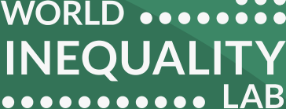

## **Coordinated by:** 

Lucas Chancel Ricardo Gómez-Carrera Rowaida Moshrif Thomas Piketty 

**Lead author:** Ricardo Gómez-Carrera 

## **Research team:** 

María José Pozos Daniel Sanchez-Ordonez 

**Data coordinator:** Rowaida Moshrif 

## **Statistical methods coordinator:** Ignacio Flores 

## **Data team:** 

Manuel Arias-Osorio Ignacio Flores Rowaida Moshrif Gastón Nievas Ana Van Der Ree 

**Communication manager:** Alice Fauvel 

**Report design:** Ricardo Gómez-Carrera 

## **Website and cover design:** 

Dataviz Centric 

## **This report draws on recent research articles written by:** 

Facundo Alvaredo; Marie Andreescu; Manuel Arias-Osorio; Luis Bauluz; Nitin Bharti; Thomas Blanchet; Philipp Bothe; Pierre Brassac; Julia Cagé; Lucas Chancel; Mauricio De Rosa; Jonas Dietrich; Dima El Hariri; Matthew Fisher-Post; Ignacio Flores; Valentina Gabrielli; Amory Gethin; Ricardo Gómez-Carrera; Sehyun Hong; Thanasak Mark Jenmana; Romaine Loubes; Clara Martínez-Toledano; Zhexun Mo; Cornelia Mohren; Marc Morgan; Rowaida Moshrif; Stella Muti; Theresa Neef; Gastón Nievas; Moritz Odersky; Thomas Piketty; Anne-Sophie Robilliard; Emmanuel Saez; Alice Sodano; Anmol Somanchi; Li Yang; Gabriel Zucman; Álvaro Zúñiga-Cordero 

## **The report also draws on the extensive work of researchers associated woth the World Inequality Lab** available at `https://inequalitylab.world/en/team/` and `https://wid.world/team/` 

**Translation team for the Executive Summary:** Pierre Brassac; Dima El Hariri; Ricardo Gómez-Carrera; Sehyun Hong; Enes Isik; Thanasak Mark Jenmana; Zhexun Mo; Cornelia Mohren; Rowaida Moshrif; Daniel Sanchez-Ordonez; Marta Sanduliak; Anmol Somanchi; Theo Palomo 

## **Editing:** 

Philip Dines Graham Frankland 

We thank our colleagues who provided inputs and feedback on preliminary versions of the report: Marie Andreescu, Manuel Arias-Osorio, Luis Bauluz, Pierre Brassac, Julia Cagé, Alice Fauvel, Valentina Gabrielli, Amory Gethin, Romaine Loubes, Clara Martínez-Toledano, Cornelia Mohren, Theresa Neef, Gastón Nievas, Theo Palomo, Quentin Parrinello, Anne-Sophie Robilliard, Giulia Varaschin, Gabriel Zucman, and Álvaro Zúñiga-Cordero. 

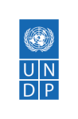

This report benefited from the support of the United Nations Development Programme, the World Inequality Lab, and the European Union under the Horizon 2020 WISE grant (#101095219) and the ERC Synergy DINA grant (#856455). The views expressed in this report do not necessarily reflect those of the United Nations Development Programme or other partner institutions. 

## World Inequality Lab, 2025 

Creative Commons Licence: _World Inequality Report 2026_ , CC BY-NC-SA 4.0 It is strictly prohibited to translate, transfer, or reproduce this report into any other language without the permission of the publishers. 

How to cite this report: Chancel, L., Gómez-Carrera, R., Moshrif, R., Piketty, T., et al. _World Inequality Report 2026_ , World Inequality Lab. `wir2026.wid.world` This report has a dedicated website. Explore it: `wir2026.wid.world` 

## **Contents** 

|**Contents**||**3**|
|---|---|---|
|**Foreword**||**6**|
|**Executive Summary**||**9**|
|Box 1: Highlights from the_World Inequality Report 2026_(WIR 2026) . . . . . . . . . . . . . .||10|
|The world is extremely unequal . . . . . .|. . . . . . . . . . . . . . . . . . . . . . . . . . .|12|
|Inequality and climate change . . . . . . .|. . . . . . . . . . . . . . . . . . . . . . . . . . .|12|
|Gender inequality . . . . . . . . . . . . .|. . . . . . . . . . . . . . . . . . . . . . . . . . .|13|
|Inequality between regions . . . . . . . .|. . . . . . . . . . . . . . . . . . . . . . . . . . .|13|
|Redistribution, taxation, and evasion. . . .|. . . . . . . . . . . . . . . . . . . . . . . . . . .|15|
|Inequality due to the global fnancial system|. . . . . . . . . . . . . . . . . . . . . . . . . .|16|
|Political cleavages and democracy . . . . .|. . . . . . . . . . . . . . . . . . . . . . . . . . .|17|
|Policy directions . . . . . . . . . . . . . .|. . . . . . . . . . . . . . . . . . . . . . . . . . .|18|
|Conclusion . . . . . . . . . . . . . . . . .|. . . . . . . . . . . . . . . . . . . . . . . . . . .|20|
|**Introduction**||**29**|
|**1** **Global Economic Inequality**||**33**|
|The world is becoming richer, but unequally|. . . . . . . . . . . . . . . . . . . . . . . . . .|35|
|Understanding inequality through population groups . . . . . . . . . . . . . . . . . . . . . .||35|
|Extreme and rising income inequality . . .|. . . . . . . . . . . . . . . . . . . . . . . . . . .|36|
|Wealth inequality is larger, more extreme, and rising faster . . . . . . . . . . . . . . . . . . .||38|
|Two centuries of persistent and extreme income inequality. . . . . . . . . . . . . . . . . . .||40|
|Regional inequality is stark both across and within regions . . . . . . . . . . . . . . . . . . .||42|
|Main takeaways . . . . . . . . . . . . . .|. . . . . . . . . . . . . . . . . . . . . . . . . . .|44|
|Box 1.1: Regions used in the_World Inequality Report 2026_ . . . . . . . . . . . . . . . . . . .||48|
|Box 1.2: The Inequality Transparency Index|. . . . . . . . . . . . . . . . . . . . . . . . . . .|49|
|**2** **Regional Income Inequality**||**51**|
|Global and regional shifts in income and population since 1800 . . . . . . . . . . . . . . . .||53|
|Income inequality across the world in 2025|. . . . . . . . . . . . . . . . . . . . . . . . . . .|55|
|Income inequality within regions in 2025 .|. . . . . . . . . . . . . . . . . . . . . . . . . . .|56|
|Income inequality within countries in 2025|. . . . . . . . . . . . . . . . . . . . . . . . . . .|59|
|The role of redistribution in reducing income inequality. . . . . . . . . . . . . . . . . . . . .||62|
|Main takeaways . . . . . . . . . . . . . .|. . . . . . . . . . . . . . . . . . . . . . . . . . .|64|
|Box 2.1: Country rankings for large countries according to per capita national income . . . .||68|
|Box 2.2: Country rankings according to per capita national income . . . . . . . . . . . . . .||69|
|**3** **Regional Wealth Inequality**||**73**|
|Wealth inequality trends across regions . .|. . . . . . . . . . . . . . . . . . . . . . . . . . .|75|
|Private wealth is rising while public wealth stagnates . . . . . . . . . . . . . . . . . . . . . .||78|
|The world distribution of wealth by region|. . . . . . . . . . . . . . . . . . . . . . . . . . .|80|
|Country-by-country patterns of wealth concentration . . . . . . . . . . . . . . . . . . . . .||83|

|Main takeaways . . . . . . . . . . . . . . . . . . . . . . . . . . . . . . .|. . . . . . . . . .|84|
|---|---|---|
|**4** **Gender Inequality**||**89**|
|Humanity works fewer hours, but the benefts are unequal across genders|. . . . . . . . . .|91|
|Female labor income shares remain well below equality . . . . . . . . . .|. . . . . . . . . .|92|
|Women work more hours everywhere. The gender gap is larger than we previously thought .||93|
|Women are employed less than men . . . . . . . . . . . . . . . . . . . .|. . . . . . . . . .|94|
|Employed women earn less than employed men . . . . . . . . . . . . . .|. . . . . . . . . .|95|
|The role of education in improving the gender gap . . . . . . . . . . . . .|. . . . . . . . . .|96|
|Main takeaways . . . . . . . . . . . . . . . . . . . . . . . . . . . . . . .|. . . . . . . . . .|100|
|**5** **Exorbitant Privilege**||**102**|
|The U.S. exorbitant privilege has evolved into a structural privilege of the rich world . . . . .||104|
|Rich countries are global fnancial rentiers by political design, not because of|market dynamics|105|
|Barriers for reducing inequality across countries . . . . . . . . . . . . . .|. . . . . . . . . .|106|
|Need for reforms in the international fnancial, trade, and monetary systems|. . . . . . . . .|107|
|Main takeaways . . . . . . . . . . . . . . . . . . . . . . . . . . . . . . .|. . . . . . . . . .|108|
|Box 5.1: Exorbitant duty is not so exorbitant . . . . . . . . . . . . . . . .|. . . . . . . . . .|113|
|**6** **Climate, a Capital Problem**||**115**|
|The carbon footprint of capital . . . . . . . . . . . . . . . . . . . . . . .|. . . . . . . . . .|117|
|Decarbonizing at home, burning fuels abroad? . . . . . . . . . . . . . . .|. . . . . . . . . .|120|
|Climate change already shapes the distribution of private and public wealth|. . . . . . . . . .|120|
|Climate policy and the future distribution of wealth . . . . . . . . . . . .|. . . . . . . . . .|122|
|Main takeaways . . . . . . . . . . . . . . . . . . . . . . . . . . . . . . .|. . . . . . . . . .|124|
|**7** **Global Taxation of Multi-Millionaires**||**128**|
|Why progressive taxation matters . . . . . . . . . . . . . . . . . . . . . .|. . . . . . . . . .|130|
|Regressivity at the top . . . . . . . . . . . . . . . . . . . . . . . . . . . .|. . . . . . . . . .|131|
|Safeguarding progressivity at the top . . . . . . . . . . . . . . . . . . . .|. . . . . . . . . .|132|
|Tax justice and the potential of a global wealth tax . . . . . . . . . . . . .|. . . . . . . . . .|133|
|Coordination between countries strengthens the feasibility of reducing tax evasion and|||
|avoidance . . . . . . . . . . . . . . . . . . . . . . . . . . . . . . .|. . . . . . . . . .|135|
|Main takeaways . . . . . . . . . . . . . . . . . . . . . . . . . . . . . . .|. . . . . . . . . .|136|
|Box 7.1: Explore the_Global Wealth Tax Simulator_ . . . . . . . . . . . . . .|. . . . . . . . . .|140|
|**8** **Political Cleavages**||**142**|
|Political representation of the working class is low and declining . . . . . .|. . . . . . . . . .|144|
|Income and education divides have disconnected in Western democracies|. . . . . . . . . .|144|
|Non-Western democracies have diferent structures of political division . .|. . . . . . . . . .|147|
|The return of geography in political confict: regional and rural–urban cleavages . . . . . . .||148|
|The explanatory power of geosocial class is stronger than ever. . . . . . .|. . . . . . . . . .|148|
|Main takeaways . . . . . . . . . . . . . . . . . . . . . . . . . . . . . . .|. . . . . . . . . .|149|
|**Glossary**||**156**|
|**Country-sheets**||**158**|
|Algeria . . . . . . . . . . . . . . . . . . . . . . . . . . . . . . . . . . . .|. . . . . . . . . .|159|
|Argentina . . . . . . . . . . . . . . . . . . . . . . . . . . . . . . . . . . .|. . . . . . . . . .|160|
|Australia . . . . . . . . . . . . . . . . . . . . . . . . . . . . . . . . . . .|. . . . . . . . . .|161|
|Bangladesh . . . . . . . . . . . . . . . . . . . . . . . . . . . . . . . . . .|. . . . . . . . . .|162|
|Brazil . . . . . . . . . . . . . . . . . . . . . . . . . . . . . . . . . . . . .|. . . . . . . . . .|163|
|Canada . . . . . . . . . . . . . . . . . . . . . . . . . . . . . . . . . . . .|. . . . . . . . . .|164|
|Chile . . . . . . . . . . . . . . . . . . . . . . . . . . . . . . . . . . . . .|. . . . . . . . . .|165|
|China . . . . . . . . . . . . . . . . . . . . . . . . . . . . . . . . . . . . .|. . . . . . . . . .|166|

|Colombia|. . . . . . . . . . . . . . . . . . . . . . . . . . . . . . . . . . . . . . . . . . . . . 167|
|---|---|
|Denmark|. . . . . . . . . . . . . . . . . . . . . . . . . . . . . . . . . . . . . . . . . . . . . 168|
|Egypt . .|. . . . . . . . . . . . . . . . . . . . . . . . . . . . . . . . . . . . . . . . . . . . . 169|
|France .|. . . . . . . . . . . . . . . . . . . . . . . . . . . . . . . . . . . . . . . . . . . . . 170|
|Germany|. . . . . . . . . . . . . . . . . . . . . . . . . . . . . . . . . . . . . . . . . . . . . 171|
|Hungary|. . . . . . . . . . . . . . . . . . . . . . . . . . . . . . . . . . . . . . . . . . . . . 172|
|India . .|. . . . . . . . . . . . . . . . . . . . . . . . . . . . . . . . . . . . . . . . . . . . . 173|
|Indonesia|. . . . . . . . . . . . . . . . . . . . . . . . . . . . . . . . . . . . . . . . . . . . . 174|
|Iran . . .|. . . . . . . . . . . . . . . . . . . . . . . . . . . . . . . . . . . . . . . . . . . . . 175|
|Italy . . .|. . . . . . . . . . . . . . . . . . . . . . . . . . . . . . . . . . . . . . . . . . . . . 176|
|Ivory Coast . . . . . . . . . . . . . . . . . . . . . . . . . . . . . . . . . . . . . . . . . . . . 177||
|Japan . .|. . . . . . . . . . . . . . . . . . . . . . . . . . . . . . . . . . . . . . . . . . . . . 178|
|Mexico .|. . . . . . . . . . . . . . . . . . . . . . . . . . . . . . . . . . . . . . . . . . . . . 179|
|Netherlands . . . . . . . . . . . . . . . . . . . . . . . . . . . . . . . . . . . . . . . . . . . 180||
|New Zealand . . . . . . . . . . . . . . . . . . . . . . . . . . . . . . . . . . . . . . . . . . . 181||
|Niger . .|. . . . . . . . . . . . . . . . . . . . . . . . . . . . . . . . . . . . . . . . . . . . . 182|
|Norway .|. . . . . . . . . . . . . . . . . . . . . . . . . . . . . . . . . . . . . . . . . . . . . 183|
|Pakistan|. . . . . . . . . . . . . . . . . . . . . . . . . . . . . . . . . . . . . . . . . . . . . 184|
|Philippines . . . . . . . . . . . . . . . . . . . . . . . . . . . . . . . . . . . . . . . . . . . . 185||
|Poland .|. . . . . . . . . . . . . . . . . . . . . . . . . . . . . . . . . . . . . . . . . . . . . 186|
|Russia .|. . . . . . . . . . . . . . . . . . . . . . . . . . . . . . . . . . . . . . . . . . . . . 187|
|South Africa . . . . . . . . . . . . . . . . . . . . . . . . . . . . . . . . . . . . . . . . . . . 188||
|South Korea . . . . . . . . . . . . . . . . . . . . . . . . . . . . . . . . . . . . . . . . . . . 189||
|Spain . .|. . . . . . . . . . . . . . . . . . . . . . . . . . . . . . . . . . . . . . . . . . . . . 190|
|Sweden.|. . . . . . . . . . . . . . . . . . . . . . . . . . . . . . . . . . . . . . . . . . . . . 191|
|Taiwan .|. . . . . . . . . . . . . . . . . . . . . . . . . . . . . . . . . . . . . . . . . . . . . 192|
|Thailand|. . . . . . . . . . . . . . . . . . . . . . . . . . . . . . . . . . . . . . . . . . . . . 193|
|Türkiye .|. . . . . . . . . . . . . . . . . . . . . . . . . . . . . . . . . . . . . . . . . . . . . 194|
|U.A.E . .|. . . . . . . . . . . . . . . . . . . . . . . . . . . . . . . . . . . . . . . . . . . . . 195|
|United Kingdom . . . . . . . . . . . . . . . . . . . . . . . . . . . . . . . . . . . . . . . . . 196||
|United States . . . . . . . . . . . . . . . . . . . . . . . . . . . . . . . . . . . . . . . . . . . 197||
|Vietnam|. . . . . . . . . . . . . . . . . . . . . . . . . . . . . . . . . . . . . . . . . . . . . 198|
|**Appendix**|**199**|
|Appendix|1. Concepts of income and wealth inequality used in this report . . . . . . . . . . 200|
|Appendix|2. The_World Inequality Database_and the_Distributional National Accounts Project_ . . 200|
|Appendix|3. The rich ecosystem of global inequality datasets . . . . . . . . . . . . . . . . . 201|
|Appendix|4. The relationship between gross domestic product, national income, and national|
|wealth . . . . . . . . . . . . . . . . . . . . . . . . . . . . . . . . . . . . . . . . . . . 202||
|Appendix|5. Comparing incomes, assets, and purchasing power across the globe . . . . . . . 203|
|Appendix|6. Forecasting 2025 . . . . . . . . . . . . . . . . . . . . . . . . . . . . . . . . . . 203|
|Appendix|7. How do we measure wealth inequality within countries? . . . . . . . . . . . . . 204|
|Appendix|8. Methodology for measuring female labor income share . . . . . . . . . . . . . . 204|

## **FOREWORD** 

# **By Jayati Ghosh and Joseph Stiglitz** 

Foreword 

## **Foreword by Jayati Ghosh and Joseph E. Stiglitz** 

Since 2018, the _World Inequality Reports_ have become a landmark in global public discussions on inequality. They have reshaped how citizens, policymakers, and scholars understand the scale, causes, and consequences of inequality in today’s world. 

This _World Inequality Report_ , like its predecessors, is the result of an extraordinary collective effort. Drawing on the work of more than 200 researchers across all continents, affiliated with the _World Inequality Database_ , it offers essential insights into how our economies function—and provides pointers on how they can function more fairly. This 2026 edition comes at a critical time. Around the world, living standards are stagnating for many, while wealth and power are even more concentrated at the very top. Independent research is under threat in places where academic freedom once seemed secure. These developments are connected: rising inequality undermines trust, weakens our democracies, and fuels discontent. 

The data presented here are striking. The richest 10% of the global population own close to three-quarters of all wealth, while the poorest half hold barely 2%. Fewer than 60,000 multi-millionaires now control three times more wealth than half of humanity combined. Within most countries, the bottom 50% rarely possess more than 5% of national wealth. 

The report also shows that the wealthiest contribute disproportionately little to public finances. Effective tax rates climb for most of the population but fall sharply for billionaires and centi-millionaires. This not only undermines tax justice; it deprives societies of the resources needed for education, healthcare, and climate action. 

Across its chapters, the report explores how inequality manifests far beyond wealth, in gender, opportunity, or climate. As shown in **Chapter 4** , women capture just over a quarter of global labor income, even though time use surveys suggest that they work for longer hours than men, often in an unpaid form. If unpaid domestic and care work is 

included, they earn only about one-third as much per working hour as men. Inequality of opportunity is also staggering: while the per capita income gap between Europe and Sub-Saharan Africa is roughly tenfold, the gap in public education expenditure per school-age student is nearly thirty-fivefold. Today’s inequality of opportunity fuels tomorrow’s inequality of outcomes. 

Climate inequality underscores this further. According to **Chapter 6** , the richest 10% of individuals account for 77% of the carbon emissions associated with private capital and 47% of consumption-related emissions, while the poorest half contribute just 3% (and 10% of consumption-based emissions). Climate change also hits the poor hardest: measured relative to their income, the bottom 50% bear about 75% of global climate-driven income losses. These figures make clear that inequality lies at the heart of today’s social and environmental crises. 

Deep structural imbalances persist between the Global North and South. As detailed in **Chapter 5** , each year, poorer nations transfer more than one percent of world GDP to richer ones through debt service, profit repatriation, and financial flows—this is approximately three times more than development aid flowing in the opposite direction. 

The result is a system where resources extracted from labor and nature in low-income countries continue to sustain the prosperity and the unsustainable lifestyle of people in high-income economies and rich elites across countries. These patterns are not accidents of markets. Rather, they reflect the legacy of history, but even more the functioning of institutions, regulations, and policies—all of which are related to unequal power relations that have yet to be rebalanced. 

History, experiences across countries, and theory all show that today’s extreme inequality is not inevitable. Progressive taxation, strong social investment, fair labor standards, and democratic institutions have narrowed gaps in the past—and can do so again. The _World Inequality Report_ provides the empirical foundation and intellectual framework for what can be done. 

In November 2025, together with a 

7 

Foreword 

group of inequality scholars, we were invited by the President of South Africa, chair of the G20, to propose new ways to tackle global inequality. We called for an International Panel on Inequality—an independent body of experts, supported by governments, bringing together the work of researchers across the world to track inequality worldwide, consider the drivers of inequality, and provide objective, evidence-based recommendations for policymakers. We cannot address today’s inequalities effectively without such a knowledge base. The World Inequality Lab is an important example of such work and the way forward. 

This report sets a high standard for evidence-based policymaking. It reminds us that inequality is not destiny, but choice—and that with serious, independent research, and political will, fairer and more sustainable societies are within reach. 

## Jayati Ghosh and Joseph E. Stiglitz 

8 

# **EXECUTIVE SUMMARY** 

Executive Summary 

## Box 1: Highlights from the _World Inequality Report 2026_ (WIR 2026) 

The _World Inequality Report 2026_ (WIR 2026) marks the third edition in this flagship series, following the 2018 and 2022 editions. These reports draw from the work of over 200 scholars from all over the world, affiliated with the World Inequality Lab and contributing to the largest database on the historical evolution of global inequality. This collective endeavor represents a significant contribution to global discussions on inequality. The team has helped reshape how policymakers, scholars, and citizens understand the scale and causes of inequality, foregrounding the separatism of the global rich and the urgent need for top-end tax justice. Their findings have informed national and international debates on fiscal reform, wealth taxation, and redistribution in forums from national parliaments to the G20. 

Building on that foundation, WIR 2026 expands the horizon. It explores new dimensions of inequality that define the 21st century: climate and wealth, gender disparities, unequal access to human capital, the asymmetries of the global financial system, and the territorial divides that are redrawing democratic politics. Together, these themes reveal that inequality today is not confined to income or wealth; it affects every domain of economic and social life. 

The global inequality in access to human capital remains enormous today, likely a much wider gap than most people would imagine. Average education spending per child in Sub-Saharan Africa stood at around just €200 (purchasing power parity, PPP), compared with €7,400 in Europe and €9,000 in North America & Oceania: a gap of more than 1 to 40, i.e., approximately three times as much as the gap in per capita GDP. Such disparities shape life chances across generations, entrenching a geography of opportunity that exacerbates and perpetuates global wealth hierarchies. 

The report also shows that contributions to climate change are far from evenly distributed. While public debate often focuses on emissions associated with consumption, new studies have revealed how capital ownership plays a critical role in the inequality of emissions. The global wealthiest 10% of individuals account for 77% of global emissions associated with private capital ownership and 47% of global emissions associated with their consumption[1] , underscoring how the climate crisis is closely tied to the concentration of wealth. Addressing it requires a targeted realignment of the financial and investment structures that fuel both emissions and inequality. 

Gender inequality also looks starkly different if we take into account invisible, unpaid labor, which is disproportionately undertaken by women. When unpaid domestic and care labor is included, the gap widens sharply. On average, women earn only 32% of what men earn per working hour, accounting for both paid and unpaid activities; compared to 61% when not accounting for unpaid domestic labor. These findings reveal not only persistent discrimination but also deep inefficiencies in how societies value and allocate labor. 

At the international level, WIR 2026 documents how the global financial system reinforces inequality. Wealthy economies continue to benefit from an “exorbitant privilege”: each year, around 1% of global GDP (approximately three times as much as development aid) flows from poorer to richer nations through net foreign income transfers associated with persistent excess yields and lower interest payments on rich-country liabilities. Reversing this dynamic is central to any credible strategy for global equity. 

Finally, the report highlights the rise of territorial divides within countries. In many advanced democracies, gaps in political affiliations between large metropolitan centers and smaller towns have reached levels unseen in a century. Unequal access to public 

10 

Executive Summary 

services, job opportunities, and exposure to trade shocks has fractured social cohesion and weakened the coalitions necessary for redistributive reform. 

Besides a wealth of novel data, WIR 2026 provides a framework for understanding how economic, environmental, and political inequalities intersect. It calls for renewed global cooperation to tackle these divides at their roots: through progressive taxation, investment in human capabilities, climate accountability tied to private capital ownership, and inclusive political institutions capable of rebuilding trust and solidarity. 

11 

Executive Summary 

Inequality has long been a defining feature of the global economy, but by 2025, it has reached levels that demand urgent attention. The benefits of globalization and economic growth have flowed disproportionately to a small minority, while much of the world’s population still face difficulties in achieving stable livelihoods. These divides are not inevitable. They are the outcome of political and institutional choices. 

This report draws on the _World Inequality Database_ and new research to provide a comprehensive picture of inequality across income, wealth, gender, international finance, climate responsibility, taxation, and politics.[2] The findings are clear: inequality remains extreme and persistent; it manifests across multiple dimensions that intersect and reinforce one another; and it reshapes democracies, fragmenting coalitions and eroding political consensus. Yet the data also demonstrate that inequality can be reduced. Policies such as redistributive transfers, progressive taxation, investment in human capital, and stronger labor rights have made a difference in some contexts. Proposals such as minimum wealth taxes on multi-millionaires illustrate the scale of resources that could be mobilized to finance education, health, and climate adaptation. Reducing inequality is not only about fairness but also essential for the resilience of economies, the stability of democracies, and the viability of our planet. 

## **The world is extremely unequal** 

The first and most striking fact emerging from the data is that inequality remains at very high levels. **Figure 1** illustrates that, today, the top 10% of the global population’s income-earners earn more than the remaining 90%, while the poorest half of the global population captures less than 10% of the total global income. Wealth is even more concentrated: the top 10% own three-quarters of global wealth, while the bottom half holds only 2%. 

multi-millionaires, control today three times more wealth than half of humanity combined. Their share has grown steadily from almost 4% in 1995 to over 6% today, which underscores the persistence of inequality. 

This concentration is not only persistent, but it is also accelerating. **Figure 3** shows that extreme wealth inequality is rapidly increasing. Since the 1990s, the wealth of billionaires and centi-millionaires has grown at approximately 8% annually, nearly twice the rate of growth experienced by the bottom half of the population. The poorest have made modest gains, but these are overshadowed by the extraordinary accumulation at the very top. 

The result is a world in which a tiny minority commands unprecedented financial power, while billions remain excluded from even basic economic stability. 

## **Inequality and climate change** 

The climate crisis is a collective challenge but also a profoundly unequal one. **Figure 4** shows that the poorest half of the global population accounts for only 3% of carbon emissions associated with private capital ownership (and 10% of emissions associated with consumption), while the top 10% account for 77% of emissions associated with private capital ownership (and 47% of consumption-based emissions). The wealthiest 1% alone account for 41% of private capital ownership emissions, almost double the amount of the entire bottom 90% combined. 

Climate inequality is also about vulnerability. Those who emit the least, largely populations in low-income countries, are also those most exposed to climate shocks. Meanwhile, those who emit the most are better insulated, with resources to adapt to or avoid the consequences of climate change. This unequal responsibility is therefore also an unequal distribution of risk. Climate inequality is both an environmental and a social crisis. 

The picture becomes even more extreme when we move beyond the top 10%. **Figure 2** illustrates that the wealthiest 0.001% alone, fewer than 60,000 

12 

Executive Summary 

## **Figure 1. The world is extremely unequal** 

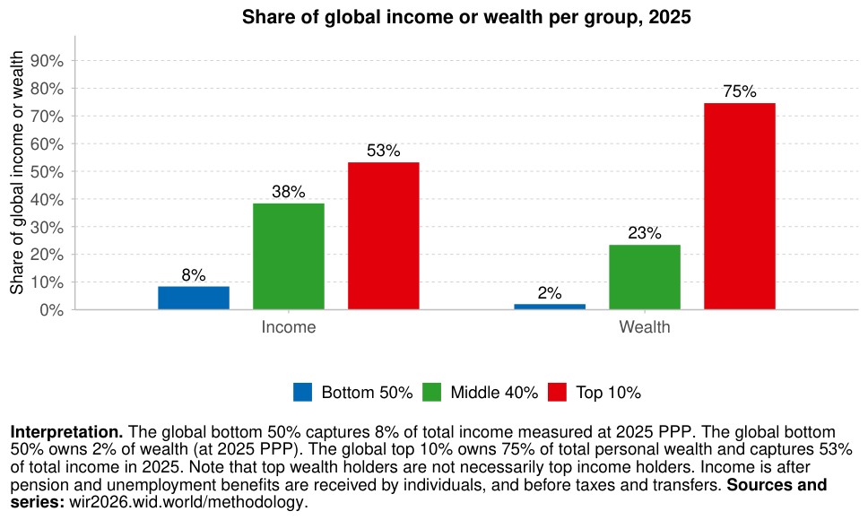

**----- Start of picture text -----** 
Share of global income or wealth per group, 2025 90% 80% 75% 70% 60% 53% 50% 38% 40% 30% 23% 20% 8% 10% 2% 0% Income Wealth Bottom 50% Middle 40% Top 10% Interpretation.  The global bottom 50% captures 8% of total income measured at 2025 PPP. The global bottom 50% owns 2% of wealth (at 2025 PPP). The global top 10% owns 75% of total personal wealth and captures 53% of total income in 2025. Note that top wealth holders are not necessarily top income holders. Income is after pension and unemployment benefits are received by individuals, and before taxes and transfers.  Sources and series:  wir2026.wid.world/methodology. Share of global income or wealth **----- End of picture text -----** 

## **Gender inequality** 

Inequality is not only a question of income, wealth, or emissions. It is also embedded in the structures of everyday life, shaping whose work is recognized, whose contributions are rewarded, and whose opportunities are constrained. Among the most persistent and pervasive divides is the gap between men and women. 

Globally, women capture just over a quarter of total labor income, a share that has barely shifted since 1990. When analyzed by regions ( **Figure 5** ), in the Middle East & North Africa, women’s share is only 16%; in South & Southeast Asia it is 20%; in Sub-Saharan Africa, 28%; and in East Asia, 34%. Europe, North America & Oceania, as well as Russia & Central Asia, perform better, but women still capture only about 40% of labor income. 

Women continue to work more and earn less than men. **Figure 6** shows that women work more hours than men, on average 53 hours per week compared to 43 for men, once domestic and care work is taken into account. Yet their work is consistently valued less. Excluding unpaid work, women 

earn only 61% of men’s hourly income; when unpaid labor is included, this figure falls to just 32%. These disproportionate responsibilities restrict women’s career opportunities, limit political participation, and slow wealth accumulation. Gender inequality is therefore not only a question of fairness but also a structural inefficiency: economies that undervalue half of their population’s labor undermine their own capacity for growth and resilience. 

## **Inequality between regions** 

The global averages conceal enormous divides between regions. **Figure 7** shows that the world is split into clear income tiers: high-income regions such as North America & Oceania and Europe; middle-income groups including Russia & Central Asia, East Asia, and the Middle East & North Africa; and very populous regions where average incomes remain low, such as Latin America, South & Southeast Asia, and Sub-Saharan Africa. 

The contrasts are stark, even when correcting for price differences across regions. An average person in North 

13 

Executive Summary 

**Figure 2. Extreme wealth inequality is persistent and increasing** 

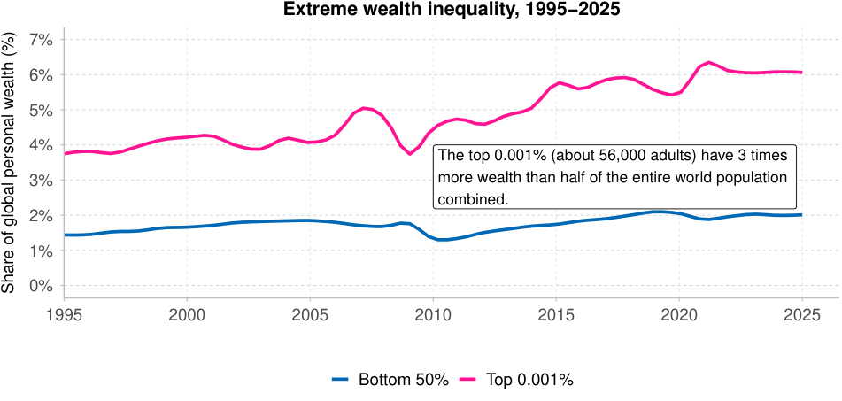

**----- Start of picture text -----** 
Extreme wealth inequality, 1995−2025 7% 6% 5% 4% The top 0.001% (about 56,000 adults) have 3 times 3% more wealth than half of the entire world population combined. 2% 1% 0% 1995 2000 2005 2010 2015 2020 2025 Bottom 50% Top 0.001% Share of global personal wealth (%) **----- End of picture text -----** 

**Interpretation.** The share of personal wealth held by the richest 0.001% of adults rose from around 3.8% of total wealth in 1995 to nearly 6.1% in 2025. After a very slight increase, the share of wealth owned by the poorest half of the population has stagnated since the early 2000s at around 2%. Net personal wealth is equal to the sum of financial assets (e.g. equity or bonds) and non−financial assets (e.g. housing or land) owned by individuals, net of their debts. **Sources and series:** Arias−Osorio et al. (2025) and wir2026.wid.world/methodology. 

America & Oceania earns about thirteen times more than someone in Sub-Saharan Africa and three times more than the global average. Put differently, average daily income in North America & Oceania is about €125, compared to only €10 in Sub-Saharan Africa. And these are averages: within each region, many people live with far less. 

**Figure 8** highlights this point by showing the distribution of income and wealth within regions. Income is distributed unequally everywhere, with the top 10% consistently capturing far more than the bottom 50%. But when it comes to wealth, the concentration is even more extreme. Across all regions, the wealthiest 10% control well over half of total wealth, often leaving the bottom half with only a tiny fraction. 

Inequality is enormous both across regions and within them. Some regions, like North America & Oceania, enjoy higher average income and wealth than the world average, yet still exhibit large internal disparities. Others, like Sub-Saharan Africa, face the double burden of low average levels and extreme internal inequality. 

A distinctive strength of the _World_ 

_Inequality Database_ (wid.world) is its ability to track income and wealth across the entire distribution, from the poorest individuals to the very richest, while also providing information at the country level for several years. This makes it possible to examine inequality not only between and across regions, but also within and across individual countries. 

**Figure 9** illustrates this with the top 10%/bottom 50% (T10/B50) income ratio, a straightforward yet powerful measure that asks: On average, how many times more does the top 10% earn compared to the poorest half? The answer reveals large inequalities within countries. 

While inequality within countries is severe everywhere, its intensity follows clear patterns. Europe and much of North America & Oceania are among the least unequal, though even here, the top groups capture far more income than the bottom half. The United States stands out as an exception, with higher levels of inequality than its high-income peers. At the other end of the spectrum, Latin America, southern Africa, and the Middle East & North Africa combine low incomes for the bottom 50% 

14 

Executive Summary 

**Figure 3. Wealth has grown much more for the already extremely wealthy** 

**----- Start of picture text -----** 
The wealth growth incidence curve, 1995−2025 9% Richest 1/100 million 8% (Top 50) 7% 6% 5% Top 0.001% 4% 3% 2% 1% 10 20 30 40 50 60 70 80 90 99 99.9 99.99 99.999 Global wealth group 1995−2025, net of inflation Per adult annual growth rate in wealth, **----- End of picture text -----** 

**Interpretation.** Growth rates in net personal wealth varied sharply across the global distribution between 1995 and 2025. While the bottom 50% experienced positive growth of around 2%−4% per year, their low initial wealth meant that they captured only 1.1% of total global wealth growth. In contrast, the top 1% experienced significantly higher growth rates, ranging from 2% to 8.5% annually, and captured 36.7% of global wealth growth during the same period. The very top of the distribution, including the wealthiest 60 individuals, had the steepest increases. Net personal wealth is defined as the sum of financial (e.g., equity, bonds) and non−financial assets (e.g., housing, land) owned by individuals, net of their debts. **Notes.** The curve is smoothed using a centered moving average. **Sources and series:** Arias−Osorio et al. (2025), Chancel et al. (2022), and wir2026.wid.world/methodology. 

with extreme concentration at the top, which yields some of the highest T10/B50 income gaps worldwide. 

## **Redistribution, taxation, and evasion** 

Studying inequality across countries and over time reveals that policy can indeed reduce inequality. **Figure 10** shows how progressive taxation and, especially, redistributive transfers have significantly reduced inequality in every region, particularly when systems are well designed and consistently applied. In Europe and North America & Oceania, tax-and-transfer systems consistently cut income gaps by more than 30%. Even in Latin America, redistributive policies introduced after the 1990s have made large progress in narrowing gaps. The evidence shows that in every region, redistributive policies have been effective in reducing inequality, but with large variations. 

The global inequality in access to human capital remains enormous: it stands at levels that are arguably much larger than most people imagine. In 2025, average education 

spending per child in Sub-Saharan Africa stood at just €220 (PPP), compared with €7,430 in Europe and €9,020 in North America & Oceania (see **Figure 11** ) (a gap of more than 1 to 40, i.e., approximately three times as much as the gap in per capita GDP or net national income-NNI-). Such disparities shape life chances across generations, entrenching a geography of opportunity that exacerbates and perpetuates global wealth hierarchies. 

In addition, taxation often fails where it is most needed: at the very top of the distribution. **Figure 12** reveals how the ultra-rich escape taxation. Effective income tax rates climb steadily for most of the population but fall sharply for billionaires and centi-millionaires. These elites pay proportionally less than most of the households that earn much lower incomes. This regressive pattern deprives states of resources for essential investments in education, healthcare, and climate action. It also undermines fairness and social cohesion by decreasing trust in the tax system. Progressive taxation is therefore crucial: it not only mobilizes revenues to 

15 

Executive Summary 

**Figure 4. The wealthiest account for a disproportionate share of global emissions** 

**Emissions shares by groups** 90% 80% ~~77%~~ 70% 60% 50% ~~43% 47%~~ 41% 40% 30% 20% 20% ~~15%~~ 10% 10% ~~3%~~ 0% Bottom 50% Middle 40% Top 10% Top 1% Consumption Private ownership **Interpretation.** The figure shows the share of global GHG emissions attributable to the bottom 50% and the top 1% of the world population. Emissions are separated into consumption−based (emissions from production attributed to final consumers) and ownership−based (scope 1 emissions from firms and assets owned by individuals). Private ownership−based emissions (representing around 60% of total emissions) do not include government−owned or direct household emissions. The total volume of emissions covered by the ownership−based approach is relatively close to that explicitly accounted for in the consumption−based approach presented here. The latter assumes that emissions associated with government activities and investments, typically representing 30%–40% of total emissions are distribution−neutral (Bruckner et al. (2022)). Groups are defined by consumption−based emissions and wealth respectively, but both distributions are highly correlated. **Sources and series:** Bruckner et al. (2022) and Chancel and Rehm (2025b). 

finance public goods and reduce inequality, but also strengthens the legitimacy of fiscal systems by ensuring that those with the greatest means contribute their fair share. 

## **Inequality due to the global financial system** 

Inequality is also deeply embedded in the global financial system. **Figure 13** illustrates how the current international financial architecture is structured in ways that systematically generate inequality. Countries that issue reserve currencies can persistently borrow at lower costs, lend at higher rates, and attract global savings. By contrast, developing countries face the mirror image: expensive debts, low-yield assets, and a continuous outflow of income. 

This privilege for rich nations does not reflect market efficiency but rather institutional design that places reserve currency issuers and financial centers at the core of the international financial system, to the benefit of wealthy economies. Persistent demand for “safe” assets such as U.S. Treasuries and European sovereign 

bonds, reinforced by central bank reserves, regulatory standards (i.e., Basel III), and the judgments of credit rating agencies, locks in this advantage (see **Figure 14** ). The result is that rich countries consistently borrow more cheaply while investing in higher-yielding assets abroad, positioning themselves as financial rentiers at the expense of poorer nations. 

The outcome is a modern form of structurally unequal exchange. While colonial powers once extracted resources to transform deficits into surpluses, today’s advanced economies achieve similar results through the financial system. Developing countries are driven to transfer resources outward, constrained in their ability to invest in education, healthcare, and infrastructure. This dynamic not only entrenches global inequality but also increases inequality within nations, as fiscal space for inclusive development is eroded. 

16 

Executive Summary 

## **Figure 5. Women persistently receive lower labor income than men everywhere** 

**----- Start of picture text -----** 
Female labor income shares, 1990−2025 60% Gender parity 50% 40% 40% 40% 36% 37% 34% 30% 28% 20% 20% 16% 10% 0% Middle East  South & Sub− East  Latin  Russia & Europe North & North  Southeast Saharan Asia America Central  America Africa Asia Africa Asia & Oceania 1990 2000 2010 2020 2025 Interpretation.  This figure shows the evolution of the female labor income share between 1990 and 2025 across world regions. In 2025, female workers earn about 16% of total labor income in the Middle East & North Africa, but about 40% in North America & Oceania and Europe. At the global level, women earned 27.8% of labor income in 1990 and 28.2% in 2025. While some progress has been made, gender parity remains distant in all regions. Sources and series:  Neef and Robilliard (2021), Gabrielli et al. (2024), and wir2026.wid.world/methodology. Female labor income share (%) **----- End of picture text -----** 

## **Political cleavages and democracy** 

Economic divides do not stop at the marketplace; they spill directly into politics. Inequality shapes who is represented, whose voices carry weight, and how coalitions are built, or fail to be built. **Figure 15** shows how the traditional class-based alignment of politics in Western democracies has broken down.[3] In the mid-20th century, lower-income and less educated voters largely supported left-wing parties, while wealthier and more educated groups leaned right, creating a clear class divide and rising redistribution. 

Today, that pattern has fractured. First, education and income now point in different directions (see **Figure 15** ), making broad coalitions for redistribution far harder to sustain. This evolution can be accounted for by the fact that educational expansion has come with a complexification of the class structure. For example, many high-degree but relatively low-income voters (e.g., teachers or nurses) currently vote for the left, while many voters with lower degrees but relatively higher income (e.g., 

self-employed or truck drivers) tend to vote for the right. 

The even more striking evolution is the rise of territorial divides within countries. In many advanced democracies, gaps in political affiliations between large metropolitan centers and smaller towns have reached levels unseen in a century (see **Figure 16** ). Unequal access to public services (education, health, transportation, and other infrastructures), job opportunities, and exposure to trade shocks has fractured social cohesion and weakened the coalitions necessary for redistributive reform. As a consequence, working-class voters are now fragmented across parties on both sides of the aisle or left without strong representation, which limits their political influence and entrenches inequality. In order to reactivate the redistributive coalitions of the postwar era, it is critical to design more ambitious policy platforms benefiting all territories, as they successfully did in the past. 

This fragmentation erodes the political foundations needed to tackle inequality 

17 

Executive Summary 

**Figure 6. After including domestic labor, women earn only 32% of men’s hourly income** 

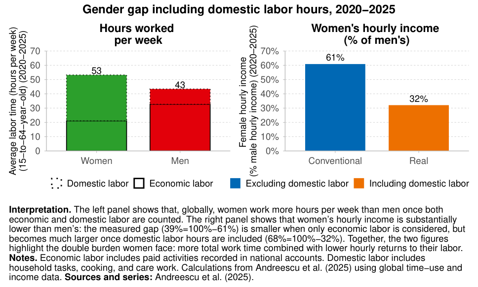

**----- Start of picture text -----** 
Gender gap including domestic labor hours, 2020−2025 Hours worked  Women's hourly income per week (% of men's) 70 70% 61% 60 60% 53 50 50% 43 40 40% 32% 30 30% 20 20% 10 10% 0 0% Women Men Conventional Real Domestic labor Economic labor Excluding domestic labor Including domestic labor Interpretation.  The left panel shows that, globally, women work more hours per week than men once both economic and domestic labor are counted. The right panel shows that women’s hourly income is substantially lower than men’s: the measured gap (39%=100%−61%) is smaller when only economic labor is considered, but becomes much larger once domestic labor hours are included (68%=100%−32%). Together, the two figures highlight the double burden women face: more total work time combined with lower hourly returns to their labor. Notes.  Economic labor includes paid activities recorded in national accounts. Domestic labor includes household tasks, cooking, and care work. Calculations from Andreescu et al. (2025) using global time−use and income data.  Sources and series:  Andreescu et al. (2025). Female hourly income (15−to−64−year−old) (2020−2025) Average labor time (hours per week) (% male hourly income) (2020–2025) **----- End of picture text -----** 

and prevents the implementation of **Policy directions** redistributive policies. Meanwhile, the influence of wealth in politics compounds The evidence the inequality in political influence. **Figure 17** inequality can shows how campaign financing is heavily concentrated among the top earners: in countries like France and South Korea, the One richest 10% of citizens disproportionately investments provide the majority of political donations. These are This concentration of financial power amplifies elite voices, narrows the space remains uneven for equitable policymaking, and further investment in marginalizes the working majority. 

The evidence makes one conclusion clear: inequality can be reduced. There are a range of policies that, in different ways, have proven effective in narrowing gaps. 

One important avenue is through public investments in education and health. These are among the most powerful equalizers, yet access to these basic services remains uneven and stratified. Public investment in free, high-quality schools, universal healthcare, childcare, and nutrition programs can reduce early-life disparities and foster lifelong learning opportunities. By ensuring that talent and effort, rather than background, determine life chances, such investments build more inclusive and resilient societies. 

Reducing inequality is a political choice. But fragmented electorates, underrepresentation of workers, and the outsized influence of wealth all work against the coalitions needed for reform. This reality can change. It reflects political choices about campaign finance rules, party strategies, and institutional design that can be reshaped with sufficient will. Building the conditions for consensus is therefore as central to reducing inequality as any specific policy instrument. 

Another path is through redistributive programs. Cash transfers, pensions, unemployment benefits, and targeted support for vulnerable households can directly shift resources from the top to the bottom of the distribution. Where well designed, such measures have narrowed 

18 

Executive Summary 

**Figure 7. Inequality between regions is also immense** 

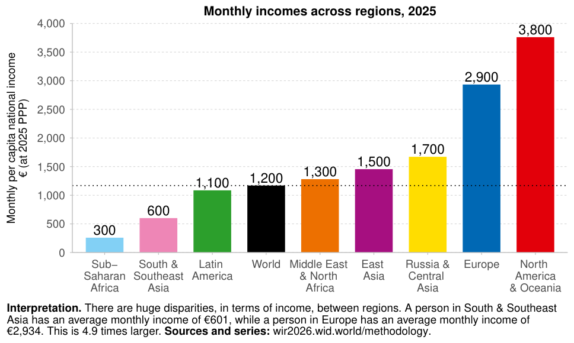

**----- Start of picture text -----** 
Monthly incomes across regions, 2025 4,000 3,800 3,500 3,000 2,900 2,500 2,000 1,700 1,500 1,500 1,300 1,200 1,100 1,000 600 500 300 0 Sub− South & Latin  World Middle East  East  Russia & Europe North Saharan Southeast America & North  Asia Central  America Africa Asia Africa Asia & Oceania Interpretation.  There are huge disparities, in terms of income, between regions. A person in South & Southeast Asia has an average monthly income of €601, while a person in Europe has an average monthly income of €2,934. This is 4.9 times larger.  Sources and series:  wir2026.wid.world/methodology. € (at 2025 PPP) Monthly per capita national income **----- End of picture text -----** 

income gaps, strengthened social cohesion, and provided buffers against shocks, especially in regions with weaker welfare states. 

Progress can also come from advancing gender equality. Reducing gender gaps requires dismantling the structural barriers that shape how work is valued and distributed. Policies that recognize and redistribute unpaid care work, through affordable childcare, parental leave that includes fathers, and pension credits for caregivers, are essential to leveling the playing field. Equally important are the strict enforcement of equal pay and stronger protections against workplace discrimination. Addressing these imbalances ensures that opportunities and rewards are not determined by gender but by contribution and capability. 

Climate policy offers another key dimension: when poorly designed, it can enhance inequality, but well planned, it can also reduce it. Climate subsidies coupled with progressive taxation have the potential to accelerate the adoption of low-carbon technologies in a fair way. Taxes and regulations on luxury consumption 

or high-carbon investments can also help reduce emissions levels among the wealthiest groups. Tax policy is another powerful lever. Fairer tax systems, where those at the very top contribute at higher rates through progressive taxes, not only mobilize resources but also strengthen fiscal legitimacy. Even modest rates of a global minimum tax on billionaires and centi-millionaires could raise between 0.45% and 1.11% of global GDP (see **Figure 18** ) and could finance transformative investments in education, healthcare, and climate adaptation. 

Inequality can also be reduced by reforming the global financial system. Current arrangements allow advanced economies to borrow cheaply and secure steady inflows, while developing economies face costly liabilities and persistent outflows. Reforms such as adopting a global currency, centralized credit and debit systems, and corrective taxes on excessive surpluses would expand fiscal space for social investment and reduce the unequal exchange that has long defined global finance. 

19 

Executive Summary 

**Figure 8. Income and, even more, wealth are extremely concentrated at the top in every region** 

**Inequality within regions, 2025 Income Wealth** 80% 80% 70% 70% 60% 60% 50% 50% 40% 40% 30% 30% 20% 20% 10% 10% 0% 0% Bottom 50% Middle 40% Top 10% **Interpretation.** In every region, income and wealth are distributed very unequally within regions. Wealth is much more concentrated at the top than income.The figures are arranged according to top 10% shares. Income is measured after pension and unemployment benefits are received by individuals, but before income taxes and other transfers. Net personal wealth is the sum of financial (e.g., equity, bonds) and non−financial assets (e.g., housing, land) owned by individuals, net of debts. **Notes.** EASA: East Asia, EURO: Europe, LATA: Latin America, MENA: Middle East & North Africa, NAOC: North America & Oceania, SSEA: South & Southeast Asia, SSAF: Sub−Saharan Africa, and RUCA: Russia & Central Asia. **Sources and series:** wir2026.wid.world/methodology. 

## **Conclusion** 

Inequality is a political choice. It is the result of our policies, institutions, and governance structures. The costs of escalating inequality are clear: widening divides, fragile democracies, and a climate crisis borne most heavily by those least responsible. But the possibilities of reform are equally clear. Where redistribution is strong, taxation is fair, and social investment is prioritized, inequality narrows. 

The tools exist. The challenge is political will. The choices we make in the coming years will determine whether the global economy continues down a path of extreme concentration or moves toward shared prosperity. 

20 

Executive Summary 

**Figure 9. Some countries face the double burden of low incomes and very high inequality** 

**----- Start of picture text -----** 
Top 10/bottom 50 income gaps across the world, 2025 **----- End of picture text -----** 

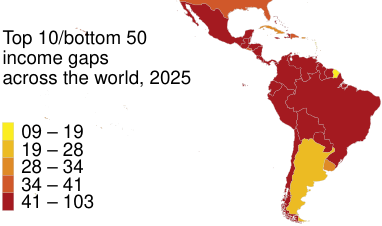

**----- Start of picture text -----** 
Top 10/bottom 50 income gaps across the world, 2025 09 – 19 19 – 28 28 – 34 34 – 41 41 – 103 **----- End of picture text -----** 

**Interpretation.** This map shows the ratio between the average income of the top 10% and the average income of the bottom 50% of the population in each country in 2025. Income is measured after pension and unemployment benefits are received by individuals, but before other taxes they pay and transfers they receive. **Sources and series:** wir2026.wid.world/methodology and Chancel and Piketty (2021). 

**Figure 10. Inequality can be reduced with progressive taxation and transfers** 

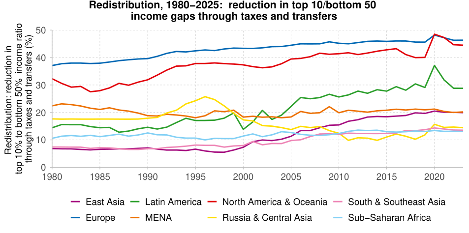

**----- Start of picture text -----** 
Redistribution, 1980−2025:  reduction in top 10/bottom 50 income gaps through taxes and transfers 50 40 30 20 10 0 1980 1985 1990 1995 2000 2005 2010 2015 2020 East Asia Latin America North America & Oceania South & Southeast Asia Europe MENA Russia & Central Asia Sub−Saharan Africa Redistribution: reduction in through taxes and transfers (%)  top 10% to bottom 50%  income ratio **----- End of picture text -----** 

**Intepretation.** The figure shows the impact of taxes and transfers on inequality across regions, measured by the reduction in the top 10% to bottom 50% income ratio (a positive value indicates inequality reduction). Tax and transfer systems reduce inequality in all regions, but the extent of redistribution varies greatly. **Sources and series:** wir2026.wid.world/methodology and Fisher−Post and Gethin (2025). 

21 

Executive Summary 

**Figure 11. Large inequality of opportunity across regions** 

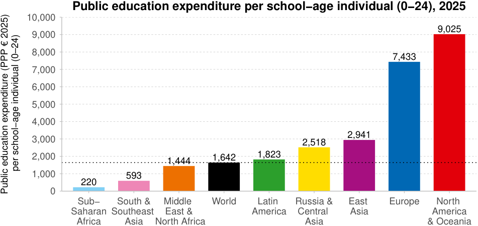

**----- Start of picture text -----** 
Public education expenditure per school−age individual (0−24), 2025 10,000 9,025 9,000 8,000 7,433 7,000 6,000 5,000 4,000 2,941 3,000 2,518 2,000 1,642 1,823 1,444 1,000 593 220 0 Sub− South & Middle  World Latin  Russia & East  Europe North Saharan Southeast  East & America Central  Asia America Africa Asia  North Africa Asia & Oceania  per school−age individual (0–24) Public education expenditure (PPP € 2025) **----- End of picture text -----** 

**Interpretation.** In 2025, average public education expenditure per school−age individual (0−to−24−year−old) varies enormously across world regions, from €220 in Sub−Saharan Africa to €9,025 in North America & Oceania (PPP € 2025), i.e., a gap of almost 1 to 41. If we were using market exchange rates (MERs) rather than PPPs, the gaps would be 2–3 times larger. **Sources and series:** _World Human Capital Expenditure Database_ (whce.world) and Bharti et al. (2025). 

**Figure 12. The ultra-rich escape progressive taxation** 

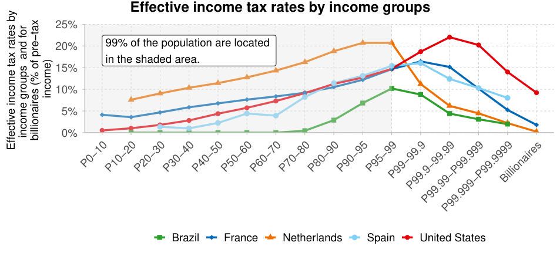

**----- Start of picture text -----** 
Effective income tax rates by income groups 25% 20% 99% of the population are located in the shaded area. 15% 10% 5% 0% Brazil France Netherlands Spain United States P0−10P10−20P20−30P30−40P40−50P50−60P60−70P70−80P80−90P90−95P95−99P99−99.9P99.9−99.99P99.99−P99.999P99.999−P99.9999Billionaires income) income groups  and for   billionaires (% of pre−tax Effective income tax rates by **----- End of picture text -----** 

**Interpretation.** This figure shows effective income tax rates by pre−tax income group and for U.S. dollar billionaires in Brazil, France, the Netherlands, Spain, and the United States. Income tax rates include only individual income taxes and equivalent levies. All values are expressed as a share of pre−tax income, defined as all national income before taxes and transfers, after pensions. P0−10 denotes the bottom 10% of the income distribution, P10−20 the next decile, etc. **Sources and series:** Artola et al. (2022), Bozio et al. (2024), Bozio et al. (2020), Bruil et al. (2024), Palomo et al. (2025), Saez and Zucman (2019), and Zucman (2024). 

22 

Executive Summary 

## **Figure 13. The international financial system generates more inequality** 

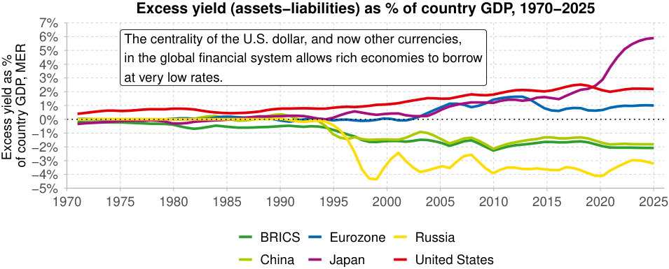

**----- Start of picture text -----** 
Excess yield (assets−liabilities) as % of country GDP, 1970−2025 7% 6% The centrality of the U.S. dollar, and now other currencies, 5% 4% in the global financial system allows rich economies to borrow 3% at very low rates. 2% 1% 0% −1% −2% −3% −4% −5% 1970 1975 1980 1985 1990 1995 2000 2005 2010 2015 2020 2025 BRICS Eurozone Russia China Japan United States Excess yield as % of country GDP, MER **----- End of picture text -----** 

**Interpretation.** This graph shows excess yield income, defined as the difference between the return on foreign assets and liabilities, as a share of national GDP. The figure shows that the exorbitant privilege once exclusive to the United States has become a broader rich−world phenomenon. The United States maintains a substantial privilege of 2.2% in 2025. The Eurozone follows with 1% by 2025. Japan stands out with a privilege of 5.9% by 2025. In contrast, BRICS countries face a consistent burden of around 2.1%, highlighting their role as net providers of capital to wealthier economies. **Notes.** Positive values represent income gains from financial privilege; negative values represent financial burden. BRICS countries comprise Brazil, Russia, India, China, and South Africa. **Sources and series:** Nievas and Sodano (2025) and wir2026.wid.world/methodology. 

**Figure 14. Privileged countries face lower liability costs by political design, not market dynamics** 

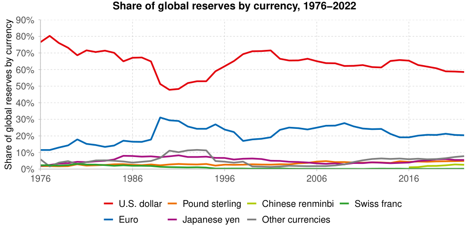

**----- Start of picture text -----** 
Share of global reserves by currency, 1976−2022 90% 80% 70% 60% 50% 40% 30% 20% 10% 0% 1976 1986 1996 2006 2016 U.S. dollar Pound sterling Chinese renminbi Swiss franc Euro Japanese yen Other currencies Share of global reserves by currency **----- End of picture text -----** 

**Interpretation.** Rich countries are the issuers of international reserve currencies, which are then used in international transactions and as a reserve of value around the globe.These currencies dominate central bank reserves due to international financial rules like Basel III, locking in persistent demand. This leads to persistently lower borrowing costs. **Sources and series:** Nievas and Sodano (2025) and wir2026.wid.world/methodology. 

23 

Executive Summary 

**Figure 15. We need political action but political coalitions are difficult to form** 

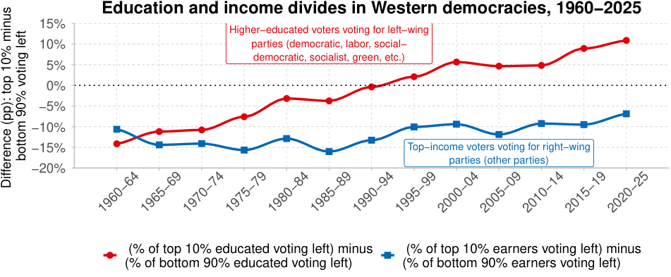

**----- Start of picture text -----** 
Education and income divides in Western democracies, 1960−2025 15% Higher−educated voters voting for left−wing 10% parties (democratic, labor, social− democratic, socialist, green, etc.) 5% 0% −5% −10% −15% Top−income voters voting for right−wing parties (other parties) −20%  (% of top 10% educated voting left) minus  (% of top 10% earners voting left) minus (% of bottom 90% educated voting left) (% of bottom 90% earners voting left) 1960−641965−691970−741975−791980−841985−891990−941995−992000−042005−092010−142015−192020−25 bottom 90% voting left Difference (pp): top 10% minus **----- End of picture text -----** 

**Interpretation.** In the 1960s, both higher−educated and high−income voters were less likely to vote for left−wing (democratic / labor / social−democratic / socialist / green) parties than lower−educated and low−income voters by more than 10 percentage points. The left vote has gradually become associated with higher education voters, giving rising to a multi−elite party system. Figures correspond to five−year averages for Australia, Britain, Canada, Denmark, France, Germany, Italy, the Netherlands, Norway, Sweden, Switzerland, and the U.S. Estimates control for income/education, age, gender, religion, church attendance, rural/urban, region, race/ethnicity, employment status, and marital status (in country−years for which these variables are available). **Sources and series:** Gethin et al. (2021) and _World Political Cleavages and Inequality Database_ (wpid.world). 

**Figure 16. Divides between large cities and smaller towns have reached levels unseen in a century** 

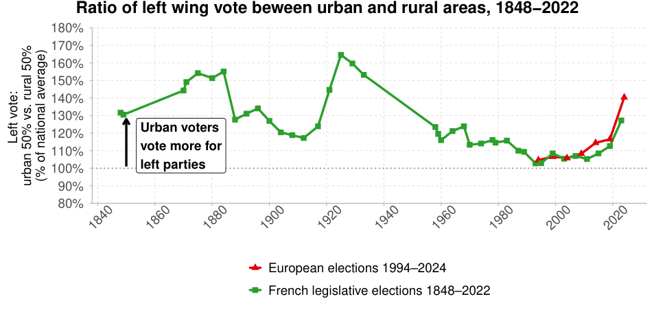

**----- Start of picture text -----** 
Ratio of left wing vote beween urban and rural areas, 1848−2022 180% 170% 160% 150% 140% 130% Urban voters 120% vote more for 110% 100% left parties 90% 80% European elections 1994–2024 French legislative elections 1848–2022 1840 1860 1880 1900 1920 1940 1960 1980 2000 2020 Left vote: urban 50% vs. rural 50% (% of national average) **----- End of picture text -----** 

**Interpretation.** This panel shows the ratio of the left−wing vote in urban areas to that in rural areas. It compares the 50% most urban with the 50% most rural (by agglomeration size). In both European elections (1994–2024) and legislative elections (1848–2022), the urban–rural gap widens markedly from the mid−1990s onward, with a sharp rise in the 2024 European election. **Sources and series:** Cagé and Piketty (2025) and unehistoireduconflitpolitique.fr. 

24 

Executive Summary 

**Figure 17. Without redistribution, political inequality will increase** 

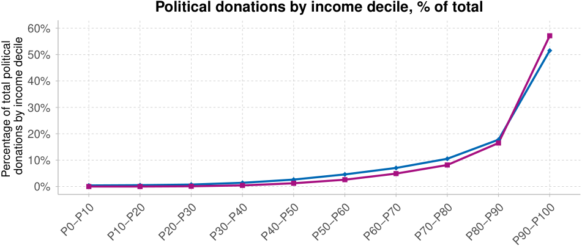

**----- Start of picture text -----** 
Political donations by income decile, % of total 60% 50% 40% 30% 20% 10% 0% P0−P10 P10−P20 P20−P30 P30−P40 P40−P50 P50−P60 P60−P70 P70−P80 P80−P90 P90−P100 Percentage of total political   donations by income decile **----- End of picture text -----** 

France South Korea 

**Interpretation.** Average shares of total political donations by income decile in France and South Korea (2013–2021). Donations are highly concentrated at the top, with the richest decile contributing the largest share. **Sources and series:** Cagé (2024). 

25 

Executive Summary 

## **Figure 18. Minimum taxation can safeguard progressivity at the top and its revenue can decrease inequality** 

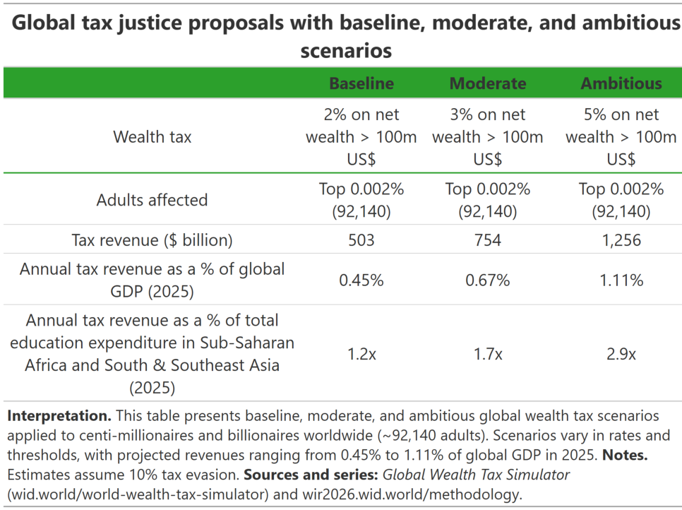

26 

Notes 

## **Notes** 

> 1Private capital ownership–based emissions refer to greenhouse gas emissions produced by firms and other productive assets that are privately owned. These emissions are allocated to individuals in proportion to their ownership shares and exclude direct household emissions and emissions from publicly owned assets (see Chancel and Mohren (2025)). 

> 2See, for instance, Andreescu, Arias-Osorio, et al. (2025); Andreescu and Alice Sodano (2024); Arias-Osorio et al. (2025); Bharti and Mo (2024); Bauluz, Brassac, Clara Martínez-Toledano, Nievas, et al. (2025); Bauluz, Brassac, Clara Martínez-Toledano, Piketty, et al. (2024); Chancel, Flores, et al. (2025); Dietrich et al. (2025); El Hariri (2024); Flores and Zúñiga-Cordero (2024); Forward and Fisher-Post (2024); Gómez-Carrera, Moshrif, Nievas, and Piketty (2024); Gómez-Carrera, Moshrif, Nievas, Piketty, and Somanchi (2025); Loubes and Robilliard (2024); Nievas and Piketty (2025). 

> 3See also Gethin, Clara Martínez-Toledano, and Piketty (2021); Gethin, Clara Martínez-Toledano, and Piketty (2022); Gethin and Clara Martínez-Toledano (2025) 

## **References** 

- Andreescu, Marie, Manuel Arias-Osorio, et al. (2025). “Equality and Development: A Comparative & Historical Perspective 1800-2025”. In: _World Inequality Lab, Working Paper Series_ 2025/25. 

- Andreescu, Marie, Romaine Loubes, et al. (2025). “Global Labour Hours in Paid and Unpaid Work: Inequality, Productivity and Structural Transformation, 1800-2100”. In: _World Inequality Lab, Working Paper Series_ 2025/03. 

- Andreescu, Marie and Alice Sodano (2024). “2024 DINA Update for Europe”. In: _World Inequality Lab, Technical Notes_ 2024/05. 

- Arias-Osorio, Manuel et al. (2025). “Equality and Development: A Comparative & Historical Perspective 1800-2025”. In: _World Inequality Lab, Working Paper Series_ . 

- Artola, M, Cl Martínez-Toledano, and A Sodano (2022). “Desigualdad de la renta y redistribución en España: Nueva Evidencia a partir de la Metodología del World Inequality Lab”. In: _EsadeEcPol-Center for Economic Policy_ 27. 

- Bauluz, Luis, Pierre Brassac, Clara Martínez-Toledano, Gastón Nievas, et al. (2025). “Global Wealth Accumulation and Ownership Patterns 1800-2025”. In: _World Inequality Lab, Working Paper Series_ 2025/22. 

- Bauluz, Luis, Pierre Brassac, Clara Martínez-Toledano, Thomas Piketty, et al. (2024). “Estimation of Global Wealth Aggregates in WID.world: Methodology”. In: _World Inequality Lab, Technical Notes_ 2024/14. 

- Bharti, Nitin, Amory Gethin, et al. (2025). “Human capital, unequal opportunities and productivity convergence: A global historical perspective, 1800-2100”. In: _World Inequality Lab, Working Paper Series_ 2025/15. 

- Bharti, Nitin and Zhexun Mo (2024). “2024 DINA Update for Asia”. In: _World Inequality Lab, Technical Notes_ 2024/08. 

- Bozio, Antoine et al. (2020). _Predistribution vs. Redistribution: Evidence from France and the U.S._ Tech. rep. Center for Research in Economics and Statistics. 

- (2024). “Predistribution versus redistribution: Evidence from France and the United States”. In: _American Economic Journal: Applied Economics_ 16.2, pp. 31–65. 

- Bruil, Arjan et al. (2022). “Inequality and Redistribution in the Netherlands”. In. 

- Cagé, Julia (2024). “Political inequality”. In: _Annual Review of Economics_ , 16: 455–490. 

- Cagé, Julia and Thomas Piketty (2025). _A history of political conflict: Elections and social inequalities in France, 1789–2022_ . Harvard University Press. 

- Chancel, Lucas, Ignacio Flores, et al. (2025). _Distributional National Accounts Guidelines: Methods and Concepts used in the World Inequality Database_ . `https://wid.world/d ocument/distributional-national-accounts-dina -guidelines-2025-methods-and-concepts-used-i n-the-world-inequality-database/` . Version 3.0. 

- Chancel, Lucas and Cornelia Mohren (2025). “Climate Inequality Report 2025, Climate Change: A Capital Challenge. Why Climate Policy Must Tackle Ownership”. In: _World Inequality Lab (WIL)_ . 

- Chancel, Lucas and Thomas Piketty (2021). “Global income inequality, 1820–2020: The persistence and mutation of extreme inequality”. In: _Journal of the European Economic Association_ 19.6, pp. 3025–3062. 

- Chancel, Lucas, Thomas Piketty, et al. (2022). _World Inequality Report 2022_ . Harvard University Press. 

- Dietrich, Jonas et al. (2025). “Extending WID National Accounts Series: Sectoral Decompositions & Intermediate Consumption”. In: _World Inequality Lab, Technical Notes_ 2025/03. 

- El Hariri, Dima (2024). “2024 DINA Update for MENA”. In: _World Inequality Lab, Technical Notes_ 2024/09. 

- Fisher-Post, Matthew and Amory Gethin (2025). “Government Redistribution and Development: Global Estimates of Tax and Transfer Progressivity 1980-2019”. In: _World Inequality Lab, Working Paper Series_ 2023/17. 

- Flores, Ignacio and Alvaro Zúñiga-Cordero (2024). “2024 DINA Update for Latin America”. In: _World Inequality Lab, Technical Notes_ 2024/10. 

- Forward, Tayla and Matthew Fisher-Post (2024). “2024 DINA Update for New Zealand”. In: _World Inequality Lab, Technical Notes_ 2024/06. 

- Gabrielli, Valentina, Theresa Neef, and Anne-Sophie Robilliard (2024). _2024 Update for Female Labor Income Share_ . Tech. rep. 2024/13. 

- Gethin, Amory and Clara Martínez-Toledano (2025). “Political Cleavages in Contemporary Democracies”. In: _North Holland Handbook of Political Economy_ . Ed. by Daron Acemoglu and James Robinson. Draft, March 2025. 

- Gethin, Amory, Clara Martínez-Toledano, and Thomas Piketty (2021). _Political cleavages and social inequalities: A study of fifty democracies, 1948–2020_ . Harvard University Press. 

27 

Notes 

- Gethin, Amory, Clara Martínez-Toledano, and Thomas Piketty (2022). “Brahmin left versus merchant right: Changing political cleavages in 21 western democracies, 1948–2020”. In: _The Quarterly Journal of Economics_ 137.1, pp. 1–48. 

- Gómez-Carrera, Ricardo, Rowaida Moshrif, Gastón Nievas, and Thomas Piketty (2024). “Global Inequality Update 2024: New Insights from Extended WID Macro Series”. In: _World Inequality Lab, Technical Notes_ 2024/11. 

- Gómez-Carrera, Ricardo, Rowaida Moshrif, Gastón Nievas, Thomas Piketty, and Anmol Somanchi (2025). “Extending WID Population Series: Projections 2024-2100 & Age/Gender Breakdowns”. In: _World Inequality Lab, Technical Notes_ 2024/12. 

- Loubes, Romaine and Anne-Sophie Robilliard (2024). “2024 DINA Update for Africa”. In: _World Inequality Lab, Technical Notes_ 2024/07. 

- Neef, Theresa and Anne-Sophie Robilliard (2021). “Half the Sky? The Female Labor Income Share in a Global Perspective”. In: _World Inequality Lab, Working Paper Series_ 2021/22. 

- Nievas, Gastón and Thomas Piketty (2025). “WID National Accounts Series: Updated and Extended Coverage 1800-2023”. In: _World Inequality Lab, Technical Notes_ 2025/02. 

- Nievas, Gastón and Alice Sodano (2025). “Has the U.S. exorbitant privilege become a rich world privilege? Rates of return and foreign assets from a global perspective, 1970-2022”. In: _World Inequality Lab, Working Paper Series_ 2024/14. 

- Palomo, Theo et al. (2025). “Tax Progressivity and Inequality in Brazil: Evidence from Integrated Administrative Data”. In: _EU Tax Observatory, Working Paper_ 2025/09. 

- Rehm, Yannic and Lucas Chancel (2022). “Measuring the Carbon Content of Wealth Evidence from France and Germany”. In: _World Inequality Lab, Working Paper Series_ 2022/12. 

- Saez, Emmanuel and Gabriel Zucman (2019). “Progressive wealth taxation”. In: _Brookings Papers on Economic Activity_ 2019.2, pp. 437–533. 

- Zucman, Gabriel (2024). “A blueprint for a coordinated minimum effective taxation standard for ultrahigh-net-worth individuals”. In: _Commissioned by the Brazilian G20 presidency_ . 

28 

# **INTRODUCTION** 

Introduction 

The aim of the _World Inequality Report 2026_ is to present the latest and most comprehensive data on inequality in order to inform democratic debate worldwide. It updates the 2022 and 2018 editions, expanding both the temporal and thematic scope of our research. In addition to long-run series regarding income and wealth, this report deepens our analysis of redistribution, gender gaps, political divides, and the international financial system. It also advances our work on global tax justice, with new evidence on how progressive taxation could mobilize substantial resources to finance education, health, and climate adaptation. 

Economic inequality has always been at the center of debates about how societies should be organized. The aftermath of the COVID-19 pandemic, the rise of armed conflicts, the acceleration of climate change, and the extreme polarization of democracies make these debates even more urgent. How should the incomes and wealth produced by our economies be distributed across populations and across the globe? Are today’s fiscal systems adequate to meet collective needs? Are the poorest countries catching up with richer ones? Are women and marginalized groups acquiring equal access to opportunities? On these questions, people across the world hold strong and often contradictory views about what constitutes acceptable inequality and what should be done about it. 

Our objective is not to claim that a single “ideal” level of inequality exists, nor to prescribe a single institutional model. Ultimately, such decisions can only be made through public deliberation and political institutions. Our more modest goal is to provide a common basis of facts. We hope to contribute to a shared understanding of how inequality has evolved, who benefits and who is left behind, and what policy tools are available to reduce the gaps. 

The _World Inequality Database_ (wid.world) remains central to this endeavor. Built over two decades of collaborative research involving more than two hundred scholars worldwide, wid.world provides open access to the most extensive data on the historical evolution of income and wealth distribution. By linking fiscal records, 

household surveys, national accounts, and new data on gender, elections, and global finance, it becomes possible to track several dimensions of inequality across countries, regions, and socioeconomic groups with an unprecedented level of detail. 

Beyond wid.world, the World Inequality Lab (WIL) has also developed a range of complementary tools to broaden access to inequality data and strengthen democratic debate. These include new thematic databases such as the _World Political Cleavages and Inequality Database_ (wpid.world), the _World Historical Balance of Payments Database_ (wbop.world), the _World Human Capital Expenditure Database_ (whce.world), and the _Distribuciones_ website for Latin America (distribuciones.info), alongside updated methodological guidelines for _Distributional National Accounts Guidelines_ (DINA Guidelines). The WIL has also produced the _Climate Inequality Report 2025_ and launched interactive platforms like the _Global Wealth Tax Simulator_ , which allow policymakers, journalists, and citizens to visualize how progressive taxation could mobilize resources for collective goods. Looking ahead, the _Global Justice Project_ will expand this effort by combining data on inequality, the environment, and social issues to envision fair and sustainable pathways for the 21st century. It will include a _Global Justice Fund_ proposal with expenditure objectives to reduce inequality. Together, these tools reflect our commitment not only to documenting inequality but also to making data transparent, accessible, and usable by a wide audience. 

In parallel with these initiatives, the global architecture for inequality monitoring is entering a new phase. The release of the _G20 Extraordinary Committee of Independent Experts Report on Global Inequality_ , led by Joseph E. Stiglitz, and joined by Adriana Abdenur, Winnie Byanyima, Jayati Ghosh, Imraan Valodia and Wanga Zembe-Mkabile, has put forward a landmark proposal to establish an International Panel on Inequality (IPI). The World Inequality Lab warmly welcomes this recommendation. The extreme concentration of wealth and power documented in both this report and ours underscores the need for an independent global body capable of systematically 

30 

Introduction 

tracking inequality trends and evaluating the distributional impact of major policy choices. This work builds on, and can substantially scale up, the efforts we have developed for more than a decade through the _World Inequality Database_ and our network of researchers worldwide. The World Inequality Lab stands ready to contribute its data, methods, and expertise to this emerging international architecture, which represents a historic opportunity to place tax justice, social justice, and inequality at the heart of global governance. 

This _World Inequality Report 2026_ offers new findings in five main areas: 

First, we provide updated and extended evidence on the scale and structure of global inequality. We show that income and wealth have reached historic highs but remain very unevenly distributed. For instance, the top 0.001%—fewer than 60,000 individuals—owns three times more wealth than the entire bottom half of humanity combined. This imbalance is compounded by regional disparities, as South & Southeast Asia and Sub-Saharan Africa lag far behind North America & Oceania and Europe. Within almost every region, the top 1% alone hold more wealth than the bottom 90% combined. 

Second, the report updates our worldwide systematic measure of gender inequality, specifically female labor income shares, and provides a new methodology for measuring gender inequality that accounts for unpaid labor hours. Women still earn only around 30% of total global labor income, and in every region, they work more hours than men when unpaid labor is accounted for. The gender pay gap persists across all regions and is larger when unpaid labor hours are accounted for. 

Third, we present new evidence on the structural privilege of the rich world in the international financial system. What was once described as the “exorbitant privilege” of the United States—borrowing cheaply thanks to the dollar’s reserve-currency role while investing abroad at higher returns—has expanded into a systemic advantage enjoyed by advanced economies as a group. These countries consistently record positive income inflows coming from poorer nations. This is not the product of market efficiency but 

of institutional design, rooted in currency dominance, portfolio asymmetries, and global financial rules that allow rich countries to operate as financial rentiers. The result is a modern form of unequal exchange: poorer nations transfer large shares of their GDP each year to wealthier ones, shrinking their fiscal capacity and limiting their ability to invest in essential services such as education, health, and infrastructure. Rather than correcting global imbalances, today’s international financial system entrenches them, locking developing countries into structural disadvantage. 

Fourth, we analyze the role of progressive taxation and redistributive policies in reducing inequality. Taxes and transfers are among the most powerful tools societies have to finance public goods and reduce inequality. Progressive taxation also strengthens social cohesion and limits the political influence of extreme wealth. Yet evidence shows that tax progressivity collapses at the very top: centi-millionaires and billionaires often pay proportionally less tax than most of the population, undermining both fiscal capacity and trust. 

Fifth, we analyze how inequality reshapes political cleavages and democratic representation. Evidence in this report shows that working-class representation in parliaments has long been low and has declined further in recent decades, narrowing the space for redistributive politics. In Western democracies, income and education political divides have disconnected, producing “multi-elite” party systems in which highly educated voters lean left and high-income voters remain aligned with the right. This fragmentation has weakened broad coalitions for redistribution. Geography has also re-emerged as a central divide, with rural and urban voters increasingly polarized, further fragmenting the working majority. More ambitious and inclusive policy platforms appear to be needed so as to rebuild the redistributive coalitions of the past. 

This report also explores solutions. Evidence shows that inequality can be reduced through progressive taxation, redistributive transfers, investment in human capital, recognition of unpaid work, and reforms to global finance. For instance, even 

31 

Introduction 

a moderate 3% global tax on fewer than 100,000 centi-millionaires and billionaires alone would raise over $750 billion annually, a figure comparable to total education budgets in lowand middle-income countries. Such proposals for global tax justice demonstrate that significant revenues could be mobilized from a tiny fraction of the population, while reinforcing fairness and restoring the legitimacy of fiscal systems. 

We are acutely aware, however, of the limitations of our knowledge. Despite significant progress, many countries still fail to publish reliable income and wealth data. Some of the largest economies continue to withhold tax statistics, limiting transparency and informed debate. As in previous editions, we call on governments and international organizations to release more raw data on income, wealth, and taxation. The lack of transparency is not a technical issue alone; it undermines the very possibility of democratic deliberation about inequality and its remedies. 

By providing detailed documentation of our data and methods we hope to fulfill our single most important objective: to enable interested citizens to make informed judgments about the inequalities that affect them in their everyday lives. Economic issues do not belong only to economists, policymakers, or business leaders. They belong to everyone. Our objective is to contribute to the power of the many by equipping societies with the facts needed to engage in informed, democratic debate about one of the most pressing issues of our time: inequality. 

32 

# **CHAPTER 1 Global Economic Inequality** 

Chapter 1. Global Economic Inequality 

## **Contents of this chapter** 

|**tents of this chapter**||
|---|---|
|The world is becoming richer, but unequally . . . . . . . . . . . . . . . . . . . . . . .|**35**|
|Understanding inequality through population groups . . . . . . . . . . . . . . . . . .|**35**|
|Extreme and rising income inequality . . . . . . . . . . . . . . . . . . . . . . . . . . .|**36**|
|Wealth inequality is larger, more extreme, and rising faster . . . . . . . . . . . . . . .|**38**|
|Two centuries of persistent and extreme income inequality . . . . . . . . . . . . . .|**40**|
|Regional inequality is stark both across and within regions . . . . . . . . . . . . . . .|**42**|
|Main takeaways . . . . . . . . . . . . . . . . . . . . . . . . . . . . . . . . . . . . . . .|**44**|
|Box 1.1: Regions used in the_World Inequality Report 2026_ . . . . . . . . . . . . . . .|**48**|
|Box 1.2: The Inequality Transparency Index. . . . . . . . . . . . . . . . . . . . . . . .|**49**|

34 

Chapter 1. Global Economic Inequality 

Inequality remains one of the defining economic challenges of our time. Global incomes and wealth levels have risen dramatically, but the distribution of these gains has been profoundly uneven. Today, a very large share of income and wealth is concentrated in the hands of a small share of the population, while billions of people continue to live with limited resources and opportunities. 

This chapter analyzes global inequality from several perspectives. We begin by showing current global income and wealth disparities, before highlighting how these divides have deepened at the very top of the distribution. We then turn to a long-run historical view and analyze how global income inequality has evolved over the past two centuries. Finally, we shift the lens to regional comparisons, where the contrast between and within world regions is equally stark. Together, these perspectives provide a foundation for the rest of the report, which explores the current state of global inequality in detail and from multiple angles. 

## **The world is becoming richer, but unequally** 

For much of human history, population growth was the main driver of economic expansion. Starting in the 19th century, however, income per person began to rise much more rapidly than population growth, marking the onset of sustained modern economic growth. **Figure 1.1** shows that the world’s population grew from about 1 billion in 1800 to more than 8 billion in 2025, an eightfold increase. Over the same period, average yearly income per person rose from about €900 to nearly €14,000 (in 2025 euros), a sixteenfold increase. Taken together, these two forces translated into an average rise in global output of about 2.2% per year over 225 years. 

The growing disparity between the population and income curves reflects a profound transformation in living standards. More output per person has meant that humanity, on average, has become far more productive than in the past. At the same time, this rapid growth raises critical questions. Sustaining such levels of output places increasing pressure on the planet’s resources, and the benefits of growth have 

been far from evenly shared. In theory, today’s global income would be enough to provide every person with about €1,200 per month (€14,000 per year). In reality, however, these resources are distributed highly unequally, with a small minority capturing a disproportionate share of the gains. 

## **Understanding inequality through population groups** 

Throughout this report, we study inequality within a unit by dividing the unit’s population into broad groups. A unit can typically be the world, a region, or a country. The bottom 50% represents half of the population with the least resources. In the context of global income, this means the poorest half of people worldwide, those earning the least. Above this group is the middle 40%, often described as the “global middle class”. These individuals earn enough not to belong to the poorest group, yet they do not form part of the economic elite. At the very top lies the richest 10%, which includes the segment of the global population with the highest incomes. 

To better understand how economic resources are concentrated, we also look more closely within the top 10%. This allows us to analyze what share of the population controls the bulk of labor income and asset ownership. Such detail is crucial because inequality is not only about the divide between the poor and the rich, but also about the extreme concentration of resources at the very top. Measuring this concentration with precision is central to the work of the World Inequality Lab and will be a recurring theme throughout the report. To put these categories into perspective, it is helpful to visualize how many people belong to each group today. In 2025, the world’s population stands at 8.2 billion, and the adult population at 5.6 billion. **Figure 1.2** shows that the bottom 50% includes 2.8 billion adults, almost equivalent to the combined adult populations of China, India, the United States, Indonesia, Nigeria, Brazil, and Russia. The middle 40% comprises about 2.2 billion adults, similar to the combined adult populations of China, India, and Mexico. By contrast, the top 10% comprises 

35 

Chapter 1. Global Economic Inequality 

**Figure 1.1. The world is becoming richer** 

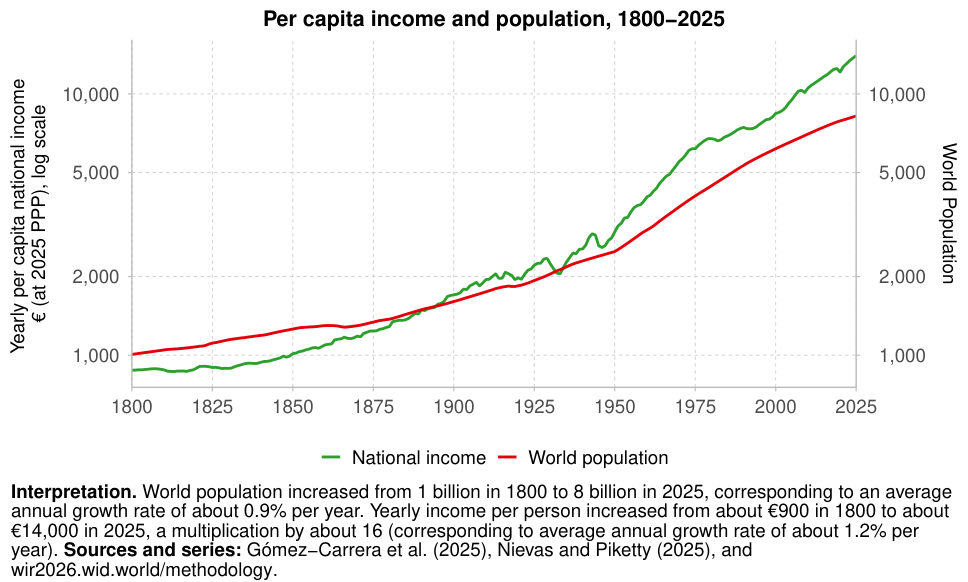

**----- Start of picture text -----** 
Per capita income and population, 1800−2025 10,000 10,000 5,000 5,000 2,000 2,000 1,000 1,000 1800 1825 1850 1875 1900 1925 1950 1975 2000 2025 National income World population Interpretation.  World population increased from 1 billion in 1800 to 8 billion in 2025, corresponding to an average annual growth rate of about 0.9% per year. Yearly income per person increased from about €900 in 1800 to about €14,000 in 2025, a multiplication by about 16 (corresponding to average annual growth rate of about 1.2% per year).  Sources and series:  Gómez−Carrera et al. (2025), Nievas and Piketty (2025), and wir2026.wid.world/methodology. World Population € (at 2025 PPP), log scale Yearly per capita national income **----- End of picture text -----** 

only 556 million individuals, roughly the size of the combined adult populations of the United States, Pakistan, and Brazil. 

Looking more closely at the very top, the numbers become even smaller but highly significant. The top 1% includes about 56 million adults, similar to the adult population of the United Kingdom. The top 0.1% (5.6 million adults) is similar in size to the total population of Singapore. The top 0.01% amounts to 556,000 adults, about the total population of Genoa in Italy. The top 0.001%, or 56,000 adults, could all fit inside a football stadium. Going further, the top 0.0001% (around 5,600 adults) would fill a concert arena, the top 0.00001% (560 adults) a theater, and the top 0.000001% (56 adults) a single classroom. These comparisons will help illustrate just how concentrated the very top of the distribution is, and they will serve as a reference throughout the report to help readers grasp the magnitude of global inequality. 

## **Extreme and rising income inequality** 

Keeping these figures in mind, **Figure 1.3** illustrates the extent of global inequality. The top 10% (about 560 million adults) receives 53% of global income, while the bottom 50% (roughly 2.8 billion adults) captures only 8%. The contrast becomes even sharper when we zoom into the right-hand panel: the top 1%, a group of just 56 million people, earns 2.5 times more than the entire bottom half of humanity. Put differently, a population comparable to the United Kingdom’s receives more income than a group as large as the combined populations of China, India, the United States, Indonesia, Nigeria, Brazil, and Russia. 

If we look beyond these broad groups and zoom in further still, the concentration of income becomes even starker. **Figure 1.4** highlights the concentration of income even more clearly. The third column shows that the top 0.1% earns as much as the entire bottom 50%. This means that a group of people no larger than the population of Singapore takes in the same income as half of the world’s population. At the very extremes, inequality becomes staggering: 

36 

Chapter 1. Global Economic Inequality 

## **Figure 1.2. Poorest half of the world population: 2.8 billion adults** 

**Total adult by group, 2025 Bottom 50%, middle 40%, top 10%, top 1%** 

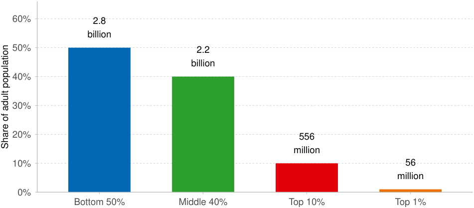

**----- Start of picture text -----** 
60% 2.8 billion 50% 2.2 billion 40% 30% 20% 556 million 10% 56 million 0% Bottom 50% Middle 40% Top 10% Top 1% Share of adult population **----- End of picture text -----** 

**Interpretation.** The global bottom 50% among the adult population is composed of 2.8 billion individuals in 2025, and the global top 10% among the adult population is composed of 556 million individuals. **Sources and series:** wir2026.wid.world/methodology. 

the top one-in-a-million (about 5,600 people) earn, on average, one-eighth of what the bottom 50% collectively receives. In other words, a small concert arena’s worth of individuals has an annual income comparable to that of billions of people. 

The fourth column of **Figure 1.4** provides another perspective. On average, a person in the bottom 50% earns about $5,100 per year (roughly $425 per month). A person in the top 10% earns about $159,300 annually ($13,275 per month), and a person in the top one-in-a-million earns around $248 million each year (more than $20 million per month). This means that while half of the world’s adults live on less than $500 per month, the top 10% earns thirty-one times as much, and the very richest earn nearly 50,000 times more. 

The fifth column of **Figure 1.4** shows the thresholds required to enter different income groups. To belong to the top 10%, an individual must earn about $65,500 per year (around $5,460 per month). To reach the top 1%, the threshold rises to about $250,300 annually ($21,860 per month). 

Unsurprisingly, most of the population earning at these levels is concentrated in Europe, North America, and Oceania. We will return to these regional income disparities in **Chapter 2** . 

Turning to income growth, the last column of **Figure 1.4** shows that global income per adult has grown at an average annual rate of 1.1% since 1980. At first glance, the data might suggest a narrowing of inequality: the bottom 50% grew faster (1.8%) than the top 10% (1.2%). But a closer look reveals a different picture. Within the top 10%, the very richest groups have consistently outpaced the average. Every group at or above the top 0.1% has seen growth rates above 1.8% per year, meaning the richest have become richer, even as the bottom half made relative gains. This is one of the strengths of the _World Inequality Database_ : by measuring the entire income distribution, it prevents misleading conclusions that might be drawn if our analysis stopped short of disaggregating the top 10%. 

**Figure 1.5** complements this analysis by displaying the income growth incidence 

37 

Chapter 1. Global Economic Inequality 

## **Figure 1.3. Income and wealth shares are distributed very unequally** 

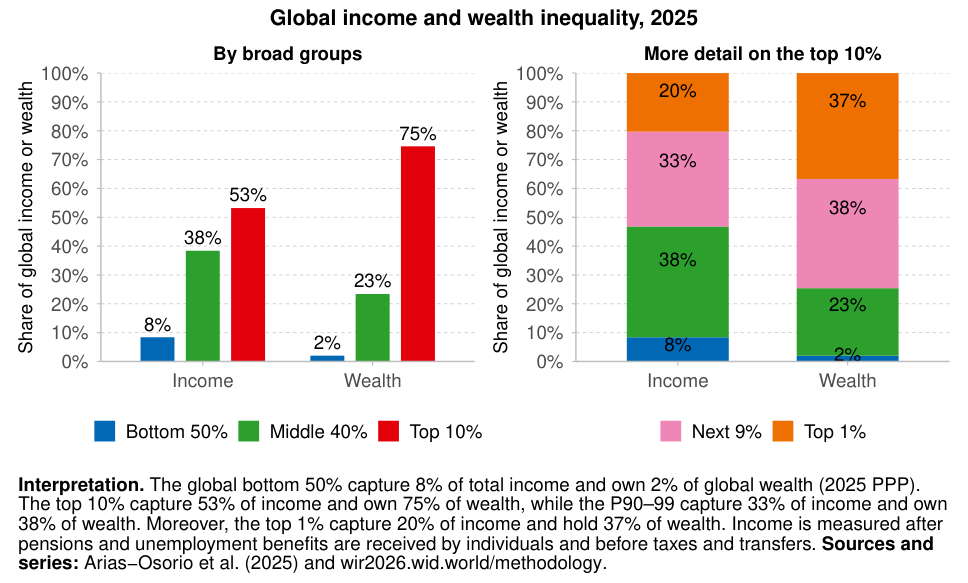

**----- Start of picture text -----** 
Global income and wealth inequality, 2025 By broad groups More detail on the top 10% 100% 100% 20% 90% 90% 37% 80% 75% 80% 70% 70% 33% 60% 53% 60% 38% 50% 50% 38% 40% 40% 38% 30% 23% 30% 20% 20% 23% 8% 10% 10% 2% 8% 2% 0% 0% Income Wealth Income Wealth Bottom 50% Middle 40% Top 10% Next 9% Top 1% Interpretation.  The global bottom 50% capture 8% of total income and own 2% of global wealth (2025 PPP). The top 10% capture 53% of income and own 75% of wealth, while the P90–99 capture 33% of income and own 38% of wealth. Moreover, the top 1% capture 20% of income and hold 37% of wealth. Income is measured after pensions and unemployment benefits are received by individuals and before taxes and transfers.  Sources and series:  Arias−Osorio et al. (2025) and wir2026.wid.world/methodology. Share of global income or wealth Share of global income or wealth **----- End of picture text -----** 

curve. It shows that while the bottom half of the world has enjoyed relatively robust growth since 1980, the middle 40% experienced stagnation, with some groups growing at less than 1% per year. Meanwhile, growth accelerated again at the very top, with the richest 1% and especially the top 0.1% capturing the fastest gains. The result is a polarized pattern: the poor and the rich have seen their incomes rise, while the global middle class has benefited the least over the past four decades. These uneven growth dynamics explain why today’s distribution of income is so skewed: the gains of the past decades have consolidated mainly at the very top. Such polarization also carries political implications: the relative exclusion of large middle-income groups, the stagnation of many poorer groups in rich countries, and the growing influence of the global plutocracy all raise pressing questions for democratic stability and global governance; we will return to this point in **Chapter 8** . 

## **Wealth inequality is larger, more extreme, and rising faster** 

So far, we have seen that, when examining incomes, inequality is very large. But income inequality only tells part of the story, since it largely reflects labor earnings. Capital income, which is even more concentrated and closely tied to wealth ownership, adds another layer of inequality. 

**Figure 1.3** makes this clear: the global top 10% owns three-quarters of all wealth, while the bottom 50% holds just 2%. Zooming further in, the concentration becomes staggering. The top 1% alone, roughly the adult population of the United Kingdom, controls 37% of global wealth. This is more than eighteen times the wealth of the entire bottom half of the world population, a group as large as the combined adult populations of China, India, the United States, Indonesia, Nigeria, Brazil, and Russia. 

**Figure 1.6** sheds light on just how extreme inequality becomes at the very top. The top one-in-a-million (about 5,600 adults, enough to fill a concert arena) collectively hold 3% of 

38 

Chapter 1. Global Economic Inequality 

**Figure 1.4. Income grows faster at the top** 

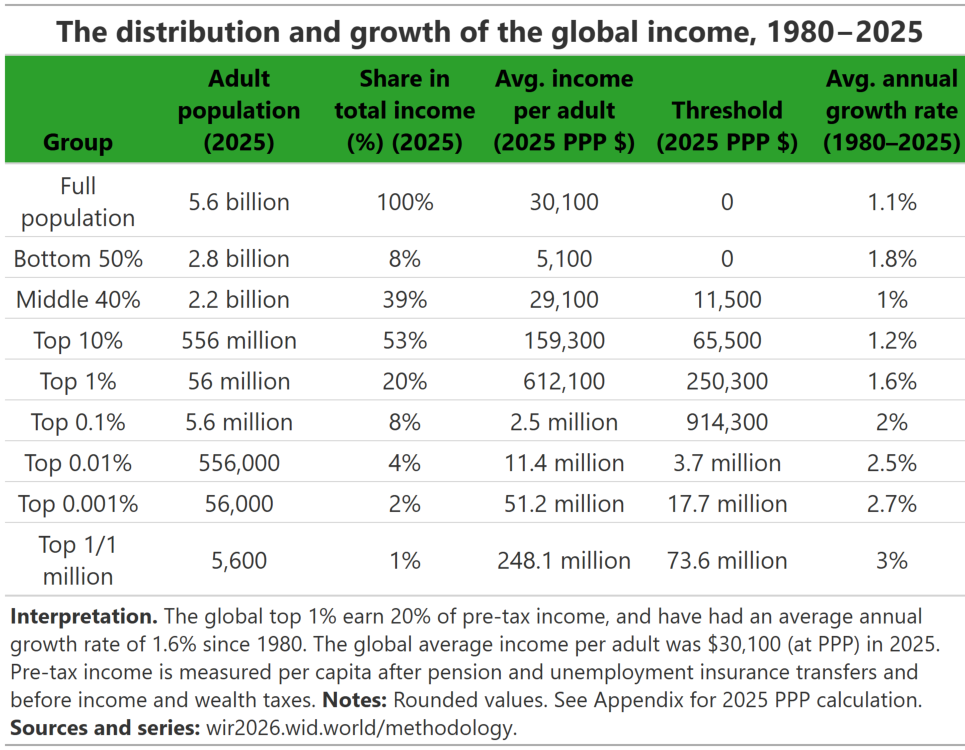

global wealth, more than the entire bottom half of the world’s adult population. 

The disparities are equally stark when we compare averages. A person in the bottom 50% owns about $6,500, while someone in the top 10% holds around $1 million. But the average wealth of a member of the top 0.001% (about 56,000 adults) is nearly $1 billion, and those in the top one-in-100 million (just 56 adults worldwide) hold on average $53 billion each. To put this into perspective, the wealth of a single individual at that level can surpass the individual annual GDP of several Sub-Saharan African countries. These figures underline that today’s inequality is driven not only by the divide between the poor and the rich, but also by the widening gap within the top itself. 

Wealth thresholds also illustrate the steep hierarchy across groups. To leave the bottom 

50%, an individual needs at least $29,200 in net worth. To enter the top 10%, the bar is $265,600. To join the ranks of the top 0.001%, one must be a centi-millionaire, while entering the top one-in-a-million requires billionaire status. These thresholds highlight the vast distance separating the very top from the rest of the population. 

Turning to dynamics, **Figure 1.6** and **Figure 1.7** show how wealth accumulation has played out over the past three decades. At first glance, one might think inequality is narrowing: the bottom 50% saw their wealth grow at about 3.4% annually, slightly faster than the top 10% (2.9%) or even the top 1% (3.1%). But closer examination reveals a very different story. At the very top, billionaires have enjoyed annual increases of 8% per year ; they have multiplied their already vast fortunes, while the absolute gains of the bottom half remain modest. 

39 

Chapter 1. Global Economic Inequality 

## **Figure 1.5. Income is growing the least for the global middle class** 

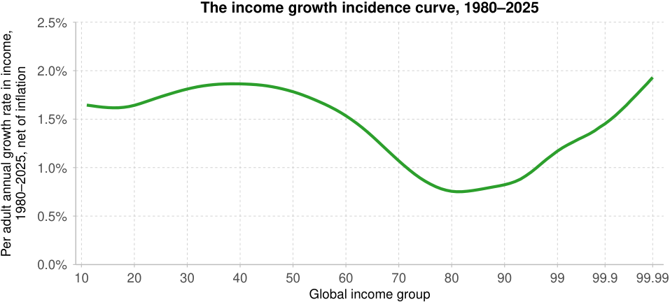

**----- Start of picture text -----** 
The income growth incidence curve, 1980–2025 2.5% 2.0% 1.5% 1.0% 0.5% 0.0% 10 20 30 40 50 60 70 80 90 99 99.9 99.99 Global income group 1980–2025, net of inflation Per adult annual growth rate in income, **----- End of picture text -----** 

**Interpretation.** Growth rates among the poorest half of the population were between 1.6% and 1.9% per year, between 1980 and 2025. Since this group started from very low income levels, its absolute levels of growth remained very low. The poorest half of the world population has captured only 5% of overall income growth since 1980. The top 1% benefited from high growth rates (1.2% to 2.4% per year). This group captured 22% of total income growth between 1980 and 2025. **Notes.** The curve is smoothed using a centered moving average. **Sources and series:** wir2026.wid.world/methodology and Chancel et al. (2022). 

This accelerating concentration is visible in **Figure 1.8** , which contrasts the bottom 50% and the top 0.001% trends. Since 1995, the top 0.001%, an ultra-wealthy group, has consistently owned a larger share of global wealth than half of the world’s adult population combined, and their advantage has only grown. By 2025, about 56,000 adults (a group that could fit in a football stadium) own more wealth than 2.8 billion adults combined. 

Wealth inequality is not just very large; it is persistent and self-reinforcing. Over the past three decades, the wealthiest individuals have pulled away at an extraordinary pace; this has also affected the distribution of opportunities and power worldwide. 

## **Two centuries of persistent and extreme income inequality** 

While today’s wealth disparities are staggering, they are not an anomaly. The long-run record shows that extreme inequality is not a recent phenomenon but a defining feature of the modern global economy . Despite two centuries of sustained economic growth, the global distribution of income has also remained profoundly unequal. The evidence shows that income inequality has been both persistent and substantial over the past two centuries.[4] **Figure 1.9** illustrates this continuity: since 1820, the top 10% has consistently captured more than half of all global income, while the bottom 50% has never received more than 15%. The middle 40% improved their position somewhat in the 20th century, particularly from the 1920s to the 1980s, before experiencing a setback up until 2000 and a partial recovery thereafter. Their trajectory mirrors shifts in the income share of the top 10%, while the bottom 50% has remained largely excluded from these gains. Although there has been 

40 

Chapter 1. Global Economic Inequality 

**Figure 1.6. Wealth is increasing much more at the very top** 

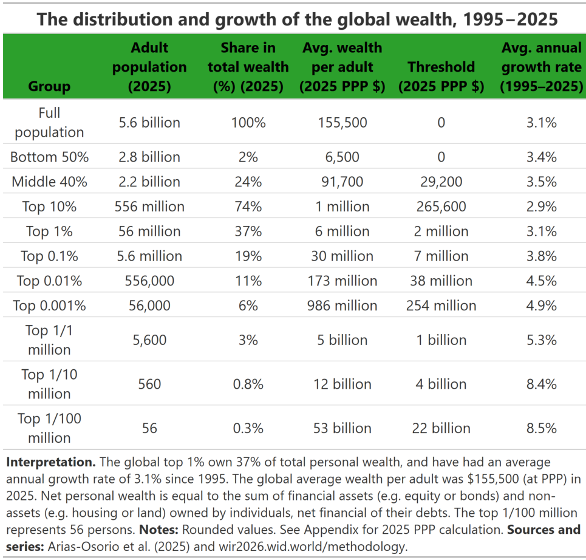

a slight upward trend for the poorest half in recent decades, their share of income, below 10%, remains lower than it was two centuries ago. So when reductions in inequality did occur, they mostly benefited the middle class, not the bottom half of the world population. 

**Figure 1.10** zooms in on the extremes of the distribution and reveals the rise of very high-income concentration. In 1820, the bottom 50% received about 14% of global income; by 2025, their share had fallen to just 8%, despite representing about 2.8 billion adults. Meanwhile, the top 1%, around 

56 million adults in 2025, have consistently captured close to 20% of global income over the last two centuries. Even more striking is the trajectory of the top 0.1%. Over the past six decades, their income share has converged with that of the bottom 50%. A group now roughly the size of Singapore’s population has persistently earned as much as half of the adult population combined. A broader pattern is also evident: the shares of the top 1% and the top 0.1% peaked around 1910, declined until the 1970s, rose again to a local maximum in 2007, and have followed a slightly upward trajectory since the COVID-19 pandemic. 

41 

Chapter 1. Global Economic Inequality 

## **Figure 1.7. Wealth grows faster among the very wealthy** 

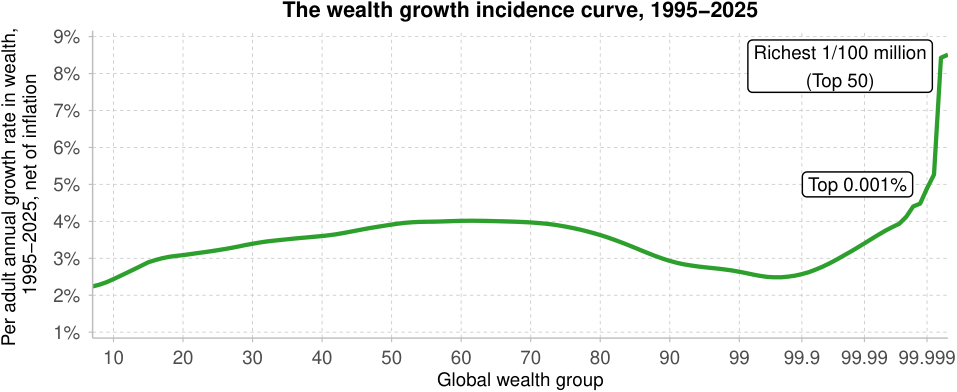

**----- Start of picture text -----** 
The wealth growth incidence curve, 1995−2025 9% Richest 1/100 million 8% (Top 50) 7% 6% 5% Top 0.001% 4% 3% 2% 1% 10 20 30 40 50 60 70 80 90 99 99.9 99.99 99.999 Global wealth group 1995−2025, net of inflation Per adult annual growth rate in wealth, **----- End of picture text -----** 

**Interpretation.** Growth rates in net personal wealth varied sharply across the global distribution between 1995 and 2025. While the bottom 50% experienced positive growth of around 2%−4% per year, their low initial wealth meant that they captured only 1.1% of total global wealth growth. In contrast, the top 1% experienced significantly higher growth rates, ranging from 2% to 8.5% annually, and captured 36.7% of global wealth growth during the same period. The very top of the distribution, including the wealthiest 60 individuals, had the steepest increases. Net personal wealth is defined as the sum of financial (e.g., equity, bonds) and non−financial assets (e.g., housing, land) owned by individuals, net of their debts. **Notes.** The curve is smoothed using a centered moving average. **Sources and series:** Arias−Osorio et al. (2025), Chancel et al. (2022), and wir2026.wid.world/methodology. 

**Figure 1.11** places these trends in a broader perspective by combining the evolution of income growth with income group size. The left-hand panel shows the dramatic increase in global average incomes since 1820, but also underscores how unevenly this growth has been shared. In 1820, the top 10% earned 50% of global income, compared with 14% for the bottom 50%. By 1980, the top 10% still controlled 52%, while the bottom half’s share had fallen to just 6%. Today, in 2025, the top 10% captures 53% of income, while the bottom 50% has only slightly recovered to 8%. Over two centuries, inequality has widened, with the bottom half losing ground relative to both the middle and the top. 

Extreme inequality is also evident at the very top. The global top 0.1% captured 9% of income in 1820, 6% in 1980, and 8% in 2025. While this represents a slight decline over two centuries, it is far smaller than the collapse in the share of the bottom 50%. In other words, the relative gap between the poorest and the very richest has grown wider. 

The right-hand panel of **Figure 1.11** makes this disconnect especially evident 

by visually comparing income shares with population shares in 2025. In an equal world, each group’s share of income would match its share of the population. Instead, we see the opposite: the bottom 50%, who make up half of humanity, receive only 8% of global income, while the top 0.1%, too small to be visible in the right-hand-side bar, captures the same amount. This stark contradiction underscores how deeply entrenched extreme income inequality remains, even after two centuries of global economic growth. 

While global income has grown enormously over two centuries, its distribution has remained extremely unequal, with the poorest half persistently excluded from large gains and the very richest consolidating their advantage. 

## **Regional inequality is stark both across and within regions** 

The historical view shows that inequality has persistently been a defining trait of the global economy. Yet this global picture hides deep divides between and within world regions. Regional inequality matters because 

42 

Chapter 1. Global Economic Inequality 

## **Figure 1.8. Extreme wealth inequality is persistent and increasing** 

**----- Start of picture text -----** 
Extreme wealth inequality, 1995−2025 7% 6% 5% 4% The top 0.001% (about 56,000 adults) have 3 times 3% more wealth than half of the entire world population combined. 2% 1% 0% 1995 2000 2005 2010 2015 2020 2025 Bottom 50% Top 0.001% Share of global personal wealth (%) **----- End of picture text -----** 

**Interpretation.** The share of personal wealth held by the richest 0.001% of adults rose from around 3.8% of total wealth in 1995 to nearly 6.1% in 2025. After a very slight increase, the share of wealth owned by the poorest half of the population has stagnated since the early 2000s at around 2%. Net personal wealth is equal to the sum of financial assets (e.g. equity or bonds) and non−financial assets (e.g. housing or land) owned by individuals, net of their debts. **Sources and series:** Arias−Osorio et al. (2025) and wir2026.wid.world/methodology. 

it is shaped not only by economics, but also by deep-rooted historical, political, and cultural legacies. It also highlights another key dimension: inequality does not just separate rich and poor individuals in the same context; it also entrenches divides between entire parts of the world. Regional comparisons allow us to see both how far apart regions stand from each other ( **Figure 1.12** ) and how unequal they are internally ( **Figure 1.13** ). The specific country groupings are detailed in **Box 1.1.1** . 

**Figure 1.12** contrasts average income and wealth per adult across world regions in 2025, relative to the world average. The patterns are striking. Wealthier regions are also typically higher-income regions, though there are exceptions. East Asia, for instance, has a higher average wealth level than Russia & Central Asia but a lower average income. At the top of the scale, North America & Oceania and Europe stand well above the global mean. In these regions, and in East Asia, wealth levels exceed income levels relative to the world average. In the rest of the world, however, income levels are relatively higher than wealth levels. 

At the bottom of the scale, Sub-Saharan Africa, South & Southeast Asia, and Latin America remain far below the global average on both counts, though Latin America’s average income is somewhat closer to the world mean. The Middle East & North Africa and Russia & Central Asia occupy an intermediate position: their average incomes are closer to East Asia’s and not far from Latin America’s, but their average wealth remains much lower. The contrast is sharp: for instance, in 2025, average wealth in North America & Oceania is 338% of the world average, while in Sub-Saharan Africa it is just 20%. Put differently, the average adult in North America & Oceania owns more than sixteen times the wealth of the average adult in Sub-Saharan Africa. 

Turning to **Figure 1.13** , the focus shifts from differences between regions to disparities within them, using the top 10%/bottom 50% (T10/B50) ratio. This simple but powerful metric asks: on average, how many times more does the top 10% earn (or own) compared to the poorest half? The results reveal enormous divides.[5] First, wealth gaps everywhere are far larger 

43 

Chapter 1. Global Economic Inequality 

## **Figure 1.9. Income inequality has persisted for centuries** 

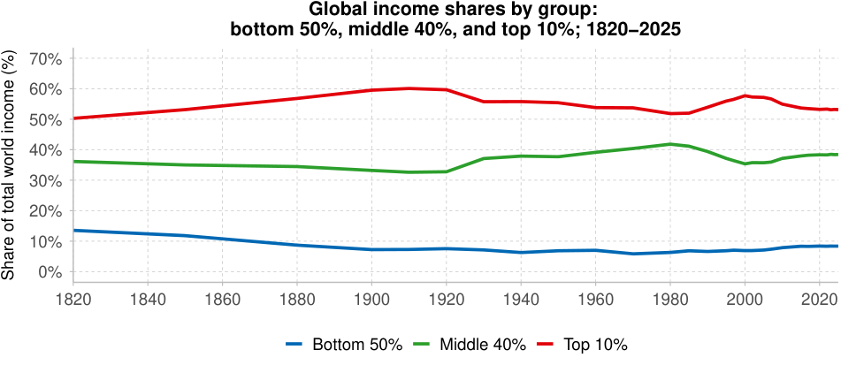

**----- Start of picture text -----** 
Global income shares by group: bottom 50%, middle 40%, and top 10%; 1820−2025 70% 60% 50% 40% 30% 20% 10% 0% 1820 1840 1860 1880 1900 1920 1940 1960 1980 2000 2020 Bottom 50% Middle 40% Top 10% Share of total world income (%) **----- End of picture text -----** 

**Interpretation.** The share of global income going to the top 10% highest incomes at the world level has fluctuated around 50%–60% between 1820 and 2025 (50% in 1820, 60% in 1910, 52% in 1980, 58% in 2000, 53% in 2025). The share of global income going to the bottom 50% lowest incomes at the world level has fluctuated around 6%–14% between 1820 and 2025 (14% in 1820, 7% in 1910, 6% in 1980, 7% in 2000, 8% in 2025). Global inequality has always been very large. It rose between 1820 and 1910 and shows little change over the long term between 1910 and 2025. Income is measured per capita after pension and unemployment insurance transfers and before income and wealth taxes. **Sources and series:** wir2026.wid.world/methodology. 

than income gaps. Even in Europe, the region with the lowest income inequality, the wealth of the top 10% is nearly 200 times that of the bottom 50%. In South & Southeast Asia and East Asia, regions with relatively lower wealth inequality, wealth disparities are still significant and many times greater than income inequality. At the extreme, the Middle East & North Africa and North America & Oceania stand out with the widest wealth divides, over 520 to 1. By contrast, their income ratios are lower than 55 to 1. Other regions, such as Sub-Saharan Africa and Latin America, also combine very high income gaps (over 50 to 1) with staggering wealth gaps (over 260 to 1). 

From **Figure 1.12** and **Figure 1.13** , we can see that inequality is enormous both across regions and within them. Some regions, like North America & Oceania, enjoy higher average income and wealth than the world average, yet still exhibit vast internal disparities. Others, like Sub-Saharan Africa, face the double burden of low average levels and extreme internal divides. 

In **Chapter 2** , we will return to regional income inequalities in greater detail, before 

turning in **Chapter 3** to explore regional wealth inequalities more fully. Together, these perspectives help clarify how inequality is structured not only across the globe, but also within the regions that make it up. 

## **Main takeaways** 

Over the past two centuries, the world has witnessed an unprecedented rise in average income and output. Yet, global income and wealth shares remain deeply unequal. 

The global population is unevenly distributed across the income and wealth hierarchy: 2.8 billion adults belong to the bottom 50%, 2.2 billion to the middle 40%, and only 556 million to the top 10%. Within this top group, sizes shrink from 56 million in the top 1% to just fifty-six individuals at the very top 1/100 million. Income inequality is very large. It has persisted and mutated during the last two hundred years and is increasing (see also Chancel and Piketty (2021)). Today, the global top 10% earns more than half of all income, while the bottom 50% earns only a 

44 

Chapter 1. Global Economic Inequality 

**Figure 1.10. Extreme income inequality has been persistent during the last two centuries** 

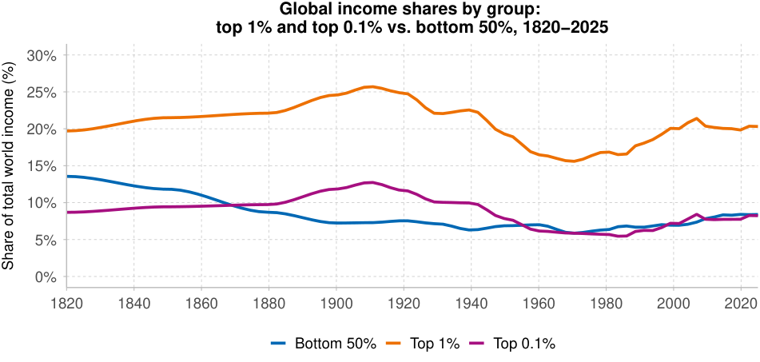

**----- Start of picture text -----** 
Global income shares by group: top 1% and top 0.1% vs. bottom 50%, 1820−2025 30% 25% 20% 15% 10% 5% 0% 1820 1840 1860 1880 1900 1920 1940 1960 1980 2000 2020 Bottom 50% Top 1% Top 0.1% Share of total world income (%) **----- End of picture text -----** 

**Interpretation.** The share of global income going to the top 1% highest incomes at the world level has hovered around 16%–26% between 1820 and 2025 (20% in 1820, 26% in 1910, 16% in 1970, 20% in 2025). It has always been substantially greater than the share going to the bottom 50%, which has generally been of the same order of magnitude as the share going to the top 0.1%. Income is measured per capita after pension and unemployment insurance transfers and before income and wealth taxes. **Sources and series:** wir2026.wid.world/methodology. 

tiny fraction, and the richest 0.1% takes as much as half of the world’s adult population combined. Looking back two centuries, the top 10% has consistently captured over 50% of global income, while the bottom 50% has remained stuck below 15%. 

divides in greater depth. Understanding where and how inequality is entrenched is the first step toward designing policies that can address it. 

Wealth inequality is even larger than income inequality and is increasing more rapidly. The top 10% owns three-quarters of all assets while the bottom half holds only 2%, and the top 1% alone controls 37%, far more than the entire bottom 50%. At the extreme, a few thousand billionaires hold more wealth than billions of people combined, and since the 1990s, centi-millionaires and billionaires have seen their wealth grow far faster than everyone else. 

A unique feature of the _World Inequality Database_ (wid.world) is that it measures income and wealth across the entire distribution, from the poorest to the very richest individuals. This makes it possible to uncover extreme concentration at the very top, which would otherwise remain invisible. The chapters that follow will explore these 

45 

Chapter 1. Global Economic Inequality 

## **Figure 1.11. Uneven repartition of income** 

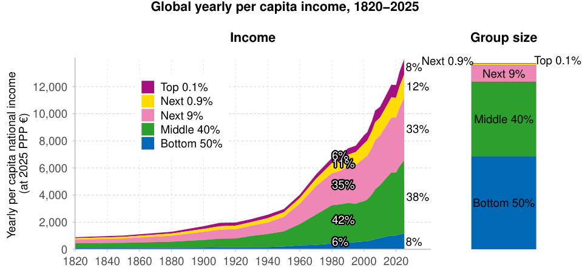

**----- Start of picture text -----** 
Global yearly per capita income, 1820−2025 Income Group size Next 0.9 % T op 0.1% 8% Next 9% 12,000 Top 0.1% 12% Next 0.9% 10,000 Next 9% Middle 40% Middle 40% 33% 8,000 Bottom 50% 6%6%6%6% 6,000 11%11% 11% 11% 35%35%35%35% 4,000 38% Bottom 50% 2,000 42%42%42%42% 6%6%6%6% 8% 0 1820 1840 1860 1880 1900 1920 1940 1960 1980 2000 2020 (at 2025 PPP €) Yearly per capita national income **----- End of picture text -----** 

**Interpretation.** Global income has grown substantially since 1820, but the benefits have not been shared evenly. In 2025, the top 10% of earners capture 53% of global income, while the bottom 50% receive only 8%. The top 0.1% earns about 8% on its own, as much as the entire bottom half of the population. The income share of the middle 40% is 38%. There are 8 million people in the top 0.1% and 74 million people in the next 0.9%, compared to 4.1 billion people in the bottom 50%. **Sources and series:** wir2026.wid.world/methodology. 

**Figure 1.12. There is very large inequality across regions** 

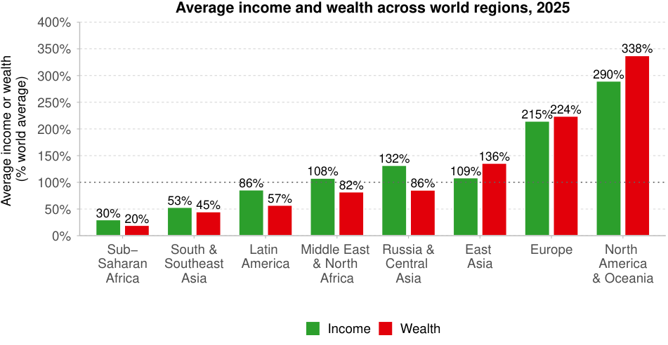

**----- Start of picture text -----** 
Average income and wealth across world regions, 2025 400% 350% 338% 300% 290% 250% 215% [224%] 200% 150% 132% 136% 108% 109% 100% 86% 82% 86% 53% 57% 50% 30% 45% 20% 0% Sub− South & Latin  Middle East  Russia & East  Europe North Saharan Southeast America & North  Central  Asia America Africa Asia Africa Asia & Oceania Income Wealth (% world average) Average income or wealth **----- End of picture text -----** 

**Interpretation.** In 2025, the average income of North America & Oceania is 290% of the world average income (at 2025 PPP) and the average wealth of North America & Oceania is 338% of the world average wealth (at 2025 PPP). **Sources and series:** Bauluz et al. (2025) and wir2026.wid.world/methodology. 

46 

Chapter 1. Global Economic Inequality 

**Figure 1.13. There is also very large inequality within regions** 

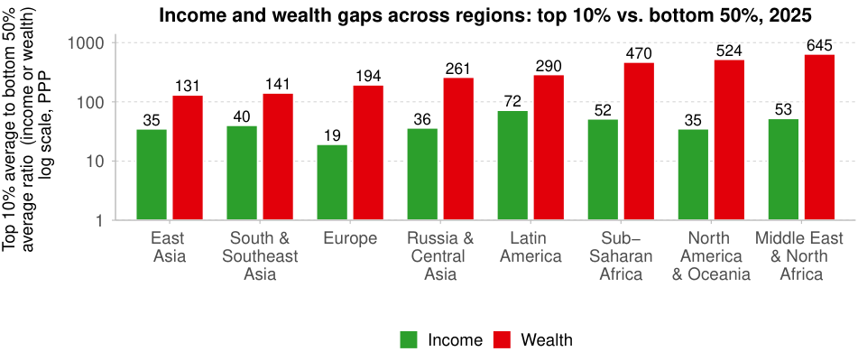

**----- Start of picture text -----** 
Income and wealth gaps across regions: top 10% vs. bottom 50%, 2025 1000 470 524 645 261 290 194 131 141 100 72 52 53 35 40 36 35 19 10 1 East  South & Europe Russia & Latin  Sub− North  Middle East Asia Southeast Central  America Saharan America & North Asia Asia Africa & Oceania Africa Income Wealth  log scale, PPP Top 10% average to bottom 50%  average ratio  (income or wealth) **----- End of picture text -----** 

**Interpretation.** In Russia & Central Asia, the bottom 50% earns 36 times less income than the top 10%. The value is 19 in Europe. The bottom 50% in Russia & Central Asia holds 261 times less wealth than the top 10%. Net personal wealth is equal to the sum of financial assets (e.g. equity or bonds) and non−financial assets (e.g. housing or land) owned by individuals, net of their debts. Income is measured after pension and unemployment benefits are received by individuals, but before other taxes they pay and transfers they receive. **Sources and series:** Andreescu and Sodano (2024), Arias−Osorio et al. (2025), Bharti and Mo (2024), Chancel and Piketty (2021), El Hariri (2024), Flores and Zúñiga−Cordero (2024), Forward and Fisher−Post (2024), Loubes and Robilliard (2024), and wir2026.wid.world/methodology. 

47 

Chapter 1. Global Economic Inequality 

## Box 1.1: Regions used in the _World Inequality Report 2026_ 

For analytical purposes, the World Inequality Lab divides the world into eight regions: East Asia (EASA), Europe (EURO), Latin America (LATA), the Middle East & North Africa (MENA), North America & Oceania (NAOC), Russia & Central Asia (RUCA), South & Southeast Asia (SSEA), and Sub-Saharan Africa (SSAF). 

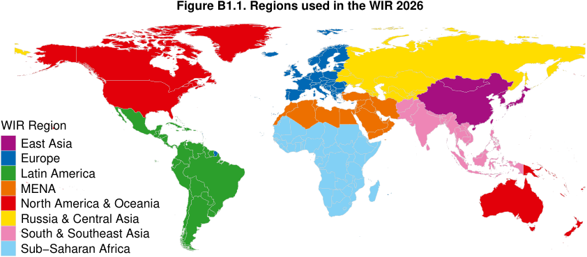

**----- Start of picture text -----** 
Figure B1.1. Regions used in the WIR 2026 WIR Region East Asia Europe Latin America MENA North America & Oceania Russia & Central Asia South & Southeast Asia Sub−Saharan Africa **----- End of picture text -----** 

**Sources and series:** wir2026.wid.world/methodology. 

These categories are not fixed: users of the _World Inequality Database_ (wid.world) can regroup countries according to their own criteria. 

48 

Chapter 1. Global Economic Inequality 

## Box 1.2: The Inequality Transparency Index 

High-quality data are essential for informed debates on inequality, yet in many countries information on income and wealth distribution remains scarce or inaccessible. To address this gap, the World Inequality Lab, in partnership with the United Nations Development Programme, created the Inequality Transparency Index (ITI). The ITI measures how transparent countries are in publishing inequality data. 

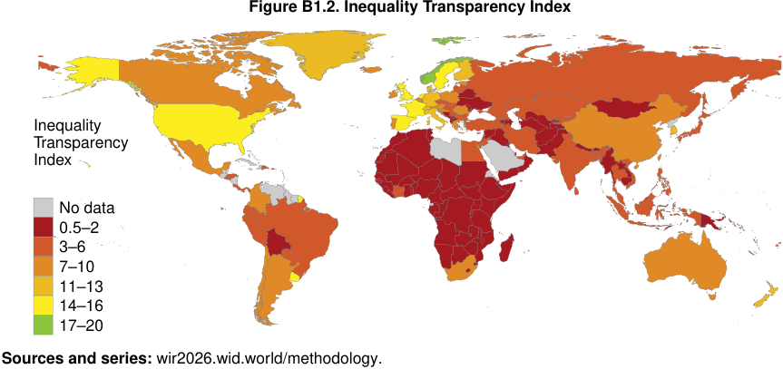

**----- Start of picture text -----** 
Figure B1.2. Inequality Transparency Index Inequality Transparency Index No data 0.5–2 3–6 7–10 11–13 14–16 17–20 Sources and series:  wir2026.wid.world/methodology. **----- End of picture text -----** 

Scores range from 0 to 20. An ideal score reflects the publication of annual distributional accounts of income and wealth, combining household surveys with administrative tax records. No country has yet achieved full transparency. The ITI evaluates four data sources (income surveys, income tax, wealth surveys, and wealth tax data) across three criteria: quality, frequency, and accessibility. Its purpose is not only to assess the state of inequality statistics but also to encourage governments to publish the data they hold. Without such transparency, public debates risk being guided by conjecture rather than evidence. 

49 

Notes 

## **Notes** 

> 4Furthermore, Alfani (2025) shows that inequality for both income and wealth has tended to grow continuously over the last seven centuries, not only since the Industrial Revolution. 

> 5Note: If the top 10% earns 40% of all income and the bottom 50% earns 20%, then the rich make ten times more on average than the poor (40 ÷ 10 = 4 vs. 20 ÷ 50 = 0.4; 4 ÷ 0.4 = 10). 

## **References** 

- Alfani, Guido (2025). “Inequality in history: A long-run view”. In: _Journal of Economic Surveys_ 39.2, pp. 546–566. 

- Andreescu, Marie and Alice Sodano (2024). “2024 DINA Update for Europe”. In: _World Inequality Lab, Technical Notes_ 2024/05. 

- Arias-Osorio, Manuel et al. (2025). “Equality and Development: A Comparative & Historical Perspective 1800-2025”. In: _World Inequality Lab, Working Paper Series_ . 

- Bauluz, Luis et al. (2025). “Global Wealth Accumulation and Ownership Patterns 1800-2025”. In: _World Inequality Lab, Working Paper Series_ 2025/22. 

- Bharti, Nitin and Zhexun Mo (2024). “2024 DINA Update for Asia”. In: _World Inequality Lab, Technical Notes_ 2024/08. 

- Chancel, Lucas, Ignacio Flores, et al. (2025). _Distributional National Accounts Guidelines: Methods and Concepts used in the World Inequality Database_ . `https://wid.world/d ocument/distributional-national-accounts-dina -guidelines-2025-methods-and-concepts-used-i n-the-world-inequality-database/` . Version 3.0. 

- Chancel, Lucas and Thomas Piketty (2021). “Global income inequality, 1820–2020: The persistence and mutation of extreme inequality”. In: _Journal of the European Economic Association_ 19.6, pp. 3025–3062. 

- Chancel, Lucas, Thomas Piketty, et al. (2022). _World Inequality Report 2022_ . Harvard University Press. 

- El Hariri, Dima (2024). “2024 DINA Update for MENA”. In: _World Inequality Lab, Technical Notes_ 2024/09. 

- Flores, Ignacio and Alvaro Zúñiga-Cordero (2024). “2024 DINA Update for Latin America”. In: _World Inequality Lab, Technical Notes_ 2024/10. 

- Forward, Tayla and Matthew Fisher-Post (2024). “2024 DINA Update for New Zealand”. In: _World Inequality Lab, Technical Notes_ 2024/06. 

- Gómez-Carrera, Ricardo et al. (2025). “Extending WID Population Series: Projections 2024-2100 & Age/Gender Breakdowns”. In: _World Inequality Lab, Technical Notes_ 2024/12. 

- Loubes, Romaine and Anne-Sophie Robilliard (2024). “2024 DINA Update for Africa”. In: _World Inequality Lab, Technical Notes_ 2024/07. 

- Nievas, Gastón and Thomas Piketty (2025). “WID National Accounts Series: Updated and Extended Coverage 1800-2023”. In: _World Inequality Lab, Technical Notes_ 2025/02. 

50 

# **CHAPTER 2 Regional Income Inequality** 

Chapter 2. Regional Income Inequality 

## **Contents of this chapter** 

|**tents of this chapter**||
|---|---|
|Global and regional shifts in income and population since 1800 . . . . . . . . . . . .|**53**|
|Income inequality across the world in 2025 . . . . . . . . . . . . . . . . . . . . . . .|**55**|
|Income inequality within regions in 2025 . . . . . . . . . . . . . . . . . . . . . . . . .|**56**|
|Income inequality within countries in 2025 . . . . . . . . . . . . . . . . . . . . . . . .|**59**|
|The role of redistribution in reducing income inequality . . . . . . . . . . . . . . . . .|**62**|
|Main takeaways . . . . . . . . . . . . . . . . . . . . . . . . . . . . . . . . . . . . . . .|**64**|
|Box 2.1: Country rankings for large countries according to per capita national||
|income . . . . . . . . . . . . . . . . . . . . . . . . . . . . . . . . . . . . . . . . .|**68**|
|Box 2.2: Country rankings according to per capita national income . . . . . . . . . .|**69**|

52 

Chapter 2. Regional Income Inequality 

**Chapter 2** examines income inequality from a regional perspective. It shows that the regions where most people live, South & Southeast Asia and Sub-Saharan Africa, remain far behind the richest ones, such as North America & Oceania and Europe. Within regions, income inequality is also large: in nearly all of them, the top 1% alone earn more than the bottom 50% combined. The chapter also highlights the role of redistribution, demonstrating that taxes and, especially, transfers can narrow these divides, although with varying effectiveness across regions. 

## **Global and regional shifts in income and population since 1800** 

Over the past two centuries, the geography of income and population has undergone a significant transformation: while Europe and North America & Oceania remain the highest-income regions, East Asia, South & Southeast Asia, and Sub-Saharan Africa account for the majority of the world’s population, creating a profound imbalance between demographic weight and economic power. 

**Figure 2.1** presents a long-run view of yearly per capita income and population across world regions since 1800, drawing on the _World Inequality Database_ (wid.world). On the left-hand side, the income panel displays an evident pattern of divergence, followed by partial convergence in recent years. For more than two centuries, North America & Oceania and Europe have stood out as the regions where people consistently earn the highest average incomes, well above the global level. North America & Oceania, in particular, has led since the early 19th century, with average earnings above €45,000 by 2025. Although the region’s long-term growth rate is relatively strong (1.6% per year since 1800), its pace has slowed in the 21st century (1.1% per year). Europe and Latin America have also slowed to near-stagnation since 2000. In contrast, East Asia tells one of the most remarkable income catch-up stories of modern history. From being the poorest region in the mid-20th century, it grew at 4.2% per year between 1950 and 2025, and at an even faster 5.0% per 

year since 2000. The result is a dramatic transformation: East Asia’s yearly per capita income, which was below €1,000 in 1950, now exceeds €17,000, surpassing most regions. South & Southeast Asia has also accelerated, especially since 1980, making it the second-fastest-growing region in the 21st century, behind East Asia. Russia & Central Asia, which experienced episodes of income decline in the late 20th century, completes the trio of fastest-growing regions during this century. 

At the other extreme, Sub-Saharan Africa has experienced persistent challenges. It remains the region where people earn the least, with average income still below €3,500 in 2025. Its performance has been volatile, with declines between 1980 and 2000 and only modest improvements since then. Although its recent growth rate of 1.8% per year since 2000 marks its most successful period of progress, the gap with the rest of the world remains substantial. The Middle East & North Africa has also seen uneven growth, with modest improvements in the early 21st century after a period of stagnation. 

Globally, the most dynamic period of income growth occurred between 1950 and 1980 (2.9% per year), fueled by postwar reconstruction in Europe, the boom in North America, and the first wave of acceleration in Asia. A second wave has taken shape since 2000 (2.2% per year), led this time by Asia, while other regions slowed. This contrasts sharply with the 19th century, when global income growth was minimal, at well under 1% per year, from 1800 until 1950. 

The right-hand panel of **Figure 2.1** complements this picture by tracing population dynamics. Asia has been the world’s demographic center, but its internal balance has shifted. East Asia, once home to 40% of the world’s people, now represents only 20%, as population growth slowed after the 1970s (see also **Figure 2.2** ). South & Southeast Asia, by contrast, has become the most populous region, with one-third of humanity in 2025. Sub-Saharan Africa is notable for its rapid demographic expansion: from 10% of the world’s population in 1800 to 16% in 2025, with further increases expected. 

Other regions follow different trajectories. 

53 

Chapter 2. Regional Income Inequality 

## **Figure 2.1. The least populated regions have higher average incomes** 

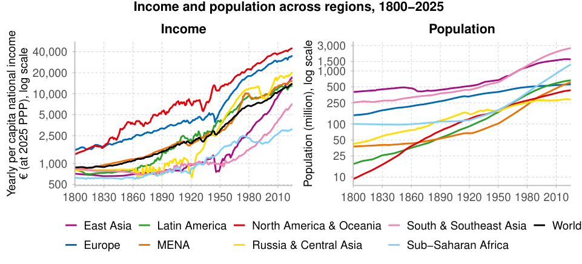

**----- Start of picture text -----** 
Income and population across regions, 1800−2025 Income Population 3,000 40,000 1,500 20,000 1,000 500 10,000 250 5,000 100 2,500 50 25 1,000 10 500 1800 1830 1860 1890 1920 1950 1980 2010 1800 1830 1860 1890 1920 1950 1980 2010 East Asia Latin America North America & Oceania South & Southeast Asia World Europe MENA Russia & Central Asia Sub−Saharan Africa € (at 2025 PPP), log scale Population (million), log scale Yearly per capita national income **----- End of picture text -----** 

**Interpretation.** Income per person increased from €876 in 1800 to €14,031 in 2025, a multiplication by about 16, corresponding to an average annual growth rate of 1.2%. In 2025, North America & Oceania has an average income 14 times larger than Sub−Saharan Africa (2 in 1800). World population rose from 1 billion to 8 billion, with an average annual growth rate of 0.9%. In 2025, North America & Oceania represents 5% of world population (1% in 1800), and Sub−Saharan Africa 16% (10% in 1800). **Sources and series:** Gómez−Carrera et al. (2025), Nievas and Piketty (2025), and wir2026.wid.world/methodology. 

Europe, once home to almost one-fifth of the world’s people in 1900, now represents only 7%. North America & Oceania grew in relative terms but still account for just 5%. Latin America and the Middle East & North Africa, although larger than in 1800, remain medium-sized regions, accounting for about 7–8%. Russia & Central Asia remains stable at around 4% after two centuries. 

Taken together, the two panels reveal a fundamental imbalance in the global economy: the regions where people earn the most (North America & Oceania and Europe) account for only a small share of the world’s population, while the most populous regions (South & Southeast Asia and Sub-Saharan Africa) have the lowest average incomes. This combination of demographic and economic asymmetries is central to understanding global inequality, and mirrors the findings from **Chapter 1** , where rising averages often conceal deep divides within and between regions. 

**Figure 2.2** helps place these results in a broader perspective by showing how the global distribution of income and population 

has shifted over time. The left-hand panel illustrates regional income shares, while the right-hand panel tracks population shares. At the beginning of the 19th century, East Asia accounted for approximately 32% of the world’s income, making it the world’s economic center. Over the following century and a half, its share collapsed to only 8% by 1950, before rebounding to 25% today. Europe, by contrast, expanded its share from 26% in 1800 to nearly 40% by 1900, before declining steadily to 17% in 2025. North America & Oceania started from just 1% in 1800, surged to almost 30% by the mid-20th century, and now also stands at 17%. South & Southeast Asia, once responsible for nearly one-quarter of global income, fell to just 8% around 1950 but has since climbed back to 17%. Sub-Saharan Africa’s share has remained low, shrinking from 7% in 1800 to only 4% today, similar to Russia & Central Asia. In contrast, Latin America and the Middle East & North Africa contribute around 7–8% each. 

These shifts demonstrate how global economic weight has shifted over time, first toward Europe and North America & Oceania 

54 

Chapter 2. Regional Income Inequality 

**Figure 2.2. Global economic weight is shifting back toward Asia** 

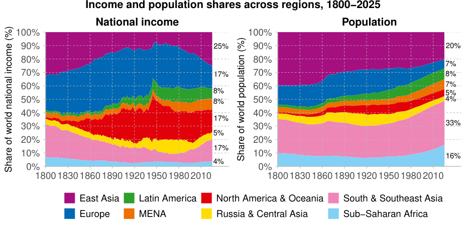

**----- Start of picture text -----** 
Income and population shares across regions, 1800−2025 National income Population 100% 100% 90% 25% 90% 20% 80% 80% 7% 70% 17% 70% 8% 60% 60% 7% 8% 5% 50% 8% 50% 4% 40% 40% 17% 30% 30% 33% 5% 20% 20% 17% 10% 10% 16% 4% 0% 0% 18001830186018901920195019802010 18001830186018901920195019802010 East Asia Latin America North America & Oceania South & Southeast Asia Europe MENA Russia & Central Asia Sub−Saharan Africa Share of world population (%) Share of world national income (%) **----- End of picture text -----** 

**Interpretation.** These graphs show how shares of global population and national income evolved across regions between 1800 and 2025. While Europe and North America & Oceania saw a relative decline in both demographic and economic weight since the mid−twentieth century, the population share of South & Southeast Asia and Sub−Saharan Africa increased, while the income share of East Asia and South & Southeast Asia rose. **Sources and series:** Gómez−Carrera et al. (2025), Nievas and Piketty (2025), and wir2026.wid.world/methodology. 

during the 19th and early 20th centuries, and more recently back toward Asia. Yet they also highlight a persistent imbalance: two of the three most populous regions, South & Southeast Asia and Sub-Saharan Africa, still capture only a limited share of total income. 

## **Income inequality across the world in 2025** 

In this next section, we examine income differences across regions in 2025. **Figure 2.3** presents average monthly per capita national incomes by region, adjusted for purchasing power parity to ensure comparability. The disparities are immediate and dramatic. North America & Oceania stands out with average monthly incomes of about €3,800, about 3.2 times the world average. Europe follows at €2,900 per month, about 2.4 times the global mean. Russia & Central Asia (€1,700), East Asia (€1,500), and the Middle East & North Africa (€1,300) sit closer to the middle of the global distribution, though still above average. Latin America (€1,100) falls just below the global mean, while South & Southeast Asia (€600) lags significantly behind. Sub-Saharan Africa 

is at the very bottom, with an average of just €300 per month. 

The ratios underscore the depth of these inequalities. On average, a person in North America & Oceania earns about thirteen times more than someone in Sub-Saharan Africa, and about 2.5 times more than someone in East Asia. Even within the higher-income group, North America & Oceania earns about 1.3 times more than Europe. By contrast, South & Southeast Asia earns only half the world’s average, and about 40% of East Asia’s level. Sub-Saharan Africa falls furthest behind: its income per person is about one-fifth of East Asia’s, one-tenth of Europe’s, and one-fourth of the world’s mean. 

These comparisons show a world divided into clear tiers: a high-income group (North America & Oceania and Europe), a middle group (East Asia, Russia & Central Asia, and Middle East & North Africa), and regions below or far below the world average (Latin America, South & Southeast Asia, and Sub-Saharan Africa). This reinforces the broader lesson from **Figure 2.1** and **Figure 2.2** : the regions where most people live remain far below the income levels of 

55 

Chapter 2. Regional Income Inequality 

**Figure 2.3. A person in North America & Oceania earns about 13 times more than someone in Sub-Saharan Africa** 

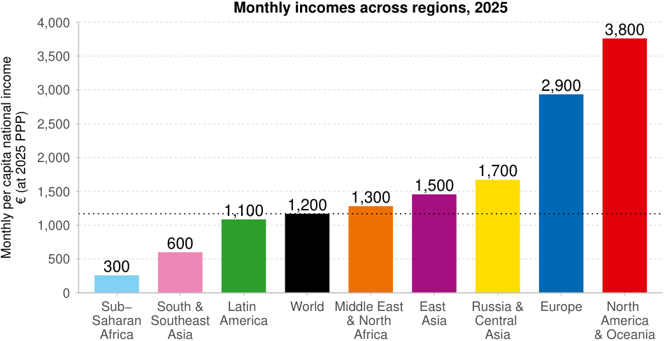

**----- Start of picture text -----** 
Monthly incomes across regions, 2025 4,000 3,800 3,500 3,000 2,900 2,500 2,000 1,700 1,500 1,500 1,300 1,200 1,100 1,000 600 500 300 0 Sub− South & Latin  World Middle East  East  Russia & Europe North Saharan Southeast America & North  Asia Central  America Africa Asia Africa Asia & Oceania € (at 2025 PPP) Monthly per capita national income **----- End of picture text -----** 

**Interpretation.** There are huge disparities, in terms of income, between regions. A person in South & Southeast Asia has an average monthly income of €601, while a person in Europe has an average monthly income of €2,934. This is 4.9 times larger. **Sources and series:** wir2026.wid.world/methodology. 

the world’s richest regions, cementing the demographic and economic imbalances at the heart of global inequality. 

**Figure 2.4** takes the analysis to the country level. Here, the lightest shades correspond to the highest per capita monthly incomes, while the darkest indicate the lowest. The global pattern is striking. The lowest incomes are concentrated in Sub-Saharan Africa, as seen in **Figure 2.3** , while the highest incomes are clustered in North America, Oceania, and certain parts of Europe. Within Europe, clear differences remain: northern and western countries are among the global leaders, while several in the east fall into lower-income brackets, closer to the levels of Russia & Central Asia. East Asia now occupies a middle position in the world distribution, representing a significant improvement compared to its position in the mid-20th century (see **Figure 2.1** ). Meanwhile, the Middle East exhibits a sharp divide between oil-rich states in the Gulf, which achieve very high income levels, and much poorer countries, such as Yemen. 

The extremes highlight the scale of the 

global gap. In Luxembourg, monthly income per person is about €12,110, while in Burundi it is barely €50, more than a 240-fold difference. The accompanying Boxes at the end of this chapter expand on these findings: **Box 2.1.1** ranks countries according to per capita income, and **Box 2.2.2** shows how country size itself relates to per capita income. 

## **Income inequality within regions in 2025** 

So far in this chapter, we have analyzed inequality across regions, comparing incomes between different parts of the world, both over the long run and in 2025. Another important dimension is how populations are distributed within those regions. **Figure 2.5** provides this perspective by showing the global income distribution in 2025. Each colored area corresponds to a region, scaled by its share of the world population, with the world average indicated as a reference point. 

The figure reveals the sharp contrasts that define today’s global economy. Sub-Saharan 

56 

Chapter 2. Regional Income Inequality 

## **Figure 2.4. Incomes are very unequal across countries** 

**----- Start of picture text -----** 
Monthly incomes across countries, 2024 **----- End of picture text -----** 

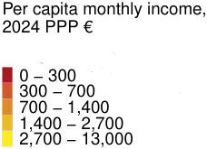

**----- Start of picture text -----** 
Per capita monthly income, 2024 PPP € 0 − 300 300 − 700 700 − 1,400 1,400 − 2,700 2,700 − 13,000 **----- End of picture text -----** 

**Interpretation.** This map shows average monthly national income per capita in 2024 euros. Countries are grouped into quantile−based income brackets. In Luxembourg, average monthly income per person is about €12,110 , while in Burundi, it is about €50. **Sources and series:** wir2026.wid.world/methodology. 

Africa and South & Southeast Asia stand out as the regions where the majority of people live below the global average income of around €1,300 per month. In Sub-Saharan Africa, in particular, a large share of the population is clustered at the very bottom, earning less than €500 per month, confirming the persistent disadvantage highlighted in **Figure 2.3** and **Figure 2.4** . South & Southeast Asia spans a broader range, but still remains concentrated below global averages. 

By contrast, Europe and North America & Oceania appear almost entirely to the right of the world average, with most of their populations earning several times more than the global mean. Russia & Central Asia also sit above the world average for the majority of their populations. Latin America and the Middle East & North Africa show a more mixed pattern: their populations are split between lower and higher income levels, reflecting both pockets of relative prosperity and areas of stagnation. East Asia illustrates one of the most significant transformations. Once concentrated at the very bottom of the world distribution (see also **Figure 2.1** and **Figure 2.7** ), the region now has a large 

share of its population above the global average. This shift highlights East Asia’s rapid upward mobility and its increasing influence in shaping the global middle class. 

**Figure 2.6** revisits the standard breakdown of the population into the bottom 50%, the middle 40%, and the top 10% (see **Figure 8** ), with the latter now divided between the top 1% and the next 9%. Regions are ordered by the share of income earned by the top 1%, which immediately reveals how unevenly income is distributed globally. Europe demonstrates the least unequal distribution: the bottom 50% earn 19% of total income, the highest share worldwide, while the middle 40% capture 45%. Together, this means that nearly two-thirds of all income in Europe goes to the bottom 90% of the population, a pattern unmatched elsewhere. Yet inequality is still visible: the top 10% earn 36%, and the top 1% alone captures 12%. 

East Asia and North America & Oceania present similar profiles in some respects: in both, the middle 40% earn just above 40% of total income (42% and 41% respectively), and the top 10% capture about 46%. In both cases, the bottom 50% earn only 13%, 

57 

Chapter 2. Regional Income Inequality 

**Figure 2.5. Most individuals who earn below the global average are in SSAF and SSEA** 

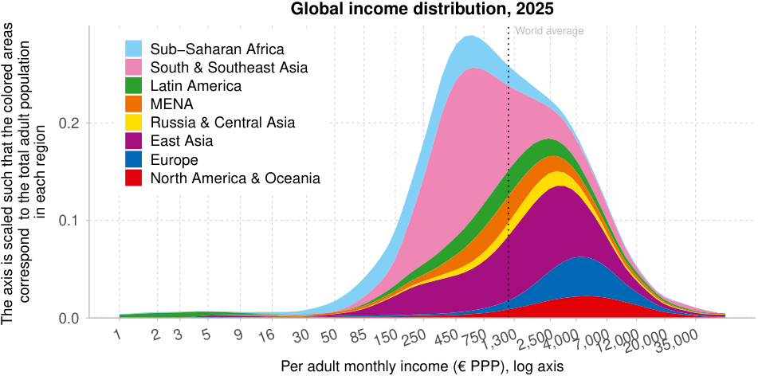

**----- Start of picture text -----** 
Global income distribution, 2025 World average Sub−Saharan Africa South & Southeast Asia Latin America MENA 0.2 Russia & Central Asia East Asia Europe North America & Oceania 0.1 0.0 Per adult monthly income (€ PPP), log axis 1 2 3 5 9 16 30 50 85 150250 4507501,3002,5004,0007,00012,00020,00035,000 in each region  correspond  to the total adult population The axis is scaled such that the colored areas **----- End of picture text -----** 

**Interpretation.** The graph shows the size and geographical repartition of the global population at different levels of the income distribution.The relative size of each color wedge is proportional to the population in a region. Incomes are measured after pension and unemployment benefits are received by individuals, and before income and wealth taxes. **Sources and series:** wir2026.wid.world/methodology and Chancel et al. (2022). 

significantly below Europe. However, there are also notable differences between the two regions. In North America & Oceania, the top 1% alone takes 20% of all income, a larger concentration than in East Asia, where the top 1% capture 17%. This means East Asia’s middle class is slightly stronger relative to the top, even though both regions show a weaker bottom half compared to Europe. 

Russia & Central Asia is marked by an even sharper concentration at the very top: its top 1% earn 23% of total income (similar to the Middle East & North Africa), far more than the bottom 50% (14%). This inversion, where the top 1% earn more than the entire bottom half, is present in every region except Europe. Put differently, in almost all regions, just 1% of the population receives more income than half of the region’s population combined. 

The imbalance is most extreme in Latin America, Sub-Saharan Africa, and the Middle East & North Africa. Here, the bottom 50% earn just 8–11% of income, while the top 10% capture between 55% and 57%. Within that, the top 1% alone secures 20–24% of total income, more than double 

the share of the bottom half. These regions combine both a very weak bottom 50% and a disproportionately large top 1%, making them the most unequal. South & Southeast Asia shows a similar profile but with a somewhat stronger bottom 50% (14%), though its top 1% still captures 21% of total income. These results show that extreme concentration of income at the very top is a defining feature of the global economy today. 

**Figure 2.7** provides a geographic breakdown of global income groups in 1980 and 2025, highlighting how the composition of top earners and other groups has shifted over time. In 1980, the global elite was overwhelmingly concentrated in North America & Oceania and Europe, which together accounted for most of the world’s top income groups. Latin America also had some presence near the top, but China and India were almost entirely confined to the bottom half of the distribution. At that time, China had virtually no presence among the global elite, while India, Asia in general, and Sub-Saharan Africa were heavily concentrated in the very lowest percentiles. 

58 

Chapter 2. Regional Income Inequality 

**Figure 2.6. Extreme concentration of income at the very top is a defining feature of the global economy** 

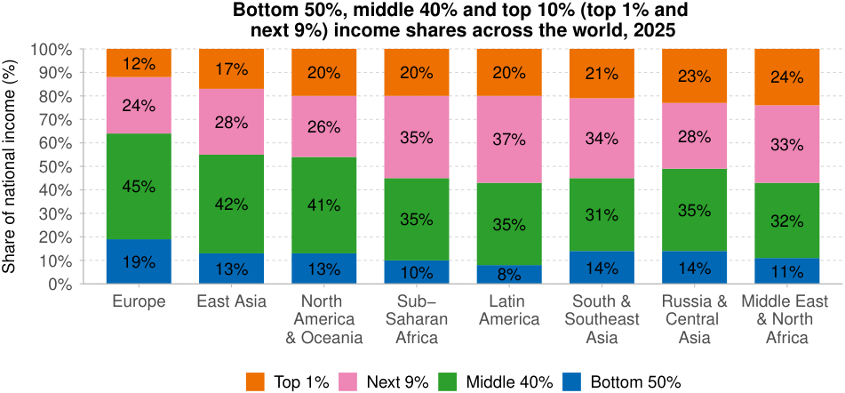

**----- Start of picture text -----** 
Bottom 50%, middle 40% and top 10% (top 1% and next 9%) income shares across the world, 2025 100% 12% 90% 17% 20% 20% 20% 21% 23% 24% 80% 24% 70% 28% 26% 60% 35% 37% 34% 28% 33% 50% 40% 45% 30% 42% 41% 35% 35% 31% 35% 32% 20% 10% 19% 13% 13% 10% 8% 14% 14% 11% 0% Europe East Asia North  Sub− Latin  South & Russia & Middle East America Saharan America Southeast Central  & North & Oceania Africa Asia Asia Africa Top 1% Next 9% Middle 40% Bottom 50% Share of national income (%) **----- End of picture text -----** 

**Interpretation.** In Latin America, the top 1% captures 20% of national income, and the next 9% an additional 37%. Together, the top 10% earns 57%, compared to 36% in Europe. Income is measured after pension and unemployment benefits are received by individuals, but before income taxes and other transfers. **Sources and series:** wir2026.wid.world/methodology, Andreescu and Sodano (2024), Bharti and Mo (2024), El Hariri (2024), Flores and Zúñiga−Cordero (2024), Forward and Fisher−Post (2024), and Loubes and Robilliard (2024). 

By 2025, the picture looks markedly different. China’s position has shifted upward: much of its population has moved into the middle 40%, and a growing share has entered the upper-middle segments of the global distribution. This is also true for other Asian countries. India, by contrast, has lost relative ground: in 1980, a larger part of its population was in the middle 40%, but today almost all are in the bottom 50%. Sub-Saharan Africa has also remained in the lower half of the global distribution, though its population is now more evenly spread within the bottom 60% rather than clustered almost entirely below the 30th percentile, as it was in 1980. 

At the upper end of the distribution, continuity is unmistakable. North America & Oceania continue to dominate the global top 1%, with Europe also maintaining a large share. The composition of the global elite has diversified somewhat, with the Middle East & North Africa and Russia & Central Asia gaining ground, while Latin America’s representation has declined compared to 1980. 

The shifts in **Figure 2.7** reveal a partial reshaping of the global income hierarchy. The rise of China has expanded the global middle class, while the very top remains concentrated in the Global North, and the bottom is heavily populated by South Asia and Sub-Saharan Africa. In short, the geography of inequality has been reshuffled, but not overturned. 

## **Income inequality within countries in 2025** 

**Figure 2.8** to **Figure 2.12** take us inside national income distributions, showing how income is divided between the bottom 50%, the middle 40%, and the top 10% (with a focus also on the top 1%). Together, they illustrate how inequality plays out not only between regions but also within individual countries, and how the balance between these groups varies across the world. 

**Figure 2.8** begins with the bottom 50%. The poorest half of the population captures only a small share of national income almost everywhere. In the most unequal countries of Latin America and Sub-Saharan Africa, 

59 

Chapter 2. Regional Income Inequality 

## **Figure 2.7. The composition of top earners and other groups has shifted over time** 

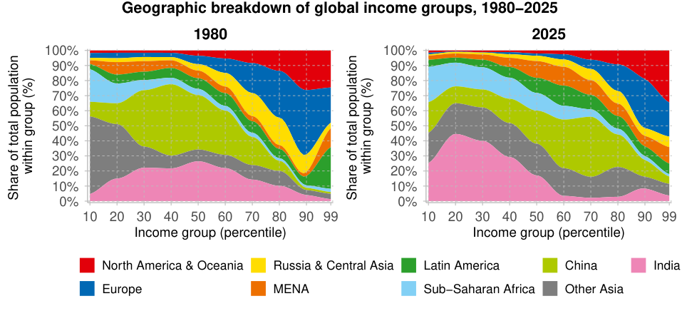

**----- Start of picture text -----** 
Geographic breakdown of global income groups, 1980−2025 1980 2025 100% 100% 90% 90% 80% 80% 70% 70% 60% 60% 50% 50% 40% 40% 30% 30% 20% 20% 10% 10% 0% 0% 10 20 30 40 50 60 70 80 90 99 10 20 30 40 50 60 70 80 90 99 Income group (percentile) Income group (percentile) North America & Oceania Russia & Central Asia Latin America China India Europe MENA Sub−Saharan Africa Other Asia within group (%) within group (%) Share of total population  Share of total population **----- End of picture text -----** 

**Interpretation.** These graphs show the geographical breakdown of global income groups. Between 1980 and 2025, the global income distribution has shifted, with China gaining presence in the middle and upper−middle percentiles, while Europe and North America & Oceania’s dominance in top income groups has declined, but it is still large. In 1980, 1% of the world’s top 1% income group were Chinese residents. By 2025, this figure increased to 5%. This highlights the growing global share of China and the diversification of the global elite. **Sources and series:** Chancel et al. (2022) and wir2026.wid.world/methodology. 

their share falls as low as 6–12%, while in the least unequal economies (mainly in Europe) it rises to 19–28%. North America & Oceania occupy an intermediate position: Canada and Australia are closer to Europe, while the United States is closer to the patterns of inequality of the Global South, with the bottom half receiving around 12–14%. Across Asia, outcomes are diverse. South Asia and much of Southeast Asia fall below 16%, while East Asia is in the mid-range (14–19%), though China lags behind several of its neighbors. Strikingly, nowhere in the world does the bottom half secure more than 30% of income, underscoring their structural exclusion from national income. 

**Figure 2.9** turns to the middle 40%, often considered the backbone of the middle class. Here the contrasts are equally stark. In the most unequal settings, especially in Latin America and parts of Africa, the middle 40% receive as little as 23–35% of income, reflecting a fragile middle class. By contrast, in Europe and parts of North America & Oceania, this group’s share rises to 44–50%, making them central to national income distribution. Asia shows both ends of the 

spectrum: India’s middle 40% remains in the lower levels, while China’s earns a larger share. 

**Figure 2.10** highlights the top 10%. Nowhere does this group earn less than 26% of income. Even in the least unequal countries, the richest 10% still receives more than a quarter of all income. In many countries, especially in Latin America, Sub-Saharan Africa, and the Middle East & North Africa, their share rises above 50%, reaching up to 71% in the most unequal cases. North America & Oceania again split: Canada and Australia sit closer to European patterns, while the United States is more unequal, with the top 10% capturing nearly half of all income. 

**Figure 2.11** zooms in further on the top 1%. This group, though tiny, captures remarkably large shares. In the least unequal settings, the share of this group remains around 7–11%, while in the most unequal countries, it increases to about 21–44%. Latin America and the Middle East & North Africa are again at the upper end, with the United States also appearing among 

60 

Chapter 2. Regional Income Inequality 

## **Figure 2.8. Bottom 50% income shares are very low everywhere** 

**----- Start of picture text -----** 
Bottom 50% income shares across countries, 2025 **----- End of picture text -----** 

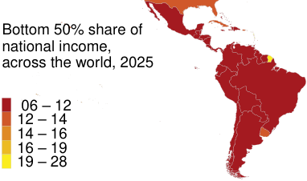

**----- Start of picture text -----** 
Bottom 50% share of national income, across the world, 2025  06 – 12 12 – 14 14 – 16 16 – 19 19 – 28 **----- End of picture text -----** 

**Interpretation.** This map shows the share of national income received by the bottom 50% of the population in each country in 2025. Income is measured after pension and unemployment benefits are received, but before other taxes and transfers. **Sources and series:** wir2026.wid.world/methodology. 

the most unequal. By contrast, Canada, Australia, New Zealand, and most of Europe record lower top 1% shares, though still substantial by any measure. The comparison highlights how some countries have seen the rise of economic elites whose income rivals, or even exceeds, that of the entire bottom half. 

Finally, **Figure 2.12** illustrates the ratio of the incomes of the top 10% to those of the bottom 50%. This single measure captures the scale of inequality in a way that is easy to grasp and compare (see also **Figure 1.13** ). In Europe, the ratio is relatively low, around 9–19: the top 10% earn nine to nineteen times more than the bottom 50%. In Canada, Australia, and New Zealand, the ratio is relatively low; however, in the United States, it is higher and closer to the levels found in the Global South. In Latin America and southern Africa, the ratio exceeds 40:1, and in some cases surpasses 100:1, meaning the top 10% earn more than a hundred times the income of the bottom half. Much of South Asia and the Middle East & North Africa also register high ratios, while East Asia is closer to the middle range. 

consistent picture: income inequality within countries is severe globally, but its intensity varies systematically. Europe, and parts of North America & Oceania, are among the least unequal regions by global standards, although even there, there is large concentration at the top groups. The United States is a notable example of high inequality compared to its high-income peers. Latin America, southern Africa, and the Middle East & North Africa are at the other extreme, with both weak bottom and middle groups and extreme concentration at the top. Asia illustrates the diversity of possible trajectories, with East Asia performing better overall. Across all countries, the maps confirm a fundamental point: the poorest half is consistently underrepresented, the middle class is fragile in much of the world, and the top, especially the top 1%, continues to command disproportionate power over income. The _World Inequality Database_ is particularly useful in this context, as it provides consistent and comparable measures of inequality across countries. 

These figures collectively present a 

61 

Chapter 2. Regional Income Inequality 

## **Figure 2.9. Middle 40% shares are never higher than 50%** 

## **Middle 40% income shares across countries, 2025** 

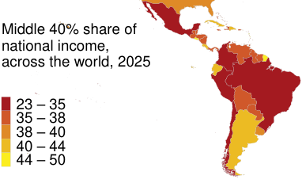

**----- Start of picture text -----** 
Middle 40% share of national income, across the world, 2025 23 – 35 35 – 38 38 – 40 40 – 44 44 – 50 **----- End of picture text -----** 

**Interpretation.** This map shows the share of national income received by the middle 40% of the population (percentiles 50 to 90) in each country in 2025. Income is measured after pension and unemployment benefits are received, but before other taxes and transfers. **Sources and series:** wir2026.wid.world/methodology. 

## **The role of redistribution in reducing income inequality** 

The previous maps showed how unequal income distributions are across countries before government intervention. This section turns to a key question: how much do governments reduce inequality through redistribution? Redistribution here refers to the combined effect of taxes and transfers, such as social benefits, pensions, and other government programs, on the distribution of income. **Figure 2.13** provides the first overview by comparing, at the regional level, inequality before and after redistribution, measured by the ratio of the average income of the top 10% to that of the bottom 50%. The results show that redistribution reduces inequality everywhere, but the extent of its impact varies widely across regions. Europe stands out as the most effective case: before redistribution, the richest 10% earn about nineteen times more than the bottom 50%, but afterwards this ratio falls to ten times, the lowest level worldwide. North America & Oceania also achieve a sharp reduction, with the ratio falling from thirty-five to eighteen. Latin America 

records the highest pre-redistribution gap in the world at 72:1, yet taxes and particularly transfers bring this down to 50:1. This is a substantial improvement, but still leaves the region among the most unequal, alongside Sub-Saharan Africa and the Middle East & North Africa. By contrast, redistribution has only a limited effect in Sub-Saharan Africa, the Middle East & North Africa, South & Southeast Asia, and Russia & Central Asia, where ratios fall by four points or less. 

The reason for these differences becomes clearer in **Figure 2.14** , which separates the effects of taxes and transfers over time. The left panel isolates the effect of taxes alone. With few exceptions, the impact of taxation on inequality is minimal. In Latin America, and in Russia & Central Asia since the 2000s, tax systems are not only weakly redistributive but sometimes regressive, meaning they increase the income gap between rich and poor. In most regions, the redistributive power of taxes is low. Even in the region with the most persistently progressive tax system, North America & Oceania, the effect of taxation alone is modest. **Figure 2.14** also shows that tax progressivity has stagnated in most regions 

62 

Chapter 2. Regional Income Inequality 

## **Figure 2.10. Top 10% income shares are very large everywhere** 

## **Top 10% income shares across countries, 2025** 

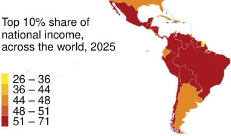

**----- Start of picture text -----** 
Top 10% share of national income, across the world, 2025 26 – 36 36 – 44 44 – 48 48 – 51 51 – 71 **----- End of picture text -----** 

**Interpretation.** This map shows the share of total national income earned by the top 10% of the population in each country in 2025. Income is measured after pension and unemployment benefits are received, but before other taxes and transfers. **Sources and series:** wir2026.wid.world/methodology. 

since 1980, and that there has been no cross-country convergence in effective tax rates (see Fisher-Post and Gethin (2025)).[6] 

**Figure 2.15** complements the left-hand panel of **Figure 2.14** . It maps tax progressivity at the country level. In many countries, particularly in Latin America, Eastern Europe, and parts of Africa, taxes amplify rather than reduce inequality. At the other end of the spectrum, a smaller group of countries, mostly in North America & Oceania and Western Europe, manages to reduce inequality through progressive tax design, cutting gaps between top and bottom groups by 5%–20%. 

The right panel of **Figure 2.14** , which adds transfers, tells a very different story. With pensions, social benefits, and other transfers included, redistribution becomes persistently much more powerful. Europe achieves the largest reductions, cutting inequality by over 40%. North America & Oceania also record large reductions once transfers are taken into account, though slightly less than in Europe. Latin America, despite its regressive tax systems, achieves substantial reductions through transfers alone, underscoring their central 

role in contexts of high inequality. East Asia has also strengthened redistribution since the 2000s, reaching levels comparable to those of the Middle East & North Africa. By contrast, South & Southeast Asia, Sub-Saharan Africa, and Russia & Central Asia remain at the bottom, where both taxes and transfers, though positive, have limited reach. 

**Figure 2.16** reinforces this conclusion with a global map of redistribution accounting for both taxes and transfers. Transfers consistently reduce inequality across all regions, but their strength varies greatly. The largest impacts appear in Western Europe and in North America & Oceania, where redistribution cuts inequality by 40%–60% and, in some cases, even more. South Africa is also notable for the magnitude of redistribution through transfers. Latin America shows significant reductions as well, but nearly all of the effect comes from transfers, while weak or regressive taxes undermine progress. In much of Asia and Africa, redistribution remains modest, with a handful of countries, such as Japan, Thailand, and Taiwan, achieving larger gains than their neighbors.[7] 

63 

Chapter 2. Regional Income Inequality 

## **Figure 2.11. Top 1% income shares are very large** 

**----- Start of picture text -----** 
Top 1% income shares across countries, 2025 **----- End of picture text -----** 

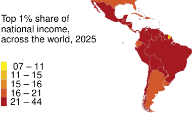

**----- Start of picture text -----** 
Top 1% share of national income, across the world, 2025  07 – 11 11 – 15 15 – 16 16 – 21 21 – 44 **----- End of picture text -----** 

**Interpretation.** This map shows the share of national income earned by the top 1% of the population in each country in 2025. Income is measured after pension and unemployment benefits are received, but before other taxes and transfers. **Sources and series:** wir2026.wid.world/methodology. 

Tax-and-transfer systems reduce inequality everywhere, but the effectiveness of redistribution depends heavily on fiscal design. Taxes alone often do little to close income gaps, and in many countries they make them worse. Transfers, by contrast, provide a consistent and powerful equalizing force. According to research by Fisher-Post and Gethin (2025), transfers account for more than 90% of the reduction in inequality, while taxes contribute less than 10%. 

## **Main takeaways** 

Income inequality between regions remains a defining feature of the global economy. Regional comparisons reveal that contemporary inequalities stretch back nearly two centuries. Over the past decades, East Asia and South & Southeast Asia have experienced rapid gains in per capita income, yet large gaps remain. Today, the regions with the highest incomes, North America & Oceania and Europe, account for only a small share of the world’s population, while two of the most populous regions, South & Southeast Asia and Sub-Saharan Africa, continue to record the lowest average 

incomes. The scale of inequality between regions is remarkable: average incomes in North America & Oceania and Europe are several times higher than the global mean, while those in Sub-Saharan Africa and South & Southeast Asia remain far below average, with incomes only a fraction of the level of the Global North. To illustrate the scale of this divide, the average person in North America & Oceania earns around thirteen times more than the average person in Sub-Saharan Africa. 

Within regions, inequality is also stark. In all parts of the world, the bottom 50% secures only a small fraction of national income, whereas extraordinary shares are concentrated in the top 10%, and especially the top 1% of the population. In every region except Europe, the top 1% alone earn more than the entire bottom half combined. In terms of changes in income over time within each region, China demonstrates the greatest upward shift, with much of its population moving into the middle 40% of the global distribution, reflecting the rise of a new middle class, even as inequality persists. 

Inequality levels within countries vary significantly. Countries in Europe and North 

64 

Chapter 2. Regional Income Inequality 

## **Figure 2.12. Some countries face the double burden of low incomes and very high inequality** 

## **Top 10/bottom 50 income gaps across the world, 2025** 

**----- Start of picture text -----** 
Top 10/bottom 50 income gaps across the world, 2025 09 – 19 19 – 28 28 – 34 34 – 41 41 – 103 **----- End of picture text -----** 

**Interpretation.** This map shows the ratio between the average income of the top 10% and the average income of the bottom 50% of the population in each country in 2025. Income is measured after pension and unemployment benefits are received by individuals, but before other taxes they pay and transfers they receive. **Sources and series:** wir2026.wid.world/methodology and Chancel and Piketty (2021). 

America & Oceania are among the least unequal, though even there, top groups retain significant dominance. The United States is a clear outlier, displaying much higher inequality than its high-income peers. At the other extreme, countries in Latin America, southern Africa, and the Middle East & North Africa combine weak bottom and middle groups with extreme concentration at the top. 

wealth inequality, where disparities are even larger and the concentration at the top is even more pronounced than in the case of income. 

Redistribution through taxes and transfers plays a critical role in reducing inequality. While tax-and-transfer systems reduce inequality in every region, their effectiveness depends heavily on fiscal design. Taxes alone often have little impact, and in some countries they even exacerbate inequality, whereas transfers consistently serve as the main equalizing force, accounting for more than 90% of the reduction in inequality. Strengthening the progressivity of taxes and expanding transfer systems, therefore, remain essential to reduce income concentration at the top and exclusion at the bottom. 

Looking ahead, **Chapter 3** examines 

65 

Chapter 2. Regional Income Inequality 

**Figure 2.13. Redistribution decreases inequality within countries but with large variations** 

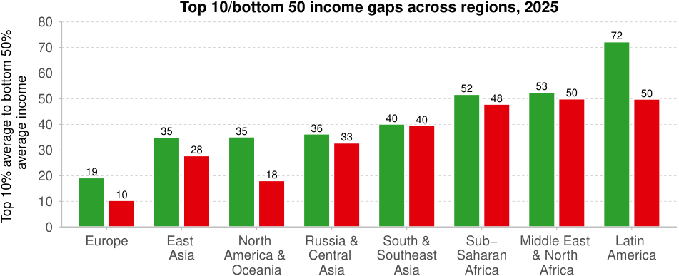

**----- Start of picture text -----** 
Top 10/bottom 50 income gaps across regions, 2025 80 72 70 60 52 53 50 50 50 48 40 35 35 36 40 40 33 30 28 20 19 18 10 10 0 Europe East  North  Russia & South & Sub− Middle East  Latin Asia America &  Central  Southeast Saharan & North  America Oceania Asia Asia Africa Africa  average income Top 10% average to bottom 50% **----- End of picture text -----** 

Before redistribution After redistribution 

**Interpretation.** In North America & Oceania, the bottom 50% earns 35 times less than the top 10% before income tax, whereas after income tax and all transfers, the bottom 50% earns 18 times less than the top 10%. Income is measured after pension and unemployment payments and benefits received by individuals but before other taxes they pay and transfers they receive. **Sources and series:** wir2026.wid.world/methodology and Chancel and Piketty (2021). 

**Figure 2.14. Transfers account for a larger share of redistribution than taxes** 

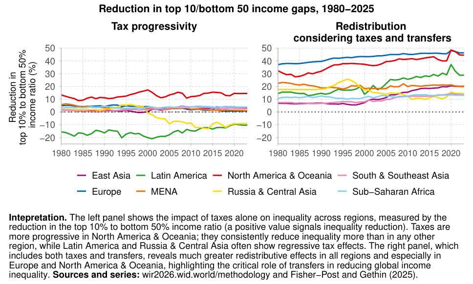

**----- Start of picture text -----** 
Reduction in top 10/bottom 50 income gaps, 1980−2025 Tax progressivity Redistribution  considering taxes and transfers 50 50 40 40 30 30 20 20 10 10 0 0 −10 −10 −20 −20 1980 1985 1990 1995 2000 2005 2010 2015 2020 1980 1985 1990 1995 2000 2005 2010 2015 2020 East Asia Latin America North America & Oceania South & Southeast Asia Europe MENA Russia & Central Asia Sub−Saharan Africa Intepretation.  The left panel shows the impact of taxes alone on inequality across regions, measured by the reduction in the top 10% to bottom 50% income ratio (a positive value signals inequality reduction). Taxes are more progressive in North America & Oceania; they consistently reduce inequality more than in any other region, while Latin America and Russia & Central Asia often show regressive tax effects. The right panel, which includes both taxes and transfers, reveals much greater redistributive effects in all regions and especially in Europe and North America & Oceania, highlighting the critical role of transfers in reducing global income inequality.  Sources and series:  wir2026.wid.world/methodology and Fisher−Post and Gethin (2025). Reduction in  income ratio (%) top 10% to bottom 50% **----- End of picture text -----** 

66 

Chapter 2. Regional Income Inequality 

## **Figure 2.15. Taxes alone tend to have minimal or even regressive effects on inequality in many countries** 

## **Tax progressivity: reduction in top 10/bottom 50 income gaps through taxes, 2025** 

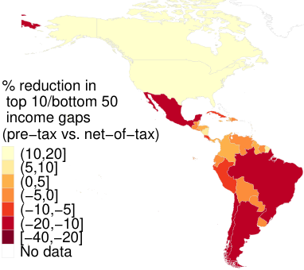

**----- Start of picture text -----** 
% reduction in  top 10/bottom 50  income gaps (pre−tax vs. net−of−tax) (10,20] (5,10] (0,5] (−5,0] (−10,−5] (−20,−10] [−40,−20] No data **----- End of picture text -----** 

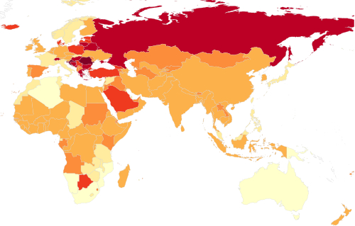

**Interpretation.** Tax progressivity around the world. **Notes.** Net−of−tax income: pre−tax income minus taxes. Taxes include social contributions. **Sources and series:** wir2026.wid.world/methodology and Fisher−Post and Gethin (2025). 

**Figure 2.16. Transfers consistently reduce inequality across all regions, but with large variations across countries** 

**Reduction in top 10/bottom 50 income gaps through taxes and transfers, 2025** 

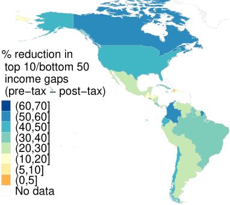

**----- Start of picture text -----** 
% reduction in  top 10/bottom 50  income gaps  (pre−tax − post−tax) (60,70] (50,60] (40,50] (30,40] (20,30] (10,20] (5,10] (0,5] No data **----- End of picture text -----** 

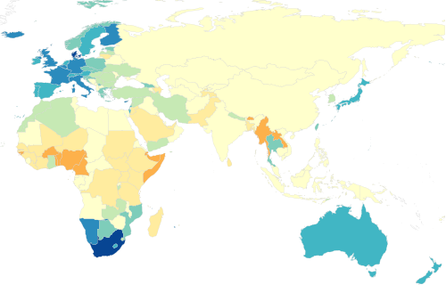

**Interpretation.** A global map of redistribution accounting both for taxes and transfers. **Notes.** Post−tax income: pre−tax income, minus all taxes, plus all transfers. Taxes exclude social contributions. **Sources and series:** Fisher−Post and Gethin (2025) and wir2026.wid.world/methodology. 

67 

Chapter 2. Regional Income Inequality 

Box 2.1: Country rankings for large countries according to per capita national income 

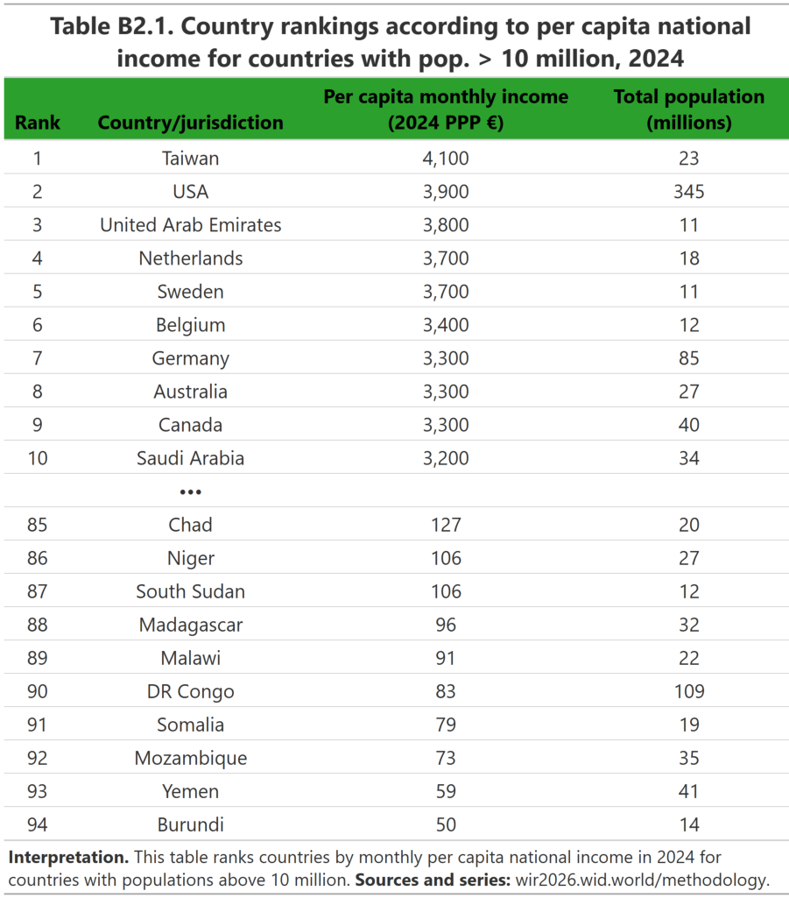

**Box 2.1.1** ranks large countries (those with populations above 10 million) by per capita national income in 2024 and complements **Figure 2.4** . The ranking underscores the vast disparities in living standards across the world, even after adjusting for comparable prices (PPP). Small countries are excluded here to ensure comparability, as many resource-rich economies or financial centers (such as Luxembourg, Qatar, or Monaco) display extremely high averages that are not representative of broader global patterns. These cases are presented separately in **Box 2.2.2** . 

At the top of the ranking are Taiwan, the United States, the United Arab Emirates, the Netherlands, Sweden, Belgium, Germany, Australia, Canada, and Saudi Arabia. In 

68 

Chapter 2. Regional Income Inequality 

these economies, per capita monthly incomes range between €3,200 and €4,100. Put differently, in just a single day, the average resident of these countries earns as much as the average resident of the poorest large economies does in an entire month. 

At the other end of the spectrum, the poorest large countries are Burundi, Yemen, Mozambique, Somalia, the Democratic Republic of Congo, Malawi, Madagascar, South Sudan, Niger, and Chad. In these countries, average monthly incomes fall below €130, and in Burundi, they collapse to just €50. 

It is important to stress that living on €100 a month, barely €3 a day, represents a country average. Yet averages conceal even harsher realities: given the large inequalities documented throughout this chapter, a large part of the population in these countries survives on far less than the average, making daily life considerably more precarious than these figures alone suggest. 

Box 2.2: Country rankings according to per capita national income 

Table B2.2.1 in **Box 2.2.2** extends the income ranking to all countries, including small and ultra-small economies. Many of these very small countries record extremely high per capita incomes, well above the world average. The top ten countries are Monaco, Liechtenstein, Luxembourg, Bermuda, Guernsey, Jersey, Singapore, the Cayman Islands, Macao, and Anguilla. Most are well-known tax havens or offshore financial centers, where concentrated wealth, financial services, or resource rents boost national income averages far beyond what is seen in larger economies. Monaco and Liechtenstein, for example, report average monthly incomes exceeding €12,000, more than 200 times higher than those recorded in the poorest countries. 

Most of the ten countries in this ranking have a population below one million inhabitants. Singapore is the notable exception, combining high income levels with a population of about six million. 

At the other end of the table, the poorest small countries look very similar to those listed in **Box 2.1.1** , with the addition of the Central African Republic. 

Figure B2.2.2 in **Box 2.2.2** places these outcomes in historical perspective. It shows that ultra-small countries, with populations under 100,000, have consistently recorded per capita incomes well above the world average since 1970, and their relative advantage has widened over time. By 2024, their incomes stand at around four times the global average. By contrast, the only category with incomes persistently below the world average is the very largest countries, those with more than 500 million inhabitants, namely China and India. Yet here the trend is impressive: both countries have experienced rapid income growth over the past decades and are now converging toward the world average, a dramatic shift compared to the much lower relative levels observed in 1970. 

69 

Chapter 2. Regional Income Inequality 

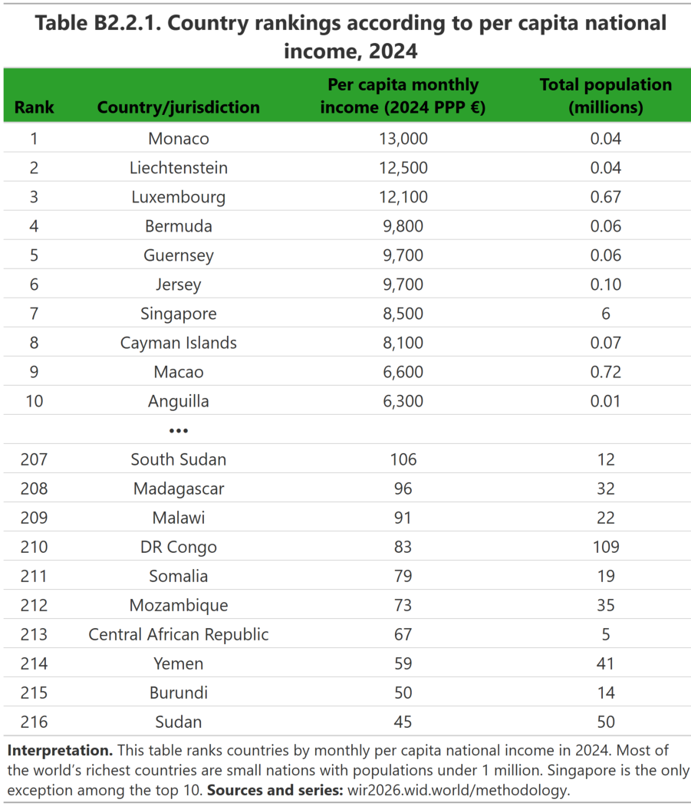

These findings highlight how small financial hubs and tax haven economies, despite their limited populations, play an outsized role in shaping global income patterns. At the same time, they underscore the structural disadvantage of the world’s most populous countries, where hundreds of millions of people live in economies that still lag behind global averages—even if, in the cases of China and India, the gap is closing at a remarkable pace. 

70 

Chapter 2. Regional Income Inequality 

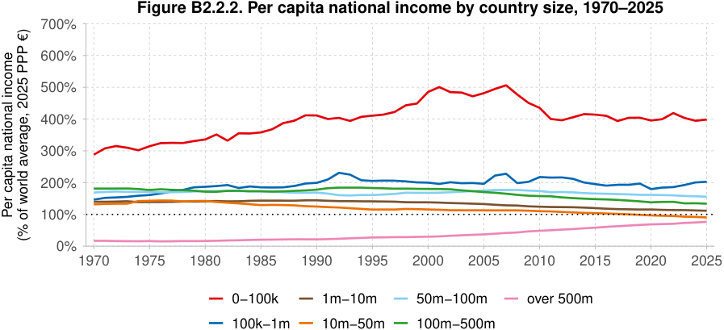

**----- Start of picture text -----** 
Figure B2.2.2. Per capita national income by country size, 1970–2025 700% 600% 500% 400% 300% 200% 100% 0% 1970 1975 1980 1985 1990 1995 2000 2005 2010 2015 2020 2025 0−100k 1m−10m 50m−100m over 500m 100k−1m 10m−50m 100m−500m Per capita national income (% of world average, 2025 PPP €) **----- End of picture text -----** 

**Interpretation.** Ultra−small countries (pop. <100k) have consistently had above−average per capita income, increasing from 290% of the world average in 1970 to 400% in 2025. In contrast, the most populous countries (pop. >500m) remain significantly below average: from 20% in 1970 to 80% in 2025. This size−income gradient has remained persistent across decades. Population groups are defined using 2025 country sizes. **Sources and series:** Gómez−Carrera et al. (2024) and wir2026.wid.world/methodology. 

71 

Notes 

## **Notes** 

6Importantly, Fisher-Post and Gethin (2025) find that tax progressivity is uncorrelated with national income per capita. 

> 7Fisher-Post and Gethin (2025) also highlight important compositional differences in transfers. In Europe, social assistance programs are the most significant driver of redistribution, while in Africa, healthcare-related transfers play a comparatively larger role. 

## **References** 

- Andreescu, Marie and Alice Sodano (2024). “2024 DINA Update for Europe”. In: _World Inequality Lab, Technical Notes_ 2024/05. 

- Bharti, Nitin and Zhexun Mo (2024). “2024 DINA Update for Asia”. In: _World Inequality Lab, Technical Notes_ 2024/08. 

- Chancel, Lucas, Ignacio Flores, et al. (2025). _Distributional National Accounts Guidelines: Methods and Concepts used in the World Inequality Database_ . `https://wid.world/d ocument/distributional-national-accounts-dina -guidelines-2025-methods-and-concepts-used-i n-the-world-inequality-database/` . Version 3.0. 

- Chancel, Lucas and Thomas Piketty (2021). “Global income inequality, 1820–2020: The persistence and mutation of extreme inequality”. In: _Journal of the European Economic Association_ 19.6, pp. 3025–3062. 

- Chancel, Lucas, Thomas Piketty, et al. (2022). _World Inequality Report 2022_ . Harvard University Press. 

- El Hariri, Dima (2024). “2024 DINA Update for MENA”. In: _World Inequality Lab, Technical Notes_ 2024/09. 

- Fisher-Post, Matthew and Amory Gethin (2025). “Government Redistribution and Development: Global Estimates of Tax and Transfer Progressivity 1980-2019”. In: _World Inequality Lab, Working Paper Series_ 2023/17. 

- Flores, Ignacio and Alvaro Zúñiga-Cordero (2024). “2024 DINA Update for Latin America”. In: _World Inequality Lab, Technical Notes_ 2024/10. 

- Forward, Tayla and Matthew Fisher-Post (2024). “2024 DINA Update for New Zealand”. In: _World Inequality Lab, Technical Notes_ 2024/06. 

- Gómez-Carrera, Ricardo, Rowaida Moshrif, Gastón Nievas, and Thomas Piketty (2024). “Global Inequality Update 2024: New Insights from Extended WID Macro Series”. In: _World Inequality Lab, Technical Notes_ 2024/11. 

- Gómez-Carrera, Ricardo, Rowaida Moshrif, Gastón Nievas, Thomas Piketty, and Anmol Somanchi (2025). “Extending WID Population Series: Projections 2024-2100 & Age/Gender Breakdowns”. In: _World Inequality Lab, Technical Notes_ 2024/12. 

- Loubes, Romaine and Anne-Sophie Robilliard (2024). “2024 DINA Update for Africa”. In: _World Inequality Lab, Technical Notes_ 2024/07. 

- Nievas, Gastón and Thomas Piketty (2025). “WID National Accounts Series: Updated and Extended Coverage 1800-2023”. In: _World Inequality Lab, Technical Notes_ 2025/02. 

72 

# **CHAPTER 3 Regional Wealth Inequality** 

Chapter 3. Regional Wealth Inequality 

|**Contents of this chapter**||
|---|---|
|Wealth inequality trends across regions . . . . . . . . . . . . . . . . . . . . . . . . . .|**75**|
|Private wealth is rising while public wealth stagnates . . . . . . . . . . . . . . . . . .|**78**|
|The world distribution of wealth by region . . . . . . . . . . . . . . . . . . . . . . . .|**80**|
|Country-by-country patterns of wealth concentration . . . . . . . . . . . . . . . . .|**83**|
|Main takeaways . . . . . . . . . . . . . . . . . . . . . . . . . . . . . . . . . . . . . . .|**84**|

74 

Chapter 3. Regional Wealth Inequality 

This chapter examines through a regional lens who owns the world’s wealth and how that ownership has changed in recent decades. It starts by analyzing how much wealth there is at the global and regional level, and how it is split between the public and private sectors. It then goes on to assess wealth inequality within regions and within countries. 

As the world has grown wealthier, who has captured the associated benefits? The data show that wealth has grown faster than income. Wealth growth is being accumulated mainly in private hands and, in all regions, is distributed far more unequally than income (seen in **Chapter 2** ). Compared to the 1990s, East Asia has now emerged as a major holder of the world’s assets, joining Europe and North America & Oceania. 

## **Wealth inequality trends across regions** 

Global wealth has expanded dramatically over the past three decades, but the gains have not been evenly shared across regions ( **Figure 3.1** ). In absolute terms, all regions recorded significant increases in net national wealth between 1995 and 2025 . Yet when viewed in relative terms, the map of global wealth has been redrawn. 

The most notable transformation has occurred in East Asia. In 1995, the region accounted for roughly one-fifth of global wealth; by 2025, its share has risen to over one-third, making it the world’s largest wealth-holding region. This surge mirrors the rapid rise in incomes observed in **Figure 2.1** , but the scale of the shift in wealth is even greater. Over the entire 1995–2025 period, East Asia’s wealth grew by nearly 7% per year, more than double the growth rate of Europe and faster than the global average. 

By contrast, Europe’s relative weight in the global distribution of wealth has declined sharply. In 1995, Europe held over one-quarter of global wealth, but by 2025, this share has fallen to 16%. The underlying reason is slower wealth accumulation: Europe’s wealth has grown at just above 3% annually since 1995, among the lowest regional rates. North America & Oceania, meanwhile, has broadly maintained its position, with annual wealth growth of 

about 4.3%, roughly in line with the global average (see Bauluz, Brassac, et al. (2025)). 

Other regions have experienced smaller but notable changes. South & Southeast Asia recorded robust annual wealth growth of 6%, second only to East Asia, although its global share, around 13% in 2025, remains well below its significant share of the world’s population (33%, see **Figure 2.2** ). Latin America and Russia & Central Asia lagged behind, with wealth growth averaging below 3%, resulting in stagnating or declining global shares. By contrast, the Middle East & North Africa posted relatively dynamic growth (nearly 5% annually), overtaking Latin America in the mid-2010s. Sub-Saharan Africa, starting from a very low base, grew at about 4.7% annually, faster than Latin America, Russia & Central Asia, and even Europe, yet it still accounts for only around 2% of global wealth today. 

The geography of global wealth growth has shifted decisively toward Asia, while Europe’s centrality has waned. The disparity between regional shares of population (seen in **Figure 2.2** ) and wealth highlights the enduring concentration of economic power: regions with smaller populations (North America & Oceania and Europe) still hold disproportionate shares of global wealth, while populous areas such as Sub-Saharan Africa remain marginalized in the global distribution. We now turn to **Figure 3.2** , which traces the historical ratio of net national wealth to net national income from the mid-19th century to today, for which data exist and estimates have been produced. This measure shows how much wealth countries hold relative to their annual income, offering a long-run view of the balance between accumulated wealth and economic activity. At the start of the 20th century, wealth levels were exceptionally high in Europe . In France and the United Kingdom , national wealth exceeded seven times annual income, with Germany somewhat lower. These peaks collapsed during World War I and fell further during World War II, leaving mid-century wealth ratios at historic lows. The wars illustrate how quickly accumulated wealth can be destroyed by large-scale shocks. Outside Europe, trajectories differed. The United States and India saw moderate 

75 

Chapter 3. Regional Wealth Inequality 

## **Figure 3.1. Global wealth has expanded dramatically over the past three decades** 

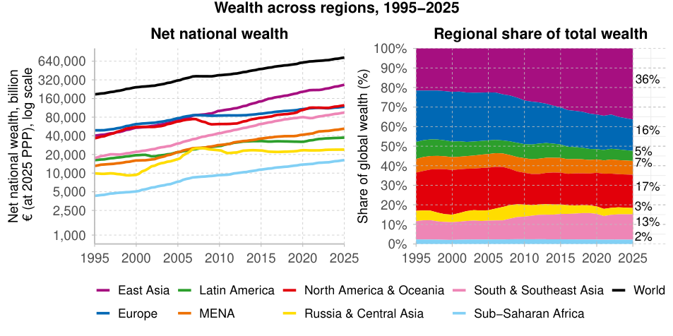

**----- Start of picture text -----** 
Wealth across regions, 1995−2025 Net national wealth Regional share of total wealth 100% 640,000 90% 320,000 36% 80% 160,000 70% 80,000 60% 16% 40,000 20,000 50% 5% 40% 7% 10,000 30% 17% 5,000 2,500 20% 3% 10% 13% 1,000 2% 0% 1995 2000 2005 2010 2015 2020 2025 1995 2000 2005 2010 2015 2020 2025 East Asia Latin America North America & Oceania South & Southeast Asia World Europe MENA Russia & Central Asia Sub−Saharan Africa Net national wealth, billion  € (at 2025 PPP), log scale Share of global wealth (%) **----- End of picture text -----** 

**Interpretation.** In 2025, net national wealth amounted to €125,000 billion in North America & Oceania and €267,000 billion in East Asia. East Asia’s share of global wealth rose from 22% in 1995 to 36% in 2025, while Europe’s share declined from 26% to 16%. These graphs show both the absolute level and regional composition of global net national wealth. **Sources and series:** Bauluz et al. (2025) and wir2026.wid.world/methodology. 

increases during the interwar years, but both, like Europe, experienced declines during and after World War II. 

From the postwar decades onward, most countries experienced renewed rises in wealth ratios. Japan stood out for its surge in the 1970s and 1980s, fueled by rapid industrialization and asset booms, though its trajectory stalled after the 1990s real estate crisis and only began to rebound modestly in the 2020s. The most striking recent change has been in China. Since the 1990s, and accelerating through the 2000s and 2010s, its wealth-to-income ratio has soared to around 900%, roughly nine times annual income, by the early 2020s. Despite a dip during the COVID-19 pandemic, China still records the highest ratio among major economies. The long-run picture is one of collapse and recovery: wealth-to-income ratios were destroyed by the wars of the 20th century for belligerent countries, but have rebounded sharply in recent decades. 

**Figure 3.3** looks at how the composition of wealth has evolved across regions since 1995. Wealth as a share of national income 

can be broken down into two components: domestic capital, which represents the stock of assets located within a country’s borders, and net foreign assets, which reflect the balance between what residents own abroad and what foreigners own domestically. 

Across the globe, domestic capital accounts for the bulk of wealth, but net foreign assets highlight significant differences between regions. In North America & Oceania, for instance, wealth is largely domestically held, but foreign positions are negative, meaning that outsiders collectively own more assets within the region than residents hold abroad. East Asia presents the opposite picture: its positive foreign asset balance lifts total wealth above the value of domestic capital. This dynamic has reinforced East Asia’s rise as the world’s largest wealth-holding region, as already seen in **Figure 3.1** . 

Other regions show more modest or contrasting patterns. The Middle East & North Africa also holds positive foreign assets, though on a smaller scale. By contrast, South & Southeast Asia, Latin 

76 

Chapter 3. Regional Wealth Inequality 

## **Figure 3.2. From the post war decades onward, most countries experienced renewed rises in wealth ratios** 

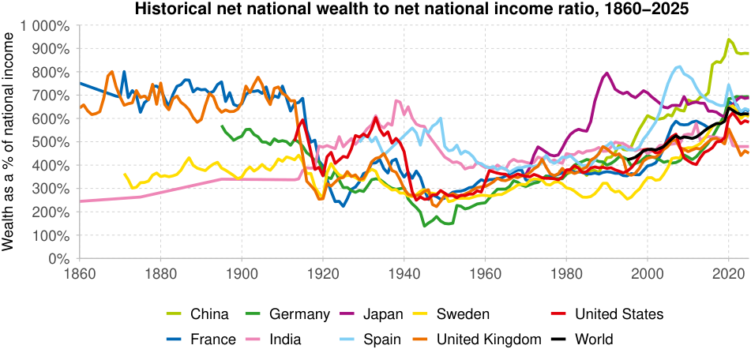

**----- Start of picture text -----** 
Historical net national wealth to net national income ratio, 1860−2025 1 000% 900% 800% 700% 600% 500% 400% 300% 200% 100% 0% 1860 1880 1900 1920 1940 1960 1980 2000 2020 China Germany Japan Sweden United States France India Spain United Kingdom World Wealth as a % of national income **----- End of picture text -----** 

**Interpretation.** This graph shows the historical evolution of the ratio of net national wealth to net national income for certain countries. A higher ratio indicates that a country or region holds more wealth relative to its yearly income, reflecting both accumulated savings and capital gains. The ratio of national wealth to national income collapsed across countries during the first half of the 20th century but has rebounded sharply since the 1980s, especially in China. **Sources and series:** Bauluz et al. (2025) and wir2026.wid.world/methodology. 

America, and Sub-Saharan Africa generally record negative foreign assets balances, underscoring their reliance on external capital and the fact that part of their domestic wealth is owned by foreigners. In recent years, Europe has begun to resemble the East Asian case, with residents increasingly holding more assets abroad than foreigners own within Europe. Russia & Central Asia, meanwhile, has seen a similar movement toward a positive position. 

The overall picture is twofold. First, domestic capital remains the foundation of national wealth everywhere. Second, although net foreign assets are relatively small in scale, they determine the highly embedded nature of global financial linkages. East Asia, Europe, and the Middle East & North Africa hold more assets abroad than foreigners own within their borders. By contrast, a significant portion of the wealth in North America, Latin America, and Sub-Saharan Africa is effectively owned outside their borders. Global wealth is not only concentrated but also deeply interconnected across regions. 

**Figure 3.4** illustrates the evolution of net foreign wealth across regions, expressed both in relation to regional GDP (left) and global GDP (right). These balances reveal which regions act as global creditors and which as debtors. In the 19th and early 20th centuries, Europe held the largest foreign asset position in history, with net wealth abroad reaching over 70% of its GDP and close to one-third of world GDP before 1914. Much of this was built on colonial extraction and unequal exchange, as is mirrored by the heavily negative positions of South & Southeast Asia and Sub-Saharan Africa (see Nievas and Piketty 2025). The two world wars, revolutions, and decolonization brought this dominance to an abrupt end, wiping out most of Europe’s external holdings. 

The mid-20th century saw North America & Oceania briefly become the world’s leading creditors, peaking at around 8% of world GDP in the 1950s. But since the 1970s, the region has shifted into the largest net debtor, with balances now at 18% of world GDP. The most dramatic contemporary 

77 

Chapter 3. Regional Wealth Inequality 

## **Figure 3.3. Domestic capital remains the foundation of national wealth everywhere** 

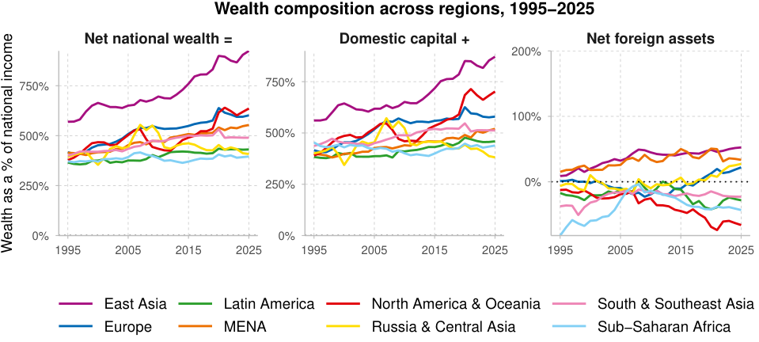

**----- Start of picture text -----** 
Wealth composition across regions, 1995−2025 Net national wealth = Domestic capital + Net foreign assets 200% 750% 750% 100% 500% 500% 250% 250% 0% 0% 0% 1995 2005 2015 2025 1995 2005 2015 2025 1995 2005 2015 2025 East Asia Latin America North America & Oceania South & Southeast Asia Europe MENA Russia & Central Asia Sub−Saharan Africa Wealth as a % of national income **----- End of picture text -----** 

**Interpretation.** This figure shows that domestic capital makes up the bulk of net national wealth across all regions, while net foreign assets play only a minor role. Most regions exhibit steady increases in national wealth as a share of income since 1995, particularly East Asia and North America & Oceania. Sub−Saharan Africa and Latin America, by contrast, show limited growth and continue to hold negligible net foreign assets. **Notes.** Net national wealth = domestic capital + net foreign assets. **Sources and series:** Bauluz et al. (2025) and wir2026.wid.world/methodology. 

transformation has been in East Asia. Since the 1970s, the region has become the largest creditor. Today, it holds about 12% of the world’s GDP. The Middle East & North Africa has also maintained a strong positive balance since the oil boom of the 1970s, while Europe has rebuilt modest surpluses in recent decades. By contrast, Latin America, Sub-Saharan Africa, and South & Southeast Asia remain consistent debtors, with foreigners owning more of their assets than their residents hold abroad. 

Foreign asset positions show the persistent global asymmetries of the financial system: today, East Asia, the Middle East & North Africa, and Europe finance the rest of the world, while North America & Oceania and most of the Global South run chronic deficits. It is important to note, as Nievas and Piketty (2025) emphasize, that these historical imbalances reflect not just markets but also power relations and unequal exchange, a theme we revisit in **Chapter 5** . 

## **Private wealth is rising while public wealth stagnates** 

Over the past thirty years, global wealth has risen faster than income, growing from just over 400% of world income in 1995 to more than 600% in 2025 ( **Figure 3.2** ). Yet this rise has been almost entirely concentrated in the private sector (see Bauluz, Brassac, et al. (2025)). **Figure 3.5** shows that private wealth increased from about 350% to over 500% of world income, while public wealth stagnated at around 80–90%. In some regions, public wealth even turned negative, meaning that governments’ liabilities exceeded their assets. The slowdown during the COVID-19 pandemic briefly interrupted the upward trajectory, but the long-run trend remains clear: wealth growth has accumulated in private hands. **Figure 3.5** shows that East Asia and North America & Oceania now report the highest levels of private wealth, each above 600% of income by 2025 (left-hand-side panel). North America & Oceania’s trajectory, however, has been volatile: strong growth up to 2007, a sharp fall during the global 

78 

Chapter 3. Regional Wealth Inequality 

**Figure 3.4. Since the 1970s, North America & Oceania has shifted into the largest net debtor** 

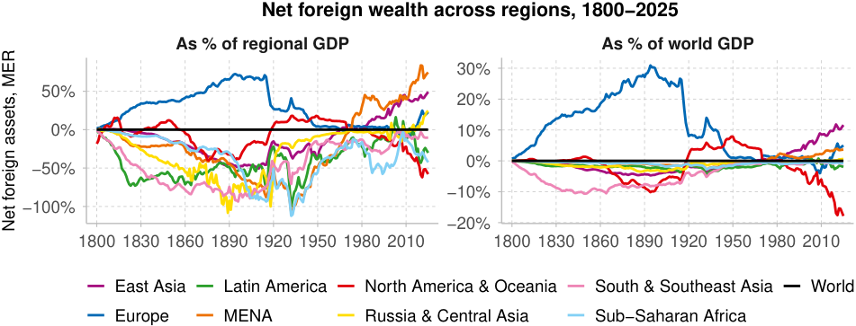

**----- Start of picture text -----** 
Net foreign wealth across regions, 1800−2025 As % of regional GDP As % of world GDP 30% 50% 20% 0% 10% 0% −50% −10% −100% −20% 1800 1830 1860 1890 1920 1950 1980 2010 1800 1830 1860 1890 1920 1950 1980 2010 East Asia Latin America North America & Oceania South & Southeast Asia World Europe MENA Russia & Central Asia Sub−Saharan Africa Net foreign assets, MER **----- End of picture text -----** 

**Interpretation.** Between 1800 and 1914, Europe accumulated a rising share of global foreign assets. By 1914, its net foreign wealth reached 71% of its own GDP. These assets largely vanished after World War I. Measured as a share of world GDP, Europe’s foreign wealth in 1914 was about 6 times larger than East Asia’s foreign wealth in 2025 (12%) and about 18 times larger than that of MENA (4%). During the 20th century, North America & Oceania emerged as a major foreign asset holder, peaking in 1950 at 8% of world GDP. Over the same period, East Asia transitioned to one of the world’s largest foreign asset holders. By 2025, its net foreign wealth stood at 12% of world GDP. In contrast, North America & Oceania held −18%, meaning other regions now hold more assets in North America & Oceania than it holds abroad. **Sources and series:** Bauluz et al. (2025), Nievas and Piketty (2025), and wir2026.wid.world/methodology. 

financial crisis, recovery in the 2010s, and a renewed decline after COVID-19. Europe has followed a steadier path, but its private wealth also fell more sharply than the global average after 2020. South & Southeast Asia has steadily built up private wealth, ranking fourth globally, while the Middle East & North Africa overtook Russia & Central Asia during the 2010s. By contrast, Latin America and Sub-Saharan Africa remain far below the world average, reflecting weaker asset accumulation relative to income. 

The picture of public wealth is even more striking (right-hand-side panel). East Asia stands out as the only region with substantial and rising public wealth, thanks to sustained public savings and significant state ownership of assets. The Middle East & North Africa, Sub-Saharan Africa, Latin America, and Russia & Central Asia maintain modestly positive levels, but these are well below those in East Asia. Europe and South & Southeast Asia hover close to zero, showing little capacity to build collective wealth. In North America & Oceania, public wealth is negative: governments owe more than they own, with rising public debts 

## offsetting limited state assets. 

Overall, the world has become wealthier, but the ownership of this wealth has shifted toward individuals and corporations. Governments, by contrast, have seen their net position weaken, narrowing their fiscal capacity to invest in collective goods or respond to crises. This imbalance between expanding private fortunes and stagnant public reserves is now a defining feature of the global economy. This shift toward private balance sheets raises a second question: how are the flows of income divided between labor and capital? **Figure 3.6** answers this. 

**Figure 3.6** tracks how the income flow is split between labor and capital since 1980. Globally, labor’s share falls from about 61% in 1980 to 53% in 2025, while capital’s share rises from 39% to 47%. This rebalancing toward capital income mirrors the wealth patterns in **Figure 3.5** (more wealth overall, and most of it private).[8] 

As for regional patterns, North America & Oceania and Europe retain comparatively higher labor shares (and lower capital 

79 

Chapter 3. Regional Wealth Inequality 

## **Figure 3.5. The rise of private wealth and the decline of public wealth in every region** 

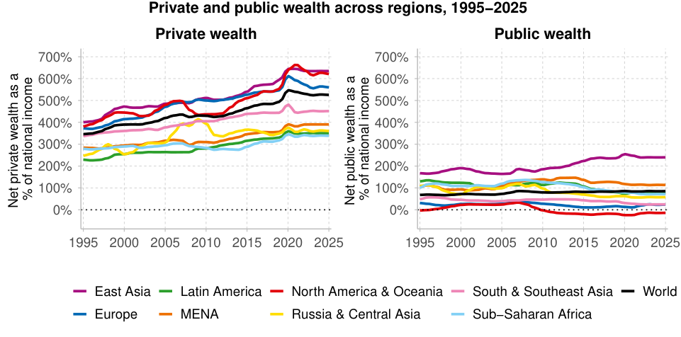

**----- Start of picture text -----** 
Private and public wealth across regions, 1995−2025 Private wealth Public wealth 700% 700% 600% 600% 500% 500% 400% 400% 300% 300% 200% 200% 100% 100% 0% 0% 1995 2000 2005 2010 2015 2020 2025 1995 2000 2005 2010 2015 2020 2025 East Asia Latin America North America & Oceania South & Southeast Asia World Europe MENA Russia & Central Asia Sub−Saharan Africa % of national income % of national income Net private wealth as a  Net public wealth as a **----- End of picture text -----** 

**Interpretation.** Net private wealth reached 621% of national income in North America & Oceania and 635% in East Asia by 2025. Public wealth, by contrast, was around −14% and 240% respectively. The figures highlight divergent trends between public and private net wealth across regions. **Sources and series:** Bauluz et al. (2025) and wir2026.wid.world/methodology. 

shares) than other regions. The Middle East & North Africa region shows the lowest labor shares and the highest capital shares, patterns that Dietrich et al. (2025) link to sectoral structure and resource rents. East Asia combines rapid capital-deepening with still-elevated labor shares for much of the period, but its capital share has risen markedly as industrialization and asset expansion progressed. In Latin America, South & Southeast Asia, and Sub-Saharan Africa, labor shares are persistently lower and capital shares higher. These differences are not simply an artifact of sector mix but are likely to reflect higher returns to capital and weaker worker bargaining power in poorer regions (Dietrich et al. (2025)). As the capital share rises, asset owners receive a larger slice of income; higher savings and asset prices among this group compound into faster private-wealth growth (see Bauluz, Novokmet, and Schularick (2022); Piketty and Zucman (2014)). 

## **The world distribution of wealth by region** 

**Figure 3.7** plots the world distribution of per capita wealth in 2025 by stacking regional density curves. The vertical scale is such that the area of each colored wedge corresponds to the region’s share of the world’s adult population. Two features dominate. First, the global distribution is sharply skewed: a long right tail, populated mainly by Europe and North America & Oceania, extends well beyond €250,000 per adult into the million-plus range. Second, most adults worldwide are clustered far to the left of that tail, at low to lower-middle levels of wealth. 

South & Southeast Asia contributes the single largest mass at the center-left of the distribution; its demographic weight largely sets the global peak. East Asia lies to the right of that peak and spreads across a wide band, reflecting decades of asset accumulation that now place a sizable share of adults in the upper-middle range (see Arias-Osorio et al. (2025)). Latin America and the Middle East & North Africa straddle the middle, with a much thinner presence in the global top. 

80 

Chapter 3. Regional Wealth Inequality 

**Figure 3.6. The rising capital share in global income** 

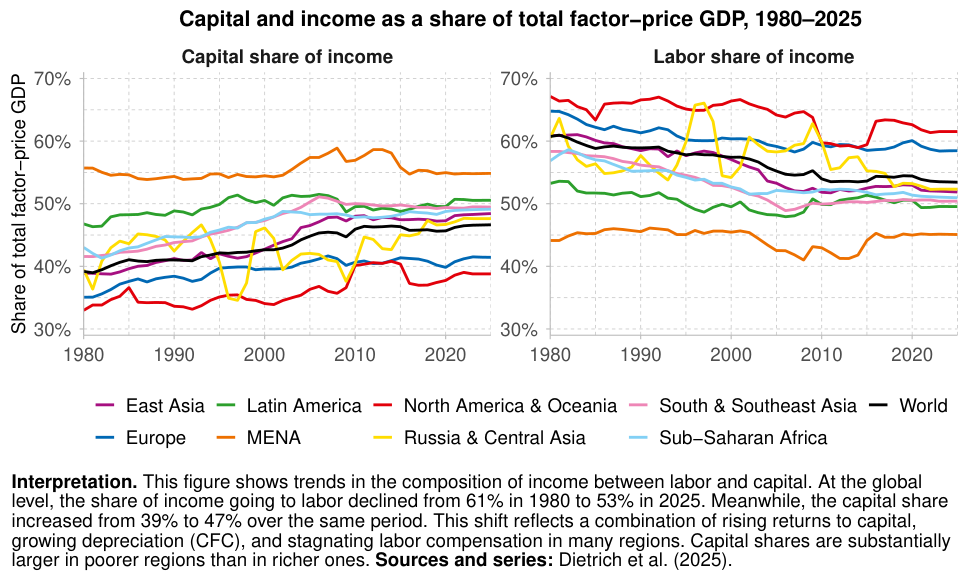

**----- Start of picture text -----** 
Capital and income as a share of total factor−price GDP, 1980–2025 Capital share of income Labor share of income 70% 70% 60% 60% 50% 50% 40% 40% 30% 30% 1980 1990 2000 2010 2020 1980 1990 2000 2010 2020 East Asia Latin America North America & Oceania South & Southeast Asia World Europe MENA Russia & Central Asia Sub−Saharan Africa Interpretation.  This figure shows trends in the composition of income between labor and capital. At the global level, the share of income going to labor declined from 61% in 1980 to 53% in 2025. Meanwhile, the capital share increased from 39% to 47% over the same period. This shift reflects a combination of rising returns to capital, growing depreciation (CFC), and stagnating labor compensation in many regions. Capital shares are substantially larger in poorer regions than in richer ones.  Sources and series:  Dietrich et al. (2025). Share of total factor−price GDP **----- End of picture text -----** 

Sub-Saharan Africa is concentrated at the very low end, with minimal representation beyond the lower deciles. Europe and North America & Oceania are overrepresented at the top tail and dominate the highest wealth brackets. 

Compared with the income distribution shown earlier in **Figure 2.5** , the contrast is clear: wealth inequality is larger than income inequality. Regions that account for a substantial share of middle-income earners, such as East Asia and parts of South & Southeast Asia, remain underrepresented at the very top of the wealth distribution, while Europe and North America & Oceania are disproportionately present there. Put differently, location still shapes an individual’s chances of reaching the top of the global wealth ladder. 

**Figure 3.8** disaggregates household net wealth in 2025 into four groups: the bottom 50%, the middle 40%, the next 9%, and the top 1%, for each world region. The picture is stark: in every region, the top 10% owns the majority of wealth, while the bottom half owns almost none. Across regions, the bottom 50% holds between 1% and 5% of total wealth: just 1% in North America 

& Oceania, Sub-Saharan Africa, and the Middle East & North Africa; 3% in Europe, Latin America, and Russia & Central Asia; and 5% in South & Southeast Asia and East Asia. Put plainly, in every region, half of the population owns no more than 5% of that region’s wealth. 

By contrast, the top 10% controls 60–74% of wealth, about 60% in Europe; 65–70% in South & Southeast Asia, East Asia, Latin America, and North America & Oceania; 70% in Sub-Saharan Africa; 73% in the Middle East & North Africa; and 74% in Russia & Central Asia. In every region, one-tenth of the population owns at least 60% of all wealth. Disaggregating the top 10% shows how concentrated the very top is. The top 1% alone holds a quarter of all wealth in Europe (25%), around a third in North America & Oceania (34%), South & Southeast Asia (35%), Sub-Saharan Africa (36%), Latin America (36%), the Middle East & North Africa (37%), and an excessively high 46% in Russia & Central Asia. In several regions, North America & Oceania, Latin America, the Middle East & North Africa, Sub-Saharan Africa, and Russia & Central Asia, the top 

81 

Chapter 3. Regional Wealth Inequality 

**Figure 3.7. Most of the global population is clustered at low levels of wealth** 

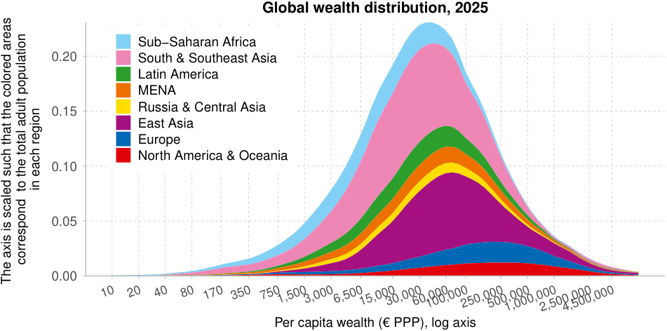

**----- Start of picture text -----** 
Global wealth distribution, 2025 Sub−Saharan Africa 0.20 South & Southeast Asia Latin America MENA Russia & Central Asia 0.15 East Asia Europe North America & Oceania 0.10 0.05 0.00 Per capita wealth (€ PPP), log axis 10 20 40 80 170 350 7501,5003,0006,50015,00030,00060,000100,000250,000500,0001,000,0002,500,0004,500,000 in each region  correspond  to the total adult population The axis is scaled such that the colored areas **----- End of picture text -----** 

**Interpretation.** The graph shows the size and geographical repartition of the global population at different levels of the wealth distribution.The relative size of each color wedge is proportional to the population in a region. Distribution of personal wealth, net of debts. **Sources and series:** Arias−Osorio et al. (2025) and wir2026.wid.world/methodology. 

1% own more than the entire bottom 90% combined. One out of every 100 people owns more wealth than ninety individuals in the same group. 

Notably, in Europe, the middle 40% holds a sizable 37%, and most of the top-decile share comes from the next 9% (35%) rather than the top 1%. Additionally, East Asia has the largest “next-9%” slice (39%) worldwide, followed by the Middle East & North Africa region (36%) and Europe, North America & Oceania (approximately 35%), consistent with the broad upper-middle profile seen in **Figure 3.7** . 

Compared with the income splits in **Chapter 2** ( **Figure 2.6** ), wealth is even more concentrated. The top 10% receives 36–57% of regional income but owns 60–74% of regional wealth, and the top 1% earns 12–24% of income but owns 25–46% of wealth. The gap between income and wealth concentration underscores the central finding of this section: within every region, ownership of assets is heavily concentrated at the very top. 

of the global wealth distribution, which regions make up that slice. In 1995, the very top percentiles were overwhelmingly in Europe and North America & Oceania, who dominated the upper decile and especially the top 1%, while some of the Asian population and Sub-Saharan Africa were concentrated in the lower half. By 2025, the map of the upper tail is more multipolar, though not egalitarian. China is the standout mover: its color spreads across the upper-middle percentiles and enters the very top. Its share of the world’s top 1% rose from about one percent in 1995 to roughly one-sixth by 2025. Europe and North America & Oceania still account for a large portion of the global elite, but they now share that space with East Asia. The broad message mirrors **Chapter 2** ’s evidence regarding income: the geography of the elite has diversified, especially toward East Asia, but the structure of the pyramid endures. 

**Figure 3.9** shows, for each percentile 

82 

Chapter 3. Regional Wealth Inequality 

**Figure 3.8. Extreme wealth inequality is high in all regions** 

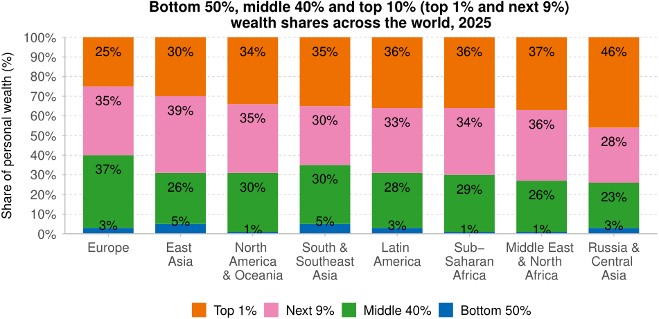

**----- Start of picture text -----** 
Bottom 50%, middle 40% and top 10% (top 1% and next 9%) wealth shares across the world, 2025 100% 25% 30% 34% 35% 36% 36% 37% 46% 90% 80% 70% 35% 39% 60% 35% 30% 33% 34% 36% 50% 28% 40% 37% 30% 30% 26% 30% 28% 29% 20% 26% 23% 10% 3% 5% 1% 5% 3% 1% 1% 3% 0% Europe East  North  South & Latin  Sub− Middle East  Russia & Asia America Southeast America Saharan & North  Central & Oceania Asia Africa Africa Asia Top 1% Next 9% Middle 40% Bottom 50% Share of personal wealth (%) **----- End of picture text -----** 

**Interpretation.** In Latin America, the top 1% captures 36% of national wealth, and the next 9% an additional 33%. Together, the top 10% holds 69%, compared to 60% in Europe. Net personal wealth is equal to the sum of financial assets (e.g. equity or bonds) and non−financial assets (e.g., housing or land) owned by individuals, net of their debts. **Sources and series:** Arias−Osorio et al. (2025) and wir2026.wid.world/methodology. 

## **Country-by-country patterns of wealth concentration** 

Having mapped the global distribution of – wealth by region ( **Figure 3.7 Figure 3.9** ), we now zoom in on how wealth is split within countries. The five maps in – **Figure 3.10 Figure 3.14** mirror the income – analysis in **Chapter 2** ( **Figure 2.9 Figure 2.13** ), but for net household wealth.[9] The picture is consistently starker than for income. 

**Figure 3.10** shows the share of household wealth owned by the bottom 50%. Everywhere in the world, the bottom half owns only a sliver of national wealth, at most around 14% and, in many places, just 1%. Large parts of Latin America, Sub-Saharan Africa, and the Middle East & North Africa fall in the lowest band on the map (below roughly 1–3.8%). The same pattern appears in parts of Central Europe and in the United States. By contrast, several Western European countries, Australia and New Zealand, and large Asian economies such as China and India sit one or two bands higher: their bottom halves still own little, but noticeably more than in the most unequal settings. 

The shares of the middle 40% are illustrated in **Figure 3.11** . The highest bands cluster in Europe and in Oceania, where the middle 40% command a sizable portion of national wealth (around two-fifths, broadly in line with their population weight). The United States and Canada stand out with a much thinner middle share, closer to Latin American and African patterns. In Asia, the middle 40% also capture small shares in China and India. 

**Figure 3.12** highlights that the top decile owns the majority of wealth in most countries. The darkest colors cover Latin America, southern Africa, the Middle East, Russia, China, and India, as well as the United States, where the top 10% typically control well over 60% of household wealth. Europe and Oceania are lighter on the map: concentration is still high by any standard, but is less than in other parts of the world. Strikingly, nowhere does the top 10% own less than about 45% of total wealth; in some countries, their share approaches 86%, an extraordinary concentration for a group that represents one person in ten. 

Focusing on the very top sharpens the contrast ( **Figure 3.13** ). The top 1% takes 

83 

Chapter 3. Regional Wealth Inequality 

**Figure 3.9. The geography of the wealthiest has diversified, especially toward East Asia** 

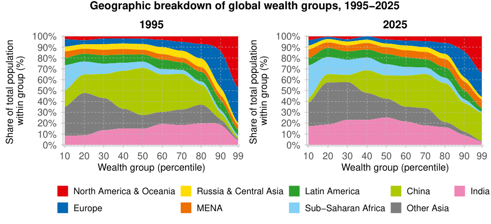

**----- Start of picture text -----** 
Geographic breakdown of global wealth groups, 1995−2025 1995 2025 100% 100% 90% 90% 80% 80% 70% 70% 60% 60% 50% 50% 40% 40% 30% 30% 20% 20% 10% 10% 0% 0% 10 20 30 40 50 60 70 80 90 99 10 20 30 40 50 60 70 80 90 99 Wealth group (percentile) Wealth group (percentile) North America & Oceania Russia & Central Asia Latin America China India Europe MENA Sub−Saharan Africa Other Asia within group (%) within group (%) Share of total population  Share of total population **----- End of picture text -----** 

**Interpretation.** These graphs show the geographical breakdown of global wealth groups. Between 1995 and 2025, the global wealth distribution has shifted, with China gaining presence in the upper percentiles, while Europe and North America & Oceania’s dominance in top wealth groups has declined, but it is still large. In 1995, 2% of the world’s top 1% wealth group were Chinese residents. By 2025, this figure increased to 26%. This highlights the growing global share of China and the diversification of the global elite. **Sources and series:** Arias−Osorio et al. (2025) and wir2026.wid.world/methodology. 

remarkably large shares across Latin America, the Middle East, southern Africa, Russia, India, China, Thailand, and North America. Several European countries and Oceania sit in lower bands, though even there the slice of the top 1% is substantial. In the most extreme cases, the top 1% holds more than 50% of total household wealth in that country; even the lowest values are close to 15%. 

The wealth gap (top 10% vs. bottom 50% ratio) in **Figure 3.14** is lowest in Western Europe and Oceania. China and India also perform relatively better. The ratio rises sharply across Latin America, the Middle East & North Africa, and southern Africa, and is high in the United States, Indonesia, and Russia. 

– **Figure 3.10 Figure 3.14** confirm that wealth is highly concentrated at the top and even more unequally distributed than income (see **Chapter 2** ). As in **Chapter 2** , the least unequal patterns are found in the regions of Europe and North America & Oceania, excluding the United States, and, in some cases, Canada. Blanchet and 

Martínez-Toledano (2023) attribute the higher levels of wealth inequality in the United States relative to Western Europe to the faster growth in the gap between house prices and stock market prices since the 1980s in the latter. The reason is that rising house prices tend to benefit the middle of the wealth distribution, as they own disproportionately more housing in their portfolio than the top or the bottom. The most unequal countries are concentrated in Sub-Saharan Africa, Latin America, and the Middle East & North Africa. 

## **Main takeaways** 

The chapter shows that every region increased its net national wealth between 1995 and 2025, but the map of wealth has shifted toward Asia. East Asia’s share has risen, Europe’s has lessened, and the long-standing mismatch between population and wealth endures: regions with smaller populations, Europe and North America & Oceania, still command large shares, while populous Sub-Saharan Africa remains marginal. 

84 

Chapter 3. Regional Wealth Inequality 

## **Figure 3.10. Bottom 50% shares are small everywhere** 

**Bottom 50% wealth shares across countries, 2025** 

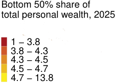

**----- Start of picture text -----** 
Bottom 50% share of total personal wealth, 2025 1 − 3.8 3.8 − 4.3 4.3 − 4.5 4.5 − 4.7 4.7 − 13.8 **----- End of picture text -----** 

**Interpretation.** This map shows the share of total personal wealth owned by the bottom 50% in each country in 2025. In Chile, the bottom 50% own about 2.6% of total personal wealth. In Vietnam, they own about 4.6%. Net personal wealth is equal to the sum of financial assets (e.g. equity or bonds) and non−financial assets (e.g. housing or land) owned by individuals, net of their debts. **Sources and series:** Arias−Osorio et al. (2025) and wir2026.wid.world/methodology. 

National wealth is primarily built on ranks, so that the global top tenth is domestic capital, but cross-border financial essentially shared across these three ties create global interdependence . These regions. The global “middle-wealth class” imbalances mean that part of the capital in is now predominantly Asian, while other debtor regions, most visibly North America regions remain concentrated at the bottom & Oceania, is owned by residents of creditor and underrepresented at the top. regions, most notably East Asia. We return Within countries, wealth concentration to this theme in **Chapter 5** under the notion is even more extreme than income of “unequal exchange.” 

Within countries, wealth concentration is even more extreme than income concentration. The bottom half owns little or nothing almost everywhere. The top decile commands the majority in all regions, and the very top one percent captures strikingly large shares. Even in the least unequal settings, wealth gaps remain vast: ownership is tilted decisively toward the top. **Chapter 3** delivers a clear message: the world is wealthier, but ownership has shifted even more toward private hands; governments have not kept pace; and wealth is extremely concentrated at the top. 

Global wealth has grown far faster than income since the mid-1990s, rising from just over four to more than six times world income. Almost all of this increase sits in private balance sheets: private wealth climbed from roughly 350 to over 500 percent of world income, while public wealth stagnated at around 80–90 percent and turned negative in some regions. East Asia is the exception, with substantial and rising public wealth. In parallel, the share of income allocated to capital has increased, while labor’s share has declined, thereby reinforcing private asset accumulation. 

Over the past few decades, the global elite has diversified. In 1995, the top of the distribution was overwhelmingly European and North American & Oceanian. Today, East Asia has firmly joined their 

85 

Chapter 3. Regional Wealth Inequality 

## **Figure 3.11. Middle 40% shares are small almost everywhere** 

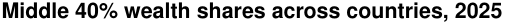

**----- Start of picture text -----** 
Middle 40% wealth shares across countries, 2025 **----- End of picture text -----** 

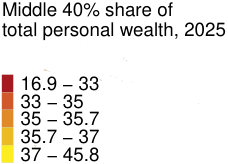

**----- Start of picture text -----** 
Middle 40% share of total personal wealth, 2025 16.9 − 33 33 − 35 35 − 35.7 35.7 − 37 37 − 45.8 **----- End of picture text -----** 

**Interpretation.** This map shows the share of total personal wealth owned by the middle 40% in each country in 2025. In Colombia, the middle 40% own about 27% of total personal wealth. In Norway, they own about 43.9%. Net personal wealth is equal to the sum of financial assets (e.g. equity or bonds) and non−financial assets (e.g. housing or land) owned by individuals, net of their debts. **Sources and series:** Arias−Osorio et al. (2025) and wir2026.wid.world/methodology. 

**Figure 3.12. Top 10% wealth shares are large everywhere** 

**Top 10% wealth shares across countries, 2025** 

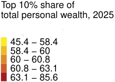

**----- Start of picture text -----** 
Top 10% share of total personal wealth, 2025 45.4 − 58.4 58.4 − 60 60 − 60.8 60.8 − 63.1 63.1 − 85.6 **----- End of picture text -----** 

**Interpretation.** This map shows the share of total personal wealth owned by the top 10% in each country in 2025. In Sweden, the top 10% own about 68.2% of total personal wealth. In New Zealand, they own about 57.2%. Net personal wealth is equal to the sum of financial assets (e.g. equity or bonds) and non−financial assets (e.g. housing or land) owned by individuals, net of their debts. **Sources and series:** Arias−Osorio et al. (2025) and wir2026.wid.world/methodology. 

86 

Chapter 3. Regional Wealth Inequality 

## **Figure 3.13. Top 1% wealth shares are very large** 

**----- Start of picture text -----** 
Top 1% wealth shares across countries, 2025 **----- End of picture text -----** 

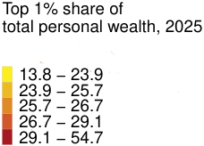

**----- Start of picture text -----** 
Top 1% share of total personal wealth, 2025 13.8 − 23.9 23.9 − 25.7 25.7 − 26.7 26.7 − 29.1 29.1 − 54.7 **----- End of picture text -----** 

**Interpretation.** This map shows the share of total personal wealth owned by the top 1% in each country in 2025. In India, the top 1% own about 40.1% of total personal wealth. In the United Kingdom, they own about 21.3%. Net personal wealth is equal to the sum of financial assets (e.g. equity or bonds) and non−financial assets (e.g. housing or land) owned by individuals, net of their debts. **Sources and series:** Arias−Osorio et al. (2025) and wir2026.wid.world/methodology. 

**Figure 3.14. Wealth inequality is large and widespread** 

**Top 10/bottom 50 wealth gaps across the world, 2025** 

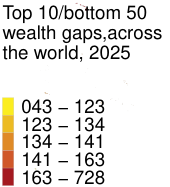

**----- Start of picture text -----** 
Top 10/bottom 50 wealth gaps,across the world, 2025 043 − 123 123 − 134 134 − 141 141 − 163 163 − 728 **----- End of picture text -----** 

**Interpretation.** This map shows the ratio between the average wealth of the top 10% and the average wealth of the bottom 50% of the population in each country in 2025. In the United States, the top 10% own about 727 times more wealth than the bottom 50%. In the Netherlands, the ratio is 128. Net personal wealth is equal to the sum of financial assets (e.g. equity or bonds) and non−financial assets (e.g. housing or land) owned by individuals, net of their debts. **Sources and series:** Arias−Osorio et al. (2025), Chancel and Piketty (2021), and wir2026.wid.world/methodology. 

87 

Notes 

## **Notes** 

> 8Net (after-depreciation) versions in Dietrich et al. (2025) show the same direction but with lower capital shares because consumption of fixed capital is removed. 

9Throughout these maps, wealth refers to household net wealth, financial and non-financial assets minus debts. 

## **References** 

      - Intermediate Consumption”. In: _World Inequality Lab, Technical Notes_ 2025/03. 

   - Nievas, Gastón and Thomas Piketty (2025). “Unequal Exchange and North-South Relations: Evidence from Global Trade Flows and the World Balance of Payments 1800-2025”. In: _World Inequality Lab, Working Paper Series_ 2025/11. 

   - Piketty, Thomas and Gabriel Zucman (2014). “Capital is back: Wealth-income ratios in rich countries 1700–2010”. In: _The Quarterly Journal of Economics_ 129.3, pp. 1255–1310. 

- Arias-Osorio, Manuel et al. (2025). “Equality and Development: A Comparative & Historical Perspective 1800-2025”. In: _World Inequality Lab, Working Paper Series_ . 

- Bauluz, Luis, Pierre Brassac, et al. (2025). “Global Wealth Accumulation and Ownership Patterns 1800-2025”. In: _World Inequality Lab, Working Paper Series_ 2025/22. 

- Bauluz, Luis, Filip Novokmet, and Moritz Schularick (2022). “The Anatomy of the Global Saving Glut”. In: _World Inequality Lab, Working Paper Series_ 2022/06. 

- Blanchet, Thomas and Clara Martínez-Toledano (2023). “Wealth inequality dynamics in Europe and the United States: Understanding the determinants”. In: _Journal of Monetary Economics_ 133, pp. 25–43. 

- Chancel, Lucas and Thomas Piketty (2021). “Global income inequality, 1820–2020: The persistence and mutation of extreme inequality”. In: _Journal of the European Economic Association_ 19.6, pp. 3025–3062. 

- Dietrich, Jonas et al. (2025). “Extending WID National Accounts Series: Sectoral Decompositions & 

88 

# **CHAPTER 4 Gender Inequality** 

Chapter 4. Gender Inequality 

## **Contents of this chapter** 

|**tents of this chapter**||
|---|---|
|Humanity works fewer hours, but the benefts are unequal across genders . . . . .|**91**|
|Female labor income shares remain well below equality. . . . . . . . . . . . . . . . .|**92**|
|Women work more hours everywhere. The gender gap is larger than we previously||
|thought . . . . . . . . . . . . . . . . . . . . . . . . . . . . . . . . . . . . . . . . .|**93**|
|Women are employed less than men . . . . . . . . . . . . . . . . . . . . . . . . . . .|**94**|
|Employed women earn less than employed men . . . . . . . . . . . . . . . . . . . . .|**95**|
|The role of education in improving the gender gap . . . . . . . . . . . . . . . . . . .|**96**|
|Main takeaways . . . . . . . . . . . . . . . . . . . . . . . . . . . . . . . . . . . . . . .|**100**|

90 

Chapter 4. Gender Inequality 

Despite major social and economic transformations over the past two centuries, gender inequality remains a defining feature of the global economy. Women today are more educated, more active in the labor market, and more visible in positions of leadership than ever before. Yet, when we examine how work hours and income are divided between men and women, a striking reality emerges: the world is still a long way from achieving gender parity. 

At the global level, women contribute significantly to both paid and unpaid work, but their economic rewards remain much smaller. They are more likely to work longer hours when both market and household labor are counted, yet they earn less, own less, and occupy fewer formal jobs. Across every region, women’s shares of labor income lag behind men’s, and progress in narrowing these gaps has been slow. Even where gains have been made in education or employment participation, they have not translated into equal pay or equal access to opportunities. 

**Figure 4.1** helps place this imbalance in perspective. It shows that women still suffer gender inequalities across several key dimensions. Women contribute a majority of total working hours worldwide, once unpaid domestic work is included, yet they only earn around one-third of aggregated labor income. Focusing on economic work, employment rates lag significantly behind those of men, with women much less likely to hold a paid job, and when employed, they earn substantially less per hour. Even in education, where female high school enrollment has increased dramatically, parity has not been fully achieved at the global level. These figures reveal not only that gender inequality persists, but that its scope should be apprehended in all its complexity by studying its social, educational, and economic dimensions. Gender inequality is persistent and structural, not just a declining historical feature of the global economy. 

## **Humanity works fewer hours, but the benefits are unequal across genders** 

- One of the most striking long run transformations in the global economy is the decline in working hours. Two 

centuries ago, the typical worker spent more than sixty hours per week in market employment. Today, average hours have fallen dramatically, with all regions working around thirty to forty-five hours per week. This reduction reflects profound structural changes: industrialization, rising productivity (right-hand panel of **Figure 4.2** ), the spread of labor rights and collective action, as well as, in some contexts, institutional change and deliberate policies aimed at shortening the working week. As the left-hand panel of **Figure 4.2** illustrates, Europe today records the lowest average hours worldwide, often below thirty per week, while South & Southeast Asia remain closer to forty-five. The overall picture is one of a world population that, on average, spends less time in formal work than in the past. 

Yet this aggregate progress conceals persistent gender divides. **Figure 4.3** highlights that women continue to work longer hours overall than men once unpaid domestic labor is included. Across the world, women devote more hours to household responsibilities. These hours are rarely compensated or formally recognized, but they represent a substantial portion of total labor time and contribute directly to social welfare. The result is a paradox: men appear to work longer when only market hours are considered, but women consistently surpass them in total working hours once unpaid activities are taken into account. 

This imbalance carries deep implications. First, it can limit women’s opportunities in the labor market, as time spent on unpaid work constrains the hours available for paid work, training, or career advancement . This, together with fewer paid jobs available for women, gender discrimination, and cultural norms, increases gender inequality. Second, it reinforces the wage gap: women not only work more hours in total, but they also earn less for the paid portion of their labor. Ultimately, it highlights how gender inequality extends beyond wages and employment statistics to the organization of daily life. Working time itself is unequally distributed, with women bearing the heavier load. Their labor is rendered invisible by the non-inclusion of domestic and care work in national accounts. 

91 

Chapter 4. Gender Inequality 

## **Figure 4.1. The gender gap is still large considering several dimensions** 

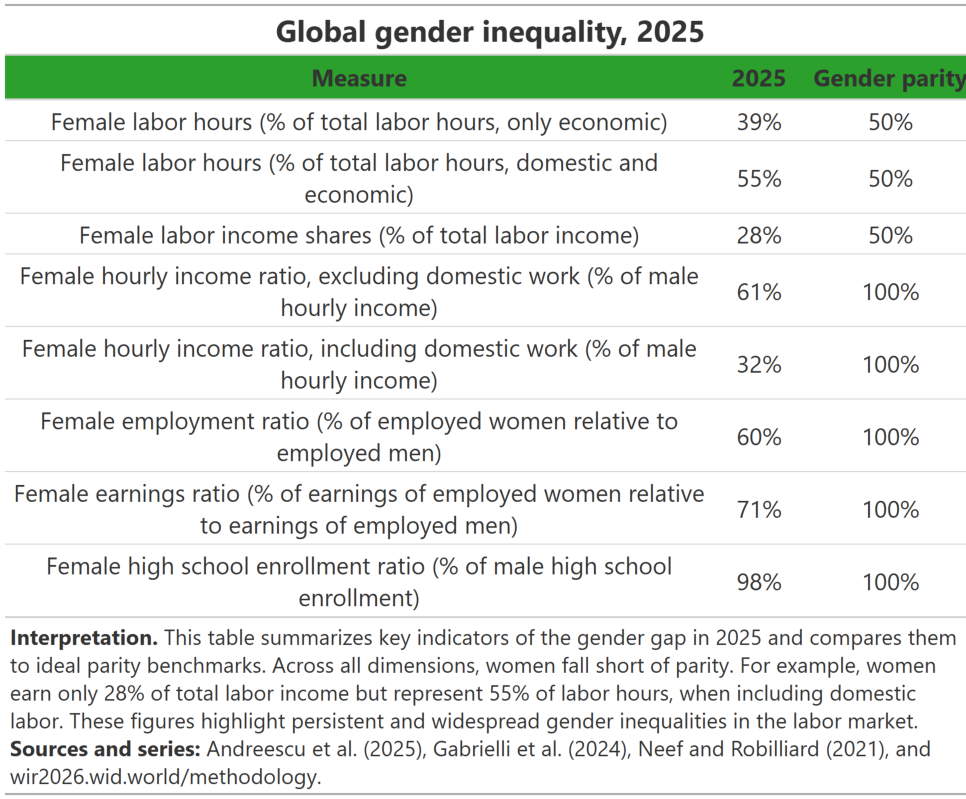

The long-run decline in global working hours is therefore a story of uneven gains. Humanity may be working fewer hours overall, but men have benefited most from the reductions in formal work, while women’s total workload remains high. This uneven distribution of time is one of the clearest demonstrations that progress in labor conditions has not automatically translated into gender parity. 

## **Female labor income shares remain well below equality** 

If hours worked reveal one dimension of inequality, labor income shares provide another. They show how much of the total earnings generated by labor in a country or 

region go to women, and how this share has changed over time. **Figure 4.4** and **Figure 4.5** make clear that, despite progress, women remain far from achieving parity in all regions of the world. 

Globally, women earn just about one-third of total labor income today. In some regions, there have been improvements, but female labor income shares remain well below equality (see **Figure 4.4** ). No region in the world has reached a 50–50 balance between men and women, and the gaps are especially pronounced in South Asia, the Middle East, and parts of Africa, where women capture less than a quarter of all labor income (see **Figure 4.5** ). 

By contrast, Europe, North America & Oceania, and Russia & Central Asia record 

92 

Chapter 4. Gender Inequality 

## **Figure 4.2. We are working fewer hours and being more productive** 

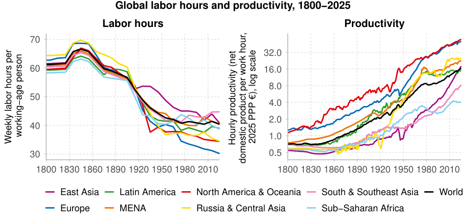

**----- Start of picture text -----** 
Global labor hours and productivity, 1800−2025 Labor hours Productivity 70 32.0 60 16.0 8.0 50 4.0 2.0 40 1.0 30 0.5 1800 1830 1860 1890 1920 1950 1980 2010 1800 1830 1860 1890 1920 1950 1980 2010 East Asia Latin America North America & Oceania South & Southeast Asia World Europe MENA Russia & Central Asia Sub−Saharan Africa  working−age person Weekly labor hours per Hourly productivity (net  2025 PPP €), log scale domestic product per work hour, **----- End of picture text -----** 

**Interpretation.** This figure shows trends in weekly labor hours and hourly productivity across world regions since 1800. On average, weekly hours declined globally from 61 to 40 hours per working−age person between 1800 and 2025. Meanwhile, global hourly productivity increased from €0.7 to €16.5, multiplying by about 23.6 over the same period. Despite overall improvements, North America & Oceania and Europe remain far ahead of other regions. **Sources and series:** Andreescu et al. (2025). 

the highest female labor income shares, reaching around 40%, but this is still lower than the perfect parity case, which would mean a labor income share of 50%. These regions have seen sustained improvements, driven by higher female participation in the labor market, stronger legal protections, and expanding welfare systems. **Figure 4.4** and **Figure 4.5** show that the gender gap in labor income is both large and persistent. Women’s income share has risen, but only slowly. Gender inequality in labor earnings remains a structural feature of the global economy. 

## **Women work more hours everywhere. The gender gap is larger than we previously thought** 

If women’s share of labor income is persistently lower, one might assume that they also work fewer hours. The opposite is true. **Figure 4.6** and **Figure 4.7** reveal that women, on average, work more hours than men worldwide once unpaid domestic work is included. The gender gap in total working time is not only substantial but also larger than what conventional measures have long 

## suggested. 

Traditional labor statistics have tended to focus narrowly on hours of paid work, thereby underestimating women’s contributions. When only market work is counted, men often appear to work longer, particularly in regions with high levels of formal male employment. But when unpaid household activities are properly measured, the picture changes radically: women consistently outwork men in total hours. This reality has been documented by recent research.[10] 

**Figure 4.6** illustrates this at the European level, providing a clear example of how the calculation works. It compares women’s share of working time when only paid labor is considered (the conventional measure) with their share once unpaid domestic and care work is included (the real measure). The gap widens substantially (from 8% to 43%) when all forms of labor are accounted for, revealing how much conventional statistics underestimate women’s contributions. 

**Figure 4.7** extends this comparison to the global scale. Instead of focusing on 

93 

Chapter 4. Gender Inequality 

**Figure 4.3. Women work more in all regions** 

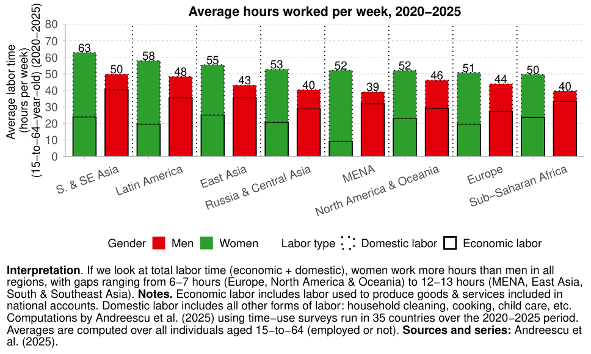

**----- Start of picture text -----** 
Average hours worked per week, 2020−2025 80 70 63 60 58 55 50 50 48 43 53 52 52 46 51 44 50 40 40 39 40 30 20 10 0 Gender Men Women Labor type Domestic labor Economic labor Interpretation . If we look at total labor time (economic + domestic), women work more hours than men in all regions, with gaps ranging from 6−7 hours (Europe, North America & Oceania) to 12−13 hours (MENA, East Asia, South & Southeast Asia).  Notes.  Economic labor includes labor used to produce goods & services included in national accounts. Domestic labor includes all other forms of labor: household cleaning, cooking, child care, etc. Computations by Andreescu et al. (2025) using time−use surveys run in 35 countries over the 2020−2025 period. Averages are computed over all individuals aged 15−to−64 (employed or not).  Sources and series:  Andreescu et al. (2025). S. & SE AsiaLatin America East AsiaRussia & Central Asia North America & OceaniaMENA EuropeSub−Saharan Africa (hours per week) Average labor time (15−to−64−year−old) (2020−2025) **----- End of picture text -----** 

global averages, the regional decomposition contrasts the conventional and real gender gaps across major world regions today. The results are striking: in every region, the inclusion of domestic work significantly raises women’s share of total labor time, but also highlights that women systematically work more than men everywhere. This regional comparison shows that the underestimation of women’s work is not limited to Europe. Its historical evolution has led to different regional trends and different amplitudes of the gender gap. However, the gender gap in labor income is an undeniable global phenomenon that persists in the present. 

## **Women are employed less than men** 

Beyond differences in hours worked, a fundamental gap remains in access to employment itself. **Figure 4.8** shows that, across all world regions, women are less likely than men to hold a job in the labor market. While patterns vary across regions, the global pattern is clear: women’s employment rates trail men’s by a wide margin. 

The employment gap is particularly large 

in South & Southeast Asia and the Middle East & North Africa. In these regions, around one in three women of working age are employed in the economic market, compared with more than two-thirds of men. By contrast, Europe, Russia & Central Asia, and North America & Oceania display higher female employment rates, yet even here the gap is significant. 

This divide cannot be explained by individual choice alone. Structural barriers play a central role. Access to affordable childcare, transportation, and family leave policies strongly influence women’s ability to enter and remain in the labor force. In countries where such support is weak, women are more likely to withdraw from paid employment, especially after childbirth. Discrimination in hiring and promotion also reduces opportunities, particularly in higher-paying sectors. 

The persistence of employment gaps has ripple effects across the economy. Lower female participation reduces women’s labor income shares (as seen in **Figure 4.4** and **Figure 4.5** ) and constrains overall economic potential. Studies consistently show that economies with higher female 

94 

Chapter 4. Gender Inequality 

## **Figure 4.4. Female average incomes are smaller than males’ everywhere** 

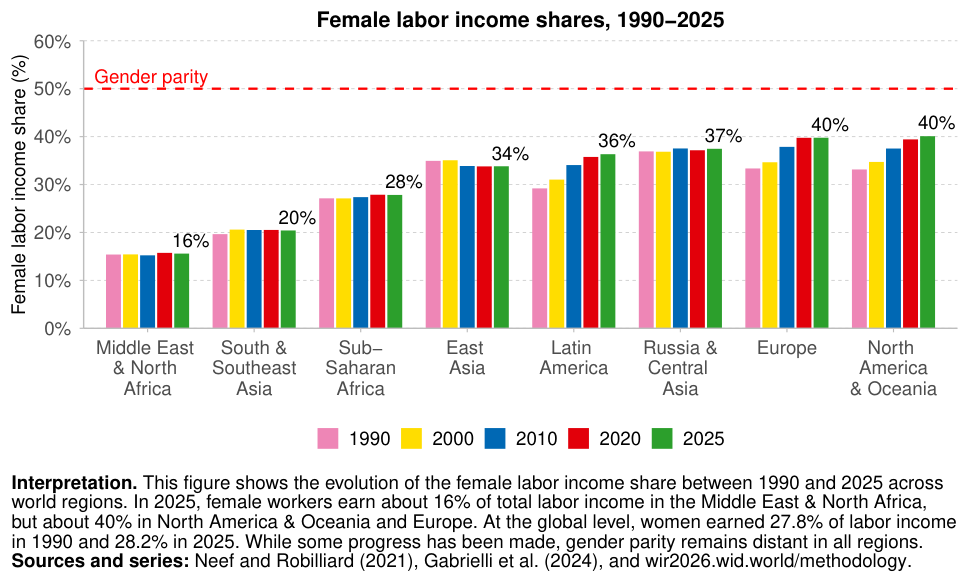

**----- Start of picture text -----** 
Female labor income shares, 1990−2025 60% Gender parity 50% 40% 40% 40% 36% 37% 34% 30% 28% 20% 20% 16% 10% 0% Middle East  South & Sub− East  Latin  Russia & Europe North & North  Southeast Saharan Asia America Central  America Africa Asia Africa Asia & Oceania 1990 2000 2010 2020 2025 Interpretation.  This figure shows the evolution of the female labor income share between 1990 and 2025 across world regions. In 2025, female workers earn about 16% of total labor income in the Middle East & North Africa, but about 40% in North America & Oceania and Europe. At the global level, women earned 27.8% of labor income in 1990 and 28.2% in 2025. While some progress has been made, gender parity remains distant in all regions. Sources and series:  Neef and Robilliard (2021), Gabrielli et al. (2024), and wir2026.wid.world/methodology. Female labor income share (%) **----- End of picture text -----** 

labor force participation experience stronger growth and a more equitable distribution of income. Yet, despite these benefits, progress has been slow and uneven, suggesting that employment inequalities are deeply embedded in economic and social structures. 

## **Employed women earn less than employed men** 

Even when women overcome barriers to employment, they face another persistent challenge: lower pay. **Figure 4.9** highlights the global gender pay gap, showing that employed women consistently earn less than employed men across all regions. This gap exists at every income level, in both highand low-income regions, with a few gains during recent decades in Latin America, North America & Oceania, Europe, and Russia & Central Asia. 

The gap is still present despite decades of anti-discrimination laws and advocacy. The magnitude varies by region: the gap is widest in Sub-Saharan Africa and South & Southeast Asia. Employed women earn 

about 75% of what employed men earn in North America & Oceania, Europe, Russia & Central Asia, and East Asia. The persistence of this divide underscores that it is not simply a legacy of the past, but a structural feature of contemporary labor markets. 

Several factors contribute to the wage gap. Occupational segregation plays a major role: women are overrepresented in sectors that pay less, such as education, healthcare, and domestic services, and underrepresented in higher-paying fields like finance, engineering, and technology. Within firms, women are less likely to occupy senior positions and more likely to be hired in part-time or precarious roles, which reduces average earnings. 

The economic consequences are far-reaching. Lower pay compounds over time, leading to smaller savings, weaker pensions, and reduced wealth accumulation. Women not only earn less during their working years but can also accumulate lower wealth, reinforcing inequalities across generations. The gender pay gap is, therefore, more than a matter of fairness 

95 

Chapter 4. Gender Inequality 

## **Figure 4.5. Female labor income shares are very low almost everywhere** 

## **Female labor income shares across countries, 2025** 

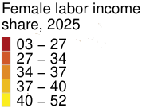

**----- Start of picture text -----** 
Female labor income share, 2025 03 − 27 27 − 34 34 − 37 37 − 40 40 − 52 **----- End of picture text -----** 

**Interpretation.** This map shows the share of total labor income earned by women in each country in 2025. In Egypt, women earn about 19% of total labor income. In France, they earn about 43% . This indicator captures the pre−tax labor income of all working−age individuals. **Sources and series:** Neef and Robilliard (2022), Gabrielli et al. (2024), and wir2026.wid.world/methodology. 

in wages. It reflects how societies value different kinds of work and how power is distributed in the labor market. 

## **The role of education in improving the gender gap** 

Education is often viewed as the most powerful equalizer. Expanding access to schooling has indeed transformed women’s lives worldwide, enabling them to enter the labor market in greater numbers and to aspire to careers that were once out of reach. Yet **Figure 4.10** and **Figure 4.11** reveal that while education has narrowed some gender divides, it has not been sufficient to eliminate them. 

**Figure 4.10** shows that women’s educational participation has improved dramatically in this century. In low- and middle-income economies, the school enrollment gender gap has decreased in the last twenty-five years from 85% to 98%, reaching almost full parity. In high-income countries, young women now outnumber men in secondary education enrollment. 

These advances have been crucial in raising female employment and income levels, as education increases opportunities to access formal jobs and higher wages. 

However, **Figure 4.11** reminds us that education alone cannot fully close the gap. Even when women achieve the same or higher levels of schooling and income returns on schooling, their labor income share remains lower than men’s. The link between education and equality is therefore partial and mediated by broader labor market structures. High levels of female education have not translated into equal employment or pay, due to persistent cultural and institutional barriers. 

The lesson is clear. Education is necessary for gender equality but not sufficient on its own. Without policies that address workplace discrimination, provide childcare support, and promote equal opportunities, the returns on education for women will remain systematically lower than for men. 

96 

Chapter 4. Gender Inequality 

## **Figure 4.6. The gender gap is wider considering domestic work** 

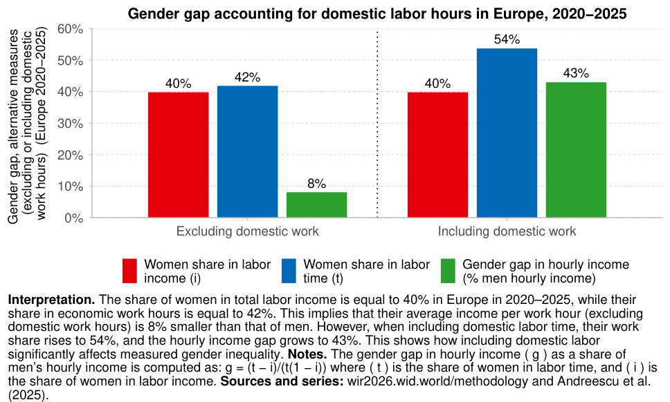

**----- Start of picture text -----** 
Gender gap accounting for domestic labor hours in Europe, 2020−2025 60% 54% 50% 42% 43% 40% 40% 40% 30% 20% 10% 8% 0% Excluding domestic work Including domestic work Women share in labor  Women share in labor  Gender gap in hourly income income (i) time (t) (% men hourly income) Interpretation.  The share of women in total labor income is equal to 40% in Europe in 2020–2025, while their share in economic work hours is equal to 42%. This implies that their average income per work hour (excluding domestic work hours) is 8% smaller than that of men. However, when including domestic labor time, their work share rises to 54%, and the hourly income gap grows to 43%. This shows how including domestic labor significantly affects measured gender inequality.  Notes.  The gender gap in hourly income ( g ) as a share of men’s hourly income is computed as: g = (t −i)/(t(1 −i)) where ( t ) is the share of women in labor time, and ( i ) is the share of women in labor income.  Sources and series:  wir2026.wid.world/methodology and Andreescu et al. (2025).  (excluding or including domestic Gender gap, alternative measures    work hours)  (Europe 2020−2025) **----- End of picture text -----** 

**Figure 4.7. The gender gap is larger when accounting for domestic labor hours** 

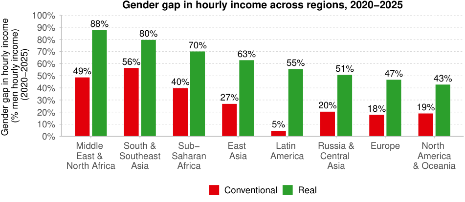

**----- Start of picture text -----** 
Gender gap in hourly income across regions, 2020−2025 100% 88% 90% 80% 80% 70% 70% 63% 60% 56% 55% 50% 49% 51% 47% 43% 40% 40% 30% 27% 20% 18% 19% 20% 10% 5% 0% Middle  South & Sub− East  Latin  Russia & Europe North East &  Southeast Saharan Asia America Central  America North Africa Asia Africa Asia & Oceania Conventional Real  (2020−2025)  (% men hourly income) Gender gap in hourly income **----- End of picture text -----** 

**Interpretation.** Bars report the gender gap in hourly labor income: the percentage by which women’s average income per work hour is smaller than men’s. For example, a bar at 12% means women earn 12% less per hour than men on average. Regions are ordered by the Real gap (including domestic work hours). In Europe, the Conventional gap (excluding domestic work hours) is 18%, while the Real gap (including domestic work hours) is 47%. Including domestic work hours increases the measured gap because women’s total work time is larger once domestic work is counted. **Notes.** This figure references figures 20 and 21 in Andreescu et al. (2025). **Sources and series:** Andreescu et al. (2025). 

97 

Chapter 4. Gender Inequality 

**Figure 4.8. Women are less likely than men to hold a job in the labor market** 

**Employed women relative to employed men, 1990−2025** 100% ~~Gender parity 89% 91% 93%~~ 90% 80% ~~73% 74%~~ 70% ~~62%~~ 60% 50% 40% ~~32% 34%~~ 30% 20% 10% 0% Middle East South & Sub− Latin East Europe North Russia & & North Southeast Saharan America Asia America Central Africa Asia Africa & Oceania Asia 1990 2000 2010 2020 2025 **Interpretation.** This figure shows the evolution of the gender total employment ratio between 1990 and 2025 across world regions. The indicator measures the share of employed women relative to employed men, regardless of how much they earn. In 2025, female employment remains well below parity in several regions: only 32% of women are employed per 100 employed men in Middle East & North Africa. In contrast, employment ratios are close to gender parity in Russia & Central Asia (93%), North America & Oceania (91%), and Europe (89%). The global gender employment gap (measured as the distance to full parity) increased slightly, since the ratio of employed women relative to employed men declined from 67% in 1990 to 60% in 2025. **Sources and series:** wir2026.wid.world/methodology and Gabrielli et al. (2024). 

**Figure 4.9. Employed women earn less than employed men everywhere** 

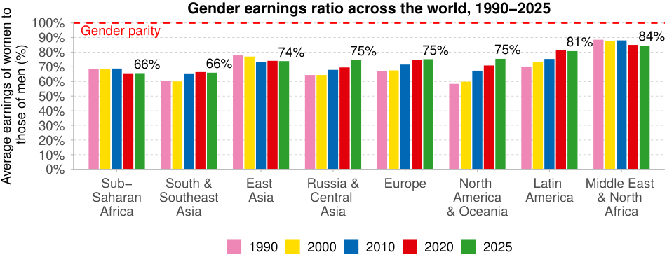

**----- Start of picture text -----** 
Gender earnings ratio across the world, 1990−2025 100% 90% Gender parity 81% 84% 80% 74% 75% 75% 75% 70% 66% 66% 60% 50% 40% 30% 20% 10% 0% Sub− South & East  Russia & Europe North  Latin  Middle East Saharan Southeast Asia Central  America America & North Africa Asia Asia & Oceania Africa 1990 2000 2010 2020 2025  those of men (%) Average earnings of women to **----- End of picture text -----** 

**Interpretation.** This figure shows the evolution of the earnings gender ratio between 1990 and 2025 across world regions. The indicator measures the average earnings of employed women as a share of the average earnings of employed men. In 2025, the gender earnings gap remains wide in several regions: women earn only 66% of what men earn in both Sub−Saharan Africa and South & Southeast Asia. In contrast, earnings ratios are highest in Middle East & North Africa (84%) and Latin America (81%). Across high−income regions such as North America & Oceania and Europe (and also Russia & Central Asia), the average female−to−male earnings ratio hovers around 75%. At the global level, women earned 69% of men’s average income in 1990 and 71% in 2025. While modest progress has been made over the past 35 years, gender parity in earnings remains out of reach in all regions. **Sources and series:** wir2026.wid.world/methodology and Gabrielli et al. (2024). 

98 

Chapter 4. Gender Inequality 

**Figure 4.10. The high school enrollment gender gap has decreased in the last 25 years** 

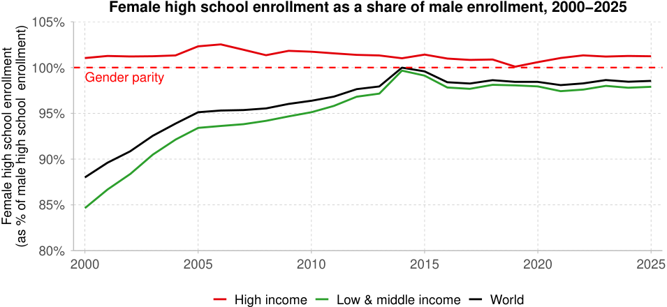

**----- Start of picture text -----** 
Female high school enrollment as a share of male enrollment, 2000−2025 105% 100% Gender parity 95% 90% 85% 80% 2000 2005 2010 2015 2020 2025 High income Low & middle income World Female high school enrollment (as % of male high school  enrollment) **----- End of picture text -----** 

**Interpretation.** This figure shows the evolution of the gender gap in high school enrollment from 2000 to 2025 across country income groups. The indicator measures female enrollment as a share of male enrollment. At the global level, this share increased from 88% in 2000 to 98% in 2025, indicating near gender parity. In high−income countries, the ratio reached 101%, and in low−& middle−income countries, the ratio reached 98%, reflecting considerable progress over two decades. **Sources and series:** wir2026.wid.world/methodology. 

**Figure 4.11. Education alone cannot fully close the gap** 

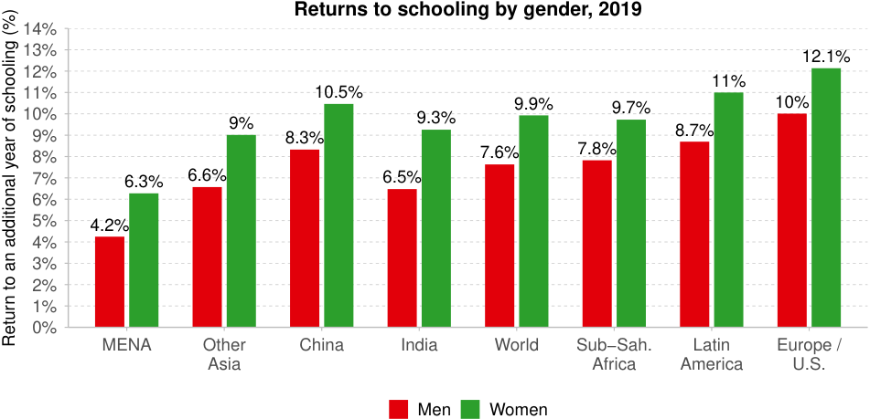

**----- Start of picture text -----** 
Returns to schooling by gender, 2019 14% 13% 12.1% 12% 11% 11% 10.5% 9.9% 9.7% 10% 10% 9% 9.3% 8.7% 9% 8.3% 8% 7.6% 7.8% 7% 6.3% 6.6% 6.5% 6% 5% 4.2% 4% 3% 2% 1% 0% MENA Other China India World Sub−Sah. Latin Europe / Asia Africa America U.S. Men Women Return to an additional year of schooling (%) **----- End of picture text -----** 

**Interpretation** . The figure plots returns to a year of schooling by gender and world region in 2019. Estimates correspond to the effect of one additional year of schooling on the log of personal income, estimated separately by gender using modified Mincerian equations that control for an experience quartic. In all world regions, the return to a year of schooling is higher for women than for men. **Sources and series:** Gethin (2024). 

99 

Chapter 4. Gender Inequality 

## **Main takeaways** 

Gender inequality remains a defining and persistent feature of the global economy. Women today are more educated, more active in the labor market, and more present in leadership positions, yet their economic standing continues to lag behind men’s. 

be achieved requires sustained institutional change, supportive policies, and recognition of the invisible labor that women continue to perform disproportionately to men. 

Women work longer hours than men once unpaid domestic and care work is included, but they capture only about one-third of total labor income. This paradox reflects how aggregate progress has been unevenly distributed. Employment and pay gaps reinforce this imbalance. Women are less likely to hold paid jobs in every region, and when employed, they consistently earn less than men. This has long-term effects on savings, pensions, and wealth accumulation, increasing inequality. 

Education has narrowed some gaps, with women achieving near parity in high-school enrollment, but schooling alone has not eliminated inequalities. Historical evidence shows that progress is slow and uneven. The lesson is clear: gender parity is by no means a guaranteed result of narrowing gender inequality. For genuine gender parity to 

100 

Notes 

## **Notes** 

10See Andreescu et al. (2025). 

## **References** 

Andreescu, Marie et al. (2025). “Global Labour Hours in Paid and Unpaid Work: Inequality, Productivity and Structural Transformation, 1800-2100”. In: _World Inequality Lab, Working Paper Series_ 2025/03. Gabrielli, Valentina, Theresa Neef, and Anne-Sophie Robilliard (2024). _2024 Update for Female Labor Income Share_ . Tech. rep. 2024/13. Gethin, Amory (2025). “Distributional Growth Accounting: Education and the Reduction of Global Poverty, 1980-2019”. In: _World Inequality Lab, Working Paper Series_ 2023/25. 

Neef, Theresa (2024). “The Long Way to Gender Equality: Gender Pay Differences in Germany, 1871-2021”. In: _World Inequality Lab, Working Paper Series_ 2024/02. 

Neef, Theresa and Anne-Sophie Robilliard (2021). “Half the Sky? The Female Labor Income Share in a Global Perspective”. In: _World Inequality Lab, Working Paper Series_ 2021/22. 

101 

# **CHAPTER 5 Exorbitant Privilege** 

Chapter 5. Exorbitant Privilege 

## **Contents of this chapter** 

|The U.S. exorbitant privilege has evolved into a structural privilege of the rich world **104**|
|---|
|Rich countries are global fnancial rentiers by political design, not because of market|
|dynamics . . . . . . . . . . . . . . . . . . . . . . . . . . . . . . . . . . . . . . . . **105**|
|Barriers for reducing inequality across countries . . . . . . . . . . . . . . . . . . . . . **106**|
|Need for reforms in the international fnancial, trade, and monetary systems . . . . **107**|
|Main takeaways . . . . . . . . . . . . . . . . . . . . . . . . . . . . . . . . . . . . . . . **108**|
|Box 5.1: Exorbitant duty is not so exorbitant . . . . . . . . . . . . . . . . . . . . . . **113**|

103 

Chapter 5. Exorbitant Privilege 

Since the mid-20th century, the international monetary system has exacerbated inequality by design. At its core there is a structural asymmetry: a privileged few countries have the advantage of borrowing cheaply and investing in relatively more profitable assets, securing income inflows. This advantage was first described in the 1960s as the “exorbitant privilege” of the United States, whose role as issuer of the world’s main reserve currency allowed it to pay less on what it owed than it earned abroad. What began as a U.S.-specific feature has since become a structural privilege of the rich world. Europe, Japan, and other advanced economies now enjoy similar benefits, while poorer countries face the opposite burden: they pay higher interest on their debts, hold assets that yield little, and transfer income abroad each year. In effect, rich countries have become global rentiers, systematically extracting resources from the rest of the world. 

This chapter, based on Nievas and Sodano (2025), documents how the system works. First, we show how the U.S. privilege widened into a collective advantage for the richest 20% of countries. Second, we highlight a paradox: privilege persists even for a net debtor region such as North America & Oceania. Third, we explain how advanced economies became financial rentiers by design, through currency dominance, portfolio asymmetries, and institutional rules that perpetuate their advantage. Fourth, we examine how these asymmetries act as barriers to development, draining resources from poorer nations. The chapter concludes by arguing that these dynamics amount to a modern form of unequal exchange, echoing earlier colonial transfers. Finally, it calls for urgent reform of the international monetary, financial, and trade systems to address and reduce these inequalities. 

## **The U.S. exorbitant privilege has evolved into a structural privilege of the rich world** 

The idea of “exorbitant privilege” was coined in the 1960s to describe the United States’ unique position in the world economy. This was not the result of singularly skillful investments but of the central role of 

the dollar. Given its preeminent role in the international monetary and financial systems, investors and central banks worldwide considered U.S. assets safe and liquid, and the country could therefore borrow at very low rates and reinvest abroad at higher returns. 

New evidence by Nievas and Sodano (2025) shows that this advantage has expanded well beyond the U.S., which now owes 2% of its GDP to this exorbitant privilege. **Figure 5.1** illustrates how the privilege has evolved into a broader feature of the global economy. Japan now records the largest benefits of this skewed system, close to 6% of GDP, while the Eurozone also has positive balances (about 1%). By contrast, emerging economies remain at a disadvantage: BRICS[11] countries record persistently negative excess yields, averaging 2% of GDP. 

**Figure 5.2** details this pattern further still. When grouped by income, only the richest 20% of countries, which are home to one-fifth of the global population, consistently present positive excess yields, equivalent to approximately 1% of GDP. The rest of the world records deficits ranging from 1% to 3% in the last decade. Regionally, North America & Oceania, East Asia (excluding China), and Europe stand out as the main winners. Latin America, Sub-Saharan Africa, South & Southeast Asia, the Middle East & North Africa, Russia & Central Asia, and China remain net losers. Far from being a U.S. exception, exorbitant privilege has become a structural privilege of the rich world, reinforcing global inequality rather than narrowing it. 

One of the paradoxes of global finance is that some regions can hold negative net foreign asset (NFA) positions yet still earn positive net investment income. The North America & Oceania region is the clearest example. It has long been the world’s largest net debtor, with foreigners owning more assets in North America & Oceania than what residents from North America & Oceania hold abroad ( **Figure 5.3** ). Yet year after year, the region records a surplus on net foreign capital income due to excess yields ( **Figure 5.4** ). 

**Figure 5.4** also shows how the richest 

104 

Chapter 5. Exorbitant Privilege 

## **Figure 5.1. The U.S. exorbitant privilege has evolved into a structural privilege of the rich world** 

**----- Start of picture text -----** 
Excess yield (assets−liabilities) as % of country GDP, 1970−2025 7% 6% The centrality of the U.S. dollar, and now other currencies, 5% 4% in the global financial system allows rich economies to borrow 3% at very low rates. 2% 1% 0% −1% −2% −3% −4% −5% 1970 1975 1980 1985 1990 1995 2000 2005 2010 2015 2020 2025 BRICS Eurozone Russia China Japan United States Excess yield as % of country GDP, MER **----- End of picture text -----** 

**Interpretation.** This graph shows excess yield income, defined as the difference between the return on foreign assets and liabilities, as a share of national GDP. The figure shows that the exorbitant privilege once exclusive to the United States has become a broader rich−world phenomenon. The United States maintains a substantial privilege of 2.2% in 2025. The Eurozone follows with 1% by 2025. Japan stands out with a privilege of 5.9% by 2025. In contrast, BRICS countries face a consistent burden of around 2.1%, highlighting their role as net providers of capital to wealthier economies. **Notes.** Positive values represent income gains from financial privilege; negative values represent financial burden. BRICS countries comprise Brazil, Russia, India, China, and South Africa. **Sources and series:** Nievas and Sodano (2025) and wir2026.wid.world/methodology. 

20% of countries consistently record positive income flows. Meanwhile, the bottom 80% are persistent net debtors and face negative income balances, reinforcing their disadvantage. 

## **Rich countries are global financial rentiers by political design, not because of market dynamics** 

**Figure 5.5** to **Figure 5.7** reveal why the exorbitant privilege has persisted and extended: the global financial and monetary system has been deliberately structured to favor advanced economies. Their role as issuers of reserve currencies, the composition of their external portfolios, and the cost asymmetries between assets and liabilities combine to make them global financial rentiers. 

**Figure 5.5** documents a foundation of this privilege: currency dominance. Over the last few decades, the U.S. dollar has remained the predominant medium of trade invoicing, financial asset denomination, and central bank reserves. The euro has 

also become, to a lesser extent, a major player since its creation. Other currencies play only marginal roles. This institutional inequality ensures persistent demand for dollar- and euro-denominated assets. This leads to persistently lower borrowing costs for the U.S. and Eurozone, whereas other economies are more exposed to debt in foreign currencies and vulnerable to exchange rate fluctuations. 

**Figure 5.6** highlights the composition of cross-border portfolios. Rich countries hold equity and foreign direct investment on the asset side, which typically have higher returns, while their liabilities are predominantly low-cost debt securities. Poorer countries show the mirror image: they hold large shares of reserves, safe but low-yielding, while issuing liabilities in the form of high-cost debt and inward foreign direct investment (FDI). This asymmetry means that even when poorer countries save and accumulate foreign assets, those assets generate little return, while their liabilities remain costly. 

**Figure 5.7** complements this picture by 

105 

Chapter 5. Exorbitant Privilege 

**Figure 5.2. Rich countries receive 1% of their GDP from the rest of the world due to financial privilege** 

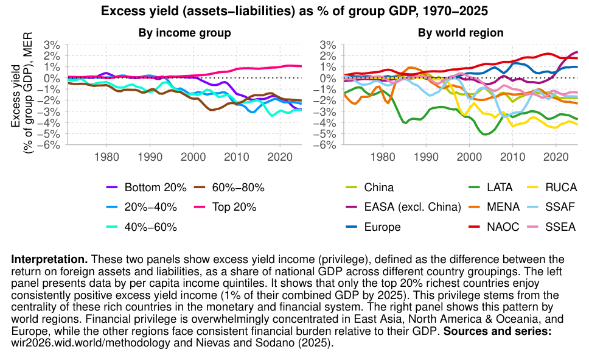

**----- Start of picture text -----** 
Excess yield (assets−liabilities) as % of group GDP, 1970−2025 By income group By world region 3% 3% 2% 2% 1% 1% 0% 0% −1% −1% −2% −2% −3% −3% −4% −4% −5% −5% −6% −6% 1980 1990 2000 2010 2020 1980 1990 2000 2010 2020 Bottom 20% 60%−80% China LATA RUCA 20%−40% Top 20% EASA (excl. China) MENA SSAF 40%−60% Europe NAOC SSEA Interpretation.  These two panels show excess yield income (privilege), defined as the difference between the return on foreign assets and liabilities, as a share of national GDP across different country groupings. The left panel presents data by per capita income quintiles. It shows that only the top 20% richest countries enjoy consistently positive excess yield income (1% of their combined GDP by 2025). This privilege stems from the centrality of these rich countries in the monetary and financial system. The right panel shows this pattern by world regions. Financial privilege is overwhelmingly concentrated in East Asia, North America & Oceania, and Europe, while the other regions face consistent financial burden relative to their GDP.  Sources and series: wir2026.wid.world/methodology and Nievas and Sodano (2025). Excess yield  (% of group GDP), MER **----- End of picture text -----** 

comparing returns on investments directly. The richest 20% consistently earn more on their assets abroad and pay less on their liabilities. Over the last half-century, global returns on assets have fallen for all, but the decline has been steepest for poorer countries. More importantly, the liability costs have remained high or even increased for the poorer countries. Only the richest 20% have experienced a large decrease in liability costs. The result is a structural advantage for rich countries: they are “charged less” on what they owe. 

These patterns are not the accidental outcome of market forces. They stem from policy design and institutional dominance. For instance, regulatory standards such as Basel III increased the demand for “safe” assets, consolidating the role of U.S. Treasuries and European sovereign bonds. Credit rating agencies, largely based in advanced economies, reinforce the perception of safety for rich-country debt and risk for poorer-country debt. Central banks worldwide accumulate reserves in dollars and euros, further entrenching the system. The broader implication is that the 

richest economies do not simply benefit from privilege; they actively shape and maintain it. By controlling the currencies, rules, and institutions at the center of global finance, they secure a rentier position that channels income from the rest of the world, thereby exacerbating inequality across countries. 

## **Barriers for reducing inequality across countries** 

The financial asymmetries documented in this chapter are not only technical imbalances; they translate directly into barriers for development. **Figure 5.8** illustrates how poorer countries systematically transfer resources to richer ones, constraining their fiscal capacity and long-term growth prospects. The bottom 80% of countries devote a significant share of their GDP to net income outflows, which can be seen as the cost of financing the privilege for the top 20%. These outflows, averaging 2–3% of GDP each year, represent resources that could otherwise be invested in schools, hospitals, or infrastructure. The cost is 

106 

Chapter 5. Exorbitant Privilege 

**Figure 5.3. Privilege persists for the U.S. (and its region) despite negative net foreign asset positions** 

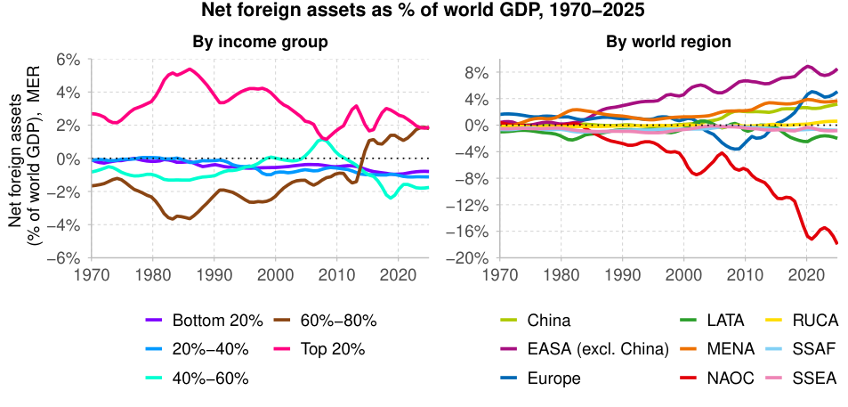

**----- Start of picture text -----** 
Net foreign assets as % of world GDP, 1970−2025 By income group By world region 6% 8% 4% 4% 2% 0% −4% 0% −8% −2% −12% −4% −16% −6% −20% 1970 1980 1990 2000 2010 2020 1970 1980 1990 2000 2010 2020 Bottom 20% 60%−80% China LATA RUCA 20%−40% Top 20% EASA (excl. China) MENA SSAF 40%−60% Europe NAOC SSEA Net foreign assets  (% of world GDP),  MER **----- End of picture text -----** 

**Interpretation.** These panels show net foreign assets (NFA) as a share of world GDP by income group (left) and world region (right). Global net asset positions remain deeply unequal. The top 20% richest countries have maintained a positive NFA position equivalent to nearly 2% of world GDP in 2025, while the bottom 80% of the world population have held mainly negative positions, deteriorated by net investment income outflows and valuation losses. **Sources and series:** Nievas and Sodano (2025) and wir2026.wid.world/methodology. 

particularly heavy for low-income regions, where financing privilege often demands higher budgets than health expenditure. By contrast, rich countries receive steady inflows, reinforcing their ability to sustain higher living standards. 

The implication is stark. The current financial system perpetuates global inequality by design. In many ways, these income transfers function as a modern form of unequal exchange, subtler than colonial extraction, but no less constraining for the development paths of poorer nations. 

## **Need for reforms in the international financial, trade, and monetary systems** 

**Figure 5.9** synthesizes two centuries of evidence on how global asymmetries in trade, finance, and income have been structured (see Nievas and Piketty (2025)). Taken together, its four panels reveal not just fluctuations in balances but enduring patterns of power and privilege in the international financial system. 

Panel (a) traces net foreign income 

balances. It highlights Europe’s remarkable capacity in the 19th century to enjoy positive income flows despite persistent trade deficits. By the eve of World War I, these inflows amounted to about 1.5% of world GDP, an unprecedented record. Panels (b) and (c) explain how this was possible: Europe’s foreign assets, concentrated in colonies, peaked at nearly one-third of world GDP, allowing it to convert deficits in goods and services into surpluses in income. 

A striking modern parallel emerges in North America & Oceania. Panel (c) shows the region today holds large negative net foreign assets, while panel (d) confirms a persistent trade deficit. Yet panel (a) reveals that North America & Oceania still records positive net foreign income. The explanation lies in panel (b): excess yield. Like Europe in the colonial era, North America & Oceania, led by the United States, systematically earns higher returns on its assets abroad than it pays on its liabilities. This exorbitant privilege allows the region to live with persistent trade and net foreign asset deficits while continuing to obtain positive net income from the rest of the world. 

107 

Chapter 5. Exorbitant Privilege 

## **Figure 5.4. There is a persistent net income transfer from poor to rich** 

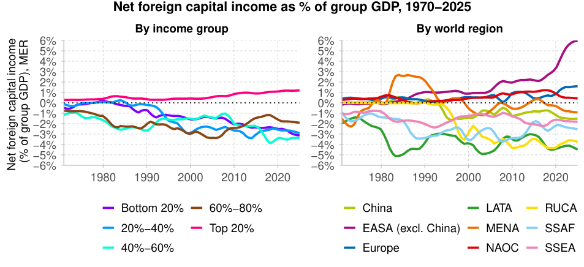

**----- Start of picture text -----** 
Net foreign capital income as % of group GDP, 1970−2025 By income group By world region 6% 6% 5% 5% 4% 4% 3% 3% 2% 2% 1% 1% 0% 0% −1% −1% −2% −2% −3% −3% −4% −4% −5% −5% −6% −6% 1980 1990 2000 2010 2020 1980 1990 2000 2010 2020 Bottom 20% 60%−80% China LATA RUCA 20%−40% Top 20% EASA (excl. China) MENA SSAF 40%−60% Europe NAOC SSEA  (% of group GDP), MER Net foreign capital income **----- End of picture text -----** 

**Interpretation.** These panels show net foreign capital income as a share of GDP by income group (left) and region (right). The top 20% richest countries consistently earn positive net income from abroad, while poorer countries face persistent deficits. This reflects structural asymmetries: rich countries invest in high−return assets and issue low−cost liabilities, whereas poorer countries hold low−yield reserves and pay high returns on debt. At the regional level, East Asia (excluding China), Europe, and North America & Oceania capture the gains, while the rest of the world bear the costs. **Sources and series:** Nievas and Sodano (2025) and wir2026.wid.world/methodology. 

East Asia, by contrast, follows a more “textbook” path. Its rising creditor position since the 1980s has been built on persistent surpluses in trade, not on privileged yields. This comparison underscores how structural asymmetries and unequal exchange differ in geography but not in essence: colonial Europe relied mainly on extraction and colonial rents; today’s North America & Oceania relies mainly on financial dominance and institutionalized excess yields. 

This shows that global imbalances are not corrected by market forces. They are sustained by entrenched hierarchies of finance, trade, and monetary power. Addressing such asymmetries requires systemic reform. A meaningful reform of the global monetary and trade system will require a new mix of rules and institutions. Proposals in Nievas and Piketty (2025) include options such as pegged exchange rates closer to purchasing power parities, expanded use of special drawing rights (SDRs, an international reserve asset created by the International Monetary Fund (IMF)), creation of a global currency, centralized credit and debit systems, and even corrective 

taxes on excessive surpluses. 

The underlying message is clear: global economic relations are shaped less by self-correcting markets than by persistent power asymmetries and structural imbalances. Without bold reforms, the skewed logic of “exorbitant privilege” will continue, locking the Global South into unequal exchange and constraining its development. 

## **Main takeaways** 

This chapter has shown that what began as the United States’ “exorbitant privilege” has become a structural privilege of the rich world. Advanced economies borrow cheaply, lend profitably, and secure income inflows, while poorer countries face the opposite reality: costly liabilities, low-yield assets, and a persistent outflow of income. These patterns are not the result of market efficiency but of institutional design that places reserve currency issuers and financial centers at the core of the global system. The evidence demonstrates that this 

108 

Chapter 5. Exorbitant Privilege 

## **Figure 5.5. Rich countries are global financial rentiers by political design, not because of market dynamics** 

**----- Start of picture text -----** 
Share of global trade, assets, and reserves by currency, 1990−2020 **----- End of picture text -----** 

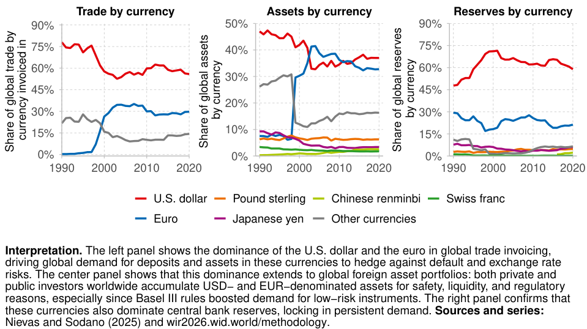

**----- Start of picture text -----** 
Trade by currency Assets by currency Reserves by currency 90% 50% 90% 75% 40% 75% 60% 60% 30% 45% 45% 20% 30% 30% 15% 10% 15% 0% 0% 0% 1990 2000 2010 2020 1990 2000 2010 2020 1990 2000 2010 2020 U.S. dollar Pound sterling Chinese renminbi Swiss franc Euro Japanese yen Other currencies Interpretation.  The left panel shows the dominance of the U.S. dollar and the euro in global trade invoicing, driving global demand for deposits and assets in these currencies to hedge against default and exchange rate risks. The center panel shows that this dominance extends to global foreign asset portfolios: both private and public investors worldwide accumulate USD−and EUR−denominated assets for safety, liquidity, and regulatory reasons, especially since Basel III rules boosted demand for low−risk instruments. The right panel confirms that these currencies also dominate central bank reserves, locking in persistent demand.  Sources and series: Nievas and Sodano (2025) and wir2026.wid.world/methodology. by currency  by currency currency invoiced in Share of global assets Share of global trade by  Share of global reserves **----- End of picture text -----** 

privilege translates into a continuous transfer of resources from poorer to richer countries. Far from narrowing gaps, financial globalization has increased them. This amounts to a modern form of unequal exchange: colonial powers once relied on resource extraction to transform deficits into surpluses; today, advanced economies achieve the same through excess yields. 

The burden falls on developing countries, reducing their capacity to invest in education, health, and infrastructure. By constraining human capital formation and fiscal space, the system limits their ability to reduce inequality across countries. Without structural reform, global inequality will persist. 

109 

Chapter 5. Exorbitant Privilege 

## **Figure 5.6. Poor countries finance the privilege through asymmetric portfolios** 

**----- Start of picture text -----** 
Decomposition of assets (A) and liabilities (L) **----- End of picture text -----** 

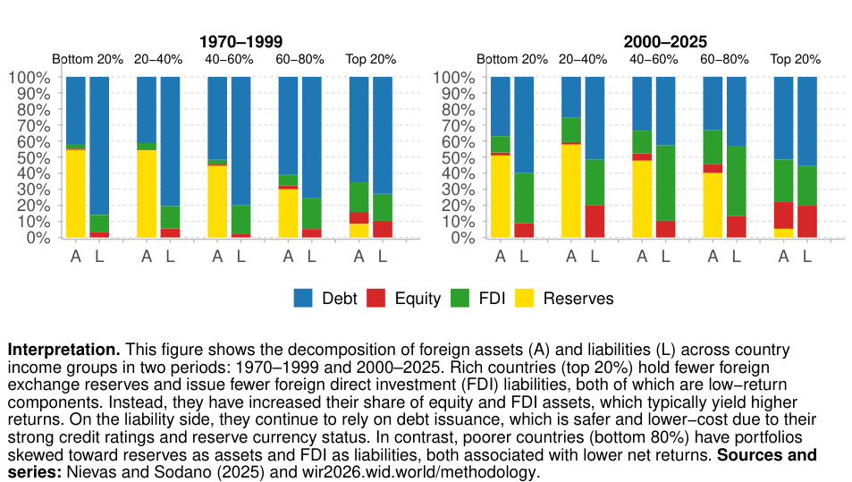

**----- Start of picture text -----** 
1970–1999 2000–2025 Bottom 20% 20−40% 40−60% 60−80% Top 20% Bottom 20% 20−40% 40−60% 60−80% Top 20% 100% 100% 90% 90% 80% 80% 70% 70% 60% 60% 50% 50% 40% 40% 30% 30% 20% 20% 10% 10% 0% 0% A L A L A L A L A L A L A L A L A L A L Debt Equity FDI Reserves Interpretation.  This figure shows the decomposition of foreign assets (A) and liabilities (L) across country income groups in two periods: 1970–1999 and 2000–2025. Rich countries (top 20%) hold fewer foreign exchange reserves and issue fewer foreign direct investment (FDI) liabilities, both of which are low−return components. Instead, they have increased their share of equity and FDI assets, which typically yield higher returns. On the liability side, they continue to rely on debt issuance, which is safer and lower−cost due to their strong credit ratings and reserve currency status. In contrast, poorer countries (bottom 80%) have portfolios skewed toward reserves as assets and FDI as liabilities, both associated with lower net returns.  Sources and series:  Nievas and Sodano (2025) and wir2026.wid.world/methodology. **----- End of picture text -----** 

**Figure 5.7. Poorer countries face lower asset returns and higher liability costs** 

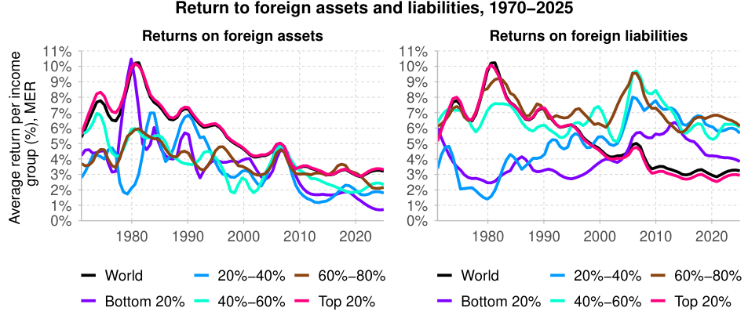

**----- Start of picture text -----** 
Return to foreign assets and liabilities, 1970−2025 Returns on foreign assets Returns on foreign liabilities 11% 11% 10% 10% 9% 9% 8% 8% 7% 7% 6% 6% 5% 5% 4% 4% 3% 3% 2% 2% 1% 1% 0% 0% 1980 1990 2000 2010 2020 1980 1990 2000 2010 2020 World 20%−40% 60%−80% World 20%−40% 60%−80% Bottom 20% 40%−60% Top 20% Bottom 20% 40%−60% Top 20%  group (%), MER Average return per income **----- End of picture text -----** 

**Interpretation.** These two panels compare the average return on foreign assets (left) and liabilities (right) across countries grouped by per capita income levels. The top 20% richest countries consistently achieve higher returns on their assets abroad, while facing lower average returns on their liabilities. In contrast, the bottom 80% of countries not only face lower returns on assets but also pay significantly higher returns on liabilities. Only the top 20% have managed to reduce liability costs significantly. All of this results in a positive return differential for the richest countries and a negative differential for poorer countries, structurally transferring income from poor to rich through global financial flows. **Sources and series:** Nievas and Sodano (2025) and wir2026.wid.world/methodology. 

110 

Chapter 5. Exorbitant Privilege 

## **Figure 5.8. Poorer countries can spend less on public services, exacerbating inequality** 

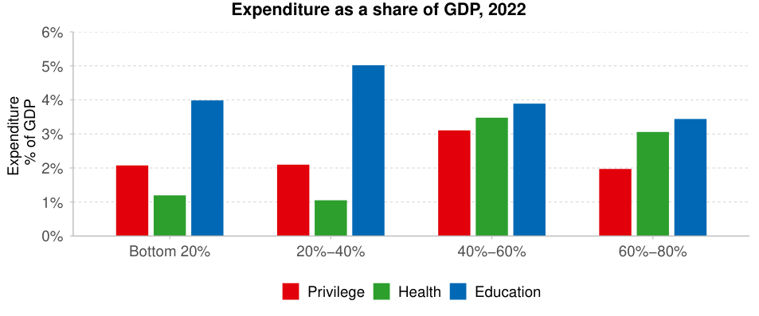

**----- Start of picture text -----** 
Expenditure as a share of GDP, 2022 6% 5% 4% 3% 2% 1% 0% Bottom 20% 20%−40% 40%−60% 60%−80% Privilege Health Education  % of GDP Expenditure **----- End of picture text -----** 

**Interpretation.** This figure illustrates the cost of the global “privilege” system for the bottom 80% of the income distribution in 2022. The red bars represent the share of GDP that each group effectively transfers to the top 20% richest countries through net income outflows (what can be seen as the cost of financing the privilege of the global top 20%). In many cases, these outflows are comparable to or even exceed the public investment these groups can make in health or education. For example, the 20%–40% group loses more in privilege outflows than it can allocate to health, a key driver of inequality reduction. This underscores how the bottom 80% bear a significant burden in sustaining global financial hierarchies, often at the expense of investments in their own human capital and exacerbating inequalities. **Sources and series:** Nievas and Sodano (2025). 

111 

Chapter 5. Exorbitant Privilege 

## **Figure 5.9. These structural asymmetries call for reforms in the international financial, trade, and monetary system** 

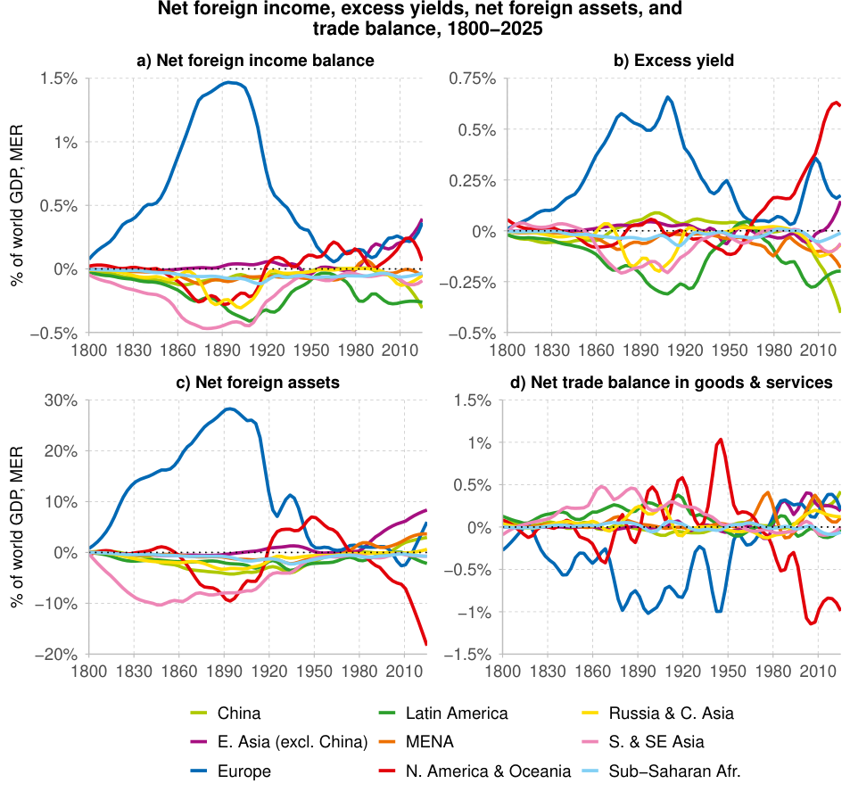

**----- Start of picture text -----** 
Net foreign income, excess yields, net foreign assets, and  trade balance, 1800−2025 a) Net foreign income balance b) Excess yield 1.5% 0.75% 0.5% 1% 0.25% 0.5% 0% 0% −0.25% −0.5% −0.5% 1800 1830 1860 1890 1920 1950 1980 2010 1800 1830 1860 1890 1920 1950 1980 2010 c) Net foreign assets d) Net trade balance in goods & services 30% 1.5% 1% 20% 0.5% 10% 0% 0% −0.5% −10% −1% −20% −1.5% 1800 1830 1860 1890 1920 1950 1980 2010 1800 1830 1860 1890 1920 1950 1980 2010 China Latin America Russia & C. Asia E. Asia (excl. China) MENA S. & SE Asia Europe N. America & Oceania Sub−Saharan Afr. % of world GDP, MER % of world GDP, MER **----- End of picture text -----** 

**Interpretation.** This figure illustrates the structural asymmetries in the global financial and trade system from 1800 to 2025, through four key indicators: (a) net foreign income balances, (b) excess yields on foreign wealth, (c) net foreign assets, and (d) net trade balances in goods and services, all expressed as a share of world GDP by region. During 1800–1914, European powers consistently ran large trade deficits while accumulating vast net foreign assets, thanks to colonial income inflows and excess returns on investments abroad. These income flows allowed Europe to increase its wealth without generating trade surpluses. In the post−colonial era (1970–2025), North America & Oceania replicate similar patterns: despite holding negative net foreign asset positions, they continue to receive positive income flows due to high excess yields. These long−run patterns highlight how global imbalances are shaped not simply by trade, but by power asymmetries, unequal exchange, and financial structures. **Notes.** Smoothed lines using a LOESS filter (span = 0.12) applied uniformly to annual series. **Sources and series:** Nievas and Piketty (2025), _World Historical Balance of Payments Database_ (wbop.world), and wir2026.wid.world/methodology. 

112 

Chapter 5. Exorbitant Privilege 

## Box 5.1: Exorbitant duty is not so exorbitant 

The table illustrates the performance of different country groups during the 2008–2009 global financial crisis. At first glance, the “exorbitant duty” narrative suggests that the richest economies were among those who absorbed the heaviest losses as the cost of providing safe assets to the rest of the world. Yet the evidence tells a different story. The top 20% recorded only modest losses in 2008 (3% of GDP) and quickly recovered with gains in 2009, leaving them essentially unchanged by the crisis. By contrast, the middle 40% of countries faced large and persistent losses in both years, making them the true losers. 

This evidence challenges the idea of a heavy “insurance burden” carried by the global rich. Their resilience stems from structural privilege: higher returns, safer liabilities, and the ability to bounce back swiftly. The so-called duty is episodic and modest, while the exorbitant privilege is enduring. 

## **Exorbitant duty is not so exorbitant** 

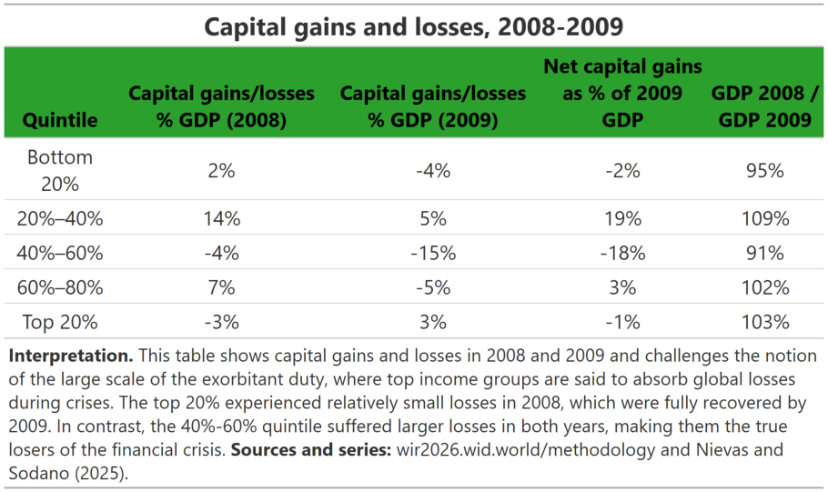

113 

Notes 

## **Notes** 

> 11BRICS is an acronym referring to a group of major emerging economies: Brazil, Russia, India, China, and South Africa. 

## **References** 

- Nievas, Gastón and Thomas Piketty (2025). “Unequal Exchange and North-South Relations: Evidence from Global Trade Flows and the World Balance of Payments 1800-2025”. In: _World Inequality Lab, Working Paper Series_ 2025/11. 

- Nievas, Gastón and Alice Sodano (2025). “Has the U.S. exorbitant privilege become a rich world privilege? Rates of return and foreign assets from a global perspective, 1970-2022”. In: _World Inequality Lab, Working Paper Series_ 2024/14. 

114 

# **CHAPTER 6** 

# **Climate, a Capital Problem** 

Chapter 6. Climate, a Capital Problem 

## **Contents of this chapter** 

|The carbon footprint of capital . . . . . . . . . . . . . . . . . . . . . . . . . . . . . . . **117**|
|---|
|Decarbonizing at home, burning fuels abroad? . . . . . . . . . . . . . . . . . . . . . . **120**|
|Climate change already shapes the distribution of private and public wealth . . . . . **120**|
|Climate policy and the future distribution of wealth . . . . . . . . . . . . . . . . . . . **122**|
|Main takeaways . . . . . . . . . . . . . . . . . . . . . . . . . . . . . . . . . . . . . . . **124**|

116 

Chapter 6. Climate, a Capital Problem 

Climate change is advancing at a pace that far exceeds early projections. By 2025, the remaining carbon budget compatible with limiting global warming to 1.5°C above pre-industrial levels is nearly exhausted (Forster et al. (2025)). The cumulative consequences of extreme climate events are becoming increasingly visible, affecting livelihoods, infrastructure, and economic stability worldwide. 

As the _Climate Inequality Report 2025_[12] shows, the climate crisis is unfolding in a world marked by profound economic inequality and highly concentrated wealth. These two dynamics are deeply intertwined. Wealthy individuals not only contribute disproportionately to global emissions but are also better shielded from the damages of climate shocks. They hold the financial, corporate, and political power to shape the pace and direction of the climate transition (see **Figure 6.1** ). 

Conversely, climate change and the policies designed to mitigate it are transforming how wealth is created, distributed, and preserved. The intensification of physical climate risks, the repricing of assets, and the reallocation of investments toward green sectors will have far-reaching implications for the global distribution of private and public wealth. This chapter examines how wealth fuels climate change and how, in turn, climate change reshapes wealth inequality. It introduces an ownership-based perspective on emissions that reveals how capital ownership concentrates the power to pollute, and the responsibility for climate damages, at the top of the wealth distribution. It then explores the economic and social channels through which climate change and climate policies alter the distribution of private and public assets. The climate crisis is also a capital crisis. To effectively address it, we must not only reduce emissions but also rethink how ownership, investment, and wealth are governed in the transition to a sustainable economy. 

## **The carbon footprint of capital** 

The unequal contribution of rich and poor countries to climate change is one of the most striking manifestations of global inequality. At the international level, the average carbon footprint of the top 10% income group in the United States—measured by emissions linked to their consumption—is more than forty times greater than that of the top 10% in Nigeria, and over 500 times greater than that of Nigeria’s bottom 10%. At the global level, a person in the global top 1% income group emits, on average, around seventy-five times more carbon per year than someone in the bottom 50% (Bruckner et al. (2022)). 

Most emission estimates traditionally attribute greenhouse gases to the final consumers of goods and services. This “consumption-based” approach highlights differences in lifestyle and consumption patterns. However, it overlooks another critical dimension of responsibility: capital ownership. 

While many consumers have limited ability to alter their consumption, due to constrained budgets, a lack of information, or limited access to alternatives, owners of productive assets actively decide how and where resources are invested. They directly benefit from the profits generated by emission-intensive industries. An ownership-based approach, therefore, assigns emissions from production to those who own the corresponding capital stock. 

Under this framework, an individual owning 50% of a company’s equity is attributed 50% of that firm’s emissions, whether directly or via intermediaries such as investment funds. Importantly, this approach does not allocate emissions generated directly by households, such as those from residential heating or private vehicle use, nor those linked to government consumption or capital ownership. The ownership-based approach discussed in this chapter only accounts for nearly 60% of global emissions that can be directly attributed to private capital ownership by individuals (Chancel and Rehm (2025a)). 

Accounting for emissions through this ownership lens reveals a high degree of 

117 

Chapter 6. Climate, a Capital Problem 

**Figure 6.1. Triple climate inequality: the poorest lose the most, contribute the least, and lack the means to act** 

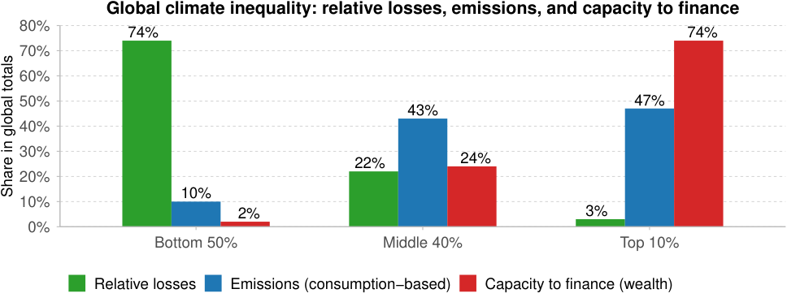

**----- Start of picture text -----** 
Global climate inequality: relative losses, emissions, and capacity to finance 80% 74% 74% 70% 60% 50% 47% 43% 40% 30% 22% 24% 20% 10% 10% 2% 3% 0% Bottom 50% Middle 40% Top 10% Relative losses Emissions (consumption−based) Capacity to finance (wealth) Share in global totals **----- End of picture text -----** 

**Interpretation.** The figure illustrates three dimensions of global climate inequality. Projected relative income losses from climate change are taken from Bothe et al. (2025). They represent percentage reductions in income compared with a business−as−usual scenario. The global bottom 50% concentrates 74% of these percentage reductions. The distribution of emissions is based on Bruckner et al. (2022). The distribution of wealth shares comes from WID (2025). Groups are defined by income for losses, by emitters for emissions, and by wealth for the wealth distribution, but all three distributions are highly correlated. For another paper on emissions inequalities by income groups, see Kartha et al. (2020), who find similar concentration levels. **Sources and series:** Bothe et al. (2025), Bruckner et al. (2022), and WID (2025). 

concentration. In France, Germany, and the United States, the carbon footprint of the wealthiest 10% is three to five times higher when private ownership–based emissions are included. In the United States, the top 10% accounts for 24% of consumption-based emissions but 72% of ownership-based emissions. The share of the top 1% rises from 6% (consumption-based) to nearly 43% (ownership-based). 

At the global scale, the contrast is even sharper. The top 1% accounts for 41% of all greenhouse gas emissions under ownership-based accounting, compared with 15% under the consumption approach. Conversely, the contribution of the bottom 50% drops from 10% to 3% ( **Figure 6.2** ). In other words, the average individual in the top 1% emits more than twenty-five times as much carbon as the global average citizen. Their share of emissions even exceeds their share of global wealth—estimated at 36% in 2022 (Chancel and Rehm (2025a)). 

The extreme concentration of private ownership–based emissions stems from both the amount of wealth owned 

and the investment choices made. Wealthy individuals not only hold larger asset portfolios but also allocate them disproportionately toward high-carbon sectors. 

As shown in **Figure 6.3** , every $1 million invested in business assets in the United States corresponds to roughly 143 tonnes of carbon emissions, compared with 75 tonnes for equities (Chancel and Rehm (2025a)). Similar patterns emerge in France and Germany. 

The global top 10% allocates about half of their wealth to such carbon-intensive holdings, often seeking higher-risk, higher-return investments that coincide with higher emissions. Hsu, Li, and Tsou (2023) find that high-emission companies yield, on average, 4.4 percentage points more in annual excess returns than low-emission peers—an implicit “pollution premium” that further incentivizes carbon-heavy investments. 

From this ownership perspective, the nature of emissions changes across the wealth distribution. For low- and 

118 

Chapter 6. Climate, a Capital Problem 

## **Figure 6.2. Emissions are highly concentrated among the rich, especially when looking at ownership** 

**Emissions shares by groups** 90% 80% ~~77%~~ 70% 60% 50% ~~43% 47%~~ 41% 40% 30% 20% 20% ~~15%~~ 10% 10% ~~3%~~ 0% Bottom 50% Middle 40% Top 10% Top 1% Consumption Private ownership **Interpretation.** The figure shows the share of global GHG emissions attributable to the bottom 50% and the top 1% of the world population. Emissions are separated into consumption−based (emissions from production attributed to final consumers) and ownership−based (scope 1 emissions from firms and assets owned by individuals). Private ownership−based emissions (representing around 60% of total emissions) do not include government−owned or direct household emissions. The total volume of emissions covered by the ownership−based approach is relatively close to that explicitly accounted for in the consumption−based approach presented here. The latter assumes that emissions associated with government activities and investments, typically representing 30%–40% of total emissions are distribution−neutral (Bruckner et al. (2022)). Groups are defined by consumption−based emissions and wealth respectively, but both distributions are highly correlated. **Sources and series:** Bruckner et al. (2022) and Chancel and Rehm (2025b). 

middle-income groups, nearly all emissions — are linked to essential consumption transportation, heating, or electricity. For the top 10%, and especially for the top 1%, emissions from capital ownership dominate, accounting for 75–95% of their total footprint in France, Germany, and the United States. This also means that the wealthiest have a far greater capacity to reduce emissions without compromising their living standards. 

Taking a global view, net ownership positions reveal how investors in high-income countries profit from pollution abroad. **Figure 6.4** shows that major European economies, Japan, and South Korea exhibit large positive net ownership-emission positions. In France, adjusting for international investment raises national emissions by 36%, reflecting the fact that French investors own polluting production facilities abroad whose emissions exceed those generated domestically by foreign-owned firms. 

of the emissions from their domestic production is ultimately attributable to foreign investors in richer countries. These patterns point to a crucial implication: climate regulations and taxation should take asset ownership into account. Evidently, stronger regulations on high-carbon investments are necessary. In addition, a carbon tax on wealth, based on the carbon content of owned assets or of investments, would arguably be significantly more progressive than a consumption-based levy. It would ensure that those who profit most from carbon-intensive activities, often across borders, contribute their fair share to the transition to a greener economy. 

By contrast, many middle- and low-income countries show negative net positions: part 

119 

Chapter 6. Climate, a Capital Problem 

## **Figure 6.3. Rich individuals own highly polluting business and financial assets** 

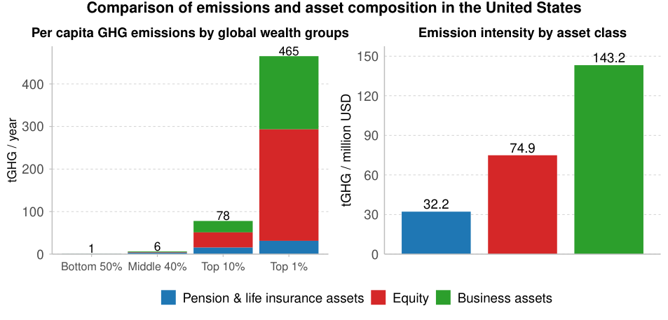

**----- Start of picture text -----** 
Comparison of emissions and asset composition in the United States Per capita GHG emissions by global wealth groups Emission intensity by asset class 465 150 143.2 400 120 300 90 74.9 200 60 32.2 100 78 30 1 6 0 0 Bottom 50% Middle 40% Top 10% Top 1% Pension & life insurance assets Equity Business assets tGHG / year tGHG / million USD **----- End of picture text -----** 

**Interpretation.** This figure shows the emission intensities of different asset groups in the U.S. in 2019 and the asset composition of different wealth groups in 2022. Note that housing assets are excluded because their ownership−based emission intensity is very low: (i) heating emissions are counted as direct household emissions rather than private−ownership emissions, and (ii) construction−phase emissions are attributed to the owners of construction firms. **Sources and series:** Chancel and Rehm (2025a). 

## **Decarbonizing at home, burning fuels abroad?** 

By focusing on investment in carbon-intensive activities, we can also bring to light current global contradictions. Even as many countries pledge to decarbonize domestically, capital continues to flow into fossil-fuel extraction abroad. This investment pattern is not accidental: it reflects the concentration of financial power among wealthy investors and corporations that operate across borders. 

In 2025, global capital flowing into fossil fuel projects still amounts to approximately USD 1.1 trillion. "Clean" energy, including renewables, electricity grids, storage, and low- emission technologies, at the same time receives USD 2.2 trillion, or roughly twice as much as fossil fuels. Government policies have reinforced these trends. In response to the recent energy price spikes, fossil-fuel consumer subsidies tripled between 2020 and 2022. The environmental consequences of these investments are staggering. Fossil-fuel projects destroy ecosystems, pollute water and air, and displace communities (Shamoon 

et al. (2022)). More importantly, they lock in future emissions: most facilities are designed to operate for twenty to forty years, delaying the transition to clean energy. 

**Figure 6.5** illustrates the scale of the challenge. The potential emissions from fossil-fuel reserves currently in development or exploration are, by themselves, sufficient to deplete the carbon budget that would limit warming to 1.7°C . These emissions would come in addition to those from existing extraction sites. 

Despite this, fossil-fuel projects remain financially attractive. As the International Energy Agency (2025) notes, investment in new oil, gas, and coal projects continues to rise, driven by short-term returns that overshadow long-term planetary costs. 

## **Climate change already shapes the distribution of private and public wealth** 

The economic impacts of climate change are deeply unequal. Both between and within countries, poorer households and nations bear the heaviest burden. Global 

120 

Chapter 6. Climate, a Capital Problem 

## **Figure 6.4. High-income countries are net-importers of wealth-related emissions** 

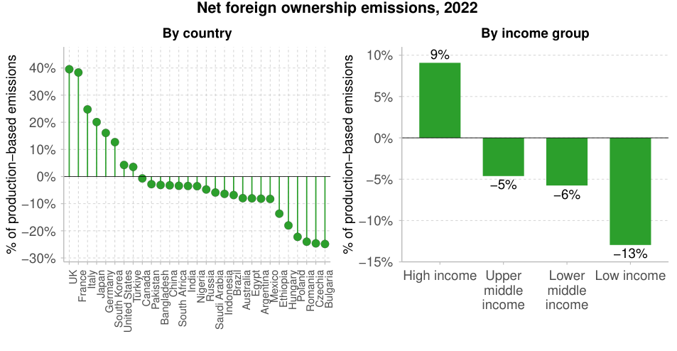

**----- Start of picture text -----** 
Net foreign ownership emissions, 2022 By country By income group 10% 9% 40% 30% 5% 20% 0% 10% 0% −5% −5% −6% −10% −10% −20% −13% −30% −15% High income Upper Lower Low income middle middle income income % of production−based emissions % of production−based emissions UK France ItalyJapanGermanySouth Korea United States TürkiyeCanada Pakistan BangladeshChina South Africa India NigeriaRussia Saudi Arabia Indonesia Brazil Australia EgyptArgentinaMexico EthiopiaHungaryPoland Romania Czechia Bulgaria **----- End of picture text -----** 

**Interpretation.** This figure shows the net ownership of CO2 emissions in selected countries and four country groups in 2022 as a share of the country’s / country group’s production−based emissions. **Sources and series:** Chancel and Rehm (2025b). 

warming and associated extreme events disproportionately affect low-income populations due to higher exposure, greater vulnerability, and more limited capacity to adapt (Alizadeh et al. (2022); Burke, Hsiang, and Miguel (2015); Kalkuhl and Wenz (2020)). 

Between 1961 and 2010, anthropogenic climate change is estimated to have widened the income gap between the world’s richest and poorest countries by roughly 25% compared with a scenario without climate change (Diffenbaugh and Burke (2019)). Within countries, the poorest households are more likely to live in areas exposed to environmental hazards and are less protected from their effects (Gilli et al. (2024); Palagi et al. (2022)). 

At the global level, the bottom 50% of the population could bear up to 75% of total relative climate damages by 2050 (Bothe et al. (2025)). While absolute losses are higher in richer households, simply because they earn and own more, the relative impact on income and assets is vastly greater for poorer groups ( **Figure 6.6** ). A single 

flood, drought, or storm can erase years of accumulated savings, while for the wealthy, such shocks typically represent temporary financial setbacks. 

Beyond income, the climate crisis affects nearly every form of wealth. Physical assets, such as housing, land, and infrastructure, are vulnerable to floods, storms, fires, and heat. Market evidence already shows declining property values in high-risk areas (Baldauf, Garlappi, and Yannelis (2020); Bosker et al. (2019)). Between 2020 and 2023, climate-related disasters caused an estimated €162 billion in asset losses across the European Union, roughly equivalent to the entire EU annual budget (EEA (2024)). 

In developing countries, the impacts are far more devastating. The 2022 Pakistan floods caused damages worth about $40 billion (Mishra (2025)). Overall, 89% of the world’s flood-exposed population lives in low- and middle-income countries (Rentschler, Salhab, and Jafino (2022)). 

Wealthier households are not immune, but they are better protected. They can diversify assets, relocate, or rely on insurance 

121 

Chapter 6. Climate, a Capital Problem 

**Figure 6.5. Planned new oil, gas, and coal extraction alone could exhaust the 1.7°C carbon budget** 

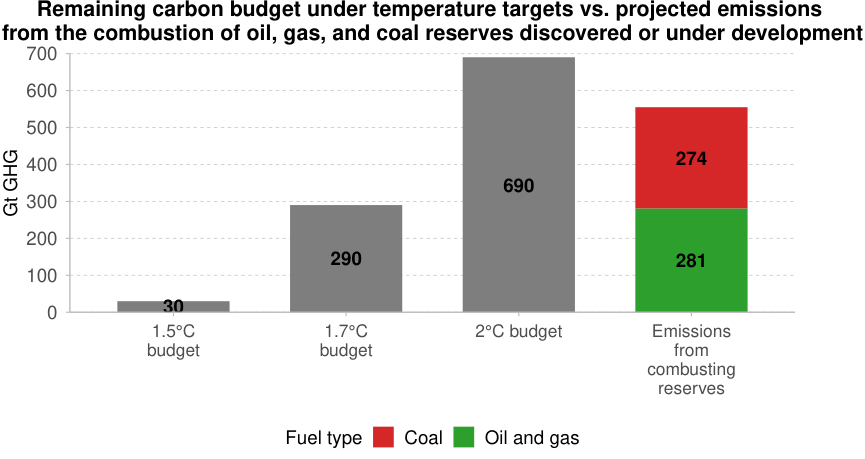

**----- Start of picture text -----** 
Remaining carbon budget under temperature targets vs. projected emissions from the combustion of oil, gas, and coal reserves discovered or under development 700 600 500 274 400 690 300 200 290 281 100 0 30 1.5°C 1.7°C 2°C budget Emissions budget budget from combusting reserves Fuel type Coal Oil and gas Gt GHG **----- End of picture text -----** 

**Interpretation.** This figure compares the carbon budgets for different temperature targets with the potential emissions from burning all oil and gas reserves that have been discovered (474), are under exploration (5), or in development (204), as well as coal reserves that are currently proposed (870). **Sources and series:** EPA (2024), Forster et al. (2025), Global Energy Monitor (2025a, 2025c). 

and public compensation. In contrast, poorer households hold most of their wealth in housing and deposits, making them highly vulnerable to physical loss. 

Insurance and public safety nets could mitigate these risks, but coverage remains highly uneven. Three in four people in low-income countries lack any form of social protection (World Bank (2025)). Even in high-income economies, only about 35% of climate-related losses are insured (EEA (2024)). 

Climate change also exerts growing pressure on public wealth. At the municipal level, recurrent disasters erode property tax bases. In Florida, for instance, more than half of local governments are projected to be affected by sea-level rise by the end of the century, with 30% of their revenues derived from properties at risk of chronic flooding (Shi et al. (2023)). 

National governments face rising fiscal pressures from reconstruction spending, emergency aid, and social protection. In the Caribbean, hurricanes have repeatedly driven spikes in public debt, 

while in the Middle East & North Africa, higher temperatures are associated with deteriorating fiscal balances (Giovanis and Ozdamar (2022); Mejia (2014)). 

Financial markets increasingly price climate risk into sovereign borrowing costs, making it more expensive for vulnerable countries to access credit. This dynamic can create a vicious cycle: the countries most in need of financing for adaptation and mitigation face the highest interest rates (Cappiello et al. (2025)). Over time, the erosion of both private and public wealth may further constrain governments’ ability to invest in climate resilience and public goods—deepening the inequality gap between those with the means to adapt and those without. **Climate policy and the future distribution of wealth** 

The coming decades will not only test the world’s capacity to reduce emissions, they will also redefine how wealth is distributed. Climate policy design will 

122 

Chapter 6. Climate, a Capital Problem 

## **Figure 6.6. Relative climate losses are highly concentrated among the global bottom 50%** 

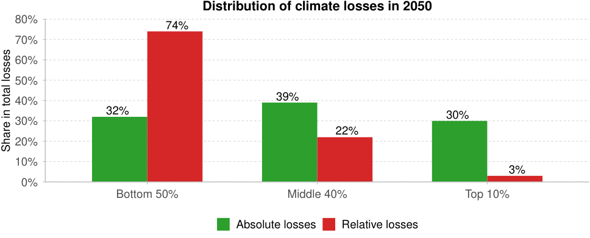

**----- Start of picture text -----** 
Distribution of climate losses in 2050 80% 74% 70% 60% 50% 39% 40% 32% 30% 30% 22% 20% 10% 3% 0% Bottom 50% Middle 40% Top 10% Absolute losses Relative losses Share in total losses **----- End of picture text -----** 

**Interpretation.** This figure illustrates the projected distribution of climate damages in 2050. Absolute losses refer to total monetary damages from climate change compared with a business−as−usual (BAU) scenario, while relative losses indicate the percentage reduction in income relative to that scenario. Countries projected to benefit from climate change are not included. BAU projections of global post−tax income in 2050 combine SSP2 −Shared Socioeconomic Pathways (SSPs)−national income projections with historic within−country inequality trends. Climate damage is allocated between countries following Nath et al. (2024), and within countries following Gilli et al. (2024). **Sources and series:** Bothe et al. (2025). 

determine whether the net-zero transition becomes an opportunity to reduce inequality or a source of new disparities. 

Market-based instruments, such as carbon taxes, can be regressive if poorly designed. In high-income countries, evidence shows that low-income households spend a larger share of their income on carbon-intensive goods, making them more vulnerable to price increases (Ohlendorf et al. (2021)). Compensation mechanisms, such as cash transfers or free energy quotas, are therefore crucial to ensure fairness. 

Another major challenge lies in asset stranding. The accelerated phase-out of high-carbon infrastructure and industries implies that some assets will lose much of their value. Under a 1.5°C scenario, the upstream oil and gas sector alone could lose between $7 and 12 trillion in value (Jakob and Semieniuk (2023)). While most stranded assets are owned by wealthy investors in the Organisation for Economic Co-operation and Development (OECD ) countries, these losses represent only about 0.4% of their net worth (Semieniuk et al. (2022)), a tiny 

dent in their total wealth. 

Public wealth, however, is more directly at risk. Governments own roughly one-third of the assets exposed to stranding, particularly in non-OECD countries (Semieniuk et al. (2022)). If public entities or development banks absorb these losses, fiscal space could shrink dramatically. Moreover, climate-related financial instability could lead to public bailouts, effectively transferring private losses onto taxpayers (Lamperti et al. (2019)). 

Governments also face litigation risks through investor–state dispute settlements. If fossil-fuel projects protected by international treaties are canceled to meet climate targets, affected investors can sue for compensation. Potential claims from such disputes could reach $60–230 billion (Tienhaara et al. (2022)). At the same time, the financing and ownership structure of green investments will shape tomorrow’s wealth distribution. The global transition to net zero will require an estimated $266 trillion in cumulative investment by 2050 (Buchner et 

123 

Chapter 6. Climate, a Capital Problem 

## **Figure 6.7. Climate investments could raise the top 1% wealth share by 6 percentage points by 2050** 

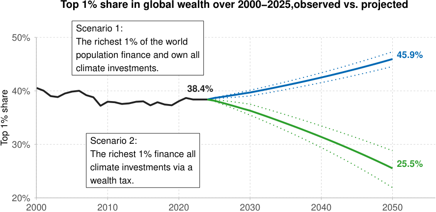

**----- Start of picture text -----** 
Top 1% share in global wealth over 2000−2025,observed vs. projected Scenario 1: 50% The richest 1% of the world population finance and own all 45.9% climate investments. 40% 38.4% Scenario 2: 30% The richest 1% finance all 25.5% climate investments via a wealth tax. 20% 2000 2010 2020 2030 2040 2050 Top 1% share **----- End of picture text -----** 

**Interpretation.** This figure shows possible dynamics of the global top 1% wealth share if the top 1% owns all required climate investments (Scenario 1) and if all these investments are financed by a wealth tax on the top 1% (Scenario 2). The dotted lines represent uncertainty about projected investment needs. **Sources and series:** Chancel et al. (2025). 

al. (2023))—a fivefold increase from current levels. 

**Figure 6.7** illustrates two possible scenarios: if the richest 1% finance and own all new climate investments, their global wealth share could rise from 38% today to 46% by 2050. Conversely, if these investments are publicly financed and collectively owned, the top 1% share could decline to 26%. 

The implications for public capital are equally significant. If the public sector undertakes and owns all required climate investments, public capital could rise from around 80% of GDP in 2019 to over 150% by 2050 ( **Figure 6.8** ). If private investors capture these opportunities instead, the private capital stock could climb to 245% of GDP, while public capital remains stagnant. The distributional consequences of the green transition therefore depend not only on climate ambition but also on who owns the transition. Public policies that promote equitable financing, transparent ownership, and redistribution of green returns are essential to ensure that the path toward 

sustainability does not widen global wealth divides. 

## **Main takeaways** 

Wealth and climate change are bound together by powerful feedback loops. The wealthiest individuals not only consume more but also own and profit from the assets that generate the majority of greenhouse gas emissions. When emissions are attributed through ownership rather than consumption, inequality appears even starker: the global top 1% account for over 40% of emissions, while the bottom half contribute almost none. This concentration of both economic and environmental power shapes how societies confront the climate crisis. Capital continues to flow into fossil-fuel production, locking in decades of future emissions, even as wealthy countries pledge to decarbonize. At the same time, the poorest populations, those least responsible, face the heaviest relative losses from climate impacts. 

Climate change also redistributes wealth. 

124 

Chapter 6. Climate, a Capital Problem 

**Figure 6.8. If financed entirely by private actors, climate investments could almost double the global private capital-to-GDP ratio by 2050** 

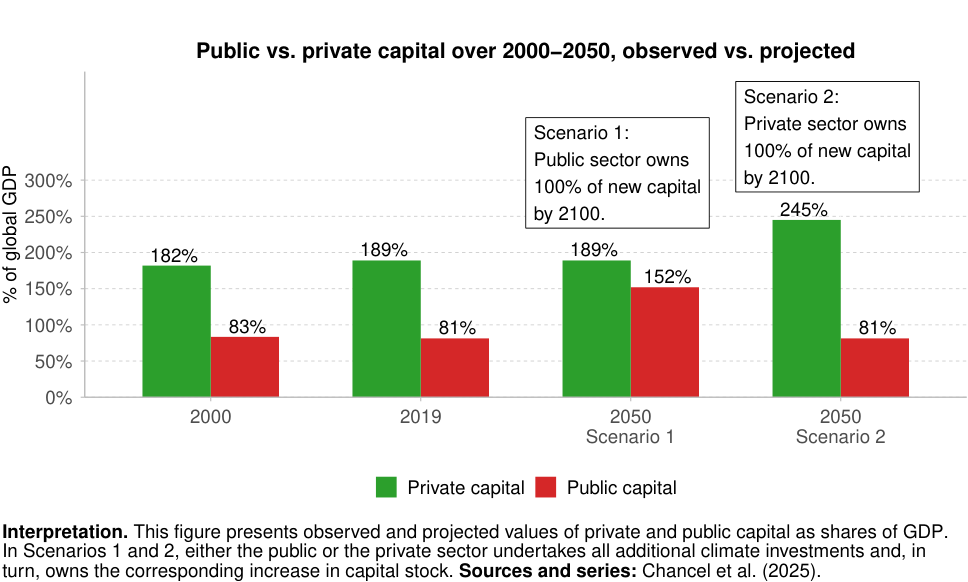

**----- Start of picture text -----** 
Public vs. private capital over 2000−2050, observed vs. projected Scenario 2: Private sector owns Scenario 1: Public sector owns 100% of new capital 300% by 2100. 100% of new capital 245% 250% by 2100. 200% 182% 189% 189% 152% 150% 100% 83% 81% 81% 50% 0% 2000 2019 2050 2050 Scenario 1 Scenario 2 Private capital Public capital Interpretation.  This figure presents observed and projected values of private and public capital as shares of GDP. In Scenarios 1 and 2, either the public or the private sector undertakes all additional climate investments and, in turn, owns the corresponding increase in capital stock.  Sources and series:  Chancel et al. (2025). % of global GDP **----- End of picture text -----** 

It erodes private and public assets through physical damages, rising debt, and lower fiscal capacity, while green investments and asset repricing can further widen or reduce inequality, depending on who owns and determines the rules of the net-zero transition. A privately financed net-zero pathway would almost certainly reinforce global concentrations of wealth, whereas public investment and progressive taxation could transform the transition into a lever for equity. 

a crucial opportunity to address another deeply entrenched form of inequality. 

The findings of this chapter point to a central conclusion: the climate crisis is a capital crisis. Effective climate action demands of us that we rethink investment regulations, ownership structures, and the taxation of capital. Policies such as restrictions on new fossil-fuel investments, progressive wealth taxes imposing an effective carbon penalty, and the expansion of public ownership of climate assets can accelerate the transition and help to reduce wealth inequalities. If we fail to design climate policies that tackle the distribution of capital and ownership patterns, we will miss 

125 

Notes 

## **Notes** 

12See Chancel and Mohren (2025). 

## **References** 

- Alizadeh, Mohammad Reza et al. (2022). “Increasing heat-stress inequality in a warming climate”. In: _Earth’s Future_ 10.2, e2021EF002488. 

- Baldauf, Markus, Lorenzo Garlappi, and Constantine Yannelis (2020). “Does climate change affect real estate prices? Only if you believe in it”. In: _The Review of Financial Studies_ 33.3, pp. 1256–1295. 

- Bosker, Maarten et al. (2019). “Nether Lands: Evidence on the price and perception of rare natural disasters”. In: _Journal of the European Economic Association_ 17.2, pp. 413–453. 

- Bothe, Philipp et al. (2025). “Global Income Inequality by 2050: Convergence, Redistribution, and Climate Change”. In: _World Inequality Lab Working Paper_ 2025/10. 

- Bruckner, Benedikt et al. (2022). “Impacts of poverty alleviation on national and global carbon emissions”. In: _Nature Sustainability_ 5.4, pp. 311–320. 

- Buchner, Barbara et al. (2023). “Global Landscape of Climate Finance 2023”. In: _Climate Policy Initiative_ . 

- Burke, Marshall, Solomon M. Hsiang, and Edward Miguel (2015). “Global non-linear effect of temperature on economic production”. In: _Nature_ 527.7577, pp. 235–239. 

- Cappiello, Lorenzo et al. (2025). “Creditworthy: do climate change risks matter for sovereign credit ratings?” In: _European Central Bank, Working Paper 3042_ . 

- Chancel, Lucas, Philipp Bothe, and Gregor Semieniuk (2025). “Climate change and the global distribution of wealth”. In: _Nature Climate Change_ , 15.4, pp. 364–374. 

- Chancel, Lucas and Cornelia Mohren (2025). “Climate Inequality Report 2025, Climate Change: A Capital Challenge. Why Climate Policy Must Tackle Ownership”. In: _World Inequality Lab (WIL)_ . 

- Chancel, Lucas and Yannic Rehm (2023). _The Carbon Footprint of Capital: Evidence from France, Germany and the U.S. based on Distributional Environmental Accounts_ . `https://halshs.archives-ouvertes.fr/halshs-04 423785` . 

- (2025a). “Accounting for the Carbon Footprint of Capital Ownership Advances the Understanding of Emission Inequality”. In: _Climatic Change_ , 178, art. 211. 

- (2025b). “Global inequalities in ownership-based carbon footprints over 2010-2022”. In: _World Inequality Lab, Working Paper Series_ 2025/19. 

- Diffenbaugh, Noah S and Marshall Burke (2019). “Global warming has increased global economic inequality”. In: _Proceedings of the National Academy of Sciences_ 116.20, pp. 9808–9813. 

- EEA (Oct. 2024). _Economic Losses from Weather- and Climate-Related Extremes in Europe_ . Online indicator, European Environment Agency. Accessed: 2025-08-08. 

URL: `https://www.eea.europa.eu/en/analysis/ind icators/economic-losses-from-climate-related` . 

- EPA (2024). _Inventory of U.S. Greenhouse Gas Emissions and Sinks: 1990–2022 – Annex 2: Methodology and Data for Estimating CO Emissions from Fossil Fuel Combustion_ . Accessed: 2025-09-25. URL: `https://www.epa.gov/s ystem/files/documents/2024-04/us-ghg-inventor y-2024-annex-2-emissions-fossil-fuel-combust ion.pdf` . 

- Forster, P. M. et al. (2025). “Indicators of Global Climate Change 2024: annual update of key indicators of the state of the climate system and human influence”. In: _Earth System Science Data_ 17.6, pp. 2641–2680. DOI: `10.5194/essd-17-2641-2025` . URL: `https://essd.c opernicus.org/articles/17/2641/2025/` . 

- Gilli, Martino et al. (2024). “Climate change impacts on the within-country income distributions”. In: _Journal of Environmental Economics and Management_ 127, p. 103012. ISSN: 0095-0696. DOI: `https : / / do i . org / 10 . 1016 / j . jeem . 2024 . 103012` . URL: `https://www.sciencedirect.com/science/article /pii/S009506962400086X` . 

- Giovanis, Eleftherios and Oznur Ozdamar (2022). “The impact of climate change on budget balances and debt in the Middle East and North Africa (MENA) region”. In: _Climatic change_ 172.3, p. 34. 

- Global Energy Monitor (July 2025a). _Global Coal Mine Tracker_ . `https://globalenergymonitor.org` . Dataset release by Global Energy Monitor, July 2025 release. 

- — (Oct. 2025b). _Global Energy Ownership Tracker_ . `https: //globalenergymonitor.org/projects/global-ene rgy-ownership-tracker/` . Accessed: 2025-10-09. 

- — (Feb. 2025c). _Global Oil and Gas Extraction Tracker_ . `htt ps://globalenergymonitor.org` . Dataset release by Global Energy Monitor, February 2025 release. 

- Hsu, Po-Hsuan, Kai Li, and Chi-Yang Tsou (2023). “The Pollution Premium”. In: _Journal of Finance_ , 78.3, pp. 1343–1392. DOI: `10.2139/ssrn.3578215` . 

- International Energy Agency (2025). _World Energy Investment 2025 Datafile_ . Data Product. Paris: International Energy Agency. URL: `https://www.iea .org/data- and- statistics/data- product/worl d - energy - investment - 2024 - datafile` (visited on 08/19/2025). 

- Jakob, Michael and Gregor Semieniuk (2023). “Stranded assets and implications for financial markets”. In: _Encyclopedia of Monetary Policy, Financial Markets, Climate Change, and Banking (forthcoming)_ . 

- Kalkuhl, Matthias and Leonie Wenz (2020). “The impact of climate conditions on economic production. Evidence from a global panel of regions”. In: _Journal of Environmental Economics and Management_ 103, p. 102360. 

- Kartha, Sivan et al. (2020). “The carbon inequality era”. In: _Op. cit. Dataset:_ 

- Lamperti, Francesco et al. (2019). “The public costs of climate-induced financial instability”. In: _Nature Climate Change_ 9.11, pp. 829–833. 

126 

Notes 

- Mejia, Sebastian Acevedo (2014). _Debt, growth and natural disasters a Caribbean trilogy_ . International Monetary Fund. 

- Mishra, Vibhu (July 2025). _Pakistan Reels Under Monsoon Deluge as Death Toll Climbs_ . UN News. Accessed: 2025-08-09. URL: `https://www.un.org/sustainabl edevelopment/blog/2025/07/pakistan-reels-unde r-monsoon-deluge-as-death-toll-climbs/` . 

- Nath, Ishan, Valerie Ramey, and Peter Klenow (2024). “How Much Will Global Warming Cool Global Growth?” In: DOI: `10.3386/w32761` . URL: `http://www.nber.org/p apers/w32761.pdf` (visited on 09/17/2024). 

- Ohlendorf, Nils et al. (2021). “Distributional impacts of carbon pricing: A meta-analysis”. In: _Environmental and Resource Economics_ 78, pp. 1–42. 

- Palagi, Elisa et al. (2022). “Climate change and the nonlinear impact of precipitation anomalies on income inequality”. In: _Proceedings of the National Academy of Sciences_ 119.43, e2203595119. 

- Rentschler, Jun, Melda Salhab, and Bramka Arga Jafino (2022). “Flood exposure and poverty in 188 countries”. In: _Nature communications_ 13.1, p. 3527. 

- Semieniuk, Gregor et al. (2022). “Stranded fossil-fuel assets translate to major losses for investors in advanced economies”. In: _Nature Climate Change_ 12.6, pp. 532–538. 

- Shamoon, Ahmad et al. (2022). “Environmental impact of energy production and extraction of materials - a review”. In: _Materials Today: Proceedings_ 57. Third International Conference on Aspects of Materials Science and Engineering, pp. 936–941. ISSN: 2214-7853. DOI: `https://doi.org/10.1016/j.matp r.2022.03.159` . 

- Shi, Linda et al. (Oct. 2023). _Climate Change Is a Fiscal Disaster for Local Governments – Our Study Shows How It’s Testing Communities in Florida_ . PreventionWeb (UNDRR). Accessed: 2025-08-08. URL: `https://www .preventionweb.net/news/climate-change-fiscal -disaster-local-governments-our-study-showshow-its-testing-communities` . 

- Tienhaara, Kyla et al. (May 2022). “Investor-state disputes threaten the global green energy transition”. In: _Science_ 376, pp. 701–703. DOI: `10.1126/science.abo4637` . 

- WID (2025). _World Inequality Database_ . `https://wid.worl d` . Accessed: 2025-10-01. 

- World Bank (Oct. 2025). _Oil rents (% of GDP) — Denmark and Norway_ . `https://data.worldbank.org/indicator /NY.GDP.PETR.RT.ZS?locations=NO-DK` . Accessed: 2025-10-14. 

127 

# **CHAPTER 7** 

# **Global Taxation of Multi-millionaires** 

Chapter 7. Global Taxation of Multi-Millionaires 

## **Contents of this chapter** 

|**tents of this chapter**||
|---|---|
|Why progressive taxation matters . . . . . . . . .|. . . . . . . . . . . . . . . . . . . . **130**|
|Regressivity at the top . . . . . . . . . . . . . . . .|. . . . . . . . . . . . . . . . . . . . **131**|
|Safeguarding progressivity at the top . . . . . . .|. . . . . . . . . . . . . . . . . . . . **132**|
|Tax justice and the potential of a global wealth tax|. . . . . . . . . . . . . . . . . . . **133**|
|Coordination between countries strengthens the feasibility of reducing tax evasion||
|and avoidance . . . . . . . . . . . . . . . . .|. . . . . . . . . . . . . . . . . . . . **135**|
|Main takeaways . . . . . . . . . . . . . . . . . . .|. . . . . . . . . . . . . . . . . . . . **136**|
|Box 7.1: Explore the_Global Wealth Tax Simulator_|. . . . . . . . . . . . . . . . . . . . **140**|

129 

Chapter 7. Global Taxation of Multi-Millionaires 

Wealth concentration has reached historic levels. Today, a few thousand multi-millionaires and billionaires command fortunes comparable to the annual incomes of entire countries. This raises a pressing question: are tax systems ensuring that those with the greatest means contribute their fair share to society? The evidence shows that they are not. In many countries, effective tax rates decline at the very top of the distribution. While middleand upper-middle-income groups face stable or rising rates, the richest often pay proportionally less. This chapter examines these issues. First, we explore why progressive taxation matters, showing its role in financing growth, reducing inequality, and safeguarding democracy. We then document regressivity at the top, where the wealthiest contribute proportionally less than lower-income households. Next, we consider how a minimum wealth tax could restore progressivity or at least prevent regressivity and raise the revenues necessary to decrease inequality. Finally, we highlight that international cooperation can increase the feasibility of reducing tax evasion in a world of mobile capital. 

## **Why progressive taxation matters** 

A government with greater resources can invest more in public goods and productive projects that increase the well-being and opportunities of the population. Furthermore, taxes are not simply a way of raising revenue; they are one of the principal means for societies to determine who contributes to collective life and how. In a progressive tax system, higher-income and wealthier groups contribute proportionally more. Progressive tax systems mobilize resources for public goods, reduce inequality, strengthen the legitimacy of tax systems by ensuring fairness, and limit the disproportionate political influence that extreme wealth can buy. – **Figure 2.14 Figure 2.16** in **Chapter 2** show why progressive taxation is important for redistribution. First, it can directly reduce inequality by securing larger contributions from those at the top. Second, it makes possible the funding of public goods, such as education, health, and social protection, 

which are key for reducing inequality (see Gethin (2023)) since they deliberately shift resources toward the middle and bottom of the distribution. Without progressive taxation, income gaps translate directly into unequal living standards. 

A fairer tax system is also a more sustainable one. When citizens believe that everyone contributes according to their means, they are more willing to pay taxes and less likely to resist redistributive policies. This sense of tax consent is essential to sustaining social cohesion. Conversely, when households perceive that the wealthy can avoid or evade taxation while the burden falls disproportionately on them, resistance grows. Progressive taxation strengthens trust in government by making the system visibly fair: taxpayers see schools, hospitals, or infrastructure financed by collective contributions, and they see that the richest are not exempt. This legitimacy effect has profound implications for political stability. 

Finally, **Figure 7.1** highlights a way that unchecked wealth concentration can distort democracy (see Cagé (2024)). The top 0.01% in the United States now account for over 20% of charitable donations, steering much of philanthropy toward elite institutions or causes aligned with donors’ preferences. In France and South Korea, the richest 10% provide more than half of political donations. These patterns underscore how extreme wealth translates into political and cultural influence, undermining the principle of equal citizenship. Progressive taxation reduces these distortions by ensuring that great fortunes are less valuable as tools of political power. 

Progressive taxation is not only a way to increase public revenue. It is also a mechanism to directly reduce inequality, fund redistributive public goods, foster social cohesion, promote economic growth, and safeguard the integrity of democratic representation. 

130 

Chapter 7. Global Taxation of Multi-Millionaires 

## **Figure 7.1. A more progressive tax system is needed in order to reduce political capture by the very rich** 

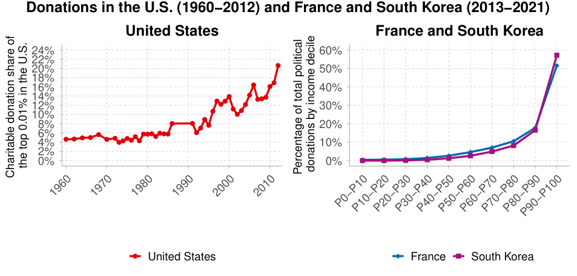

**----- Start of picture text -----** 
Donations in the U.S. (1960−2012) and France and South Korea (2013−2021) United States France and South Korea 24% 60% 22% 20% 50% 18% 16% 40% 14% 12% 30% 10% 8% 20% 6% 4% 10% 2% 0% 0% United States France South Korea 1960 1970 1980 1990 2000 2010 P0−P10P10−P20P20−P30P30−P40P40−P50P50−P60P60−P70P70−P80P80−P90P90−P100 the top 0.01% in the U.S. Charitable donation share of  Percentage of total political   donations by income decile **----- End of picture text -----** 

**Interpretation.** Private giving is increasingly concentrated at the top. In the U.S., the top 0.01% have starkly increased their share of charitable contributions since 1960, reaching more than 20% in 2012. In France and South Korea (2013–2021), political donations are dominated by the richest 10% who donate much more than any other income group. These patterns suggest rising top−end inequality translates into unequal influence over philanthropy and politics. **Sources and series:** Cagé (2024). 

## **Regressivity at the top** 

One of the most important facts highlighted in this report is that tax progressivity breaks down precisely where it should matter most: at the very top of the distribution. While tax systems are designed to appear progressive, effective rates often fall sharply for multi-millionaires and billionaires once we compare total taxes paid against their full economic income. Large parts of top incomes escape taxation. 

**Figure 7.2** illustrates one of the main paradoxes of modern tax systems: while tax codes in high-income countries are often designed to be progressive, they become regressive at the very top of the distribution (see Zucman (2024)). Regressivity emerges because the income tax fails at the top. In France and the Netherlands, billionaires’ effective income tax rate drops to near zero because of tax avoidance. In the United States, anti-avoidance rules keep billionaire rates somewhat higher, but they still fall sharply compared to upper-middle groups. Tax avoidance primarily operates through two channels (see Alstadsæter et al. (2023) 

and Zucman (2024)): (i) delaying or avoiding dividend distributions and capital gains realizations, and (ii) using holding companies and similar legal structures to accumulate earnings tax-free. **Figure 7.3** situates this regressivity in historical perspective. Over the past three decades, global multi-millionaire wealth has soared, tripling relative to world income (see Alstadsæter et al. (2023)). In 1995, the global top 0.001% held assets equivalent to 12% of global income. Three decades later, their share has nearly tripled, reaching 33% by 2025. Put differently, about sixty thousand individuals now control wealth worth one-third of the world’s combined income. Tax systems meant to fund public goods and reduce inequality instead reinforce concentration at the very top. Unless corrected, regressivity at the top will continue to erode both fiscal capacity and democratic cohesion. 

131 

Chapter 7. Global Taxation of Multi-Millionaires 

**Figure 7.2. The super-rich pay proportionately less than others** 

**----- Start of picture text -----** 
Effective income tax rates by income groups 25% 20% 99% of the population are located in the shaded area. 15% 10% 5% 0% Brazil France Netherlands Spain United States P0−10P10−20P20−30P30−40P40−50P50−60P60−70P70−80P80−90P90−95P95−99P99−99.9P99.9−99.99P99.99−P99.999P99.999−P99.9999Billionaires income) income groups  and for   billionaires (% of pre−tax Effective income tax rates by **----- End of picture text -----** 

**Interpretation.** This figure shows effective income tax rates by pre−tax income group and for U.S. dollar billionaires in Brazil, France, the Netherlands, Spain, and the United States. Income tax rates include only individual income taxes and equivalent levies. All values are expressed as a share of pre−tax income, defined as all national income before taxes and transfers, after pensions. P0−10 denotes the bottom 10% of the income distribution, P10−20 the next decile, etc. **Sources and series:** Artola et al. (2022), Bozio et al. (2024), Bozio et al. (2020), Bruil et al. (2024), Palomo et al. (2025), Saez and Zucman (2019), and Zucman (2024). 

## **Safeguarding progressivity at the top** 

If today’s tax systems collapse into regressivity at the very top, the crucial question to ask is: how do we restore fairness? **Figure 7.4** provides a straightforward answer: introduce a minimum wealth tax on centi-millionaires and billionaires (see Zucman (2024)). The figure simulates what would happen if governments in high-income countries implemented a tax of 1%, 2%, or 3% of wealth annually. 

The results are striking. With no reform, billionaires face effective tax rates around 20%, well below the burden of households with lower incomes. A 1% wealth tax would modestly increase their contribution, but regressivity would remain. At 2%, the decline is essentially neutralized; centi-millionaires and billionaires would be brought back up to roughly the same tax burden as other taxpayers. At 3%, the system becomes modestly progressive again, with the very richest paying more than the rest. 

A 2% tax rate is the minimum benchmark for safeguarding non-regressivity. This proposal builds on work by the EU Tax Observatory and the report titled “ _A_ 

_Blueprint for a Coordinated Minimum Effective Taxation Standard for Ultra-High-Net-Worth Individuals_ ”, prepared by Gabriel Zucman and commissioned by the Brazilian G20 presidency in 2024. The report shows that such a measure is technically feasible, administratively manageable, and politically transformative. A 2% minimum tax on global billionaires could raise between $200 and $250 billion annually from about 3,000 individuals worldwide, funds equivalent to the entire health budgets of many low-income countries combined. 

Momentum for this idea has accelerated in several countries. Some examples are Brazil, South Africa, Spain, and France. Brazil placed the billionaire tax on the G20 agenda during its 2024 presidency. Spain has also taken a leadership role internationally, co-launching with Brazil and South Africa in 2025 a platform at the UN to build support for a global billionaire tax. France debated a 2% tax on fortunes above €100 million earlier in 2025: the National Assembly approved it, but the Senate rejected the bill. The issue in France is at the center of the political debate. In the United States, Senator Elizabeth Warren and others continue to 

132 

Chapter 7. Global Taxation of Multi-Millionaires 

## **Figure 7.3. The rise of global multi-millionaire wealth** 

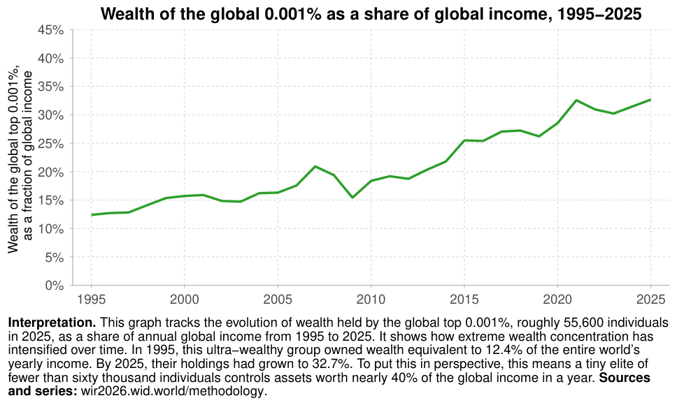

**----- Start of picture text -----** 
Wealth of the global 0.001% as a share of global income, 1995−2025 45% 40% 35% 30% 25% 20% 15% 10% 5% 0% 1995 2000 2005 2010 2015 2020 2025 Interpretation.  This graph tracks the evolution of wealth held by the global top 0.001%, roughly 55,600 individuals in 2025, as a share of annual global income from 1995 to 2025. It shows how extreme wealth concentration has intensified over time. In 1995, this ultra−wealthy group owned wealth equivalent to 12.4% of the entire world’s yearly income. By 2025, their holdings had grown to 32.7%. To put this in perspective, this means a tiny elite of fewer than sixty thousand individuals controls assets worth nearly 40% of the global income in a year.  Sources and series:  wir2026.wid.world/methodology.  as a fraction of global income Wealth of the global top 0.001%, **----- End of picture text -----** 

advocate for the Ultra-Millionaire Tax Act, which proposes a 2% tax on net wealth above $50 million and a 3% total rate above $1 billion. 

Regressivity at the top is not inevitable. With a minimum wealth tax, governments could restore progressivity, mobilize substantial resources, and rebuild the legitimacy of fiscal systems in the age of extreme wealth. Implementing such a tax is ultimately a question of political will, whether societies choose to confront the concentration of wealth and demand fairer contributions from those at the very top. 

## **Tax justice and the potential of a global wealth tax** 

The case for a global wealth tax rests not only on technical feasibility but also on justice. The previous section showed that a 2% minimum tax on billionaires would neutralize regressivity at the very top, raising $200–250 billion annually. Yet focusing exclusively on billionaires risks leaving most of the ultra-rich tax base untouched. Billionaires are only the tip of the iceberg. Below them lies a larger group 

of centi-millionaires, those worth at least $100 million, whose fortunes allow them to minimize contributions in similar ways, but who would escape any billionaire-only tax. 

**Figure 7.5** highlights the scale of revenue that could be mobilized under different scenarios. A 2% global tax on centi-millionaires would generate more than $500 billion annually, equivalent to 0.45% of world GDP.[13] A moderate 3% rate would raise about $754 billion (0.67% of world GDP), ensuring tax progressivity. An ambitious 5% tax could yield a staggering $1.3 trillion per year (1.11% of global GDP). These are not marginal adjustments. They are sums on a scale comparable to today’s global public spending on health, education, or climate adaptation. In other words, taxing a fraction of extreme private wealth could decisively expand governments’ fiscal capacity to address humanity’s most pressing needs. As N. K. Bharti et al. (2025) showed for the Indian case, taxing a tiny fraction of the very wealthy can fund transformative investments while leaving the vast majority of citizens untouched. The logic is the same globally: a modest tax on extreme fortunes can deliver benefits for billions. 

133 

Chapter 7. Global Taxation of Multi-Millionaires 

## **Figure 7.4. Coordinated minimum taxation can safeguard progressivity at the top** 

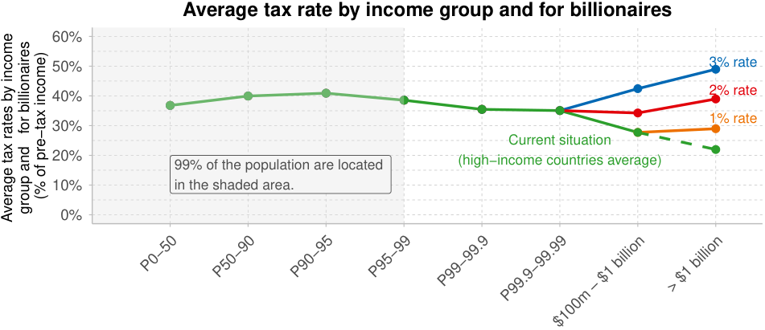

**----- Start of picture text -----** 
Average tax rate by income group and for billionaires 60% 50% 3% rate 2% rate 40% 1% rate 30% Current situation 20% 99% of the population are located  (high−income countries average) 10% in the shaded area. 0% P0−50 P50−90 P90−95 P95−99 P99−99.9 P99.9−99.99$100m – $1 billion > $1 billion (% of pre−tax income) group and   for billionaires Average tax rates by income **----- End of picture text -----** 

**Interpretation.** This figure reports estimates of current effective tax rates by pre−tax income groups and for billionaires in high−income countries, and different scenarios on minimum taxation. These estimates include all taxes paid at all levels of government and are expressed as a percent of pre−tax income. P0−50 denotes the 50% of adults at the bottom of the pre−tax income distribution, P50−90 the next four deciles, etc. Pre−tax income includes all national income (measured following standard national account definitions) before taxes and transfers and after the operation of the pension system. **Notes.** It assumes 10% tax avoidance/evasion. **Sources and series:** Zucman (2024). 

Tax justice is feasible and transformative. Taxing just 0.002% of adults worldwide could generate between 0.5% and 1.1% of global GDP in revenues. These resources could double public education budgets in low- and middle-income countries or finance large-scale climate programs. More than a technical tool, wealth taxation is a way of converting extreme private fortunes into shared investments for the collective good. 

**Figure 7.6** deepens the analysis regarding the baseline 2% minimum tax on centi-millionaires, illustrating the regional contrasts. East Asia alone, home to over 32,000 centi-millionaires, could generate a potential revenue of nearly $167 billion annually, surpassing the potential revenue of North America & Oceania ($142 billion). Europe could raise over $73 billion, while South & Southeast Asia could mobilize $63 billion. Even in regions with comparatively few ultra-rich individuals, such as Sub-Saharan Africa, a small number of centi-millionaires could still generate meaningful resources relative to their domestic economies. 

To put these figures into perspective, the additional global $503 billion that could be raised annually with a 2% wealth tax on centi-millionaires is greater than the total GDP of many middle-income countries. This sum would be enough to fully cover the combined public debts of numerous low-income nations in one year or to substantially improve the economic prospects of millions of people. In short, taxing fewer than 100,000 individuals could transform the fiscal capacity of governments worldwide and significantly reduce inequality. It would also help to reduce the inequality of opportunities across regions ( **Figure 7.7** ). 

Tax justice thus has both distributive and political dimensions. On the one hand, redirecting extreme private fortunes into public investments can help finance education, health, and climate resilience on a global scale, reducing inequality. On the other hand, ensuring that all ultra-rich individuals contribute proportionally rebuilds trust in taxation. Citizens are more willing to support fiscal systems when they see that the very richest, not just ordinary workers, 

134 

Chapter 7. Global Taxation of Multi-Millionaires 

## **Figure 7.5. Taxing only a few people can provide large revenues to decrease inequality** 

carry their fair share. 

## **Coordination between countries strengthens the feasibility of reducing tax evasion and avoidance** 

No matter how well designed national tax systems may be, their effectiveness can be undermined if wealth can easily cross borders. The fortunes of multi-millionaires can be highly mobile, often hidden through offshore structures or shifted toward jurisdictions with low or no taxation. This section highlights both the opportunities that emerge when states act together to prevent this, and the actions that can be implemented unilaterally to reduce tax evasion. 

**Figure 7.8** documents a turning point in the fight against offshore evasion. 

For decades, up to 90–95% of offshore wealth went undeclared, depriving governments of billions in revenues. After the introduction of automatic exchange of banking information in 2016 under the OECD’s Common Reporting Standard, this share fell dramatically. Still, by 2022, about 27% of offshore wealth remained untaxed, roughly 3.2% of world GDP. The lesson is clear: global cooperation has proven possible and efficient in cutting offshore evasion by a factor of three in less than ten years. This decline in non-compliance represents a significant achievement and demonstrates that rapid progress on tax evasion is possible when there is sufficient political will. 

**Figure 7.9** highlights billionaire mobility: the share of billionaires living outside their country of citizenship rose from 6% in 2002 to over 9% in 2024. While most remain at home, relocation to low-tax 

135 

Chapter 7. Global Taxation of Multi-Millionaires 

jurisdictions threatens the integrity of national tax systems. Policy responses can follow two distinct paths. One option is partial international coordination through a “tax collector of last resort” rule, which allows a billionaire’s home country to step in and collect additional taxes when wealth is shifted abroad and taxed at very low rates. Another option is for countries to act independently through exit taxes, which require individuals to settle their tax bill on accumulated wealth the moment they change residence. 

It is crucial to note that, while cooperation is important, waiting for a global consensus regarding a 2% wealth tax on centi-millionaires is unnecessary (see Zucman (2024)). The infrastructure for cross-border cooperation (automatic bank information exchange, beneficial ownership registries) is already in place, and enforcement mechanisms like exit taxes or “tax collector of last resort” rules could limit incentives for relocation. Many countries have already implemented rules to limit tax-driven changes in residency of high-net-worth individuals, including exit taxes. Countries implementing the minimum tax standard could build on these rules and strengthen them. 

The broader lesson is twofold. First, coordination works: automatic information exchange and minimum taxation standards have already reshaped global tax governance. Second, leadership matters: a coalition of willing countries can move first, raising revenues and demonstrating feasibility and benefits without waiting for universal agreement. Given the globalization of wealth, tax justice is strengthened both with multilateral ambition and determined national action. 

and social cohesion; and they curb political capture by limiting the unequal influence of the ultra-rich. 

However, tax progressivity collapses precisely where it should matter most: at the very top. **Figure 7.2** and **Figure 7.3** demonstrate how effective tax rates fall for multi-millionaires and billionaires, even as their fortunes expand. Solutions exist. **Figure 7.4** shows that a 2% minimum wealth tax would halt regressivity, while higher rates could restore progressivity. Current experiences in Brazil, South Africa, Spain, and France illustrate both the fertility of debates surrounding such measures and the feasibility of their implementation. 

**Figure 7.5** and **Figure 7.6** show tax justice proposals using the _Global Wealth Tax Simulator_ , an interactive tool developed by the World Inequality Lab. They demonstrate how taxing a tiny fraction of the population can finance transformative investments to address gross inequalities of opportunity ( **Figure 7.7** ). Finally, **Figure 7.8** and **Figure 7.9** underline that international cooperation is both necessary and highly effective in reducing tax evasion and avoidance. A coalition of the willing could limit tax evasion by targeting wealth mobility and strengthening global fiscal sovereignty. 

## **Main takeaways** 

This chapter has explored the role and potential of progressive taxation in an era of unprecedented wealth concentration. The starting point was to show why progressive taxation matters. Tax systems that mobilize revenues sustain growth by financing education, health, and infrastructure; they reduce inequality through redistributive spending; they build legitimacy by strengthening tax consent 

136 

Chapter 7. Global Taxation of Multi-Millionaires 

**Figure 7.6. Large regional wealth tax revenue potential** 

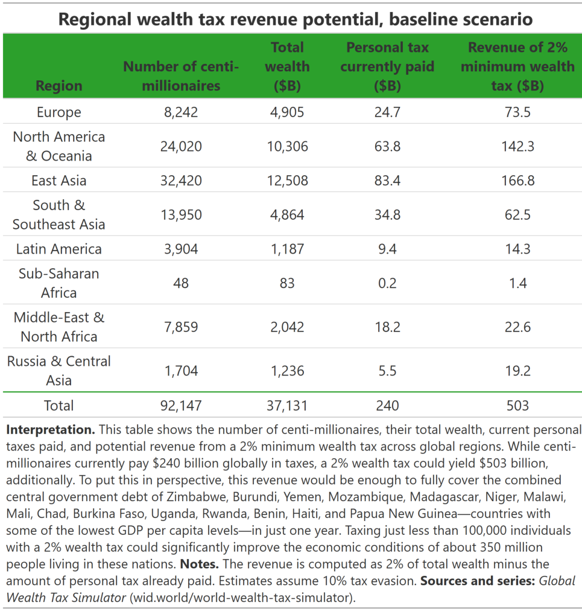

137 

Chapter 7. Global Taxation of Multi-Millionaires 

**Figure 7.7. Large inequality of opportunity across regions** 

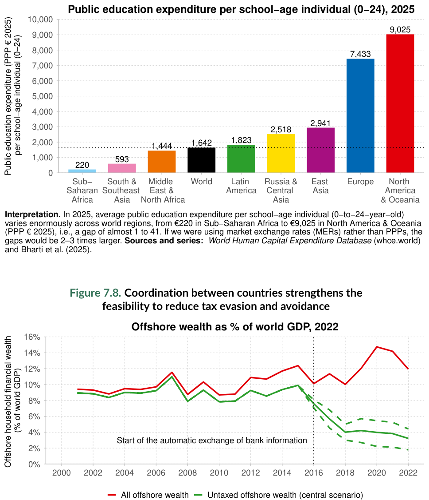

**----- Start of picture text -----** 
Public education expenditure per school−age individual (0−24), 2025 10,000 9,025 9,000 8,000 7,433 7,000 6,000 5,000 4,000 2,941 3,000 2,518 2,000 1,642 1,823 1,444 1,000 593 220 0 Sub− South & Middle  World Latin  Russia & East  Europe North Saharan Southeast  East & America Central  Asia America Africa Asia  North Africa Asia & Oceania Interpretation.  In 2025, average public education expenditure per school−age individual (0−to−24−year−old) varies enormously across world regions, from €220 in Sub−Saharan Africa to €9,025 in North America & Oceania (PPP € 2025), i.e., a gap of almost 1 to 41. If we were using market exchange rates (MERs) rather than PPPs, the gaps would be 2–3 times larger.  Sources and series: World Human Capital Expenditure Database  (whce.world) and Bharti et al. (2025). Figure 7.8. Coordination between countries strengthens the feasibility to reduce tax evasion and avoidance Offshore wealth as % of world GDP, 2022 16% 14% 12% 10% 8% 6% 4% Start of the automatic exchange of bank information 2% 0% 2000 2002 2004 2006 2008 2010 2012 2014 2016 2018 2020 2022 All offshore wealth Untaxed offshore wealth (central scenario)  per school−age individual (0–24) Public education expenditure (PPP € 2025) (% of world GDP) Offshore household financial wealth **----- End of picture text -----** 

**Interpretation.** This graph shows the evolution of global household offshore financial wealth as a share of world GDP (2000–2022), as well as the estimated share of untaxed offshore wealth under three scenarios: low−end, central, and high−end. While total offshore wealth has remained above 8% of world GDP since 2001, the share that is untaxed has dropped significantly since the start of the automatic exchange of bank information in 2016. In 2022, under the central scenario, 27% of offshore wealth is untaxed, equivalent to 3.2% of world GDP. Under the low−end and high−end scenarios, this corresponds to 1.8% and 4.4% of world GDP respectively. **Sources and series:** EU Tax Observatory, Alstadsæter et al. (2023). 

138 

Chapter 7. Global Taxation of Multi-Millionaires 

## **Figure 7.9. Billionaires are changing country of residence at a continuous pace** 

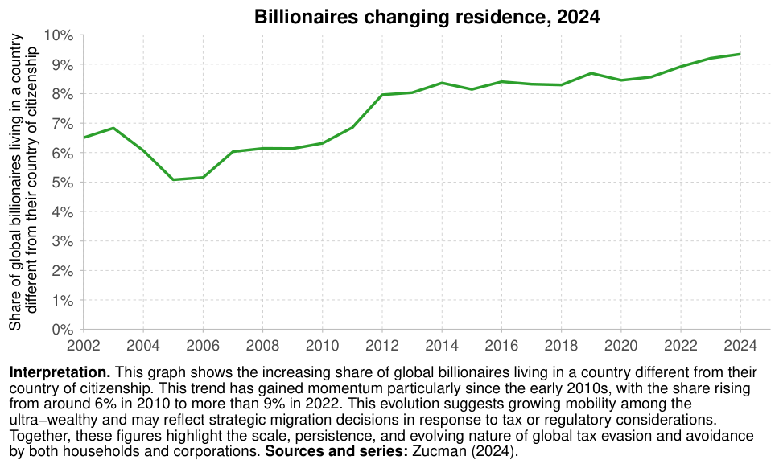

**----- Start of picture text -----** 
Billionaires changing residence, 2024 10% 9% 8% 7% 6% 5% 4% 3% 2% 1% 0% 2002 2004 2006 2008 2010 2012 2014 2016 2018 2020 2022 2024 Interpretation.  This graph shows the increasing share of global billionaires living in a country different from their country of citizenship. This trend has gained momentum particularly since the early 2010s, with the share rising from around 6% in 2010 to more than 9% in 2022. This evolution suggests growing mobility among the ultra−wealthy and may reflect strategic migration decisions in response to tax or regulatory considerations. Together, these figures highlight the scale, persistence, and evolving nature of global tax evasion and avoidance by both households and corporations.  Sources and series:  Zucman (2024).  different from their country of citizenship Share of global billionaires living in a country **----- End of picture text -----** 

139 

Chapter 7. Global Taxation of Multi-Millionaires 

## Box 7.1: Explore the _Global Wealth Tax Simulator_ 

Debates over taxing extreme wealth often feel abstract. How much revenue could be raised? How many individuals would be affected? What level of tax would ensure fairness? To make these questions concrete, the World Inequality Lab has developed the _Global Wealth Tax Simulator_ , an interactive tool that allows anyone—from researchers, policymakers, or journalists, to ordinary citizens—to design their own wealth tax. 

The simulator works by enabling users to choose tax evasion thresholds and rates. It then calculates three primary outcomes: total revenues raised, the effective tax rates, and the number of individuals affected. For example, a global tax of 2% on fortunes above $100 million would generate nearly half a trillion dollars annually, while affecting only a few thousand people worldwide. 

Beyond these numerical projections, the tool offers a way to visualize tax justice through tables and graphs. It shows how modest contributions from the very top of the distribution could transform public finances . The simulator invites engagement and delivers a simple message: the resources exist to reduce inequality and strengthen public goods. The question is no longer one of technical feasibility, but political will. 

## _**The Global Wealth Tax Simulator**_ 

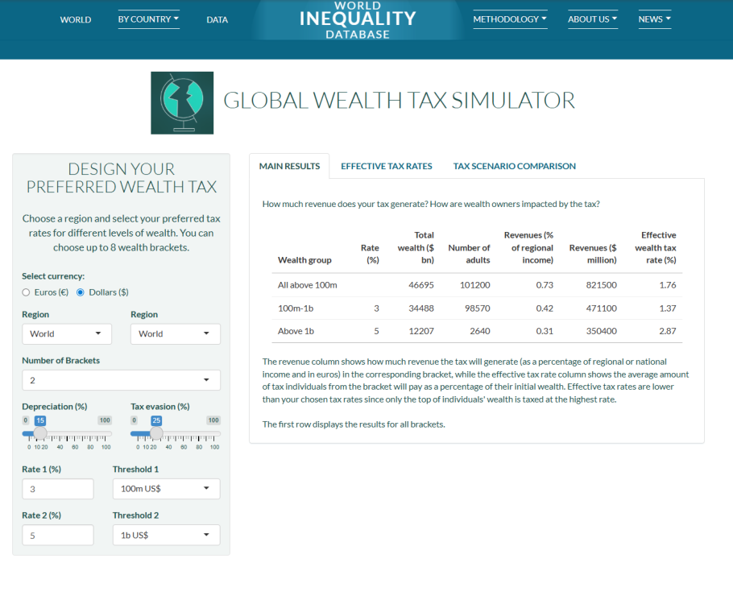

140 

Notes 

## **Notes** 

> 13The World Inequality Lab created the _Global Wealth Tax Simulator_ (see **Box 7.1.1** ) to help design wealth taxes. It allows users to model scenarios and visualize the potential revenues. 

## **References** 

Alstadsæter, Annette et al. (2023). “Global tax evasion report 2024”. In: _EU-Tax Observatory_ . 

- Artola, M, Cl Martínez-Toledano, and A Sodano (2022). “Desigualdad de la renta y redistribución en España: Nueva Evidencia a partir de la Metodología del World Inequality Lab”. In: _EsadeEcPol-Center for Economic Policy_ 27. 

- Bharti, Nitin et al. (2025). “Human capital, unequal opportunities and productivity convergence: A global historical perspective, 1800-2100”. In: _World Inequality Lab, Working Paper Series_ 2025/15. 

- Bharti, Nitin Kumar et al. (2025). “Towards Tax Justice & Wealth Redistribution in India: Proposals based on latest inequality estimates”. In: _World Inequality Lab, Issue Brief Paper_ 2024/01. 

- Bozio, Antoine et al. (2020). _Predistribution vs. Redistribution: Evidence from France and the U.S._ Tech. rep. Center for Research in Economics and Statistics. 

- (2024). “Predistribution versus redistribution: Evidence from France and the United States”. In: _American Economic Journal: Applied Economics_ 16.2, pp. 31–65. 

- Bruil, Arjan et al. (2022). “Inequality and Redistribution in the Netherlands”. In. 

- Cagé, Julia (2024). “Political inequality”. In: _Annual Review of Economics_ , 16: 455–490. 

- Gethin, Amory (2023). “Revisiting Global Poverty Reduction: Public Goods and the World Distribution of Income, 1980-2022”. In: _World Inequality Lab, Working Paper Series_ 2023/24. 

- Palomo, Theo et al. (2025). “Tax Progressivity and Inequality in Brazil: Evidence from Integrated Administrative Data”. In: _EU Tax Observatory, Working Paper_ 2025/09. 

- Saez, Emmanuel and Gabriel Zucman (2019). “Progressive wealth taxation”. In: _Brookings Papers on Economic Activity_ 2019.2, pp. 437–533. 

- Zucman, Gabriel (2024). “A blueprint for a coordinated minimum effective taxation standard for ultrahigh-net-worth individuals”. In: _Commissioned by the Brazilian G20 presidency_ . 

141 

# **CHAPTER 8 Political Cleavages** 

Chapter 8. Political Cleavages 

## **Contents of this chapter** 

|Political representation of the working class is low and declining. . . . . . . . . . . . **144**|
|---|
|Income and education divides have disconnected in Western democracies . . . . . **144**|
|Non-Western democracies have diferent structures of political division . . . . . . . **147**|
|The return of geography in political confict: regional and rural–urban cleavages . . **148**|
|The explanatory power of geosocial class is stronger than ever . . . . . . . . . . . . **148**|
|Main takeaways . . . . . . . . . . . . . . . . . . . . . . . . . . . . . . . . . . . . . . . **149**|

143 

Chapter 8. Political Cleavages 

This chapter examines how political cleavages have evolved and what these transformations reveal about inequality and democracy. We begin with the decline of political working-class representation ( **Figure 8.1** ). We then turn to the disconnection of income and education political divides in Western democracies, which has produced “multi-elite” party systems where educated elites lean left and affluent elites remain on the right – ( **Figure 8.2 Figure 8.5** ). **Figure 8.6** widens the lens to non-Western democracies, where cleavages often follow ethnic, religious, or regional lines rather than the – income–education divide. **Figure 8.7 Figure 8.8** highlight the resurgence of territorial conflict in Western democracies. **Figure 8.9** concludes by emphasizing the growing explanatory power of geosocial class, the combination of wealth and conurbation size, in determining political outcomes. 

## **Political representation of the working class is low and declining** 

This section highlights a central paradox of modern democracies: while the principle of universal suffrage promises equal political voice, the working class has been persistently underrepresented in institutions of power, and this dimension of inequality has deepened in recent decades. **Figure 8.1** documents the long-run decline of working-class representation in parliaments across France, the United Kingdom, and the United States.[14] The figure plots the share of MPs whose last occupation before entering politics was a manual or blue-collar job, compared to the total number of MPs in each country. It shows that working-class representation has always been low and has further deteriorated in recent decades. 

This disconnect between the social composition of legislative bodies and that of the electorate illustrates a central dimension of political inequality: the growing gap in descriptive representation. The erosion of political representation reshapes political priorities. Legislators from working-class origins are more likely to push for redistribution, stronger labor rights, and protections for vulnerable groups. Their 

absence narrows the scope of policy debate, leaving structural inequalities unaddressed. 

The result is a political system that, much like the trends documented in previous chapters, channels power and resources to the top of the distribution. Democracies today risk entrenching a system in which the working majority is politically marginalized. 

## **Income and education divides have disconnected in Western democracies** 

A possible explanation for this persistent underrepresentation of the working class is the rise of “multiple-elites” political systems, where different elite groups, those with high education and those with high income, dominate opposing political camps. **Figure 8.2** through **Figure 8.5** shed light on this transformation over the past half-century for twenty-one Western democracies. They reveal the gradual disconnection of income and education divides, the reversal of the educational cleavage, and the emergence of new political alignments that increasingly set different elite groups in opposition to one another. **Figure 8.2** illustrates one of the most important shifts in the political landscapes of Western democracies over the past seven decades: the gradual uncoupling of income and education as determinants of the vote. In the 1950s and 1960s, politics in most Western democracies was organized along a relatively straightforward class-based axis. Low-income and low-educated voters rallied behind social democratic, socialist, and communist parties (“left-wing” parties), while high-income and highly educated groups supported conservative, Christian democratic, and liberal parties (“right-wing” parties). In the past decades, however, these two groups have diverged sharply. 

On the one hand, education has become a strong predictor of support for the left. Higher-educated voters increasingly lean toward left parties, to the point where, since the 1990s, the top 10% of educated voters are systematically more left-leaning than the less educated majority. On the other hand, income remains firmly linked to the right. The top 10% of earners continue to prefer conservative or right-wing parties. The gap 

144 

Chapter 8. Political Cleavages 

## **Figure 8.1. Working class representation has always been low and has further deteriorated in recent decades** 

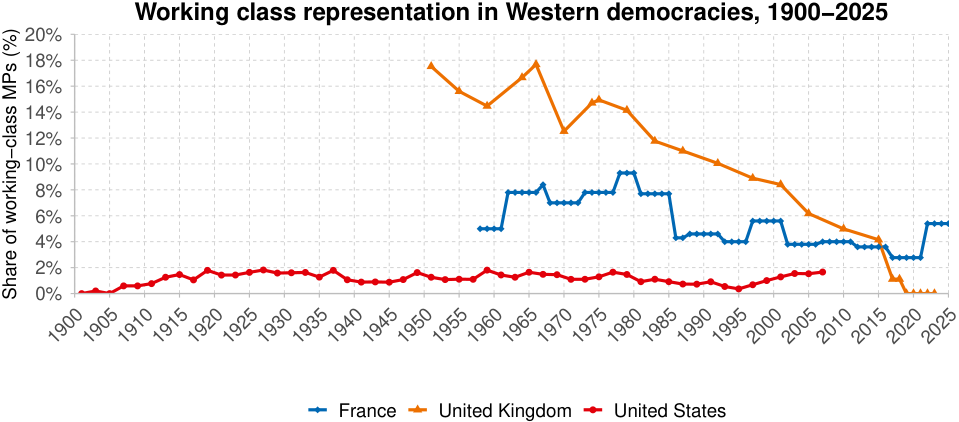

**----- Start of picture text -----** 
Working class representation in Western democracies, 1900−2025 20% 18% 16% 14% 12% 10% 8% 6% 4% 2% 0% France United Kingdom United States 19001905191019151920192519301935194019451950195519601965197019751980198519901995200020052010201520202025 Share of working−class MPs (%) **----- End of picture text -----** 

**Interpretation.** The long−run decline in the share of working−class members of parliament (MPs): evidence from France, the United Kingdom, and the United States. The figure plots the evolution of the share of working−class MPs—measured as the number of MPs whose former occupation just before the elections was a “manual” occupation (United Kingdom), a “blue−collar” occupation (United States), or an occupation as “employés et ouvriers” (France)—over the total number of MPs in each country. The share of working−class occupations in the total labor force is usually around 50%–60% or more. **Sources and series:** Cagé (2024). 

with the bottom 90% has remained negative: top-income voters are consistently less likely to support the left. This transition highlights a shift from “class-based” to “multi-elite” party systems, which now feature opposing camps comprising an educated “Brahmin left” and an affluent “merchant right” (see Gethin, Martínez-Toledano, and Piketty (2022); Gethin, Martínez-Toledano, and Piketty (2021); Gethin and Martínez-Toledano (2025)). 

This structural transformation is closely related to educational expansion and the ensuing “complexification” of the occupational structure. By way of illustration, many high-degree but relatively low-income voters (e.g., teachers or nurses) currently vote for the left, while many voters with lower degrees but relatively higher income (e.g., self-employed or truck drivers) tend to vote for the right. 

Importantly, this transformation has not been restricted to a few countries. It has unfolded across almost all twenty-one Western democracies included in the _World Political Cleavages and Inequality_ 

_Database_ , despite wide differences in their histories, institutions, and party structures. This common transformation has been closely linked not only to the rise of a new sociocultural axis of political conflict, but also to the convergence of parties on economic policy, political fragmentation, economic development, and educational progress (see Gethin and Martínez-Toledano (2025)). 

**Figure 8.3** documents the remarkable reversal of educational divides across different Western democracies. In the postwar decades, voters with low levels of education were the backbone of left-wing parties, while the highly educated leaned right. Today, the opposite holds: highly educated voters now disproportionately vote more for the left, while the less educated often support conservative parties. 

This reversal has transformed left-wing parties from representing the industrial working class in the past into coalitions anchored in the educated middle and upper-middle classes in the present. These left parties increasingly attract highly educated “sociocultural professionals”, such 

145 

Chapter 8. Political Cleavages 

**Figure 8.2. Educated voters increasingly support the left, while high-income voters continue leaning right** 

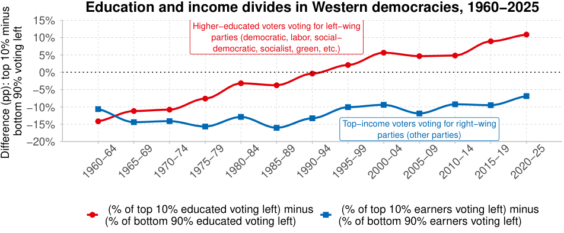

**----- Start of picture text -----** 
Education and income divides in Western democracies, 1960−2025 15% Higher−educated voters voting for left−wing 10% parties (democratic, labor, social− democratic, socialist, green, etc.) 5% 0% −5% −10% −15% Top−income voters voting for right−wing parties (other parties) −20%  (% of top 10% educated voting left) minus  (% of top 10% earners voting left) minus (% of bottom 90% educated voting left) (% of bottom 90% earners voting left) 1960−641965−691970−741975−791980−841985−891990−941995−992000−042005−092010−142015−192020−25 bottom 90% voting left Difference (pp): top 10% minus **----- End of picture text -----** 

**Interpretation.** In the 1960s, both higher−educated and high−income voters were less likely to vote for left−wing (democratic / labor / social−democratic / socialist / green) parties than lower−educated and low−income voters by more than 10 percentage points. The left vote has gradually become associated with higher education voters, giving rising to a multi−elite party system. Figures correspond to five−year averages for Australia, Britain, Canada, Denmark, France, Germany, Italy, the Netherlands, Norway, Sweden, Switzerland, and the U.S. Estimates control for income/education, age, gender, religion, church attendance, rural/urban, region, race/ethnicity, employment status, and marital status (in country−years for which these variables are available). **Sources and series:** Gethin et al. (2021) and _World Political Cleavages and Inequality Database_ (wpid.world). 

as education and healthcare workers, public sector employees, and urban elites, whose concerns and political priorities extend beyond redistribution to issues such as climate change, minority rights, and gender equality. Meanwhile, less educated voters have turned toward conservative platforms. 

This pattern is visible in nearly all Western democracies, though with varying intensity. Portugal and Ireland remain partial exceptions, with smaller or delayed reversals. Yet the broader trend is clear: education, once a strong determinant of support for conservative parties, has become a defining predictor of left voting in most Western democracies. 

Contrary to education, the income divide has remained relatively stable. **Figure 8.4** shows that higher-income voters continue to lean right. This enduring divide has meant that even as educational elites shifted left, affluent groups have largely remained on the right. 

Yet the income divide has not been static. In many Western democracies, the influence of income on the vote declined during the 

late 20th century, as party competition increasingly shifted toward cultural issues. A striking case is the United States. In recent elections, high-income voters have shifted to the Democratic Party, becoming more likely than low-income groups to support the Democrats. This shift represents a historic reversal of the classic postwar pattern, which highlights how far the U.S. has moved toward a “high-income-left” coalition and illustrates the weight of sociocultural divides in shaping political conflict. 

**Figure 8.5** brings these dynamics together by plotting income and education gradients simultaneously. In the 1960s, parties lined up along a diagonal: left-wing parties were supported by low-income and less educated voters, while right-wing parties drew support from high-income and highly educated voters. By 2000–2025, this alignment has fractured. Parties now cluster across different quadrants. Green parties occupy the high-education section but do not distinguish themselves in terms of income. Anti-immigration movements dominate the low-education space, appealing to both lowand high-income groups. Conservatives 

146 

Chapter 8. Political Cleavages 

remain rooted in high-income voters but now draw support from segments of the less educated. Social democrats, socialists, and other left-wing parties continue to be supported by low-income groups but now attract a greater faction of higher-educated voters. 

This fragmentation reveals that income and education now pull voters in different directions. The result is a fractured electorate where pro-redistribution coalitions are harder to sustain. The disconnection of income and education cleavages weakens the political potential to address inequality. Income and education are not the only axes of political conflict in these Western democracies. Other divides (age, religion, and gender) continue to shape electoral behavior. With the exception of gender, which has undergone a reversal similar to education (women now lean more left than men), there is little evidence of generalized realignment along these other dimensions. Age, religiosity, and church attendance remain stable predictors of conservative voting, while younger, urban, and secular electorates lean to the left. Geography, particularly the rural–urban divide, has become increasingly salient. Its dynamics are analyzed in detail in **Figure 8.7** – **Figure 8.8** . 

– **Figure 8.2 Figure 8.5** provide an - explanation of why the decline of working class representation in Western democracies, shown in **Figure 8.1** , has not been reversed. Today, politics is dominated by multiple elites, leaving workers politically fragmented and underrepresented. The fragmentation of electorates makes redistributive coalitions harder to sustain, even as inequality has risen sharply. The concentration of political influence among high earners and the highly educated mirrors the concentration of economic resources at the top. Political systems remain deeply structured by inequality, but the disconnection of income and education has made it harder for majorities to mobilize against it. 

## **Non-Western democracies have different structures of political division** 

The patterns documented in **Figure 8.2** – **Figure 8.5** show how twenty-one Western democracies have converged toward multi-elite systems, with education and income pointing in different political directions. In non-Western democracies, political cleavages follow much more diverse trajectories. Instead of a common move toward the “Brahmin left versus merchant right” configuration, income and education often remain aligned (see **Figure 8.6** ), and other dimensions of political conflict (ethnicity, religion, caste, or region) play a more important role. The evidence in **Figure 8.6** for thirty-four non-Western democracies shows that income and education are closely aligned in determining electoral behavior. However, the strength of class divides varies widely, ranging from nearly absent in India, Indonesia, and Costa Rica, to exceptionally strong in Argentina, South Africa, and Poland. 

The diversity of outcomes highlights how inequality interacts with national contexts. In some countries, income and education remain tightly linked to electoral behavior, unlike the Western reversal. In others, ethnicity, religion, or regional divides are more relevant dimensions of political conflict. The key insight is that there is no single trajectory of political realignment outside of the Western democracies. Socioeconomic divides are stronger or weaker depending on how they interact with other dimensions of political conflict. In South Africa, for instance, race remains a powerful determinant of political alignment, while in India, caste and religious identities significantly overlap with income and education divides. In Brazil and other Latin American democracies, class conflict continues to shape electoral behavior, but it often intersects with regional divides and legacies of inequality rooted in colonial history. 

The reversal of the education cleavage which has been so central to Western democracies is much less common in non-Western democracies. This underscores that the multiple-elites trend is a localized 

147 

Chapter 8. Political Cleavages 

rather than global phenomenon. Political cleavages are reshaped differently beyond the West, depending on historical legacies and institutional contexts. 

## **The return of geography in political conflict: regional and rural–urban cleavages** 

Alongside the disconnection of income and education divides, geography has re-emerged as a central axis of political conflict (see Cagé and Piketty (2024)). **Figure 8.7** and **Figure 8.8** show how regional and rural–urban cleavages have deepened in recent decades, particularly in France. These divides recall earlier historical moments when territory shaped politics, but their renewed intensity has profound implications for today’s democracies. Preliminary evidence suggests that this finding also applies to other advanced democracies (e.g., the U.S., Britain, and Germany). In the case of France, gaps in political affiliations between large metropolitan centers and smaller towns have reached levels unseen in a century. Unequal access to public services (education, health, transportation, and other infrastructures), job opportunities, and exposure to trade shocks have fractured social cohesion and weakened the coalitions necessary for redistributive reform. As a consequence, working-class voters are now fragmented across parties on both sides of the aisle or left without strong representation, which limits their political influence and entrenches inequality. In order to reactivate the redistributive coalitions of the postwar era, it is critical to design more ambitious policy platforms that benefit all territories, as they successfully did in the past. 

**Figure 8.8** tracks the long-run evolution of the urban–rural divide in France. In the late 19th and early 20th centuries, large cities leaned strongly toward the left, while rural areas favored conservatives. During the postwar decades, however, this gap narrowed, as class rather than geography structured political competition. By the 1990s, the pattern shifted again. Urban areas, with their diversified economies and higher education levels, increasingly supported left parties. Rural regions and small towns gravitated toward conservative 

parties. The most recent elections reveal the sharpest territorial split in over a century, with urban centers voting overwhelmingly for the left, while rural areas rallied to the right. 

**Figure 8.7** highlights how this cleavage has formed into a tripartite system in France (see Cagé and Piketty (2025)). The liberal-progressive bloc is heavily concentrated among the highest-income voters, particularly in affluent urban centers. The social-ecological (left) bloc draws support from diverse urban and younger populations, while the national-patriotic (right) bloc dominates among rural and peri-urban voters. This division fragments the working classes: urban workers lean left, while rural and small-town workers turn to the right. The implications are far-reaching. Territorial divides complicate the possibility of broad redistributive coalitions by splitting working-class voters along geographic lines. As with the disconnection of income and education cleavages, geography fragments potential majorities for redistribution. France exemplifies this process, but similar dynamics are visible across Western democracies. Geography, once a muted force, has returned as a defining feature of political competition, reshaping how inequality translates into politics. 

## **The explanatory power of geosocial class is stronger than ever** 

Now we turn to the growing importance of geosocial class, the combination of socioeconomic status and territorial location, in shaping electoral behavior (see Cagé and Piketty (2025)). **Figure 8.9** traces this relationship in France from the mid-19th century to the present and shows that its explanatory power has never been as strong as it is today. 

In France, geosocial class has influenced voting more in recent elections than ever before. This shows that factors like rural versus urban location, wealth, and types of jobs continue to shape politics more strongly than geography or identity. This finding contradicts the idea that politics has become dominated by purely cultural 

148 

Chapter 8. Political Cleavages 

identity struggles. Instead, material and territorial inequalities remain powerful forces shaping electoral behavior. 

Placed in the broader perspective of this report, the rise of geosocial class mirrors the dynamics of economic inequality documented in previous chapters. Electoral geography has become a mirror of inequality itself, demonstrating that democratic conflict remains deeply rooted in wealth inequality. 

## **Main takeaways** 

The evidence presented in this chapter paints a clear picture: political cleavages in Western democracies have been profoundly restructured since the postwar years. Working-class representation in legislative bodies has always been low and has deteriorated further in recent decades ( **Figure 8.1** ). This exclusion mirrors the broader inequalities in income and wealth documented in earlier chapters and highlights how political voice itself has become more unequal. 

the variance in French electoral behavior today than at any point in the past 170 years. Political conflict remains anchored in structural inequalities. Electoral geography has become a mirror of economic divides, underscoring that democracy and inequality are deeply interrelated; the way that one evolves affects the other. 

As for non-Western democracies, there is no common pattern, but rather a diversity of political profiles. In many countries, income and education remain closely aligned. Socioeconomic divides are stronger or weaker depending on how they interact with other dimensions of political conflict, such as ethnicity, caste, and regional identities. Unlike Western democracies, the multiple-elites system is far less common. This diversity underscores the fact that, although inequality shapes politics everywhere, the cleavages through which it operates are always mediated by local contexts. 

– **Figure 8.2 Figure 8.5** provide an explanation for this phenomenon. The disconnection of income and education has given rise to multi-elite party systems, with highly educated voters shifting left and high-earning voters remaining aligned with the right. The result is a “Brahmin left” versus “merchant right” structure, in which different elites dominate opposing coalitions and working-class voters are increasingly fragmented or underrepresented. 

Beyond income and education, other divides, such as religion or age, remain important but largely stable for Western democracies. Only gender has shown a reversal comparable to education, with women now leaning more left than men. Geography , however, has re-emerged as a – powerful cleavage ( **Figure 8.7 Figure 8.8** ), splitting electorates between metropolitan centers and rural peripheries. This territorial dimension deepens the fragmentation of working-class voters and complicates redistributive coalition-building. 

Importantly, the explanatory power of geosocial class has never been greater ( **Figure 8.9** ). Economic resources and territorial location together explain more of 

149 

Chapter 8. Political Cleavages 

**Figure 8.3. The reversal of educational divides in Western democracies** 

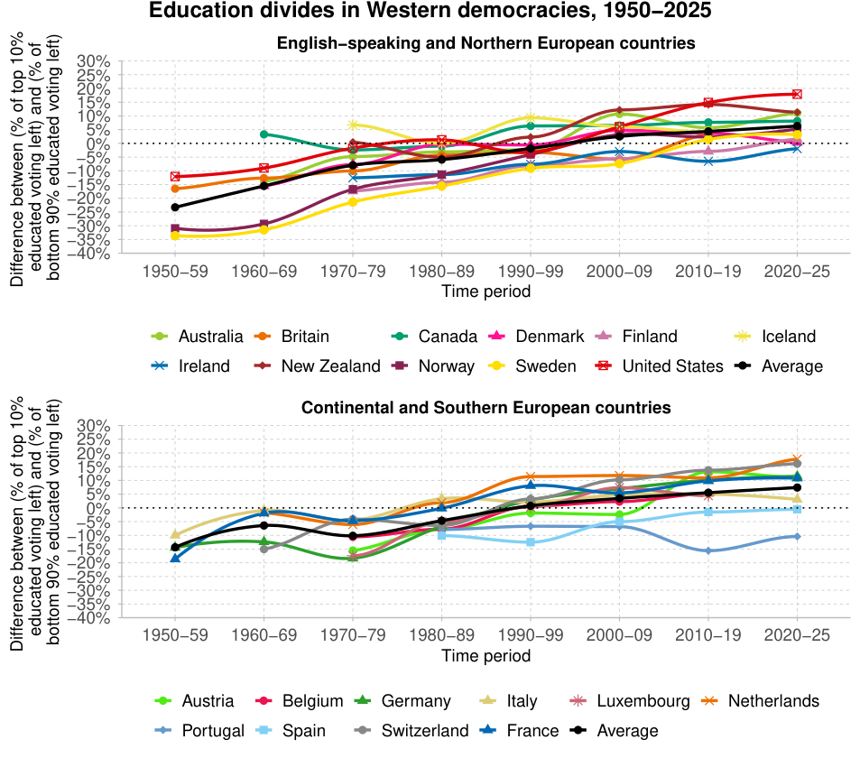

**----- Start of picture text -----** 
Education divides in Western democracies, 1950−2025 English−speaking and Northern European countries 30% 25% 20% 15% 10% 5% 0% −5% −10% −15% −20% −25% −30% −35% −40% 1950−59 1960−69 1970−79 1980−89 1990−99 2000−09 2010−19 2020−25 Time period Australia Britain Canada Denmark Finland Iceland Ireland New Zealand Norway Sweden United States Average Continental and Southern European countries 30% 25% 20% 15% 10% 5% 0% −5% −10% −15% −20% −25% −30% −35% −40% 1950−59 1960−69 1970−79 1980−89 1990−99 2000−09 2010−19 2020−25 Time period Austria Belgium Germany Italy Luxembourg Netherlands Portugal Spain Switzerland France Average  educated voting left) and (% of  bottom 90% educated voting left) Difference between (% of top 10%  educated voting left) and (% of  bottom 90% educated voting left) Difference between (% of top 10% **----- End of picture text -----** 

**Interpretation.** In these countries, higher−educated voters used to be significantly more likely to vote for conservative parties and have gradually become less likely to vote for these parties. Estimates control for income, age, gender, religion, church attendance, rural / urban, region, race / ethnicity, employment status, and marital status (in country−years for which these variables are available). **Sources and series:** Gethin et al. (2021) and _World Political Cleavages and Inequality Database_ (wpid.world). 

150 

Chapter 8. Political Cleavages 

## **Figure 8.4. The stability/decline of income divides in Western democracies** 

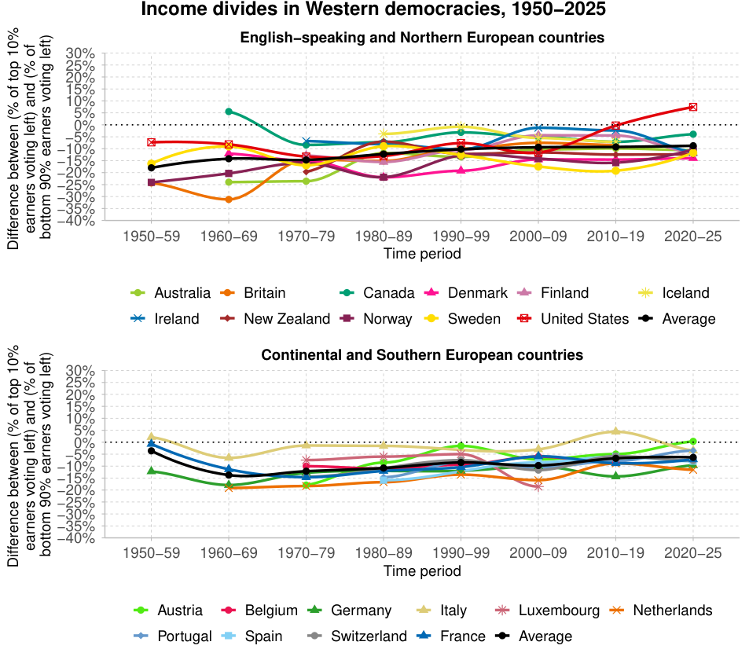

**----- Start of picture text -----** 
Income divides in Western democracies, 1950−2025 English−speaking and Northern European countries 30% 25% 20% 15% 10% 5% 0% −5% −10% −15% −20% −25% −30% −35% −40% 1950−59 1960−69 1970−79 1980−89 1990−99 2000−09 2010−19 2020−25 Time period Australia Britain Canada Denmark Finland Iceland Ireland New Zealand Norway Sweden United States Average Continental and Southern European countries 30% 25% 20% 15% 10% 5% 0% −5% −10% −15% −20% −25% −30% −35% −40% 1950−59 1960−69 1970−79 1980−89 1990−99 2000−09 2010−19 2020−25 Time period Austria Belgium Germany Italy Luxembourg Netherlands Portugal Spain Switzerland France Average earners voting left) and (% of bottom 90% earners voting left) Difference between (% of top 10% earners voting left) and (% of bottom 90% earners voting left) Difference between (% of top 10% **----- End of picture text -----** 

**Interpretation.** In these countries, top−income voters have remained significantly more likely to vote for conservative parties than low−income voters. Estimates control for income, age, gender, religion, church attendance, rural / urban, region, race / ethnicity, employment status, and marital status (in country−years for which these variables are available). **Sources and series:** Gethin et al. (2021) and _World Political Cleavages and Inequality Database_ (wpid.world). 

151 

Chapter 8. Political Cleavages 

## **Figure 8.5. The fragmentation of political cleavage structures in Western democracies** 

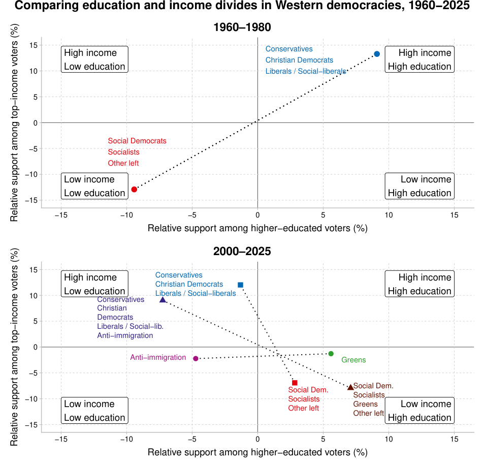

**----- Start of picture text -----** 
Comparing education and income divides in Western democracies, 1960−2025 1960–1980 15 High income Conservatives High income Christian Democrats 10 Low education Liberals / Social−liberals High education 5 0 Social Democrats −5 Socialists Other left −10 Low income Low income Low education High education −15 −15 −10 −5 0 5 10 15 Relative support among higher−educated voters (%) 2000–2025 15 High income Conservatives High income Christian Democrats 10 Low education Liberals / Social−liberals High education Conservatives Christian Democrats 5 Liberals / Social−lib. Anti−immigration 0 Anti−immigration Greens −5 Social Dem. Social Dem. Socialists −10 Socialists Low income Greens  Low income Other left Other left Low education High education −15 −15 −10 −5 0 5 10 15 Relative support among higher−educated voters (%) Relative support among top−income voters (%) Relative support among top−income voters (%) **----- End of picture text -----** 

**Interpretation.** The figure represents the difference between the share of high−income (top 10%) and low−income (bottom 90%) voters voting for selected groups of parties on the y−axis, and the same difference between higher−educated (top 10%) and lower−educated (bottom 90%) voters on the x−axis. In the 1960s−1980s, socialist and social democratic parties were supported by both low−income and lower−educated voters, while conservative, Christian, and liberal parties were supported by both high−income and higher−educated voters. In the 2000−2025 period, education most clearly distinguishes anti−immigration from green parties, while income most clearly distinguishes conservative and Christian parties from socialist and social−democratic parties. Averages over all Western democracies. Estimates control for income/education, age, gender, religion, church attendance, rural/urban, region, race/ethnicity, employment status, and marital status (in country−years for which these variables are available). **Sources and series:** Gethin et al. (2021) and _World Political Cleavages and Inequality Database_ (wpid.world). 

152 

Chapter 8. Political Cleavages 

## **Figure 8.6. Income and educational divides in non-Western democracies** 

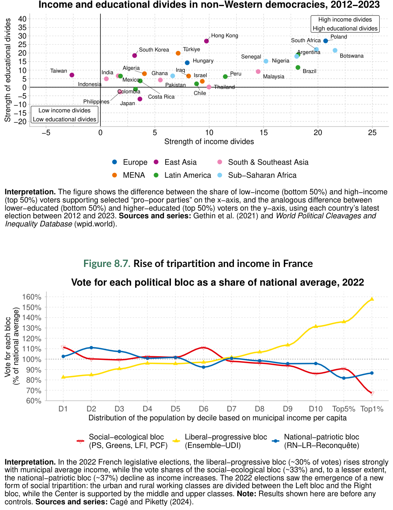

**----- Start of picture text -----** 
Income and educational divides in non−Western democracies, 2012−2023 40 High income divides 35 High educational divides 30 Hong Kong Poland South Africa 25 20 South Korea Türkiye Senegal Argentina Botswana 15 Hungary Nigeria 105 Taiwan India MexicoAlgeria Ghana Iraq Israel Peru Malaysia Brazil 0 Indonesia Pakistan Thailand −5 Colombia Costa Rica Chile −10 Philippines Japan −15 Low income divides −20 Low educational divides −5 0 5 10 15 20 25 Strength of income divides Europe East Asia South & Southeast Asia MENA Latin America Sub−Saharan Africa Interpretation.  The figure shows the difference between the share of low−income (bottom 50%) and high−income (top 50%) voters supporting selected “pro−poor parties” on the x−axis, and the analogous difference between lower−educated (bottom 50%) and higher−educated (top 50%) voters on the y−axis, using each country’s latest election between 2012 and 2023.  Sources and series:  Gethin et al. (2021) and  World Political Cleavages and Inequality Database  (wpid.world). Figure 8.7. Rise of tripartition and income in France Vote for each political bloc as a share of national average, 2022 160% 150% 140% 130% 120% 110% 100% 90% 80% 70% 60% D1 D2 D3 D4 D5 D6 D7 D8 D9 D10 Top5% Top1% Distribution of the population by decile based on municipal income per capita Social−ecological bloc Liberal−progressive bloc National−patriotic bloc (PS, Greens, LFI, PCF) (Ensemble–UDI) (RN–LR–Reconquête) Interpretation.  In the 2022 French legislative elections, the liberal−progressive bloc (~30% of votes) rises strongly with municipal average income, while the vote shares of the social−ecological bloc (~33%) and, to a lesser extent, the national−patriotic bloc (~37%) decline as income increases. The 2022 elections saw the emergence of a new form of social tripartition: the urban and rural working classes are divided between the Left bloc and the Right bloc, while the Center is supported by the middle and upper classes.  Note:  Results shown here are before any controls.  Sources and series:  Cagé and Piketty (2024). Strength of educational divides Vote for each bloc (% of national average) **----- End of picture text -----** 

153 

Chapter 8. Political Cleavages 

**Figure 8.8. The territorial divide (urban vs. rural) in France** 

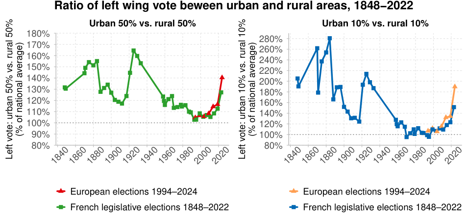

**----- Start of picture text -----** 
Ratio of left wing vote beween urban and rural areas, 1848−2022 Urban 50% vs. rural 50% Urban 10% vs. rural 10% 180% 280% 170% 260% 160% 240% 150% 220% 140% 200% 130% 180% 120% 160% 110% 140% 100% 120% 90% 100% 80% 80% European elections 1994–2024 European elections 1994–2024 French legislative elections 1848–2022 French legislative elections 1848–2022 1840186018801900192019401960198020002020 1840186018801900192019401960198020002020 (% of national average) (% of national average) Left vote: urban 50% vs. rural 50% Left vote: urban 10% vs. rural 10% **----- End of picture text -----** 

**Interpretation.** Both panels show the ratio of the left−wing vote in urban areas to that in rural areas. The left panel compares the 50% most urban with the 50% most rural; the right panel compares the 10% most urban with the 10% most rural (by agglomeration size). In both European elections (1994–2024) and legislative elections (1848–2022), the urban–rural gap widens markedly from the mid−1990s onward, with a sharp rise in the 2024 European election. **Sources and series:** Cagé and Piketty (2025) and unehistoireduconflitpolitique.fr. 

**Figure 8.9. Geosocial class explanatory power is stronger than ever in France** 

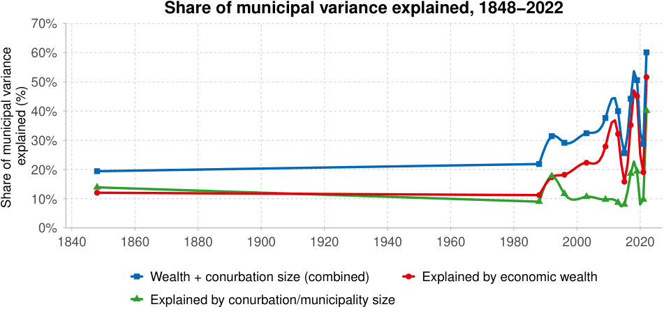

**----- Start of picture text -----** 
Share of municipal variance explained, 1848−2022 70% 60% 50% 40% 30% 20% 10% 0% 1840 1860 1880 1900 1920 1940 1960 1980 2000 2020 Wealth + conurbation size (combined) Explained by economic wealth Explained by conurbation/municipality size explained (%) Share of municipal variance **----- End of picture text -----** 

**Interpretation.** The explanatory power of variables linked to economic wealth (income, real−estate capital, homeownership, concentration of property) and to the size of the conurbation/municipality for the Left–Right presidential vote rises markedly in recent elections. The wealth component increases especially quickly, and together wealth + territory explain about 60% of municipal variance in 2022. **Sources and series:** Cagé and Piketty (2025) and unehistoireduconflitpolitique.fr. 

154 

Notes 

## **Notes** 

14See Cagé (2024). 

## **References** 

- Cagé, Julia (2024). “Political inequality”. In: _Annual Review of Economics_ , 16: 455–490. 

- Cagé, Julia and Thomas Piketty (2024). “Le début de la fin de la tripartition? Élections européennes et inégalités sociales en France, 1994-2024”. In: _World Inequality Lab, Working Paper Series_ 2024/18. 

- (2025). _A history of political conflict: Elections and social inequalities in France, 1789–2022_ . Harvard University Press. 

- Gethin, Amory and Clara Martínez-Toledano (2025). “Political Cleavages in Contemporary Democracies”. In: _North Holland Handbook of Political Economy_ . Ed. by Daron Acemoglu and James Robinson. Draft, March 2025. 

- Gethin, Amory, Clara Martínez-Toledano, and Thomas Piketty (2021). _Political cleavages and social inequalities: A study of fifty democracies, 1948–2020_ . Harvard University Press. 

- (2022). “Brahmin left versus merchant right: Changing political cleavages in 21 western democracies, 1948–2020”. In: _The Quarterly Journal of Economics_ 137.1, pp. 1–48. 

155 

# **GLOSSARY** 

Glossary 

Income inequality levels refer to income measured before income taxes and after operations related to pension and unemployment insurance. This means that the income inequality levels are “pre-tax and redistribution” figures. 

When referring to wealth inequality, we refer to net personal wealth. Net personal wealth is equal to the sum of financial assets (e.g., equity or bonds) and non-financial assets (e.g., housing or land) owned by individuals, net of their debts. Total personal wealth adds up to the total wealth of the non-profit sector (e.g., foundations, universities) and total public wealth (the wealth owned by the government) to make total national wealth. 

equally between males and females, then the indicator would be 50%. A ratio below this means that women have lower labor income, and the farther the figure is from 50%, the greater the gender inequality. 

For each country in this appendix, we report an index on openness and transparency. This index is produced by the World Inequality Lab in partnership with the United Nations Development Programme, measuring the level of availability and quality of economic inequality data. The index ranges from 0 to 20. 

The bottom 50% share is the share of income/wealth accruing to the bottom 50% of the population, i.e., that part of the population whose income/wealth lies below the median. 

The middle 40% share is the share of income/wealth accruing to the middle 40% of the population, i.e., the population whose income/wealth lies above the median and below the top 10% income threshold. 

The top 10% share is the share of income/wealth accruing to the top 10% richest income/wealth group. 

The top 10% to bottom 50% average income gap is the ratio between the income share of the top 10% and the bottom 50%. It measures the average income difference between the poorest half and the richest tenth within a population. The higher the ratio, the greater the inequality. Thanks to the new processing methodology and an updated calibration procedure in our database, the top10/bot50 indicators show significant adjustments that more accurately reflect reality, while largely preserving the ordinal consistency of the previous version of the index. 

We use purchasing power parity (PPP) to compare incomes and wealth levels across the world. Measuring income and wealth at purchasing power parities makes it possible to remove cost-of-living differences across countries. 

The female labor income share refers to the share of total labor income earned by women. If earnings were distributed 

157 

# **COUNTRY SHEETS** 

Country-sheets 

## **ALGERIA** 

� 47,435,312 **||** � e767 (avg. monthly income, PPP) 

## **Inequality in Algeria Persists** 

In Algeria, inequality remains high and has shown little change in recent years. The top 10% earn nearly half of all income (around 49%) and hold over 60% of total wealth, while the bottom 50% capture less than one fifth of income (about 18%) and 4.2% of wealth. The income gap between the richest and poorest half of the population remains around 27 to 1. Average wealth per adult is roughly €32,500 (PPP), but asset concentration is steep, with the top 1% owning over a quarter of national wealth. Female labor participation remains low, at around 13.6%, showing minimal progress over the past decade. With inequality levels broadly stable since 2014, Algeria’s economic structure continues to reflect deep disparities in both income and opportunity. 

**Table 1:** _**Inequality outlook – Algeria**_ 

||**Income**|**Income**|**Wealth**|**Wealth**|
|---|---|---|---|---|
||**Avg.** **Income** **(PPP €)**|**Share** **of** **total(%)**|**Avg.** **Wealth** **(PPP €)**|**Share** **of** **total(%)**|
|**Full** **pop.**|9,210|100.0%|32,456|100.0%|
|**Bottom** **50%**|1,674|18.1%|1,363|4.2%|
|**Middle** **40%**|7,642|33.2%|27,831|34.3%|
|**Top** **10%**|44,882|48.7%|199,927|61.6%|
|**Top** **1%**|208,241|22.6%|886,038|27.3%|
|**Year**|||**2014**|**2024**|
|**Top 10% to Bot. 50%** **Income gap**|||26.8|26.8|
|**Female labor share**|||13.5%|13.6%|

_**Interpretation:**_ Country has a transparency index of 1/20. All values are estimated at per capita (full population) level. See glossary for all definitions of concepts and indicators. _**Sources and series:**_ wir2026.wid.world/methodology. 

**Figure 1:** _**Top 10% and bottom 50% income shares in Algeria, 1900-2024**_ 

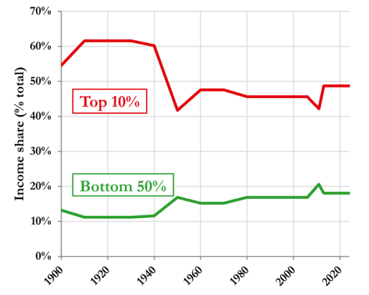

_**Interpretation:**_ The Top 10% income share is equal to 49% in 2024. Income is measured after the operation of pensions and unemployment insurance systems and before income tax. _**Sources and series:**_ wir2026.wid.world/methodology. 

159 

Country-sheets 

## **ARGENTINA** 

� 45,851,378 **||** � e1,568 (avg. monthly income, PPP) 

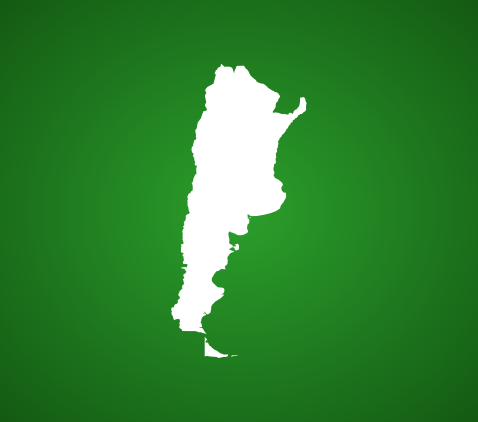

## **Inequality in Argentina** 

In Argentina, inequality remains significant but has narrowed slightly over the past decade. The top 10% earn about 45% of total income, while the bottom 50% capture just 12%. Wealth concentration is similarly high, with the richest 10% holding nearly 60% of total wealth and the top 1% close to one quarter. The income gap between the top and bottom halves of the population increased from 32 to 36.8 between 2014 and 2024, reflecting moderate worsening. Average wealth per capita is around 52,000 euros (PPP), but distribution remains skewed. Female labor participation stands at 37.7%, showing modest progress compared with a decade earlier. Overall, inequality levels remain high despite these gradual changes. 

**Table 1:** _**Inequality outlook – Argentina**_ 

||**Income**|**Income**|**Wealth**|**Wealth**|
|---|---|---|---|---|
||**Avg.** **Income** **(PPP €)**|**Share** **of** **total(%)**|**Avg.** **Wealth** **(PPP €)**|**Share** **of** **total(%)**|
|**Full** **pop.**|18,826|100.0%|51,922|100.0%|
|**Bottom** **50%**|2,311|12.2%|2,440|4.7%|
|**Middle** **40%**|20,086|42.7%|47,509|36.6%|
|**Top** **10%**|84,922|45.1%|304,784|58.7%|
|**Top** **1%**|340,802|18.1%|1,256,519|24.2%|
|**Year**|||**2014**|**2024**|
|**Top 10% to Bot. 50%** **Income gap**|||32.0|36.8|
|**Female labor share**|||35.7%|37.7%|

_**Interpretation:**_ Country has a transparency index of 7/20. PPP conversion factor for 2024 used because recent volatility in prices in Argentina. All values are estimated at per capita (full population) level. See glossary for all definitions of concepts and indicators. _**Sources and series:**_ wir2026.wid.world/methodology. 

**Figure 1:** _**Top 10% and bottom 50% income shares in Argentina, 1900-2024**_ 

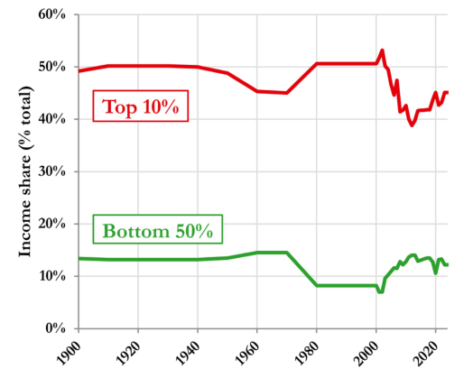

_**Interpretation:**_ The Top 10% income share is equal to 45% in 2024. Income is measured after the operation of pensions and unemployment insurance systems and before income tax. _**Sources and series:**_ wir2026.wid.world/methodology. 

160 

Country-sheets 

## **AUSTRALIA** 

� 26,974,026 **||** � e3,325 (avg. monthly income, PPP) 

**Table 1:** _**Inequality outlook – Australia**_ 

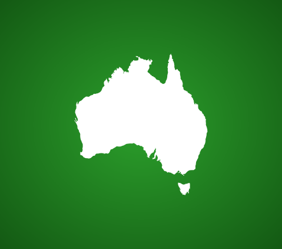

||**Income**|**Income**|**Wealth**|**Wealth**|
|---|---|---|---|---|
||**Avg.** **Income** **(PPP €)**|**Share** **of** **total(%)**|**Avg.** **Wealth** **(PPP €)**|**Share** **of** **total(%)**|
|**Full** **pop.**|39,905|100.0%|271,301|100.0%|
|**Bottom** **50%**|6,862|17.1%|13,294|4.9%|
|**Middle** **40%**|47,618|47.7%|256,379|37.8%|
|**Top** **10%**|140,309|35.2%|1,554,554|57.3%|
|**Top** **1%**|436,790|10.9%|6,321,312|23.3%|
|**Year**|||**2014**|**2024**|
|**Top 10% to Bot. 50%** **Income gap**|||19.9|20.4|
|**Female labor share**|||35.8%|41.6%|

## **Inequality in Australia** 

_**Interpretation:**_ Country has a transparency index of 9/20. All values are estimated at per capita (full population) level. See glossary for all definitions of concepts and indicators. _**Sources and series:**_ wir2026.wid.world/methodology. 

In Australia, inequality remains moderate by global standards but persists across income and wealth dimensions. The top 10% earn about one third of total income, while the bottom 50% receive just 17%. Wealth inequality is more pronounced, with the top 10% holding nearly 60% of total wealth and the top 1% close to one quarter. The income gap between the richest and poorest halves of the population was steady from 19.9 to 20.4 between 2014 and 2024. Average income per capita is around 40,000 euros (PPP), supported by relatively high labor participation. Female labor share increased to 41.6%, showing notable progress over the past decade. While Australia maintains a comparatively even distribution within advanced economies, asset concentration remains substantial. 

**Figure 1:** _**Top 10% and bottom 50% income shares in Australia, 1900-2024**_ 

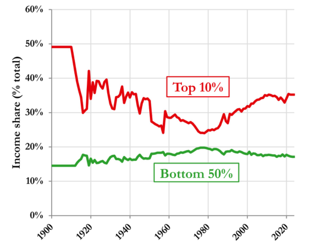

_**Interpretation:**_ The Top 10% income share is equal to 35% in 2024. Income is measured after the operation of pensions and unemployment insurance systems and before income tax. _**Sources and series:**_ wir2026.wid.world/methodology. 

161 

Country-sheets 

## **BANGLADESH** 

� 175,686,899 **||** � e512 (avg. monthly income, PPP) 

## **Inequality in Bangladesh** 

In Bangladesh, inequality remains moderate and has shown little change over the past decade. The top 10% of earners receive about 41% of national income, while the bottom 50% capture only 19%. Wealth is more unevenly distributed, with the richest 10% holding around 58% of total wealth and the top 1% nearly one quarter. The income gap between the top and bottom halves of the population decreased slightly from 22 to 21 between 2014 and 2024, suggesting stable inequality levels. Average income per capita stands at roughly 6,100 euros (PPP), and average wealth at 30,000 euros (PPP). Female labor participation remains low at 22.3%, indicating persistent gender disparities in economic activity. Overall, inequality patterns in Bangladesh have remained broadly unchanged, with limited progress toward a more balanced income and wealth distribution. 

**Table 1:** _**Inequality outlook – Bangladesh**_ 

||**Income**|**Income**|**Wealth**|**Wealth**|
|---|---|---|---|---|
||**Avg.** **Income** **(PPP €)**|**Share** **of** **total(%)**|**Avg.** **Wealth** **(PPP €)**|**Share** **of** **total(%)**|
|**Full** **pop.**|6,152|100.0%|30,261|100.0%|
|**Bottom** **50%**|1,178|19.0%|1,422|4.7%|
|**Middle** **40%**|6,084|39.6%|27,916|36.9%|
|**Top** **10%**|25,466|41.4%|176,724|58.4%|
|**Top** **1%**|97,029|15.8%|723,238|23.9%|
|**Year**|||**2014**|**2024**|
|**Top 10% to Bot. 50%** **Income gap**|||22.3|21.6|
|**Female labor share**|||22.3%|22.3%|

_**Interpretation:**_ Country has a transparency index of 3/20. All values are estimated at per capita (full population) level. See glossary for all definitions of concepts and indicators. _**Sources and series:**_ wir2026.wid.world/methodology. 

**Figure 1:** _**Top 10% and bottom 50% income shares in Bangladesh, 1980-2024**_ 

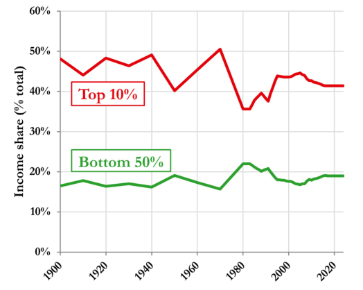

_**Interpretation:**_ The Top 10% income share is equal to 41% in 2024. Income is measured after the operation of pensions and unemployment insurance systems and before income tax. _**Sources and series:**_ wir2026.wid.world/methodology. 

162 

Country-sheets 

## **BRAZIL** 

� 212,812,405 **||** � e1,045 (avg. monthly income, PPP) 

**Table 1:** _**Inequality outlook – Brazil**_ 

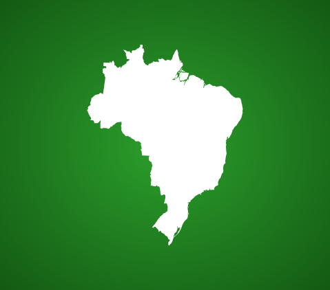

||**Income**|**Income**|**Wealth**|**Wealth**|
|---|---|---|---|---|
||**Avg.** **Income** **(PPP €)**|**Share** **of** **total(%)**|**Avg.** **Wealth** **(PPP €)**|**Share** **of** **total(%)**|
|**Full** **pop.**|12,542|100.0%|46,047|100.0%|
|**Bottom** **50%**|1,167|9.3%|1,105|2.4%|
|**Middle** **40%**|9,916|31.6%|31,772|27.6%|
|**Top** **10%**|74,143|59.1%|322,789|70.1%|
|**Top** **1%**|332,335|26.5%|1,703,738|37.0%|
|**Year**|||**2014**|**2024**|
|**Top 10% to Bot. 50%** **Income gap**|||53.7|63.5|
|**Female labor share**|||37.3%|37.4%|

## **Inequality in Brazil Remains Among the World’s Highest** 

_**Interpretation:**_ Country has a transparency index of 6/20. All values are estimated at per capita (full population) level. See glossary for all definitions of concepts and indicators. _**Sources and series:**_ wir2026.wid.world/methodology. 

In Brazil, inequality remains among the highest globally and has widened slightly over the past decade. The top 10% capture about 59% of national income, while the bottom 50% receive only 9%. Wealth concentration is even stronger, with the richest 10% holding 70% of total wealth and the top 1% over one third. The income gap between the top and bottom halves of the population increased from 53 to 63 between 2014 and 2024, underscoring persistent disparities. Average income per capita stands around 12,500 euros (PPP), and average wealth about 46,000 euros (PPP). Female labor participation is stable at 37.4%, showing limited change. Overall, inequality in Brazil remains entrenched across income, wealth, and gender dimensions. 

**Figure 1:** _**Top 10% and bottom 50% income shares in Brazil, 1900-2024**_ 

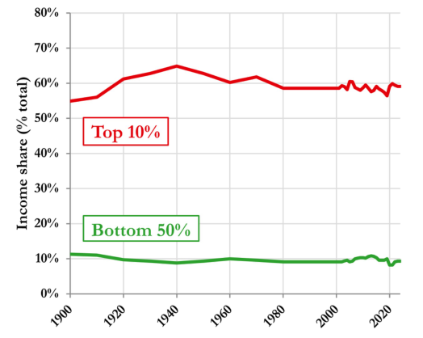

_**Interpretation:**_ The Top 10% income share is equal to 59% in 2024. Income is measured after the operation of pensions and unemployment insurance systems and before income tax. _**Sources and series:**_ wir2026.wid.world/methodology. 

163 

Country-sheets 

## **CANADA** 

� 40,126,723 **||** � e3,262 (avg. monthly income, PPP) 

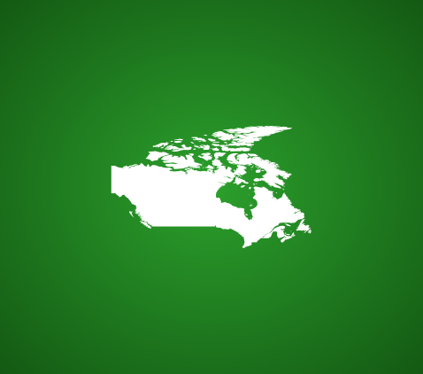

## **Inequality in Canada** 

In Canada, inequality remains moderate by international standards, with limited change over the past decade. The top 10% earn around 34% of national income, while the bottom 50% receive about 17%. Wealth disparities are wider, with the richest 10% holding nearly 59% of total wealth and the top 1% close to one quarter. The income gap between the top and bottom halves of the population has stayed broadly stable, moving from 20.4 to 19.8 between 2014 and 2024. Average income per capita is about 39,000 euros (PPP), and average wealth exceeds 237,000 euros (PPP). Female labor participation increased from 38% to 43.6%, marking steady progress toward greater gender balance. Overall, inequality in Canada remains contained, though wealth concentration continues to outpace income equality. 

**Table 1:** _**Inequality outlook – Canada**_ 

||**Income**|**Income**|**Wealth**|**Wealth**|
|---|---|---|---|---|
||**Avg.** **Income** **(PPP €)**|**Share** **of** **total(%)**|**Avg.** **Wealth** **(PPP €)**|**Share** **of** **total(%)**|
|**Full** **pop.**|39,145|100.0%|237,675|100.0%|
|**Bottom** **50%**|6,633|16.9%|32,799|13.8%|
|**Middle** **40%**|48,555|49.6%|152,706|25.7%|
|**Top** **10%**|131,233|33.5%|1,435,555|60.4%|
|**Top** **1%**|369,754|9.4%|6,963,867|29.3%|
|**Year**|||**2014**|**2024**|
|**Top 10% to Bot. 50%** **Income gap**|||20.4|19.8|
|**Female labor share**|||38.0%|43.6%|

_**Interpretation:**_ Country has a transparency index of 9/20. All values are estimated at per capita (full population) level. See glossary for all definitions of concepts and indicators. _**Sources and series:**_ wir2026.wid.world/methodology. 

**Figure 1:** _**Top 10% and bottom 50% income shares in Canada, 1900-2024**_ 

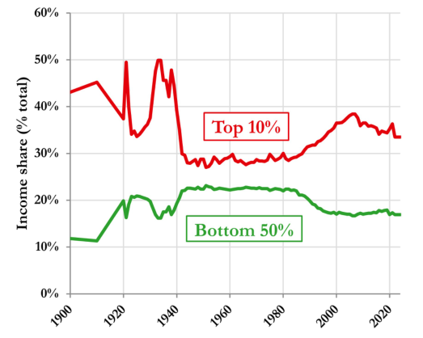

_**Interpretation:**_ The Top 10% income share is equal to 36% in 2024. Income is measured after the operation of pensions and unemployment insurance systems and before income tax. _**Sources and series:**_ wir2026.wid.world/methodology. 

164 

Country-sheets 

## **CHILE** 

� 19,859,921 **||** � e1,553 (avg. monthly income, PPP) 

## **Inequality in Chile** 

In Chile, inequality remains high but has declined noticeably since 2014. The top 10% of earners capture around 60% of total income, while the bottom 50% receive 8.2%. Wealth concentration is even steeper, with the richest 10% holding 69% of total wealth and the top 1% over one third. The income gap between the top 10% and the bottom 50% narrowed from 89.8 to 72.3 between 2014 and 2024, reflecting progress in reducing disparities. Average income per capita is about 19,000 euros (PPP), and average wealth exceeds 75,000 euros (PPP). Female labor participation increased from 35.6% to 37.3%, showing gradual improvement. Despite these advances, inequality in Chile remains high by international comparison. 

**Table 1:** _**Inequality outlook – Chile**_ 

||**Income**|**Income**|**Wealth**|**Wealth**|
|---|---|---|---|---|
||**Avg.** **Income** **(PPP €)**|**Share** **of** **total(%)**|**Avg.** **Wealth** **(PPP €)**|**Share** **of** **total(%)**|
|**Full** **pop.**|18,643|100.0%|75,205|100.0%|
|**Bottom** **50%**|1,533|8.2%|1,955|2.6%|
|**Middle** **40%**|15,078|32.4%|52,644|28.0%|
|**Top** **10%**|110,867|59.5%|521,925|69.4%|
|**Top** **1%**|497,958|26.7%|2,752,515|36.6%|
|**Year**|||**2014**|**2024**|
|**Top 10% to Bot. 50%** **Income gap**|||89.8|72.3|
|**Female labor share**|||35.6%|37.3%|

_**Interpretation:**_ Country has a transparency index of 8/20. All values are estimated at per capita (full population) level. See glossary for all definitions of concepts and indicators. _**Sources and series:**_ wir2026.wid.world/methodology. 

**Figure 1:** _**Top 10% and bottom 50% income shares in Chile, 1900-2024**_ 

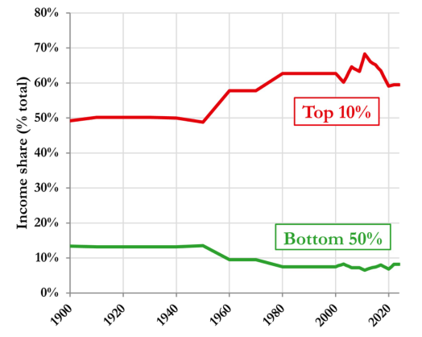

_**Interpretation:**_ The Top 10% income share is equal to 60% in 2024. Income is measured after the operation of pensions and unemployment insurance systems and before income tax. _**Sources and series:**_ wir2026.wid.world/methodology. 

165 

Country-sheets 

## **CHINA** 

� 1,416,096,094 **||** � e1,199 (avg. monthly income, PPP) 

**Table 1:** _**Inequality outlook – China**_ 

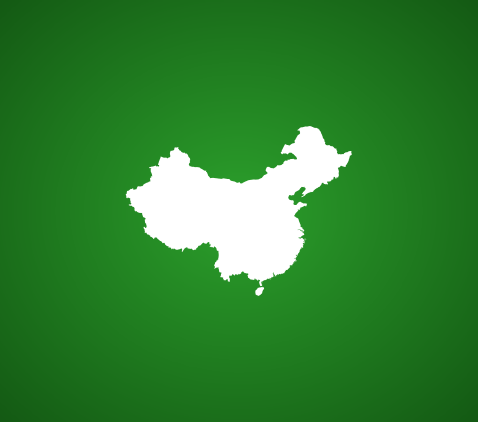

||**Income**|**Income**|**Wealth**|**Wealth**|
|---|---|---|---|---|
||**Avg.** **Income** **(PPP €)**|**Share** **of** **total(%)**|**Avg.** **Wealth** **(PPP €)**|**Share** **of** **total(%)**|
|**Full** **pop.**|14,396|100.0%|86,462|100.0%|
|**Bottom** **50%**|1,988|13.7%|5,447|6.3%|
|**Middle** **40%**|15,447|42.9%|55,768|25.8%|
|**Top** **10%**|62,392|43.3%|587,074|67.9%|
|**Top** **1%**|226,305|15.7%|2,611,141|30.2%|
|**Year**|||**2014**|**2024**|
|**Top 10% to Bot. 50%** **Income gap**|||28.8|31.4|
|**Female labor share**|||34.4%|34.6%|

## **Inequality in China Stabilizes** 

_**Interpretation:**_ Country has a transparency index of 7/20. All values are estimated at per capita (full population) level. See glossary for all definitions of concepts and indicators. _**Sources and series:**_ wir2026.wid.world/methodology. 

In China, inequality remains high but has leveled off after decades of sharp increases. The top 10% of earners capture about 43% of national income, while the bottom 50% receive just 14%. Wealth disparities are particularly large, with the richest 10% holding nearly 68% of total wealth and the top 1% about 30%. The income gap between the top 10% and the bottom 50% widened slightly from 29 to 31 between 2014 and 2024, signaling continued polarization despite slower growth in inequality overall. Average income per capita stands near 14,500 euros (PPP), and average wealth exceeds 86,000 euros (PPP). Female labor participation remains stable at 34.6%, showing no significant improvement. After years of widening divides, inequality in China now appears to have reached a plateau, though at a high level by global standards. 

**Figure 1:** _**Top 10% and bottom 50% income shares in China, 1900-2024**_ 

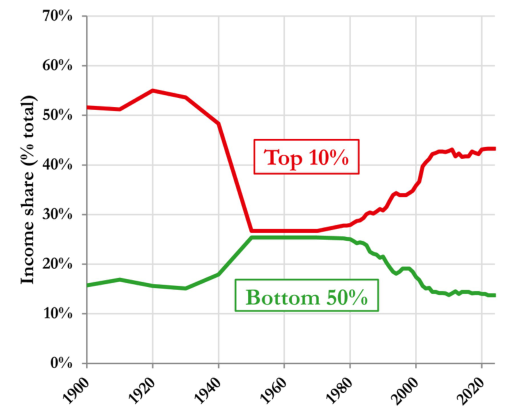

_**Interpretation:**_ The Top 10% income share is equal to 43% in 2024. Income is measured after the operation of pensions and unemployment insurance systems and before income tax. _**Sources and series:**_ wir2026.wid.world/methodology. 

166 

Country-sheets 

## **COLOMBIA** 

� 53,425,635 **||** � e1,015 (avg. monthly income, PPP) 

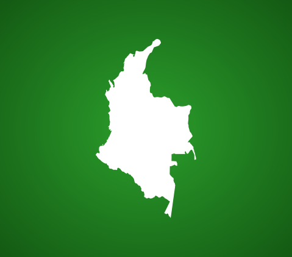

## **Inequality in Colombia** 

In Colombia, inequality remains very high and has increased over the past decade. The top 10% of earners capture about 60% of total income, while the bottom 50% receive around 7%. Wealth concentration is even greater, with the richest 10% holding around 71% of total wealth and the top 1% nearly 38%. The income gap between the top 10% and the bottom 50% widened from 59 to 90 between 2014 and 2024, reflecting stronger polarization. Average income per capita is roughly 12,000 euros (PPP), while average wealth sits at 39,000 euros (PPP). Female labor participation increased from 36.2% to 39.4%, showing gradual improvement. Inequality in Colombia remains among the highest globally, with limited signs of convergence. 

**Table 1:** _**Inequality outlook – Colombia**_ 

||**Income**|**Income**|**Wealth**|**Wealth**|
|---|---|---|---|---|
||**Avg.** **Income** **(PPP €)**|**Share** **of** **total(%)**|**Avg.** **Wealth** **(PPP €)**|**Share** **of** **total(%)**|
|**Full** **pop.**|12,188|100.0%|39,063|100.0%|
|**Bottom** **50%**|809|6.6%|859|2.2%|
|**Middle** **40%**|10,194|33.5%|26,367|27.0%|
|**Top** **10%**|73,049|59.9%|276,954|70.9%|
|**Top** **1%**|273,634|22.5%|1,480,471|37.9%|
|**Year**|||**2014**|**2024**|
|**Top 10% to Bot. 50%** **Income gap**|||59.4|90.3|
|**Female labor share**|||36.2%|39.4%|

_**Interpretation:**_ Country has a transparency index of 10/20. All values are estimated at per capita (full population) level. See glossary for all definitions of concepts and indicators. 

_**Sources and series:**_ wir2026.wid.world/methodology. 

**Figure 1:** _**Top 10% and bottom 50% income shares in Colombia, 1900-2024**_ 

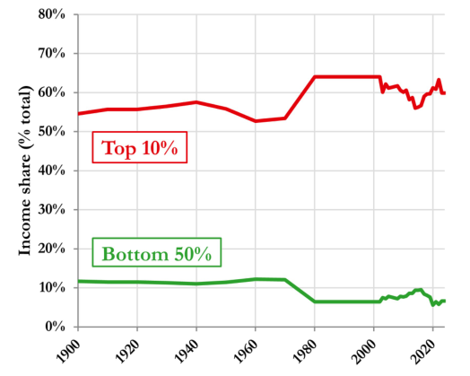

_**Interpretation:**_ The Top 10% income share is equal to 60% in 2024. Income is measured after the operation of pensions and unemployment insurance systems and before income tax. _**Sources and series:**_ wir2026.wid.world/methodology. 

167 

Country-sheets 

## **DENMARK** 

� 6,002,507 **||** � e4,118 (avg. monthly income, PPP) 

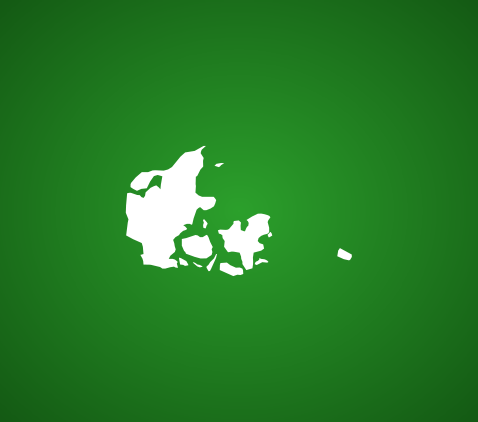

## **Inequality in Denmark** 

In Denmark, inequality remains low by global standards and has changed little over the past decade. The top 10% of earners capture about 33% of total income, while the bottom 50% receive around 23%. Wealth inequality is more pronounced, with the richest 10% holding roughly half of total wealth and the top 1% about one fifth. The income gap between the top 10% and the bottom 50% did not change between 2014 and 2024, indicating stable equality across groups. Average income per capita is approximately 49,000 euros (PPP), and average wealth exceeds 261,000 euros (PPP). Female labor participation remains high at 41.8%, showing continued balance in income distribution. Overall, Denmark maintains one of the most equal income structures among high-income countries. 

**Table 1:** _**Inequality outlook – Denmark**_ 

||**Income**|**Income**|**Wealth**|**Wealth**|
|---|---|---|---|---|
||**Avg.** **Income** **(PPP €)**|**Share** **of** **total(%)**|**Avg.** **Wealth** **(PPP €)**|**Share** **of** **total(%)**|
|**Full** **pop.**|49,424|100.0%|261,229|100.0%|
|**Bottom** **50%**|11,350|22.8%|10,710|4.1%|
|**Middle** **40%**|54,718|44.3%|299,107|45.8%|
|**Top** **10%**|162,438|32.9%|1,308,758|50.1%|
|**Top** **1%**|604,339|12.2%|5,355,195|20.5%|
|**Year**|||**2014**|**2024**|
|**Top 10% to Bot. 50%** **Income gap**|||14.3|14.3|
|**Female labor share**|||43.1%|41.8%|

_**Interpretation:**_ Country has a transparency index of 13/20. All values are estimated at per capita (full population) level. See glossary for all definitions of concepts and indicators. 

_**Sources and series:**_ wir2026.wid.world/methodology. 

**Figure 1:** _**Top 10% and bottom 50% income shares in Denmark, 1900-2024**_ 

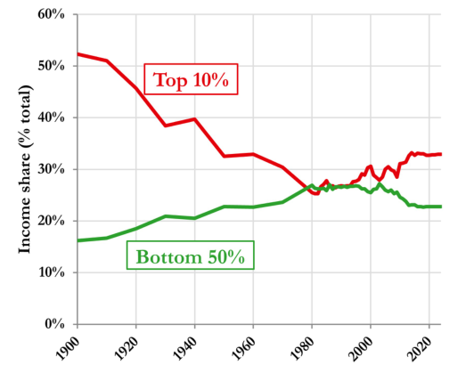

_**Interpretation:**_ The Top 10% income share is equal to 33% in 2024. Income is measured after the operation of pensions and unemployment insurance systems and before income tax. _**Sources and series:**_ wir2026.wid.world/methodology. 

168 

Country-sheets 

## **EGYPT** 

� 118,365,995 **||** � e1,047 (avg. monthly income, PPP) 

**Table 1:** _**Inequality outlook – Egypt**_ 

||**Income**|**Income**|**Wealth**|**Wealth**|
|---|---|---|---|---|
||**Avg.** **Income** **(PPP €)**|**Share** **of** **total(%)**|**Avg.** **Wealth** **(PPP €)**|**Share** **of** **total(%)**|
|**Full** **pop.**|12,568|100.0%|30,393|100.0%|
|**Bottom** **50%**|2,271|18.0%|1,276|4.2%|
|**Middle** **40%**|10,725|34.1%|25,986|34.2%|
|**Top** **10%**|60,177|47.9%|187,218|61.6%|
|**Top** **1%**|233,458|18.6%|844,912|27.8%|
|**Year**|||**2014**|**2024**|
|**Top 10% to Bot. 50%** **Income gap**|||29.4|26.5|
|**Female labor share**|||20.7%|18.5%|

## **Inequality in Egypt** 

_**Interpretation:**_ Country has a transparency index of 3/20. All values are estimated at per capita (full population) level. See glossary for all definitions of concepts and indicators. _**Sources and series:**_ wir2026.wid.world/methodology. 

In Egypt, inequality remains pronounced but has declined modestly over the past decade. The top 10% of earners capture nearly 48% of total income, while the bottom 50% receive around 18%. Wealth inequality is considerably higher, with the richest 10% holding about 62% of total wealth and the top 1% close to 28%. The income gap between the top 10% and the bottom 50% fell from 29 to 26 between 2014 and 2024, indicating slight improvement in distribution. Average income per capita stands near 13,000 euros (PPP), while average wealth is about 30,000 euros (PPP). Female labor participation decreased from 20.7% to 18.5%, reflecting persistent gender imbalances in employment. Despite recent gains in income equality, overall disparities in wealth and labor outcomes remain substantial. 

**Figure 1:** _**Top 10% and bottom 50% income shares in Egypt, 1900-2024**_ 

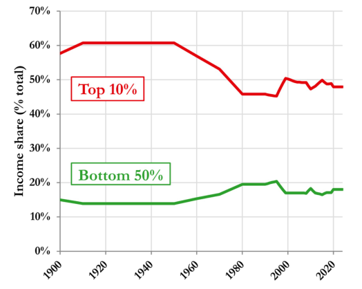

_**Interpretation:**_ The Top 10% income share is equal to 48% in 2024. Income is measured after the operation of pensions and unemployment insurance systems and before income tax. _**Sources and series:**_ wir2026.wid.world/methodology. 

169 

Country-sheets 

## **FRANCE** 

� 68,898,112 **||** � e2,944 (avg. monthly income, PPP) 

**Table 1:** _**Inequality outlook – France**_ 

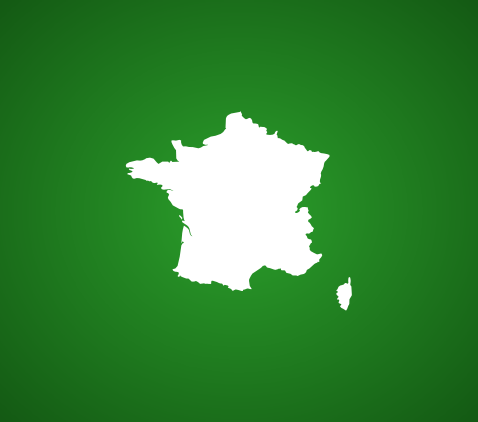

||**Income**|**Income**|**Wealth**|**Wealth**|
|---|---|---|---|---|
||**Avg.** **Income** **(PPP €)**|**Share** **of** **total(%)**|**Avg.** **Wealth** **(PPP €)**|**Share** **of** **total(%)**|
|**Full** **pop.**|35,336|100.0%|203,373|100.0%|
|**Bottom** **50%**|7,238|20.4%|9,965|4.9%|
|**Middle** **40%**|40,299|45.6%|179,985|35.4%|
|**Top** **10%**|120,145|34.0%|1,214,134|59.7%|
|**Top** **1%**|417,119|11.8%|5,572,407|27.4%|
|**Year**|||**2014**|**2024**|
|**Top 10% to Bot. 50%** **Income gap**|||15.2|16.6|
|**Female labor share**|||40.5%|42.6%|

## **France: Stable Inequality, Persistent Wealth Gaps** 

_**Interpretation:**_ Country has a transparency index of 15/20. All values are estimated at per capita (full population) level. See glossary for all definitions of concepts and indicators. 

In France, inequality remains moderate and has shown little change over the past decade. The top 10% of earners receive around 34% of national income, while the bottom 50% account for about 20%. Wealth inequality is considerably higher, with the richest 10% holding roughly 60% of total wealth and the top 1% around 27%. The income gap between the top 10% and the bottom 50% increased slightly from 15 to 16 between 2014 and 2024, suggesting relative stability in income distribution. Average income per capita is approximately 35,000 euros (PPP), and average wealth stands at 203,000 euros (PPP). Female labor participation rose from 40.5% to 42.6%, continuing a gradual upward trend. Overall, France maintains comparatively balanced income levels, though wealth concentration remains high. 

_**Sources and series:**_ wir2026.wid.world/methodology. 

**Figure 1:** _**Top 10% and bottom 50% income shares in France, 1900-2024**_ 

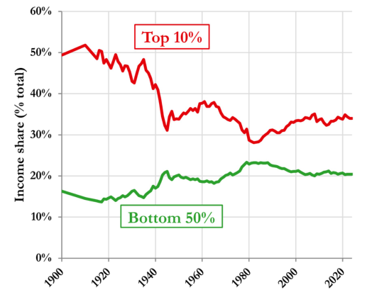

_**Interpretation:**_ The Top 10% income share is equal to 34% in 2024. Income is measured after the operation of pensions and unemployment insurance systems and before income tax. _**Sources and series:**_ wir2026.wid.world/methodology. 

170 

Country-sheets 

## **GERMANY** 

� 84,075,075 **||** � e3,327 (avg. monthly income, PPP) 

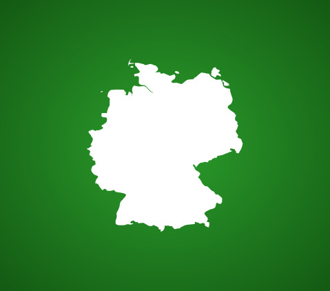

## **Inequality in Germany** 

In Germany, inequality remains moderate and has shown little change in recent years. The top 10% of earners receive around 37% of total income, while the bottom 50% capture about 19%. Wealth inequality is much higher, with the richest 10% holding roughly 58% of total wealth and the top 1% around 28%. The income gap between the top 10% and the bottom 50% declined slightly from 21 to 20 between 2014 and 2024, indicating mild convergence. Average income per capita stands near 40,000 euros (PPP), while average wealth reaches about 250,000 euros (PPP). Female labor participation increased modestly from 35.7% to 36.9%, showing gradual progress. Overall, inequality in Germany remains contained, though wealth concentration continues to outweigh income equality. 

**Table 1:** _**Inequality outlook – Germany**_ 

||**Income**|**Income**|**Wealth**|**Wealth**|
|---|---|---|---|---|
||**Avg.** **Income** **(PPP €)**|**Share** **of** **total(%)**|**Avg.** **Wealth** **(PPP €)**|**Share** **of** **total(%)**|
|**Full** **pop.**|39,926|100.0%|247,567|100.0%|
|**Bottom** **50%**|7,673|19.1%|8,417|3.4%|
|**Middle** **40%**|43,305|43.4%|236,426|38.2%|
|**Top** **10%**|149,684|37.5%|1,445,789|58.4%|
|**Top** **1%**|528,983|13.2%|6,857,593|27.7%|
|**Year**|||**2014**|**2024**|
|**Top 10% to Bot. 50%** **Income gap**|||20.5|19.5|
|**Female labor share**|||35.7%|36.9%|

_**Interpretation:**_ Country has a transparency index of 13/20. All values are estimated at per capita (full population) level. See glossary for all definitions of concepts and indicators. 

_**Sources and series:**_ wir2026.wid.world/methodology. 

**Figure 1:** _**Top 10% and bottom 50% income shares in Germany, 1900-2024**_ 

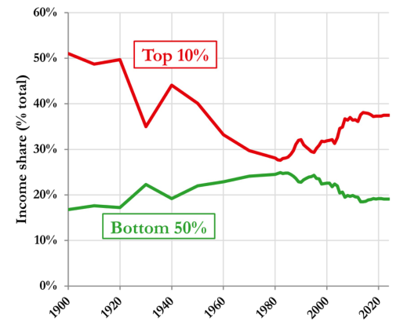

_**Interpretation:**_ The Top 10% income share is equal to 37% in 2024. Income is measured after the operation of pensions and unemployment insurance systems and before income tax. _**Sources and series:**_ wir2026.wid.world/methodology. 

171 

Country-sheets 

## **HUNGARY** 

� 9,632,287 **||** � e2,046 (avg. monthly income, PPP) 

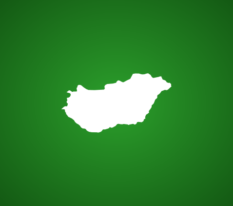

## **Inequality in Hungary** 

In Hungary, inequality remains moderate and largely stable over the past decade. The top 10% of earners receive about 33% of total income, while the bottom 50% capture roughly 23%. Wealth inequality is considerably higher, with the richest 10% holding around 67% of total wealth and the top 1% one third. The income gap between the top 10% and the bottom 50% changed little, moving from 13.6 to 14.2 between 2014 and 2024, reflecting persistent distributional patterns. Average income per capita stands near 25,000 euros (PPP), and average wealth around 94,000 euros (PPP). Female labor participation rose slightly from 43.2% to 43.3%, continuing a gradual upward trend. Overall, Hungary maintains a relatively balanced income structure, though wealth concentration remains significant. 

**Table 1:** _**Inequality outlook – Hungary**_ 

||**Income**|**Income**|**Wealth**|**Wealth**|
|---|---|---|---|---|
||**Avg.** **Income** **(PPP €)**|**Share** **of** **total(%)**|**Avg.** **Wealth** **(PPP €)**|**Share** **of** **total(%)**|
|**Full** **pop.**|24,554|100.0%|94,142|100.0%|
|**Bottom** **50%**|5,683|23.0%|3,672|3.9%|
|**Middle** **40%**|27,118|44.2%|68,017|28.9%|
|**Top** **10%**|80,521|32.8%|631,691|67.1%|
|**Top** **1%**|280,196|11.4%|3,134,921|33.3%|
|**Year**|||**2014**|**2024**|
|**Top 10% to Bot. 50%** **Income gap**|||13.6|14.2|
|**Female labor share**|||43.2%|43.3%|

_**Interpretation:**_ Country has a transparency index of 5.5/20. All values are estimated at per capita (full population) level. See glossary for all definitions of concepts and indicators. 

_**Sources and series:**_ wir2026.wid.world/methodology. 

**Figure 1:** _**Top 10% and bottom 50% income shares in Hungary, 1980-2024**_ 

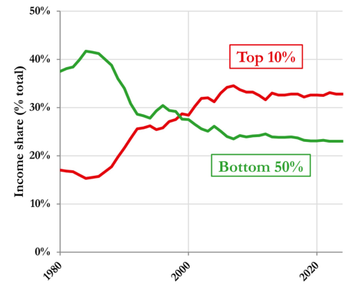

_**Interpretation:**_ The Top 10% income share is equal to 33% in 2024. Income is measured after the operation of pensions and unemployment insurance systems and before income tax. _**Sources and series:**_ wir2026.wid.world/methodology. 

172 

Country-sheets 

## **INDIA** 

� 1,463,865,525 **||** � e518 (avg. monthly income, PPP) 

**Table 1:** _**Inequality outlook – India**_ 

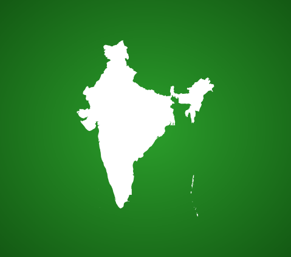

||**Income**|**Income**|**Wealth**|**Wealth**|
|---|---|---|---|---|
||**Avg.** **Income** **(PPP €)**|**Share** **of** **total(%)**|**Avg.** **Wealth** **(PPP €)**|**Share** **of** **total(%)**|
|**Full** **pop.**|6,224|100.0%|28,141|100.0%|
|**Bottom** **50%**|940|15.0%|1,801|6.4%|
|**Middle** **40%**|4,247|27.3%|20,120|28.6%|
|**Top** **10%**|35,901|57.7%|182,913|65.0%|
|**Top** **1%**|140,649|22.6%|1,128,435|40.1%|
|**Year**|||**2014**|**2024**|
|**Top 10% to Bot. 50%** **Income gap**|||38.0|38.2|
|**Female labor share**|||15.7%|15.7%|

## **Inequality in India Among Highest in the World, Low Average Income** 

_**Interpretation:**_ Country has a transparency index of 4/20. All values are estimated at per capita (full population) level. See glossary for all definitions of concepts and indicators. _**Sources and series:**_ wir2026.wid.world/methodology. 

In India, inequality remains among the highest in the world and has shown little movement in recent years. The top 10% of earners capture about 58% of national income, while the bottom 50% receive only 15%. Wealth inequality is even greater, with the richest 10% holding around 65% of total wealth and the top 1% about 40%. The income gap between the top 10% and the bottom 50% remained stable between 2014 and 2024. Average annual income per capita is around 6,200 euros (PPP), and average wealth stands at about 28,000 euros (PPP). Female labor participation remains very low at 15.7%, showing no improvement over the past decade. Overall, inequality in India remains deeply entrenched across income, wealth, and gender dimensions, highlighting persistent structural divides within the economy. 

**Figure 1:** _**Top 10% and bottom 50% income shares in India, 1900-2024**_ 

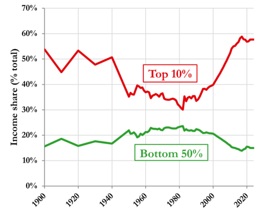

_**Interpretation:**_ The Top 10% income share is equal to 58% in 2024. Income is measured after the operation of pensions and unemployment insurance systems and before income tax. _**Sources and series:**_ wir2026.wid.world/methodology. 

173 

Country-sheets 

## **INDONESIA** 

� 285,721,236 **||** � e750 (avg. monthly income, PPP) 

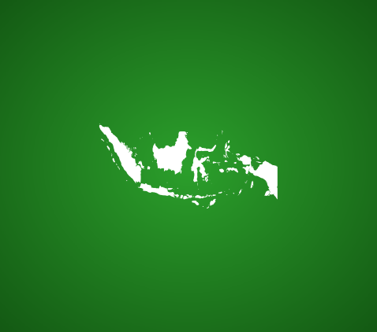

## **Inequality in Indonesia** 

In Indonesia, inequality remains high but relatively stable over the past decade. The top 10% of earners receive around 46% of total income, while the bottom 50% capture just 14%. Wealth is even more concentrated, with the richest 10% holding about 59% of total wealth and the top 1% close to 20%. The income gap between the top 10% and the bottom 50% widened somewhat from 25 to 33 between 2014 and 2024, indicating a modest rise in disparities. Average income per capita stands near 9,000 euros (PPP), while average wealth is about 37,000 euros (PPP). Female labor participation increased slightly from 27.6% to 29.2%, reflecting limited progress in gender inclusion. Overall, inequality in Indonesia remains persistent across income, wealth, and gender outcomes. 

**Table 1:** _**Inequality outlook – Indonesia**_ 

||**Income**|**Income**|**Wealth**|**Wealth**|
|---|---|---|---|---|
||**Avg.** **Income** **(PPP €)**|**Share** **of** **total(%)**|**Avg.** **Wealth** **(PPP €)**|**Share** **of** **total(%)**|
|**Full** **pop.**|9,003|100.0%|37,098|100.0%|
|**Bottom** **50%**|1,236|13.7%|927|2.5%|
|**Middle** **40%**|9,032|40.1%|35,243|38.0%|
|**Top** **10%**|41,603|46.2%|220,361|59.4%|
|**Top** **1%**|158,462|17.6%|738,245|19.9%|
|**Year**|||**2014**|**2024**|
|**Top 10% to Bot. 50%** **Income gap**|||25.0|33.7|
|**Female labor share**|||27.6%|29.2%|

_**Interpretation:**_ Country has a transparency index of 6/20. All values are estimated at per capita (full population) level. See glossary for all definitions of concepts and indicators. _**Sources and series:**_ wir2026.wid.world/methodology. 

**Figure 1:** _**Top 10% and bottom 50% income shares in Indonesia, 1900-2024**_ 

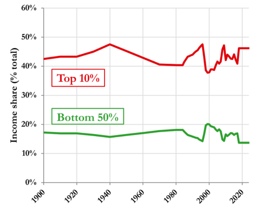

_**Interpretation:**_ The Top 10% income share is equal to 46% in 2024. Income is measured after the operation of pensions and unemployment insurance systems and before income tax. _**Sources and series:**_ wir2026.wid.world/methodology. 

174 

Country-sheets 

## **IRAN** 

� 92,417,681 **||** � e749 (avg. monthly income, PPP) 

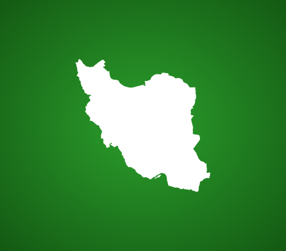

## **Inequality in Iran** 

In Iran, inequality remains high and has slightly increased over the past decade. The top 10% of earners capture about 56% of total income, while the bottom 50% receive only 18%. Wealth inequality is more extreme, with the richest 10% holding nearly 63% of total wealth and the top 1% around 29%. The income gap between the top 10% and the bottom 50% fell from 30 to 26 between 2014 and 2024, reflecting shrinking disparities. Average income per capita stands near 9,000 euros (PPP), and average wealth is around 31,000 euros (PPP). Female labor participation remains very low at 7.2%, showing almost no progress in a decade. Overall, inequality in Iran persists across income, wealth, and gender, with limited signs of improvement. 

**Table 1:** _**Inequality outlook – Iran**_ 

||**Income**|**Income**|**Wealth**|**Wealth**|
|---|---|---|---|---|
||**Avg.** **Income** **(PPP €)**|**Share** **of** **total(%)**|**Avg.** **Wealth** **(PPP €)**|**Share** **of** **total(%)**|
|**Full** **pop.**|8,995|100.0%|31,117|100.0%|
|**Bottom** **50%**|1,622|17.9%|1,214|3.9%|
|**Middle** **40%**|8,128|36.1%|25,671|33.0%|
|**Top** **10%**|41,301|45.9%|196,348|63.1%|
|**Top** **1%**|146,590|16.3%|902,391|29.0%|
|**Year**|||**2014**|**2024**|
|**Top 10% to Bot. 50%** **Income gap**|||29.8|25.5|
|**Female labor share**|||5.9%|7.2%|

_**Interpretation:**_ Country has a transparency index of 3/20. All values are estimated at per capita (full population) level. See glossary for all definitions of concepts and indicators. _**Sources and series:**_ wir2026.wid.world/methodology. 

**Figure 1:** _**Top 10% and bottom 50% income shares in Iran, 1980-2024**_ 

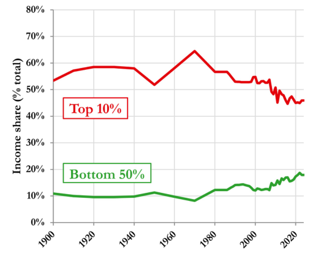

_**Interpretation:**_ The Top 10% income share is equal to 46% in 2024. Income is measured after the operation of pensions and unemployment insurance systems and before income tax. _**Sources and series:**_ wir2026.wid.world/methodology. 

175 

Country-sheets 

## **ITALY** 

� 59,146,260 **||** � e2,702 (avg. monthly income, PPP) 

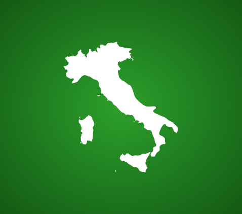

## **Inequality in Italy** 

In Italy, inequality remains moderate but has edged upward over the past decade. The top 10% of earners receive about 32% of total income, while the bottom 50% capture around 21%. Wealth inequality is substantially higher, with the richest 10% holding about 56% of total wealth and the top 1% over 22%. The income gap between the top 10% and the bottom 50% increased from 14 to 15 between 2014 and 2024, indicating a slight widening of disparities. Average income per capita is approximately 32,000 euros (PPP), and average wealth reaches about 200,000 euros (PPP). Female labor participation remains stable at 36.6%, with no significant improvement over the past decade. Overall, Italy’s inequality profile shows persistence, particularly in wealth concentration. 

**Table 1:** _**Inequality outlook – Italy**_ 

||**Income**|**Income**|**Wealth**|**Wealth**|
|---|---|---|---|---|
||**Avg.** **Income** **(PPP €)**|**Share** **of** **total(%)**|**Avg.** **Wealth** **(PPP €)**|**Share** **of** **total(%)**|
|**Full** **pop.**|32,431|100.0%|200,739|100.0%|
|**Bottom** **50%**|7,073|21.7%|5,018|2.5%|
|**Middle** **40%**|37,339|46.1%|207,263|41.3%|
|**Top** **10%**|104,570|32.2%|1,126,143|56.1%|
|**Top** **1%**|294,537|9.1%|4,436,321|22.1%|
|**Year**|||**2014**|**2024**|
|**Top 10% to Bot. 50%** **Income gap**|||13.7|14.8|
|**Female labor share**|||35.6%|36.6%|

_**Interpretation:**_ Country has a transparency index of 13/20. All values are estimated at per capita (full population) level. See glossary for all definitions of concepts and indicators. 

_**Sources and series:**_ wir2026.wid.world/methodology. 

**Figure 1:** _**Top 10% and bottom 50% income shares in Italy, 1900-2024**_ 

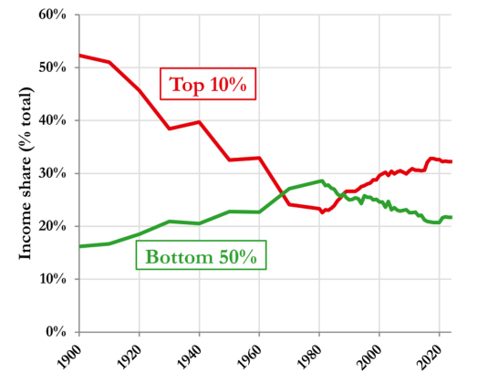

_**Interpretation:**_ The Top 10% income share is equal to 32% in 2024. Income is measured after the operation of pensions and unemployment insurance systems and before income tax. _**Sources and series:**_ wir2026.wid.world/methodology. 

176 

Country-sheets 

## **IVORY COAST** 

� 32,711,547 **||** � e385 (avg. monthly income, PPP) 

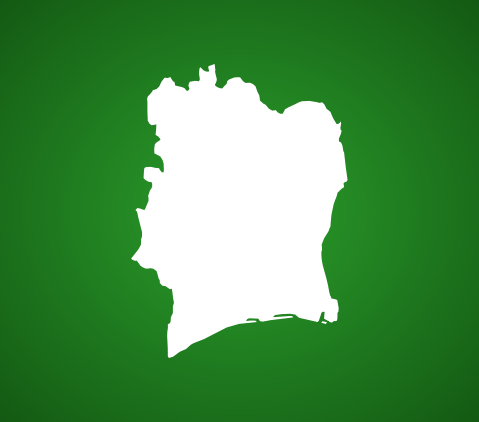

## **Inequality in Ivory Coast** 

In Ivory Coast, inequality remains high and has increased slightly over the past decade. The top 10% of earners capture about 44% of total income, while the bottom 50% receive only 17%. Wealth inequality is even sharper, with the richest 10% holding around 65% of total wealth and the top 1% over 30%. The income gap between the top 10% and the bottom 50% fell from 35 to 26 between 2014 and 2024, reflecting a sizable shrinking divide. Average income per capita stands near 4,600 euros (PPP), while average wealth is about 12,500 euros (PPP). Female labor participation remains low at 27.9%, showing no change over the past decade. Overall, inequality in Ivory Coast remains entrenched across income, wealth, and gender. 

**Table 1:** _**Inequality outlook – Ivory Coast**_ 

||**Income**|**Income**|**Wealth**|**Wealth**|
|---|---|---|---|---|
||**Avg.** **Income** **(PPP €)**|**Share** **of** **total(%)**|**Avg.** **Wealth** **(PPP €)**|**Share** **of** **total(%)**|
|**Full** **pop.**|4,629|100.0%|12,490|100.0%|
|**Bottom** **50%**|774|16.6%|437|3.5%|
|**Middle** **40%**|4,597|39.7%|9,898|31.7%|
|**Top** **10%**|20,194|43.6%|80,934|64.8%|
|**Top** **1%**|55,327|12.0%|384,688|30.8%|
|**Year**|||**2014**|**2024**|
|**Top 10% to Bot. 50%** **Income gap**|||35.4|26.1|
|**Female labor share**|||27.9%|27.9%|

_**Interpretation:**_ Country has a transparency index of 4.5/20. All values are estimated at per capita (full population) level. See glossary for all definitions of concepts and indicators. 

_**Sources and series:**_ wir2026.wid.world/methodology. 

**Figure 1:** _**Top 10% and bottom 50% income shares in Ivory Coast, 1980-2024**_ 

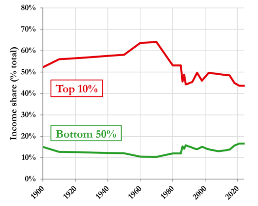

_**Interpretation:**_ The Top 10% income share is equal to 44% in 2024. Income is measured after the operation of pensions and unemployment insurance systems and before income tax. _**Sources and series:**_ wir2026.wid.world/methodology. 

177 

Country-sheets 

## **JAPAN** 

� 123,103,479 **||** � e2474 (avg. monthly income, PPP) 

**Table 1:** _**Inequality outlook – Japan**_ 

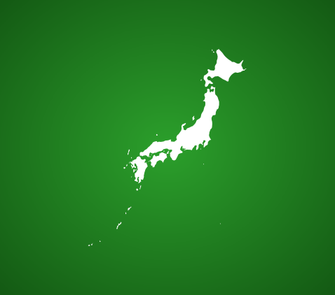

||**Income**|**Income**|**Wealth**|**Wealth**|
|---|---|---|---|---|
||**Avg.** **Income** **(PPP €)**|**Share** **of** **total(%)**|**Avg.** **Wealth** **(PPP €)**|**Share** **of** **total(%)**|
|**Full** **pop.**|29,699|100.0%|176,694|100.0%|
|**Bottom** **50%**|5,539|18.6%|8,305|4.7%|
|**Middle** **40%**|28,309|38.1%|161,675|36.6%|
|**Top** **10%**|128,640|43.3%|1,037,196|58.7%|
|**Top** **1%**|374,007|12.6%|4,276,002|24.2%|
|**Year**|||**2014**|**2024**|
|**Top 10% to Bot. 50%** **Income gap**|||23.2|23.2|
|**Female labor share**|||26.9%|26.9%|

## **Inequality in Japan** 

_**Interpretation:**_ Country has a transparency index of 6/20. All values are estimated at per capita (full population) level. See glossary for all definitions of concepts and indicators. _**Sources and series:**_ wir2026.wid.world/methodology. 

In Japan, inequality remains moderate and stable across both income and wealth dimensions. The top 10% of earners receive around 43% of total income, while the bottom 50% capture about 19%. Wealth inequality is more pronounced, with the richest 10% holding nearly 59% of total wealth and the top 1% around 24%. The income gap between the top 10% and the bottom 50% remained almost unchanged between 2014 and 2024. Average income per capita is approximately 30,000 euros (PPP), and average wealth exceeds 176,000 euros (PPP). Female labor participation remains steady at 26.9%, indicating limited progress toward gender parity. Overall, Japan continues to display relatively balanced income distribution within advanced economies, though wealth concentration endures. 

**Figure 1:** _**Top 10% and bottom 50% income shares in Japan, 1900-2024**_ 

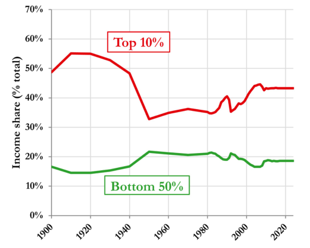

_**Interpretation:**_ The Top 10% income share is equal to 43% in 2024. Income is measured after the operation of pensions and unemployment insurance systems and before income tax. _**Sources and series:**_ wir2026.wid.world/methodology. 

178 

Country-sheets 

## **MEXICO** 

� 131,946,900 **||** � e1,126 (avg. monthly income, PPP) 

**Table 1:** _**Inequality outlook – Mexico**_ 

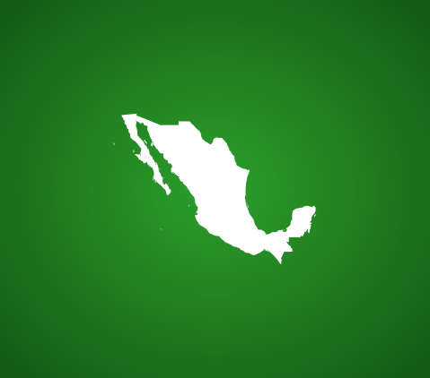

||**Income**|**Income**|**Wealth**|**Wealth**|
|---|---|---|---|---|
||**Avg.** **Income** **(PPP €)**|**Share** **of** **total(%)**|**Avg.** **Wealth** **(PPP €)**|**Share** **of** **total(%)**|
|**Full** **pop.**|13,506|100.0%|41,791|100.0%|
|**Bottom** **50%**|1,044|7.7%|961|2.3%|
|**Middle** **40%**|11,225|33.2%|28,314|27.1%|
|**Top** **10%**|79,772|59.1%|295,046|70.6%|
|**Top** **1%**|345,394|25.6%|1,588,067|38.0%|
|**Year**|||**2014**|**2024**|
|**Top 10% to Bot. 50%** **Income gap**|||110.8|76.4|
|**Female labor share**|||31.1%|33.8%|

## **Inequality in Mexico** 

_**Interpretation:**_ Country has a transparency index of 8.5/20. All values are estimated at per capita (full population) level. See glossary for all definitions of concepts and indicators. 

In Mexico, inequality remains extremely high but has declined modestly over the past decade. The top 10% of earners capture around 59% of total income, while the bottom 50% receive only 8%. Wealth disparities are even larger, with the richest 10% holding about 71% of total wealth and the top 1% about 38%. The income gap between the top 10% and the bottom 50% narrowed from 111 to 76 between 2014 and 2024, suggesting limited progress in reducing inequality. Average income per capita is approximately 13,500 euros (PPP), while average wealth reaches about 42,000 euros (PPP). Female labor participation increased from 31.1% to 33.8%, indicating a gradual improvement. Despite this progress, inequality in Mexico remains among the highest in the world across income and wealth dimensions. 

_**Sources and series:**_ wir2026.wid.world/methodology. 

**Figure 1:** _**Top 10% and bottom 50% income shares in Mexico, 1900-2024**_ 

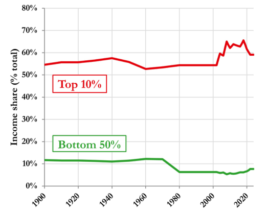

_**Interpretation:**_ The Top 10% income share is equal to 59% in 2024. Income is measured after the operation of pensions and unemployment insurance systems and before income tax. _**Sources and series:**_ wir2026.wid.world/methodology. 

179 

Country-sheets 

## **NETHERLANDS** 

� 18,346,819 **||** � e3,718 (avg. monthly income, PPP) 

**Table 1:** _**Inequality outlook – Netherlands**_ 

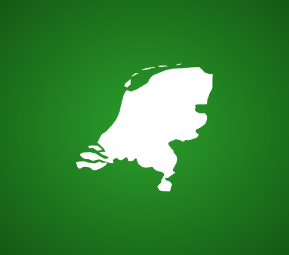

||**Income**|**Income**|**Wealth**|**Wealth**|
|---|---|---|---|---|
||**Avg.** **Income** **(PPP €)**|**Share** **of** **total(%)**|**Avg.** **Wealth** **(PPP €)**|**Share** **of** **total(%)**|
|**Full** **pop.**|44,610|100.0%|256,443|100.0%|
|**Bottom** **50%**|9,849|22.0%|25,131|9.8%|
|**Middle** **40%**|53,611|48.1%|287,216|44.8%|
|**Top** **10%**|133,657|30.0%|1,164,252|45.4%|
|**Top** **1%**|313,534|7.0%|3,538,914|13.8%|
|**Year**|||**2014**|**2024**|
|**Top 10% to Bot. 50%** **Income gap**|||12.3|13.6|
|**Female labor share**|||34.7%|37.3%|

## **Inequality in the Netherlands Continues to be Low** 

_**Interpretation:**_ Country has a transparency index of 14.5/20. All values are estimated at per capita (full population) level. See glossary for all definitions of concepts and indicators. 

In the Netherlands, inequality remains relatively low and stable compared with most advanced economies. The top 10% of earners capture about 30% of total income, while the bottom 50% receive around 22%. Wealth inequality is more pronounced, with the richest 10% holding roughly 45% of total wealth and the top 1% around 14%. The income gap between the top 10% and the bottom 50% increased slightly from 12.3 to 13.6 between 2014 and 2024, indicating persistent but contained disparities. Average income per capita stands near 45,000 euros (PPP), and average wealth is around 256,000 euros (PPP). Female labor participation increased from 34.7% to 37.3%, reflecting gradual gains in gender inclusion. Overall, the Netherlands continues to display one of the most equal income distributions among high-income countries, despite concentrated wealth ownership. 

_**Sources and series:**_ wir2026.wid.world/methodology. 

**Figure 1:** _**Top 10% and bottom 50% income shares in the Netherlands, 1900-2024**_ 

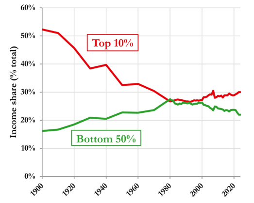

_**Interpretation:**_ The Top 10% income share is equal to 30% in 2024. Income is measured after the operation of pensions and unemployment insurance systems and before income tax. _**Sources and series:**_ wir2026.wid.world/methodology. 

180 

Country-sheets 

## **NEW ZEALAND** 

� 5,251,899 **||** � e2,575 (avg. monthly income, PPP) 

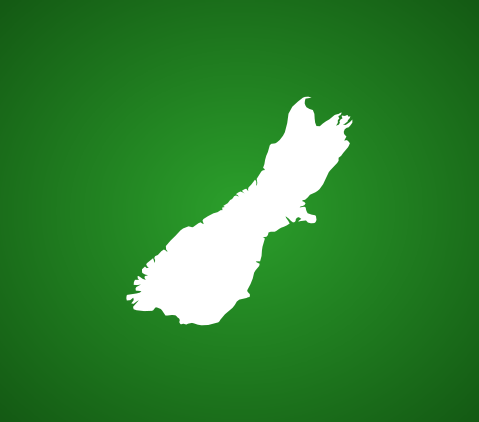

## **Inequality in New Zealand** 

In New Zealand, inequality remains moderate but has risen slightly in recent years. The top 10% of earners receive around 35% of total income, while the bottom 50% capture about 21%. Wealth disparities are larger, with the richest 10% holding nearly 57% of total wealth and the top 1% around 23%. The income gap between the top 10% and the bottom 50% widened from 14.2 to 16.3 between 2014 and 2024, suggesting a mild increase in inequality. Average income per capita stands near 31,000 euros (PPP), and average wealth is roughly 231,000 euros (PPP). Female labor participation increased from 31.2% to 35.0%, marking steady progress in gender inclusion. Overall, inequality in New Zealand remains contained but shows signs of gradual widening across income and wealth dimensions. 

**Table 1:** _**Inequality outlook – New Zealand**_ 

||**Income**|**Income**|**Wealth**|**Wealth**|
|---|---|---|---|---|
||**Avg.** **Income** **(PPP €)**|**Share** **of** **total(%)**|**Avg.** **Wealth** **(PPP €)**|**Share** **of** **total(%)**|
|**Full** **pop.**|30,896|100.0%|231,096|100.0%|
|**Bottom** **50%**|6,558|21.1%|11,324|4.9%|
|**Middle** **40%**|34,122|44.2%|218,963|37.9%|
|**Top** **10%**|107,216|34.7%|1,321,869|57.2%|
|**Top** **1%**|370,084|12.0%|5,245,880|22.7%|
|**Year**|||**2014**|**2024**|
|**Top 10% to Bot. 50%** **Income gap**|||14.2|16.3|
|**Female labor share**|||31.2%|35.0%|

_**Interpretation:**_ Country has a transparency index of 10.5/20. All values are estimated at per capita (full population) level. See glossary for all definitions of concepts and indicators. 

_**Sources and series:**_ wir2026.wid.world/methodology. 

**Figure 1:** _**Top 10% and bottom 50% income shares in New Zealand, 1900-2024**_ 

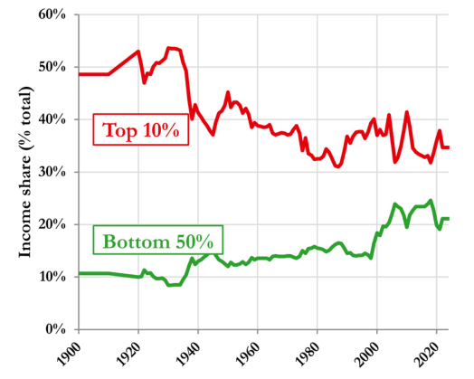

_**Interpretation:**_ The Top 10% income share is equal to 35% in 2024. Income is measured after the operation of pensions and unemployment insurance systems and before income tax. _**Sources and series:**_ wir2026.wid.world/methodology. 

181 

Country-sheets 

## **NIGER** 

� 27,917,831 **||** � e106 (avg. monthly income, PPP) 

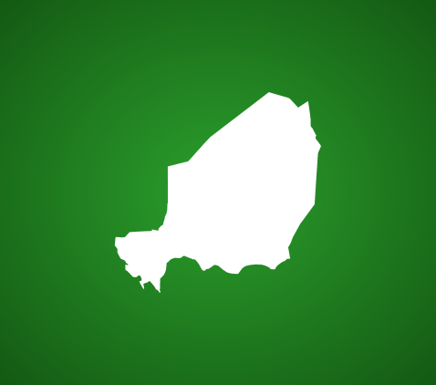

## **Inequality in Niger** 

In Niger, inequality remains high and has shown little change over the past decade. The top 10% of earners receive 44.4% of total income, while the bottom 50% account for only 17.8%. Wealth concentration is even more unequal, with the richest 10% holding 59.1% of total wealth and the top 1% alone holding 24.6%. Average income per capita is about 1,300 euros (PPP), and average wealth per capita stands near 3,200 euros (PPP). The income gap between the top 10% and the bottom 50% has remained stable at 24.8 between 2014 and 2024, indicating persistent disparities. Female labor participation remains very low at 17.3% and shows no change over the period. Overall, income and wealth distributions in Niger remain highly concentrated, with stagnant gender participation levels. 

**Table 1:** _**Inequality outlook – Niger**_ 

||**Income**|**Income**|**Wealth**|**Wealth**|
|---|---|---|---|---|
||**Avg.** **Income** **(PPP €)**|**Share** **of** **total(%)**|**Avg.** **Wealth** **(PPP €)**|**Share** **of** **total(%)**|
|**Full** **pop.**|1,272|100.0%|3,202|100.0%|
|**Bottom** **50%**|227|17.8%|147|4.6%|
|**Middle** **40%**|1,202|37.8%|2,905|36.3%|
|**Top** **10%**|5,644|44.4%|18,922|59.1%|
|**Top** **1%**|17,629|13.9%|78,761|24.6%|
|**Year**|||**2014**|**2024**|
|**Top 10% to Bot. 50%** **Income gap**|||24.8|24.8|
|**Female labor share**|||17.3%|17.3%|

_**Interpretation:**_ Country has a transparency index of 1/20. All values are estimated at per capita (full population) level. See glossary for all definitions of concepts and indicators. _**Sources and series:**_ wir2026.wid.world/methodology. 

**Figure 1:** _**Top 10% and bottom 50% income shares in Niger, 1980-2024**_ 

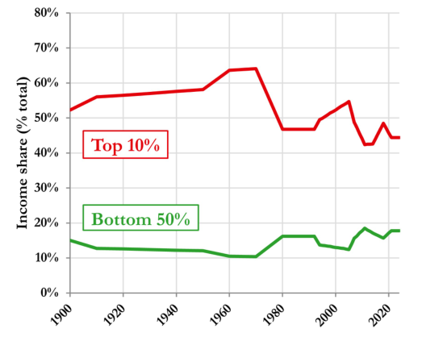

_**Interpretation:**_ The Top 10% income share is equal to 44% in 2024. Income is measured after the operation of pensions and unemployment insurance systems and before income tax. _**Sources and series:**_ wir2026.wid.world/methodology. 

182 

Country-sheets 

## **NORWAY** 

� 5,623,071 **||** � e5,598 (avg. monthly income, PPP) 

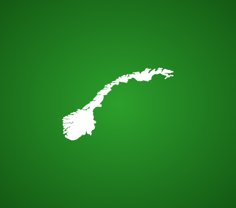

## **Inequality in Norway Among Lowest, yet Income Among Highest** 

In Norway, one of the highest-income countries in the world, inequality remains among the lowest and relatively stable. The top 10% of earners receive 29.9% of total income, while the bottom 50% account for 25.8%, indicating a comparatively balanced income distribution. Wealth is more concentrated, with the richest 10% holding about 53% of total wealth and the top 1% holding 23%. Average income per capita reaches 67,000 euros (PPP), and average wealth stands at 223,000 euros (PPP). The income gap between the top 10% and the bottom 50% decreased slightly from 12.3 to 11.5 between 2014 and 2024. Female labor participation declined slightly from 39.8% to 39.2% over the same period. Overall, Norway combines high income levels with comparatively low inequality, despite persistent concentration of wealth at the top. 

**Table 1:** _**Inequality outlook – Norway**_ 

||**Income**|**Income**|**Wealth**|**Wealth**|
|---|---|---|---|---|
||**Avg.** **Income** **(PPP €)**|**Share** **of** **total(%)**|**Avg.** **Wealth** **(PPP €)**|**Share** **of** **total(%)**|
|**Full** **pop.**|67,179|100.0%|222,729|100.0%|
|**Bottom** **50%**|17,444|25.8%|8,018|3.6%|
|**Middle** **40%**|74,334|44.3%|244,446|43.9%|
|**Top** **10%**|200,889|29.9%|1,169,330|52.5%|
|**Top** **1%**|624,361|9.3%|5,189,596|23.3%|
|**Year**|||**2014**|**2024**|
|**Top 10% to Bot. 50%** **Income gap**|||12.3|11.5|
|**Female labor share**|||39.8%|39.2%|

_**Interpretation:**_ Country has a transparency index of 17.5/20. All values are estimated at per capita (full population) level. See glossary for all definitions of concepts and indicators. 

_**Sources and series:**_ wir2026.wid.world/methodology. 

**Figure 1:** _**Top 10% and bottom 50% income shares in Norway, 1900-2024**_ 

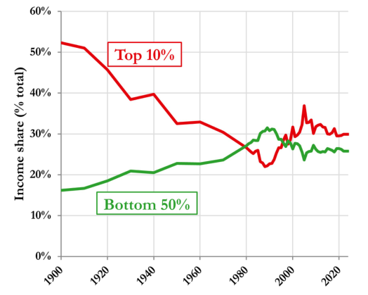

_**Interpretation:**_ The Top 10% income share is equal to 30% in 2024. Income is measured after the operation of pensions and unemployment insurance systems and before income tax. _**Sources and series:**_ wir2026.wid.world/methodology. 

183 

Country-sheets 

## **PAKISTAN** 

� 255,219,554 **||** � e349 (avg. monthly income, PPP) 

**Table 1:** _**Inequality outlook – Pakistan**_ 

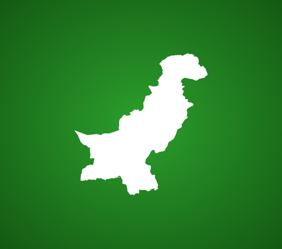

||**Income**|**Income**|**Wealth**|**Wealth**|
|---|---|---|---|---|
||**Avg.** **Income** **(PPP €)**|**Share** **of** **total(%)**|**Avg.** **Wealth** **(PPP €)**|**Share** **of** **total(%)**|
|**Full** **pop.**|4,185|100.0%|15,649|100.0%|
|**Bottom** **50%**|816|19.4%|736|4.7%|
|**Middle** **40%**|4,067|38.9%|14,397|36.8%|
|**Top** **10%**|17,458|41.7%|91,549|58.5%|
|**Top** **1%**|67,905|16.2%|375,586|24.0%|
|**Year**|||**2014**|**2024**|
|**Top 10% to Bot. 50%** **Income gap**|||22.0|21.4|
|**Female labor share**|||9.8%|8.5%|

## **Inequality in Pakistan** 

_**Interpretation:**_ Country has a transparency index of 1/20. All values are estimated at per capita (full population) level. See glossary for all definitions of concepts and indicators. _**Sources and series:**_ wir2026.wid.world/methodology. 

In Pakistan, inequality remains high and shows limited progress over the past decade. The top 10% of earners capture 42% of total income, whereas the bottom 50% receive only 19%. Wealth inequality is even more concentrated, with the richest 10% holding 59% of total wealth and the top 1% accounting for 24%. Average income per capita is around 4,200 euros (PPP), while average wealth stands at 15,700 euros (PPP). The income gap between the top 10% and the bottom 50% decreased slightly from 22.0 to 21.4 between 2014 and 2024, reflecting marginal change. Female labor participation fell from 9.8% to 8.5%, indicating a decline in gender inclusion. Overall, income and wealth are highly concentrated in Pakistan, with persistent gender disparities and only minor shifts in inequality trends. 

**Figure 1:** _**Top 10% and bottom 50% income shares in Pakistan, 1980-2024**_ 

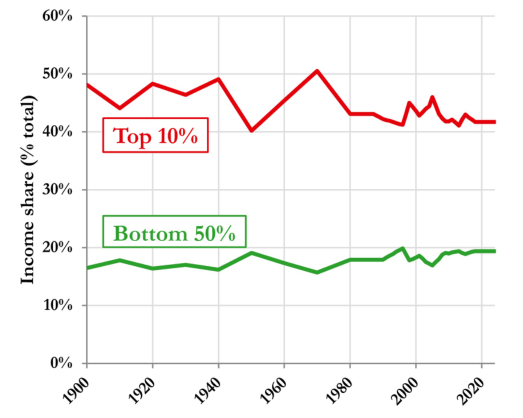

_**Interpretation:**_ The Top 10% income share is equal to 42% in 2024. Income is measured after the operation of pensions and unemployment insurance systems and before income tax. _**Sources and series:**_ wir2026.wid.world/methodology. 

184 

Country-sheets 

## **PHILIPPINES** 

� 116,786,962 **||** � e596 (avg. monthly income, PPP) 

**Table 1:** _**Inequality outlook – Philippines**_ 

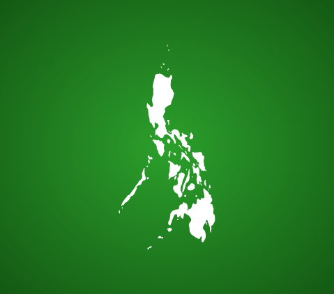

||**Income**|**Income**|**Wealth**|**Wealth**|
|---|---|---|---|---|
||**Avg.** **Income** **(PPP €)**|**Share** **of** **total(%)**|**Avg.** **Wealth** **(PPP €)**|**Share** **of** **total(%)**|
|**Full** **pop.**|7,155|100.0%|27,367|100.0%|
|**Bottom** **50%**|1,140|15.9%|1,232|4.5%|
|**Middle** **40%**|7,074|39.5%|24,152|35.3%|
|**Top** **10%**|31,911|44.6%|165,025|60.3%|
|**Top** **1%**|116,802|16.3%|730,706|26.7%|
|**Year**|||**2014**|**2024**|
|**Top 10% to Bot. 50%** **Income gap**|||32.3|28.0|
|**Female labor share**|||41.0%|38.7%|

## **Inequality in the Philippines** 

_**Interpretation:**_ Country has a transparency index of 3/20. All values are estimated at per capita (full population) level. See glossary for all definitions of concepts and indicators. _**Sources and series:**_ wir2026.wid.world/methodology. 

In the Philippines, inequality remains high but shows a slight improvement over the last decade. The top 10% of earners capture 45% of total income, while the bottom 50% receive only 16%. Wealth is even more concentrated, with the richest 10% holding 60% of total wealth and the top 1% accounting for 27%. Average income per capita is around 7,200 euros (PPP), and average wealth stands near 27,000 euros (PPP). The income gap between the top 10% and the bottom 50% narrowed from 32 to 28 between 2014 and 2024, indicating modest reductions in disparities. Female labor participation decreased slightly from 41% to 39% over the same period. Overall, inequality in the Philippines remains substantial across income and wealth dimensions, despite small gains in income distribution. 

**Figure 1:** _**Top 10% and bottom 50% income shares in the Philippines, 1980-2024**_ 

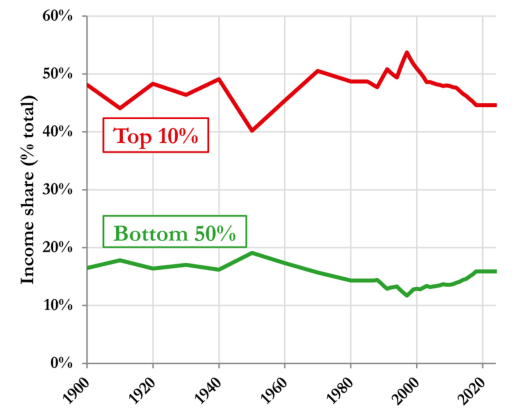

_**Interpretation:**_ The Top 10% income share is equal to 45% in 2024. Income is measured after the operation of pensions and unemployment insurance systems and before income tax. _**Sources and series:**_ wir2026.wid.world/methodology. 

185 

Country-sheets 

## **POLAND** 

� 38,140,910 **||** � e2,291 (avg. monthly income, PPP) 

**Table 1:** _**Inequality outlook – Poland**_ 

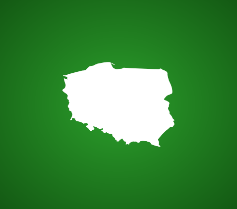

||**Income**|**Income**|**Wealth**|**Wealth**|
|---|---|---|---|---|
||**Avg.** **Income** **(PPP €)**|**Share** **of** **total(%)**|**Avg.** **Wealth** **(PPP €)**|**Share** **of** **total(%)**|
|**Full** **pop.**|27,487|100.0%|119,400|100.0%|
|**Bottom** **50%**|5,387|19.5%|-955|-0.8%|
|**Middle** **40%**|29,451|42.9%|116,117|38.9%|
|**Top** **10%**|103,462|37.6%|739,088|61.9%|
|**Top** **1%**|415,276|15.1%|3,605,890|30.2%|
|**Year**|||**2014**|**2024**|
|**Top 10% to Bot. 50%** **Income gap**|||18.5|19.2|
|**Female labor share**|||39.2%|40.5%|

## **Inequality in Poland** 

_**Interpretation:**_ Negative bottom wealth shares occur when a portion of the population has negative net wealth (debts exceed their assets). See Andreescu et al. (2025) p.30-31 for more info. Country has a transparency index of 14.5/20. All values are estimated at per capita (full population) level. See glossary for all definitions of concepts and indicators. 

In Poland, inequality is moderate and has increased slightly in recent years. The top 10% of earners receive 38% of total income, while the bottom 50% account for 20%. Wealth is highly concentrated: the richest 10% hold 62% of total wealth, and the top 1% alone holds 30%, while the bottom 50% have negative net wealth, representing -1% of the total. Average income per capita is 27,500 euros (PPP), and average wealth per capita stands at 119,400 euros (PPP). The income gap between the top 10% and the bottom 50% rose from 18.5 to 19.2 between 2014 and 2024, indicating widening disparities. Female labor participation increased slightly from 39.2% to 40.5% over the same period. Overall, Poland combines relatively balanced income shares with significant concentration of wealth among the top groups. 

_**Sources and series:**_ wir2026.wid.world/methodology. 

**Figure 1:** _**Top 10% and bottom 50% income shares in Poland, 1980-2024**_ 

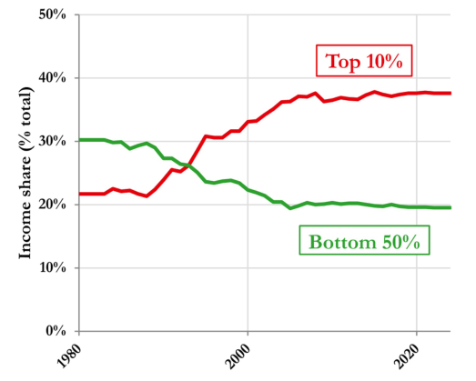

_**Interpretation:**_ The Top 10% income share is equal to 38% in 2024. Income is measured after the operation of pensions and unemployment insurance systems and before income tax. _**Sources and series:**_ wir2026.wid.world/methodology. 

186 

Country-sheets 

## **RUSSIA** 

� 143,997,393 **||** � e2,294 (avg. monthly income, PPP) 

**Table 1:** _**Inequality outlook – Russia**_ 

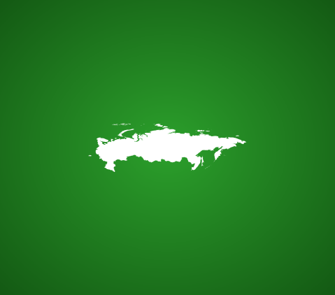

||**Income**|**Income**|**Wealth**|**Wealth**|
|---|---|---|---|---|
||**Avg.** **Income** **(PPP €)**|**Share** **of** **total(%)**|**Avg.** **Wealth** **(PPP €)**|**Share** **of** **total(%)**|
|**Full** **pop.**|27,533|100.0%|94,048|100.0%|
|**Bottom** **50%**|4,340|15.7%|2,727|2.9%|
|**Middle** **40%**|23,094|33.6%|52,902|22.5%|
|**Top** **10%**|139,773|50.8%|701,596|74.6%|
|**Top** **1%**|654,145|23.8%|4,420,243|47.0%|
|**Year**|||**2014**|**2024**|
|**Top 10% to Bot. 50%** **Income gap**|||26.6|32.2|
|**Female labor share**|||39.9%|42.1%|

## **Inequality in Russia** 

_**Interpretation:**_ Country has a transparency index of 4.5/20. All values are estimated at per capita (full population) level. See glossary for all definitions of concepts and indicators. 

In Russia, inequality remains very high and has increased further over the past decade. The top 10% of earners receive 51% of total income, while the bottom 50% account for only 16%. Wealth concentration is even more pronounced: the richest 10% hold 75% of total wealth, and the top 1% alone holds 47%. Average income per capita is 27,500 euros (PPP), and average wealth per capita stands at 94,100 euros (PPP). The income gap between the top 10% and the bottom 50% widened from 27 to 32 between 2014 and 2024, showing expanding disparities. Female labor participation increased slightly from 40% to 42%. Overall, both income and wealth are highly concentrated in Russia, with inequality continuing to rise. 

_**Sources and series:**_ wir2026.wid.world/methodology. 

**Figure 1:** _**Top 10% and bottom 50% income shares in Russia, 1900-2024**_ 

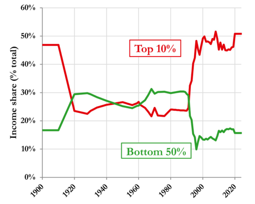

_**Interpretation:**_ The Top 10% income share is equal to 51% in 2024. Income is measured after the operation of pensions and unemployment insurance systems and before income tax. _**Sources and series:**_ wir2026.wid.world/methodology. 

187 

Country-sheets 

## **SOUTH AFRICA** 

� 64,747,319 **||** � e731 (avg. monthly income, PPP) 

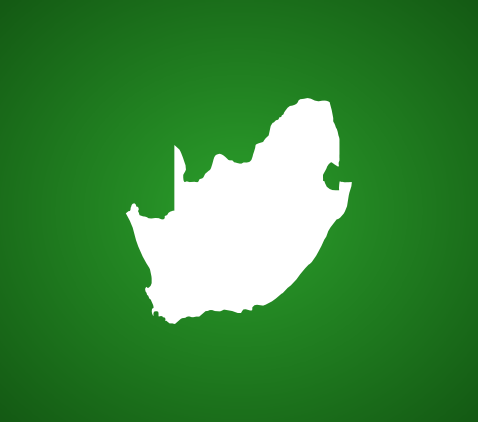

## **Inequality in South Africa** 

In South Africa, inequality remains among the highest in the world and shows no improvement over the past decade. The top 10% of earners capture 66% of total income, while the bottom 50% receive only 6%. Wealth inequality is even more concentrated: the richest 10% hold 86% of total wealth, and the top 1% alone holds 55%, while the bottom 50% have negative net wealth at -2.5%. Average income per capita is around 8,800 euros (PPP), and average wealth stands near 29,000 euros (PPP). The income gap between the top 10% and the bottom 50% increased, moving from 103 to 118 between 2014 and 2024. Female labor participation remained at 36%. Overall, income and wealth are extremely concentrated in South Africa, with persistent disparities and limited change over time. 

**Table 1:** _**Inequality outlook – South Africa**_ 

||**Income**|**Income**|**Wealth**|**Wealth**|
|---|---|---|---|---|
||**Avg.** **Income** **(PPP €)**|**Share** **of** **total(%)**|**Avg.** **Wealth** **(PPP €)**|**Share** **of** **total(%)**|
|**Full** **pop.**|8,768|100.0%|28,860|100.0%|
|**Bottom** **50%**|491|5.6%|-721|-2.5%|
|**Middle** **40%**|6,158|28.1%|12,193|16.9%|
|**Top** **10%**|58,156|66.3%|247,040|85.6%|
|**Top** **1%**|191,649|21.9%|1,578,629|54.7%|
|**Year**|||**2014**|**2024**|
|**Top 10% to Bot. 50%** **Income gap**|||103.3|118.4|
|**Female labor share**|||36.0%|36.0%|

_**Interpretation:**_ Negative bottom wealth shares occur when a portion of the population has negative net wealth (debts exceed their assets). See Andreescu et al. (2025) p.30-31 for more info. Country has a transparency index of 14.5/20. All values are estimated at per capita (full population) level. See glossary for all definitions of concepts and indicators. 

_**Sources and series:**_ wir2026.wid.world/methodology. 

**Figure 1:** _**Top 10% and bottom 50% income shares in South Africa, 1900-2024**_ 

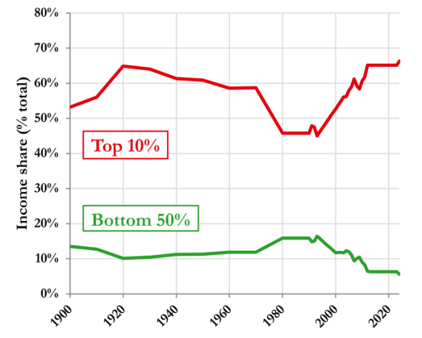

_**Interpretation:**_ The Top 10% income share is equal to 66% in 2024. Income is measured after the operation of pensions and unemployment insurance systems and before income tax. _**Sources and series:**_ wir2026.wid.world/methodology. 

188 

Country-sheets 

## **SOUTH KOREA** 

� 51,667,029 **||** � e2,709 (avg. monthly income, PPP) 

**Table 1:** _**Inequality outlook – South Korea**_ 

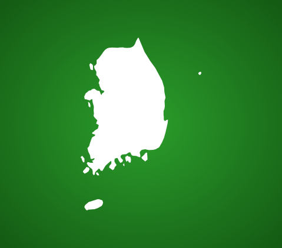

||**Income**|**Income**|**Wealth**|**Wealth**|
|---|---|---|---|---|
||**Avg.** **Income** **(PPP €)**|**Share** **of** **total(%)**|**Avg.** **Wealth** **(PPP €)**|**Share** **of** **total(%)**|
|**Full** **pop.**|32,509|100.0%|212,706|100.0%|
|**Bottom** **50%**|6,005|18.4%|3,829|1.8%|
|**Middle** **40%**|35,930|44.2%|171,760|32.3%|
|**Top** **10%**|121,626|37.4%|1,401,731|65.9%|
|**Top** **1%**|454,393|14.0%|5,445,268|25.6%|
|**Year**|||**2014**|**2024**|
|**Top 10% to Bot. 50%** **Income gap**|||17.7|20.3|
|**Female labor share**|||31.5%|34.5%|

## **Inequality in South Korea** 

_**Interpretation:**_ Country has a transparency index of 11/20. All values are estimated at per capita (full population) level. See glossary for all definitions of concepts and indicators. 

In South Korea, inequality is moderate and has increased slightly over the past decade. The top 10% of earners receive 37% of total income, while the bottom 50% account for 18%. Wealth is more concentrated, with the richest 10% holding 66% of total wealth and the top 1% holding 26%. Average income per capita is 32,500 euros (PPP), and average wealth stands at 212,700 euros (PPP). The income gap between the top 10% and the bottom 50% increased from 18 to 20 between 2014 and 2024, indicating an increase of disparities. Female labor participation increased from 31.5% to 34.5% over the same period. Overall, South Korea shows stable income distribution with continued concentration of wealth at the top. 

_**Sources and series:**_ wir2026.wid.world/methodology. 

**Figure 1:** _**Top 10% and bottom 50% income shares in South Korea, 1900-2024**_ 

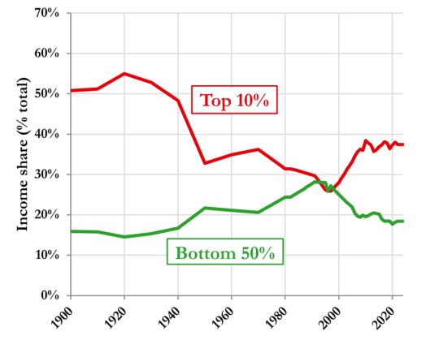

_**Interpretation:**_ The Top 10% income share is equal to 37% in 2024. Income is measured after the operation of pensions and unemployment insurance systems and before income tax. _**Sources and series:**_ wir2026.wid.world/methodology. 

189 

Country-sheets 

## **SPAIN** 

� 47,889,958 **||** � e2,583 (avg. monthly income, PPP) 

**Table 1:** _**Inequality outlook – Spain**_ 

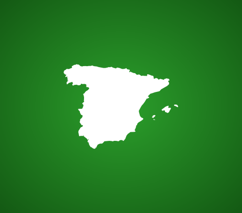

||**Income**|**Income**|**Wealth**|**Wealth**|
|---|---|---|---|---|
||**Avg.** **Income** **(PPP €)**|**Share** **of** **total(%)**|**Avg.** **Wealth** **(PPP €)**|**Share** **of** **total(%)**|
|**Full** **pop.**|30,992|100.0%|185,267|100.0%|
|**Bottom** **50%**|7,039|22.6%|12,413|6.7%|
|**Middle** **40%**|34,063|44.0%|167,203|36.1%|
|**Top** **10%**|103,626|33.4%|1,059,724|57.2%|
|**Top** **1%**|369,720|11.9%|4,409,343|23.8%|
|**Year**|||**2014**|**2024**|
|**Top 10% to Bot. 50%** **Income gap**|||16.4|14.7|
|**Female labor share**|||38.9%|41.6%|

## **Inequality in Spain** 

_**Interpretation:**_ Country has a transparency index of 16/20. All values are estimated at per capita (full population) level. See glossary for all definitions of concepts and indicators. 

In Spain, inequality is moderate and shows a slight reduction over the past decade. The top 10% of earners receive 33% of total income, while the bottom 50% account for 23%. Wealth is more concentrated, with the richest 10% holding 57% of total wealth and the top 1% holding 24%. Average income per capita is 31,000 euros (PPP), and average wealth stands at 185,000 euros (PPP). The income gap between the top 10% and the bottom 50% narrowed from 16 to 15 between 2014 and 2024, reflecting a modest improvement. Female labor participation increased from 39% to 42% during the same period. Overall, Spain maintains a relatively balanced income distribution, though wealth remains concentrated at the top. 

_**Sources and series:**_ wir2026.wid.world/methodology. 

**Figure 1:** _**Top 10% and bottom 50% income shares in Spain, 1900-2024**_ 

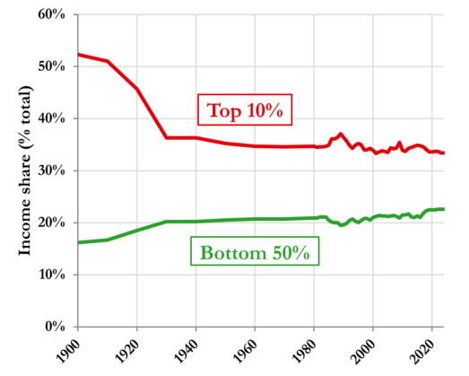

_**Interpretation:**_ The Top 10% income share is equal to 33% in 2024. Income is measured after the operation of pensions and unemployment insurance systems and before income tax. _**Sources and series:**_ wir2026.wid.world/methodology. 

190 

Country-sheets 

## **SWEDEN** 

� 10,656,633 **||** � e3,687 (avg. monthly income, PPP) 

**Table 1:** _**Inequality outlook – Sweden**_ 

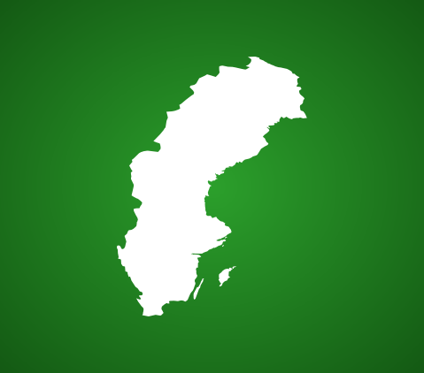

||**Income**|**Income**|**Wealth**|**Wealth**|
|---|---|---|---|---|
||**Avg.** **Income** **(PPP €)**|**Share** **of** **total(%)**|**Avg.** **Wealth** **(PPP €)**|**Share** **of** **total(%)**|
|**Full** **pop.**|44,238|100.0%|194,788|100.0%|
|**Bottom** **50%**|11,282|25.4%|-21,427|-11.0%|
|**Middle** **40%**|50,889|46.0%|208,423|42.8%|
|**Top** **10%**|126,573|28.6%|1,328,456|68.2%|
|**Top** **1%**|415,524|9.4%|5,298,242|27.2%|
|**Year**|||**2014**|**2024**|
|**Top 10% to Bot. 50%** **Income gap**|||11.9|11.2|
|**Female labor share**|||41.9%|40.5%|

## **Inequality in Sweden** 

_**Interpretation:**_ Negative bottom wealth shares occur when a portion of the population has negative net wealth (debts exceed their assets). See Andreescu et al. (2025) p.30-31 for more info. Country has a transparency index of 14.5/20. All values are estimated at per capita (full population) level. See glossary for all definitions of concepts and indicators. 

In Sweden, inequality remains low and relatively stable compared with most advanced economies. The top 10% of earners receive 29% of total income, while the bottom 50% account for 25%. Wealth is more concentrated, with the richest 10% holding 68% of total wealth and the top 1% holding 27%, while the bottom 50% have negative net wealth at -11%. Average income per capita is 44,000 euros (PPP), and average wealth reaches 195,000 euros (PPP). The income gap between the top 10% and the bottom 50% decreased slightly from 12 to 11 between 2014 and 2024, indicating a minor change in disparities. Female labor participation declined from 41.9% to 40.5% over the same period. Overall, Sweden maintains a comparatively equal income distribution despite persistent concentration of wealth at the top. 

_**Sources and series:**_ wir2026.wid.world/methodology. 

**Figure 1:** _**Top 10% and bottom 50% income shares in Sweden, 1900-2024**_ 

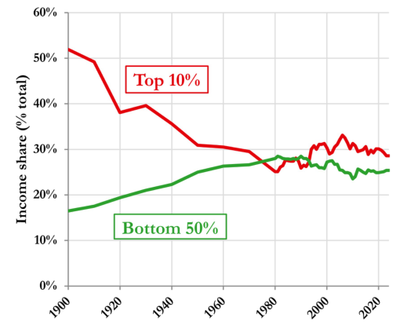

_**Interpretation:**_ The Top 10% income share is equal to 29% in 2024. Income is measured after the operation of pensions and unemployment insurance systems and before income tax. _**Sources and series:**_ wir2026.wid.world/methodology. 

191 

Country-sheets 

## **TAIWAN** 

� 23,112,793 **||** � e4,077 (avg. monthly income, PPP) 

**Table 1:** _**Inequality outlook – Taiwan**_ 

||**Income**|**Income**|**Wealth**|**Wealth**|
|---|---|---|---|---|
||**Avg.** **Income** **(PPP €)**|**Share** **of** **total(%)**|**Avg.** **Wealth** **(PPP €)**|**Share** **of** **total(%)**|
|**Full** **pop.**|48,923|100.0%|373,288|100.0%|
|**Bottom** **50%**|5,797|11.8%|16,051|4.3%|
|**Middle** **40%**|49,033|40.1%|324,760|34.8%|
|**Top** **10%**|235,415|48.1%|2,273,321|60.9%|
|**Top** **1%**|945,673|19.3%|10,078,763|27.0%|
|**Year**|||**2014**|**2024**|
|**Top 10% to Bot. 50%** **Income gap**|||44.9|40.6|
|**Female labor share**|||36.3%|35.4%|

_**Interpretation:**_ Country has a transparency index of 9/20. All values are estimated at per capita (full population) level. See glossary for all definitions of concepts and indicators. _**Sources and series:**_ wir2026.wid.world/methodology. 

## **Inequality in Taiwan** 

In Taiwan, inequality is high and shows a slight improvement over the past decade. The top 10% of earners receive 48% of total income, while the bottom 50% account for only 12%. Wealth concentration is even more pronounced, with the richest 10% holding 61% of total wealth and the top 1% alone holding 27%. Average income per capita is 48,900 euros (PPP), and average wealth reaches 373,300 euros (PPP). The income gap between the top 10% and the bottom 50% decreased from 45 to 41 between 2014 and 2024, indicating small change. Female labor participation declined slightly from 36.3% to 35.4%. Overall, both income and wealth in Taiwan remain highly concentrated among top earners and top wealth holders. 

**Figure 1:** _**Top 10% and bottom 50% income shares in Taiwan, 1900-2024**_ 

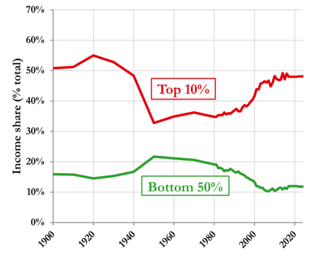

_**Interpretation:**_ The Top 10% income share is equal to 48% in 2024. Income is measured after the operation of pensions and unemployment insurance systems and before income tax. _**Sources and series:**_ wir2026.wid.world/methodology. 

192 

Country-sheets 

## **THAILAND** 

� 71,619,863 **||** � e1,096 (avg. monthly income, PPP) 

**Table 1:** _**Inequality outlook – Thailand**_ 

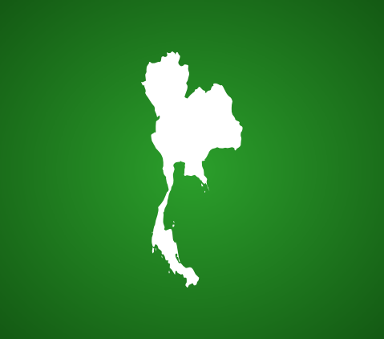

||**Income**|**Income**|**Wealth**|**Wealth**|
|---|---|---|---|---|
||**Avg.** **Income** **(PPP €)**|**Share** **of** **total(%)**|**Avg.** **Wealth** **(PPP €)**|**Share** **of** **total(%)**|
|**Full** **pop.**|13,149|100.0%|60,552|100.0%|
|**Bottom** **50%**|1,465|11.1%|2,240|3.7%|
|**Middle** **40%**|12,103|36.8%|47,685|31.5%|
|**Top** **10%**|68,502|52.1%|392,380|64.8%|
|**Top** **1%**|259,512|19.7%|1,955,844|32.3%|
|**Year**|||**2014**|**2024**|
|**Top 10% to Bot. 50%** **Income gap**|||42.1|46.8|
|**Female labor share**|||44.5%|46.5%|

## **Inequality in Thailand** 

_**Interpretation:**_ Country has a transparency index of 3.5/20. All values are estimated at per capita (full population) level. See glossary for all definitions of concepts and indicators. 

In Thailand, inequality remains high and has increased over the past decade. The top 10% of earners capture 52% of total income, while the bottom 50% receive only 11%. Wealth concentration is even stronger, with the richest 10% holding 65% of total wealth and the top 1% holding 32%. Average income per capita is 13,100 euros (PPP), and average wealth stands at 60,500 euros (PPP). The income gap between the top 10% and the bottom 50% widened from 42 to 47 between 2014 and 2024, indicating rising disparities. Female labor participation increased slightly from 44.5% to 46.5%. Overall, both income and wealth in Thailand are highly concentrated, with inequality continuing to intensify. 

_**Sources and series:**_ wir2026.wid.world/methodology. 

**Figure 1:** _**Top 10% and bottom 50% income shares in Thailand, 1980-2024**_ 

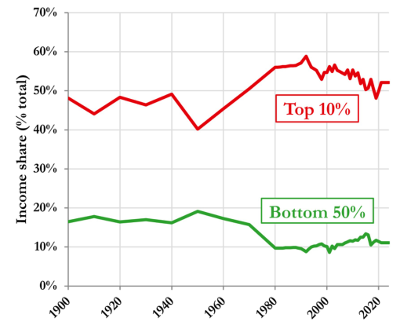

_**Interpretation:**_ The Top 10% income share is equal to 52% in 2024. Income is measured after the operation of pensions and unemployment insurance systems and before income tax. _**Sources and series:**_ wir2026.wid.world/methodology. 

193 

Country-sheets 

## **TÜRKIYE** 

� 87,685,426 **||** � e1,903 (avg. monthly income, PPP) 

**Table 1:** _**Inequality outlook – Türkiye**_ 

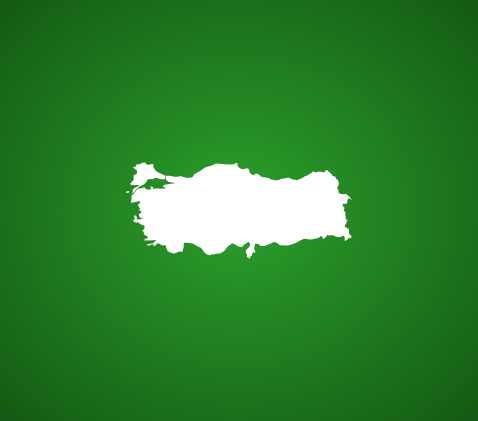

||**Income**|**Income**|**Wealth**|**Wealth**|
|---|---|---|---|---|
||**Avg.** **Income** **(PPP €)**|**Share** **of** **total(%)**|**Avg.** **Wealth** **(PPP €)**|**Share** **of** **total(%)**|
|**Full** **pop.**|22,830|100.0%|105,619|100.0%|
|**Bottom** **50%**|3,482|15.2%|2,852|2.7%|
|**Middle** **40%**|18,009|31.6%|76,310|28.9%|
|**Top** **10%**|121,619|53.3%|722,437|68.4%|
|**Top** **1%**|484,689|21.2%|3,707,243|35.1%|
|**Year**|||**2014**|**2024**|
|**Top 10% to Bot. 50%** **Income gap**|||32.3|34.9|
|**Female labor share**|||25.3%|29.2%|

## **Inequality in Türkiye** 

_**Interpretation:**_ Country has a transparency index of 3/20. All values are estimated at per capita (full population) level. See glossary for all definitions of concepts and indicators. _**Sources and series:**_ wir2026.wid.world/methodology. 

In Türkiye, inequality remains high and has increased slightly over the past decade. The top 10% of earners receive 53% of total income, while the bottom 50% account for only 15%. Wealth is even more concentrated: the richest 10% hold 68% of total wealth, and the top 1% alone holds 35%. Average income per capita is 22,800 euros (PPP), and average wealth stands at 105,600 euros (PPP). The income gap between the top 10% and the bottom 50% widened significantly from 32 to 35 between 2014 and 2024, indicating growing disparities. Female labor participation increased from 25% to 29% over the same period. Overall, both income and wealth in Türkiye are increasingly concentrated among top earners and top wealth holders. 

**Figure 1:** _**Top 10% and bottom 50% income shares in Türkiye, 1980-2024**_ 

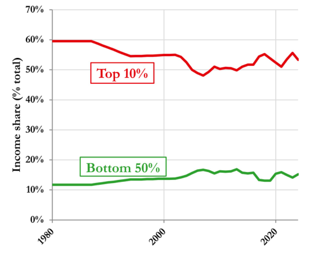

_**Interpretation:**_ The Top 10% income share is equal to 53% in 2024. Income is measured after the operation of pensions and unemployment insurance systems and before income tax. 

_**Sources and series:**_ wir2026.wid.world/methodology. 

194 

Country-sheets 

## **U.A.E** 

� 11,346,000 **||** � e3,811 (avg. monthly income, PPP) 

**Table 1:** _**Inequality outlook – U.A.E**_ 

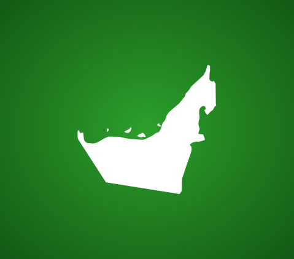

||**Income**|**Income**|**Wealth**|**Wealth**|
|---|---|---|---|---|
||**Avg.** **Income** **(PPP €)**|**Share** **of** **total(%)**|**Avg.** **Wealth** **(PPP €)**|**Share** **of** **total(%)**|
|**Full** **pop.**|45,737|100.0%|149,720|100.0%|
|**Bottom** **50%**|6,384|13.9%|6,438|4.3%|
|**Middle** **40%**|42,827|37.5%|129,882|34.7%|
|**Top** **10%**|222,543|48.7%|913,291|61.0%|
|**Top** **1%**|732,147|16.0%|3,997,521|26.7%|
|**Year**|||**2014**|**2024**|
|**Top 10% to Bot. 50%** **Income gap**|||42.0|34.9|
|**Female labor share**|||12.3%|18.8%|

## **Inequality in the United Arab Emirates** 

_**Interpretation:**_ Country has a transparency index of 2.5/20. All values are estimated at per capita (full population) level. See glossary for all definitions of concepts and indicators. 

In the United Arab Emirates, inequality remains high but shows a reduction over the past decade. The top 10% of earners receive 49% of total income, while the bottom 50% account for 14%. Wealth is heavily concentrated: the richest 10% hold 61% of total wealth, and the top 1% alone holds 27%. Average income per capita is 45,700 euros (PPP), and average wealth stands at 150,000 euros (PPP). The income gap between the top 10% and the bottom 50% narrowed from 42 to 35 between 2014 and 2024, indicating a modest decrease in disparities. Female labor participation increased from 12% to 19% over the same period. Overall, income and wealth remain concentrated at the top in the United Arab Emirates, despite recent improvements in gender inclusion. 

_**Sources and series:**_ wir2026.wid.world/methodology. 

**Figure 1:** _**Top 10% and bottom 50% income shares in the United Arab Emirates, 1980-2024**_ 

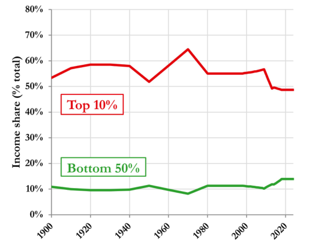

_**Interpretation:**_ The Top 10% income share is equal to 49% in 2024. Income is measured after the operation of pensions and unemployment insurance systems and before income tax. _**Sources and series:**_ wir2026.wid.world/methodology. 

195 

Country-sheets 

## **UNITED KINGDOM** 

� 69,551,332 **||** � e2,997 (avg. monthly income, PPP) 

**Table 1:** _**Inequality outlook – United Kingdom**_ 

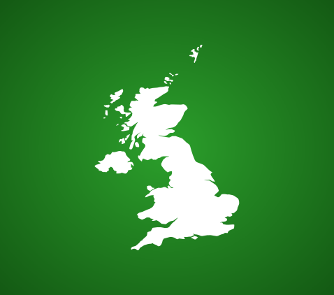

||**Income**|**Income**|**Wealth**|**Wealth**|
|---|---|---|---|---|
||**Avg.** **Income** **(PPP €)**|**Share** **of** **total(%)**|**Avg.** **Wealth** **(PPP €)**|**Share** **of** **total(%)**|
|**Full** **pop.**|35,959|100.0%|166,024|100.0%|
|**Bottom** **50%**|7,751|21.4%|7,637|4.6%|
|**Middle** **40%**|38,471|42.8%|158,552|38.2%|
|**Top** **10%**|128,583|35.8%|947,994|57.1%|
|**Top** **1%**|464,276|12.9%|3,536,301|21.3%|
|**Year**|||**2014**|**2024**|
|**Top 10% to Bot. 50%** **Income gap**|||18.1|16.6|
|**Female labor share**|||37.7%|38.9%|

## **Inequality in the United Kingdom** 

_**Interpretation:**_ Country has a transparency index of 15.5/20. All values are estimated at per capita (full population) level. See glossary for all definitions of concepts and indicators. 

In the United Kingdom, inequality is moderate and has remained relatively stable over the past decade. The top 10% of earners receive 36% of total income, while the bottom 50% account for 21%. Wealth concentration is higher, with the richest 10% holding 57% of total wealth and the top 1% holding 21%. Average income per capita is 36,000 euros (PPP), and average wealth stands at 166,000 euros (PPP). The income gap between the top 10% and the bottom 50% declined slightly, moving from 18.1 to 16.6 between 2014 and 2024. Female labor participation increased from 37.7% to 38.9% over the same period. Overall, the United Kingdom displays stable income distribution patterns, though wealth remains concentrated among the top groups. 

_**Sources and series:**_ wir2026.wid.world/methodology. 

**Figure 1:** _**Top 10% and bottom 50% income shares in the United Kingdom, 1900-2024**_ 

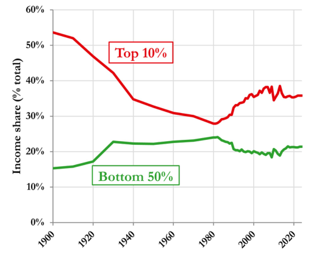

_**Interpretation:**_ The Top 10% income share is equal to 36% in 2024. Income is measured after the operation of pensions and unemployment insurance systems and before income tax. _**Sources and series:**_ wir2026.wid.world/methodology. 

196 

Country-sheets 

## **UNITED STATES** 

� 347,275,807 **||** � e3,947 (avg. monthly income, PPP) 

**Table 1:** _**Inequality outlook – United States**_ 

||**Income**|**Income**|**Wealth**|**Wealth**|
|---|---|---|---|---|
||**Avg.** **Income** **(PPP €)**|**Share** **of** **total(%)**|**Avg.** **Wealth** **(PPP €)**|**Share** **of** **total(%)**|
|**Full** **pop.**|47,359|100.0%|264,686|100.0%|
|**Bottom** **50%**|6,395|13.4%|2,647|1.0%|
|**Middle** **40%**|47,129|39.8%|195,206|29.5%|
|**Top** **10%**|221,438|46.8%|1,842,213|69.6%|
|**Top** **1%**|981,924|20.7%|9,211,063|34.8%|
|**Year**|||**2014**|**2024**|
|**Top 10% to Bot. 50%** **Income gap**|||34.5|34.6|
|**Female labor share**|||37.4%|39.7%|

## **Inequality in the United States, Still Amongst the Highest of Rich Countries** 

_**Interpretation:**_ Country has a transparency index of 15.5/20. All values are estimated at per capita (full population) level. See glossary for all definitions of concepts and indicators. 

In the United States, inequality remains high and has shown little change over the past decade. The top 10% of earners receive 47% of total income, while the bottom 50% account for only 13%. Wealth inequality is even more concentrated, with the richest 10% holding 70% of total wealth and the top 1% alone holding 35%. Average income per capita is 47,400 euros (PPP), and average wealth stands at 264,700 euros (PPP). The income gap between the top 10% and the bottom 50% remained stable, moving from 34.5 to 34.6 between 2014 and 2024. Female labor participation increased from 37.4% to 39.7% over this period. Overall, income and wealth in the United States remain highly concentrated among the top groups, with persistent disparities across inequality dimensions. 

_**Sources and series:**_ wir2026.wid.world/methodology. 

**Figure 1:** _**Top 10% and bottom 50% income shares in the United States, 1900-2024**_ 

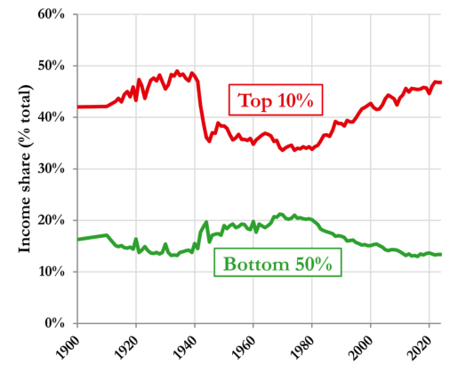

_**Interpretation:**_ The Top 10% income share is equal to 47% in 2024. Income is measured after the operation of pensions and unemployment insurance systems and before income tax. _**Sources and series:**_ wir2026.wid.world/methodology. 

197 

Country-sheets 

## **VIETNAM** 

� 101,598,527 **||** � e761 (avg. monthly income, PPP) 

**Table 1:** _**Inequality outlook – Vietnam**_ 

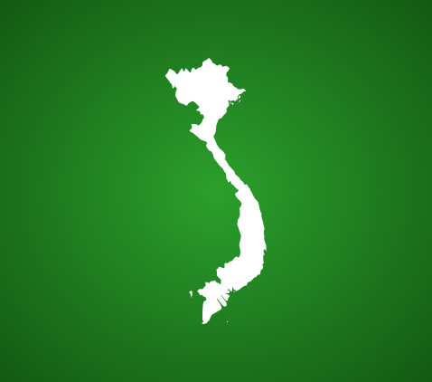

||**Income**|**Income**|**Wealth**|**Wealth**|
|---|---|---|---|---|
||**Avg.** **Income** **(PPP €)**|**Share** **of** **total(%)**|**Avg.** **Wealth** **(PPP €)**|**Share** **of** **total(%)**|
|**Full** **pop.**|9,126|100.0%|38,655|100.0%|
|**Bottom** **50%**|1,448|15.8%|1,778|4.6%|
|**Middle** **40%**|9,368|41.1%|35,079|36.3%|
|**Top** **10%**|39,382|43.2%|228,062|59.0%|
|**Top** **1%**|141,660|15.5%|954,768|24.7%|
|**Year**|||**2014**|**2024**|
|**Top 10% to Bot. 50%** **Income gap**|||26.7|27.2|
|**Female labor share**|||39.6%|38.8%|

## **Inequality in Vietnam** 

_**Interpretation:**_ Country has a transparency index of 5/20. All values are estimated at per capita (full population) level. See glossary for all definitions of concepts and indicators. _**Sources and series:**_ wir2026.wid.world/methodology. 

In Vietnam, inequality is moderate and has remained broadly stable over the past decade. The top 10% of earners receive 43% of total income, while the bottom 50% account for 16%. Wealth is more concentrated, with the richest 10% holding 59% of total wealth and the top 1% holding 25%. Average income per capita is 9,100 euros (PPP), and average wealth stands at 38,700 euros (PPP). The income gap between the top 10% and the bottom 50% increased slightly from 26.7 to 27.2 between 2014 and 2024, indicating stable but persistent disparities. Female labor participation remained nearly unchanged, moving from 39.6% to 38.8%. Overall, Vietnam shows stable income distribution alongside a persistent concentration of wealth at the top. ‘ 

**Figure 1:** _**Top 10% and bottom 50% income shares in Vietnam, 1980-2024**_ 

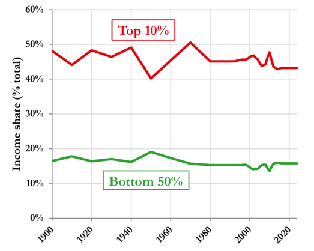

_**Interpretation:**_ The Top 10% income share is equal to 43% in 2024. Income is measured after the operation of pensions and unemployment insurance systems and before income tax. _**Sources and series:**_ wir2026.wid.world/methodology. 

198 

# **APPENDIX** 

Appendix 

## **Appendix 1. Concepts of income and wealth inequality used in this report** 

Measuring inequality requires clarity about what exactly we mean by “income” and “wealth.” Different definitions lead to different results, and ensuring comparability across countries is essential. Without a shared framework, international comparisons risk producing misleading conclusions. 

The _World Inequality Database_ and its international network of researchers devote particular attention to harmonizing these definitions. The benchmark concept of income used in this report is close to what many individuals around the world see on their paychecks: income before income and wealth taxes, but after the operation of pension and retirement systems. We call this post-replacement, pre-income tax income. This measure includes most cash redistribution taking place through pensions or unemployment insurance, thereby capturing the redistributive role of social insurance systems. 

A second concept used throughout this report is post-tax income. This measure goes a step further: it accounts for all income, wealth, and consumption taxes, and adds non-replacement transfers such as healthcare, disability, or housing benefits. Together, these two concepts allow us to capture the impact of different policy choices on income distribution. Unless otherwise noted, incomes are reported at the level of adult individuals, with incomes split equally between members of married couples. 

Personal wealth is defined as the sum of financial assets (such as deposits, stocks, bonds, or equity) and non-financial assets (such as housing or business ownership), net of debts. This definition provides a comprehensive picture of household resources and indebtedness. 

For readers interested in methodological details, the _World Inequality Database_ and the _Distributional National Accounts Guidelines_ provide extensive discussion of the definitions, standards, and techniques used in this report.[15] 

## **Appendix 2. The** _**World Inequality Database**_ **and the** _**Distributional National Accounts Project**_ 

Measuring inequality is not straightforward. Data are often incomplete, inconsistent, or simply unavailable, and yet tracking how income and wealth are distributed is essential for understanding the effects of economic growth and policy. The World Inequality Lab addresses this challenge by systematically combining the best available sources—tax records, household surveys, wealth reports, and national accounts—into transparent and comparable series. All of these results are made openly available through the _World Inequality Database_ (wid.world), so that researchers, policymakers, and the general public can follow the evidence.[16] 

The origins of this effort lie in the renewed use of tax data to study inequality, following the pioneering work of Simon Kuznets, Anthony Atkinson, and Alan Harrison. Building on this tradition, Thomas Piketty and Emmanuel Saez developed the first long-run income and wealth series for France and the United States, based on fiscal records. Their findings revealed striking trends in top income shares—particularly the rise of the top 1%, and reshaped the global debate on inequality. These studies soon expanded into the _World Top Incomes Database_ and, eventually, into today’s _World Inequality Database_ , which now brings together more than two hundred researchers worldwide. 

Over time, the project evolved beyond documenting the incomes of groups at the very top. The _Distributional National Accounts (DINA) Project_ , led by the World Inequality Lab in collaboration with national statistical offices and international organizations, now aims to align inequality measures with national accounts. The goal is ambitious: to publish each year not only growth rates for the economy as a whole, as governments traditionally do, but also growth rates for different social groups. Without such information, it is impossible to know who truly benefits from growth and who is being left behind.[17] 

This work is technically demanding. Household surveys provide invaluable socio demographic detail but often underestimate 

200 

Appendix 

top incomes and wealth. Tax data, while better at capturing high earners, are shaped by changing fiscal rules and cover only those who file returns. National accounts, by contrast, offer standardized definitions of income and wealth, but they are not designed to describe their distribution. The DINA approach reconciles these sources, using national accounts as a benchmark and distributing income and wealth across groups in a consistent way. While the resulting estimates are not perfect, they represent the most rigorous attempt to date at building a global, transparent, and comparable picture of inequality. 

Today, wid.world is both a research infrastructure and a global community. Over two hundred inequality scholars from all continents work in close partnership with national statistical offices, research centers, and international organizations to improve data quality, build capacity, and define shared standards. By making all methodological guidelines, computer codes, and data publicly available, the World Inequality Lab ensures that the study of inequality remains open, collaborative, and accountable. 

## **Appendix 3. The rich ecosystem of global inequality datasets** 

The study of inequality today rests on a remarkably diverse landscape of data sources. Around the world, numerous databases and research groups track different aspects of income and wealth distribution, each offering unique insights. For example, the World Bank’s _PovcalNet_ compiles consumption inequality statistics from household surveys and is widely used to calculate global poverty. The _Luxembourg Income Study_ (LIS) provides harmonized household survey data across dozens of countries, creating a foundation for cross-national research spanning decades. The OECD’s _Income Distribution Database_ (IDD) focuses on advanced economies, while the _University of Texas Inequality Project_ uses industrial and sectoral data to analyze distributional trends. The _Commitment to Equity (CEQ) Database_ sheds light on how taxes and transfers affect inequality, and UNU-WIDER’s _World Income Inequality_ 

_Database_ provides broad global coverage. In addition, regional initiatives such as _SEDLAC_ in Latin America and the Caribbean and _EU-SILC_ in Europe make it possible to study inequality dynamics with finer regional detail. 

These datasets have been invaluable not only to academic researchers but also to policymakers, journalists, and citizens trying to make sense of how inequality evolves. No single database can provide a definitive picture: each reflects different choices about definitions, data sources, and coverage. Rather than competing, these resources complement one another. Some, like _PovcalNet_ , are essential for global poverty measurement. Others, like LIS, allow researchers to explore the interplay between inequality and broader welfare dimensions across countries. Regional databases make it possible to examine trends in particular contexts, while CEQ provides a critical lens on fiscal redistribution. 

Most of these sources, however, rely primarily on household surveys. Surveys remain indispensable: they not only capture data on income and wealth but also collect information on education, gender, race, geography, and other social dimensions, helping to situate inequality in broader societal contexts. Yet surveys also come with important limitations. Because they rely on self-reported answers, they tend to understate the incomes and assets of top groups, resulting in inequality estimates that often underestimate the true concentration of resources. This problem also helps explain the recurring gap between macroeconomic growth (measured in GDP) and household income growth observed in surveys. 

The _World Inequality Database_ seeks to address these shortcomings by combining household surveys with administrative tax data, national accounts, and even wealth rankings. By integrating these diverse sources, wid.world aims to provide a more comprehensive and consistent picture of income and wealth dynamics. 

This effort is not pursued in isolation. Over the years, the World Inequality Lab has worked closely with other data providers, including LIS, CEQ, and _Povcal_ , to build synergies and improve public statistics. It has also forged partnerships with international institutions such as the United Nations and 

201 

Appendix 

with numerous national statistical offices and tax authorities. These collaborations have played a central role in advancing the development of new global standards for inequality measurement, particularly in the context of revisions to the international system of national accounts. 

## **Appendix 4. The relationship between gross domestic product, national income, and national wealth** 

Economic growth lies at the center of policy debates worldwide. But what exactly do we mean when we talk about “growth”? The term usually refers to changes in gross domestic product (GDP), the total value of goods and services produced in an economy over a year, minus the value of intermediary goods and services used in production. Since its adoption in the 1940s, however, GDP has been heavily criticized: it overlooks environmental degradation, fails to capture human well-being, and says nothing about inequality. A rising GDP, in other words, does not automatically mean that living standards are improving for most people. This realization has led to the development of complementary indicators, such as the _Human Development Index_ , which incorporates education and health, or “green GDP” measures that factor in environmental costs. 

Following the 2008 financial crisis, new momentum gathered around the call to move “beyond GDP.” The Stiglitz-Sen-Fitoussi Commission on measuring well-being, for example, urged governments to develop richer measures of progress. The work of the World Inequality Lab builds on this tradition. We aim to show not just how much economies grow, but also how the fruits of growth are distributed across social groups (rich and poor, women and men) and how production interacts with environmental sustainability. 

and second, it accounts for net income flows with the rest of the world. These adjustments matter. A country that grows by depleting its forests may see GDP rise, but national income will reveal the erosion of its productive base. Similarly, in economies with large inflows or outflows of foreign capital income, national income provides a clearer picture of what residents actually receive. Formally, national income equals GDP minus capital depreciation plus net income from abroad. 

Understanding inequality also requires going beyond flows to examine stocks, namely national wealth. National wealth represents the assets owned by a country’s residents, both domestically and abroad. It can be held privately (by households) or publicly (by the state). The study of wealth illuminates key questions about debt, public infrastructure, the balance between public and private sectors, and the role of inheritance in shaping inequality across generations. 

Crucially, wealth also reveals forms of inequality that income statistics can miss. Some of the world’s wealthiest individuals declare relatively modest annual incomes, while their fortunes grow substantially through rising asset values. These capital gains are typically excluded from GDP and national income, since they represent changes in asset prices rather than new production. But for individuals, they are an undeniable source of enrichment. This is why a comprehensive understanding of inequality requires combining income and wealth measures, an approach we adopt throughout this report. 

Nevertheless, growth indicators remain indispensable for analyzing inequality. For this purpose, we focus on national income rather than GDP. National income corrects two major shortcomings of GDP: first, it subtracts the depreciation of capital used in production (from roads and machines to forests and other natural resources), 

202 

Appendix 

## **Appendix 5. Comparing incomes, assets, and purchasing power across the globe** 

How can we meaningfully compare income levels and asset ownership across countries when the cost of living varies so dramatically? A salary that allows for a comfortable life in one country may barely cover basic needs in another. Simply converting incomes at market exchange rates (MER) misses these differences and, therefore, does not fully capture global disparities in living standards. 

To address this, researchers often use purchasing power parity (PPP). The idea is straightforward: incomes are adjusted by the relative price of goods and services across countries. Housing, for example, is much cheaper in India than in France, while wine is typically less expensive in France than in India. To make valid comparisons, we need information not only on relative prices but also on the composition of people’s consumption baskets. This is precisely the goal of the _International Comparison Programme_ (ICP), a global effort launched in the 1970s that now involves more than 190 countries and major international statistical agencies. Its surveys, most recently updated in 2023 with data for 2021, provide a benchmark for global PPP measures.[18] While these figures are far from perfect, relying on national averages that obscure regional differences and variations across social groups, they still offer a clearer lens on purchasing power inequality than simple MER conversions. 

At the same time, MER remain highly relevant for certain perspectives. From the standpoint of individuals who earn and spend locally, PPP gives the more accurate picture. But in an increasingly globalized world—where the wealthy can shift their spending across borders, tourists buy abroad, online shopping transcends national markets, and migrants send remittances homeMER provides a useful complementary perspective. For global millionaires and billionaires in particular, whose wealth is highly mobile, MER often better reflects their real purchasing power. 

In practice, the choice between PPP and MER depends on the object of study. PPP is generally more appropriate for assessing inequality in living standards among ordinary 

households across countries, while MER provides valuable insights into cross-border wealth comparisons and international economic flows. In this report, we use PPP for most income comparisons, and a mix of PPP and MER for wealth, in order to capture both local realities and the global reach of assets. 

## **Appendix 6. Forecasting 2025** 

For the 2025 extension of the _World Inequality Database_ series, we adopt a set of simple but transparent forecasting rules. The guiding principle is to preserve the long-run dynamics already present in the data, while smoothing over short-term fluctuations that are unlikely to carry structural meaning. This ensures that the forecasted values are consistent with the logic of the WID series, while remaining credible for cross-country and historical comparisons. 

Population figures are not extrapolated mechanically but instead rely on the United Nations’ medium-variant projections. This provides a robust demographic baseline from which all per capita measures are derived. For macroeconomic aggregates such as GDP, national income, or trade flows, we extend the data by applying the average annual growth rate observed in the previous decade. In practice, this means that the 2025 value for each country is projected by following the country’s own ten-year trend rather than relying on short-term volatility. 

Other indicators, including shares of income or wealth, ratios, and price indexes, follow a different logic. These series tend to be more sensitive to short-term movements, and so their 2025 values are obtained using the average of the two most recent years. This approach captures the recent configuration of inequality shares or price structures without imposing long-run dynamics that may not persist. At the same time, it helps to reduce the influence of extraordinary shocks such as the COVID-19 pandemic, when prices and distributions shifted in atypical ways. By focusing on a short and recent average, we aim to smooth out such distortions and avoid introducing bias from one-off events that are unlikely to reflect longer-term patterns. 

203 

Appendix 

The result is a unified dataset in which every country has coherent forecasts through 2025. By design, the projections are modest, transparent, and easy to interpret: they do not aim to predict shocks or policy changes, but rather to extend the existing series in a way that reflects the underlying trends of the recent past. This approach provides a consistent foundation for comparative analysis and for communicating the current state of global inequality. 

## **Appendix 7. How do we measure wealth inequality within countries?** 

Tracking wealth has long been a concern of rulers and states. Centuries ago, monarchs sought to measure the fortunes of their subjects as a basis for taxation. However, it is only in recent decades that governments have begun to systematically compile and publish aggregate balance sheets—official records of the assets and liabilities held by different sectors of the economy. Even today, many countries, particularly lowand middle-income ones, lack this basic information, making global comparisons of wealth far from straightforward. 

Our approach begins with the international framework of the System of National Accounts, which distinguishes six institutional sectors that can own wealth: households, non-profit institutions serving households, non-financial corporations, financial corporations, the general government, and the rest of the world. For the purposes of this report, we regroup these into three broad categories: (1) private sector: households and non-profit institutions serving households; (2) corporate sector: financial and non-financial corporations; and (3) general government. 

Wealth itself is composed of four broad classes of assets and liabilities. Housing assets capture the value of dwellings and the land beneath them, usually measured together through real estate transactions. Business and other non-financial assets include machinery, equipment, and land not used for housing. Financial assets range from deposits and bonds to equities, life insurance, and pension funds. Finally, liabilities cover debts owed by each sector, 

with a distinction between equity and non-equity liabilities for corporations. 

Constructing a consistent measure of national wealth requires pulling together data on each of these components. Where comprehensive balance sheets exist, the task is relatively straightforward. But in many countries, certain categories are missing. To fill these gaps, we rely on empirical patterns observed in countries with complete data, applying estimation methods to reconstruct missing items. The result is the most extensive harmonized database of aggregate wealth yet available. 

By combining this information with distributional estimates, we can examine not only how much wealth exists within a country, but also how it is shared among different groups, an essential step toward understanding the dynamics of inequality. **Appendix 8. Methodology for measuring female labor income share** The female labor income shares data come from the most comprehensive effort to date to track women’s share of labor income worldwide, covering the period from 1990 to the present. Developed at the World Inequality Lab, these series combine multiple international sources into a single, harmonized framework. The full methodological details are provided in Neef and Robilliard (2021), but the main principles are summarized here. 

Measuring gender inequality across countries is inherently challenging. Concepts of labor income vary widely, and national statistics often differ in whether they include self-employment, part-time work, or specific sectors. To overcome these issues, Neef and Robilliard (2021) rely on harmonized microdata from the Luxembourg Income Study (LIS) and the EU-SILC, which allow them to directly calculate women’s share of labor income in fifty-eight countries. They then estimate a regression model linking female labor income shares to wage and self-employment patterns. This model is applied to International Labour Organization (ILO) estimates, which provide the most globally comprehensive data on labor market participation and earnings, to impute female 

204 

Appendix 

labor income shares for all other countries and years. 

The result is a combined series: in countries with LIS or EU-SILC data, observed values are interpolated between survey years and extrapolated using the imputed estimates; in countries without survey data, the estimates rely entirely on imputation. While these series should be interpreted with some caution at the individual country level, they offer robust and valuable insights when examined from a comparative, cross-country perspective. 

With this foundation, Neef and Robilliard (2021) explore both the level and evolution of women’s labor income shares across world regions. They also break down the share into two components: the gender earnings ratio (differences in pay between women and men) and the gender employment ratio (differences in participation in the labor force). 

205 

Notes 

## **Notes** 

15See Chancel, Flores, et al. (2025); Chancel, Piketty, et al. (2022); Alvaredo (2018). 

16See Facundo Alvaredo et al. (2022); Blanchet, Saez, and Zucman (2022). 

17See Chancel, Flores, et al. (2025). 

> 18See Gómez-Carrera et al. (2024); Nievas and Piketty (2025). 

## **References** 

- Alvaredo, F (2018). _World Inequality Report 2018_ . Harvard University Press. 

- Alvaredo, Facundo et al. (2022). “The inequality (or the growth) we measure: Data gaps and the distribution of incomes”. In: _World Inequality Lab, Working Paper Series_ 2022/07. 

- Blanchet, Thomas, Emmanuel Saez, and Gabriel Zucman (2022). “Real-time inequality”. In: _National Bureau of Economic Research_ . 

- Chancel, Lucas, Ignacio Flores, et al. (2025). _Distributional National Accounts Guidelines: Methods and Concepts used in the World Inequality Database_ . `https://wid.world/d ocument/distributional-national-accounts-dina -guidelines-2025-methods-and-concepts-used-i n-the-world-inequality-database/` . Version 3.0. 

- Chancel, Lucas, Thomas Piketty, et al. (2022). _World Inequality Report 2022_ . Harvard University Press. 

- Gómez-Carrera, Ricardo et al. (2024). “Global Inequality Update 2024: New Insights from Extended WID Macro Series”. In: _World Inequality Lab, Technical Notes_ 2024/11. 

- Neef, Theresa and Anne-Sophie Robilliard (2021). “Half the Sky? The Female Labor Income Share in a Global Perspective”. In: _World Inequality Lab, Working Paper Series_ 2021/22. 

- Nievas, Gastón and Thomas Piketty (2025). “WID National Accounts Series: Updated and Extended Coverage 1800-2023”. In: _World Inequality Lab, Technical Notes_ 2025/02. 

206 

_“We live in a system where resources extracted from labor and nature in low-income countries continue to sustain the prosperity and the unsustainable lifestyle of people in high-income economies and rich elites across countries. These patterns are not accidents of markets. They reflect the legacy of history and the functioning of institutions, regulations, and policies—all of which are related to unequal power relations that have yet to be rebalanced.”_ 

## **Jayati Ghosh** 

_“History, experiences across countries, and theory all show that today’s extreme inequality is not inevitable. Progressive taxation, strong social investment, fair labor standards, and democratic institutions have narrowed gaps in the past—and can do so again. The_ World Inequality Report 2026 _provides the empirical foundation and intellectual framework for what can be done.”_ 

## **Joseph E. Stiglitz** 

_“Inequality is silent until it becomes scandalous. This report gives voice to inequality—and to the billions of people whose opportunities are frustrated by today’s unequal social and economic structures.”_ 

## **Ricardo Gómez-Carrera** 

_“The_ World Inequality Report 2026 _is an outstanding achievement: the definitive resource to monitor the evolution of inequality globally, in all its dimensions. It is a true global public good and a vital input for the public conversation throughout the world. We should all be immensely thankful to its authors who are doing such a service by disseminating this knowledge, for the benefit of all.”_ 

## **Gabriel Zucman** 

_“The_ World Inequality Report 2026 _shows that inequality is not inevitable, it is shaped by choices, institutions, and power. In a world marked by economic, gender, and climate inequalities, it offers a framework for understanding these interconnections and a call to act: to rebuild solidarity, renew trust in democracy, and share prosperity more fairly across societies.”_ 

## **Rowaida Moshrif** 

_“Extreme inequalities are unsustainable—for our societies and for our ecosystems. Based on four years of work by over 200 researchers on every continent, this report offers a toolbox to inform public debate, to grasp how economic, social and ecological inequalities evolve and intersect—and to drive action.”_ 

## **Lucas Chancel** 

_“At a time of growing inequality around the world, the_ World Inequality Report 2026 _provides an invaluable source of information to help us understand the latest developments and put them in historical perspective. The report provides a rich set of measures, including not only income and wealth, but also gender disparities, regional inequality, and political cleavages within countries. All these facets of inequality are connected and will shape the evolution of our societies. Read the report to understand the facts and participate in the policy debate of what to do about it.”_ 

## **Emmanuel Saez** 

_“The_ World Inequality Report 2026 _comes at a challenging political time, but it is more essential than ever. Only by continuing the historic movement toward equality will we be able to address the social and climate challenges of the coming decades.”_ 

## **Thomas Piketty** 

## **WIR2026.WID.WORLD** 

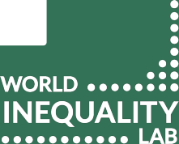

