No 1 /2024 

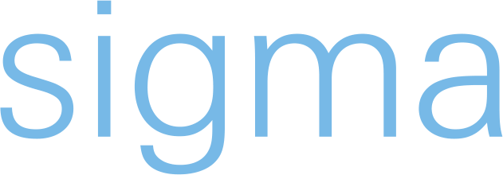

Natural catastrophes in 2023: gearing up for today’s and tomorrow’s weather risks 

- 02 Executive summary 

- 03 Key takeaways 

- 06 Year in review: reaffirming outlook trends 

- 13 Spotlight on severe convective storms 

- 21 Managing property exposures: risk transfer and reduction 

- 28 Concluding remarks 

- 29 Appendix 1 

- 34 Appendix 2 

2 **Swiss Re Institute** _sigma_ No 1/2024 

## Executive summary 

We expect that insured losses from natural catastrophes, which were USD 108 billion in 2023, will continue to grow by 5–7% annually. 

In what was the hottest year on record, natural disasters resulted in insured losses of USD 108 billion in 2023. Indicative of what has become a new norm, the insured losses surpassed USD 100 billion for the fourth consecutive year. We forecast that annual insured losses will grow by 5–7% over the long term, a call much in line with actual loss increases over the last 30 years. Several factors suggest losses will continue to rise: property exposures continue to grow, especially in areas of already high-value concentrations. Exposure growth also tends to be focused in areas of higher catastrophe risk such as flood plains or on coastlines. So far, the impact of changing climates has been small. However, we expect that the contribution from severe weather and other events will likely rise. By extrapolating the aforementioned long-term growth trend, we estimate that today’s insured losses could double in 10 years. 

The earthquake in Turkey and Syria was the costliest event in terms of economic and insured losses, yet roughly 90% of the economic losses were uninsured. 

Last year, economic losses from natural catastrophes reached USD 280 billion, meaning that 62% of the global losses were uninsured. The earthquake in Turkey and Syria was the biggest catastrophe-related humanitarian event, claiming around 58 000 lives. It was also the costliest event for the industry, with insured losses estimated at USD 6.2 billion. In this case, the quake struck areas of low insurance penetration and roughly 90% of the economic losses were not covered, an even more dramatic reminder of the protection gaps that many people across the world face. 

Last year’s global insured losses were driven by high event occurrence, in particular of medium-severity events. 

That this earthquake was the largest insured loss event of 2023 highlights the great variability of possible outcomes. In previous years, the total insured loss was driven by a few, but large, catastrophes that resulted in losses many multiples higher. In 2023, absent a peak event like Hurricane Ian in 2022 that wreaked losses of more than USD 60 billion, the main driver behind the accumulation of insured losses was event frequency. There were 142 insured-loss inducing catastrophes in 2023, a new record. Most were of medium severity, which we define as events resulting in losses of USD 1–5 billion. The number of such events has on average grown by 7.5% each year since 1994, almost double the 3.9% increase of all catastrophes. 

Severe convective storm-related insured losses were USD 64 billion, a new high. 

Medium-severity events include severe convective storms (SCS), which last year resulted in insured losses of an estimated USD 64 billion, a new high. After tropical cyclones, SCS have become the second largest loss-making peril. As with other perils, rising exposures due to economic and population growth, and urbanisation are the main forces driving SCS losses higher. We estimate they account for around a third of the annual growth in SCS-related insured losses seen in the US over the last 15 years. 

Of all SCS, hail storms inflict the most property damage. 

Another driver of rising losses are changes in vulnerabilities. For example, hail is by far the main loss-making culprit of SCS. And aging roof tops, which increasingly host (glass) solar power system installations, a main victim. Specific events last year, such as a series of SCS in Italy in July, set a new record in terms of insured losses ever experienced in a country/region. These signal that it may be time to update loss-potential and returnperiod assumptions. They also confirm the importance of detailed exposure data to better track value concentrations. For instance, for some countries like Italy, the lack of such data has hindered SCS-risk modelling capabilities. 

Adaptation, insurance and mitigation: three necessities to make natural catastrophe insurance more affordable. 

Over the last 30 years, we estimate that natural catastrophe insured losses have grown by 3 percentage points more annually than the global economy (in inflation adjusted terms). Insurance market functioning requires that premiums be commensurate with the underlying risk, but as losses continue to grow, higher rates alone will not suffice. The first step to cutting losses is to reduce the loss potential through adaptation measures like enforcing building codes, building flood control infrastructure and discouraging settlement in areas prone to natural perils. Yet in the face of climate change, adaptation and insurance can only go so far. Mitigation of greenhouse gas emissions is also essential to counter the build-up of physical risks. Property owners, regulators, supervisors and the insurance industry all have a role to play. As do governments, by investing in resilient infrastructure and incentivising uptake of adaption measures. 

_sigma_ No 1/2024 **Swiss Re Institute** 3 

## Key takeaways 

## The year 2023 in a nutshell 

Economic losses 

Insured losses 

Natural catastrophe insured losses 

## Total 

## USD 291 billion 

## Total 

## USD 117 billion 

## Total 

## USD 108 billion 

2022: USD 295 bn 10-year average: USD 235 bn Natural catastrophes USD 280 bn* Man-made disasters USD 11 bn 

0.26% of global GDP 

10-year average: 0.23% 

*Ranks 19[th] in terms of normalised economic losses from natural catastrophes since 1970** 

Victims 

## >76 000 

2022: USD 141bn 10-year average: USD 99 bn 

Natural catastrophes USD 108 bn Man-made disasters USD 9 bn 20% of global property direct premiums written 

10-year average: 20% 

Catastrophe events 

## 332 

2022: USD 133 bn 10-year average: USD 89 bn Secondary perils USD 87 bn (81%) Primary perils 2022: USD 57 bn USD 21 bn (19%) 

2022: USD 76 bn 

Global catastrophe protection gap[***] 

2023 USD 174 bn 2022 USD 155 bn 10-year average USD 136 bn 

**Normalised = economic losses are adjusted for both inflation and real GDP growth effects for the period 1984–2023. For more details on definitions and methodology, see appendix. ***Global catastrophe gap = natural and man-made disasters. Source: Swiss Re Institute 

## Learnings from key events of 2023 

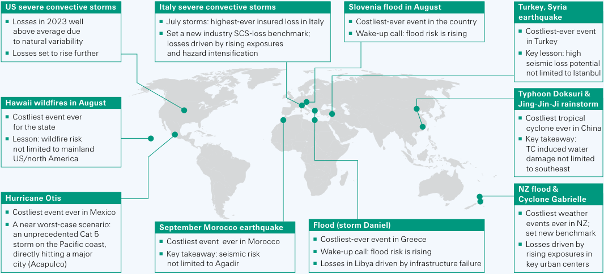

**----- Start of picture text -----** 
US severe convective storms Italy severe convective storms Slovenia flood in August Turkey, Syria  Losses in 2023 well   July storms: highest-ever insured loss in Italy  Costliest-ever event in the country earthquake  above average due   Set a new industry SCS-loss benchmark;   Wake-up call: flood risk is rising  Costliest-ever event  to natural variability  losses driven by rising exposures   in Turkey  Losses set to rise further  and hazard intensification  Key lesson: high  seismic loss potential  not limited to Istanbul Typhoon Doksuri & Hawaii wildfires in August Jing-Jin-Ji rainstorm  Costliest event ever   Costliest tropical  for the state  cyclone ever in China  Lesson: wildfire risk   Key takeaway:  not limited to mainland   TC induced water  US/north America  damage not limited  to southeast NZ flood & Hurricane Otis Cyclone Gabrielle  Costliest event ever in Mexico  Costliest weather  A near worst-case scenario:  September Morocco earthquake Flood (storm Daniel)  events ever in NZ;  an unprecedented Cat 5  storm on the Pacific coast,   Costliest event  ever in Morocco  Costliest-ever event in Greece     set new benchmark Losses driven by  directly hitting a major   Key takeaway: seismic risk   Wake-up call: flood risk is rising  rising exposures in  city (Acapulco)  not limited to Agadir  Losses in Libya driven by infrastructure failure  key urban centers **----- End of picture text -----** 

Note: costliest = highest insured loss (in inflation-adjusted terms) from a natural catastrophe event on _sigma_ records. Source: Swiss Re Institute 

4 **Swiss Re Institute** _sigma_ No 1/2024 

## Separating annual variability from long-term trend 

Actual loss outcomes fluctuate greatly year-on-year, with fluctuations mostly due to natural variability. To put the 2023 loss experience into perspective, we present the deviation of annual insured losses from the long-term trend. In real terms, the year’s global natural catastrophe insured losses were US 10 billion below the trend amount (USD 118 billion). In 2021 and 2022, actual losses exceeded trend by USD 21 and 22 billion, respectively. The deviation of actual from trend in any one year can be significant. Actual losses can be lower than trend, especially in years in which no outlier peak-loss events occur. This was the case last year as no major hurricane event occurred, and with the insured losses from the earthquake in Turkey low on account of the low insurance penetration in the affected regions. Last year’s tropical cyclone losses were about 65% below the trend estimate, overcompensating for the 54% above-trend losses from severe convective storms (SCS). Overall, natural catastrophe losses aggregated out at 8% below trend in 2023. 

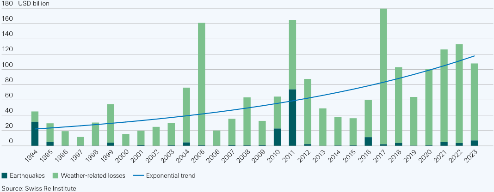

**----- Start of picture text -----** 
180 USD billion 160 140 120 100 80 60 40 20 0 Earthquakes Weather-related losses Exponential trend Source: Swiss Re Institute 1994 1995 1996 1997 1998 199920002001200220032004200520062007200820092010 2011 2012 2013 2014 2015 2016 2017 2018 2019 2020202120222023 **----- End of picture text -----** 

## Growth in annual insured losses from SCS mostly due to macroeconomic factors 

In 2023, global insured losses from SCS accumulated to more than USD 60 billion, a record high, continuing a trend in evidence over many years. As per usual, most of the losses (85%) originated in the US. However, insured losses are currently growing faster in Europe than in the US, and have topped USD 5 billion in each of the last three years. This warrants and has prompted better monitoring of SCS in Europe than in previous years. Separating out the different contributors to SCS losses in the US shows that, after adjusting for general inflation, increased exposure values due to economic and population growth, urbanisation and wealth accumulation, are the main driver of the losses. Cost increases in the construction sector specifically are another factor driving losses. Climate change effects also factor, but there are still many uncertainties around the assoicated losses. 

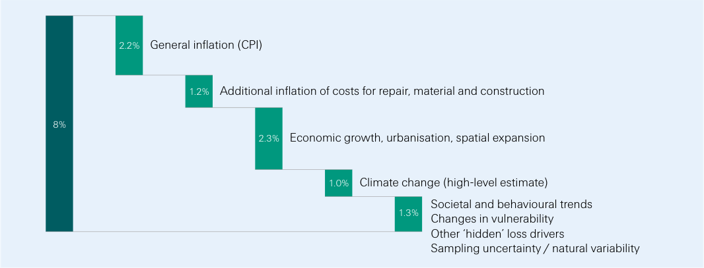

**----- Start of picture text -----** 
2.2% General inflation (CPI) 1.2% Additional inflation of costs for repair, material and construction 8% 2.3% Economic growth, urbanisation, spatial expansion 1.0% Climate change (high-level estimate) Societal and behavioural trends 1.3% Changes in vulnerability Other ‘hidden’ loss drivers Sampling uncertainty / natural variability **----- End of picture text -----** 

Source: Swiss Re Institute 

_sigma_ No 1/2024 **Swiss Re Institute** 5 

## Managing today’s and tomorrow’s weather risks 

The pace of growth of global insured losses from natural catastrophes greatly exceeds the rate of economic growth. The fast-evolving risk landscape and rising natural catastrophe costs are a challenge for insurers and insureds alike. Such challenges to affordability for customers and viability for insurers could undermine prior improvements in insurance resilience in advanced markets. Climate change will translate into variations in the frequency and severity of some natural hazards, bringing higher economic losses for certain perils in some regions in the world. Three things are needed to better deal with the losses of today and to prepare for the weather risks of tomorrow: adaptation, insurance and mitigation. This involves action across a range of agents including property owners, governments, regulators, supervisors and the insurance industry. The task is to counter hazard intensification through mitigating climate change, and to minimise exposure and vulnerability to hazards with more loss reduction, prevention and adaptation actions. 

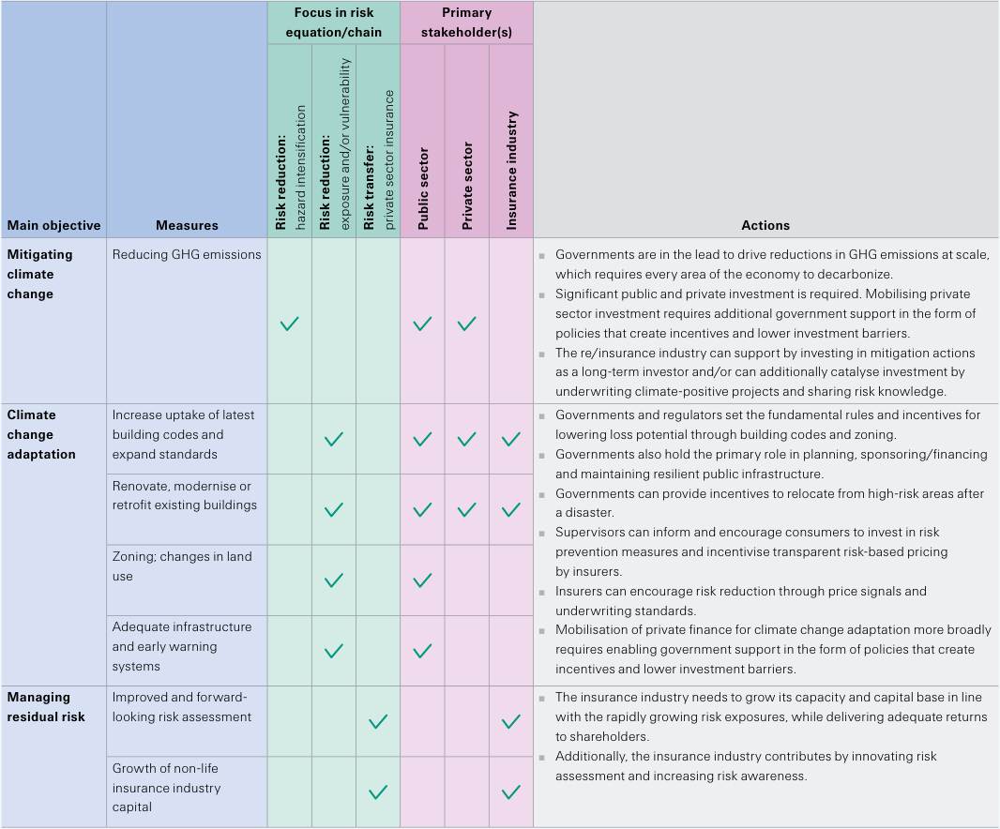

**----- Start of picture text -----** 
Focus in risk  Primary equation/chain stakeholder(s) Main objective Measures Actions Mitigating  Reducing GHG emissions  ̤ Governments are in the lead to drive reductions in GHG emissions at scale, climate  which requires every area of the economy to decarbonize. change  ̤ Significant public and private investment is required. Mobilising private sector investment requires additional government support in the form of policies that create incentives and lower investment barriers.  ̤ The re/insurance industry can support by investing in mitigation actions as a long-term investor and/or can additionally catalyse investment by underwriting climate-positive projects and sharing risk knowledge. Climate  Increase uptake of latest   ̤ Governments and regulators set the fundamental rules and incentives for change  building codes and  lowering loss potential through building codes and zoning. adaptation expand standards  ̤ Governments also hold the primary role in planning, sponsoring/financing and maintaining resilient public infrastructure. Renovate, modernise or  ̤ Governments can provide incentives to relocate from high-risk areas after retrofit existing buildings a disaster.  ̤ Supervisors can inform and encourage consumers to invest in risk Zoning; changes in land  prevention measures and incentivise transparent risk-based pricing use by insurers.  ̤ Insurers can encourage risk reduction through price signals and underwriting standards. Adequate infrastructure   ̤ Mobilisation of private finance for climate change adaptation more broadly and early warning  requires enabling government support in the form of policies that create systems incentives and lower investment barriers. Managing  Improved and forward-  ̤ The insurance industry needs to grow its capacity and capital base in line residual risk  looking risk assessment with the rapidly growing risk exposures, while delivering adequate returns to shareholders.  ̤ Additionally, the insurance industry contributes by innovating risk Growth of non-life assessment and increasing risk awareness. insurance industry capital Risk reduction: hazard intensification  Risk reduction: exposure and/or vulnerability Risk transfer: private sector insurance Public sector  Private sector Insurance industry **----- End of picture text -----** 

Source: Swiss Re Institute 

6 **Swiss Re Institute** _sigma_ No 1/2024 

## Year in review: reaffirming outlook trends 

The global economic cost of natural catastrophes reached an estimated USD 280 billion in 2023, of which around USD 108 billion (38%) was covered by insurance. Annual insured losses of more than USD 100 billion have become the norm, and we expect the trend of a 5–7% increase in insured losses (in real terms) to continue. In what was the hottest year on record, there were 142 loss-inducing natural disaster events (as per the _sigma_ threshold) in 2023, the most in a single year. Even without occurrence of an outlier peak-loss making event, the combined insured losses from 31 mediumseverity disasters (ie, events resulting in losses of USD 1–5 billion), accounted for most of the full-year total for all perils. The medium-severity category is the fastest growing, both in terms of frequency of events (on average up 7.5% annually over the last 30 years) and insured loss totals (up 7.1%). 

## Annual insured losses exceed USD 100 billion, again 

Insured losses from natural disasters in 2023 were USD 108 billion, above recentyear averages. 

A devastating earthquake, severe convective storms (SCS) and large-scale urban floods were the main events driving global insured losses from natural disasters of USD 108 billion in 2023. Though less than the USD 133 billion (inflation-adjusted) of 2022, the losses were above the previous 5- and 10-year averages of USD 105 billion and USD 89 billion, respectively. 2023 was the fourth year in row in which insured losses breached the USD 100 billion mark, and the sixth time in the last seven years (see Figure 1). Even so, roughly 62% of last year’s total catastrophe losses were uninsured, with global economic losses of USD 280 billion outstripping insurance claims. Some of last year’s biggest disasters hit areas of relatively low insurance penetration, providing yet another reminder of the large protection gaps that exist in many regions across the world. 

## **Figure 1** 

Global natural catastrophe insured losses (USD bn, 2023 prices) 

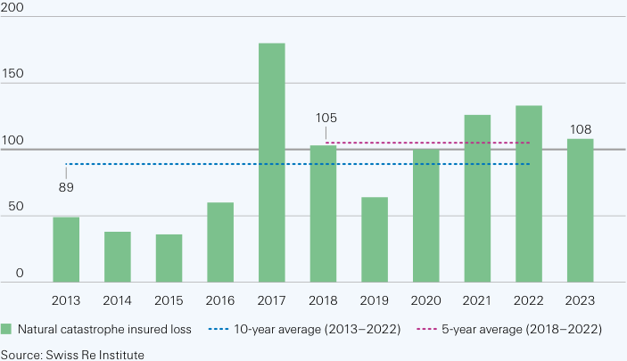

**----- Start of picture text -----** 
200 150 105 108 100 89 50 0 2013 2014 2015 2016 2017 2018 2019 2020 2021 2022 2023 Natural catastrophe insured loss 10-year average (2013–2022) 5-year average (2018–2022) Source: Swiss Re Institute **----- End of picture text -----** 

The earthquake disaster in Turkey and Syria was the biggest natural catastrophe-related humanitarian event of the year. 

The most destructive natural catastrophe of the year was the earthquake in southern and central Turkey in February, which resulted in the collapse of buildings in many cities and towns across the affected region. A first 7.8-magnitude (Mw) shock was the strongest earthquake to hit Turkey since the Erzincan earthquake in 1939, and was followed nine hours later by a Mw 7.5 aftershock some 100 km northwards.[1] The combined effects of the shocks were felt in most of Turkey and in northwestern Syria. Close to 58 000 people lost their lives or were reported missing, the most since the quake in Haiti in 2010. The 2023 Turkey earthquake is the sixth deadliest natural disaster of all types on _sigma_ records (ie, since 1970). 

> 1 _Global Rapid Post-Disaster Damage Estimation (GRADE) Report_ , The World Bank, 2023. 

Year in review: reaffirming outlook trends 

_sigma_ No 1/2024 **Swiss Re Institute** 7 

It was also the costliest insurance event of With estimated insured losses of USD 6.2 billion, the earthquake was also the costliest the year, even though roughly 90% of the disaster for the global insurance industry in 2023, and the biggest insured loss event in damage was uninsured. Turkey ever. Even so, the economic losses reached USD 58 billion, meaning that roughly 90% of these were uninsured. The quake struck an area of low insurance penetration, and the experience is a strong reminder of the large protection gaps that exist in the many regions of the world. More broadly, over the last decade, annual insured losses from earthquakes have been below previous 10-year averages. The last 10-year belowtrend loss experience should not be taken as a sign of things to come. Earthquakes have very long tail risk and when they hit areas of higher insurance penetration, the resulting losses can be outlier peak events for the industry. Such as, for instance, the 2011 Tohoku earthquake in Japan and the 2010–2011 Christchurch earthquake sequence in New Zealand, with total insured losses of USD 47 billion and USD 36 billion, respectively. 

Many events set new local loss records last year, flagging that previous expectations around potential losses should be updated. The events included the floods in Auckland in January and a series of SCS in Italy in July. The wildfires in Hawaii resulted in the biggest insured loss ever seen in the state, and occurred in a region previously considered to be one of low catastrophe risk. Hurricane Otis in Mexico in October, meanwhile presented a near worst-case scenario of severe weather in an area of high exposure: the category 5 hurricane hit Acapulco, a city of more than 1 million people. These examples provide a stark reminder that records of historic insured losses alone should not be relied on as a guide for current and future catastrophe losses. 

Many local loss records were set in 2023. Many events set new local loss records last year, flagging that previous expectations around potential losses should be updated. The events included the floods in Auckland in January and a series of SCS in Italy in July. The wildfires in Hawaii resulted in the biggest insured loss ever seen in the state, and occurred in a region previously considered to be one of low catastrophe risk. Hurricane Otis in Mexico in October, meanwhile presented a near worst-case scenario of severe weather in an area of high exposure: the category 5 hurricane hit Acapulco, a city of more than 1 million people. These examples provide a stark reminder that records of historic insured losses alone should not be relied on as a guide for current and future catastrophe losses. Severe convective storms accounted for Of all perils, SCS caused most insured losses in 2023: USD 64 billion, near double the most of the global insured losses. previous 5- and 10-year averages (see Figure 2). Most SCS losses were in the US, but other countries were also hit, notably (northern) Italy where storms with giant hail stones wreaked insured damages of USD 5.5 billion. 

## **Figure 2** 

Global insured losses from natural catastrophes in 2023 and previous year averages (USD bn, 2023 prices) 

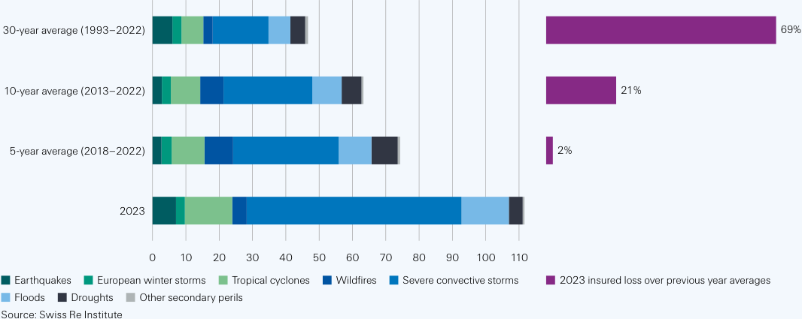

**----- Start of picture text -----** 
30-year average (1993–2022) 69% 10-year average (2013–2022) 21% 5-year average (2018–2022) 2% 2023 0 10 20 30 40 50 60 70 80 90 100 110 Earthquakes European winter storms Tropical cyclones Wildfires Severe convective storms 2023 insured loss over previous year averages Floods Droughts Other secondary perils Source: Swiss Re Institute **----- End of picture text -----** 

After tropical cyclones, SCS have become the main loss-making peril. 

Over time, SCS have become established as the second largest loss-making peril after tropical cyclones (TC). In 2014–2023, on an inflation-adjusted basis, on average SCS accounted for more than 32% of total annual insured losses from natural disasters, a marked step-up from the preceding decades. TC remain the dominant peril, contributing 38% of the insured losses in the last decade, and 37% over a 40-year period (see Figure 3). Their combined share increased from around 60% in 1980s to 70% in the past decade. The share of cyclone losses is much more volatile and can ramp up when just one peak-loss event, like Hurricane Katrina (in 2005, insured losses of USD 102 billion, inflation adjusted) or Hurricane Ian (2022, USD 62 billion), occurs. 

Year in review: reaffirming outlook trends 

8 **Swiss Re Institute** _sigma_ No 1/2024 

Large floods in urban areas across the world pushed inundation-related losses to USD 13 billion in 2023. 

In 2023, flood events across the world resulted in insured losses of USD 14 billion, above the 5- and 10-year averages of USD 10 billion and USD 9 billion, respectively. There were big floods in New Zealand, Hong Kong, India, Italy, Greece and Slovenia, among others. The floods mirrored the experience in Australia and South Africa in 2022, and Germany in 2021, when heavy rainfalls hit areas of high exposure. 

## **Figure 3** 

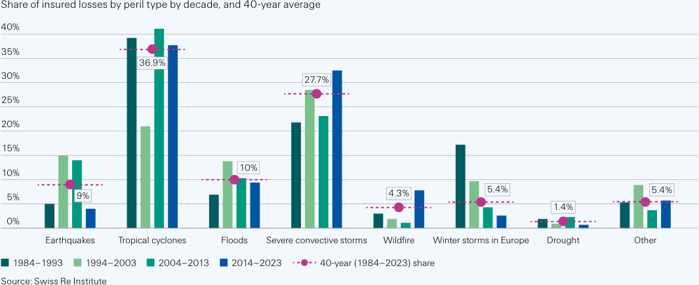

**----- Start of picture text -----** 
Share of insured losses by peril type by decade, and 40-year average 40% 35% 36.9% 30% 27.7% 25% 20% 15% 10% 10% 5% 9% 4.3% 5.4% 5.4% 1.4% 0% Earthquakes Tropical cyclones Floods Severe convective storms Wildfire Winter storms in Europe Drought Other 1984–1993 1994–2003 2004–2013 2014–2023 40-year (1984–2023) share Source: Swiss Re Institute **----- End of picture text -----** 

Losses from wildfires were below the 10-year average, despite the record loss-making fire event in Hawaii. 

2023 was the hottest year on record with the mid-year shift from La Niña to El Niño conditions and global warming pushing temperatures higher.[2] On about a third of all days in 2023, the average global temperature was at least 1.5[o] C higher than preindustrial levels. There were heatwaves across the northern hemisphere, fueling wildfires in Europe, Canada and Hawaii. The fires in Canada were most severe in terms of the amount of land burned, but the flames did not reach major towns or industrial centres. Globally, wildfire-related losses were below the 10-year annual average, but that does not diminish the ever-present threat of fire in North America, Australia and other parts of the world. Losses are likely to grow in the coming years as human settlement increasingly encroaches on areas of wild-urban interface, and as temperatures continue to rise, potentially exacerbating the risk that wildfires present. 

## Event frequency the main driver of 2023 losses 

There were no peak loss-making catastrophe events in 2023… 

There were 142 insured-loss inducing natural catastrophes in 2023 (out of a total 218 catastrophe events), the most ever in a single year. In the absense of an outlier peak lossmaking event like Hurricane Ian in 2022,[3] the frequency of events was the main driver of the full-year insured loss total. As Figure 4 shows, the insured loss from the Turkey earthquake fell well short of losses inflicted by peak-loss events in previous years. 

> 2 _WMO confirms that 2023 smashes global temperature record_ , World Meteorological Organization, 12 January 2024. 

> 3 _Economic Insights 29/2022, Hurricane Ian to add pressure in an already hardening re/insurance market_ , Swiss Re Institute, 2022 

Year in review: reaffirming outlook trends 

_sigma_ No 1/2024 **Swiss Re Institute** 9 

## **Figure 4** 

Total annual insured losses and biggest loss event each year, 1994–2023 (USD bn, 2023 prices); and total number of events/year. 

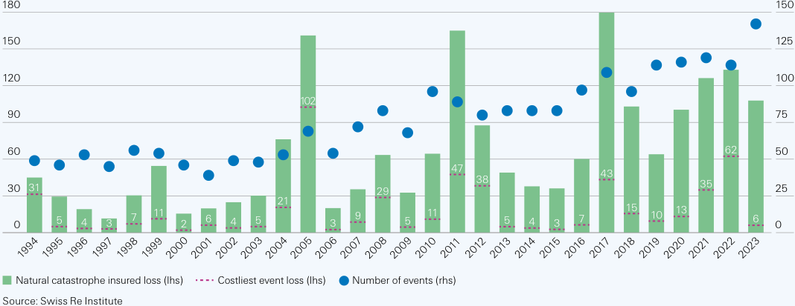

**----- Start of picture text -----** 
180 150 150 125 120 100 102 90 75 60 62 50 47 43 30 31 29 38 35 25 21 0 5 4 3 7 11 2 6 4 5 3 9 5 11 5 4 3 7 15 10 13 6 0 Natural catastrophe insured loss (lhs) Costliest event loss (lhs) Number of events (rhs) Source: Swiss Re Institute 1994 1995 1996 1997 1998 1999 20002001 200220032004200520062007 20082009 2010 2011 2012 2013 2014 2015 2016 2017 2018 2019 2020 2021 2022 2023 **----- End of picture text -----** 

## **Medium-severity events, in particular SCS, contribute most to losses** 

…but even without, global insured losses from 142 separate events, the highest ever, topped USD 100 billion. 

Absent an outlier peak-loss event, the global insured losses from all natural disasters last year nevertheless exceeded USD 100 billion. When the industry last experienced a dearth of peak loss events (2013 to 2016), annual insured losses (inflation adjusted) were well below this mark. The occurrence of many medium-sized disasters, which we define as events resulting in insured losses of between USD 1–5 billion, contributed most to the loss accumulation over the year. There were at least 30 such events in 2023, many more than the previous 10-year average (17). Of those, 21 were SCS, a new high and more than double the average of each of the previous 10 years (ie, 8). 

The frequency of mid-severity events is growing fastest. 

On average, since 1994 the number of medium-sized events each year has grown by 7.5%, almost double the 3.9% increase in total number of catastrophes (see Figure 5). The number of “high-severity” loss events (ie, resulting in inflation-adjusted insured losses of USD 5 billion and above) has grown least in the same period. This could be because, as history shows, these events have been occurring less frequently, and in some years, not at all. However, since 2016 there has been at least one such event each year, and at most four, which could be a signal of trend development. The number of lowseverity events, (ie, resulting in insured losses of less than USD 1 billion), meanwhile, has grown by 3.5% annually over the last 30 years. 

Year in review: reaffirming outlook trends 

10 **Swiss Re Institute** _sigma_ No 1/2024 

**Figure 5** Number of natural catastrophes by classes of severity, 1994–2023 

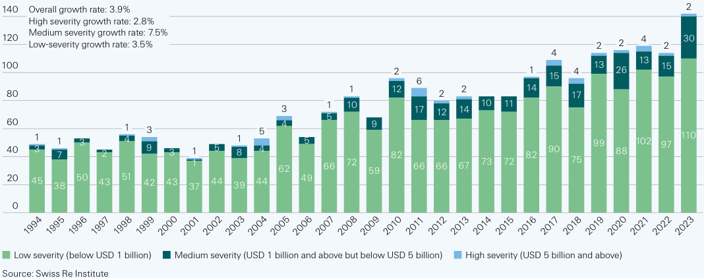

**----- Start of picture text -----** 
140 Overall growth rate: 3.9% 2 High severity growth rate: 2.8% 120 Medium severity growth rate: 7.5% Low-severity growth rate: 3.5% 2 2 4 2 30 4 13 100 2 1 4 13 26 15 15 6 1 12 2 14 80 2 17 1 10 10 11 3 17 12 14 5 4060 13 7 1 3 2 4 1 9 3 3 1 5 18 5 4 4 5 9 82 82 90 99 88 102 97 110 1 62 66 72 59 66 66 67 73 72 75 20 45 38 50 43 51 42 43 37 44 39 44 49 0 Low severity (below USD 1 billion) Medium severity (USD 1 billion and above but below USD 5 billion) High severity (USD 5 billion and above) Source: Swiss Re Institute 1994 1995 1996 1997 1998 1999 2000 2001 2002 2003 2004 2005 2006 2007 2008 2009 2010 2011 2012 2013 2014 2015 2016 2017 2018 2019 2020 2021 2022 2023 **----- End of picture text -----** 

…and so too are their accumulated losses. 

With the number of medium-sized events growing fast, so too have their associated insured losses, up 7.1% annually since 1994 (inflation-adjusted, see Figure 6). This is above the 5.9% average annual growth rate of insured losses inflicted by all natural perils over same period.[4] Of the medium-sized category, insured losses from SCS have grown most, by 9.7% annually. Insured losses from the low- and the high-severity categories have grown more slowly. However, for the former the level of confidence around trend may be lower due to insufficient monitoring and reporting. And for the latter, the rarity of high-severity event occurrence instead and wide dispersion in loss outcomes (eg, in recent years ranging from USD 6 billion (last year’s earthquake in Turkey) to USD 60 billion (Hurricane Ian in 2022)), makes it harder to discern a trend. 

## **Figure 6** 

Growth rates of global insured losses from natural catastrophes and SCS by class of severity, 1994–2023 

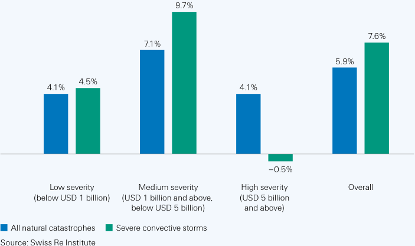

**----- Start of picture text -----** 
9.7% 7.6% 7.1% 5.9% 4.5% 4.1% 4.1% –0.5% Low severity Medium severity High severity Overall (below USD 1 billion) (USD 1 billion and above,  (USD 5 billion below USD 5 billion) and above) All natural catastrophes Severe convective storms Source: Swiss Re Institute **----- End of picture text -----** 

> 4 The growth rates are estimated using the parameters of an exponential trend, which is the best fitting trend line for the data. Similar methodology is adopted for estimating all growth rate numbers except for which otherwise is stated. 

Year in review: reaffirming outlook trends 

_sigma_ No 1/2024 **Swiss Re Institute** 11 

Economic growth-related factors have been the main driver of rising losses. 

Changing risk landscapes due to economic and population growth, and urbanisation deliver more wealth and more physical assets that need insuring.[5] These are the main reasons that insured losses from catastrophes have been on an upward trend for many years. Inflation pressures, including in construction costs, add to exposure values.[6] In addition, changes in vulnerability and occurrence of more frequent and intense weather events in terms of physical force, can compound loss outcomes. 

Rising number of urban areas targets increases the losses of small-scale events such as SCS. 

Socio-economic patterns like urban sprawl and densification of existing conurbations have likely contributed to the rising losses from mid-sized events, SCS in particular, which are often smaller in scale (see _US SCS loss trends and their reasons_ in Chapter 2). Also, hazards are becoming more intense, resulting in larger losses when striking urban centres that are expanding (in terms of geographical area) or becoming more propertydense than previously would have been the case. As a result, historic loss records are not representative of the full-loss potential that is present today. They cannot/do not foretell, for example, significant losses in areas that have not suffered sizeable losses in the past, as in the 2023 cases of the SCS in Italy, floods in Auckland and wildfires in Hawaii. 

## **Separating annual variability from long-term trend** 

Despite being above average, the loss experience of 2023 was below trend. 

In 2023, global insured losses from natural catastrophes were above both the previous five (though only marginally) and 10-year averages (+21% compared to USD 89 billion). Despite being above average, the loss experience was not exceptional. Notwithstanding the tragic loss of life and livelihoods that some of the major disastrous events caused in many regions, the insurance industry did not endure any peak-loss event, the reason why the outcome was below trend. 

The trend for annual insured losses exceeded USD 100 billion in 2021 and 2022. Losses will continue to grow. 

Figure 7 shows that actual insured losses (in real terms) have been rising sharply over the last 30 years, and have largely been at or above trend since 2017 (with the exception of 2019), after a period of subdued loss outcomes from 2013–2016. The average annual growth rate of global insured losses since 1994 was 5.9% in real terms,[7] and the historical trend exceeded USD 100 billion for the first time in 2021. We expect the growth trend to continue at an average annual rate of 5-7% in real terms. 

## **Figure 7** 

Growth in global natural catastrophe insured losses (USD bn, 2023 prices) 

**----- Start of picture text -----** 
180 USD billion 160 140 120 100 80 60 40 20 0 Earthquakes Weather-related losses Exponential trend Source: Swiss Re Institute 1994 1995 1996 1997 1998 199920002001200220032004200520062007200820092010 2011 2012 2013 2014 2015 2016 2017 2018 2019 2020202120222023 **----- End of picture text -----** 

> 5 See _sigma_ 2/2022, Natural catastrophes in 2021–Focus flood: building resilience against a rapidly growing risk, Swiss Re Institute. 

> 6 See _sigma_ 1/2023, Natural catastrophes and inflation in 2022: a perfect storm, calling for continued underwriting discipline, Swiss Re Institute. 

> 7 The 30-year historical trend is estimated using the parameters of an exponential trend, which is the best fitting trend line for the data. 

Year in review: reaffirming outlook trends 

12 **Swiss Re Institute** _sigma_ No 1/2024 

Actual losses in 2023 were below trend, on account of well below trend TC losses. 

Actual loss outcomes fluctuate greatly year-on-year, with random fluctuations mostly due to natural variability. To put the year’s loss experience into perspective, we present it in terms of its deviation from the long-term trend (see Figure 8). Last year’s global natural catastrophe insured losses were US 10 billion (8%) below the trend amount (USD 118 billion). In 2021 and 2022, actual losses exceeded trend by USD 21 and 22 billion, respectively, in real terms. The deviations of actual from trend values in any one year can be significant. Actual losses can be lower than trend, especially in years in which no outlier peak-loss events occur. This is what happened in 2023 with no major hurricane, and with the insured losses from the earthquake in Turkey low on account of the low insurance penetration in the affected regions. Last year’s TC losses were about 65% below the trend estimate, overcompensating for the 54% above-trend SCS losses. 

## **Figure 8** 

Deviation of global natural catastrophe, TC and SCS insured losses from respective from long-term (30-year) trends 

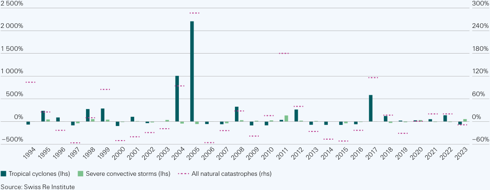

**----- Start of picture text -----** 
2 500% 300% 2 000% 240% 1 500% 180% 1 000% 120% 500% 60% 0% 0% –500% –60% Tropical cyclones (lhs) Severe convective storms (lhs) All natural catastrophes (rhs) Source: Swiss Re Institute 1994 1995 1996 1997 1998 1999 2000200120022003200420052006200720082009 2010 2011 2012 2013 2014 2015 2016 2017 2018 2019 2020 2021 2022 2023 **----- End of picture text -----** 

On aggregate, TC losses are significantly more volatile than SCS, and drive huge deviations of total losses from trend. 

When low-frequency high-severity events such as major cyclones or earthquakes do occur, particularly in regions of high economic exposure, actual losses can be much higher than the long-term trend. Those years, as in the case of 2005, 2011 and 2017, are outlier peak-loss years, and drive similar deviations of total global catastrophe losses. For TC, the infrequent above-trend outliers are much more severe than the more frequent deviations to the downside. Such as in 2017, when hurricanes Harvey, Irma and Maria (HIM) pushed global natural disaster losses to USD 180 billion (inflation adjusted), 116% higher than trend. The USD 118 billion loss total (inflation adjusted) from HIM specifically was 584% above TC-trend in that year. The maximum overshoot was in 2005, driven by Hurricane Katrina. Although rare, hurricane risk is a major threat to US coastal business and residents, and a volatile, severity-driven and capital-intensive peak peril for the re/ insurance industry. Losses from frequency-driven SCS perils are less volatile. The deviations in loss outcomes are balanced between up- and downside and therefore offer better diversification. 

The re/insurance industry needs to match the strong growth in risk. 

Irrespective of the annual deviations, losses from TC and SCS account for a large majority of global natural catastrophe insured losses overall. The combined share increased from around 60% in the 1980s to around 70% in the past decade. Losses from both continue to rise, more so than the rate of economic growth. For the purpose of narrowing protection gaps, the rising losses require matching growth of re/insurance capital and capacity (see third chapter _Managing property exposures: risk transfer and reduction_ ) However, the high volatility of peak perils does not diversify well and absorbs risk capital. The combination of continuous strong growth from SCS and other frequency-driven perils, and the ever-present peak loss potential of TC and earthquake risks can impact industry underwriting performance. 

_sigma_ No 1/2024 **Swiss Re Institute** 13 

## Spotlight on severe convective storms 

Insured losses from severe convective storms (SCS) in 2023 were in excess of USD 60 billion. Most SCS-related losses originate in the US but losses are rising at a faster rate in Europe and other parts of the world than in the US. Hail is the biggest risk, responsible for between 50–80% of all SCS-driven insured losses in any one year. Increased exposures due to economic and population growth, urbanisation and wealth remain the main driver of the rise in SCS-related losses, accounting for around a third of the increase in associated insured losses seen in the US over the last 15 years. Further, there is growing evidence that SCS activity has been increasing in certain regions, although the impact of climate change on SCS events is not yet fully understood. Another factor contributing to losses is vulnerability of exposed assets. The rapid growth of solar power system installations on roof tops is one such expanding vulnerability. 

## What are severe convective storms? 

Insured losses from SCS reached a record high in 2023. SCS are mostly short-lived and small scale. But they can also develop to become events of extreme intensity. 

SCS is the umbrella term for a range of hazards including tornadic and straight-line winds, and large hailstones. SCS are frequently-observed weather events that develop when warm humid air rises from the surface of the earth into upper layers of the troposphere, leading to the formation of towering clouds, lightning and thunder. Meanwhile parcels of cool air rush to the earth’s surface, bringing powerful wind gusts, rain or even hail. In 2023, global insured losses from SCS accumulated to USD 64 billion, a record high. 

Most SCS are short-lived, of small spatial scale and, relative to other perils, cause little or no damage. But when vertical updrafts inside storm clouds are sufficiently strong, freezing water droplets remain in cold elevations for long enough to grow into what can be large hailstones. These, in turn, can damage buildings, vehicles and crops when they fall to earth. Hail storms are by far the main contributor to insured losses from SCS, around 50– 80% annually, according to _sigma_ data. Under specific meteorological conditions, multiple thunderstorms may combine to become longer-lived clusters, often associated with squall lines of strong straight-line winds (so-called derechos). In rare cases, notably in the midwest and southern US, thunderstorm cells can merge to rotating super-cells that become tornadoes, with the potential to destroy anything in their path. 

## **Figure 9** 

Severe convective storms: the perils 

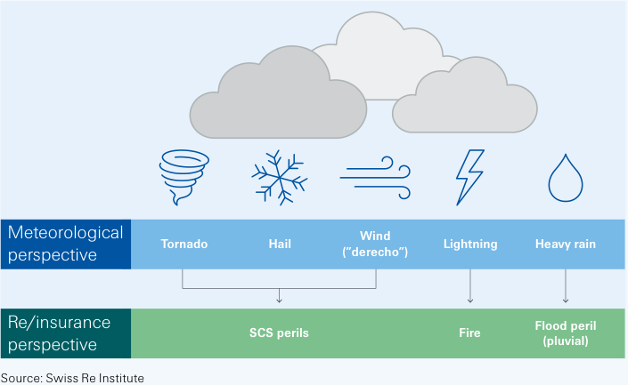

**----- Start of picture text -----** 
Meteorological Wind Tornado Hail Lightning Heavy rain perspective (”derecho”) Re/insurance Flood peril SCS perils Fire perspective (pluvial) Source: Swiss Re Institute **----- End of picture text -----** 

The term SCS is used mainly in the context of damage caused by hail, tornadoes and derechos. 

From a re/insurance and catastrophe modelling perspective, the term SCS is used mainly in the context of damage caused by hail, tornadoes and derechos, including subsequent water ingress (see Figure 9). The storms can also trigger damage from flooding, but these are usually considered as pluvial flood events rather that SCS. Similarly, insurers typically associate damage from lightning to fire losses rather than SCS. 

14 **Swiss Re Institute** _sigma_ No 1/2024 

Spotlight on severe convective storms 

## 2023: a year of new SCS-loss records 

To date, the majority of SCS-related insured losses originates in the US... 

In 2023, global insured losses from SCS accumulated to USD 64 billion, comprising more than half the insured losses from all natural catastrophes last year. The outcome continued the trend of increasing losses over the past decades.[8] The majority (around 85%) of the losses originated in the US (see Figure 10). 

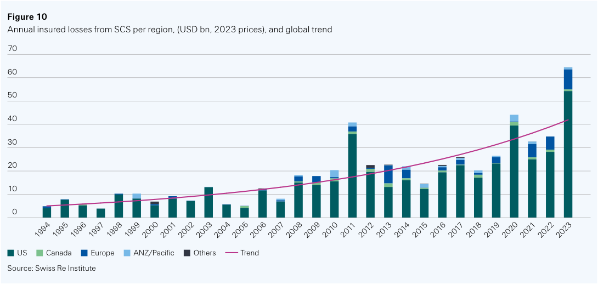

**----- Start of picture text -----** 
Figure 10 Annual insured losses from SCS per region, (USD bn, 2023 prices), and global trend 70 60 50 40 30 20 10 0 US Canada Europe ANZ/Pacific Others Trend Source: Swiss Re Institute 1994 1995 1996 1997 1998 199920002001200220032004200520062007200820092010 2011 2012 2013 2014 2015 2016 2017 2018 2019 2020202120222023 **----- End of picture text -----** 

...but losses are growing faster in Europe. However, SCS-related insured losses are growing fastest in Europe, where losses grew above trend for a third consecutive year in 2023 (see Figure 11). 

## **Figure 11** 

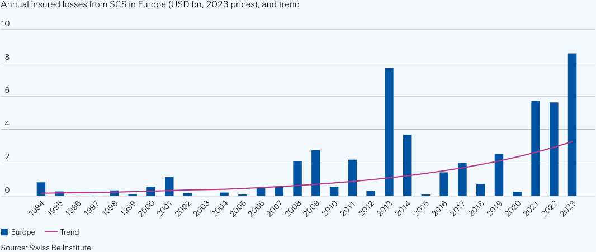

**----- Start of picture text -----** 
Annual insured losses from SCS in Europe (USD bn, 2023 prices), and trend 10 8 6 4 2 0 Europe Trend Source: Swiss Re Institute 1994 1995 1996 1997 1998 199920002001200220032004200520062007200820092010 2011 2012 2013 2014 2015 2016 2017 2018 2019 2020202120222023 **----- End of picture text -----** 

> 8 _sigma_ 1/2021- Natural catastrophes in 2020: secondary perils in the spotlight, but don’t forget primary-peril risks, Swiss Re Institute, 30 March 2022 . 

_sigma_ No 1/2024 **Swiss Re Institute** 15 

Spotlight on severe convective storms 

The midwest and central US are SCS hotspots. 

In the US, all SCS-prone regions suffered similar insured losses last year: about 30% originated in the midwest, 30% in the central US, and 20% in the southeast (see Figure 12). The geographic loss distribution in 2023 was similar to that of the preceding two decades. 

## **Figure 12** 

Regional contribution (in %) to total insured SCS losses in the US, by decade 

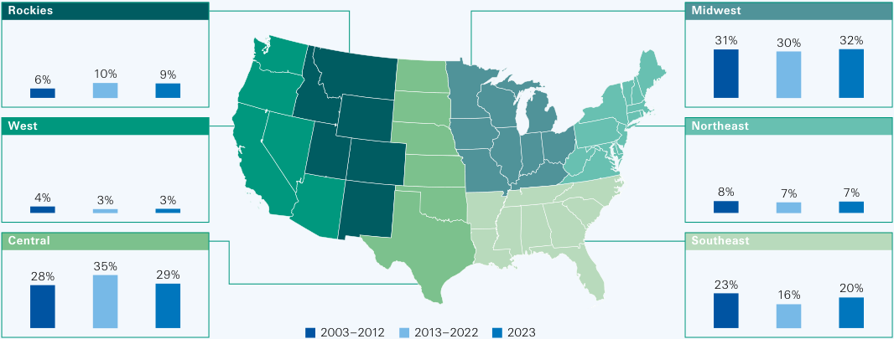

**----- Start of picture text -----** 
Rockies Midwest 31% 30% 32% 6% 10% 9% West Northeast 4% 3% 3% 8% 7% 7% Central Southeast 35% 28% 29% 23% 20% 16% 2003–2012 2013–2022 2023 **----- End of picture text -----** 

**----- Start of picture text -----** 
Percentages are rounded. Source: Swiss Re Institute, based on Verisk Property Claim Services **----- End of picture text -----** 

In the last three years, SCS have resulted in large insured losses in Europe too. 

In Europe, insured losses from SCS have topped USD 5 billion in each of the last three years. The events that occurred offer compelling evidence that hail risk in particular is increasing. In 2021, Germany was worst impacted and in 2022, it was France. Then in July last year, Italy experienced the destructive power of hail, when a series of SCS hit the densely populated north of the country. The hail storms caused insured losses of USD 5.5 billion in Italy, the highest ever for a SCS event in Europe on _sigma_ records. New records were set from a hazard severity perspective as well, with documented hailstone diameters of up to 16 cm, in one case even 19 cm - the largest ever reported in Europe.[9] The insured losses were a new hail-risk benchmark for Italy, flagging that it is perhaps time to adjust associated risk assessment. The severity of the losses came as a shock to the industry, not least as insurance penetration in the residential sector is still relatively low. Similar to what happened in France in 2022, important processes affecting the evolving weather risk landscape, including rising exposures, may have gone largely unnoticed in recent years, due to limited availability of granular exposure data and accurate SCS/hail risk models. 

Australia also faces SCS risk, and has experienced large losses. 

Australia has also experienced billion-dollar SCS-related insured losses in the recent past, although the losses in 2022 and 2023 were relatively muted. That is no reason to downgrade the risk potential. The hit-or-miss characteristics of SCS can be treacherous, and the hiatus of the past two years could be the calm before the storm. 

## SCS loss trends in the US 

Macroeconomic factors drive most of the growth in SCS-related insured losses in the US, such as general inflation… 

To better understand the rising loss trend from SCS in the US, we separate out the individual loss drivers for the period 2008–2023 (see Figure 13). Annual SCS-related insured losses have increased by about 8% per year since 2008 (in nominal terms). In our calculations, inflation shows to have been a prominent factor. Using the US consumer price index reading for the 2008–2023 period, we estimate that 2.2 percentage points (ppt) of the total 8% growth in SCS-related insured losses were due to general inflation. In other words, after adjusting for inflation, insured losses from 

> 9 Hails storms of 2023, _European Severe Storms Library_ , 23 January 2024. 

16 **Swiss Re Institute** _sigma_ No 1/2024 

Spotlight on severe convective storms 

SCS grew by an estimated 5.8% annually during that period. In addition, inflation affects the construction sector specifically. The rise in the cost of building materials, construction and repairs added another 1.2 ppt to the rise in insured losses. 

..and increased exposure. Climate change driven hazard intensification also plays a role... 

Together with inflation, other macroeconomic factors have also been a main driver of the losses. Taking the growth in real GDP between 2008–2023 as a proxy, we estimate that 2.3 ppt was on account of increased exposures due to economic and population growth, urbanisation and wealth accumulation etc. That is equivalent to around a third of the growth in the total loss burden. This means that when a SCS does strike, there is greater chance it will hit insured assets that might have also become more expensive. Indeed the construction of new buildings has led to an expansion of built-up land, in some of the midwest and south of the US by almost 2% per year between 1990 and 2015.[10] 

The impact of climate change on SCS losses is still debated. There is growing evidence that SCS activity has been increasing in certain regions, but there are many uncertainties.[11] For example, recent research suggests that the number of large hail events, which we use here as a proxy for climate change effects, is growing by about 1 ppt per year. We caution that there is much uncertainty around this value. Strong variability of hail storm occurrence across the different states of the US is just one source of uncertainty. 

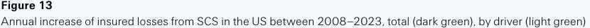

**----- Start of picture text -----** 
Figure 13 Annual increase of insured losses from SCS in the US between 2008–2023, total (dark green), by driver (light green) **----- End of picture text -----** 

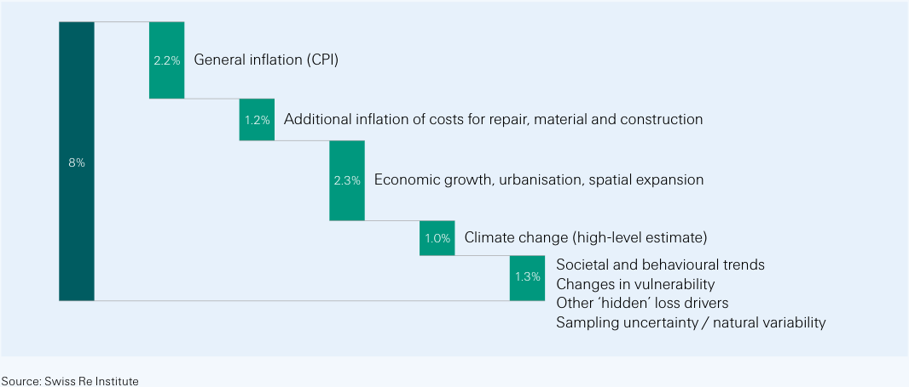

**----- Start of picture text -----** 
2.2% General inflation (CPI) 1.2% Additional inflation of costs for repair, material and construction 8% 2.3% Economic growth, urbanisation, spatial expansion 1.0% Climate change (high-level estimate) Societal and behavioural trends 1.3% Changes in vulnerability Other ‘hidden’ loss drivers Sampling uncertainty / natural variability Source: Swiss Re Institute **----- End of picture text -----** 

...as well as societal and behavioural trends, and changes in vulnerability. 

Our calculations leave a residual 1.3 ppt of the increase in SCS losses that is not explained by inflation, climate change or changing exposures. This residual can likely be attributed to changes in for example, societal and behavioural trends, and vulnerability, the latter particularly for residential buildings. For instance, residential property claims for SCS-inflicted damage have been increasing faster than insured losses from commercial property and vehicles. In 2023 and 2022, almost 70% of all insured SCS losses in the US originated from residential lines, well above the 60% historical average (see Figure 14). There could be a number of reasons for this. In cases where policyholder advocates are involved in claims filing for residential losses, settlements tend to be higher, though effects vary by region. Also, it could be that there is higher investments in and maintenance of the roofs of commercial-sector buildings. Commercial property includes modern buildings constructed to high code of standards and, as they are often tall, these present less roof area per insured value. 

> 10 _sigma_ 1/2021 op. cit. 

> 11 “The effects of climate change on hail storms”, _Nature Reviews Earth & Environment_ , vol 2, 2021. 

_sigma_ No 1/2024 **Swiss Re Institute** 17 

Spotlight on severe convective storms 

## **Figure 14** 

Annual insured SCS losses in the US by line of business (USD bn, 2023 prices) 

In Europe, historically SCS-loss activity has not been tracked to the same degree as in the US. 

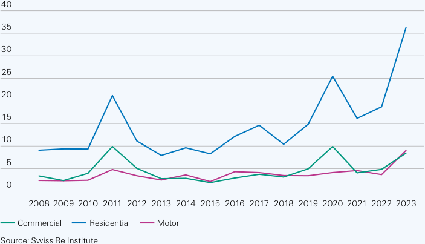

**----- Start of picture text -----** 
40 35 30 25 20 15 10 5 0 2008 2009 2010 2011 2012 2013 2014 2015 2016 2017 2018 2019 2020 2021 2022 2023 Commercial Residential Motor Source: Swiss Re Institute **----- End of picture text -----** 

In Europe and Australia, uncertainties around potential losses are higher than in the US because historically, SCS activity in these regions has been less well monitored and reported. Moreover, countries monitor SCS in different ways and implement changes at different speeds. It could be that now, with more events in Europe being reported, loss trend estimates for the region take on an upward bias. 

## **Changes in vulnerability** 

SCS can severely damage buildings and their contents, and vehicles. 

Roof tops are particularly susceptible to hail damage, and more so with age. 

Solar panels are also vulnerable to large hailstones. 

The complex interplay of hail, wind and water can affect buildings in multiple ways. Depending on the size, speed of travel and impact angle, hailstones can inflict significant damage to roofs, building façades, external thermal insulation layers, solar panels and other property features such as skylights and slat blinds. If followed by water ingress, internal structures and building contents can also be impacted. Hail causes dents and structural deformations to vehicles, and these can trigger expensive repair costs and a rise in motor claims, while also reducing resale value. 

Roof damage is the main contributor to insured losses from hail, exacerbated by ageing. For example, the susceptibility of asphalt shingles, the most used residential roof type in the US, to hailstones increases rapidly with age. It has been reported that after just one year of natural weathering and a few small hail events, the vulnerability of such shingles to large hailstones increases by a factor of ten.[12] The average home in the US is 40 years old. Asphalt shingle roofs last around 20 years and need to get replaced several times during the lifetime of a building.[13] 

Another increasing vulnerability is the growing number of solar power installations on roofs, which is gaining momentum as countries action low-carbon initiatives. Such installations are often the most vulnerable part of a building, and were one of the drivers of the high losses inflicted by the hail storms in northern Italy and southern Switzerland in July last year.[14,15] In Germany, the number of installed photovoltaic systems nationwide reportedly increased by 1 million to 3.7 million in 2023.[16] Moreover, the most-used standard to certify hail resistance of photovoltaics (“IEC 61215-2”) considers the impact of ice stones with a maximum diameter of 25 mm only.[17] Experience, including in 2023, has shown that the ice stones can be much bigger than that. 

- 12 _Small Hail, Big Problems, New Approach_ , Insurance Institute for Business & Home Safety and zestyAI, 2023. 

- 13 _Aging Housing Stock Signals Remodeling Opportunities_ , National Association of Home Builders, 6 February 2023. 

- 14 _“Schäden durch Hagel”_ , GDV Gesamtverband der Versicherer, 13 December 2019. 

- 15 _“Die Versicherungswirtschaft unterstützt Bevölkerung und Volkswirtschaft in der Risikobewältigung”,_ SVV Schweizerischer Versicherungsverband, 6 December 2023. 

- 16 _Statistical data on the German Solar Power (Photovoltaic) Market_ , BSW Solar, January 2024. 

- 17 E. Cadoni, D. Forni, M. Dotta, et al., “Advanced characterisation of photovoltaics for hail resistance”, _Materials Letters_ , vol. 354, 2024. 

18 **Swiss Re Institute** _sigma_ No 1/2024 

Spotlight on severe convective storms 

Lack of building information makes it difficult to assess vulnerability. 

One of the difficulties in SCS risk modelling is that susceptibility to damage not only depends on building age or occupancy type, it is also shaped by parameters that are often not provided in exposure data, such as installation quality, construction type, hail impact resistance, architectural style, and materials used. For a more accurate assessment of vulnerability, this information gap needs to be narrowed, and the lack (or absence) of building codes for hail in many regions needs to be addressed.[18] 

## **Societal and behavioural trends** 

Risk awareness increases claims… 

...and also insurance take up rates. 

Often hail-induced roof damage goes unnoticed for many years.[19] Reported insurance losses from a hail event not only depend on the damage caused, but also on the proportion of damage detected. Of late, with social media, widening community networks and more refined damage assessment methods, all against the backdrop of an increasingly litigious environment, mostly in the US, the volume of hail damage that remains _un_ noticed may well decrease. 

Risk awareness typically increases after a disaster and can motivate homeowners and businesses to increase insurance cover. When the protection gap is large, increasing risk awareness can boost insurance uptake and, as a result, lead to a rise in insured losses. In Italy, insurance penetration for property risks has increased from 0.3% of GDP in 2002 to nearly 0.4% in 2023.[20] This may have contributed to the large losses resulting from last year’s hailstorm, as well as to rising losses from weather events in recent years. In such an environment, even moderate changes in insurance uptake can imply significant increase in insured values. Generally, such societal and behavioural change tends to happen gradually and can be difficult to detect and quantify. But their impact on loss statistics can be significant. 

## **The impact of climate change on SCS** 

The impact of climate change on SCS remains an area of ongoing research. 

Science points to rising likelihood of severe hailstorms… 

…while changes to tornado patterns are still highly uncertain. 

The impact of climate change on the frequency and severity of thunderstorms, hail and tornadoes is not yet fully understood and remains an area of intensive research. The associated uncertainties are manifold because of the complexity and localised nature of the physical processes involved in SCS, and because not all these processes react in the same way to warming temperatures. Moreover, due to high natural variability of SCS activity, significant gaps (time-line wise and spatial) in data coverage and differences in data quality, interpreting observed hail and tornado trends is difficult. 

For hail, the understanding is that more moisture and warmth in the low-level atmosphere will reduce the stability of air and increase the likelihood of thunderstorm formation. In combination with a rising melt height,[21] this may decrease the frequency of small hail events, while making severe hail events more likely, though regional variability could be high.[22] Changes in the seasonality of hailstorm activity could also be expected. 

Recent research suggests that climate change may bring more significant tornado activity in the eastern US, while decreasing it in portions of the Great Plains.[23] But here too, uncertainties are high. Further, increasing convective instability may boost tornado activity in some regions but in others, this may be offset by a possible decrease of “vertical wind shear”, (a parameter that describes how wind speed and direction change with altitude, which is an important factor in tornado formation). 

- 18 _“Roof Guide: Codes & Standards”,_ Insurance Institute for Business & Home Safety, 2019. 

> 19 _“How the hail hazard is affecting property insurance”,_ Verisk, 7 May 2021. 

- 20 Swiss Re Institute elaboration based on _Italian Insurance 2022–2023, statistical appendix,_ ANIA, 2024 

- 21 As the atmosphere warms, the 0°C isothermal is higher. This means that falling hail stones start to melt “earlier”. Smaller hailstones are more likely to melt before reaching the ground, hence decreasing the frequency of small hail events. 

- 22 _Nature Reviews Earth & Environment_ , op. cit. 

- 23 W.S. Ashley, A.M. Haberlie, V.A. Gensini, “The Future of Supercells in the United States”, _Bulletin of the American Meteorological Society,_ January 2023. 

_sigma_ No 1/2024 **Swiss Re Institute** 19 

Spotlight on severe convective storms 

Observations reinforce the projected increase of hail occurrence, but there has been no change in the number of severe tornado events in the continental US. 

## **Figure 15** 

Number of severe tornado and hail events in the continental US; annual SCS insurance losses in the US, (USD bn, 2023 prices) 

Aggregated observational records from the NOAA’s Storm Prediction Center[24] do not reveal disruptive changes in SCS activity during the past 16 years in the continental US (see Figure 15). The annual number of severe tornado events of category EF2 or higher (wind speeds in excess of 179 km/h) has not been growing. The number of very large hail events (more than 5 cm in diameter) has been increasing by about 1% per year, but significantly below the observed loss trend during the past 15 years. Climate change projections of the number of days with very large hail storm events in the continental US this century are in line with this historical trend estimate.[25] 

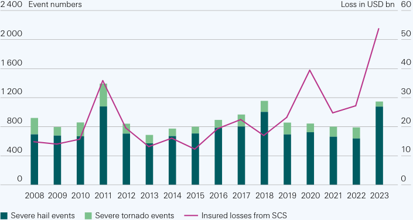

**----- Start of picture text -----** 
2 400 Event numbers Loss in USD bn 60 2 000 50 1 600 40 1 200 30 800 20 400 10 0 0 2008 2009 2010 2011 2012 2013 2014 2015 2016 2017 2018 2019 2020 2021 2022 2023 Severe hail events Severe tornado events Insured losses from SCS **----- End of picture text -----** 

Note: severe tornado events – category EF2 or higher (>179 km/h); severe hail events – hailstones of diameter more than 5cm. Source: NOAA Storm Prediction Center, Swiss Re Institute 

Data suggests a rise in the frequency of hail events in Europe and Australia too. 

More granular data and improved modelling techniques should yield better knowledge of climate change effects. 

In Europe, climate change simulations in addition to historic observations of weather patterns point to an overall annual increase in the rate of severe hail of similar magnitude but again, with significant regional differences.[26,27] In northern Italy, for example, the frequency of very large hail events has increased by about 2% per year since 1950.[28] In Australia, radar data show that the annual number of hail-prone days increased by 40% during 1979–2021 around Sydney and Perth,[29] corresponding to an annual increase of about 1%. 

Over time, progress in science and computing technology, alongside a growing wealth of observational data will facilitate more refined answers and regional differentiation. However, the uncertainties inherent to SCS and climate change projections remain. For the time being, a 1% annual increase rate appears to be a reasonable high-level estimate to characterise the impact of climate change on SCS losses in many regions. 

> 24 _2024 Annual Preliminary Report Summary,_ Storm Prediction Center, 2024. 

> 25 R.J. Trapp, K.A. Hoogewind, and S. Lasher-Trapp, “Future changes in hail occurrence in the United States through convection-permitting dynamical downscaling”, _Journal of Climate_ , vol 32, 2019. 

> 26 A.T. Rädler, P.H. Groenemeijer, E. Faust, et al., “Frequency of severe thunderstorms across Europe expected to increase in the 21[st] century due to rising instability”, _NPJ Climate and Atmospheric Science_ , vol 2, 2019. 

> 27 F. Battaglioli, P. Groenemeijer, T. Púcik, et al., “Modeled Multidecadal Trends of Lightning and (Very) Large Hail in Europe and North America (1950–2021), _Journal of Applied Meteorology and Climatology_ , vol 62, 2023. 

> 28 _sigma_ 1/2021, op. cit. 

> 29 H.T. Raupach, J.S. Soderholm, R.A. Warren, et al., “Changes in hail hazard across Australia: 1979–2021”, _NPJ Climate and Atmospheric Science_ , vol 6, 2023. 

20 **Swiss Re Institute** _sigma_ No 1/2024 

Spotlight on severe convective storms 

## Key takeaways 

- (1) **Losses from SCS set to continue rising.** Losses from SCS have been increasing faster than can be explained by inflation, exposure trends, and climate change effects. Other socio-economic and behavioural trends are at play, not all of which are fully understood, as are changes in the vulnerability of exposed assets to SCS. There are no indications of a trend reversal in the near future. This needs to be considered in risk assessment and underwriting. Views based on history that do not anticipate a continuation of this trend can underestimate risk and over-estimate margins. 

- (2) **Increase resilience against SCS.** Many markets lack efficient regulations and standards needed to improve the overall susceptibility of buildings to SCS, especially hail. The introduction of and adherence to building codes that reduce the vulnerability to SCS could help increase societal resilience. By setting premium incentives for measures that reduce vulnerability against SCS, the insurance sector can play an important role in helping society to counteract the effects of a hazard that will likely increase with climate change. 

- (3) **Enhance modelling capabilities for SCS.** The industry’s capability to model SCS risk is still limited. Modelling accuracy in emerging SCS hotspots like Italy is lower than in other regions (eg, the US and central Europe) due to lack of detailed exposure data. Other regions are well-covered by sophisticated probabilistic SCS-models that consider all aspects of the interplay of hailstones, wind and water. Even in these regions, however, industry estimation of peak-loss return periods remains challenging.[30] If relevant loss trend drivers are not fully quantified and understood, on account of flawed input data and assumptions about emerging and new vulnerabilities, even state-of-the-art models cannot deliver accurate risk views. 

- (4) **Improve monitoring of SCS.** The enhancement of modelling capabilities is being held back by limited access, through time and across geographies, to granular exposure data that include all attributes relevant for SCS. Access to claims data is also limited. SCS events and associated losses need to be better monitored by insurers, insurance associations and government agencies. 

> 30 _“_ Viewpoint: Were France’s $6bn 2022 losses unexpected? _”, Insurance Day_ , 21 October 2022. 

_sigma_ No 1/2024 **Swiss Re Institute** 21 

## Managing property exposures: risk transfer and reduction 

Natural catastrophe insurance claims have outpaced GDP growth over many years, increasing the loss burden to society and raising challenges to insurance affordability. Risk assessment and insurance premiums must keep up with fastevolving risk landscapes and loss trends resulting from economic and population growth, urbanisation, inflation effects and the potential impacts of changing climates (eg, hazard intensification) that will vary by region and peril. But keeping property insurance affordable, narrowing the protection gap and safeguarding industry sustainability requires a structural lowering of loss potential. Alongside climate change mitigation, adaptation efforts are needed to reduce exposure and vulnerability of the built environment to hazards. 

## Loss developments challenge insurance affordability 

Through risk sharing and pooling, insurance provides protection to policyholders against large shocks. 

Insurance provides coverage to individuals, businesses and the public sector against financial distress from adverse unforeseen events. It does so by spreading the financial burden among large groups of policyholders through risk sharing and pooling. The large unpredictable losses of a few are distributed through an insurer’s portfolio to many policyholders, each of whom pays a fixed premium. The loss occurrence of larger portfolios is more reliably predictable (due to the law of large numbers). To have a functioning risk pool, total premium funds must be sufficient to cover total claims over time. In a dynamic world, risk assessment must keep up with changing risk landscapes, and insurance premiums must keep up with loss trends. 

The loss burden for societies increases as insured natural catastrophe claims grow faster than GDP. 

We expect the financial burden of losses from natural disasters will continue to rise in the years to come. Global natural catastrophe insured losses have grown at a much faster rate than the global economy. In inflation-adjusted terms, on average insured losses from natural catastrophes were up 5.9% per annum in the period 1994–2023. Meanwhile, global GDP was up 2.7% in the same period. In other words, over the last 30 years, the relative loss burden compared to GDP has more than doubled. 

## **Figure 16** 

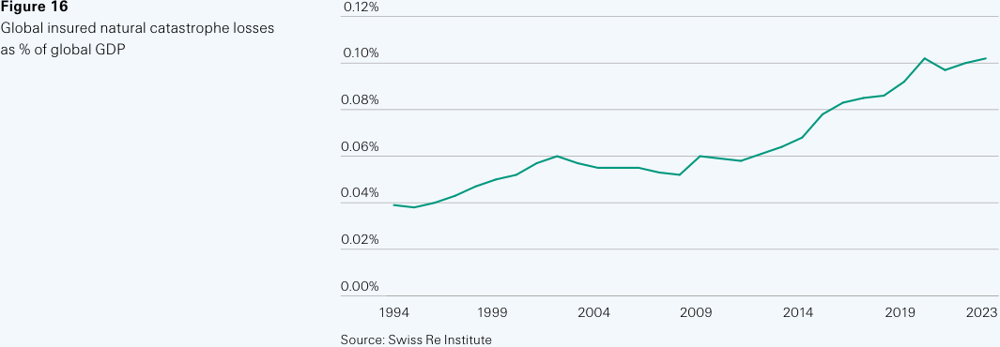

**----- Start of picture text -----** 
Figure 16   0.12% Global insured natural catastrophe losses as % of global GDP 0.10% 0.08% 0.06% 0.04% 0.02% 0.00% 1994 1999 2004 2009 2014 2019 2023 Source: Swiss Re Institute **----- End of picture text -----** 

22 **Swiss Re Institute** _sigma_ No 1/2024 

Managing property exposures: risk transfer and reduction 

Rising insurance costs make coverage less affordable for households… 

…while also putting pressure on insuers’ earnings. 

## **Figure 17** 

Combined ratio for US homeowners, 2019–2023 (in %) 

Higher premiums can offset rising claims... 

…and can also widen the protection gap. 

The fast-evolving risk landscape and rising natural catastrophe costs are a challenge for insureds, in the sense of making coverage less affordable. According to a study by the Insurance Research Council, homeowners’ expenditure on insurance in the US rose from 1.2% of median income in 2000 to 1.9% in 2020. There is a wide variety between states, with Florida and Louisiana ranking highest (3.79% and 3.84%, respectively).[31] 

For insurers, the situation has likewise become more challenging. For instance, since 2020, claims costs have increased by about 30%, driven by sharply rising costs for building materials and higher wages. Supply chain disruptions and more population settlement in areas susceptible to disasters, have also put underlying upward pressure on claims. In this environment, it is increasingly challenging for insurers to achieve price adequacy across catastrophe and non-catastrophe business. Over the last four years, US homeowner insurers registered underwriting losses of above USD 25 billion, with a direct combined ratio (CR) above 100% (ie, an underwriting loss) each year (see Figure 17). The CR remained elevated in 2023, a year without a peak loss event. This implies that there was not enough revenue in the market to cover attritional losses and hence a declining buffer for potential large catastrophes in the future. The 2023 CR was largely due to the significant insured losses inflicted by Hurricanes Ida in 2021 and Ian in 2022. 

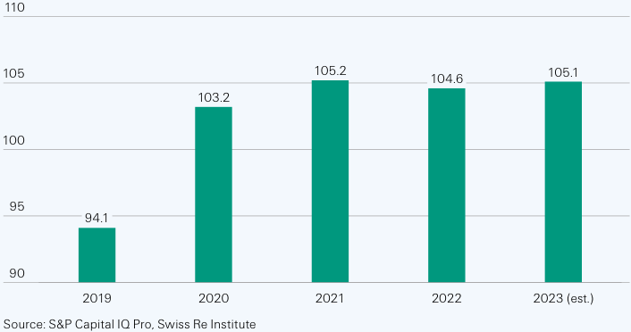

**----- Start of picture text -----** 
110 105 105.2 104.6 105.1 103.2 100 95 94.1 90 2019 2020 2021 2022 2023 (est.) Source: S&P Capital IQ Pro, Swiss Re Institute **----- End of picture text -----** 

Sustainable insurance requires that premiums are commensurate with the underlying risk. To keep up with rising losses, insurers have been requesting significant rate increases to reduce underwriting losses and also to compensate for the cost of capital being held as a buffer against the risk of catastrophic losses exceeding modelled expectations. However, in a world of rapidly growing risks, higher prices can make insurance less affordable, with the result that some lower income households may not buy cover. And, as losses rise, some insurance companies, particularly in hazard-prone regions, may cease to write new business. Such as in certain states in the US, including California and Florida, where, after recent-year loss experience, some insurers no longer underwrite new homeowner contracts. 

Less affordable insurance (for customers) and rising losses impacting insurance sector earnings may undermine prior improvements in insurance resilience in advanced markets. Our analysis reveals that the natural catastrophe resilience index improved from 32.7% in 2012 to nearly 37% in 2022 in advanced markets,[32] a signal that insurance coverage was growing faster than protection needs. At the same time, however, 63% of expected catastrophe losses in advanced and 95% in emerging economies remained uninsured, indicating continuation of a still-large natural catastrophe protection gap (USD 368 billion globally in 2022) and need for insurance uptake to grow faster still. 

> 31 _Homeowners Insurance Affordability: Countrywide Trends and State Comparisons_ , Insurance Research Council, 2023. 

> 32 _sigma_ 2/2023 Restoring resilience: the need to reload shock-absorbing capacity _,_ Swiss Re Institute, 2023. 

_sigma_ No 1/2024 **Swiss Re Institute** 23 

Managing property exposures: risk transfer and reduction 

For insurance to remain affordable, the growth in insurance costs, exposures and vulnerabilities need to be curbed. 

It’s not just about insurance costs. The industry does need to grow its resources at a significant pace to match the growing global demand for financial protection against evolving natural catastrophe risks. To narrow the global protection gap, non-life insurance capital needs to outgrow (expected) losses from natural disasters,[33] which have been increasing at a growth rate of around 6% per year in real terms since 1994. The insurance industry can grow its capital base while delivering adequate returns to shareholders (ie, earn its cost of capital) by collecting premiums commensurate with the rapidly growing risk exposure. However, in the future, the potential impacts of hazard intensification, in addition to other factors is likely to play an increasing role in making this more challenging. For insurance to remain affordable, the growth in insurance costs and exposures need to be curbed. Decreasing the size of losses and/or preventing losses from occurring in the first place will help bring down the cost of insurance products, safeguard industry sustainability and counteract widening protection gaps. 

## Structurally reducing catastrophe risks to safeguard societal and industry resilience 

The risk posed by extreme weather depends on the hazard, exposure, and vulnerability. 

Lowering weather-related property risks requires consideration of the three components of the risk equation (see Figure 18): 1) counteracting _hazard_ intensification (frequency and severity) through climate change mitigation; 2) minimising _exposure_ of lives, livelihoods and assets to hazards (eg, through changes in land use patterns, flood protection, etc. to avoid potential damages); and 3) reducing _vulnerability_ to these hazards (eg, taking measures to limit or better weather the impacts and moderate potential damages). 

## **Figure 18** 

The three components and drivers of weather-related risk, and actions to reduce it 

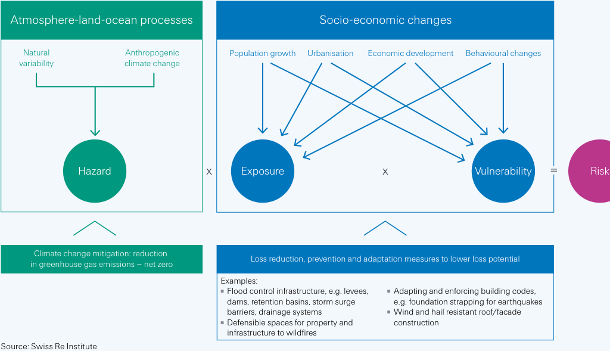

**----- Start of picture text -----** 
Atmosphere-land-ocean processes Socio-economic changes Natural Anthropogenic Population growth Urbanisation Economic development Behavioural changes variability climate change Hazard x Exposure x Vulnerability = Risk Climate change mitigation: reduction Loss reduction, prevention and adaptation measures to lower loss potential in greenhouse gas emissions – net zero Examples:   Flood control infrastructure, e.g. levees,    Adapting and enforcing building codes,  dams, retention basins, storm surge   e.g. foundation strapping for earthquakes  barriers, drainage systems   Wind and hail resistant roof/facade   Defensible spaces for property and   construction  infrastructure to wildfires Source: Swiss Re Institute **----- End of picture text -----** 

> 33 s _igma_ 4/2023 Raising the bar: non-life insurance in a higher-risk, higher-return world, Swiss Re Institute. 

24 **Swiss Re Institute** _sigma_ No 1/2024 

Managing property exposures: risk transfer and reduction 

Climate change mitigation is needed to Reducing greenhouse gas (GHG) emissions is essential to counter intensification of counter hazard intensification. climate-related physical risks. This involves a reshaping of the entire global energy system: how energy is generated, used, transported and stored. Additionally, agriculture processes need to be reformed, and carbon-capture and sequestration activities stepped up. According to the IMF, an orderly transition to net zero by 2050 could see a net global GDP benefit of close to 7% (relative to current policies), with more than half of the benefit stemming from avoiding losses resulting from acute weather risks (eg, floods, heatwaves and drought).[34] Apart from damages resulting from extreme weather events, we estimate that the GDP impact of _chronic_ physical risks (arising from the gradual increase in temperature over time, such as sea level rise and more prevalence of infectious diseases) could see the world lose up to 7–10% of GDP by mid-century if warming stays on the current trajectory, and the Paris Agreement target is not met.[35] 

Mitigation requires significant financial resources and faces various investment barriers. 

Climate change mitigation requires significant public and private investment, funding that, however, faces considerable barriers.[36] In 2022, we estimated a cumulative global investment gap of more than USD 270 trillion (USD 9.4 trillion on average annually) to bring about the economic transformation that would deliver net zero emissions by 2050.[37] Maintaining current spending trends and re-allocating some existing spending from high- to low-emission assets would fill almost half of the gap, still leaving an incremental ask of close to USD 5 trillion on average annually. The IEA estimates that for net zero annual global investment in clean energy alone needs to reach USD 4.2 trillion by 2030 from USD 1.7 trillion in 2023.[38] 

Already for the climate of today, loss The next line of defence against the impacts of severe weather is to reduce exposure reduction, prevention and adaptation are and/or vulnerability, such as avoiding further urban development in high-hazard areas needed to reduce vulnerability in particular. and improving the physical durability of buildings.[39] This would reduce the loss potential and provide a more sustainable basis for managing residual risks. There are many ways to temper the exposure and vulnerability of the built environment. These include loss prevention (eg, newer/expanded building codes and more robust building materials and techniques to build forward more resiliently), loss reduction (eg, renovating, modernising or retrofitting existing buildings), and adaptation measures more broadly (adjusting to the actual or expected future climate, eg, by increasing and/or improving flood protection infrastructure against storm surge/rising sea levels).[40] But it is unrealistic to expect construction and development in higher risk areas to stop or reverse all together, at least in the short- to medium term. This renders the state of property and infrastructure _vulnerability_ all the more important. 

The 2023 loss experience demonstrates the necessity of reducing vulnerabilities. 

The loss experience of 2023 emphasises again the importance of vulnerability reduction, and how catastrophic the effects can be amid the lack thereof: 

- ̤ **Reconfirmation that building codes greatly reduce property damage.** While the February earthquake in Turkey was the year’s most destructive natural catastrophe event, there were also buildings that withstood the force of the double shocks, because building codes had been properly enforced.[41] Still the high number of buildings that collapsed and the number of victims show how legacy housing – not built according to the latest building codes – continues to dis-proportionally affect the exposure to seismic risk in Turkey. This holds true in other parts of the world also, further emphasising the need to incorporate protection measures during construction. In addition, the year’s loss experience also pushes for inclusion of non-structural elements and related standards in building codes to improve overall susceptibility of buildings to SCS, especially hail, from which most SCS-related losses derive. Even if hazards cannot be prevented, human losses can be avoided and property damage reduced. 

- 34 The remainder of the benefits stem from avoiding _chronic_ physical risks arising from the gradual increase in temperature over time, such as sea level rise and more heat stress or prevalence of infectious diseases. See _Benefits of Accelerating the Climate Transition Outweigh the Costs,_ IMF, 5 December 2023, and also _The Economics of Climate Change: no action not an option_ , Swiss Re Institute, 2021. 

> 35 Ibid (Swiss Re Institute, 2021). 

> 36 _Changing climates: the heat is (still) on_ , Swiss Re Institute, February 2024. 

> 37 _Decarbonisation tracker: Progress to net zero through the lens of investment_ , Swiss Re Institute, October 2022. 

- 38 _World Energy Outlook 2023_ and _World Energy Investment 2023,_ International Energy Agency, 2023. 

- 39 _Managing Climate Risks, Facing up to Losses and Damages_ , OECD, November 2021. 

- 40 Adaptation of the built environment to climate change includes measures unrelated to natural hazardrelated loss reduction, such as improving environmental performance (eg, envelope design for heat/cooling efficiency). In this chapter we focus only on measures that reduce weather-related loss potential. 

- 41 _How Safer and More Resilient Schools Withstood the Earthquakes in Türkiye_ , World Bank, 2023. 

_sigma_ No 1/2024 **Swiss Re Institute** 25 

Managing property exposures: risk transfer and reduction 

- ̤ **Importance of resilient infrastructure.** Aging infrastructure can comprise a city’s preparedness for severe weather and other events, including heavy rainfall. In many cases, water infrastructure has been designed to standards developed using historical data for extreme rainfall. In rapidly changing, complex urban environments, even short-duration high-intensity rainfall events can overwhelm drainage infrastructure. This was the case, for example, with the flood events in Beijing, Hong Kong and Auckland and New York last year. Even worse, Storm Daniel resulted in heavy flooding in Libya in which more than 4 300 lives were lost, a reminder of the catastrophic consequences of massive infrastructure failure. The flood and storm surge occurred in a populated coastal area with much informal urban development and high socioeconomic vulnerability.[42] In the UK, on the other hand, flood defences, flood storage reservoirs and temporary barriers helped protect an estimated 96 000 properties during Storm Babet.[43] 

- ̤ **Need for a holistic approach to vulnerability reduction.** During Hurricane Otis, an unprecedented category 5 storm in Mexico, winds exceeded the design speeds for the region. Even though many buildings benefited from strong structures built to withstand earthquakes, significant damage was caused due to failure of lightweight building exteriors designed to improve seismic performance. As temperatures continue to warm, a forward-looking approach to vulnerability reduction is needed, one that anticipates changes in the risk landscape, including the shift of probability distributions due to hazard intensification and accounting for a wider array of risks. The inclusion of such factors in model simulation of different perils will deliver more accurate risk pricing. 

## Misaligned incentives and information barriers hinder vulnerability reduction 

Yet uptake of measures that reduce vulnerability often remains limited. 

## **Table 1** 

Share of jurisdictions in the US that have adopted hazard-resistant codes (Q3 2023) and associated benefit-to-cost ratios (national average in USD) 

As 2023 also demonstrates, despite the availability of vulnerability-reducing measures for individual assets and the knowledge that reducing susceptibility to hazards decreases avoidable losses, implementation of such measures remains limited. In the US, for example, only 31% of jurisdictions have adopted modern and more stringent building codes for new construction (see Table 1), even though the US National Institute of Building Sciences estimates the net benefit of adopting modern building codes in new construction to be USD 6–12 per USD 1 invested (see Table 1). A case in point is also the complete lack of building codes against hail risk. 

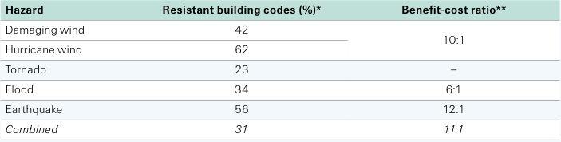

**----- Start of picture text -----** 
Hazard Resistant building codes (%)* Benefit-cost ratio** Damaging wind 42 10:1 Hurricane wind 62 Tornado 23 ‒ Flood 34 6:1 Earthquake 56 12:1 Combined 31 11:1 **----- End of picture text -----** 

Notes: *Resistant share reflects relevant jurisdictions that have adopted at least the 2018 International Building Code (IBC) and the International Residential Code (IRC) without weakening any natural hazard-resistant provisions. Tracking covers 22 000 jurisdictions, comprising most but not all the US. **The benefit-cost ratio reflects the net benefits of new design to comply with 2018 IBC and IRC requirements, relative to 1990 requirements. Source: * _Building Code Adoption Tracking | FEMA.gov_ ; ** _Natural Hazard Mitigation Saves: 2019 Report National Institute of Building Sciences (nibs.org)_ 

> 42 _Libya Storm and Flooding 2023 : Rapid Damage and Needs Assessment_ , World Bank 2023. 

> 43 _Nearly 100 000 properties protected from flooding during Storm Babet, but threat remains_ , Environment Agency, 20 October 2023. 

26 **Swiss Re Institute** _sigma_ No 1/2024 

Managing property exposures: risk transfer and reduction 

There are various impediments to Even where cost-benefit analyses yield net benefits, there are challenges to incentivising vulnerability reduction, from distorted investment in adaption measures. In practice, costs and benefits can accumulate to incentives… different actors, on different timelines and/or with different degrees of certainty.[44] Loss reduction measures often have high upfront costs but also uncertain future benefits for homeowners and property developers. Underinvestment in such measures may reflect limited ability to recover the costs through property values.[45] There is evidence that housing markets for example fail to capitalise flood risks into prices of properties.[46] A particular challenge is the need to retrofit the existing stock of aging buildings and infrastructure that predate modern codes and know-how, since retrofitting typically is less cost-effective.[47] 

...to information barriers. 

Alongside incentives, increased transparency can help homeowners and developers better understand the nature and likelihood of risks they may face, and foster risk-based insurance pricing. Information about risks and investments into risk reduction is not usually a standard consideration in the process of buying and selling a home.[48] The availability of better-quality information could be increased by including this in data collected and analysed by realtors, appraisers and mortgage providers.[49] Additional impediments to vulnerability reduction stem from behavioural biases and technical and institutional challenges.[50] 

Overcoming the barriers involves a societal effort. 

In addition to individual property owners, governments, regulators, supervisors and the insurance industry all play an important role in establishing, supporting and enforcing risk reduction (see Table 2). Governments and regulators set the fundamental rules and incentives that enable the expansion of vulnerability reduction as a public good, including around data collection on safety features and retrofitting. Supervisors can inform and encourage consumers to invest in risk prevention measures and incentivise transparent risk-based pricing by insurers. Insurers, in turn, can encourage risk reduction actions through price signals and premium discounts to policyholders who protect their property against damage.[51] 

Governments have a particular role to play in ensuring infrastructure resilience. 

When it comes to public infrastructure, governments (at various levels) typically hold the primary role in planning, sponsoring/financing and maintaining these assets, and also in reducing their vulnerability. Given the central role played by infrastructure in mitigating natural catastrophe exposure, state investment in infrastructure resilience can have broader positive implications, also for private assets. For example, following the construction of a flood levee in Roma, Queensland (Australia), homeowners’ premiums on more than 500 properties dropped by an average of 34%.[52] Moreover, infrastructure resilience can reduce indirect costs beyond property damage associated with infrastructure disruption. For example, OECD modelling of the potential impacts of a major flood in Paris found that 35–85% of the fall in business activity would be due to disruption to critical infrastructure, such as transport and power supplies.[53] 

> 44 _Investment in Disaster Risk Management in Europe Makes Economic Sense,_ International Bank for Reconstruction and Development and World Bank, 2021. 

- 45 T. Holzheu, G. Turner, “The Natural Catastrophe Protection Gap: Measurement, Root Causes and Ways of Addressing Underinsurance for Extreme Events” _, The Geneva Papers_ , 2018. 

- 46 O. Bin, C.E Landry, ”Changes in implicit flood risk premiums: Empirical evidence from the housing market,” _Journal of Environmental Economics and Management,_ vol 65, 2013. 

- 47 _Natural Hazard Mitigation Saves: 2019 Report,_ National Institute of Building Sciences, 1 December 2019. 48 Holzheu, Turner, op cit. 

- 49 Ibid. 

- 50 _World Development Report 2014: Risk and Opportunity—Managing Risk for Development_ , World Bank. 

- 51 _A call to action: the role of insurance supervisory in addressing natural catastrophe protection gaps_ , IAIS, November 2023. 

- 52 _Building a more resilient Australia_ , Insurance Council of Australia, February 2022 

> 53 _Climate-resilient Infrastructure, Policy Perspectives,_ OECD Environment Policy Paper No. 14, 2018. 

_sigma_ No 1/2024 **Swiss Re Institute** 27 

Managing property exposures: risk transfer and reduction 

## **Table 2** 

Measures for managing weather-related property risks 

**----- Start of picture text -----** 
Focus in risk  Primary equation/chain stakeholder(s) Main objective Measures Actions Mitigating  Reducing GHG emissions  ̤ Governments are in the lead to drive reductions in GHG emissions at scale, climate  which requires every area of the economy to decarbonise. change  ̤ Significant public and private investment is required. Mobilising private sector investment requires additional government support in the form of policies that create incentives and lower investment barriers.  ̤ The re/insurance industry can support by investing in mitigation actions as a long-term investor and/or can additionally catalyse investment by underwriting climate-positive projects and sharing risk knowledge. Climate  Increase uptake of latest   ̤ Governments and regulators set the fundamental rules and incentives for change  building codes and  lowering loss potential through building codes and zoning. adaptation expand standards  ̤ Governments also hold the primary role in planning, sponsoring/financing and maintaining resilient public infrastructure. Renovate, modernise or  ̤ Governments can provide incentives to relocate from high-risk areas after retrofit existing buildings a disaster.  ̤ Supervisors can inform and encourage consumers to invest in risk Zoning; changes in land  prevention measures and incentivise transparent risk-based pricing use by insurers.  ̤ Insurers can encourage risk reduction through price signals and underwriting standards. Adequate infrastructure   ̤ Mobilisation of private finance for climate change adaptation more broadly and early warning  requires enabling government support in the form of policies that create systems incentives and lower investment barriers. Managing  Improved and forward-  ̤ The insurance industry needs to grow its capacity and capital base in line residual risk  looking risk assessment with the rapidly growing risk exposures, while delivering adequate returns to shareholders.  ̤ Additionally, the insurance industry contributes by innovating risk Growth of non-life assessment and increasing risk awareness. insurance industry capital Risk reduction: hazard intensification  Risk reduction: exposure and/or vulnerability Risk transfer: private sector insurance Public sector  Private sector Insurance industry **----- End of picture text -----** 

Source: Swiss Re Institute 

Actions to reduce vulnerability to potential climate change effects is a must. 

A long-term approach to both mitigation and adaptation at societal level is needed to ensure that both current and increased catastrophe risks impacted by the changing climate are managed effectively. By reducing future vulnerability and increasing resilience, the cost of insurance coverage can be brought down, allowing rising insurance take-up and safeguarding insurance industry sustainability. It will also support global society in rising to the challenges that climate change brings. 

28 **Swiss Re Institute** _sigma_ No 1/2024 

## Concluding remarks 

Average annual growth trend of 5‒7% in insured losses from natural catastrophes re-affirmed. 

The pace of growth of global insured losses from natural catastrophe exceeds the rate of economic growth. Over the last 30 years, the relative loss burden compared to GDP has more than doubled. Further, the 2023 insured loss outcome reaffirms the 5–7% annual growth trend in global insured natural catastrophe losses since 1994, and we expect this to continue. Losses are set to increase in a world of fast evolving risks landscapes generated mostly by economic growth, urbanisation and the associated accumulation of assets that need insuring and also as, among others, hazard intensification for certain perils and regions due to climate change effects compound property damage outcomes. Surpassing the USD 100 billion insured-loss mark each year is the norm and in the near future, this level will itself likely be below trend. 

Lowering loss potential and safeguarding industry sustainability requires a societal effort. 

To better deal with the losses of today and prepare for the weather of tomorrow, loss potential needs to be reduced so that insurance is more affordable, protection gaps are narrowed and the business of insurance remains sustainable. Lowering loss potential requires climate change mitigation, loss reduction, and prevention and adaptation actions to minimise exposure and vulnerability to hazards. These measures involve societal effort: individual property owners, other private sector players, governments, regulators, supervisors, and the insurance industry all have a role to play. Reducing potential losses will enable the insurance industry to continue to play its role in covering the risks that remain outstanding after mitigation and adaptation actions take effect. 

_sigma_ No 1/2024 **Swiss Re Institute** 29 

## Appendix 1 

## Facts and figures 

## **Number of catastrophic events: 332** 

In terms of _sigma_ criteria, there were 332 catastrophes worldwide in 2023, up from 285 in 2022. There were 218 natural catastrophes (up from 187 in 2022), and 114 man-made disasters (up from 98 in 2022). 

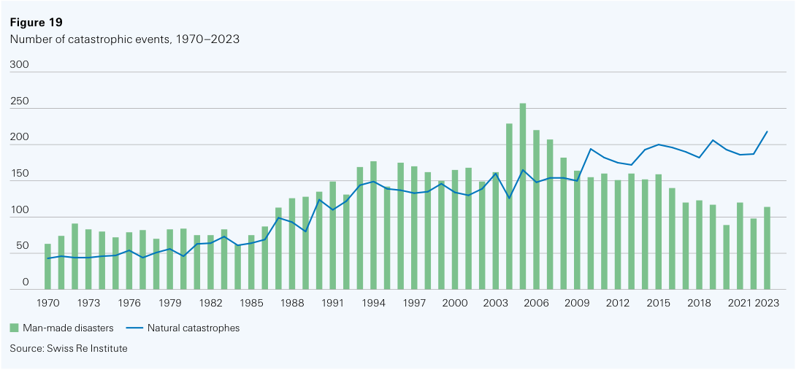

**----- Start of picture text -----** 
Figure 19 Number of catastrophic events, 1970–2023 300 250 200 150 100 50 0 1970 1973 1976 1979 1982 1985 1988 1991 1994 1997 2000 2003 2006 2009 2012 2015 2018 2021 2023 Man-made disasters Natural catastrophes Source: Swiss Re Institute **----- End of picture text -----** 

## **Number of victims: 76 569** 

Worldwide, 76 569 people are believed to have died or gone missing in disaster events in 2023. Natural catastrophes claimed 72 920 victims, the highest since 2010 and mostly from the earthquake disaster in Turkey and Syria (57 652). Man-made disasters claimed a further 3 649 victims. 

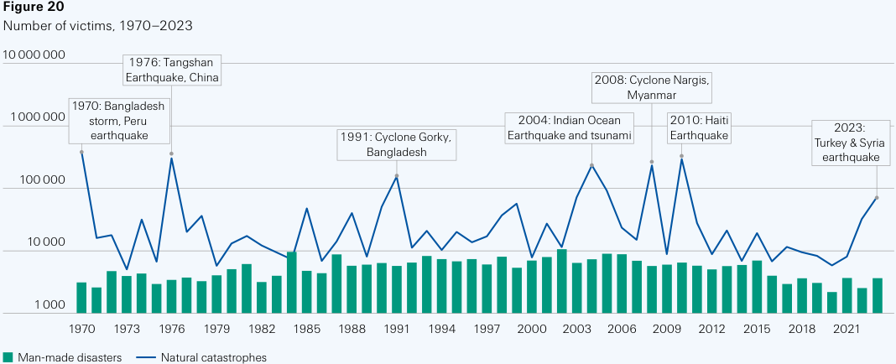

**----- Start of picture text -----** 
Figure 20 Number of victims, 1970–2023 10 000 000 1976: Tangshan Earthquake, China 2008: Cyclone Nargis, Myanmar 1970: Bangladesh 1 000 000 storm, Peru  2004: Indian Ocean 2010: Haiti 2023: earthquake 1991: Cyclone Gorky,  Earthquake and tsunami Earthquake Turkey & Syria Bangladesh earthquake 100 000 10 000 1 000 1970 1973 1976 1979 1982 1985 1988 1991 1994 1997 2000 2003 2006 2009 2012 2015 2018 2021 Man-made disasters Natural catastrophes **----- End of picture text -----** 

Note: Scale is logarithmic: the number of victims increases tenfold per band. Source: Swiss Re Institute 

30 **Swiss Re Institute** _sigma_ No 1/2024 

Appendix 1 

## **Global insured losses** 

The Turkey and Syria earthquake disaster, record high severe convective storms (SCS) and large-scale urban floods were the main events driving global insured losses from natural disasters of USD 108 billion in 2023. Though less than the USD 133 billion (inflation-adjusted) of 2022, last year’s insured losses were above the 5- and 10-year averages of USD 105 billion and USD 89 billion, respectively. 

## **Figure 21** 

Insured catastrophe losses, 1970–2023 (USD bn, 2023 prices) 

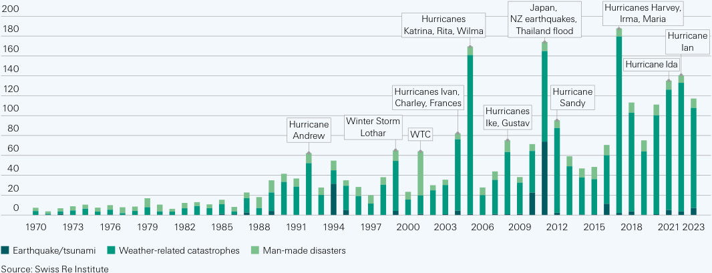

**----- Start of picture text -----** 
200 Japan,  Hurricanes Harvey, Hurricanes NZ earthquakes,  Irma, Maria 180 Katrina, Rita, Wilma Thailand food Hurricane 160 Ian Hurricane Ida 140 120 Hurricanes Ivan,  Hurricane 100 Charley, Frances Hurricanes Sandy Hurricane Winter Storm Ike, Gustav 80 Andrew Lothar WTC 60 40 20 0 1970 1973 1976 1979 1982 1985 1988 1991 1994 1997 2000 2003 2006 2009 2012 2015 2018 2021 2023 Earthquake/tsunami Weather-related catastrophes Man-made disasters Source: Swiss Re Institute **----- End of picture text -----** 

## **Primary and secondary perils** 

Record high losses from severe convective storms in the US brought the share of insured losses from so-called secondary perils (See Table 5 in Appendix 2) to roughly 81% in 2023, almost double the share in 2022 (43%). 

## **Figure 22** 

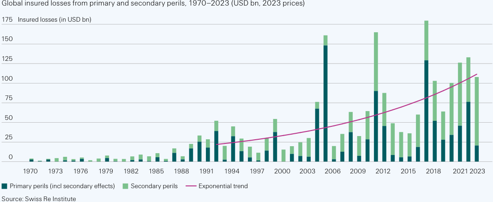

**----- Start of picture text -----** 
Global insured losses from primary and secondary perils, 1970–2023 (USD bn, 2023 prices) 175 Insured losses (in USD bn) 150 125 100 75 50 25 0 1970 1973 1976 1979 1982 1985 1988 1991 1994 1997 2000 2003 2006 2009 2012 2015 2018 2021 2023 Primary perils (incl secondary effects) Secondary perils Exponential trend Source: Swiss Re Institute **----- End of picture text -----** 

_sigma_ No 1/2024 **Swiss Re Institute** 31 

Appendix 1 

## **Total (natural catastrophe and man-made) economic losses: USD 291 billion** 

Economic losses were highest in Europe, driven by the Turkey earthquake disaster (USD 58 billion), large scale flood events and record high severe convective storms. 

## **Table 3** 

Economic losses, in USD billion and as a % of respective GDP, 2023 

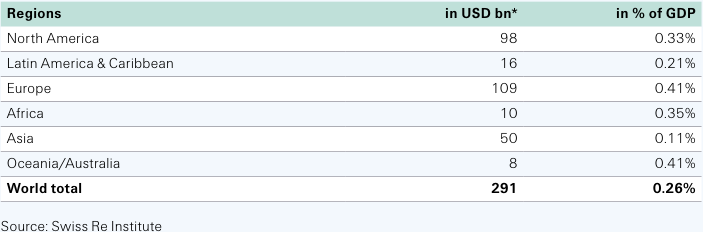

**----- Start of picture text -----** 
Regions in USD bn* in % of GDP North America 98 0.33% Latin America & Caribbean 16 0.21% Europe 109 0.41% Africa 10 0.35% Asia 50 0.11% Oceania/Australia 8 0.41% World total 291 0.26% Source: Swiss Re Institute **----- End of picture text -----** 

## **Global natural catastrophe protection gap: USD 172 billion** 

Figure 23 shows global economic and insured losses from natural catastrophes over time. This highlights the insurance protection gap (ie the financial loss generated by catastrophes not covered by insurance). In 2023, the global protection gap was USD 172 billion, up from USD 153 billion in 2022 and the previous 10-year average of USD 134 billion. 

**Figure 23** 

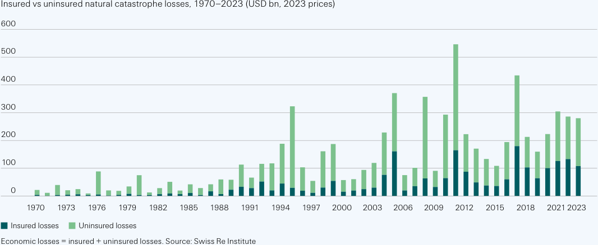

**----- Start of picture text -----** 
Insured vs uninsured natural catastrophe losses, 1970–2023 (USD bn, 2023 prices) 600 500 400 300 200 100 0 1970 1973 1976 1979 1982 1985 1988 1991 1994 1997 2000 2003 2006 2009 2012 2015 2018 2021 2023 Insured losses Uninsured losses Economic losses = insured + uninsured losses. Source: Swiss Re Institute **----- End of picture text -----** 

32 **Swiss Re Institute** _sigma_ No 1/2024 

Appendix 1 

## **Normalised economic losses** 

Figure 24 shows the normalised economic losses along with the inflated and nominal values of the same over the last 40 years. Normalising the losses from an event of the past, tells us the loss it would cause if it were to occur at equal magnitude and at the same location today. The elevated levels of economic damage than in the year of occurrence is due to exposure value accumulation. We thereby estimate that the annual growth rate of global normalised (adjusted for inflation and real GDP growth) losses from natural catastrophes between 1984 and 2023 is 1.2% based on a trend, still increasing but at much slower rate than shown by nominal losses (7.4%) and also real (adjusted for inflation) losses (4.7%) over the same time period. 

**Figure 24** 

Nominal, inflated and normalised economic losses from natural catastrophes (USD bn, 2023 prices) 

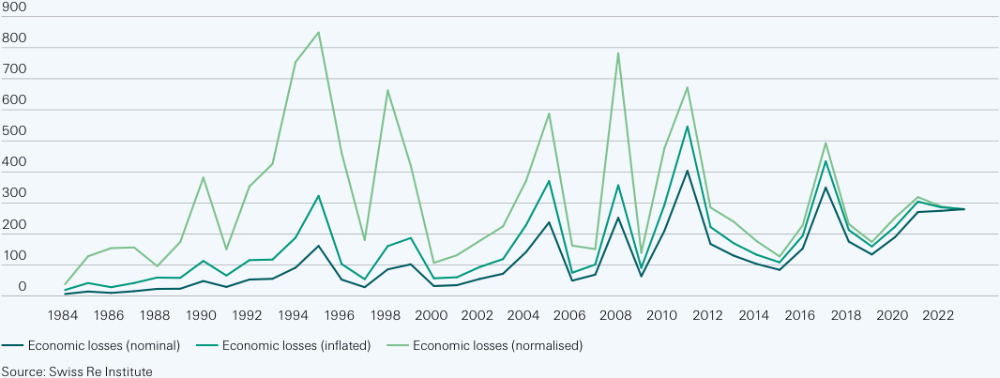

**----- Start of picture text -----** 
900 800 700 600 500 400 300 200 100 0 1984 1986 1988 1990 1992 1994 1996 1998 2000 2002 2004 2006 2008 2010 2012 2014 2016 2018 2020 2022 Economic losses (nominal) Economic losses (inflated) Economic losses (normalised) Source: Swiss Re Institute **----- End of picture text -----** 

_sigma_ No 1/2024 **Swiss Re Institute** 33 

Appendix 1 

## **Regional loss overview** 

Insured losses in North America, driven by record high severe convective storm perils. Next, insured losses in Europe were driven again by record high severe convective storm losses in Italy and a series of large scale earthquakes and flood. 

## **Table 4** 

Number of events (natural catastrophe and man-made), victims, economic and insured losses by region, 2023 

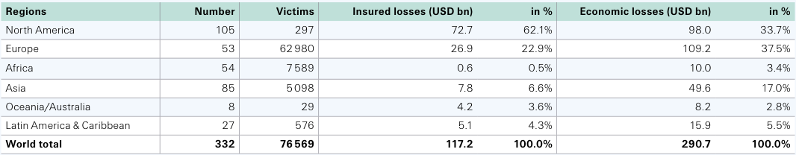

**----- Start of picture text -----** 
Regions Number Victims Insured losses (USD bn) in % Economic losses (USD bn) in % North America 105 297 72.7 62.1% 98.0 33.7% Europe 53 62 980 26.9 22.9% 109.2 37.5% Africa 54 7 589 0.6 0.5% 10.0 3.4% Asia 85 5 098 7.8 6.6% 49.6 17.0% Oceania/Australia 8 29 4.2 3.6% 8.2 2.8% Latin America & Caribbean 27 576 5.1 4.3% 15.9 5.5% World total 332 76 569 117.2 100.0% 290.7 100.0% **----- End of picture text -----** 

Note: some percentages may not add up to 100 due to rounding. Source: Swiss Re Institute 

## **Figure 25** 

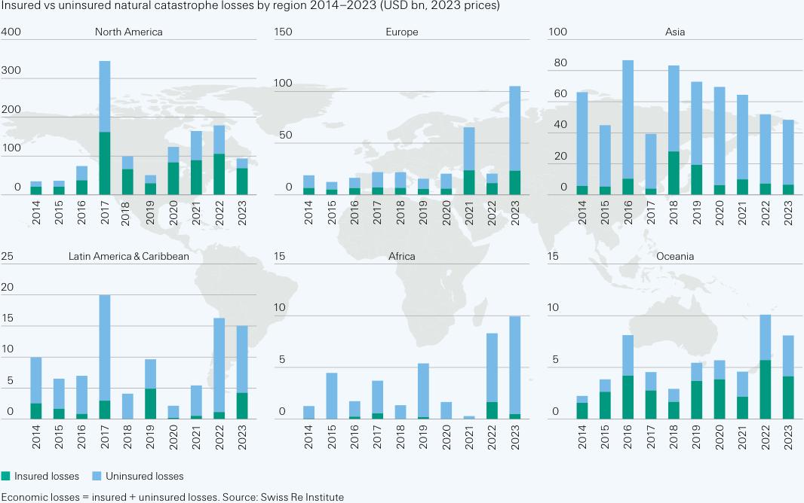

**----- Start of picture text -----** 
Insured vs uninsured natural catastrophe losses by region 2014–2023 (USD bn, 2023 prices) Figure 23 400Nominal, inflated (North America2023 prices) and   150 Europe 100 Asia normalised economic losses from 300natural catastrophes (USD bn) 80 100 60 200 40 50 100 20 0 0 0 25 Latin America & Caribbean 15 Africa 15 Oceania 20 10 10 15 Source: Swiss Re Institute 10 5 5 5 0 0 0 Insured losses Uninsured losses Economic losses = insured + uninsured losses. Source: Swiss Re Institute 2014 2015 2016 2017 2018 2019 2020 2021 2022 2023 2014 2015 2016 2017 2018 2019 2020 2021 2022 2023 2014 2015 2016 2017 2018 2019 2020 2021 2022 2023 2014 2015 2016 2017 2018 2019 2020 2021 2022 2023 2014 2015 2016 2017 2018 2019 2020 2021 2022 2023 2014 2015 2016 2017 2018 2019 2020 2021 2022 2023 **----- End of picture text -----** 

34 **Swiss Re Institute** _sigma_ No 1/2024 

## Appendix 2 

## Definition of terms 

## **Natural catastrophes** 

The term “natural catastrophe” refers to an event caused by natural forces. Such an event generally results in a large number of individual losses involving many insurance policies. The scale of the losses resulting from a catastrophe depends not only on the severity of the natural forces concerned, but also on man-made factors, such as building design or the efficiency of disaster control in the afflicted region. In this _sigma_ study, natural catastrophes are subdivided into the following categories: floods, storms, earthquakes, droughts/forest fires/heat waves, cold waves/frost, hail, tsunamis, and other natural catastrophes. 

## **Man-made disasters** 

This study categorises major events associated with human activities as “man-made” or “technical” disasters. Generally, a large object in a very limited space is affected, which is covered by a small number of insurance policies. War, civil war, and war-like events are excluded. _sigma_ subdivides man-made disasters into the following categories: major fires and explosions, aviation and space disasters, shipping disasters, rail disasters, mining accidents, collapse of buildings/bridges, and miscellaneous (including terrorism). 

## **Primary and secondary perils** 

Swiss Re Institute categorises natural catastrophes as primary and secondary perils. A key differentiator is the sophistication of insurance industry modelling for different perils with respect to the rigour of data collection, submission and underwriting consideration. Table 4 shows the distinction. 

**Table 5** 

Swiss Re Institute classification of primary and secondary perils 

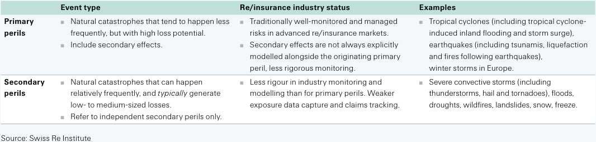

**----- Start of picture text -----** 
Event type Re/insurance industry status Examples Primary   ̤ Natural catastrophes that tend to happen less   ̤ Traditionally well-monitored and managed   ̤ Tropical cyclones (including tropical cyclone- perils frequently, but with high loss potential. risks in advanced re/insurance markets.  induced inland flooding and storm surge),  ̤ Include secondary effects.  ̤ Secondary effects are not always explicitly  earthquakes (including tsunamis, liquefaction modelled alongside the originating primary  and fires following earthquakes), peril, less rigorous monitoring.  winter storms in Europe. Secondary   ̤ Natural catastrophes that can happen   ̤ Less rigour in industry monitoring and   ̤ Severe convective storms (including perils relatively frequently, and  typically  generate  modelling than for primary perils. Weaker  thunderstorms, hail and tornadoes), floods, low- to medium-sized losses. exposure data capture and claims tracking. droughts, wildfires, landslides, snow, freeze.  ̤ Refer to independent secondary perils only. Source: Swiss Re Institute **----- End of picture text -----** 

## **Economic losses** 

For the purposes of the present _sigma_ study, economic losses are all the financial losses directly attributable to a major event, ie damage to buildings, infrastructure, vehicles etc. The term also includes losses due to business interruption as a direct consequence of the property damage. Insured losses are gross of any reinsurance, be it provided by commercial or government schemes. A figure identified as “total damage” or “economic loss” includes all damage, insured and uninsured. Total loss figures do not include indirect financial losses – ie loss of earnings by suppliers due to disabled businesses, estimated shortfalls in GDP and non-economic losses, such as loss of reputation or impaired quality of life. 

Generally, total (or economic) losses are estimated and communicated in very different ways. As a result, they are not directly comparable and should be seen only as an indication of the general order of magnitude. 

_sigma_ No 1/2024 **Swiss Re Institute** 35 

Appendix 2 

## **Insured losses** 

“Losses” refer to all insured losses except liability. Leaving aside liability losses, on one hand, allows a relatively swift assessment of the insurance year; on the other hand, however, it tends to understate the cost of man-made disasters. Life insurance losses are also not included. 

## **Adjustment for inflation** 

_sigma_ converts all losses for the occurrence year not given in USD into USD using the end-of-year exchange rate. To adjust for economic inflation, these USD values are extrapolated using the US consumer price index to give current (2023) values. 

For the 2023 reporting year, the lower loss thresholds were set as follows: 

|**_sigma_ thresholds for 2023**||
|---|---|
|Insured losses (threshold in USD m)||
|Maritime disasters|26.0|
|Aviation|51.9|
|Other losses|64.5|
|or Total economic losses (threshold in USD m)|129|
|or Casualties||
|Dead or missing|20|
|Injured|50|
|Homeless|2 000|

If changes to the loss amounts of previously published events become known, _sigma_ takes these into account in its database, but Swiss Re is under no obligation to publicly revise or update this _sigma_ study. 

## **Sources** 

Information is collected from newspapers, direct insurance and reinsurance periodicals, specialist publications (in printed or electronic form) and reports from insurers and reinsurers. In no event shall Swiss Re be liable for any loss or damage arising in connection with the use of this information (see the copyright information on the inside back cover). 

## **Published by:** 

Swiss Re Management Ltd Swiss Re Institute P.O. Box 8022 Zurich Switzerland 

Telephone +41 43 285 2551 Email institute@swissre.com 

## **Authors** 

Dr Chandan Banerjee Lucia Bevere Hendre Garbers Dr Balz Grollimund Roman Lechner Dr Andreas Weigel 

The authors thank Dr Thomas Holzheu and Yordanka Velichkova for their contributions to this report. 

## **Editor** 

Paul Ronke 

## **Managing editor** 

Dr Jerome Jean Haegeli Group Chief Economist 

Explore and visualise _sigma_ data on natural catastrophes and the world insurance markets at _www.sigma-explorer.com_ 

The editorial deadline for this study was 22 February 2024. 

_sigma_ is available on Swiss Re’s website: www.swissre.com/sigma 

The internet version may contain slightly updated information. 

Graphic design and production: Corporate Real Estate & Logistics / Media Production, Zurich 

©2024 Swiss Re All rights reserved. 

The entire content of this _sigma_ edition is subject to copyright with all rights reserved. The information may be used for private or internal purposes, provided that any copyright or other proprietary notices are not removed. Electronic reuse of the data published in _sigma_ is prohibited. 

Reproduction in whole or in part or use for any public purpose is permitted only with the prior written approval of Swiss Re and if the source reference “ _sigma_ 1/2024” is indicated. Courtesy copies are appreciated. 

Although all the information used in this study was taken from reliable sources, Swiss Re does not accept any responsibility for the accuracy or comprehensiveness of the information given or forward looking statements made. The information provided and forward-looking statements made are for informational purposes only and in no way constitute or should be taken to reflect Swiss Re’s position, in particular in relation to any ongoing or future dispute. In no event shall Swiss Re be liable for any loss or damage arising in connection with the use of this information and readers are cautioned not to place undue reliance on forward-looking statements. Swiss Re undertakes no obligation to publicly revise or update any forward-looking statements, whether as a result of new information, future events or otherwise. 

Swiss Re Management Ltd. Swiss Re Institute Mythenquai 50 /60 P.O. Box 8022 Zurich Switzerland 

Telephone +41 43 285 3095 swissre.com/institute 

